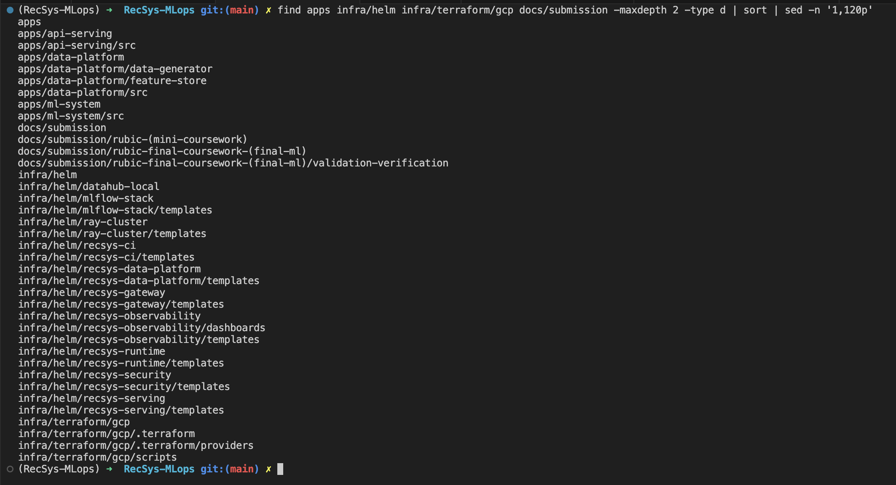
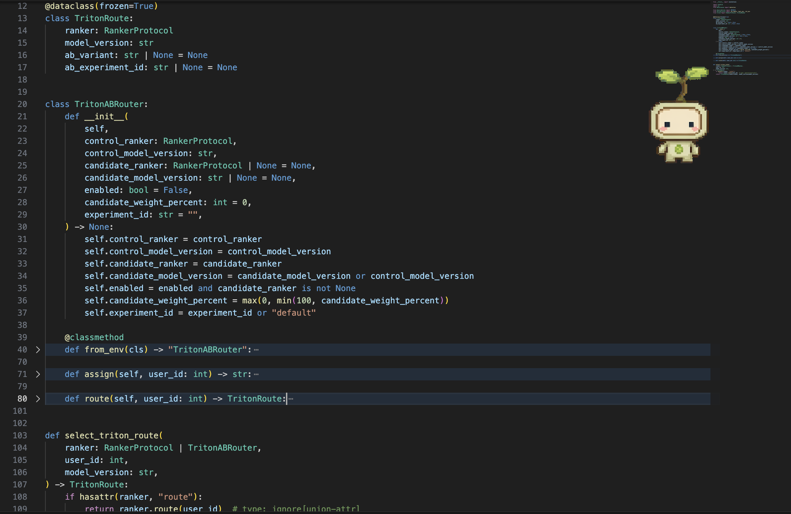
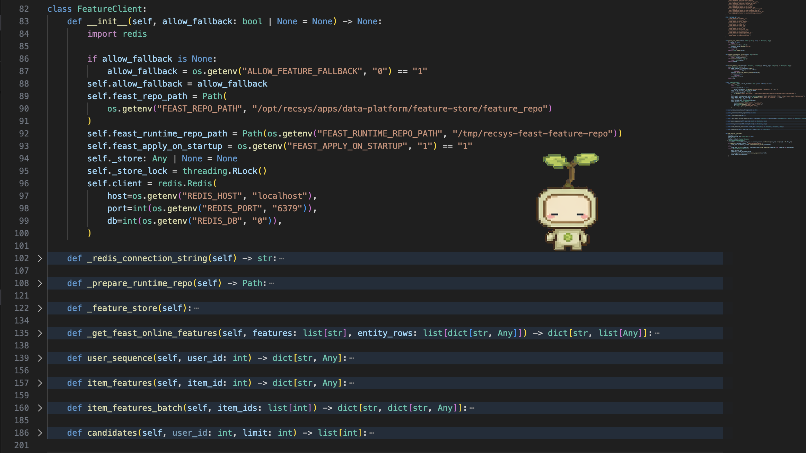
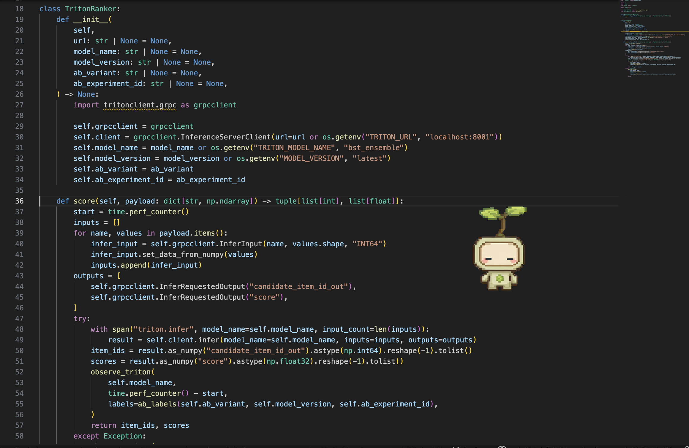
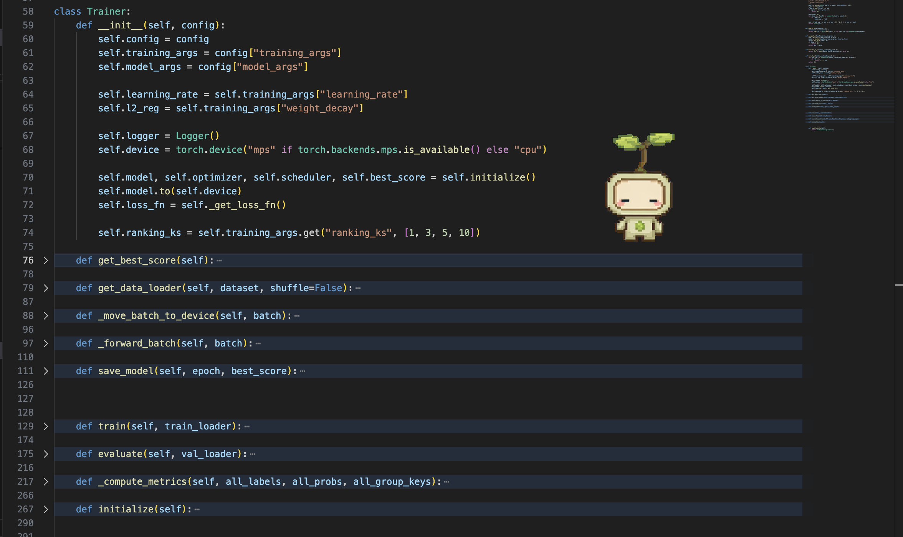
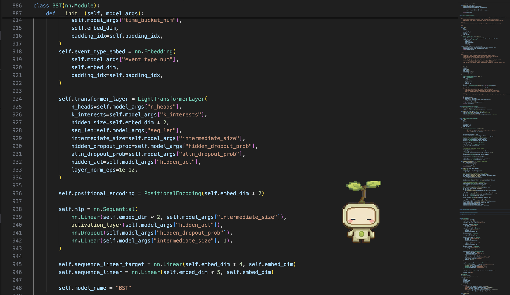
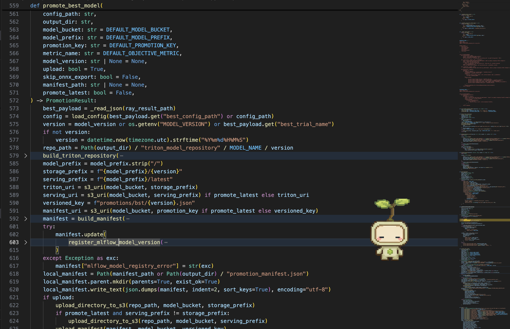
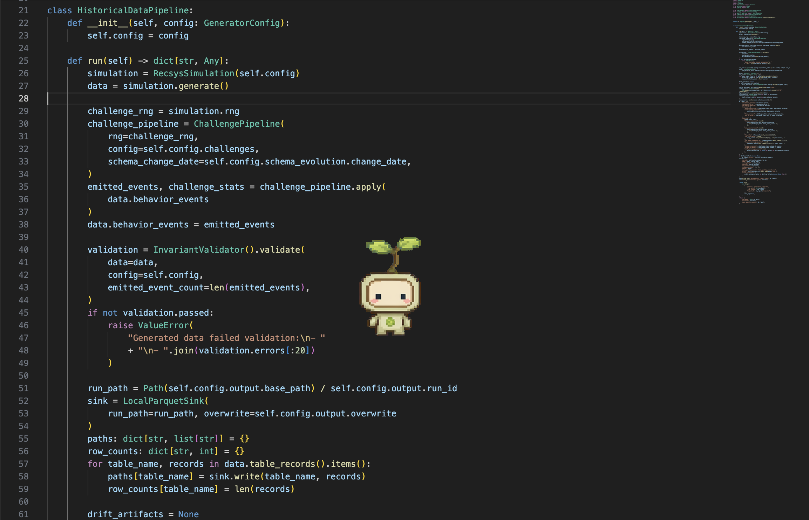
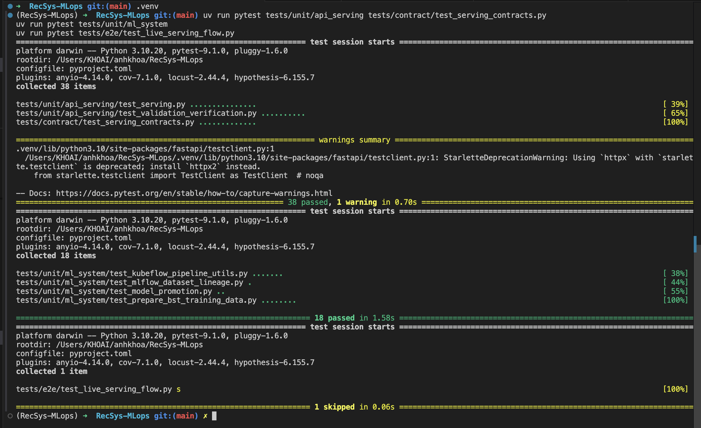

# Repository Design Proof

This proof covers the final-coursework rubric item **Repository Design: clean code, clean repo, and demonstrated design pattern usage**.

## Rubric Mapping

| Rubric requirement | Repository evidence |
|---|---|
| Clean repo | Source code is split by bounded context: API serving, data platform, ML system, infrastructure, tests, and submission docs. |
| Clean code | Runtime logic is decomposed into schema, routing, feature access, ranking, observability, orchestration, model training, and promotion modules. |
| Design pattern usage | The codebase uses Strategy/Router, Adapter/Gateway, Protocol/Dependency Injection, Template Method, Composite, Builder/Manifest, and Pipeline/Chain patterns. |
| Proof to capture | Screenshots of folder layout, tests, and code snippets where the design patterns are implemented. |

## Clean Repository Layout

The repository is organized around deployable and testable service boundaries instead of one large application folder.

```text
apps/
  api-serving/                 FastAPI recommendation API, online feature API, A/B router, Triton client
  data-platform/               Airflow, Spark, Flink, Feast feature store, ingestion, validation
  ml-system/                   BST model, Kubeflow pipeline, Ray Tune/DDP training, MLflow, promotion
infra/
  helm/                        Helm charts for serving, data platform, observability, security, gateway, CI
  terraform/gcp/               GCP/GKE infrastructure as code
  kubeflow/                    Compiled Kubeflow pipeline packages
jenkins/
  scripts/                     Shared path-based CI/CD scripts
tests/
  unit/                        Fast isolated tests by component
  contract/                    Manifest/chart/pipeline contract tests
  integration/                 Cross-service integration tests
  e2e/                         Live system verification tests
  load/                        Locust load-test scenarios
docs/
  submission/                  Rubric proof documents
  pngs/                        UI and terminal proof screenshots
```

The GCP Terraform layout follows the same separation of concerns.

| Terraform file | Responsibility |
|---|---|
| `apis.tf` | Required GCP APIs. |
| `network.tf` | VPC, subnet, secondary IP ranges. |
| `gke.tf` | GKE cluster and node pools. |
| `registry_storage.tf` | Artifact Registry and model/data storage buckets. |
| `cloudbuild.tf` | Cloud Build permissions and build integration. |
| `namespaces.tf` | Kubernetes namespaces and mesh injection labels. |
| `dependencies.tf` | Shared operators: cert-manager, KEDA, KServe, Istio, External Secrets. |
| `recsys_services.tf` | RecSys Helm releases. |
| `secret_management.tf` | Central source secrets for External Secrets Operator. |

### Code Reference

- [README.md line 42](../../../README.md#L42): top-level repository structure and navigation.
- [infra/terraform/gcp/gke.tf line 1](../../../infra/terraform/gcp/gke.tf#L1): GKE cluster and node-pool infrastructure boundary.
- [infra/helm/recsys-serving/templates/api-deployment.yaml line 1](../../../infra/helm/recsys-serving/templates/api-deployment.yaml#L1): API serving deployment boundary.
- [infra/helm/recsys-data-platform/templates/airflow.yaml line 1](../../../infra/helm/recsys-data-platform/templates/airflow.yaml#L1): data platform orchestration boundary.
- [infra/helm/recsys-security/templates/istio-authorization.yaml line 1](../../../infra/helm/recsys-security/templates/istio-authorization.yaml#L1): security policy boundary.

### Image Proof

**Capture command**

```bash
find apps infra/helm infra/terraform/gcp jenkins tests docs/submission -maxdepth 2 -type d | sort | sed -n '1,140p'
```



**Figure: Clean repository folder boundary proof.** This screenshot should show the high-level source tree split by ownership boundary. The important proof is that API serving, data platform, ML system, infrastructure, CI/CD, tests, and submission docs are separate directories instead of mixed together.

## Clean Code Boundaries

The code keeps each runtime responsibility in a focused module:

| Boundary | Main files | Responsibility |
|---|---|---|
| API schema | [apps/api-serving/src/api_schemas.py line 1](../../../apps/api-serving/src/api_schemas.py#L1) | Pydantic request/response contracts. |
| A/B routing | [apps/api-serving/src/ab_testing.py line 20](../../../apps/api-serving/src/ab_testing.py#L20) | Control/candidate routing and experiment labels. |
| Feature access | [apps/api-serving/src/online_features.py line 82](../../../apps/api-serving/src/online_features.py#L82) | Feast/Redis online feature access behind one client. |
| Ranking orchestration | [apps/api-serving/src/ranking.py line 122](../../../apps/api-serving/src/ranking.py#L122) | Recommendation flow: pull features, route ranker, build payload, format response. |
| Triton gateway | [apps/api-serving/src/triton.py line 18](../../../apps/api-serving/src/triton.py#L18) | Triton gRPC inference client. |
| Training loop | [apps/ml-system/src/models/trainer.py line 58](../../../apps/ml-system/src/models/trainer.py#L58) | BST training/evaluation lifecycle. |
| Model promotion | [apps/ml-system/src/registry/model_promotion.py line 559](../../../apps/ml-system/src/registry/model_promotion.py#L559) | Export, register, upload, and manifest generation. |
| Data generation pipeline | [apps/data-platform/data-generator/src/pipeline.py line 21](../../../apps/data-platform/data-generator/src/pipeline.py#L21) | Simulation, challenge injection, validation, sink writing, manifest output. |

### Image Proof


**Figure: Clean-code module proof.** Capture the IDE/file explorer or code search view showing the separated API modules: `api_schemas.py`, `ab_testing.py`, `online_features.py`, `ranking.py`, `triton.py`, and `observability.py`. This proves the serving service is not a single monolithic file.

## Design Patterns In Code

### Pattern 1: Strategy / Router For A/B Inference

**Intent:** choose one of several interchangeable model-serving strategies at runtime without changing the recommendation flow.

**Implementation:** `TritonABRouter` owns the control/candidate route selection. `recommend()` only asks `select_triton_route()` for the route, then calls the selected ranker. The routing decision is isolated from payload building and response formatting.

| Code reference | What to point out in the screenshot |
|---|---|
| [apps/api-serving/src/ab_testing.py line 20](../../../apps/api-serving/src/ab_testing.py#L20) | `TritonABRouter` encapsulates A/B routing state. |
| [apps/api-serving/src/ab_testing.py line 71](../../../apps/api-serving/src/ab_testing.py#L71) | `assign()` maps a user deterministically to control/candidate. |
| [apps/api-serving/src/ab_testing.py line 80](../../../apps/api-serving/src/ab_testing.py#L80) | `route()` returns a `TritonRoute` with ranker, variant, experiment, and model version. |
| [apps/api-serving/src/ranking.py line 128](../../../apps/api-serving/src/ranking.py#L128) | `recommend()` delegates model choice to `select_triton_route()`. |



**Figure: Strategy/Router design pattern proof.** Capture `TritonABRouter.assign()`, `TritonABRouter.route()`, and the `recommend()` call to `select_triton_route()`. This proves model routing is a replaceable strategy instead of hard-coded `if candidate then call service B` logic inside the ranking flow.

### Pattern 2: Adapter / Gateway For Online Feature Store Access

**Intent:** hide storage-specific details behind a small domain client so API code does not depend directly on Redis/Feast calls everywhere.

**Implementation:** `FeatureClient` adapts Feast online retrieval and Redis configuration into domain methods such as `user_sequence()` and `item_features_batch()`. The ranking flow depends on feature operations, not low-level storage commands.

| Code reference | What to point out in the screenshot |
|---|---|
| [apps/api-serving/src/online_features.py line 82](../../../apps/api-serving/src/online_features.py#L82) | `FeatureClient` is the adapter boundary. |
| [apps/api-serving/src/online_features.py line 122](../../../apps/api-serving/src/online_features.py#L122) | Lazy construction of Feast `FeatureStore`. |
| [apps/api-serving/src/online_features.py line 139](../../../apps/api-serving/src/online_features.py#L139) | Domain method for user sequence features. |
| [apps/api-serving/src/online_features.py line 160](../../../apps/api-serving/src/online_features.py#L160) | Domain method for batch item features. |



**Figure: Adapter/Gateway design pattern proof.** Capture `FeatureClient` and one of its domain methods. This proves Redis/Feast details are localized in one gateway class while the serving code consumes a clean feature API.

### Pattern 3: Protocol + Dependency Injection For Ranker Substitution

**Intent:** allow production Triton ranker and test/deterministic rankers to share the same interface.

**Implementation:** `RankerProtocol` defines the expected `score()` method. `TritonRanker` implements that protocol for production, and tests can inject fake rankers without starting Triton.

| Code reference | What to point out in the screenshot |
|---|---|
| [apps/api-serving/src/triton.py line 13](../../../apps/api-serving/src/triton.py#L13) | `RankerProtocol` defines the ranker interface. |
| [apps/api-serving/src/triton.py line 18](../../../apps/api-serving/src/triton.py#L18) | `TritonRanker` implements production gRPC inference. |
| [apps/api-serving/src/ranking.py line 122](../../../apps/api-serving/src/ranking.py#L122) | `recommend()` receives a `RankerProtocol` or `TritonABRouter` dependency. |
| [tests/unit/api_serving/test_split_services.py line 22](../../../tests/unit/api_serving/test_split_services.py#L22) | Unit tests inject deterministic rankers. |



**Figure: Protocol/Dependency Injection design pattern proof.** Capture `RankerProtocol`, `TritonRanker`, and a fake/deterministic test ranker. This proves the ranking flow is testable because the model-serving dependency can be replaced.

### Pattern 4: Template Method Style Training Loop

**Intent:** keep training and evaluation flow consistent while reusing shared batch movement, forward pass, and metric computation.

**Implementation:** `Trainer.train()` and `Trainer.evaluate()` follow the same high-level algorithm: move batch to device, call `_forward_batch()`, compute loss/probabilities, collect group keys, then call `_compute_metrics()`. The differences are the training-only optimizer step and evaluation-only `torch.no_grad()`.

| Code reference | What to point out in the screenshot |
|---|---|
| [apps/ml-system/src/models/trainer.py line 88](../../../apps/ml-system/src/models/trainer.py#L88) | `_move_batch_to_device()` shared step. |
| [apps/ml-system/src/models/trainer.py line 97](../../../apps/ml-system/src/models/trainer.py#L97) | `_forward_batch()` shared step. |
| [apps/ml-system/src/models/trainer.py line 129](../../../apps/ml-system/src/models/trainer.py#L129) | `train()` algorithm skeleton. |
| [apps/ml-system/src/models/trainer.py line 175](../../../apps/ml-system/src/models/trainer.py#L175) | `evaluate()` algorithm skeleton. |
| [apps/ml-system/src/models/trainer.py line 217](../../../apps/ml-system/src/models/trainer.py#L217) | `_compute_metrics()` shared metric step. |



**Figure: Template Method style training proof.** Capture `train()`, `evaluate()`, and the helper methods they share. This proves training/evaluation are not duplicated as unrelated scripts; they use a common lifecycle and reusable steps.

### Pattern 5: Composite Neural Network Module

**Intent:** build a complex BST recommender by composing smaller PyTorch modules.

**Implementation:** `BST` combines embedding layers, `LightTransformerLayer`, positional encoding, MLP layers, and linear projections. Each piece remains a testable `nn.Module` or standard PyTorch layer.

| Code reference | What to point out in the screenshot |
|---|---|
| [apps/ml-system/src/models/model.py line 856](../../../apps/ml-system/src/models/model.py#L856) | `PositionalEncoding` is a reusable module. |
| [apps/ml-system/src/models/model.py line 886](../../../apps/ml-system/src/models/model.py#L886) | `BST` is the composite model. |
| [apps/ml-system/src/models/model.py line 893](../../../apps/ml-system/src/models/model.py#L893) | Entity embedding modules. |
| [apps/ml-system/src/models/model.py line 924](../../../apps/ml-system/src/models/model.py#L924) | Transformer layer composition. |
| [apps/ml-system/src/models/model.py line 938](../../../apps/ml-system/src/models/model.py#L938) | MLP composition with `nn.Sequential`. |



**Figure: Composite neural module proof.** Capture the `BST.__init__()` block showing embeddings, transformer layer, positional encoding, and MLP. This proves the model is composed from smaller modules instead of one unstructured forward implementation.

### Pattern 6: Builder / Manifest Generator For Model Promotion

**Intent:** build a deployable model artifact in a repeatable order and emit a manifest that downstream CD can consume.

**Implementation:** `promote_best_model()` orchestrates a deterministic sequence: read best Ray result, build Triton repository, choose versioned paths, build manifest, register MLflow model version, write/upload artifacts, and optionally promote `latest`.

| Code reference | What to point out in the screenshot |
|---|---|
| [apps/ml-system/src/registry/model_promotion.py line 405](../../../apps/ml-system/src/registry/model_promotion.py#L405) | `build_triton_repository()` assembles Triton model layout. |
| [apps/ml-system/src/registry/model_promotion.py line 471](../../../apps/ml-system/src/registry/model_promotion.py#L471) | `build_manifest()` constructs deployment metadata. |
| [apps/ml-system/src/registry/model_promotion.py line 511](../../../apps/ml-system/src/registry/model_promotion.py#L511) | `register_mlflow_model_version()` writes registry metadata. |
| [apps/ml-system/src/registry/model_promotion.py line 559](../../../apps/ml-system/src/registry/model_promotion.py#L559) | `promote_best_model()` coordinates the promotion flow. |



**Figure: Builder/Manifest design pattern proof.** Capture `promote_best_model()`, `build_triton_repository()`, and `build_manifest()`. This proves deployment artifacts are assembled through a controlled builder flow, not by manual copy/paste steps.

### Pattern 7: Pipeline / Chain For Data Generation

**Intent:** make synthetic data generation a predictable sequence of independent processing stages.

**Implementation:** `HistoricalDataPipeline.run()` executes a clear chain: simulate data, inject challenges, validate invariants, write parquet tables, optionally write drift artifacts, then write a data-quality report and manifest.

| Code reference | What to point out in the screenshot |
|---|---|
| [apps/data-platform/data-generator/src/pipeline.py line 21](../../../apps/data-platform/data-generator/src/pipeline.py#L21) | `HistoricalDataPipeline` owns the generation flow. |
| [apps/data-platform/data-generator/src/pipeline.py line 26](../../../apps/data-platform/data-generator/src/pipeline.py#L26) | Simulation stage. |
| [apps/data-platform/data-generator/src/pipeline.py line 30](../../../apps/data-platform/data-generator/src/pipeline.py#L30) | Challenge injection stage. |
| [apps/data-platform/data-generator/src/pipeline.py line 40](../../../apps/data-platform/data-generator/src/pipeline.py#L40) | Validation stage. |
| [apps/data-platform/data-generator/src/pipeline.py line 51](../../../apps/data-platform/data-generator/src/pipeline.py#L51) | Sink/write stage. |
| [apps/data-platform/data-generator/src/pipeline.py line 116](../../../apps/data-platform/data-generator/src/pipeline.py#L116) | Manifest/report output stage. |



**Figure: Pipeline/Chain design pattern proof.** Capture `HistoricalDataPipeline.run()`. This proves the generator is structured as a sequence of explicit stages, which makes data-quality failures and drift artifact generation easier to reason about.

## Tests Showing Repository Boundaries

The tests are split by confidence level, matching the repository boundaries.

```bash
uv run pytest tests/unit/api_serving tests/unit/ml_system tests/unit/data_generator
uv run pytest tests/contract
uv run pytest tests/e2e/test_live_serving_flow.py
```

`pyproject.toml` configures import paths for local packages, so tests can run from the repository root without copying source files into test folders.

### Image Proof



**Figure: Repository boundary tests proof.** This screenshot should show unit and contract tests passing from the repository root. It proves the code is organized into importable modules with testable boundaries, not scripts that only work from one local directory.

## Screenshot Checklist

Use these screenshots to satisfy the rubric item **"Capture màn hình thể hiện Design Pattern đã được sử dụng trong code"**:

| Screenshot file | What to capture | Why it proves the rubric |
|---|---|---|
| `docs/pngs/clean_repo_evidence.png` | Folder tree from `find apps infra/helm infra/terraform/gcp jenkins tests docs/submission ...` | Shows clean repo/service boundaries. |
| `docs/pngs/repo_clean_code_modules.png` | IDE/code search showing API serving modules split by responsibility | Shows clean code decomposition. |
| `docs/pngs/repo_design_pattern_strategy_router.png` | `TritonABRouter` + `recommend()` route call | Shows Strategy/Router pattern. |
| `docs/pngs/repo_design_pattern_feature_adapter.png` | `FeatureClient` methods | Shows Adapter/Gateway pattern. |
| `docs/pngs/repo_design_pattern_ranker_protocol.png` | `RankerProtocol`, `TritonRanker`, fake test ranker | Shows Protocol + Dependency Injection. |
| `docs/pngs/repo_design_pattern_template_trainer.png` | `Trainer.train()`, `Trainer.evaluate()`, helper methods | Shows Template Method style lifecycle. |
| `docs/pngs/repo_design_pattern_composite_model.png` | `BST.__init__()` composed modules | Shows Composite pattern. |
| `docs/pngs/repo_design_pattern_builder_manifest.png` | model promotion builder/manifest functions | Shows Builder/Manifest pattern. |
| `docs/pngs/repo_design_pattern_data_pipeline.png` | `HistoricalDataPipeline.run()` | Shows Pipeline/Chain pattern. |
| `docs/pngs/tests_proof.png` | Unit/contract test run | Shows code boundaries are testable. |
