# Routing & Gateway (NGINX Ingress Controller)

**Domain:** `recsys-mlops.site`

NGINX Ingress Controller is the public gateway for RecSys services. The backend
Kubernetes services stay internal, while DNS points the public subdomains to the
single NGINX LoadBalancer IP.

## Domain Setup For All 4 Services

| Service | Public domain | Internal backend |
| --- | --- | --- |
| Web API Pull Data service | `api.recsys-mlops.site` | `recsys-online-feature-api.api-serving.svc.cluster.local:80` |
| Metric service | `metrics.recsys-mlops.site` | `recsys-grafana.observability.svc.cluster.local:3000` |
| Log service | `log.recsys-mlops.site` | `recsys-loki.observability.svc.cluster.local:3100` |
| Trace service | `traces.recsys-mlops.site` | `recsys-tempo.observability.svc.cluster.local:3200` |

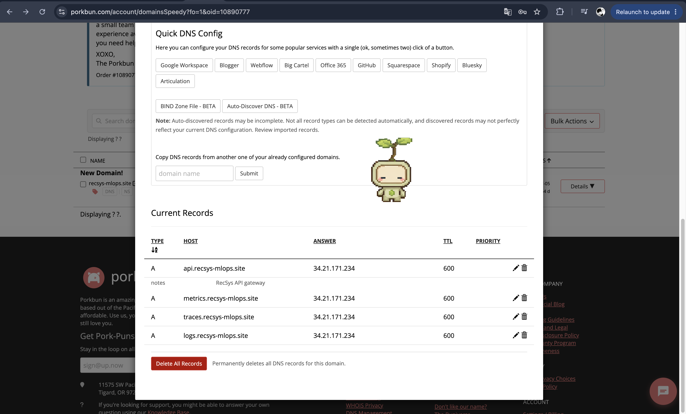

**Figure: Domain setup for all gateway services.** The DNS provider has four
public `A` records: `api.recsys-mlops.site`, `metrics.recsys-mlops.site`,
`log.recsys-mlops.site`, and `traces.recsys-mlops.site`. All records point to
the NGINX Ingress Controller LoadBalancer IP `34.21.171.234`, proving that the
public domains enter the platform through the same gateway.

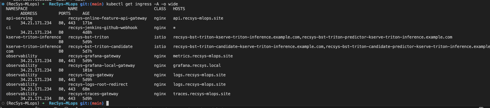

**Figure: NGINX gateway, domain, and HTTPS setup for all 4 services.** The
proof shows the four public routes are configured on NGINX Ingress with their
production domains: `api.recsys-mlops.site`, `metrics.recsys-mlops.site`,
`log.recsys-mlops.site`, and `traces.recsys-mlops.site`. Each route is mapped
to its internal Kubernetes service and has HTTPS/TLS enabled, proving that the
gateway is the single secured entrypoint for the Web API, metrics, logs, and
traces services.

## Metric Service

The metric service is Grafana behind the NGINX gateway. The production host is
`https://metrics.recsys-mlops.site`.

### Code Reference

- [`values.yaml`](../../../infra/helm/recsys-gateway/values.yaml): Grafana host, TLS, authentication, and rate-limit values.
- [`grafana-ingress.yaml`](../../../infra/helm/recsys-gateway/templates/grafana-ingress.yaml): renders the NGINX `Ingress` and security annotations.

### Basic Auth & Rate Limit Proof

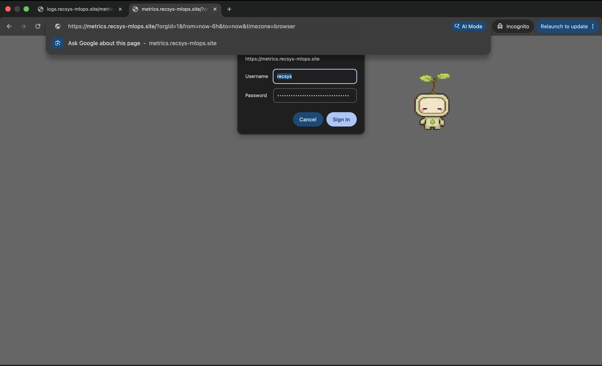

**Figure: Basic auth proof for metric service.** Accessing
`https://metrics.recsys-mlops.site` without valid gateway credentials returns a
Basic Auth challenge or `401 Unauthorized`, proving Grafana is protected before
the request reaches the internal `recsys-grafana` service.

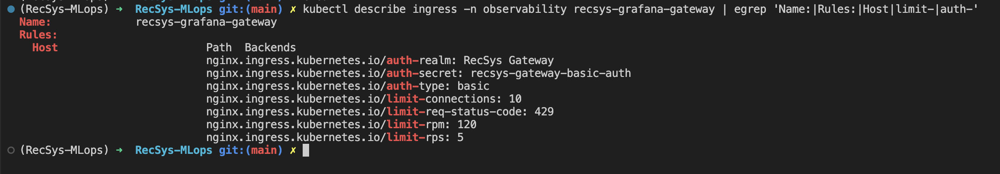

**Figure: Rate limit proof for metric service.** The CLI proof shows the
Grafana ingress annotations and/or burst-test result for
`https://metrics.recsys-mlops.site`; excess requests are throttled by NGINX and
return HTTP `429`.

### Image Proof Enable HTTPS

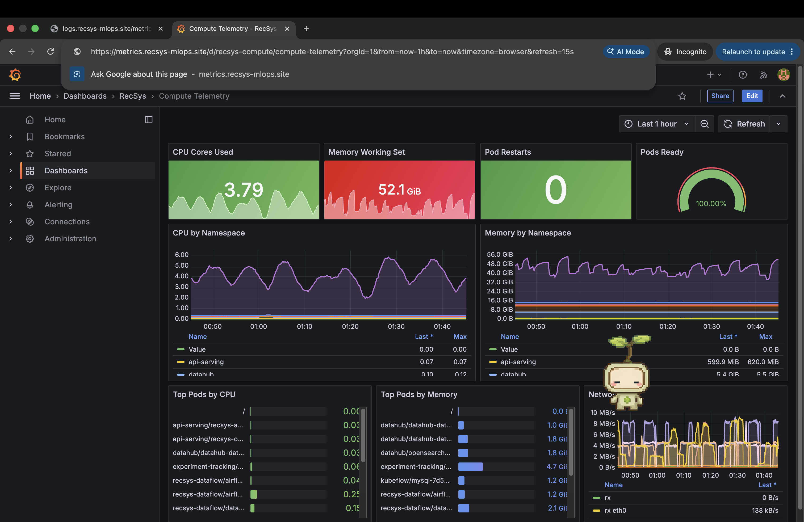

**Figure: Metric service HTTPS proof.** The browser loads Grafana through
`https://metrics.recsys-mlops.site` with HTTPS enabled, proving the metric UI is
published through the NGINX gateway domain while the Kubernetes service remains
internal.

## Trace Service

The trace service is Tempo behind the NGINX gateway. The production host is
`https://traces.recsys-mlops.site`.

### Code Reference

- [`values.yaml`](../../../infra/helm/recsys-gateway/values.yaml): Tempo host, TLS, authentication, and rate-limit values.
- [`traces-ingress.yaml`](../../../infra/helm/recsys-gateway/templates/traces-ingress.yaml): renders the trace route and security annotations.

### Basic Auth & Rate Limit Proof

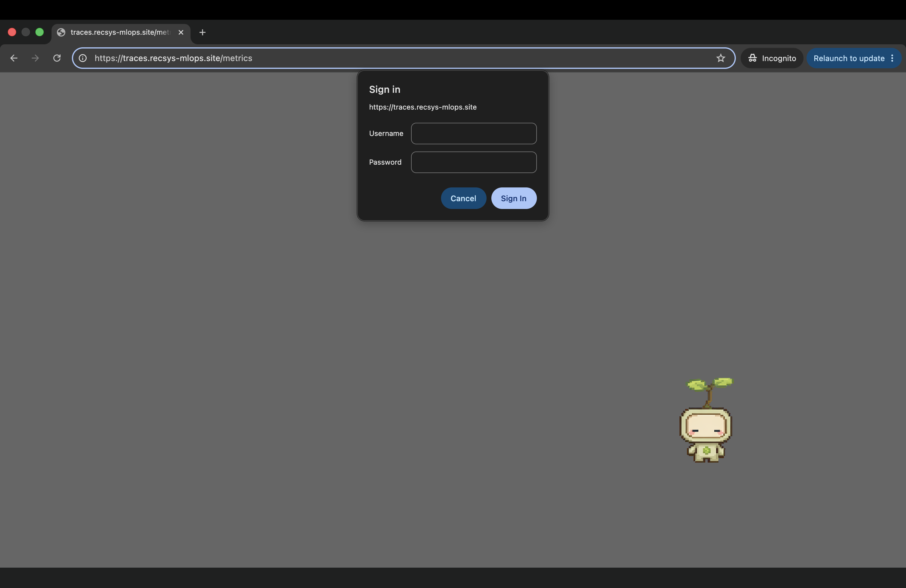

**Figure: Basic auth proof for trace service.** Accessing
`https://traces.recsys-mlops.site` without valid gateway credentials returns a
Basic Auth challenge or `401 Unauthorized`, proving Tempo is protected at the
gateway layer.

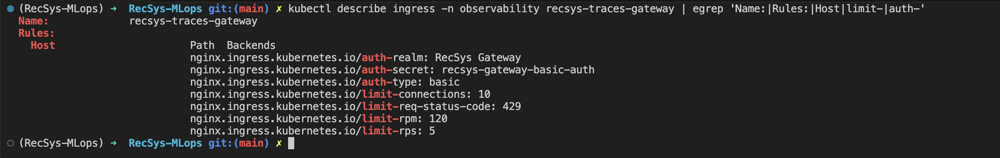

**Figure: Rate limit proof for trace service.** The CLI proof shows the trace
ingress rate-limit annotations and/or burst-test result for
`https://traces.recsys-mlops.site`; NGINX returns HTTP `429` when requests exceed
the configured gateway limit.

### Image Proof Enable HTTPS

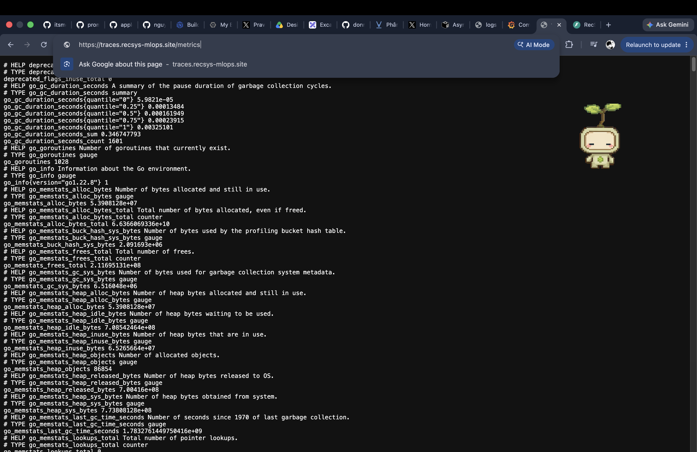

**Figure: Trace service HTTPS proof.** The trace endpoint is reached through
`https://traces.recsys-mlops.site`, proving HTTPS is enabled on the public trace
gateway route.

## Log Service

The log service is Loki behind the NGINX gateway. The production host is
`https://log.recsys-mlops.site`.

### Code Reference

- [`values.yaml`](../../../infra/helm/recsys-gateway/values.yaml): Loki host, TLS, authentication, and rate-limit values.
- [`logs-ingress.yaml`](../../../infra/helm/recsys-gateway/templates/logs-ingress.yaml): renders the log route and security annotations.

### Basic Auth & Rate Limit Proof

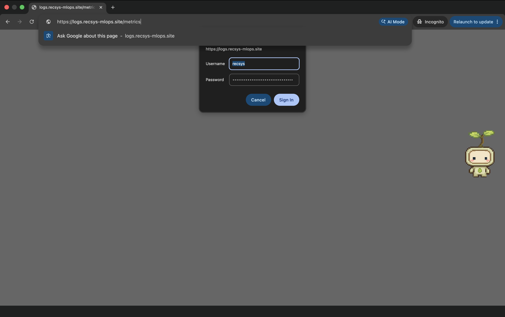

**Figure: Basic auth proof for log service.** Accessing
`https://log.recsys-mlops.site` without valid gateway credentials returns a
Basic Auth challenge or `401 Unauthorized`, proving Loki is not publicly exposed
without gateway authentication.

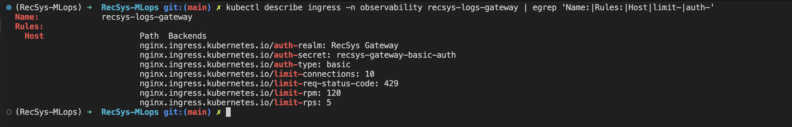

**Figure: Rate limit proof for log service.** The CLI proof shows the Loki
ingress rate-limit annotations and/or burst-test result for
`https://log.recsys-mlops.site`; excess requests are throttled by NGINX with
HTTP `429`.

### Image Proof Enable HTTPS

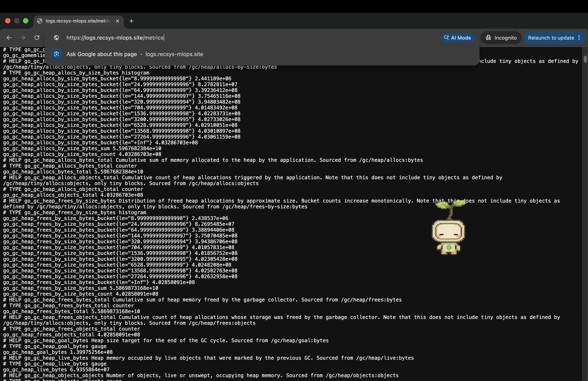

**Figure: Log service HTTPS proof.** The log endpoint is reached through
`https://log.recsys-mlops.site`, proving HTTPS is enabled on the public log
gateway route.

## Web API Pull Data Service

The Web API Pull Data service is the FastAPI online feature API behind the NGINX
gateway. The production host is `https://api.recsys-mlops.site`.

### Code Reference

- [`feature_api.py`](../../../apps/api-serving/src/feature_api.py): `RecSys Online Feature API` and `POST /online-features`.
- [`feature-api-ingress.yaml`](../../../infra/helm/recsys-gateway/templates/feature-api-ingress.yaml): route, Basic Auth, rate limit, and TLS annotations.
- [`values.yaml`](../../../infra/helm/recsys-gateway/values.yaml), [`recsys_services.tf`](../../../infra/terraform/gcp/recsys_services.tf): enable the route and derive its host from `gateway_domain`.

### Basic Auth & Rate Limit Proof

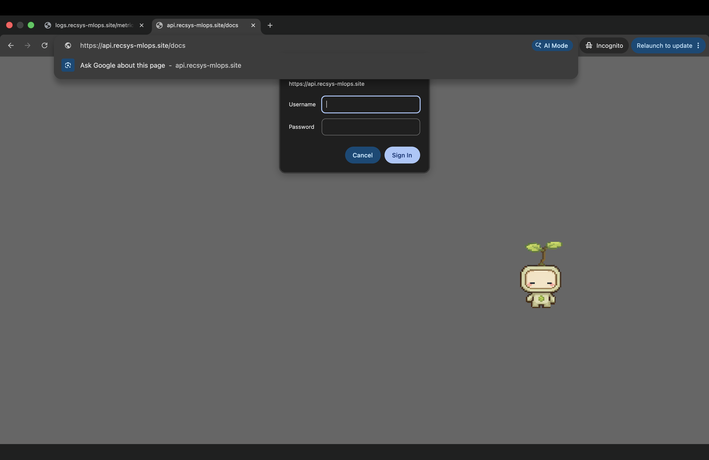

**Figure: Basic auth proof for Web API Pull Data service.** Accessing
`https://api.recsys-mlops.site` without valid gateway credentials returns a
Basic Auth challenge or `401 Unauthorized`; authenticated traffic passes through
the gateway and reaches the FastAPI online-feature backend.

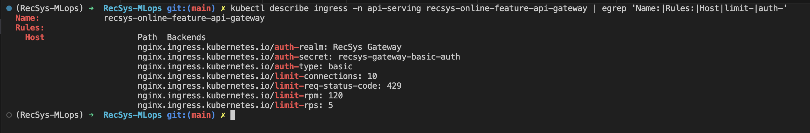

**Figure: Rate limit proof for Web API Pull Data service.** The CLI proof shows
the API ingress rate-limit annotations and/or burst-test result for
`https://api.recsys-mlops.site`; burst requests beyond the configured limit
return HTTP `429`.

### Image Proof Enable HTTPS

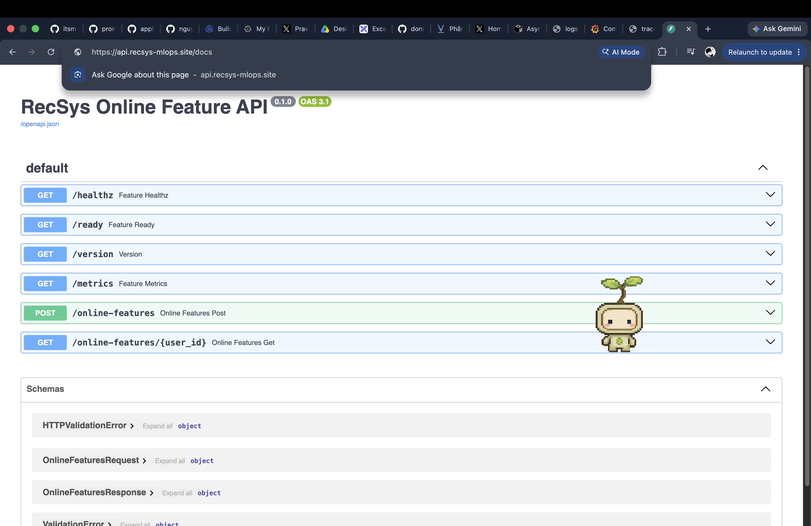

**Figure: Web API Pull Data HTTPS proof.** The FastAPI Swagger UI is loaded via
`https://api.recsys-mlops.site/docs`.
