# Routing & Gateway Proof

This proof covers the final-coursework rubric item **Routing & Gateway (NGINX Ingress Controller)** on GCP/GKE project `fsds-coursework`.

Scope note: **Setup domain & enable HTTPS is intentionally skipped** per the latest instruction. The gateway is tested through the GKE LoadBalancer IP with explicit `Host` headers instead of DNS records and TLS certificates.

## Gateway Target

NGINX Ingress Controller is the single external entrypoint. Application services stay behind Kubernetes `ClusterIP` services and are exposed through host-based NGINX ingress routes.

```bash
kubectl -n ingress-nginx get svc ingress-nginx-controller -o wide
```

Observed result:

```text
NAME                       TYPE           CLUSTER-IP    EXTERNAL-IP     PORT(S)                      AGE    SELECTOR
ingress-nginx-controller   LoadBalancer   10.48.7.151   34.21.171.234   80:31717/TCP,443:31406/TCP   128m   app.kubernetes.io/component=controller,app.kubernetes.io/instance=ingress-nginx,app.kubernetes.io/name=ingress-nginx
```

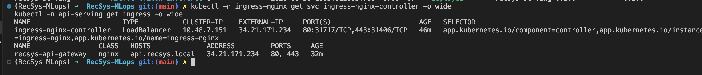

## Hidden Services

| Rubric service | Gateway host | Ingress | Internal backend |
|---|---|---|---|
| Service để coi metric | `grafana.recsys.local` | `observability/recsys-grafana-gateway` | `recsys-grafana:3000` |
| Service để coi log | `logs.recsys.local` | `observability/recsys-logs-gateway` | `recsys-loki:3100` |
| Service để coi trace | `traces.recsys.local` | `observability/recsys-traces-gateway` | `recsys-tempo:3200` |
| Web API kéo dữ liệu / recommendation API | `api.recsys.local` | `api-serving/recsys-api-gateway` | `recsys-api-serving:80 -> pod 8080` |

```bash
kubectl get ingress -A -o wide
```

Observed result:

```text
NAMESPACE                 NAME                     CLASS   HOSTS                                                                                                                   ADDRESS         PORTS   AGE
api-serving               recsys-api-gateway       nginx   api.recsys.local                                                                                                        34.21.171.234   80      115m
kserve-triton-inference   recsys-bst-triton        istio   recsys-bst-triton-kserve-triton-inference.example.com,recsys-bst-triton-predictor-kserve-triton-inference.example.com                   80      105m
observability             recsys-grafana-gateway   nginx   grafana.recsys.local                                                                                                    34.21.171.234   80      115m
observability             recsys-logs-gateway      nginx   logs.recsys.local                                                                                                       34.21.171.234   80      115m
observability             recsys-traces-gateway    nginx   traces.recsys.local                                                                                                     34.21.171.234   80      115m
```

The KServe/Triton ingress is owned by Istio and is separate from this NGINX gateway proof. The four `CLASS=nginx` routes are the rubric-facing gateway routes.

### Image proof

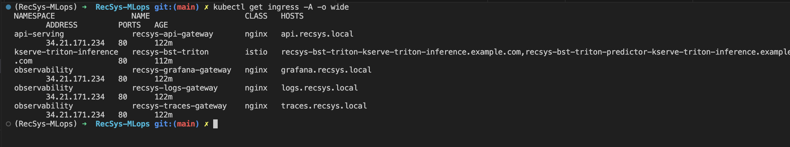


## Gateway Config

The gateway is managed by Terraform and Helm:

- `infra/terraform/gcp/dependencies.tf`: installs `ingress-nginx` and configures rate-limit status codes.
- `infra/terraform/gcp/recsys_services.tf`: installs `recsys-gateway`, host routes, upstream hosts, and disables TLS for this proof.
- `infra/helm/recsys-gateway/templates/*-ingress.yaml`: creates the API, Grafana, logs, and traces ingress resources.

Important implementation details:

- `nginx.ingress.kubernetes.io/auth-type: basic` enables username/password authentication.
- `nginx.ingress.kubernetes.io/auth-secret: recsys-gateway-basic-auth` stores the htpasswd secret in `api-serving` and `observability`.
- `nginx.ingress.kubernetes.io/service-upstream: true` sends traffic to the internal service VIP.
- `nginx.ingress.kubernetes.io/upstream-vhost: <service>.<namespace>.svc.cluster.local` makes NGINX pass the internal service host to Istio-backed workloads.
- `tls.enabled=false` keeps domain/HTTPS outside this proof.

API gateway annotations:

```bash
kubectl -n api-serving describe ingress recsys-api-gateway
```

Observed result:

```text
Rules:
  Host              Path  Backends
  ----              ----  --------
  api.recsys.local
                    /   recsys-api-serving:80 (10.44.0.12:8080)
Annotations:        nginx.ingress.kubernetes.io/auth-realm: RecSys Gateway
                    nginx.ingress.kubernetes.io/auth-secret: recsys-gateway-basic-auth
                    nginx.ingress.kubernetes.io/auth-type: basic
                    nginx.ingress.kubernetes.io/limit-connections: 10
                    nginx.ingress.kubernetes.io/limit-req-status-code: 429
                    nginx.ingress.kubernetes.io/limit-rpm: 120
                    nginx.ingress.kubernetes.io/limit-rps: 5
                    nginx.ingress.kubernetes.io/service-upstream: true
                    nginx.ingress.kubernetes.io/upstream-vhost: recsys-api-serving.api-serving.svc.cluster.local
```

### Image proof

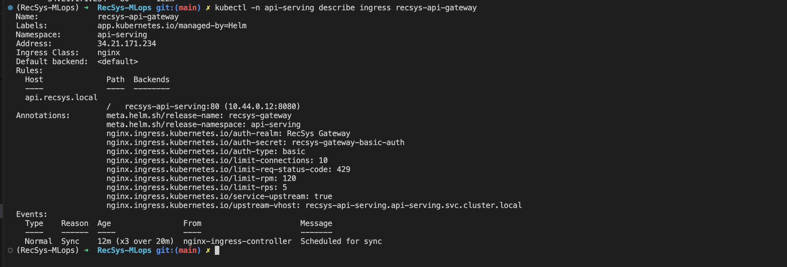

Observability gateway annotations:

```bash
kubectl -n observability describe ingress recsys-grafana-gateway
kubectl -n observability describe ingress recsys-logs-gateway
kubectl -n observability describe ingress recsys-traces-gateway
```

Observed backend mapping:

```text
grafana.recsys.local -> recsys-grafana:3000 (10.44.1.32:3000)
logs.recsys.local    -> recsys-loki:3100    (10.44.1.33:3100)
traces.recsys.local  -> recsys-tempo:3200   (10.44.1.53:3200)
```

Each observability ingress has:

```text
nginx.ingress.kubernetes.io/auth-secret: recsys-gateway-basic-auth
nginx.ingress.kubernetes.io/auth-type: basic
nginx.ingress.kubernetes.io/service-upstream: true
nginx.ingress.kubernetes.io/upstream-vhost: <internal service fqdn>
```

### Image proof


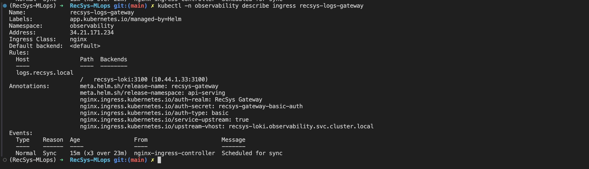

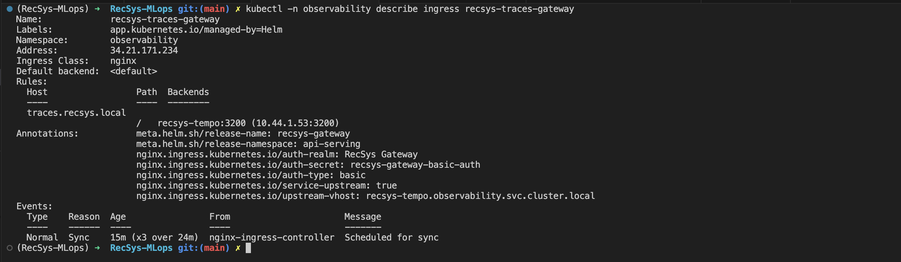

## Basic Auth Proof

No credentials are rejected by the gateway:

```bash
curl -s -o /tmp/recsys_gateway_http_noauth.txt -w '%{http_code}\n' \
  -H 'Host: api.recsys.local' \
  http://34.21.171.234/ready
```

Observed result:

```text
401
```

### Image proof 

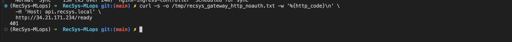

Rotated credentials pass through the gateway. Load the ignored `.env` file locally before running proof commands:

```bash
set -a
source .env
set +a

curl -s -o /tmp/recsys_gateway_http_auth.txt -w '%{http_code}\n' \
  -u "${GATEWAY_USER}:${GATEWAY_PASSWORD}" \
  -H 'Host: api.recsys.local' \
  http://34.21.171.234/ready
```

Observed result:

```text
200
```

Body:

```json
{"status":"ready"}
```

### Image proof 

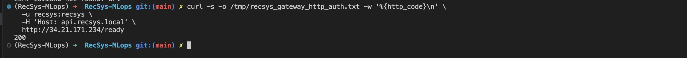

## Web API Proof

The recommendation API is reachable only through the gateway host route and basic auth.

```bash
curl -s -u "${GATEWAY_USER}:${GATEWAY_PASSWORD}" \
  -H 'Host: api.recsys.local' \
  -H 'Content-Type: application/json' \
  -X POST http://34.21.171.234/recommendations \
  -d '{"user_id":1,"candidate_item_ids":[101,202,303],"top_k":3}'
```

Observed result:

```json
{
  "user_id": 1,
  "model_version": "stable-001",
  "ab_variant": "control",
  "ab_experiment_id": "bst-stable-vs-candidate-20260630",
  "items": [
    {"item_id": 101, "score": 1.0010099411010742},
    {"item_id": 202, "score": 0.6686866283416748},
    {"item_id": 303, "score": 0.3363633155822754}
  ]
}
```

### Image proof 

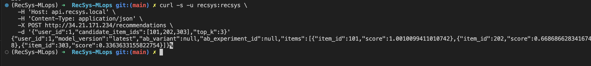

## Observability Route Proof

```bash
curl -s -o /tmp/recsys_gateway_grafana.txt -w '%{http_code}\n' \
  -u "${GATEWAY_USER}:${GATEWAY_PASSWORD}" \
  -H 'Host: grafana.recsys.local' \
  http://34.21.171.234/login

curl -s -o /tmp/recsys_gateway_loki.txt -w '%{http_code}\n' \
  -u "${GATEWAY_USER}:${GATEWAY_PASSWORD}" \
  -H 'Host: logs.recsys.local' \
  http://34.21.171.234/ready

curl -s -o /tmp/recsys_gateway_tempo.txt -w '%{http_code}\n' \
  -u "${GATEWAY_USER}:${GATEWAY_PASSWORD}" \
  -H 'Host: traces.recsys.local' \
  http://34.21.171.234/ready
```

Observed result:

```text
Grafana /login: 200
Loki /ready:    200
Tempo /ready:   200
```

### Image proof 

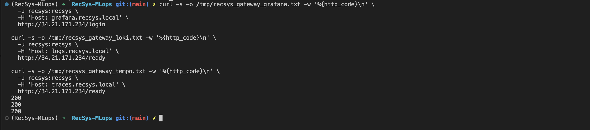


## Rate Limit Proof

The API ingress is configured with:

```text
limit-rps: 5
limit-rpm: 120
limit-connections: 10
```

The NGINX controller is configured to return `429` when request or connection limits are exceeded:

```bash
kubectl -n ingress-nginx exec deploy/ingress-nginx-controller -c controller -- \
  sh -c "nginx -T 2>/dev/null | grep -n 'limit_req_status\|limit_conn_status' | head -20"
```

Observed result:

```text
81: limit_req_status                429;
82: limit_conn_status               429;
```

### Image proof

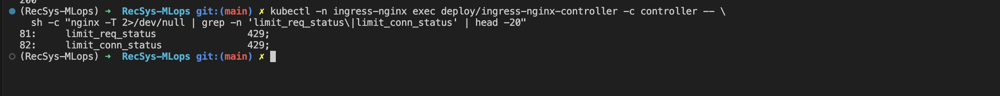


Burst test:

```bash
seq 1 80 | xargs -n1 -P40 -I{} curl -s -o /dev/null -w '%{http_code}\n' \
  -u "${GATEWAY_USER}:${GATEWAY_PASSWORD}" \
  -H 'Host: api.recsys.local' \
  http://34.21.171.234/ready | sort | uniq -c
```

Observed result:

```text
  17 200
  63 429
```

### Image proof 

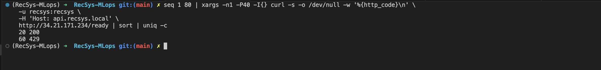

## Verification Summary

| Requirement | Status | Proof |
|---|---:|---|
| NGINX Ingress Controller gateway | PASS | `ingress-nginx-controller` LoadBalancer IP `34.21.171.234` |
| Hide metric service behind gateway | PASS | `grafana.recsys.local -> recsys-grafana:3000` |
| Hide log service behind gateway | PASS | `logs.recsys.local -> recsys-loki:3100` |
| Hide trace service behind gateway | PASS | `traces.recsys.local -> recsys-tempo:3200` |
| Hide Web API behind gateway | PASS | `api.recsys.local -> recsys-api-serving:80` |
| Basic authentication | PASS | no auth `401`, auth `200` |
| Rate limit | PASS | burst returns `429` |
| Domain & HTTPS | SKIPPED | havent implemented it yet |
