# Routing & Gateway (NGINX Ingress Controller)

**Domain:** `recsys-mlops.site`

NGINX Ingress Controller is the public gateway for RecSys services. The backend
Kubernetes services stay internal, while DNS points the public subdomains to the
single NGINX LoadBalancer IP.

## Domain Setup For All 4 Services

| Service | Public domain | Internal backend |
| --- | --- | --- |
| Web API Pull Data service | `api.recsys-mlops.site` | `recsys-online-feature-api.api-serving.svc.cluster.local:80` |
| Metric service | `metrics.recsys-mlops.site` | `recsys-grafana.observability.svc.cluster.local:3000` |
| Log service | `logs.recsys-mlops.site` | `recsys-loki.observability.svc.cluster.local:3100` |
| Trace service | `traces.recsys-mlops.site` | `recsys-tempo.observability.svc.cluster.local:3200` |

## Setup And Configuration Flow

The production gateway is assembled in layers rather than by a single
manifest. Terraform creates the controller and injects environment-specific
values, the gateway Helm chart renders host/path rules, External Secrets
replicates authentication material into the namespaces that own those rules,
and cert-manager supplies each route's certificate.

### Configuration Precedence And Ownership

| Layer | Effective responsibility |
| --- | --- |
| Terraform variables | Enable the gateway and service mesh and select `recsys-mlops.site`, TLS, and the existing `letsencrypt-prod` ClusterIssuer. Current local values set `deploy_gateway=true`, `deploy_service_mesh=true`, and `gateway_tls_enabled=true`. |
| Terraform `ingress-nginx` release | Installs the NGINX controller in `ingress-nginx`, publishes it through a GKE `LoadBalancer` Service, requests an Istio sidecar, and standardizes rate-limit rejection as HTTP `429`. |
| Gateway chart defaults | Define the ingress class, service names/ports, Basic Auth policy, per-route rate limits, TLS secret names, and default internal upstreams. |
| Terraform `recsys-gateway` release | Overrides the production hostnames, disables the separate recommendation-API ingress, enables the feature-API root redirect, selects TLS/issuer settings, and tells the chart that authentication Secrets are externally owned. This release has no `ignore_changes` handoff, so Terraform remains its owner. |
| `recsys-security` and External Secrets | Copy the same `recsys-gateway-basic-auth` Secret into both `api-serving` and `observability`, because Kubernetes Ingress authentication Secrets must exist in the Ingress object's namespace. |
| Jenkins demo-web release | Independently owns the base-domain `recsys-mlops.site` frontend and `/api` routes. It uses the same ingress class and authentication Secret but is not part of the four-host `recsys-gateway` release. |
| DNS provider | Owns the public `A` records. DNS is evidenced in this document but is not managed by the current Terraform stack. |

Relevant configuration sources are
[dependencies.tf](../../../infra/terraform/gcp/dependencies.tf#L242),
[recsys_services.tf](../../../infra/terraform/gcp/recsys_services.tf#L388),
[values.yaml](../../../infra/helm/recsys-gateway/values.yaml), and
[values-gcp.yaml](../../../infra/helm/recsys-gateway/values-gcp.yaml).

### Effective Production Route Table

The checked-in defaults are safe placeholders. Terraform produces the following
effective route contract for `recsys-mlops.site`:

| Host and public path | Gateway behavior | Kubernetes destination |
| --- | --- | --- |
| `api.recsys-mlops.site/` | Exact root request is permanently redirected to `/docs`; all other paths use the feature-API ingress. | `recsys-online-feature-api.api-serving.svc.cluster.local:80` |
| `metrics.recsys-mlops.site/*` | Prefix route to Grafana. An Istio `ServiceEntry` and mesh `VirtualService` map the public host to the internal Grafana service. | `recsys-grafana.observability.svc.cluster.local:3000` |
| `logs.recsys-mlops.site/` | Exact root request is redirected to `https://metrics.recsys-mlops.site/d/recsys-logs/logs-overview`. | Redirect only |
| `logs.recsys-mlops.site/loki/*` | Loki query/push API route. `/ready` and `/metrics` are also routed explicitly; unrelated root paths are not exposed. | `recsys-loki.observability.svc.cluster.local:3100` |
| `traces.recsys-mlops.site/*` | Prefix route to Tempo's HTTP query/read API on port `3200`. OTLP ingestion ports `4317/4318` remain cluster-internal. | `recsys-tempo.observability.svc.cluster.local:3200` |
| `recsys-mlops.site/*` | Separate demo frontend ingress; `/api`, `/healthz`, and `/ready` are handled by a second demo API ingress. | `recsys-demo-web` or `recsys-demo-api` in `api-serving` |

The recommendation service `recsys-api-serving` is deliberately not assigned a
public rule by `recsys-gateway`: Terraform sets `api.enabled=false`. It remains
an internal service used by the demo backend, while the coursework public API
host exposes `recsys-online-feature-api`. This avoids two Ingress objects
claiming the same host and `/` prefix.

### Request Routing Sequence

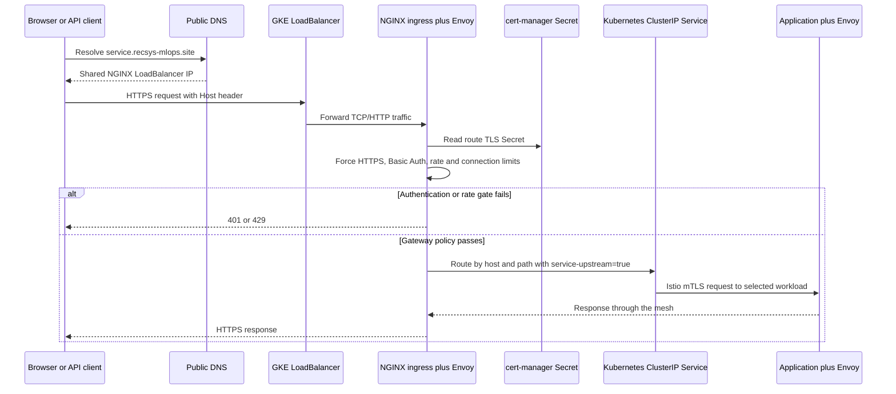
```mermaid
sequenceDiagram
    participant Client as Browser or API client
    participant DNS as Public DNS
    participant LB as GKE LoadBalancer
    participant NGINX as NGINX ingress plus Envoy
    participant CM as cert-manager Secret
    participant SVC as Kubernetes ClusterIP Service
    participant Pod as Application plus Envoy

    Client->>DNS: Resolve service.recsys-mlops.site
    DNS-->>Client: Shared NGINX LoadBalancer IP
    Client->>LB: HTTPS request with Host header
    LB->>NGINX: Forward TCP/HTTP traffic
    NGINX->>CM: Read route TLS Secret
    NGINX->>NGINX: Force HTTPS, Basic Auth, rate and connection limits
    alt Authentication or rate gate fails
        NGINX-->>Client: 401 or 429
    else Gateway policy passes
        NGINX->>SVC: Route by host and path with service-upstream=true
        SVC->>Pod: Istio mTLS request to selected workload
        Pod-->>NGINX: Response through the mesh
        NGINX-->>Client: HTTPS response
    end
```

The `nginx.ingress.kubernetes.io/service-upstream: "true"` annotation makes
NGINX target the Service ClusterIP rather than building a direct list of pod
endpoints. For the feature API, Loki, Tempo, and demo routes,
`nginx.ingress.kubernetes.io/upstream-vhost` rewrites the upstream host to the
service's cluster FQDN. This gives the injected Envoy sidecar a stable internal
service identity when it originates traffic into namespaces running strict
mTLS. Grafana keeps its public host and uses the chart's ServiceEntry and
VirtualService to map that host to `recsys-grafana` inside the mesh.

### Authentication Secret Setup

No usable htpasswd credential is committed to the chart. Terraform accepts a
rotated value through the sensitive `gateway_htpasswd` variable, writes it into
the centralized `external-secrets/gateway` Secret under key `auth`, and the
Terraform-owned `recsys-security` release creates two `ExternalSecret` objects:

```text
external-secrets/gateway
  -> api-serving/recsys-gateway-basic-auth
  -> observability/recsys-gateway-basic-auth
```

Every protected Ingress references `recsys-gateway-basic-auth` through the
NGINX `auth-type`, `auth-secret`, and `auth-realm` annotations. Production sets
`auth.createSecret=false`, so the gateway chart will not render a competing
Secret or place the htpasswd line in a Helm manifest. Terraform waits until both
ExternalSecrets are Ready before dependent releases proceed. See
[secret_management.tf](../../../infra/terraform/gcp/secret_management.tf) and
[externalsecrets.yaml](../../../infra/helm/recsys-security/templates/externalsecrets.yaml).

### TLS And DNS Setup

All public Ingresses use `ingressClassName: nginx`, set
`force-ssl-redirect: "true"`, reference `letsencrypt-prod`, and declare a
route-specific TLS Secret. cert-manager observes the Ingress annotation,
completes the ACME challenge, and populates that Secret; NGINX then terminates
public TLS before forwarding HTTP through the cluster mesh.

Production deliberately sets `tls.issuer.create=false`. Terraform installs
cert-manager, but this repository does not create the `letsencrypt-prod`
ClusterIssuer, so that issuer is an external prerequisite. If it is absent, or
if DNS does not already resolve to the NGINX LoadBalancer, Certificate resources
remain pending and HTTPS is not ready.

The NGINX Service currently requests a dynamic GKE LoadBalancer IP; Terraform
does not reserve or bind a static address. The four DNS `A` records must
therefore be checked and updated if the controller Service is recreated with a
different IP.

### Mesh Authorization

Terraform labels `api-serving`, `observability`, and `ingress-nginx` for Istio
sidecar injection. The security chart applies namespace-wide strict mTLS and
default-deny policies to the application namespaces, then explicitly allows the
`cluster.local/ns/ingress-nginx/sa/ingress-nginx` principal to reach API ports
`80/8080` and observability ports `3000/3100/3200`. This is why a public request
can pass from NGINX into the mesh while an arbitrary pod cannot directly call
the same protected workloads. See
[istio-mtls.yaml](../../../infra/helm/recsys-security/templates/istio-mtls.yaml)
and
[istio-authorization.yaml](../../../infra/helm/recsys-security/templates/istio-authorization.yaml).

### Gateway Versus Internal Observability Traffic

The public observability hosts are read/query entrypoints; they are not part of
telemetry ingestion inside the cluster:

- Prometheus scrapes pod/exporter endpoints and PushGateway through Kubernetes
  service DNS, not through `metrics.recsys-mlops.site`.
- Promtail writes directly to `recsys-loki.observability.svc.cluster.local:3100`,
  not through `logs.recsys-mlops.site`.
- FastAPI services export OTLP directly to
  `recsys-tempo.observability.svc.cluster.local:4317`, not through the public
  Tempo route.
- Grafana queries Prometheus, Loki, and Tempo through their internal Services.

Keeping ingestion internal avoids Basic Auth/rate-limit interference and keeps
collector traffic inside Istio authorization boundaries. The matching metrics,
logs, and traces collection flow is documented in
[observability.md](observability.md#01-end-to-end-collection-flow).

### Gateway Configuration Reference

| Gateway layer | Clickable configuration reference | Purpose |
| --- | --- | --- |
| NGINX Ingress Controller | [dependencies.tf (line 242)](../../../infra/terraform/gcp/dependencies.tf#L242) | Installs the cluster-wide `ingress-nginx` controller that receives public traffic. |
| Gateway Helm release | [recsys_services.tf (line 388)](../../../infra/terraform/gcp/recsys_services.tf#L388), [host/backend overrides (line 399)](../../../infra/terraform/gcp/recsys_services.tf#L399) | Deploys `recsys-gateway` and injects public hosts plus internal Kubernetes upstreams. |
| Shared gateway policy | [values.yaml: ingress class and domain](../../../infra/helm/recsys-gateway/values.yaml#L1), [Basic Auth](../../../infra/helm/recsys-gateway/values.yaml#L5), [TLS/cert-manager](../../../infra/helm/recsys-gateway/values.yaml#L16) | Centralizes the NGINX class, authentication secret, TLS issuer, certificates, and per-route rate limits. |
| Web API Pull Data route | [feature API values](../../../infra/helm/recsys-gateway/values.yaml#L46), [feature-api-ingress.yaml](../../../infra/helm/recsys-gateway/templates/feature-api-ingress.yaml#L1) | Routes the public API host to `recsys-online-feature-api` and applies Basic Auth, throttling, and TLS. |
| Metric route | [Grafana values](../../../infra/helm/recsys-gateway/values.yaml#L60), [grafana-ingress.yaml](../../../infra/helm/recsys-gateway/templates/grafana-ingress.yaml#L1) | Routes the metric domain to the internal Grafana service. |
| Log route | [Loki values](../../../infra/helm/recsys-gateway/values.yaml#L76), [logs-ingress.yaml](../../../infra/helm/recsys-gateway/templates/logs-ingress.yaml#L1), [root redirect](../../../infra/helm/recsys-gateway/templates/logs-root-redirect-ingress.yaml#L1) | Routes Loki API paths and optionally redirects the root path to the Grafana logs dashboard. |
| Trace route | [Tempo values](../../../infra/helm/recsys-gateway/values.yaml#L93), [traces-ingress.yaml](../../../infra/helm/recsys-gateway/templates/traces-ingress.yaml#L1) | Routes the trace domain to the internal Tempo service. |
| Gateway credentials | [auth-secrets.yaml](../../../infra/helm/recsys-gateway/templates/auth-secrets.yaml#L1) | Replicates the Basic Auth secret into namespaces that own the Ingress resources. |
| TLS issuer | [clusterissuer.yaml](../../../infra/helm/recsys-gateway/templates/clusterissuer.yaml#L1) | Optionally renders the cert-manager issuer used by HTTPS routes. |

The chart also contains a separate recommendation-serving route at [api-ingress.yaml](../../../infra/helm/recsys-gateway/templates/api-ingress.yaml#L1). It targets `recsys-api-serving`; the Web API Pull Data proof in this document targets `recsys-online-feature-api` through `feature-api-ingress.yaml`.

The public names shown here are deployment values. The checked-in chart defaults use `.recsys.local`; [values-gcp.yaml](../../../infra/helm/recsys-gateway/values-gcp.yaml) contains the production host/TLS overlay, while Terraform derives the same hostnames from `gateway_domain`.

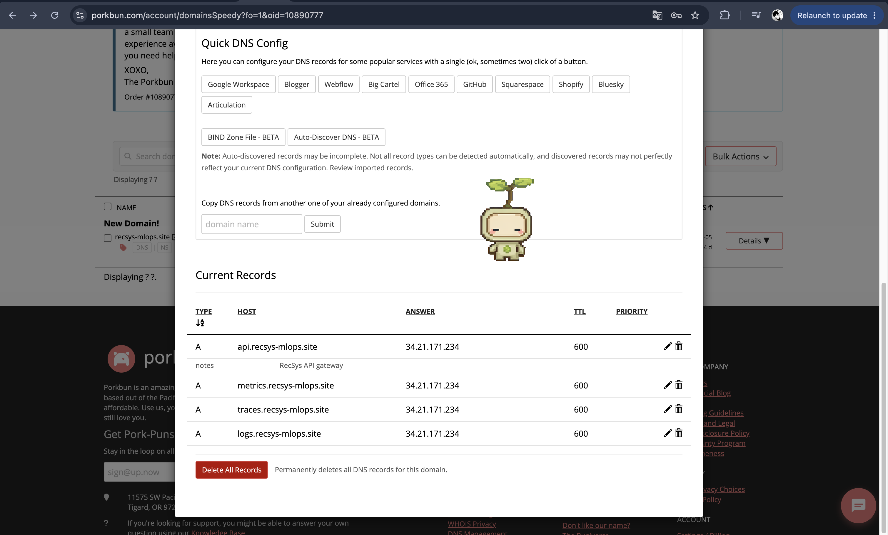

**Figure: Domain setup for all gateway services.** The DNS provider has four
public `A` records: `api.recsys-mlops.site`, `metrics.recsys-mlops.site`,
`logs.recsys-mlops.site`, and `traces.recsys-mlops.site`. All records point to
the NGINX Ingress Controller LoadBalancer IP `136.110.21.224`, proving that the
public domains enter the platform through the same gateway.


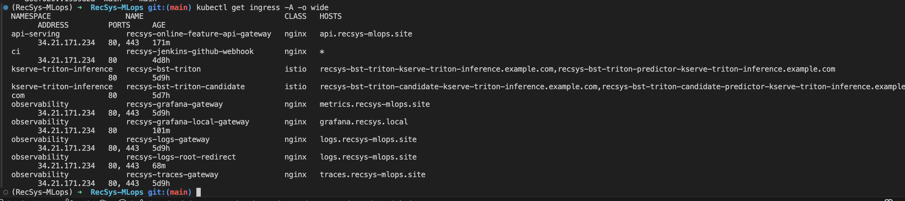

**Figure: NGINX gateway, domain, and HTTPS setup for all 4 services.** The
proof shows the four public routes are configured on NGINX Ingress with their
production domains: `api.recsys-mlops.site`, `metrics.recsys-mlops.site`,
`logs.recsys-mlops.site`, and `traces.recsys-mlops.site`. Each route is mapped
to its internal Kubernetes service and has HTTPS/TLS enabled, proving that the
gateway is the single secured entrypoint for the Web API, metrics, logs, and
traces services.

## Metric Service

The metric service is Grafana behind the NGINX gateway. The production host is
`https://metrics.recsys-mlops.site`.

### Code Reference

- [values.yaml (line 1)](../../../infra/helm/recsys-gateway/values.yaml#L1), [values.yaml (line 30)](../../../infra/helm/recsys-gateway/values.yaml#L30), [values.yaml (line 60)](../../../infra/helm/recsys-gateway/values.yaml#L60), [values.yaml (line 74)](../../../infra/helm/recsys-gateway/values.yaml#L74): gateway, TLS, authentication, Grafana host, and rate-limit values.
- [grafana-ingress.yaml (line 1)](../../../infra/helm/recsys-gateway/templates/grafana-ingress.yaml#L1), [grafana-ingress.yaml (line 47)](../../../infra/helm/recsys-gateway/templates/grafana-ingress.yaml#L47): renders the NGINX `Ingress` and security annotations.

### Basic Auth & Rate Limit Proof

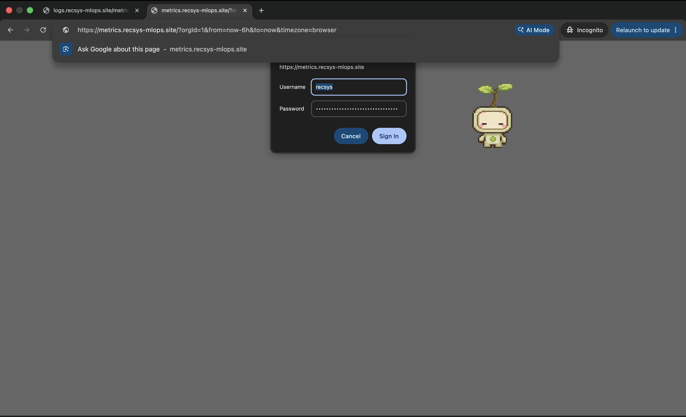

**Figure: Basic auth proof for metric service.** Accessing
`https://metrics.recsys-mlops.site` without valid gateway credentials returns a
Basic Auth challenge or `401 Unauthorized`, proving Grafana is protected before
the request reaches the internal `recsys-grafana` service.

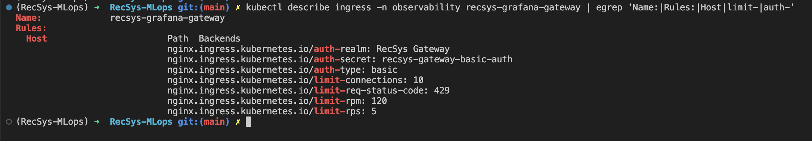

**Figure: Rate limit proof for metric service.** The CLI proof shows the
Grafana ingress annotations and/or burst-test result for
`https://metrics.recsys-mlops.site`; excess requests are throttled by NGINX and
return HTTP `429`.

### Image Proof Enable HTTPS

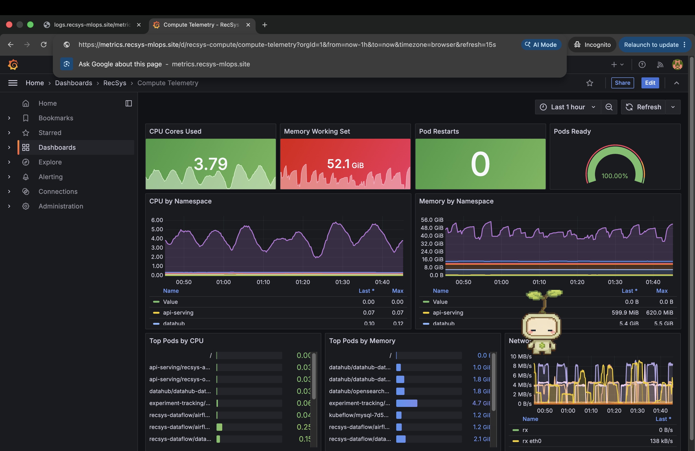

**Figure: Metric service HTTPS proof.** The browser loads Grafana through
`https://metrics.recsys-mlops.site` with HTTPS enabled, proving the metric UI is
published through the NGINX gateway domain while the Kubernetes service remains
internal.

## Trace Service

The trace service is Tempo behind the NGINX gateway. The production host is
`https://traces.recsys-mlops.site`.

### Code Reference

- [values.yaml (line 1)](../../../infra/helm/recsys-gateway/values.yaml#L1), [values.yaml (line 30)](../../../infra/helm/recsys-gateway/values.yaml#L30), [values.yaml (line 93)](../../../infra/helm/recsys-gateway/values.yaml#L93), [values.yaml (line 105)](../../../infra/helm/recsys-gateway/values.yaml#L105): TLS/authentication plus Tempo host and rate-limit values.
- [traces-ingress.yaml (line 1)](../../../infra/helm/recsys-gateway/templates/traces-ingress.yaml#L1), [traces-ingress.yaml (line 45)](../../../infra/helm/recsys-gateway/templates/traces-ingress.yaml#L45): renders the trace route and security annotations.

### Basic Auth & Rate Limit Proof

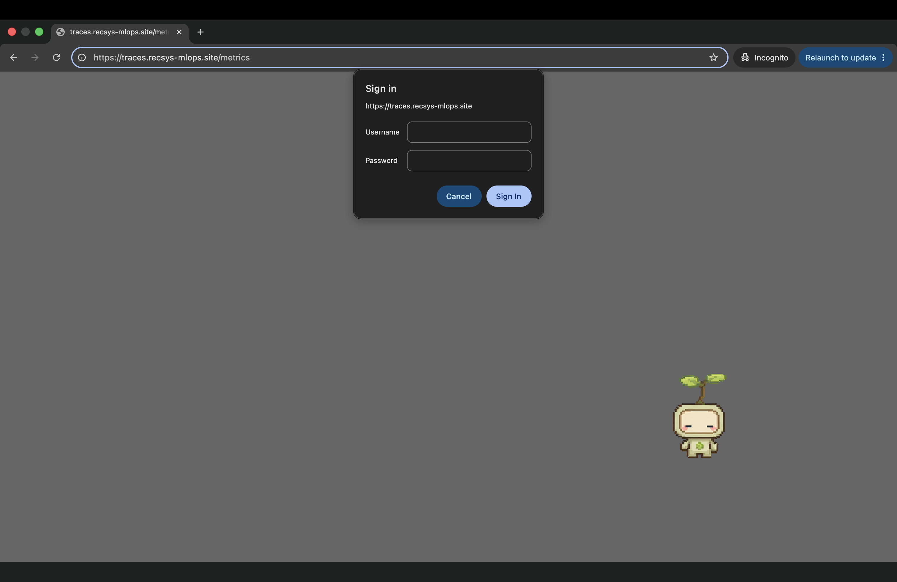

**Figure: Basic auth proof for trace service.** Accessing
`https://traces.recsys-mlops.site` without valid gateway credentials returns a
Basic Auth challenge or `401 Unauthorized`, proving Tempo is protected at the
gateway layer.

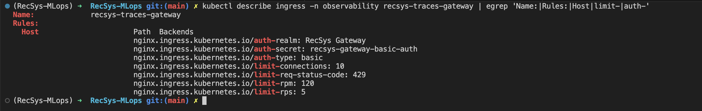

**Figure: Rate limit proof for trace service.** The CLI proof shows the trace
ingress rate-limit annotations and/or burst-test result for
`https://traces.recsys-mlops.site`; NGINX returns HTTP `429` when requests exceed
the configured gateway limit.

### Image Proof Enable HTTPS

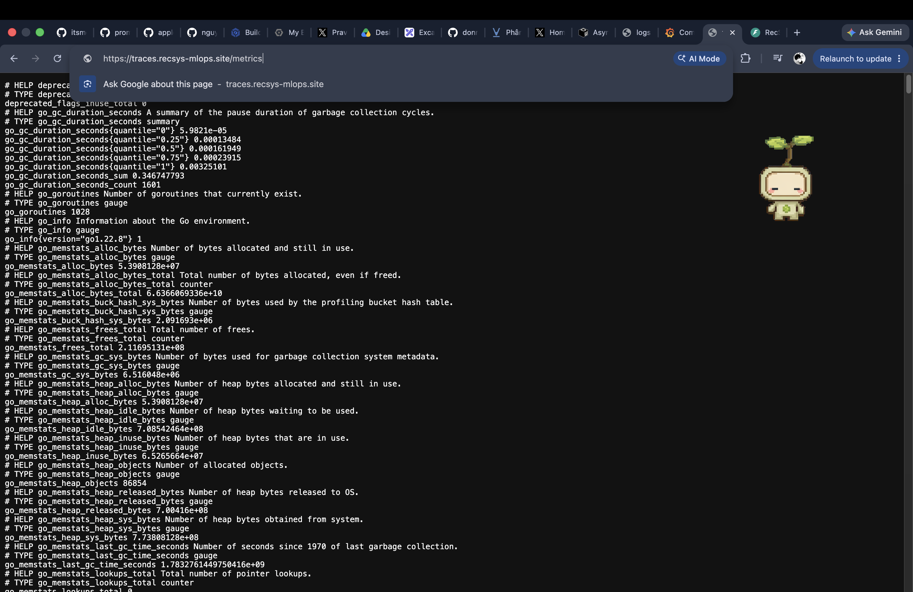

**Figure: Trace service HTTPS proof.** The trace endpoint is reached through
`https://traces.recsys-mlops.site`, proving HTTPS is enabled on the public trace
gateway route.

## Log Service

The log service is Loki behind the NGINX gateway. The production host is
`https://logs.recsys-mlops.site`.

### Code Reference

- [values.yaml (line 1)](../../../infra/helm/recsys-gateway/values.yaml#L1), [values.yaml (line 30)](../../../infra/helm/recsys-gateway/values.yaml#L30), [values.yaml (line 76)](../../../infra/helm/recsys-gateway/values.yaml#L76), [values.yaml (line 91)](../../../infra/helm/recsys-gateway/values.yaml#L91): TLS/authentication plus Loki host, redirect, and rate-limit values.
- [logs-ingress.yaml (line 1)](../../../infra/helm/recsys-gateway/templates/logs-ingress.yaml#L1), [logs-ingress.yaml (line 70)](../../../infra/helm/recsys-gateway/templates/logs-ingress.yaml#L70): renders log routes, redirect, and security annotations.

### Basic Auth & Rate Limit Proof

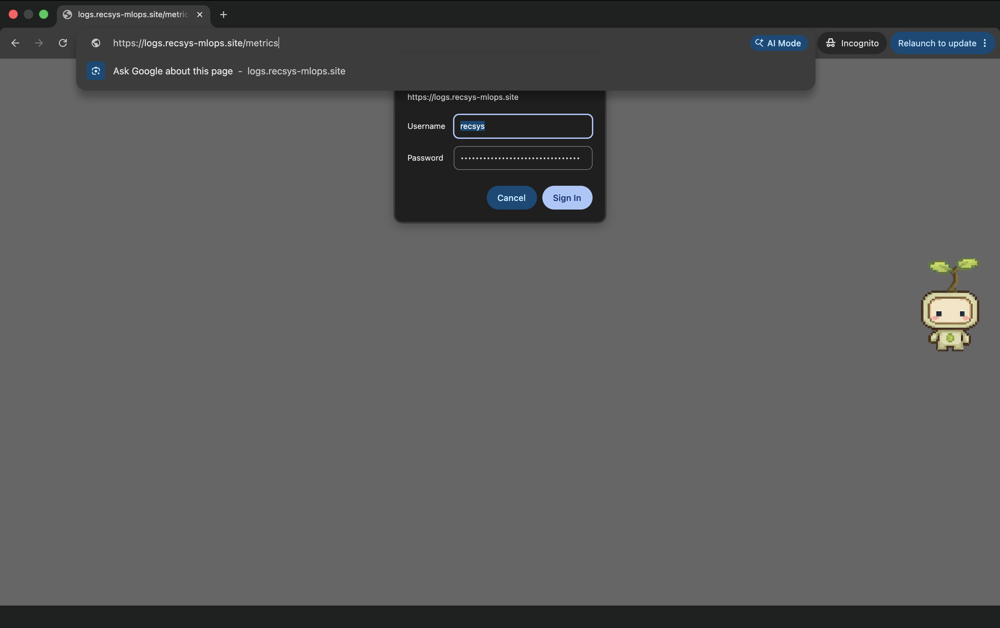

**Figure: Basic auth proof for log service.** Accessing
`https://logs.recsys-mlops.site` without valid gateway credentials returns a
Basic Auth challenge or `401 Unauthorized`, proving Loki is not publicly exposed
without gateway authentication.

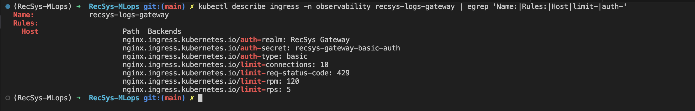

**Figure: Rate limit proof for log service.** The CLI proof shows the Loki
ingress rate-limit annotations and/or burst-test result for
`https://logs.recsys-mlops.site`; excess requests are throttled by NGINX with
HTTP `429`.

### Image Proof Enable HTTPS

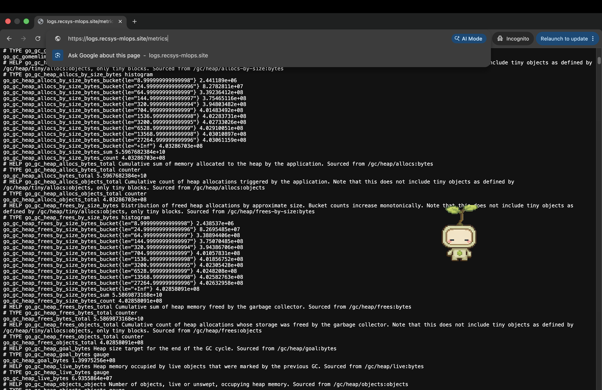

**Figure: Log service HTTPS proof.** The log endpoint is reached through
`https://logs.recsys-mlops.site`, proving HTTPS is enabled on the public log
gateway route.


## Web API Pull Data Service

The Web API Pull Data service is the FastAPI online feature API behind the NGINX
gateway. The production host is `https://api.recsys-mlops.site`.

### Code Reference

- [feature_api.py (line 13)](../../../apps/api-serving/src/feature_api.py#L13), [feature_api.py (line 77)](../../../apps/api-serving/src/feature_api.py#L77): `RecSys Online Feature API` and POST/GET online-feature routes.
- [feature-api-ingress.yaml (line 1)](../../../infra/helm/recsys-gateway/templates/feature-api-ingress.yaml#L1), [feature-api-ingress.yaml (line 45)](../../../infra/helm/recsys-gateway/templates/feature-api-ingress.yaml#L45): route, Basic Auth, rate limit, and TLS annotations.
- [values.yaml (line 46)](../../../infra/helm/recsys-gateway/values.yaml#L46), [values.yaml (line 58)](../../../infra/helm/recsys-gateway/values.yaml#L58), [recsys_services.tf (line 388)](../../../infra/terraform/gcp/recsys_services.tf#L388), [recsys_services.tf (line 409)](../../../infra/terraform/gcp/recsys_services.tf#L409): enable the route and derive its host from `gateway_domain`.

### Basic Auth & Rate Limit Proof

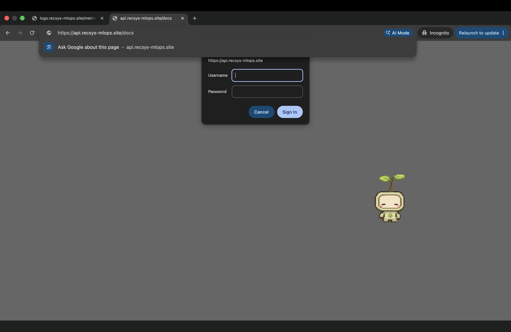

**Figure: Basic auth proof for Web API Pull Data service.** Accessing
`https://api.recsys-mlops.site` without valid gateway credentials returns a
Basic Auth challenge or `401 Unauthorized`; authenticated traffic passes through
the gateway and reaches the FastAPI online-feature backend.

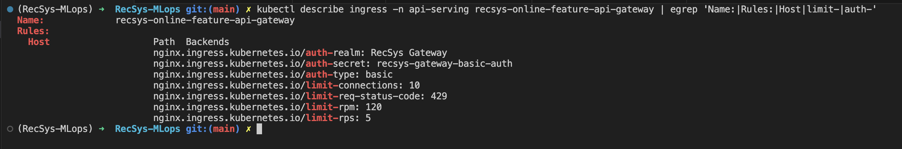

**Figure: Rate limit proof for Web API Pull Data service.** The CLI proof shows
the API ingress rate-limit annotations and/or burst-test result for
`https://api.recsys-mlops.site`; burst requests beyond the configured limit
return HTTP `429`.

### Image Proof Enable HTTPS

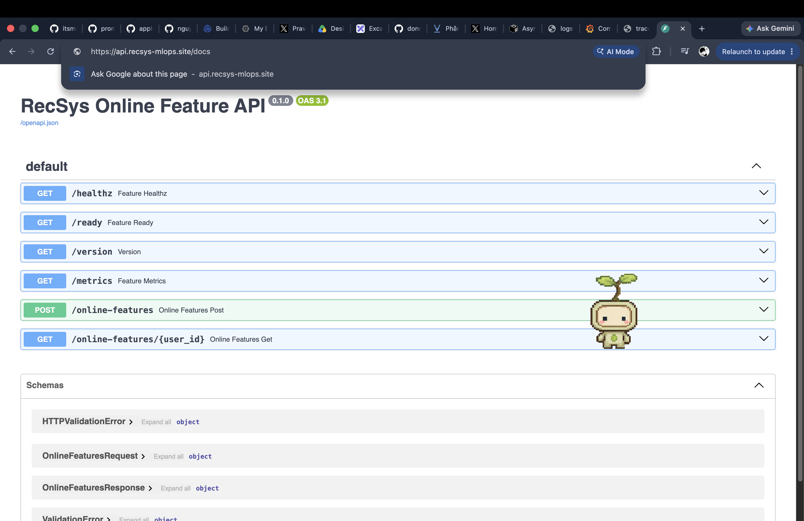

**Figure: Web API Pull Data HTTPS proof.** The FastAPI Swagger UI is loaded via
`https://api.recsys-mlops.site/docs`.
