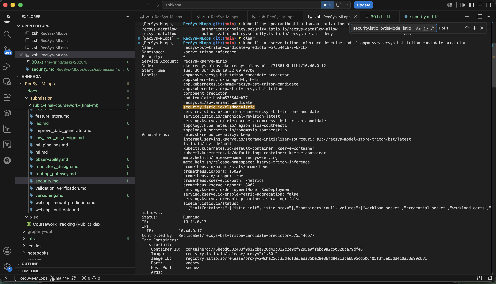

# Security Proof

This proof covers the final-coursework rubric item **Security** on GCP/GKE project `fsds-coursework`.

## Scope

| Rubric item | Implementation |
|---|---|
| Centralize secret management via Vault or similar tool | External Secrets Operator plus a central Kubernetes-backed `ClusterSecretStore` called `recsys-central-secrets`. It syncs shared secrets into service namespaces. The chart also supports Vault provider values for a production Vault backend. |
| Service-to-service authentication | Istio sidecar injection, namespace-level `PeerAuthentication` mTLS, default-deny `AuthorizationPolicy`, and explicit allow policies by source principal and port. |

## Centralized Secret Management

Terraform installs External Secrets Operator and creates central source secrets in the `external-secrets` namespace:

- [infra/terraform/gcp/dependencies.tf](../../../infra/terraform/gcp/dependencies.tf): installs the `external-secrets` Helm chart with CRDs.
- [infra/terraform/gcp/secret_management.tf](../../../infra/terraform/gcp/secret_management.tf): creates central source secrets for data platform, MLflow, runtime, KServe, and gateway credentials.
- [infra/helm/recsys-security/templates/secretstore.yaml](../../../infra/helm/recsys-security/templates/secretstore.yaml): renders `ClusterSecretStore`.
- [infra/helm/recsys-security/templates/externalsecrets.yaml](../../../infra/helm/recsys-security/templates/externalsecrets.yaml): syncs service secrets into target namespaces.

Operator proof:

```bash
kubectl get pods -n external-secrets
```

Observed result:

```text
external-secrets-75d658468b-t6v7b                  1/1 Running
external-secrets-cert-controller-d6459bb8d-4fhd8   1/1 Running
external-secrets-webhook-7fc5878846-lnbdb          1/1 Running
```

### Image proof 


Central store proof:

```bash
kubectl get clustersecretstore
```

Observed result:

```text
NAME                     AGE   STATUS   CAPABILITIES   READY
recsys-central-secrets   17s   Valid    ReadWrite      True
```

### Image proof 


Central source secrets:

```bash
kubectl get secret -n external-secrets -l app.kubernetes.io/part-of=recsys-mlops
```

Observed result:

```text
NAME            TYPE     DATA
data-platform   Opaque   10
gateway         Opaque   1
kserve-minio    Opaque   6
mlflow          Opaque   5
runtime         Opaque   20
```

### Image proof 


Synced service secrets:

```bash
kubectl get externalsecret -A
```

Observed result:

```text
NAMESPACE                 NAME                          STORETYPE            STORE                    STATUS         READY
api-serving               recsys-gateway-basic-auth     ClusterSecretStore   recsys-central-secrets   SecretSynced   True
experiment-tracking       recsys-mlflow-secrets         ClusterSecretStore   recsys-central-secrets   SecretSynced   True
kserve-triton-inference   recsys-kserve-minio           ClusterSecretStore   recsys-central-secrets   SecretSynced   True
kubeflow                  recsys-mlops-runtime          ClusterSecretStore   recsys-central-secrets   SecretSynced   True
observability             recsys-gateway-basic-auth     ClusterSecretStore   recsys-central-secrets   SecretSynced   True
recsys-dataflow           recsys-data-platform-secret   ClusterSecretStore   recsys-central-secrets   SecretSynced   True
```


## Service Mesh Authentication

Namespaces with mesh injection:

```bash
kubectl get ns -L istio-injection
```

Observed result:

```text
api-serving                 Active   enabled
experiment-tracking         Active   enabled
ingress-nginx               Active   enabled
kserve-triton-inference     Active   enabled
observability               Active   enabled
recsys-dataflow             Active   enabled
```

### Image proof


mTLS and authorization policies:

```bash
kubectl get peerauthentication,authorizationpolicy -A
```

Observed result:

```text
api-serving               peerauthentication/recsys-strict-mtls                         STRICT
experiment-tracking       peerauthentication/recsys-strict-mtls                         STRICT
kserve-triton-inference   peerauthentication/recsys-strict-mtls                         STRICT
kubeflow                  peerauthentication/recsys-strict-mtls                         STRICT
observability             peerauthentication/recsys-strict-mtls                         STRICT
recsys-dataflow           peerauthentication/recsys-strict-mtls                         STRICT

api-serving               authorizationpolicy/recsys-default-deny
api-serving               authorizationpolicy/recsys-api-allow                        ALLOW
kserve-triton-inference   authorizationpolicy/recsys-default-deny
kserve-triton-inference   authorizationpolicy/recsys-kserve-allow                     ALLOW
recsys-dataflow           authorizationpolicy/recsys-default-deny
recsys-dataflow           authorizationpolicy/recsys-dataflow-allow                   ALLOW
observability             authorizationpolicy/recsys-default-deny
observability             authorizationpolicy/recsys-observability-allow              ALLOW
experiment-tracking       authorizationpolicy/recsys-default-deny
experiment-tracking       authorizationpolicy/recsys-mlflow-allow                     ALLOW
```

Policy meaning:

| Namespace | Default behavior | Explicit allow examples |
|---|---|---|
| `api-serving` | Deny all by default under STRICT mTLS | Allow NGINX ingress, Prometheus, and internal `api-serving/default` service-to-service traffic to API ports 80/8080. This permits `recsys-api-serving` to call `recsys-online-feature-api` while keeping default-deny for other sources. |
| `kserve-triton-inference` | Deny all by default under STRICT mTLS | Allow API service account and Prometheus to Triton ports 80/8080/9000. |
| `recsys-dataflow` | Deny all by default under STRICT mTLS | Allow API to Redis 6379; allow DataHub GMS/frontend through `cluster.local/ns/datahub/sa/datahub-app-sa` to Kafka/data-platform ports such as `29092`; allow internal data platform ports. |
| `experiment-tracking` | Deny all by default under STRICT mTLS | Allow Kubeflow, KServe, and Prometheus to MLflow/MinIO/Postgres. |
| `observability` | Deny all by default under STRICT mTLS | Allow Prometheus, Promtail, API, Airflow/Kubeflow, and NGINX gateway. |

### Image proof


Sidecar proof:

```bash
kubectl -n kserve-triton-inference describe pod -l app=isvc.recsys-bst-triton-candidate-predictor
```

Observed result:

```text
Labels:
  security.istio.io/tlsMode=istio
Init Containers:
  istio-init:   Completed
  istio-proxy:  Running
Containers:
  kserve-container: Ready
```

### Image proof


