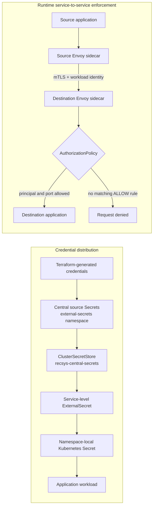
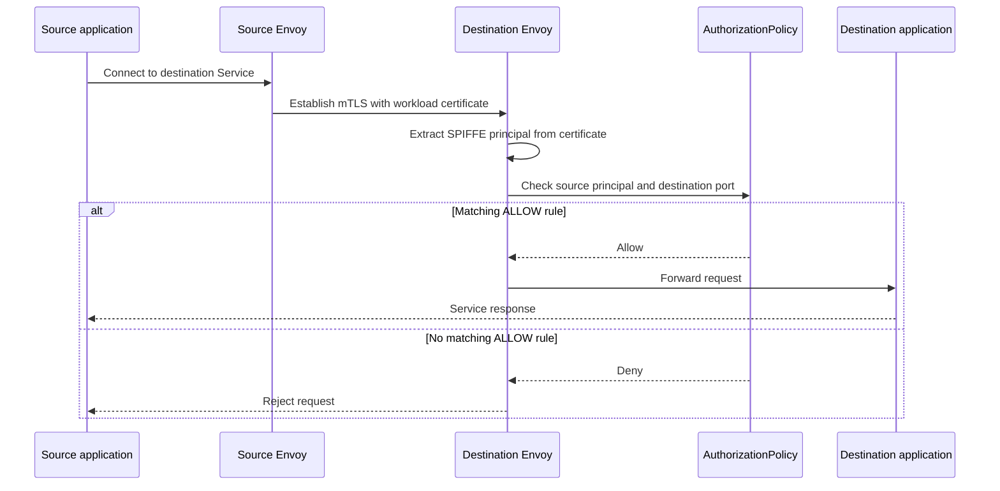

# Security Proof

This proof covers the final-coursework rubric item **Security** on GCP/GKE project `fsds-coursework`.

## Scope

| Rubric item | Implementation |
|---|---|
| Centralized secret management | External Secrets Operator uses one central `ClusterSecretStore` named `recsys-central-secrets`, then syncs service-specific Kubernetes Secrets into the namespaces that need them. |
| Service-to-service authentication | Istio sidecar injection, STRICT mTLS, namespace-level default deny, and explicit `AuthorizationPolicy` allow rules by source principal and port. |

## Security Architecture

The implementation separates credential distribution from runtime network enforcement:



| Security plane | Main control | Enforcement point |
|---|---|---|
| Secret management | `ClusterSecretStore` and `ExternalSecret` | External Secrets Operator creates or refreshes namespace-local Secrets consumed by workloads. |
| Authentication | Istio `PeerAuthentication` in `STRICT` mode | Source and destination Envoy sidecars establish mutually authenticated TLS. |
| Authorization | Default-deny plus explicit `AuthorizationPolicy` resources | Destination Envoy validates source workload identity and destination port before forwarding traffic. |

## Centralized Secret Management

The security setup keeps source credentials centralized and lets workloads consume namespace-local synced secrets. This avoids copying secret manifests into every service chart while still giving each namespace only the secret it needs.

### Code Reference

- [dependencies.tf (line 58)](../../../infra/terraform/gcp/dependencies.tf#L58), [dependencies.tf (line 74)](../../../infra/terraform/gcp/dependencies.tf#L74): installs External Secrets Operator with Helm and CRDs.
- [secret_management.tf (line 1)](../../../infra/terraform/gcp/secret_management.tf#L1), [secret_management.tf (line 78)](../../../infra/terraform/gcp/secret_management.tf#L78): defines central source-secret payloads for data platform, MLflow, runtime, KServe, and gateway credentials.
- [secretstore.yaml (line 1)](../../../infra/helm/recsys-security/templates/secretstore.yaml#L1), [secretstore.yaml (line 35)](../../../infra/helm/recsys-security/templates/secretstore.yaml#L35): renders the central `ClusterSecretStore`.
- [externalsecrets.yaml (line 1)](../../../infra/helm/recsys-security/templates/externalsecrets.yaml#L1), [externalsecrets.yaml (line 34)](../../../infra/helm/recsys-security/templates/externalsecrets.yaml#L34): renders `ExternalSecret` objects that sync target Kubernetes Secrets.

### End-To-End Secret Flow

1. Terraform creates grouped source credentials.

   [secret_management.tf (line 1)](../../../infra/terraform/gcp/secret_management.tf#L1) groups credentials by platform responsibility: `data-platform`, `mlflow`, `runtime`, `kserve-minio`, and `gateway`. Terraform stores the source objects as Kubernetes Secrets in the `external-secrets` namespace and labels each object with its security scope.

2. One `ClusterSecretStore` exposes the central source to External Secrets Operator.

   The GCP deployment configures the Kubernetes provider, store name `recsys-central-secrets`, remote namespace `external-secrets`, and the `external-secrets` service account in [locals.tf (line 96)](../../../infra/terraform/gcp/locals.tf#L96). The store authenticates to the Kubernetes API and reads source objects from that namespace.

3. Service-level `ExternalSecret` resources request the credential group needed in their namespace.

   ```yaml
   spec:
     refreshInterval: 1h
     secretStoreRef:
       kind: ClusterSecretStore
       name: recsys-central-secrets
     target:
       name: recsys-mlops-runtime
       creationPolicy: Owner
     dataFrom:
       - extract:
           key: runtime
   ```

   The same template renders this distribution map:

   | Central group | Target namespace | Target Kubernetes Secret | Main consumer |
   |---|---|---|---|
   | `data-platform` | `recsys-dataflow` | `recsys-data-platform-secret` | Airflow, Spark, Flink, Kafka Connect, PostgreSQL, Redis, and MinIO jobs |
   | `data-platform` | `observability` | `recsys-data-platform-secret` | PostgreSQL and Redis exporters |
   | `mlflow` | `experiment-tracking` | `recsys-mlflow-secrets` | MLflow, model-store MinIO, and registry PostgreSQL |
   | `runtime` | `kubeflow` | `recsys-mlops-runtime` | Kubeflow components, Ray jobs, model registry, and model CD handoff |
   | `kserve-minio` | `kserve-triton-inference` | `recsys-kserve-minio` | KServe storage initializer |
   | `gateway` | `api-serving`, `observability` | `recsys-gateway-basic-auth` | NGINX ingress authentication |

4. Workloads consume the namespace-local target Secret.

   Applications do not read the central source namespace directly. They use standard Kubernetes `envFrom`, `secretKeyRef`, or a service-account secret reference. For example, Flink loads `recsys-data-platform-secret` through [kafka-redis-flink.yaml (line 271)](../../../infra/helm/recsys-data-platform/templates/kafka-redis-flink.yaml#L271), MLflow reads MinIO credentials through [mlflow.yaml (line 30)](../../../infra/helm/mlflow-stack/templates/mlflow.yaml#L30), and the KServe service account references `recsys-kserve-minio` in [kserve-serviceaccount.yaml (line 1)](../../../infra/helm/recsys-serving/templates/kserve-serviceaccount.yaml#L1).

5. External Secrets Operator reconciles changes.

   Every `refreshInterval`, the operator rereads the central group and updates the namespace-local Secret. Workloads that import secrets as environment variables receive the new value after their pods restart; consumers that mount Secret volumes can use Kubernetes volume refresh behavior.

### External Secrets Operator Runtime

**Capture command**

```bash
kubectl get pods -n external-secrets
```


**Figure: External Secrets Operator pod proof.** The controller pod reconciles `ExternalSecret` resources, the webhook validates admission requests, and the cert-controller manages webhook certificates. Seeing these pods in `Running` state proves the secret synchronization control plane is available.


**Figure: External Secrets Operator k9s proof.** This view shows the same External Secrets components from the cluster UI, including readiness, restart count, node placement, and resource usage. It is useful as a UI-based proof that the operator is live on GKE, not only present as YAML.

### Central ClusterSecretStore

**Capture command**

```bash
kubectl get clustersecretstore
```


**Figure: Central ClusterSecretStore proof.** `recsys-central-secrets` is the shared secret backend reference used by all service-level `ExternalSecret` objects. A healthy/ready status proves workloads can reuse one central secret store instead of each namespace defining its own secret source.

### Central Source Secrets

**Capture command**

```bash
kubectl get secret -n external-secrets -l app.kubernetes.io/part-of=recsys-mlops
```


**Figure: Central source secret groups.** The source secrets are grouped by platform area, for example data platform, gateway, KServe/MinIO, MLflow, and runtime credentials. This proves secrets are stored centrally first, then synced outward to the namespaces that need them.

### Synced Service Secrets

**Capture command**

```bash
kubectl get externalsecret -A
```


**Figure: Namespace-level ExternalSecret sync proof.** Each row shows an `ExternalSecret` in a service namespace, the `ClusterSecretStore` it reads from, and the sync/ready state. This proves namespace-local Kubernetes Secrets are generated by External Secrets Operator rather than manually duplicated.

## Service Mesh Authentication

Istio enforces service identity and network-level access control. The baseline posture is STRICT mTLS plus default deny; specific service-to-service flows are then opened with `AuthorizationPolicy`.

### Code Reference

- [istio-mtls.yaml (line 1)](../../../infra/helm/recsys-security/templates/istio-mtls.yaml#L1), [istio-mtls.yaml (line 116)](../../../infra/helm/recsys-security/templates/istio-mtls.yaml#L116): renders namespace STRICT mTLS and selected permissive exceptions.
- [istio-authorization.yaml (line 1)](../../../infra/helm/recsys-security/templates/istio-authorization.yaml#L1), [istio-authorization.yaml (line 235)](../../../infra/helm/recsys-security/templates/istio-authorization.yaml#L235): renders default-deny and explicit allow policies for API, KServe/Triton, Dataflow, Kubeflow, MLflow, and Observability traffic.

### Request Enforcement Flow



1. Namespace label `istio-injection=enabled` causes the Istio admission webhook to add `istio-init` and `istio-proxy` to newly created pods.
2. `istio-init` prepares traffic redirection so application ingress and egress pass through Envoy.
3. Istiod gives each Envoy a short-lived workload certificate representing its Kubernetes service account. The identity format is `cluster.local/ns/<namespace>/sa/<service-account>`.
4. Namespace `PeerAuthentication` in `STRICT` mode rejects plaintext service traffic and requires the two Envoys to establish mutually authenticated TLS.
5. The destination Envoy applies the namespace default-deny policy. It forwards the request only when an explicit `ALLOW` policy matches its source identity and destination port.

### Identity, Default Deny, And Explicit Allow

Authentication and authorization are separate controls:

```yaml
# Authentication: require an authenticated mTLS peer.
kind: PeerAuthentication
spec:
  mtls:
    mode: STRICT
---
# Authorization baseline: no traffic is allowed by default.
kind: AuthorizationPolicy
spec: {}
```

mTLS answers **which workload is calling**. The source identity is derived from the workload certificate, not from a caller-supplied HTTP header. `AuthorizationPolicy` then answers **whether that workload may call the destination port**.

For example, the KServe policy allows the API and Prometheus service accounts to reach Triton/KServe ports:

```yaml
rules:
  - from:
      - source:
          principals:
            - cluster.local/ns/api-serving/sa/default
            - cluster.local/ns/observability/sa/recsys-prometheus
    to:
      - operation:
          ports: ["80", "8080", "9000"]
```

The principal and port checks are enforced by the destination Envoy before the request reaches Triton.

### API-To-Triton Security Example

The online inference path uses both security planes:

```text
KServe service account
  -> reads recsys-kserve-minio credentials
  -> storage-initializer downloads the model repository
  -> Triton loads the model from /mnt/models

FastAPI application
  -> source Envoy identifies api-serving/default
  -> mTLS connection to the selected control/candidate Triton Service
  -> destination Envoy evaluates recsys-kserve-allow
  -> allowed on gRPC port 9000
  -> request reaches Triton
```

The `InferenceService` runs with the credential-bearing KServe service account in [inferenceservice.yaml (line 15)](../../../infra/helm/recsys-serving/templates/inferenceservice.yaml#L15). Its storage initializer uses the synced secret to download model artifacts, while the API-to-Triton inference request is authenticated and authorized independently by the mesh.

### Compatibility Exceptions

The namespace baseline remains `STRICT`, with targeted `PERMISSIVE` overrides for integrations that must also accept non-mesh traffic. Current exceptions include the data-platform MinIO S3 port, selected Kubeflow services, Prometheus access for KEDA, Loki ingestion, and Tempo OTLP ports. These overrides are scoped with workload selectors and ports in [istio-mtls.yaml (line 20)](../../../infra/helm/recsys-security/templates/istio-mtls.yaml#L20).

MinIO S3 ingress is additionally constrained at the Kubernetes network layer to the dataflow, Kubeflow, DataHub, and observability namespaces on port `9000` through [minio-network-policy.yaml (line 1)](../../../infra/helm/recsys-security/templates/minio-network-policy.yaml#L1).

### Mesh-Enabled Namespaces

**Capture command**

```bash
kubectl get ns -L istio-injection
```


**Figure: Istio sidecar injection scope.** Namespaces with `istio-injection=enabled` automatically receive Istio sidecars on new pods. This proves the security boundary covers core runtime namespaces such as API serving, KServe/Triton, observability, experiment tracking, and dataflow.

### mTLS And Authorization Policies

**Capture command**

```bash
kubectl get peerauthentication,authorizationpolicy -A
```


**Figure: mTLS and default-deny policy proof.** `PeerAuthentication` enforces STRICT mTLS for mesh traffic, while empty/default `AuthorizationPolicy` objects deny traffic by default. The explicit `ALLOW` policies then reopen only the required service-to-service paths by source identity and destination port.

| Namespace | Default behavior | Explicit allow examples |
|---|---|---|
| `api-serving` | Deny all by default under STRICT mTLS | Allows NGINX ingress, Prometheus, internal API-to-feature traffic, and dataflow-generated calls to API ports `80`/`8080`. |
| `kserve-triton-inference` | Deny all by default under STRICT mTLS | Allows API service account and Prometheus to Triton/KServe ports `80`, `8080`, and `9000`. |
| `recsys-dataflow` | Deny all by default under STRICT mTLS | Allows internal data platform traffic, Kubeflow pipeline traffic, DataHub traffic, Prometheus scraping, and API access to Redis `6379`. |
| `kubeflow` | Deny all by default under STRICT mTLS | Allows pipeline components, metadata services, Ray dashboard/job ports, MinIO-compatible artifact ports, and Prometheus access where required. |
| `experiment-tracking` | Deny all by default under STRICT mTLS | Allows Kubeflow, KServe, and Prometheus to MLflow, Postgres, and artifact storage ports. |
| `observability` | Deny all by default under STRICT mTLS | Allows Prometheus, Promtail, API, Airflow/Kubeflow, and NGINX gateway access to Grafana, Loki, Tempo, Pushgateway, and exporter ports. |

### Sidecar Injection Across Runtime Services

The sidecar screenshots are UI proof that important runtime services are actually running with Istio components, not just configured through namespace labels. The expected pattern is:

- `istio-init`: init container that prepares traffic redirection rules.
- `istio-proxy`: Envoy sidecar that handles mTLS and policy enforcement.
- main service container: the application workload, for example API, Grafana, or DataHub.


**Figure: API serving sidecar proof.** The `recsys-api-serving` pod has three containers: `istio-init`, `istio-proxy`, and the FastAPI application container. This proves user-facing recommendation traffic enters the mesh before reaching the API process.


**Figure: Online feature API sidecar proof.** The `recsys-online-feature-api` pod also contains `istio-init`, `istio-proxy`, and the API container. This proves internal feature-pull traffic between serving APIs is protected by mesh identity and mTLS.


**Figure: DataHub sidecar readiness proof.** DataHub pods show `2/2` readiness, meaning the application container and Istio sidecar are both ready. This proves governance services are also inside the service mesh instead of being left as plain cluster networking.


**Figure: DataHub service mesh example.** This k9s view shows the DataHub namespace with mesh-managed pods and operational state. It supports the security proof by showing the governance stack participates in the same runtime security model as the API and observability services.


**Figure: Observability sidecar proof.** The Grafana pod contains `istio-init`, `istio-proxy`, and the Grafana container. This proves metric-dashboard access is also routed through the mesh and can be governed by Istio policies.

### Sidecar Injection On KServe/Triton Workloads

**Capture UI**

Open the KServe/Triton predictor pod in k9s and switch to the container view.


**Figure: KServe/Triton sidecar proof.** The `recsys-bst-triton-predictor` pod runs with four containers: `istio-init` prepares traffic redirection, `istio-proxy` is the running Envoy sidecar for mTLS/policy enforcement, `storage-initializer` loads the model artifacts, and `kserve-container` runs the Triton inference server. This proves model inference traffic is not a plain pod-to-pod call; it is served by Triton/KServe while participating in the Istio service mesh.
