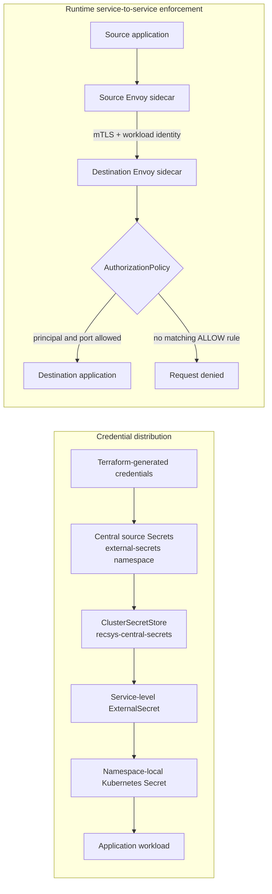
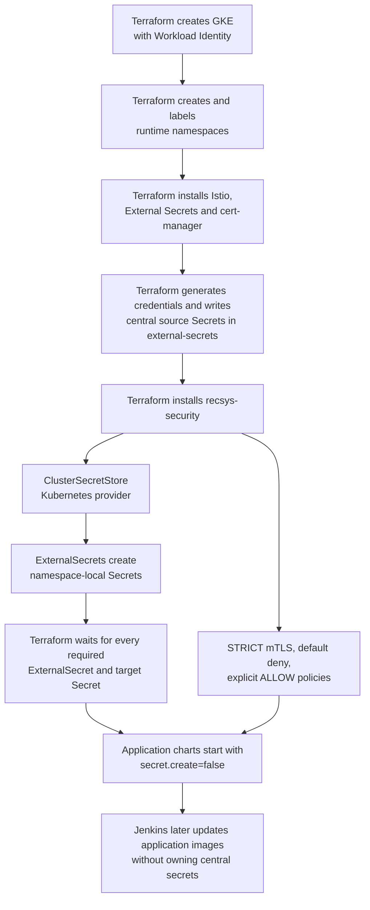
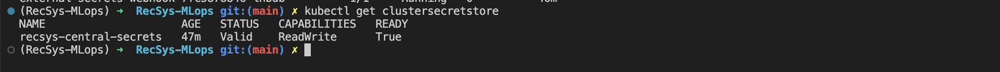
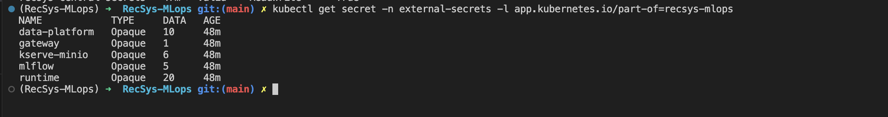
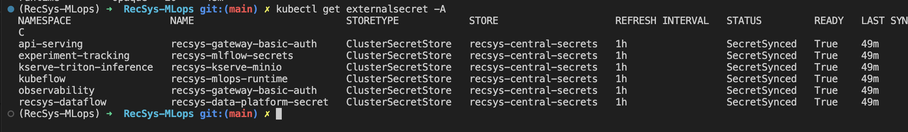
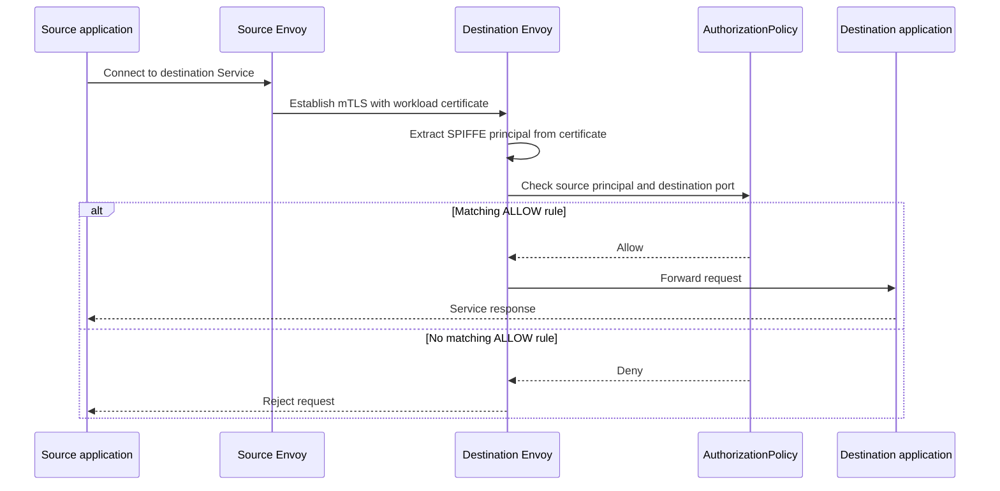

# Security Proof

This proof covers the final-coursework rubric item **Security** on GCP/GKE project `rec-sys-503309`.

## Scope

| Rubric item | Implementation |
|---|---|
| Centralized secret management | External Secrets Operator uses one central `ClusterSecretStore` named `recsys-central-secrets`, then syncs service-specific Kubernetes Secrets into the namespaces that need them. |
| Service-to-service authentication | Istio sidecar injection, STRICT mTLS, namespace-level default deny, and explicit `AuthorizationPolicy` allow rules by source principal and port. |

## Security Architecture

The implementation separates credential distribution from runtime network enforcement:


```mermaid
flowchart LR
    subgraph SecretDistribution["Credential distribution"]
        T["Terraform-generated credentials"] --> C["Central source Secrets<br/>external-secrets namespace"]
        C --> S["ClusterSecretStore<br/>recsys-central-secrets"]
        S --> E["Service-level ExternalSecret"]
        E --> K["Namespace-local Kubernetes Secret"]
        K --> W["Application workload"]
    end

    subgraph ServiceMesh["Runtime service-to-service enforcement"]
        A["Source application"] --> X["Source Envoy sidecar"]
        X -->|"mTLS + workload identity"| Y["Destination Envoy sidecar"]
        Y --> P{"AuthorizationPolicy"}
        P -->|"principal and port allowed"| D["Destination application"]
        P -->|"no matching ALLOW rule"| R["Request denied"]
    end
```

| Security plane | Main control | Enforcement point |
|---|---|---|
| Secret management | `ClusterSecretStore` and `ExternalSecret` | External Secrets Operator creates or refreshes namespace-local Secrets consumed by workloads. |
| Authentication | Istio `PeerAuthentication` in `STRICT` mode | Source and destination Envoy sidecars establish mutually authenticated TLS. |
| Authorization | Default-deny plus explicit `AuthorizationPolicy` resources | Destination Envoy validates source workload identity and destination port before forwarding traffic. |

## Effective Production Security Setup

Security is bootstrapped before the application releases that depend on it. The
effective GCP configuration differs from the reusable chart defaults in two
important ways: the central secret backend is Kubernetes, not Vault, and
Terraform expands the mesh policy scope to six runtime namespaces.

### Bootstrap Order And Ownership


```mermaid
flowchart TD
    GKE["Terraform creates GKE<br/>with Workload Identity"]
    NS["Terraform creates and labels<br/>runtime namespaces"]
    Operators["Terraform installs Istio,<br/>External Secrets and cert-manager"]
    Source["Terraform generates credentials and writes<br/>central source Secrets in external-secrets"]
    Security["Terraform installs recsys-security"]
    Store["ClusterSecretStore<br/>Kubernetes provider"]
    Sync["ExternalSecrets create<br/>namespace-local Secrets"]
    Mesh["STRICT mTLS, default deny,<br/>explicit ALLOW policies"]
    Wait["Terraform waits for every required<br/>ExternalSecret and target Secret"]
    Apps["Application charts start with<br/>secret.create=false"]
    Jenkins["Jenkins later updates application images<br/>without owning central secrets"]

    GKE --> NS --> Operators
    Operators --> Source --> Security
    Security --> Store --> Sync --> Wait --> Apps --> Jenkins
    Security --> Mesh --> Apps
```

| Layer | Current implementation and owner |
| --- | --- |
| GCP identity | Terraform enables the GKE Workload Identity pool. Node VMs use `recsys-mlops-nodes`; the `ci/recsys-jenkins` Kubernetes service account receives direct Artifact Registry writer IAM through its Workload Identity principal. |
| Kubernetes identity | Kubernetes service accounts identify workloads to the API server and become Istio SPIFFE principals such as `cluster.local/ns/api-serving/sa/default`. |
| Secret source | Terraform-generated or supplied values are stored as five source Kubernetes Secrets in the `external-secrets` namespace: `data-platform`, `mlflow`, `runtime`, `kserve-minio`, and `gateway`. |
| Secret distribution | The Terraform-owned `recsys-security` release creates one Kubernetes-backed `ClusterSecretStore` and namespace-local `ExternalSecret` objects. External Secrets Operator owns the generated target Secrets. |
| East-west transport | Istio sidecars provide workload certificates and mTLS. Destination-side `AuthorizationPolicy` resources enforce source principal and port allow lists. |
| Network segmentation | Two NetworkPolicy templates select MinIO, feature Postgres, and Redis. They describe namespace/port boundaries, subject to the GKE network-policy enforcement caveat below. |
| North-south access | NGINX terminates TLS and applies shared Basic Auth and rate limits before its Envoy sidecar sends mTLS traffic to API and observability workloads. |
| Release ownership | Terraform owns the central secret payloads, `recsys-security`, Istio/operator releases, and gateway. Jenkins owns application image releases and reads already-synced runtime Secrets; it does not receive plaintext secrets through Helm arguments. |

The effective overrides are assembled in
[locals.tf](../../../infra/terraform/gcp/locals.tf), the source payloads and
readiness gate are in
[secret_management.tf](../../../infra/terraform/gcp/secret_management.tf), and
the security release dependency chain is in
[recsys_services.tf](../../../infra/terraform/gcp/recsys_services.tf#L486).

### Effective Secret Backend

The chart supports Vault as a reusable default, but production Terraform sets:

```text
secretStore.provider = kubernetes
secretStore.name = recsys-central-secrets
secretStore.kubernetes.remoteNamespace = external-secrets
secretStore.kubernetes.auth.serviceAccount = external-secrets/external-secrets
externalSecrets.creationPolicy = Owner
```

Therefore the current design is centralized **inside the GKE cluster**. It is
not currently backed by HashiCorp Vault, Google Secret Manager, or Cloud KMS.
The `ClusterSecretStore` uses the External Secrets service account to read the
source Kubernetes Secrets and materialize only the requested group in each
target namespace.

The target Secret is owned by its `ExternalSecret`, so deleting the
`ExternalSecret` can also delete the generated Secret under `creationPolicy:
Owner`. Terraform's `recsys_external_secrets_ready` gate waits for each
`ExternalSecret` to report Ready and verifies that its target Secret exists
before MLflow, data-platform, serving, observability, or gateway workloads are
allowed to roll out.

### Effective Mesh Enforcement Scope

Terraform supplies the following namespace list to the security chart rather
than relying on the shorter chart default:

| Namespace | Sidecar injection | STRICT mTLS and default deny | Main explicit access |
| --- | --- | --- | --- |
| `api-serving` | Enabled | Enforced | NGINX, Prometheus, API-internal calls, and dataflow callers to ports `80/8080`. |
| `kserve-triton-inference` | Enabled | Enforced | API and Prometheus identities to KServe/Triton ports `80/8080/9000`. |
| `recsys-dataflow` | Enabled | Enforced | Dataflow, Kubeflow, DataHub, Prometheus, and selected API access to data/platform ports. |
| `kubeflow` | Enabled | Enforced | Kubeflow-local traffic plus dataflow and Prometheus on the configured KFP/Ray/artifact ports. |
| `experiment-tracking` | Enabled | Enforced | Kubeflow, KServe, and Prometheus to MLflow/Postgres/MinIO ports. |
| `observability` | Enabled | Enforced | API, dataflow, Kubeflow, Prometheus, Promtail, and NGINX to Grafana/Loki/Tempo/PushGateway/exporter ports. |
| `datahub` | Enabled by the namespace resource | **Not included** in the security chart's STRICT/default-deny list | Its sidecar can originate and receive mesh traffic, but this chart does not enforce a DataHub namespace baseline. |
| `ingress-nginx` | Enabled for the controller | **Not included** in the STRICT/default-deny list | Its service-account principal is allowed by destination API/observability policies. |
| `ci` | Explicitly disabled on Jenkins/watcher pods | Not enforced | Jenkins uses Kubernetes RBAC, Workload Identity, and Kubernetes Secrets instead of this mesh policy set. |
| `analytics` | Not configured by this security chart | Not enforced | Analytics is outside the current mesh authorization boundary. |

A namespace label only causes sidecar injection; it does not by itself create a
STRICT `PeerAuthentication` or default-deny `AuthorizationPolicy`. This is why
DataHub sidecar presence is proof of mesh participation, but not proof that the
same namespace-level deny baseline is enforced there.

### Service-To-Service Allow Matrix

The main runtime paths opened after default deny are:

| Caller identity | Destination | Ports and purpose |
| --- | --- | --- |
| `api-serving/default` | `recsys-dataflow` | `5432/6379` for Feast/Postgres and Redis features. |
| `api-serving/default` | `kserve-triton-inference` | `80/8080/9000` for KServe HTTP and Triton gRPC inference. |
| `ingress-nginx/ingress-nginx` | `api-serving` | `80/8080` for public feature API and demo routes. |
| `ingress-nginx/ingress-nginx` | `observability` | `3000/3100/3200` for public Grafana, Loki, and Tempo query routes. |
| `recsys-dataflow/default` | `kubeflow` | KFP API and workflow-related ports for drift-triggered retraining. |
| Kubeflow pipeline service accounts | `experiment-tracking` | `5000/5432/9000` for MLflow, registry Postgres, and artifact MinIO. |
| `observability/recsys-prometheus` | Runtime namespaces | Metrics/exporter ports required by Prometheus scraping. |
| `observability/recsys-promtail` | Loki | `3100` for log ingestion. |

Public gateway authentication and TLS are an additional north-south layer; they
do not replace mesh identity. The full NGINX, DNS, certificate, Basic Auth, and
rate-limit setup is documented in
[Routing & Gateway](routing_gateway.md#setup-and-configuration-flow).

### GCP IAM And Jenkins Deployment Identity

GKE disables legacy ABAC and client certificates and enables Workload Identity.
The Jenkins pod runs as Kubernetes service account `ci/recsys-jenkins`; Terraform
grants that workload principal `roles/artifactregistry.writer`, so Jenkins can
push immutable build artifacts without mounting a static Google service-account
JSON key. Jenkins preflight verifies the production project, cluster context,
registry, identity, and upload permission before deployment.

Inside Kubernetes, however, the Jenkins service account is bound to the
`recsys-ci-runner` ClusterRole with wildcard API groups, resources, and verbs.
This is effectively cluster-admin-equivalent access and is what allows the
pipeline to upgrade releases across namespaces. The controller also runs a
privileged Docker-in-Docker sidecar with an unauthenticated pod-local Docker API
on port `2375`; compromise of the Jenkins container therefore has a large
cluster and node-runtime blast radius. These are current implementation facts,
not least-privilege targets.

### Workload Hardening Present In Selected Charts

The serving runtime, demo frontend/backend, and model rollout watcher explicitly
run as non-root and/or disable privilege escalation. Triton and demo containers
drop Linux capabilities, and demo pods use the runtime-default seccomp profile.
These controls are workload-specific: there is no namespace Pod Security
Admission label enforcing them platform-wide, and several other charts rely on
their image defaults.

## Current Security Boundaries And Gaps

The controls above are real, but their current boundary should not be
overstated:

- **Terraform state contains secret material.** Generated passwords and the
  centralized Kubernetes Secret payloads are present in the local Terraform
  state. The state and `terraform.tfvars` are ignored by Git, but there is no
  remote encrypted backend, locking, centralized access policy, or state audit
  trail.
- **The secret backend is cluster-local.** Compromise of the cluster or the
  External Secrets service account can expose the source and replicated
  Secrets. Google Secret Manager or Vault would create a stronger external
  trust boundary.
- **Kubernetes NetworkPolicy is not enforced by the current GKE cluster.** The
  state reports `network_policy.enabled=false` and no Dataplane V2 provider.
  The MinIO/Postgres/Redis NetworkPolicy objects can be rendered and applied but
  do not isolate traffic until GKE network-policy enforcement is enabled.
- **The control plane is public.** Private nodes/endpoints are disabled and no
  `master_authorized_networks_config` is set. GKE authentication still applies,
  but the Kubernetes API endpoint is internet-reachable rather than restricted
  to an approved CIDR/VPN path.
- **Mesh coverage is partial.** `datahub`, `analytics`, `ci`, and
  `ingress-nginx` do not receive this chart's namespace STRICT/default-deny
  baseline. Several compatibility policies intentionally use `PERMISSIVE`, and
  selected workload policies omit a source constraint, allowing any source that
  can reach the selected port.
- **Jenkins is highly privileged.** Wildcard cluster RBAC, root startup tasks,
  privileged Docker-in-Docker, and a TLS-disabled Docker socket are acceptable
  only if the Jenkins namespace and webhook are treated as a high-trust
  administration boundary.
- **The shared GKE node identity can publish images.** The node service account
  currently has both Artifact Registry reader and writer roles. Workload
  Identity gives Jenkins its own writer principal, so the node-level writer
  grant is broader than required for normal image pulls and weakens workload
  isolation.
- **Gateway auth is shared Basic Auth.** It protects public API and
  observability routes, but it is not per-user OAuth/OIDC, short-lived identity,
  or application-level authorization. The production ClusterIssuer is also an
  external prerequisite rather than a Terraform-owned object.
- **Rotation requires workload action.** External Secrets refreshes targets
  hourly, but pods using environment variables retain their previous values
  until restarted. No automatic reloader is installed.
- **Supply-chain enforcement is incomplete.** Jenkins deploys immutable image
  digests and performs vulnerability scanning, but GKE Binary Authorization and
  admission-time signature verification are not configured.
- **Destruction protection is off.** The current cluster has Terraform/GKE
  deletion protection disabled, increasing the impact of an accidental
  infrastructure destroy.

## Centralized Secret Management

The security setup keeps source credentials centralized and lets workloads consume namespace-local synced secrets. This avoids copying secret manifests into every service chart while still giving each namespace only the secret it needs.

### Code Reference

- [dependencies.tf (line 58)](../../../infra/terraform/gcp/dependencies.tf#L58), [dependencies.tf (line 74)](../../../infra/terraform/gcp/dependencies.tf#L74): installs External Secrets Operator with Helm and CRDs.
- [secret_management.tf (line 1)](../../../infra/terraform/gcp/secret_management.tf#L1), [secret_management.tf (line 78)](../../../infra/terraform/gcp/secret_management.tf#L78): defines central source-secret payloads for data platform, MLflow, runtime, KServe, and gateway credentials.
- [secretstore.yaml (line 1)](../../../infra/helm/recsys-security/templates/secretstore.yaml#L1), [secretstore.yaml (line 35)](../../../infra/helm/recsys-security/templates/secretstore.yaml#L35): renders the central `ClusterSecretStore`.
- [externalsecrets.yaml (line 1)](../../../infra/helm/recsys-security/templates/externalsecrets.yaml#L1), [externalsecrets.yaml (line 34)](../../../infra/helm/recsys-security/templates/externalsecrets.yaml#L34): renders `ExternalSecret` objects that sync target Kubernetes Secrets.

### End-To-End Secret Flow

1. Terraform creates grouped source credentials.

   [secret_management.tf (line 1)](../../../infra/terraform/gcp/secret_management.tf#L1) groups credentials by platform responsibility: `data-platform`, `mlflow`, `runtime`, `kserve-minio`, and `gateway`. Terraform stores the source objects as Kubernetes Secrets in the `external-secrets` namespace and labels each object with its security scope.

2. One `ClusterSecretStore` exposes the central source to External Secrets Operator.

   The GCP deployment configures the Kubernetes provider, store name `recsys-central-secrets`, remote namespace `external-secrets`, and the `external-secrets` service account in [locals.tf (line 96)](../../../infra/terraform/gcp/locals.tf#L96). The store authenticates to the Kubernetes API and reads source objects from that namespace.

3. Service-level `ExternalSecret` resources request the credential group needed in their namespace.

   ```yaml
   spec:
     refreshInterval: 1h
     secretStoreRef:
       kind: ClusterSecretStore
       name: recsys-central-secrets
     target:
       name: recsys-mlops-runtime
       creationPolicy: Owner
     dataFrom:
       - extract:
           key: runtime
   ```

   The same template renders this distribution map:

   | Central group | Target namespace | Target Kubernetes Secret | Main consumer |
   |---|---|---|---|
   | `data-platform` | `recsys-dataflow` | `recsys-data-platform-secret` | Airflow, Spark, Flink, Kafka Connect, PostgreSQL, Redis, and MinIO jobs |
   | `data-platform` | `observability` | `recsys-data-platform-secret` | PostgreSQL and Redis exporters |
   | `mlflow` | `experiment-tracking` | `recsys-mlflow-secrets` | MLflow, model-store MinIO, and registry PostgreSQL |
   | `runtime` | `kubeflow` | `recsys-mlops-runtime` | Kubeflow components, Ray jobs, model registry, and model CD handoff |
   | `kserve-minio` | `kserve-triton-inference` | `recsys-kserve-minio` | KServe storage initializer |
   | `gateway` | `api-serving`, `observability` | `recsys-gateway-basic-auth` | NGINX ingress authentication |

4. Workloads consume the namespace-local target Secret.

   Applications do not read the central source namespace directly. They use standard Kubernetes `envFrom`, `secretKeyRef`, or a service-account secret reference. For example, Flink loads `recsys-data-platform-secret` through the [split streaming chart](../../../infra/helm/recsys-streaming/templates/flink.yaml#L69), MLflow reads MinIO credentials through [mlflow.yaml (line 30)](../../../infra/helm/mlflow-stack/templates/mlflow.yaml#L30), and the KServe service account references `recsys-kserve-minio` in [kserve-serviceaccount.yaml (line 1)](../../../infra/helm/recsys-serving/templates/kserve-serviceaccount.yaml#L1).

5. External Secrets Operator reconciles changes.

   Every `refreshInterval`, the operator rereads the central group and updates the namespace-local Secret. Workloads that import secrets as environment variables receive the new value after their pods restart; consumers that mount Secret volumes can use Kubernetes volume refresh behavior.

### External Secrets Operator Runtime

**Capture command**

```bash
kubectl get pods -n external-secrets
```


**Figure: External Secrets Operator pod proof.** The controller pod reconciles `ExternalSecret` resources, the webhook validates admission requests, and the cert-controller manages webhook certificates. Seeing these pods in `Running` state proves the secret synchronization control plane is available.


**Figure: External Secrets Operator k9s proof.** This view shows the same External Secrets components from the cluster UI, including readiness, restart count, node placement, and resource usage. It is useful as a UI-based proof that the operator is live on GKE, not only present as YAML.

### Central ClusterSecretStore

**Capture command**

```bash
kubectl get clustersecretstore
```



**Figure: Central ClusterSecretStore proof.** `recsys-central-secrets` is the shared secret backend reference used by all service-level `ExternalSecret` objects. A healthy/ready status proves workloads can reuse one central secret store instead of each namespace defining its own secret source.

### Central Source Secrets

**Capture command**

```bash
kubectl get secret -n external-secrets -l app.kubernetes.io/part-of=recsys-mlops
```



**Figure: Central source secret groups.** The source secrets are grouped by platform area, for example data platform, gateway, KServe/MinIO, MLflow, and runtime credentials. This proves secrets are stored centrally first, then synced outward to the namespaces that need them.

### Synced Service Secrets

**Capture command**

```bash
kubectl get externalsecret -A
```



**Figure: Namespace-level ExternalSecret sync proof.** Each row shows an `ExternalSecret` in a service namespace, the `ClusterSecretStore` it reads from, and the sync/ready state. This proves namespace-local Kubernetes Secrets are generated by External Secrets Operator rather than manually duplicated.

## Service Mesh Authentication

Istio enforces service identity and network-level access control. The baseline posture is STRICT mTLS plus default deny; specific service-to-service flows are then opened with `AuthorizationPolicy`.

### Code Reference

- [istio-mtls.yaml (line 1)](../../../infra/helm/recsys-security/templates/istio-mtls.yaml#L1), [istio-mtls.yaml (line 116)](../../../infra/helm/recsys-security/templates/istio-mtls.yaml#L116): renders namespace STRICT mTLS and selected permissive exceptions.
- [istio-authorization.yaml (line 1)](../../../infra/helm/recsys-security/templates/istio-authorization.yaml#L1), [istio-authorization.yaml (line 235)](../../../infra/helm/recsys-security/templates/istio-authorization.yaml#L235): renders default-deny and explicit allow policies for API, KServe/Triton, Dataflow, Kubeflow, MLflow, and Observability traffic.

### Request Enforcement Flow


```mermaid
sequenceDiagram
    participant A as Source application
    participant SE as Source Envoy
    participant DE as Destination Envoy
    participant P as AuthorizationPolicy
    participant D as Destination application

    A->>SE: Connect to destination Service
    SE->>DE: Establish mTLS with workload certificate
    DE->>DE: Extract SPIFFE principal from certificate
    DE->>P: Check source principal and destination port
    alt Matching ALLOW rule
        P-->>DE: Allow
        DE->>D: Forward request
        D-->>A: Service response
    else No matching ALLOW rule
        P-->>DE: Deny
        DE-->>A: Reject request
    end
```

1. Namespace label `istio-injection=enabled` causes the Istio admission webhook to add `istio-init` and `istio-proxy` to newly created pods.
2. `istio-init` prepares traffic redirection so application ingress and egress pass through Envoy.
3. Istiod gives each Envoy a short-lived workload certificate representing its Kubernetes service account. The identity format is `cluster.local/ns/<namespace>/sa/<service-account>`.
4. Namespace `PeerAuthentication` in `STRICT` mode rejects plaintext service traffic and requires the two Envoys to establish mutually authenticated TLS.
5. The destination Envoy applies the namespace default-deny policy. It forwards the request only when an explicit `ALLOW` policy matches its source identity and destination port.

### Identity, Default Deny, And Explicit Allow

Authentication and authorization are separate controls:

```yaml
# Authentication: require an authenticated mTLS peer.
kind: PeerAuthentication
spec:
  mtls:
    mode: STRICT
---
# Authorization baseline: no traffic is allowed by default.
kind: AuthorizationPolicy
spec: {}
```

mTLS answers **which workload is calling**. The source identity is derived from the workload certificate, not from a caller-supplied HTTP header. `AuthorizationPolicy` then answers **whether that workload may call the destination port**.

For example, the KServe policy allows the API and Prometheus service accounts to reach Triton/KServe ports:

```yaml
rules:
  - from:
      - source:
          principals:
            - cluster.local/ns/api-serving/sa/default
            - cluster.local/ns/observability/sa/recsys-prometheus
    to:
      - operation:
          ports: ["80", "8080", "9000"]
```

The principal and port checks are enforced by the destination Envoy before the request reaches Triton.

### API-To-Triton Security Example

The online inference path uses both security planes:

```text
KServe service account
  -> reads recsys-kserve-minio credentials
  -> storage-initializer downloads the model repository
  -> Triton loads the model from /mnt/models

FastAPI application
  -> source Envoy identifies api-serving/default
  -> mTLS connection to the selected control/candidate Triton Service
  -> destination Envoy evaluates recsys-kserve-allow
  -> allowed on gRPC port 9000
  -> request reaches Triton
```

The `InferenceService` runs with the credential-bearing KServe service account in [inferenceservice.yaml (line 15)](../../../infra/helm/recsys-serving/templates/inferenceservice.yaml#L15). Its storage initializer uses the synced secret to download model artifacts, while the API-to-Triton inference request is authenticated and authorized independently by the mesh.

### Compatibility Exceptions

The namespace baseline remains `STRICT`, with targeted `PERMISSIVE` overrides for integrations that must also accept non-mesh traffic. Current exceptions include the data-platform MinIO S3 port, selected Kubeflow services, Prometheus access for KEDA, Loki ingestion, and Tempo OTLP ports. These overrides are scoped with workload selectors and ports in [istio-mtls.yaml (line 20)](../../../infra/helm/recsys-security/templates/istio-mtls.yaml#L20).

The MinIO S3 NetworkPolicy manifest selects the dataflow, Kubeflow, DataHub, and
observability namespaces on port `9000` through
[minio-network-policy.yaml (line 1)](../../../infra/helm/recsys-security/templates/minio-network-policy.yaml#L1).
The current GKE cluster does not enable Kubernetes NetworkPolicy enforcement,
so this object documents the intended layer-3/4 boundary but does not currently
enforce it; Istio authorization remains the active runtime control.

### Mesh-Enabled Namespaces

**Capture command**

```bash
kubectl get ns -L istio-injection
```


**Figure: Istio sidecar injection scope.** Namespaces with `istio-injection=enabled` automatically receive Istio sidecars on new pods. This proves the security boundary covers core runtime namespaces such as API serving, KServe/Triton, observability, experiment tracking, and dataflow.

### mTLS And Authorization Policies

**Capture command**

```bash
kubectl get peerauthentication,authorizationpolicy -A
```


**Figure: mTLS and default-deny policy proof.** `PeerAuthentication` enforces STRICT mTLS for mesh traffic, while empty/default `AuthorizationPolicy` objects deny traffic by default. The explicit `ALLOW` policies then reopen only the required service-to-service paths by source identity and destination port.

| Namespace | Default behavior | Explicit allow examples |
|---|---|---|
| `api-serving` | Deny all by default under STRICT mTLS | Allows NGINX ingress, Prometheus, internal API-to-feature traffic, and dataflow-generated calls to API ports `80`/`8080`. |
| `kserve-triton-inference` | Deny all by default under STRICT mTLS | Allows API service account and Prometheus to Triton/KServe ports `80`, `8080`, and `9000`. |
| `recsys-dataflow` | Deny all by default under STRICT mTLS | Allows internal data platform traffic, Kubeflow pipeline traffic, DataHub traffic, Prometheus scraping, and API access to Redis `6379`. |
| `kubeflow` | Deny all by default under STRICT mTLS | Allows pipeline components, metadata services, Ray dashboard/job ports, MinIO-compatible artifact ports, and Prometheus access where required. |
| `experiment-tracking` | Deny all by default under STRICT mTLS | Allows Kubeflow, KServe, and Prometheus to MLflow, Postgres, and artifact storage ports. |
| `observability` | Deny all by default under STRICT mTLS | Allows Prometheus, Promtail, API, Airflow/Kubeflow, and NGINX gateway access to Grafana, Loki, Tempo, Pushgateway, and exporter ports. |

### Sidecar Injection Across Runtime Services

The sidecar screenshots are UI proof that important runtime services are actually running with Istio components, not just configured through namespace labels. The expected pattern is:

- `istio-init`: init container that prepares traffic redirection rules.
- `istio-proxy`: Envoy sidecar that handles mTLS and policy enforcement.
- main service container: the application workload, for example API, Grafana, or DataHub.


**Figure: API serving sidecar proof.** The `recsys-api-serving` pod has three containers: `istio-init`, `istio-proxy`, and the FastAPI application container. This proves user-facing recommendation traffic enters the mesh before reaching the API process.


**Figure: Online feature API sidecar proof.** The `recsys-online-feature-api` pod also contains `istio-init`, `istio-proxy`, and the API container. This proves internal feature-pull traffic between serving APIs is protected by mesh identity and mTLS.


**Figure: DataHub sidecar readiness proof.** DataHub pods show `2/2` readiness, meaning the application container and Istio sidecar are both ready. This proves governance services are also inside the service mesh instead of being left as plain cluster networking.


**Figure: DataHub service mesh example.** This k9s view shows the DataHub
namespace with sidecar-injected pods and operational state. It proves that
DataHub participates in mesh transport; the current `recsys-security` namespace
list does not give DataHub its own STRICT/default-deny baseline, as documented
in the effective coverage table above.


**Figure: Observability sidecar proof.** The Grafana pod contains `istio-init`, `istio-proxy`, and the Grafana container. This proves metric-dashboard access is also routed through the mesh and can be governed by Istio policies.

### Sidecar Injection On KServe/Triton Workloads

**Capture UI**

Open the KServe/Triton predictor pod in k9s and switch to the container view.


**Figure: KServe/Triton sidecar proof.** The `recsys-bst-triton-predictor` pod runs with four containers: `istio-init` prepares traffic redirection, `istio-proxy` is the running Envoy sidecar for mTLS/policy enforcement, `storage-initializer` loads the model artifacts, and `kserve-container` runs the Triton inference server. This proves model inference traffic is not a plain pod-to-pod call; it is served by Triton/KServe while participating in the Istio service mesh.
