# Security Proof

This proof covers the final-coursework rubric item **Security** on GCP/GKE project `recsys-mlops`.

## Scope

| Rubric item | Implementation |
|---|---|
| Centralized secret management | HashiCorp Vault HA stores the source values in KV v2. External Secrets Operator authenticates with a short-lived Kubernetes service-account JWT through `ClusterSecretStore/recsys-vault`, then syncs namespace-local Kubernetes Secrets. |
| Service-to-service authentication | Istio sidecar injection, STRICT mTLS, namespace-level default deny, and explicit `AuthorizationPolicy` allow rules by source principal and port. |

## Security Architecture

The implementation separates credential distribution from runtime network enforcement:

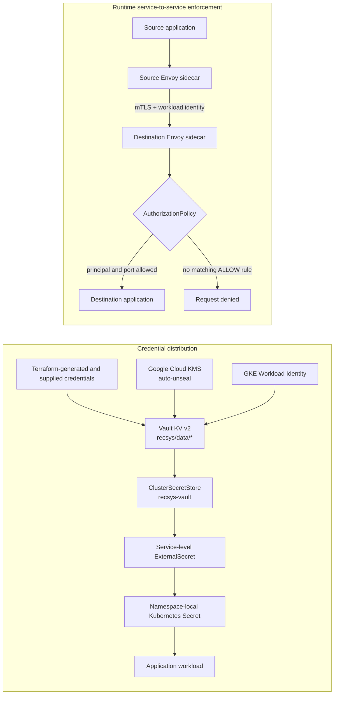
```mermaid
flowchart LR
    subgraph SecretDistribution["Credential distribution"]
        T["Terraform-generated and supplied credentials"] --> V["Vault KV v2<br/>recsys/data/*"]
        KMS["Google Cloud KMS<br/>auto-unseal"] --> V
        WI["GKE Workload Identity"] --> V
        V --> S["ClusterSecretStore<br/>recsys-vault"]
        S --> E["Service-level ExternalSecret"]
        E --> K["Namespace-local Kubernetes Secret"]
        K --> W["Application workload"]
    end

    subgraph ServiceMesh["Runtime service-to-service enforcement"]
        A["Source application"] --> X["Source Envoy sidecar"]
        X -->|"mTLS + workload identity"| Y["Destination Envoy sidecar"]
        Y --> P{"AuthorizationPolicy"}
        P -->|"principal and port allowed"| D["Destination application"]
        P -->|"no matching ALLOW rule"| R["Request denied"]
    end
```

| Security plane | Main control | Enforcement point |
|---|---|---|
| Secret management | Vault KV v2, `ClusterSecretStore`, and `ExternalSecret` | Vault is the source of truth; External Secrets Operator creates or refreshes namespace-local Secrets consumed by workloads. |
| Authentication | Istio `PeerAuthentication` in `STRICT` mode | Source and destination Envoy sidecars establish mutually authenticated TLS. |
| Authorization | Default-deny plus explicit `AuthorizationPolicy` resources | Destination Envoy validates source workload identity and destination port before forwarding traffic. |

## Effective Production Security Setup

Security is bootstrapped before the application releases that depend on it. The
effective GCP configuration deploys Vault 2.0.3 with the official HashiCorp
chart 0.34.0, HA integrated storage (Raft), three persistent replicas, GCP Cloud
KMS auto-unseal, and GKE Workload Identity. Terraform also expands the mesh
policy scope to six runtime namespaces.

### Bootstrap Order And Ownership

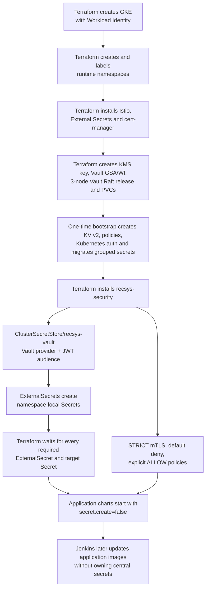
```mermaid
flowchart TD
    GKE["Terraform creates GKE<br/>with Workload Identity"]
    NS["Terraform creates and labels<br/>runtime namespaces"]
    Operators["Terraform installs Istio,<br/>External Secrets and cert-manager"]
    VaultInfra["Terraform creates KMS key, Vault GSA/WI,<br/>3-node Vault Raft release and PVCs"]
    Bootstrap["One-time bootstrap creates KV v2, policies,<br/>Kubernetes auth and migrates grouped secrets"]
    Security["Terraform installs recsys-security"]
    Store["ClusterSecretStore/recsys-vault<br/>Vault provider + JWT audience"]
    Sync["ExternalSecrets create<br/>namespace-local Secrets"]
    Mesh["STRICT mTLS, default deny,<br/>explicit ALLOW policies"]
    Wait["Terraform waits for every required<br/>ExternalSecret and target Secret"]
    Apps["Application charts start with<br/>secret.create=false"]
    Jenkins["Jenkins later updates application images<br/>without owning central secrets"]

    GKE --> NS --> Operators
    Operators --> VaultInfra --> Bootstrap --> Security
    Security --> Store --> Sync --> Wait --> Apps --> Jenkins
    Security --> Mesh --> Apps
```

| Layer | Current implementation and owner |
| --- | --- |
| GCP identity | Terraform enables the GKE Workload Identity pool. Node VMs use `recsys-mlops-nodes`; the `ci/recsys-jenkins` Kubernetes service account receives direct Artifact Registry writer IAM through its Workload Identity principal. |
| Kubernetes identity | Kubernetes service accounts identify workloads to the API server and become Istio SPIFFE principals such as `cluster.local/ns/api-serving/sa/default`. |
| Secret source | Vault KV v2 mount `recsys` stores nine groups: `data-platform`, `mlflow`, `runtime`, `kserve-minio`, `gateway`, `analytics`, `jenkins-runtime`, `agent-gateway`, and `agentregistry`. The Agent Gateway API key and Agent Registry PostgreSQL credentials are generated directly into Vault when absent; the other groups preserve the documented migration flow. |
| Secret distribution | The Terraform-owned `recsys-security` release creates Vault-backed `ClusterSecretStore/recsys-vault` and namespace-local `ExternalSecret` objects. The analytics and demo-web releases use the same store. External Secrets Operator owns the generated target Secrets. |
| East-west transport | Istio sidecars provide workload certificates and mTLS. Destination-side `AuthorizationPolicy` resources enforce source principal and port allow lists. |
| Network segmentation | Two NetworkPolicy templates select MinIO, feature Postgres, and Redis. They describe namespace/port boundaries, subject to the GKE network-policy enforcement caveat below. |
| North-south access | NGINX terminates TLS and applies shared Basic Auth and rate limits before its Envoy sidecar sends mTLS traffic to API and observability workloads. |
| Release ownership | Vault owns the central payloads. Terraform owns Vault/KMS/IAM, `recsys-security`, Istio/operator releases, and gateway. Jenkins owns application image releases and reads already-synced runtime Secrets; it does not receive plaintext secrets through Helm arguments. |

The Vault infrastructure is defined in [vault.tf](../../../infra/terraform/gcp/modules/kubernetes-platform/vault.tf#L1),
its HA server configuration is in [values.yaml.tftpl](../../../configs/vault/values.yaml.tftpl#L1),
and the safe initialization/migration workflow is in
[bootstrap_vault.sh](../../../ops/gcp/bootstrap_vault.sh#L1). The effective
External Secrets overrides are assembled in
[locals.tf](../../../infra/terraform/gcp/modules/kubernetes-platform/locals.tf#L89).

### Effective Secret Backend

Production Terraform sets:

```text
secretStore.provider = vault
secretStore.name = recsys-vault
vault.server = http://vault.vault.svc.cluster.local:8200
vault.mountPath = recsys
vault.auth.mountPath = kubernetes
vault.auth.role = recsys-external-secrets
vault.auth.serviceAccount = external-secrets/external-secrets
vault.auth.audiences = [vault]
externalSecrets.creationPolicy = Owner
```

Vault is reachable only through the internal ClusterIP endpoint
`http://vault.vault.svc.cluster.local:8200`; it has no public LoadBalancer or
Ingress. The `external-secrets/external-secrets` service account requests a JWT
with audience `vault`. Vault validates that JWT through Kubernetes TokenReview,
maps it to policy `recsys-external-secrets`, and returns a short-lived Vault
token (TTL 1 hour, maximum 4 hours). That policy can only read
`recsys/data/*` and list/read `recsys/metadata/*`.

Vault data is stored on three 10 GiB `standard` persistent disks by integrated
Raft storage. The Vault service account impersonates the dedicated Google
service account through Workload Identity; that GSA can view and
encrypt/decrypt only the `vault-unseal` Cloud KMS key. The KMS key has 90-day
rotation and Terraform `prevent_destroy`.

The target Secret is owned by its `ExternalSecret`, so deleting the
`ExternalSecret` can also delete the generated Secret under `creationPolicy:
Owner`. Terraform's `recsys_external_secrets_ready` gate waits for each
`ExternalSecret` to report Ready and verifies that its target Secret exists
before MLflow, data-platform, serving, observability, or gateway workloads are
allowed to roll out. Analytics and demo web also reference `recsys-vault` from
their own Helm releases.

### Deployment And Migration Runbook

This is intentionally a two-phase migration so ESO never switches to an empty
or uninitialized backend.

1. Set `deploy_vault=true` and temporarily keep
   `vault_legacy_source_secrets_enabled=true` in the ignored
   `infra/terraform/gcp/terraform.tfvars`.
2. Deploy only the Vault dependency chain first:

   ```bash
   terraform -chdir=infra/terraform/gcp init
   terraform -chdir=infra/terraform/gcp apply \
     -target=helm_release.vault \
     -target=kubernetes_cluster_role_binding_v1.vault_token_reviewer
   ```

3. Initialize Vault, configure auth/policies, migrate or generate the nine groups, encrypt
   the recovery artifact, and revoke the initial root token:

   ```bash
   bash ops/gcp/bootstrap_vault.sh
   ```

4. Switch the central store and the two independently owned ExternalSecrets:

   ```bash
   terraform -chdir=infra/terraform/gcp apply \
     -target=helm_release.recsys_security
   helm upgrade recsys-analytics infra/helm/recsys-analytics \
     --namespace analytics --reuse-values \
     --set externalSecret.storeName=recsys-vault --wait
   helm upgrade recsys-demo-web infra/helm/recsys-demo-web \
     --namespace api-serving --reuse-values \
     --set externalSecret.secretStoreName=recsys-vault --wait
   ```

5. Verify `recsys-vault` is valid and every ExternalSecret is synced. Only then
   set `vault_legacy_source_secrets_enabled=false` and apply the legacy-source
   removal. The manually supplied `external-secrets/analytics` migration source
   is also removed. Do not delete the namespace-local target Secrets; ESO owns
   and refreshes those for the workloads.

6. Run a normal, non-targeted `terraform plan` to review unrelated pending
   infrastructure changes separately. Targeting above is only for ordering the
   one-time backend migration.

## Centralized Secret Management

Vault is the central source of truth. Workloads continue to consume ordinary
namespace-local Kubernetes Secrets, but those objects are reconciled from Vault
and are not hand-copied into service charts.

### Code Reference

- [vault.tf (line 1)](../../../infra/terraform/gcp/modules/kubernetes-platform/vault.tf#L1), [vault.tf (line 20)](../../../infra/terraform/gcp/modules/kubernetes-platform/vault.tf#L20), [vault.tf (line 56)](../../../infra/terraform/gcp/modules/kubernetes-platform/vault.tf#L56): creates the Vault GSA, Cloud KMS key/IAM, Workload Identity binding, official Helm release, and TokenReview RBAC.
- [values.yaml.tftpl (line 1)](../../../configs/vault/values.yaml.tftpl#L1), [values.yaml.tftpl (line 55)](../../../configs/vault/values.yaml.tftpl#L55), [values.yaml.tftpl (line 86)](../../../configs/vault/values.yaml.tftpl#L86): configures Vault 2.0.3, three-node HA Raft, PVCs, internal service, and GCP KMS seal.
- [bootstrap_vault.sh (line 112)](../../../ops/gcp/bootstrap_vault.sh#L112), [bootstrap_vault.sh (line 145)](../../../ops/gcp/bootstrap_vault.sh#L145), [bootstrap_vault.sh (line 164)](../../../ops/gcp/bootstrap_vault.sh#L164), [bootstrap_vault.sh (line 175)](../../../ops/gcp/bootstrap_vault.sh#L175): initializes Vault, enables KV v2, writes least-privilege policy/Kubernetes auth, and migrates grouped secret values without printing them.
- [recsys-security values (line 28)](../../../infra/helm/recsys-security/values.yaml#L28): configures the core service `vaultPath` values, including the two `agent-gateway` mappings and the `agentregistry` database mapping.
- [bootstrap_vault.sh (line 177)](../../../ops/gcp/bootstrap_vault.sh#L177), [bootstrap_vault.sh (line 192)](../../../ops/gcp/bootstrap_vault.sh#L192), [bootstrap_vault.sh (line 216)](../../../ops/gcp/bootstrap_vault.sh#L216): writes the generated Agent Gateway API key, generated Agent Registry PostgreSQL payload, and migrated generic service groups respectively to `recsys/data/${secret_group}`.
- [secretstore.yaml (line 23)](../../../infra/helm/recsys-security/templates/secretstore.yaml#L23), [secretstore.yaml (line 31)](../../../infra/helm/recsys-security/templates/secretstore.yaml#L31): renders the Vault-backed `ClusterSecretStore`, including service-account JWT audience.
- [externalsecrets.yaml (line 1)](../../../infra/helm/recsys-security/templates/externalsecrets.yaml#L1): renders the core service `ExternalSecret` objects.
- [recsys-analytics values (line 6)](../../../infra/helm/recsys-analytics/values.yaml#L6), [recsys-demo-web values (line 64)](../../../infra/helm/recsys-demo-web/values.yaml#L64): point the independently owned analytics and demo-web ExternalSecrets at `recsys-vault`.

### Vault ACL Policy: Who Can Read What

The bootstrap creates the `recsys-external-secrets` Vault ACL policy with this
least-privilege rule:

```hcl
path "recsys/data/*" {
  capabilities = ["read"]
}
path "recsys/metadata/*" {
  capabilities = ["read", "list"]
}
```

This policy is assigned to Vault tokens issued through Kubernetes auth for the
`external-secrets/external-secrets` service account. It is therefore the
permission of **External Secrets Operator against Vault**, not a permission
granted directly to the application pods:

```text
ServiceAccount external-secrets/external-secrets
  -> Vault Kubernetes auth role recsys-external-secrets
  -> short-lived Vault token carrying policy recsys-external-secrets
  -> read Vault KV v2 values under recsys/data/*
  -> reconcile namespace-local Kubernetes Secrets
  -> application pods consume only their referenced Kubernetes Secret
```

For the KV v2 engine, `recsys/data/*` is the API path containing secret values;
`read` permits ESO to retrieve them but does not permit create, update, patch,
or delete. `recsys/metadata/*` contains path and version metadata; `read` and
`list` let ESO discover and inspect records without granting write access.
The wildcard covers the configured groups such as `agent-gateway`,
`agentregistry`, `data-platform`, and `runtime`, but each `ExternalSecret`
still selects a specific `remoteRef`/`dataFrom.extract` key and writes only to
its configured target namespace. Secret registration and rotation use the
separate scoped admin token rather than this read-only ESO policy.

The policy is rendered and installed in
[bootstrap_vault.sh (line 149)](../../../ops/gcp/bootstrap_vault.sh#L149), and
the binding to the exact service-account name/namespace, JWT audience, policy,
and token TTL is configured in
[bootstrap_vault.sh (line 166)](../../../ops/gcp/bootstrap_vault.sh#L166).
The `ClusterSecretStore` selects that role and service account in
[secretstore.yaml (line 23)](../../../infra/helm/recsys-security/templates/secretstore.yaml#L23),
with the concrete values defined in
[recsys-security values (line 1)](../../../infra/helm/recsys-security/values.yaml#L1).

### End-To-End Secret Flow

1. Terraform deploys the Vault endpoint and its unseal trust chain.

   [vault.tf (line 1)](../../../infra/terraform/gcp/modules/kubernetes-platform/vault.tf#L1) creates a
   dedicated GSA and exact-key KMS permissions. Workload Identity maps
   `vault/vault` to that GSA without a JSON service-account key. The official
   HashiCorp Helm chart installs three Vault pods backed by Raft PVCs. The live
   endpoint is `vault.vault.svc.cluster.local:8200` and is ClusterIP-only.

2. The one-time bootstrap initializes and populates Vault.

   Run `bash ops/gcp/bootstrap_vault.sh` while the migration source Secrets
   exist. It performs a KMS round-trip check, initializes five recovery shares
   with threshold three, enables KV v2 mount `recsys`, creates policies and the
   Kubernetes auth role, and copies these groups without printing values:

   The KV v2 logical record `recsys/<group>` is represented internally by the
   Vault API as `recsys/data/<group>`. The path configuration and write
   provenance for every stored group are:

   | Vault API path | Keys | Config secret path | Vault write implementation | Purpose |
   |---|---:|---|---|---|
   | `recsys/data/data-platform` | 12 | [recsys-security values (line 43)](../../../infra/helm/recsys-security/values.yaml#L43) | [generic migration writer (line 216)](../../../ops/gcp/bootstrap_vault.sh#L216) | MinIO and data-platform PostgreSQL credentials |
   | `recsys/data/mlflow` | 5 | [recsys-security values (line 51)](../../../infra/helm/recsys-security/values.yaml#L51) | [generic migration writer (line 216)](../../../ops/gcp/bootstrap_vault.sh#L216) | MLflow database and artifact-store credentials |
   | `recsys/data/runtime` | 25 | [recsys-security values (line 55)](../../../infra/helm/recsys-security/values.yaml#L55) | [generic migration writer (line 216)](../../../ops/gcp/bootstrap_vault.sh#L216) | Kubeflow/training runtime endpoints and credentials |
   | `recsys/data/kserve-minio` | 6 | [recsys-security values (line 60)](../../../infra/helm/recsys-security/values.yaml#L60) | [generic migration writer (line 216)](../../../ops/gcp/bootstrap_vault.sh#L216) | KServe S3 storage initializer credentials |
   | `recsys/data/gateway` | 1 | [recsys-security values (line 69)](../../../infra/helm/recsys-security/values.yaml#L69) | [generic migration writer (line 216)](../../../ops/gcp/bootstrap_vault.sh#L216) | Shared ingress Basic Auth payload |
   | `recsys/data/analytics` | 16 | [recsys-analytics values (line 6)](../../../infra/helm/recsys-analytics/values.yaml#L6) | [generic migration writer (line 216)](../../../ops/gcp/bootstrap_vault.sh#L216) | Trino/catalog/Superset/PostgreSQL credentials |
   | `recsys/data/jenkins-runtime` | 3 | [Terraform additional path (line 109)](../../../infra/terraform/gcp/modules/kubernetes-platform/locals.tf#L109) | [generic migration writer (line 216)](../../../ops/gcp/bootstrap_vault.sh#L216) | Jenkins URL, user, and runtime token merged into the Kubeflow runtime Secret |
   | `recsys/data/agent-gateway` | 1 | [client/server paths (line 28)](../../../infra/helm/recsys-security/values.yaml#L28) | [generated API-key writer (line 177)](../../../ops/gcp/bootstrap_vault.sh#L177) | Generated `AGENT_GATEWAY_API_KEY` shared by the kagent client and agentgateway validator |
   | `recsys/data/agentregistry` | 4 | [Agent Registry path (line 38)](../../../infra/helm/recsys-security/values.yaml#L38) | [generated PostgreSQL writer (line 192)](../../../ops/gcp/bootstrap_vault.sh#L192) | `POSTGRES_DB`, `POSTGRES_USER`, `POSTGRES_PASSWORD`, and `AGENT_REGISTRY_DATABASE_URL` |

   Plaintext exists only in a mode-700 temporary directory and is deleted on
   exit. Recovery shares and the scoped admin token are stored in
   `.vault-bootstrap/vault-init.json.enc`, encrypted by the same KMS key and
   mode 600; `.vault-bootstrap/` is gitignored. The initial root token is
   revoked after the scoped admin token is created.

3. One `ClusterSecretStore` authenticates External Secrets Operator to Vault.

   The GCP deployment selects provider `vault`, store `recsys-vault`, mount
   `recsys`, auth mount `kubernetes`, role `recsys-external-secrets`, and JWT
   audience `vault` in [locals.tf (line 89)](../../../infra/terraform/gcp/modules/kubernetes-platform/locals.tf#L89).

4. Service-level `ExternalSecret` resources request only the credential group needed in their namespace.

   ```yaml
   spec:
     refreshInterval: 1h
     secretStoreRef:
       kind: ClusterSecretStore
       name: recsys-vault
     target:
       name: recsys-mlops-runtime
       creationPolicy: Owner
     dataFrom:
       - extract:
           key: runtime
   ```

   The same template renders this distribution map:

   | Central group | Target namespace | Target Kubernetes Secret | Main consumer |
   |---|---|---|---|
   | `data-platform` | `recsys-dataflow` | `recsys-data-platform-secret` | Airflow, Spark, Flink, Kafka Connect, PostgreSQL, Redis, and MinIO jobs |
   | `data-platform` | `observability` | `recsys-data-platform-secret` | PostgreSQL and Redis exporters |
   | `mlflow` | `experiment-tracking` | `recsys-mlflow-secrets` | MLflow, model-store MinIO, and registry PostgreSQL |
   | `runtime` | `kubeflow` | `recsys-mlops-runtime` | Kubeflow components, Ray jobs, model registry, and model CD handoff |
   | `jenkins-runtime` | `kubeflow` (merged with `runtime`) | `recsys-mlops-runtime` | Jenkins model-CD handoff |
   | `kserve-minio` | `kserve-triton-inference` | `recsys-kserve-minio` | KServe storage initializer |
   | `gateway` | `api-serving`, `observability` | `recsys-gateway-basic-auth` | NGINX ingress authentication |
   | `agent-gateway` | `kagent` | `kagent-agent-gateway` | Bearer credential sent by kagent's OpenAI-compatible client |
   | `agent-gateway` | `llm-inference` | `agentgateway-api-keys` | Valid API-key set enforced by `AgentgatewayPolicy` in Strict mode |
   | `agentregistry` | `agentregistry` | `agentregistry-runtime` | Agent Registry server connection URL and pgvector PostgreSQL credentials |
   | `analytics` | `analytics` | `recsys-analytics-secret` | Trino, Superset, catalog PostgreSQL, and lakehouse thrift |
   | `data-platform` (selected properties only) | `api-serving` | `recsys-demo-web-db` | Demo backend database client |

5. Workloads consume the namespace-local target Secret.

   Applications do not read the central source namespace directly. They use standard Kubernetes `envFrom`, `secretKeyRef`, or a service-account secret reference. For example, Flink loads `recsys-data-platform-secret` through the [split streaming chart](../../../infra/helm/recsys-streaming/templates/flink.yaml#L69), MLflow reads MinIO credentials through [mlflow.yaml (line 30)](../../../infra/helm/mlflow-stack/templates/mlflow.yaml#L30), and the KServe service account references `recsys-kserve-minio` in [kserve-serviceaccount.yaml (line 1)](../../../infra/helm/recsys-serving/templates/kserve-serviceaccount.yaml#L1).

6. External Secrets Operator reconciles changes.

   Every `refreshInterval`, the operator obtains a short-lived Vault token,
   rereads the central group, and updates the namespace-local Secret. Workloads
   that import secrets as environment variables receive the new value after
   their pods restart; consumers that mount Secret volumes can use Kubernetes
   volume refresh behavior. After all twelve ExternalSecrets reported
   `SecretSynced=True`, the validated legacy migration sources were deleted.

### How The Encrypted Bootstrap Artifact Is Created

The artifact `.vault-bootstrap/vault-init.json.enc` is created only during the
first successful run of `bash ops/gcp/bootstrap_vault.sh`, when Vault reports
`initialized=false`. Terraform, Helm, and the Vault pods do not create this
local file.

The creation flow is:

```text
vault operator init
  -> five recovery shares + one-time initial root token
  -> create policy recsys-secrets-admin
  -> vault token create (scoped administrator token)
  -> remove root_token from the final JSON
  -> add recsys_admin_token to the final JSON
  -> encrypt the final JSON with Google Cloud KMS
  -> revoke the one-time initial root token
  -> move ciphertext to .vault-bootstrap/vault-init.json.enc
```

The corresponding script blocks are:

1. [Initialize Vault](../../../ops/gcp/bootstrap_vault.sh#L112):
   `vault operator init` creates the recovery shares and initial root token.
   An early KMS-encrypted recovery copy is written immediately so initialization
   material is recoverable if a later bootstrap step fails.
2. [Create the scoped administrator policy and token](../../../ops/gcp/bootstrap_vault.sh#L194):
   `vault token create` produces an orphan token with only the
   `recsys-secrets-admin` policy and no default policy. This is the token used
   later to register or rotate service secrets; it is not the ESO short-lived
   read-only token.
3. [Build the final JSON](../../../ops/gcp/bootstrap_vault.sh#L235): `jq`
   deletes `.root_token`, adds `.recsys_admin_token`, and records
   `.initial_root_token_revoked=true`. The plaintext JSON remains only in the
   mode-700 temporary working directory.
4. [Encrypt and install the artifact](../../../ops/gcp/bootstrap_vault.sh#L244):
   `gcloud kms encrypt` creates ciphertext, the initial root token revokes
   itself, and `mv` installs the ciphertext at
   `.vault-bootstrap/vault-init.json.enc` with mode `600`.

After the script exits, its `EXIT` trap removes the temporary plaintext files.
Subsequent bootstrap runs see `initialized=true`, decrypt the existing artifact
temporarily to obtain `recsys_admin_token`, and do not initialize Vault or
create another administrator token.

### Register A New Service Secret

Use a scoped Vault administrator or writer identity for secret changes. Do not
use a root token, put plaintext values in Git/Helm/Terraform arguments, or type
them directly into a command that will be retained in shell history. The
current coursework setup keeps its scoped administrator token inside the
KMS-encrypted `.vault-bootstrap/vault-init.json.enc` artifact.

Prepare a private working directory and load that token without printing it:

```bash
repo_root=/Users/KHOAI/anhkhoa/RecSys-MLops
vault_work_dir="$(mktemp -d)"
chmod 700 "${vault_work_dir}"
trap 'unset VAULT_TOKEN; rm -rf "${vault_work_dir}"' EXIT

gcloud kms decrypt \
  --project recsys-mlops \
  --location global \
  --keyring recsys-mlops-vault \
  --key vault-unseal \
  --ciphertext-file "${repo_root}/.vault-bootstrap/vault-init.json.enc" \
  --plaintext-file "${vault_work_dir}/vault-bootstrap.json" \
  --quiet

VAULT_TOKEN="$(jq -er '.recsys_admin_token' \
  "${vault_work_dir}/vault-bootstrap.json")"

vault_exec() {
  printf '%s\n' "${VAULT_TOKEN}" | kubectl exec -i -n vault vault-0 -- \
    sh -c 'IFS= read -r VAULT_TOKEN; export VAULT_TOKEN; \
      export VAULT_ADDR=http://127.0.0.1:8200; exec vault "$@"' sh "$@"
}

vault_exec_stdin_value() {
  value_file="$1"
  shift
  {
    printf '%s\n' "${VAULT_TOKEN}"
    sed -n '1,$p' "${value_file}"
  } | kubectl exec -i -n vault vault-0 -- \
    sh -c 'IFS= read -r VAULT_TOKEN; export VAULT_TOKEN; \
      export VAULT_ADDR=http://127.0.0.1:8200; exec vault "$@"' sh "$@"
}
```

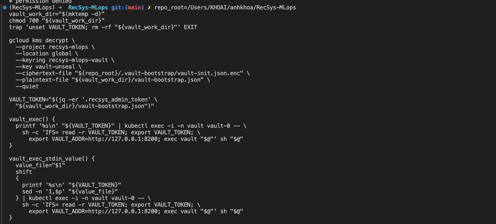

**Figure: Initialize a protected Vault operator session.** This capture shows
the mode-`700` temporary working directory, KMS decryption of the encrypted
bootstrap artifact, and the `vault_exec` helpers used to run scoped operations
inside `vault-0`. The administrator token is loaded into the session but is not
printed. The helper also provides a stdin path for secret values so they do not
need to appear in command arguments or shell history.

Example: register `DB_USERNAME` and `DB_PASSWORD` for a new
`recommendation-api` group. The password is read silently, exists only in the
current shell/private temporary file, and is sent to the KV-specific command
through stdin. `vault kv put` is appropriate during registration because it
creates version 1; if the path already exists, it creates a new version from
the complete set of fields supplied and can replace omitted fields. This is the
HashiCorp-documented [`kv put` workflow](https://developer.hashicorp.com/vault/docs/commands/kv/put):

```bash
# zsh syntax (the default shell used by this workstation). In zsh, `read -p`
# means "read from a coprocess", so Bash's `read -rsp PROMPT VARIABLE` form
# would fail with `read: -p: no coprocess`.
IFS= read -r -s 'db_password?New recommendation-api DB password: '
printf '\n'
if [ -z "${db_password}" ]; then
  printf 'Password must not be empty; Vault was not changed.\n' >&2
else
  printf '%s' "${db_password}" \
    >"${vault_work_dir}/recommendation-api-password"
  unset db_password

  vault_exec_stdin_value "${vault_work_dir}/recommendation-api-password" \
    kv put -mount=recsys recommendation-api \
    DB_USERNAME=recsys_app DB_PASSWORD=- >/dev/null
fi
```

Declare how ESO materializes that Vault group; this manifest belongs in the
service Helm chart or the central security chart rather than being maintained
as an ad-hoc live resource:

```yaml
apiVersion: external-secrets.io/v1
kind: ExternalSecret
metadata:
  name: recommendation-api
  namespace: api-serving
spec:
  refreshInterval: 1h
  secretStoreRef:
    kind: ClusterSecretStore
    name: recsys-vault
  target:
    name: recommendation-api
    creationPolicy: Owner
  dataFrom:
    - extract:
        key: recommendation-api
```

After applying the Helm release, verify metadata, synchronization, and key
presence without displaying a secret value:

```bash
vault_exec kv metadata get -format=json \
  -mount=recsys recommendation-api | \
  jq '{current_version: .data.current_version, versions: (.data.versions | length)}'

kubectl wait --for=condition=Ready \
  externalsecret/recommendation-api \
  -n api-serving --timeout=120s

kubectl get externalsecret recommendation-api -n api-serving
kubectl get secret recommendation-api -n api-serving -o json | \
  jq -e '.data | has("DB_USERNAME") and has("DB_PASSWORD")' >/dev/null
```

### Inspect Secret Groups, Key Names, And One Login Field

After preparing `VAULT_TOKEN` and the `vault_exec` helper above, list the
available groups under the `recsys` KV v2 mount:

```bash
vault_exec kv list -format=json -mount=recsys | jq -r '.[]'
```

List only the key names in one group without displaying their values. The
helper below performs JSON filtering inside the Vault pod, so the full payload
does not cross the `kubectl exec` boundary; only key names reach the operator's
terminal:

```bash
vault_key_names() {
  mount_path="$1"
  secret_path="$2"
  printf '%s\n' "${VAULT_TOKEN}" | kubectl exec -i -n vault vault-0 -- \
    sh -c '
      IFS= read -r VAULT_TOKEN
      export VAULT_TOKEN VAULT_ADDR=http://127.0.0.1:8200
      vault kv get -format=json -mount="$1" "$2" | awk '\''
        /^[[:space:]]*"data":[[:space:]]*\{/ {
          data_blocks++
          if (data_blocks == 2) {
            in_secret_data = 1
            next
          }
        }
        in_secret_data && /^[[:space:]]*\}/ { exit }
        in_secret_data {
          key = $0
          sub(/^[[:space:]]*"/, "", key)
          sub(/".*/, "", key)
          if (length(key) > 0) print key
        }
      '\''
    ' sh "${mount_path}" "${secret_path}"
}

vault_key_names recsys analytics
```

Expected key names include `SUPERSET_ADMIN_USERNAME`,
`SUPERSET_ADMIN_PASSWORD`, `CATALOG_POSTGRES_USER`, and
`CATALOG_POSTGRES_PASSWORD`. Do not replace this command with an unfiltered
`vault kv get`, because the default table prints every plaintext value.

Read an exact non-sensitive field when needed:

```bash
vault_exec kv get -mount=recsys \
  -field=SUPERSET_ADMIN_USERNAME analytics
```

For an interactive login password on macOS, send only the selected field
directly to the clipboard so it does not appear on the terminal. Do not run
this while shell tracing is enabled, and clear the clipboard after login:

```bash
vault_exec kv get -mount=recsys \
  -field=SUPERSET_ADMIN_PASSWORD analytics | pbcopy

# Paste into the Superset login form, then clear the clipboard.
printf '' | pbcopy
```

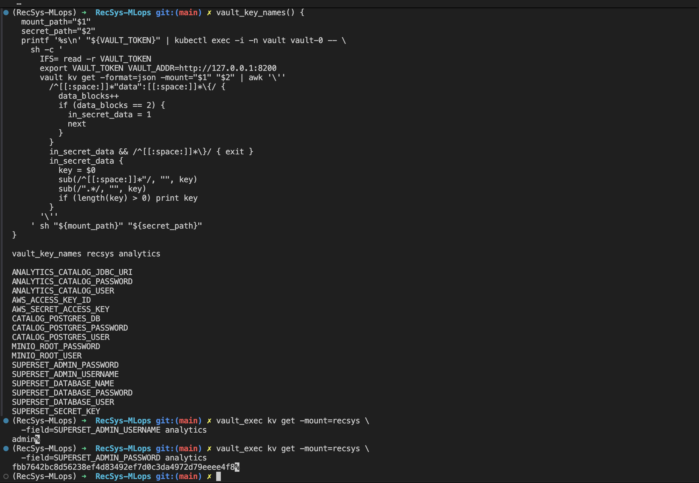

**Figure: Inspect an analytics secret group and retrieve exact login fields.**
The capture first lists only the 16 key names in `recsys/analytics`, then reads
the exact Superset username and password fields needed for an interactive
login. It is retained as coursework evidence of the operator workflow. Because
the demonstration password is visible in the capture, treat that value as
disclosed: rotate it after evidence collection and never reuse it in another
environment. For future captures, use the clipboard command above so the
password is not rendered in the terminal.

Use Vault as the operator-facing source of truth. Reading and decoding an
entire Kubernetes Secret, displaying a full Vault group, or capturing a
terminal containing a password is not acceptable evidence.

### Rotate A Secret, Force Sync, And Verify

For an external system such as PostgreSQL or a third-party API, create or
activate the new credential at that system first. Keep the old credential valid
until the new Vault version has synced and the consumer passes its functional
test. Changing only Vault does not change the database/provider password.

Capture the current KV v2 version, patch only the field being rotated, and
confirm that Vault created a newer version:

```bash
before_version="$(vault_exec kv metadata get -format=json \
  -mount=recsys recommendation-api | jq -er '.data.current_version')"

IFS= read -r -s 'new_db_password?Rotated recommendation-api DB password: '
printf '\n'
if [ -z "${new_db_password}" ]; then
  printf 'Password must not be empty; Vault was not changed.\n' >&2
else
  printf '%s' "${new_db_password}" \
    >"${vault_work_dir}/recommendation-api-password-rotated"

  vault_exec_stdin_value \
    "${vault_work_dir}/recommendation-api-password-rotated" \
    kv patch -cas="${before_version}" -mount=recsys recommendation-api \
    DB_PASSWORD=- >/dev/null
fi

after_version="$(vault_exec kv metadata get -format=json \
  -mount=recsys recommendation-api | jq -er '.data.current_version')"
test "${after_version}" -gt "${before_version}"
```

`vault kv patch` is used instead of a second `kv put` because rotation changes
only `DB_PASSWORD`; `DB_USERNAME` and every unspecified key remain intact. The
`-cas` check makes the operation fail if another writer creates a newer version
after `before_version` was read, preventing a silent lost update. This follows
HashiCorp's [`kv patch` workflow](https://developer.hashicorp.com/vault/docs/commands/kv/patch)
for KV v2.

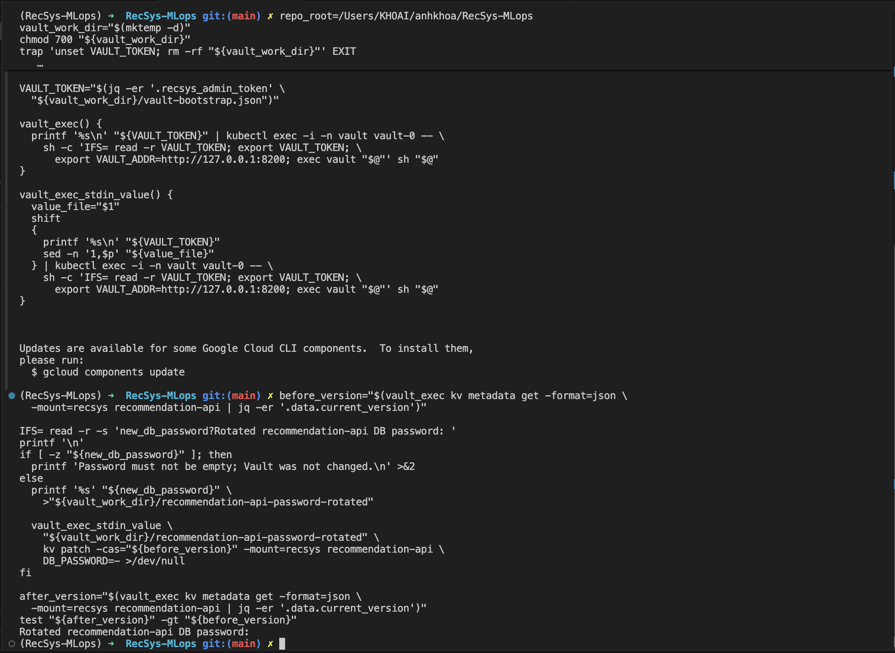

**Figure: Rotate one Vault KV v2 field with optimistic concurrency control.**
This capture shows the zsh-compatible silent prompt, the empty-value guard,
`vault kv patch -cas="${before_version}"`, and the final assertion that the KV
version increased. The password itself is not displayed. This proves the
Vault-side rotation; the force-sync, target comparison, rollout, and functional
test below prove that the new version propagated to the consuming service.

ESO otherwise reconciles on its one-hour interval. To force an immediate sync,
change the `force-sync` annotation and wait for `syncedResourceVersion` to
change; checking `Ready` alone is insufficient because it may already be true
from the previous version:

```bash
before_sync="$(kubectl get externalsecret recommendation-api \
  -n api-serving -o jsonpath='{.status.syncedResourceVersion}')"

kubectl annotate externalsecret recommendation-api \
  -n api-serving \
  force-sync="$(date +%s)" --overwrite

for attempt in $(seq 1 60); do
  after_sync="$(kubectl get externalsecret recommendation-api \
    -n api-serving -o jsonpath='{.status.syncedResourceVersion}')"
  if [ -n "${after_sync}" ] && [ "${after_sync}" != "${before_sync}" ]; then
    break
  fi
  sleep 2
done
test "${after_sync}" != "${before_sync}"

kubectl get externalsecret recommendation-api -n api-serving
```

For a controlled operator test, compare the synced target with the value still
held in the current shell without printing either value. Do not enable shell
tracing (`set -x`) during this operation:

```bash
synced_db_password="$(kubectl get secret recommendation-api \
  -n api-serving -o jsonpath='{.data.DB_PASSWORD}' | base64 --decode)"
test "${synced_db_password}" = "${new_db_password}"
unset synced_db_password new_db_password
```

Finally restart consumers that read Secrets through environment variables,
wait for the rollout, and run a service-level health/login test before revoking
the old credential at its source:

```bash
kubectl rollout restart deployment/recommendation-api -n api-serving
kubectl rollout status deployment/recommendation-api \
  -n api-serving --timeout=300s

# Terminal A: expose the internal service temporarily.
kubectl port-forward -n api-serving \
  service/recommendation-api 18080:80

# Terminal B: replace this with the service's real authenticated health,
# database connection, or API request. Rollout alone does not prove the new
# credential works against its upstream system.
curl --fail --silent --show-error http://127.0.0.1:18080/health
```

If the functional test fails, keep the old upstream credential active and use
KV v2 history to restore the previous Vault data, then force sync and restart
again:

```bash
vault_exec kv rollback -mount=recsys \
  -version="${before_version}" recommendation-api
```

The complete verification chain is therefore: new upstream credential works,
Vault `current_version` increases, ESO `syncedResourceVersion` changes,
`SecretSynced=True`, the target contains the expected keys/value, rollout
completes, and the application's authenticated functional test passes. Only
then revoke the old credential.

This lifecycle was verified on the live GKE deployment with an isolated
`coursework-rotation-smoke` Vault path and temporary ExternalSecret. The test
created KV version 1, patched only `PASSWORD` to produce version 2, forced an
ESO refresh, confirmed a new `syncedResourceVersion`, compared the rotated
value in memory without printing it, confirmed the unchanged `USERNAME` key
was preserved, and observed `Ready=True`. The temporary ExternalSecret,
generated Kubernetes Secret, and Vault metadata were deleted after the test;
no production credential was modified.

The KV-specific CLI syntax was separately verified with an isolated
`coursework-kv-wrapper-smoke` path: `vault kv put` created version 1,
`vault kv patch -cas=1` created version 2, and the unspecified `USERNAME` field
remained unchanged. Its Vault metadata and all temporary local files were
deleted after the test.

### External Secrets Operator Runtime

**Capture command**

```bash
kubectl get pods -n external-secrets
```

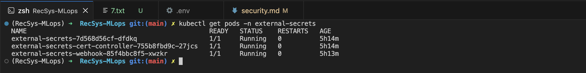

**Figure: External Secrets Operator pod proof.** The controller pod reconciles `ExternalSecret` resources, the webhook validates admission requests, and the cert-controller manages webhook certificates. Seeing these pods in `Running` state proves the secret synchronization control plane is available.

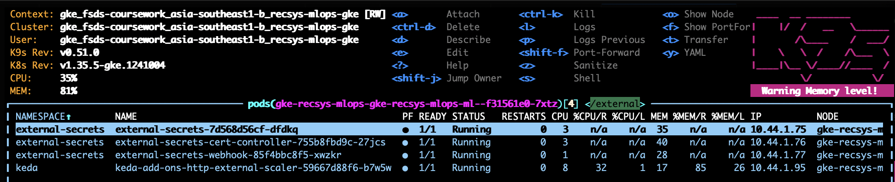

**Figure: External Secrets Operator k9s proof.** This view shows the same External Secrets components from the cluster UI, including readiness, restart count, node placement, and resource usage. It is useful as a UI-based proof that the operator is live on GKE, not only present as YAML.

### Central ClusterSecretStore

**Capture command**

```bash
kubectl get clustersecretstore recsys-vault -o wide
```

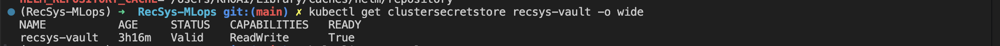

**Figure: Central ClusterSecretStore proof.** `recsys-vault` must show
`STATUS=Valid` and `READY=True`. This proves ESO can authenticate to Vault and
use the shared store instead of each namespace defining its own secret source.

### Vault Endpoint, Raft Storage, And Auto-Unseal

**Capture command**

```bash
helm list -n vault
kubectl get pod,pvc,svc -n vault
kubectl exec -n vault vault-0 -- \
  env VAULT_ADDR=http://127.0.0.1:8200 vault status -format=json | \
jq '{initialized,sealed,storage_type,ha_enabled}'
```

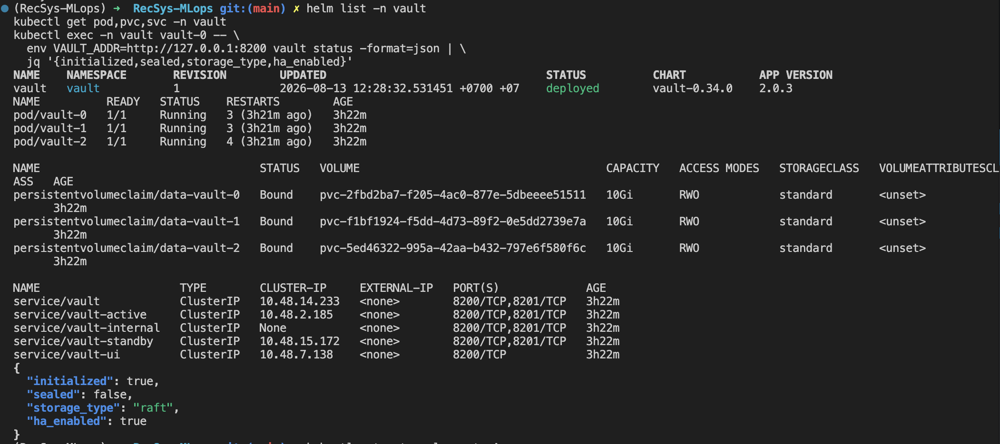

**Figure: Vault runtime proof.** Capture the `vault` Helm release, three
`1/1 Running` pods, three bound 10 GiB PVCs, ClusterIP-only services, and the
sanitized status fields `initialized=true`, `sealed=false`,
`storage_type=raft`, and `ha_enabled=true`. Do not capture `vault kv get`,
Kubernetes Secret YAML/JSON, recovery shares, tokens, or decoded values.

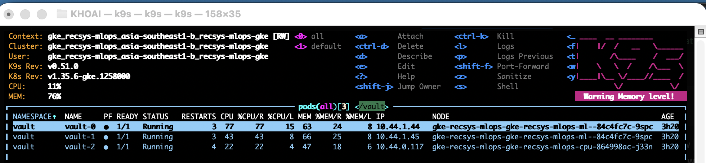

**Figure: Vault pod runtime proof.** The k9s view shows `vault-0`, `vault-1`,
and `vault-2` at `1/1 Running` on the live GKE cluster. This is complementary
runtime evidence; the terminal capture above proves the chart version, bound
Raft volumes, ClusterIP-only endpoint, initialization, unsealed state, and HA.

### Synced Service Secrets

**Capture command**

```bash
kubectl get externalsecret -A -o wide
```

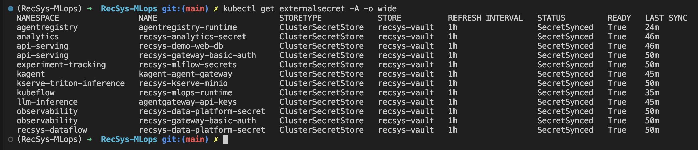

**Figure: All service ExternalSecrets synchronized from Vault.** The live GKE
capture shows all twelve namespace-level resources using
`STORE=recsys-vault`, with `STATUS=SecretSynced`, `READY=True`, and a recent
`LAST SYNC`. The rows include the ML platform services, Agent Registry, the
kagent Agent Gateway client secret, and the Agent Gateway validator secret.
This proves that External Secrets Operator generates and refreshes the
namespace-local Kubernetes Secrets from the centralized Vault source rather
than relying on manually duplicated credentials.

## Service Mesh Authentication

Istio enforces service identity and network-level access control. The baseline posture is STRICT mTLS plus default deny; specific service-to-service flows are then opened with `AuthorizationPolicy`.

### Code Reference

- [locals.tf (line 80)](../../../infra/terraform/gcp/modules/kubernetes-platform/locals.tf#L80), [locals.tf (line 110)](../../../infra/terraform/gcp/modules/kubernetes-platform/locals.tf#L110): selects the six namespaces that receive the production mesh enforcement baseline and passes them to the security chart.
- [namespaces.tf (line 1)](../../../infra/terraform/gcp/modules/kubernetes-platform/namespaces.tf#L1), [namespaces.tf (line 51)](../../../infra/terraform/gcp/modules/kubernetes-platform/namespaces.tf#L51), [namespaces.tf (line 65)](../../../infra/terraform/gcp/modules/kubernetes-platform/namespaces.tf#L65): labels the observability, experiment-tracking, dataflow, KServe/Triton, and API namespaces for automatic Envoy sidecar injection.
- [istio-mtls.yaml (line 1)](../../../infra/helm/recsys-security/templates/istio-mtls.yaml#L1), [istio-mtls.yaml (line 116)](../../../infra/helm/recsys-security/templates/istio-mtls.yaml#L116): renders namespace STRICT mTLS and selected permissive exceptions.
- [istio-authorization.yaml (line 1)](../../../infra/helm/recsys-security/templates/istio-authorization.yaml#L1), [istio-authorization.yaml (line 235)](../../../infra/helm/recsys-security/templates/istio-authorization.yaml#L235): renders default-deny and explicit allow policies for API, KServe/Triton, Dataflow, Kubeflow, MLflow, and Observability traffic.
- [istio-authorization.yaml (line 162)](../../../infra/helm/recsys-security/templates/istio-authorization.yaml#L162), [istio-authorization.yaml (line 179)](../../../infra/helm/recsys-security/templates/istio-authorization.yaml#L179): implements the concrete API-to-Triton and ingress/API service-to-service allow rules shown below.

### Applied Service-To-Service Authentication Configuration

Terraform passes the production namespace list from
[locals.tf (line 80)](../../../infra/terraform/gcp/modules/kubernetes-platform/locals.tf#L80) into the
`recsys-security` Helm chart. For every selected namespace, the chart renders
the following baseline from
[istio-mtls.yaml (line 1)](../../../infra/helm/recsys-security/templates/istio-mtls.yaml#L1):

```yaml
apiVersion: security.istio.io/v1beta1
kind: PeerAuthentication
metadata:
  name: recsys-strict-mtls
  namespace: <selected-namespace>
spec:
  mtls:
    mode: STRICT
---
apiVersion: security.istio.io/v1beta1
kind: AuthorizationPolicy
metadata:
  name: recsys-default-deny
  namespace: <selected-namespace>
spec: {}
```

`PeerAuthentication` provides service-to-service authentication: both Envoy
proxies must present workload certificates, and the caller becomes a SPIFFE
identity such as `cluster.local/ns/api-serving/sa/default`. The empty
`AuthorizationPolicy` then denies the authenticated request unless another
`ALLOW` rule explicitly matches it.

For example, the destination-side rule below allows only the API service
account and Prometheus to access KServe/Triton on the required ports. It is
rendered by
[istio-authorization.yaml (line 162)](../../../infra/helm/recsys-security/templates/istio-authorization.yaml#L162):

```yaml
apiVersion: security.istio.io/v1beta1
kind: AuthorizationPolicy
metadata:
  name: recsys-kserve-allow
  namespace: kserve-triton-inference
spec:
  action: ALLOW
  rules:
    - from:
        - source:
            principals:
              - cluster.local/ns/api-serving/sa/default
              - cluster.local/ns/observability/sa/recsys-prometheus
      to:
        - operation:
            ports: ["80", "8080", "9000"]
```

The certificate identity authenticates **who** is calling; the destination
namespace, source principal, and port tuple authorizes **what** that identity
may call. Istio does not require application code to exchange a shared mesh
password; protocol-level credentials such as database passwords remain a
separate application control where the destination requires them.

### Effective Mesh Enforcement Scope

Terraform supplies the following namespace list to the security chart rather
than relying on the shorter chart default:

| Namespace | Sidecar injection | STRICT mTLS and default deny | Main explicit access |
| --- | --- | --- | --- |
| `api-serving` | Enabled | Enforced | NGINX, Prometheus, API-internal calls, and dataflow callers to ports `80/8080`. |
| `kserve-triton-inference` | Enabled | Enforced | API and Prometheus identities to KServe/Triton ports `80/8080/9000`. |
| `recsys-dataflow` | Enabled | Enforced | Dataflow, Kubeflow, DataHub, Prometheus, and selected API access to data/platform ports. |
| `kubeflow` | Enabled | Enforced | Kubeflow-local traffic plus dataflow and Prometheus on the configured KFP/Ray/artifact ports. |
| `experiment-tracking` | Enabled | Enforced | Kubeflow, KServe, and Prometheus to MLflow/Postgres/MinIO ports. |
| `observability` | Enabled | Enforced | API, dataflow, Kubeflow, Prometheus, Promtail, and NGINX to Grafana/Loki/Tempo/PushGateway/exporter ports. |
| `datahub` | Enabled by the namespace resource | **Not included** in the security chart's STRICT/default-deny list | Its sidecar can originate and receive mesh traffic, but this chart does not enforce a DataHub namespace baseline. |
| `ingress-nginx` | Enabled for the controller | **Not included** in the STRICT/default-deny list | Its service-account principal is allowed by destination API/observability policies. |
| `ci` | Explicitly disabled on Jenkins/watcher pods | Not enforced | Jenkins uses Kubernetes RBAC, Workload Identity, and Kubernetes Secrets instead of this mesh policy set. |
| `analytics` | Not configured by this security chart | Not enforced | Analytics is outside the current mesh authorization boundary. |

A namespace label only causes sidecar injection; it does not by itself create a
STRICT `PeerAuthentication` or default-deny `AuthorizationPolicy`. This is why
DataHub sidecar presence is proof of mesh participation, but not proof that the
same namespace-level deny baseline is enforced there.

### Service-To-Service Allow Matrix

The main runtime paths opened after default deny are:

| Caller identity | Destination | Ports and purpose | Policy reference |
| --- | --- | --- | --- |
| `api-serving/default` | `recsys-dataflow` | `5432/6379` for Feast/Postgres and Redis features. | [Dataflow allow (line 23)](../../../infra/helm/recsys-security/templates/istio-authorization.yaml#L23) |
| `api-serving/default` | `kserve-triton-inference` | `80/8080/9000` for KServe HTTP and Triton gRPC inference. | [KServe allow (line 162)](../../../infra/helm/recsys-security/templates/istio-authorization.yaml#L162) |
| `ingress-nginx/ingress-nginx` | `api-serving` | `80/8080` for public feature API and demo routes. | [API allow (line 179)](../../../infra/helm/recsys-security/templates/istio-authorization.yaml#L179) |
| `ingress-nginx/ingress-nginx` | `observability` | `3000/3100/3200` for public Grafana, Loki, and Tempo query routes. | [Observability allow (line 199)](../../../infra/helm/recsys-security/templates/istio-authorization.yaml#L199) |
| `recsys-dataflow/default` | `kubeflow` | KFP API and workflow-related ports for drift-triggered retraining. | [Kubeflow allow (line 77)](../../../infra/helm/recsys-security/templates/istio-authorization.yaml#L77) |
| Kubeflow pipeline service accounts | `experiment-tracking` | `5000/5432/9000` for MLflow, registry Postgres, and artifact MinIO. | [MLflow allow (line 142)](../../../infra/helm/recsys-security/templates/istio-authorization.yaml#L142) |
| `observability/recsys-prometheus` | Runtime namespaces | Metrics/exporter ports required by Prometheus scraping. | [Dataflow principal (line 14)](../../../infra/helm/recsys-security/templates/istio-authorization.yaml#L14), [MLflow principal (line 150)](../../../infra/helm/recsys-security/templates/istio-authorization.yaml#L150), [KServe principal (line 170)](../../../infra/helm/recsys-security/templates/istio-authorization.yaml#L170) |
| `observability/recsys-promtail` | Loki | `3100` for log ingestion. | [Observability principal and ports (line 206)](../../../infra/helm/recsys-security/templates/istio-authorization.yaml#L206) |

Public gateway authentication and TLS are an additional north-south layer; they
do not replace mesh identity. The full NGINX, DNS, certificate, Basic Auth, and
rate-limit setup is documented in
[Routing & Gateway](routing_gateway.md#setup-and-configuration-flow).

### Request Enforcement Flow

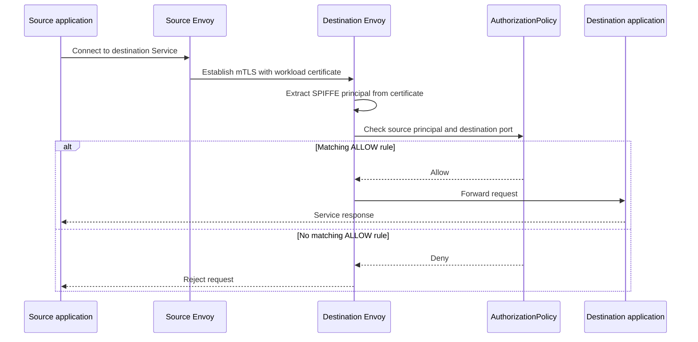
```mermaid
sequenceDiagram
    participant A as Source application
    participant SE as Source Envoy
    participant DE as Destination Envoy
    participant P as AuthorizationPolicy
    participant D as Destination application

    A->>SE: Connect to destination Service
    SE->>DE: Establish mTLS with workload certificate
    DE->>DE: Extract SPIFFE principal from certificate
    DE->>P: Check source principal and destination port
    alt Matching ALLOW rule
        P-->>DE: Allow
        DE->>D: Forward request
        D-->>A: Service response
    else No matching ALLOW rule
        P-->>DE: Deny
        DE-->>A: Reject request
    end
```

1. Namespace label `istio-injection=enabled` causes the Istio admission webhook to add `istio-init` and `istio-proxy` to newly created pods.
2. `istio-init` prepares traffic redirection so application ingress and egress pass through Envoy.
3. Istiod gives each Envoy a short-lived workload certificate representing its Kubernetes service account. The identity format is `cluster.local/ns/<namespace>/sa/<service-account>`.
4. Namespace `PeerAuthentication` in `STRICT` mode rejects plaintext service traffic and requires the two Envoys to establish mutually authenticated TLS.
5. The destination Envoy applies the namespace default-deny policy. It forwards the request only when an explicit `ALLOW` policy matches its source identity and destination port.

### Identity, Default Deny, And Explicit Allow

The repository authorizes service-to-service traffic through Istio workload
identity, strict mTLS, and explicit allowlists. For example,
`api-serving/default` may call Triton with the following authorization tuple:

- Caller: `cluster.local/ns/api-serving/sa/default`
- Destination namespace: `kserve-triton-inference`
- Destination ports: `80`, `8080`, and `9000`

The corresponding rule is defined in
[istio-authorization.yaml (line 162)](../../../infra/helm/recsys-security/templates/istio-authorization.yaml#L162).
The request is protected by these layers:

1. The namespace receives an Envoy sidecar through
   `istio-injection=enabled` in
   [namespaces.tf (line 1)](../../../infra/terraform/gcp/modules/kubernetes-platform/namespaces.tf#L1).
2. `PeerAuthentication` in `STRICT` mode requires mutually authenticated TLS.
3. An empty namespace-level `AuthorizationPolicy` establishes default deny.
4. Explicit `ALLOW` policies reopen only the required caller identities and
   destination ports.

### API-To-Triton Security Example

The online inference path uses both security planes:

```text
KServe service account
  -> reads recsys-kserve-minio credentials
  -> storage-initializer downloads the model repository
  -> Triton loads the model from /mnt/models

FastAPI application
  -> source Envoy identifies api-serving/default
  -> mTLS connection to the selected control/candidate Triton Service
  -> destination Envoy evaluates recsys-kserve-allow
  -> allowed on gRPC port 9000
  -> request reaches Triton
```

The `InferenceService` runs with the credential-bearing KServe service account in [inferenceservice.yaml (line 15)](../../../infra/helm/recsys-serving/templates/inferenceservice.yaml#L15). Its storage initializer uses the synced secret to download model artifacts, while the API-to-Triton inference request is authenticated and authorized independently by the mesh.

### Compatibility Exceptions

The namespace baseline remains `STRICT`, with targeted `PERMISSIVE` overrides for integrations that must also accept non-mesh traffic. Current exceptions include the data-platform MinIO S3 port, selected Kubeflow services, Prometheus access for KEDA, Loki ingestion, and Tempo OTLP ports. These overrides are scoped with workload selectors and ports in [istio-mtls.yaml (line 20)](../../../infra/helm/recsys-security/templates/istio-mtls.yaml#L20).

The MinIO S3 NetworkPolicy manifest selects the dataflow, Kubeflow, DataHub, and
observability namespaces on port `9000` through
[minio-network-policy.yaml (line 1)](../../../infra/helm/recsys-security/templates/minio-network-policy.yaml#L1).
The current GKE cluster does not enable Kubernetes NetworkPolicy enforcement,
so this object documents the intended layer-3/4 boundary but does not currently
enforce it; Istio authorization remains the active runtime control.

### Mesh-Enabled Namespaces

**Capture command**

```bash
kubectl get ns -L istio-injection
```

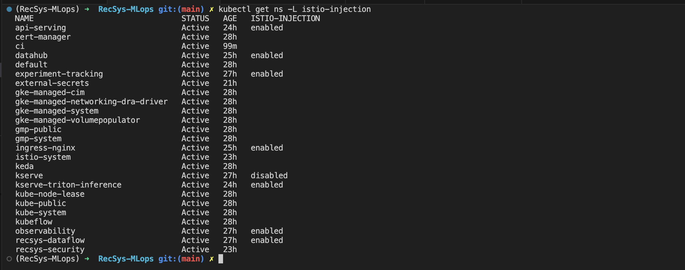

**Figure: Istio sidecar injection scope.** Namespaces with `istio-injection=enabled` automatically receive Istio sidecars on new pods. This proves the security boundary covers core runtime namespaces such as API serving, KServe/Triton, observability, experiment tracking, and dataflow.

### mTLS And Authorization Policies

**Capture command**

```bash
kubectl get peerauthentication,authorizationpolicy -A
```

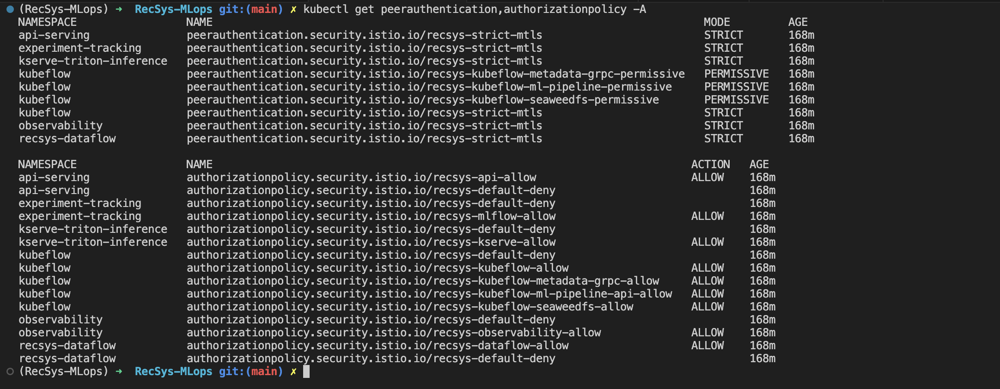

**Figure: mTLS and default-deny policy proof.** `PeerAuthentication` enforces STRICT mTLS for mesh traffic, while empty/default `AuthorizationPolicy` objects deny traffic by default. The explicit `ALLOW` policies then reopen only the required service-to-service paths by source identity and destination port.

| Namespace | Default behavior | Explicit allow examples |
|---|---|---|
| `api-serving` | Deny all by default under STRICT mTLS | Allows NGINX ingress, Prometheus, internal API-to-feature traffic, and dataflow-generated calls to API ports `80`/`8080`. |
| `kserve-triton-inference` | Deny all by default under STRICT mTLS | Allows API service account and Prometheus to Triton/KServe ports `80`, `8080`, and `9000`. |
| `recsys-dataflow` | Deny all by default under STRICT mTLS | Allows internal data platform traffic, Kubeflow pipeline traffic, DataHub traffic, Prometheus scraping, and API access to Redis `6379`. |
| `kubeflow` | Deny all by default under STRICT mTLS | Allows pipeline components, metadata services, Ray dashboard/job ports, MinIO-compatible artifact ports, and Prometheus access where required. |
| `experiment-tracking` | Deny all by default under STRICT mTLS | Allows Kubeflow, KServe, and Prometheus to MLflow, Postgres, and artifact storage ports. |
| `observability` | Deny all by default under STRICT mTLS | Allows Prometheus, Promtail, API, Airflow/Kubeflow, and NGINX gateway access to Grafana, Loki, Tempo, Pushgateway, and exporter ports. |

### Sidecar Injection Across Runtime Services

The sidecar screenshots are UI proof that important runtime services are actually running with Istio components, not just configured through namespace labels. The expected pattern is:

- `istio-init`: init container that prepares traffic redirection rules.
- `istio-proxy`: Envoy sidecar that handles mTLS and policy enforcement.
- main service container: the application workload, for example API, Grafana, or DataHub.

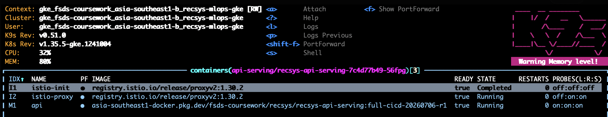

**Figure: API serving sidecar proof.** The `recsys-api-serving` pod has three containers: `istio-init`, `istio-proxy`, and the FastAPI application container. This proves user-facing recommendation traffic enters the mesh before reaching the API process.

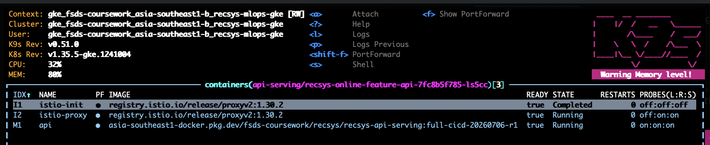

**Figure: Online feature API sidecar proof.** The `recsys-online-feature-api` pod also contains `istio-init`, `istio-proxy`, and the API container. This proves internal feature-pull traffic between serving APIs is protected by mesh identity and mTLS.

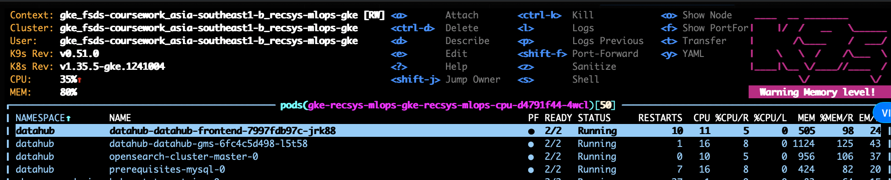

**Figure: DataHub sidecar readiness proof.** DataHub pods show `2/2` readiness, meaning the application container and Istio sidecar are both ready. This proves governance services are also inside the service mesh instead of being left as plain cluster networking.

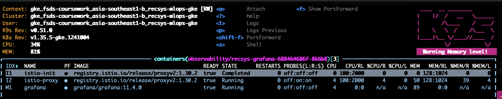

**Figure: DataHub service mesh example.** This k9s view shows the DataHub
namespace with sidecar-injected pods and operational state. It proves that
DataHub participates in mesh transport; the current `recsys-security` namespace
list does not give DataHub its own STRICT/default-deny baseline, as documented
in the effective coverage table above.

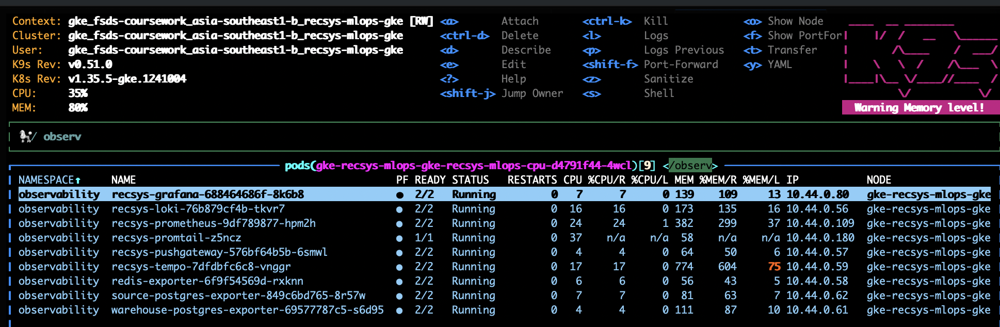

**Figure: Observability sidecar proof.** The Grafana pod contains `istio-init`, `istio-proxy`, and the Grafana container. This proves metric-dashboard access is also routed through the mesh and can be governed by Istio policies.

### Sidecar Injection On KServe/Triton Workloads

**Capture UI**

Open the KServe/Triton predictor pod in k9s and switch to the container view.

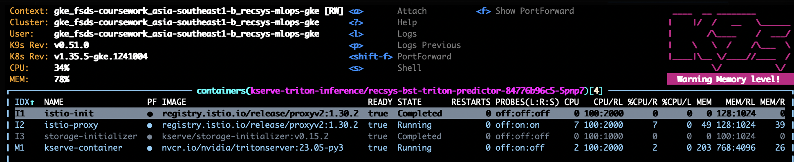

**Figure: KServe/Triton sidecar proof.** The `recsys-bst-triton-predictor` pod runs with four containers: `istio-init` prepares traffic redirection, `istio-proxy` is the running Envoy sidecar for mTLS/policy enforcement, `storage-initializer` loads the model artifacts, and `kserve-container` runs the Triton inference server. This proves model inference traffic is not a plain pod-to-pod call; it is served by Triton/KServe while participating in the Istio service mesh.
