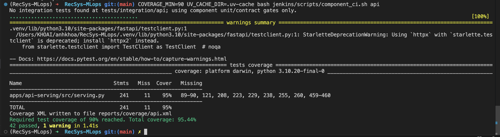
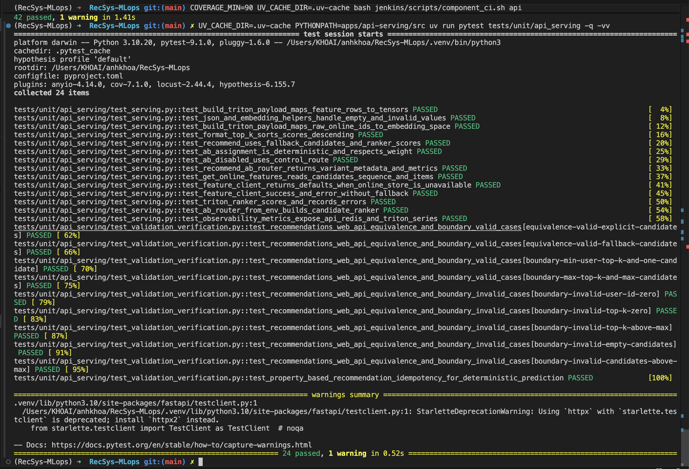
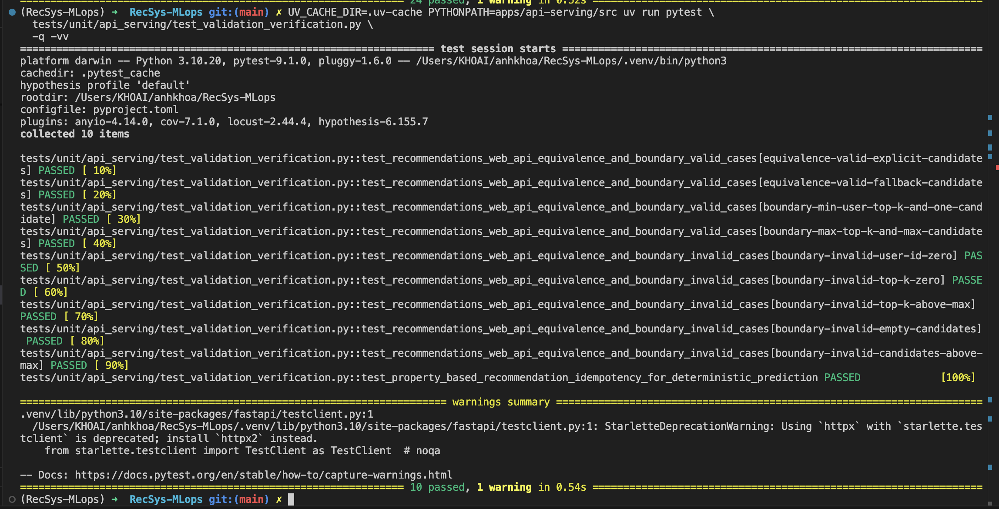
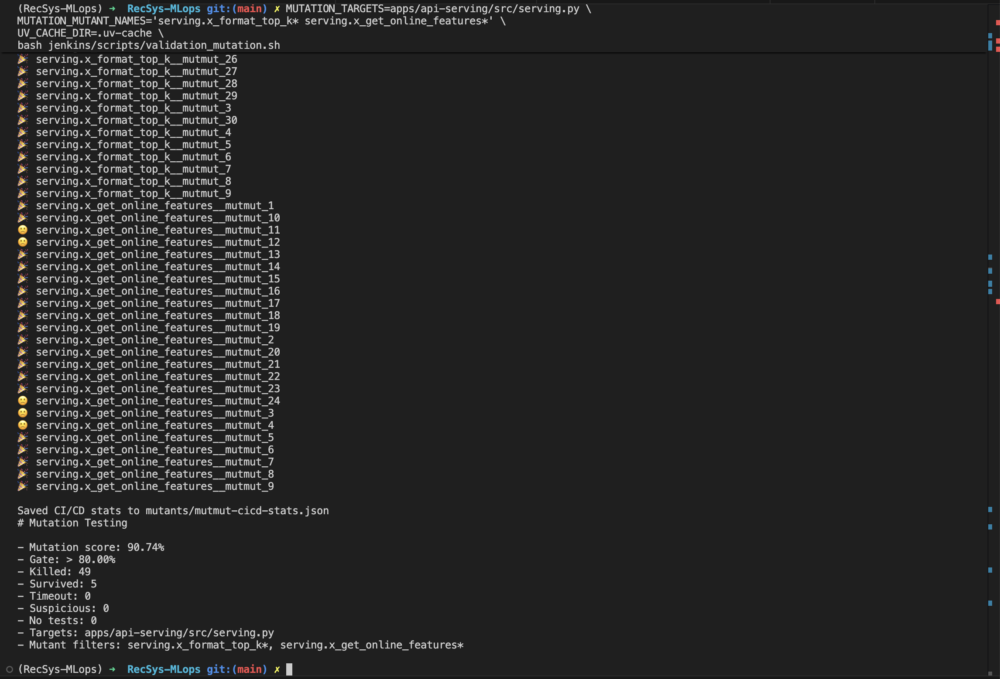
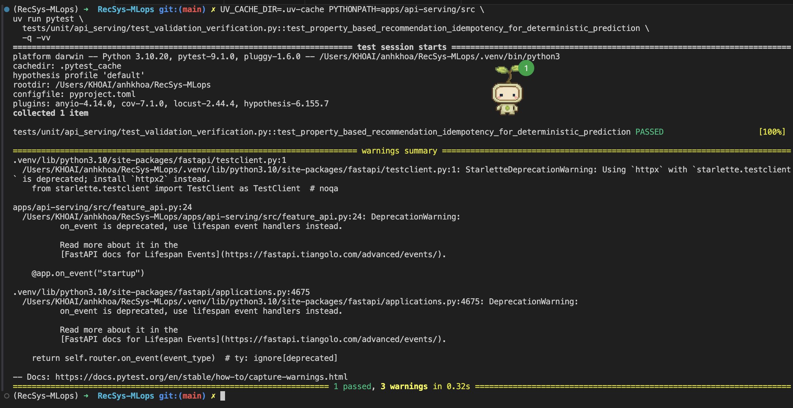
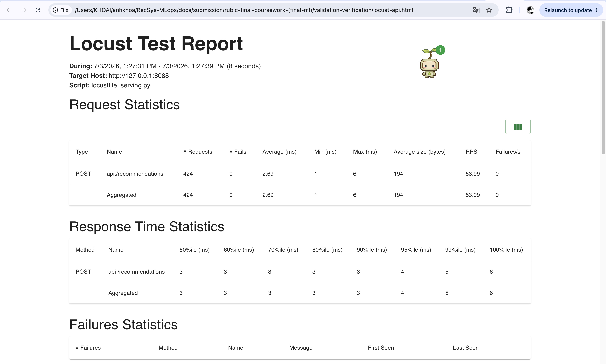
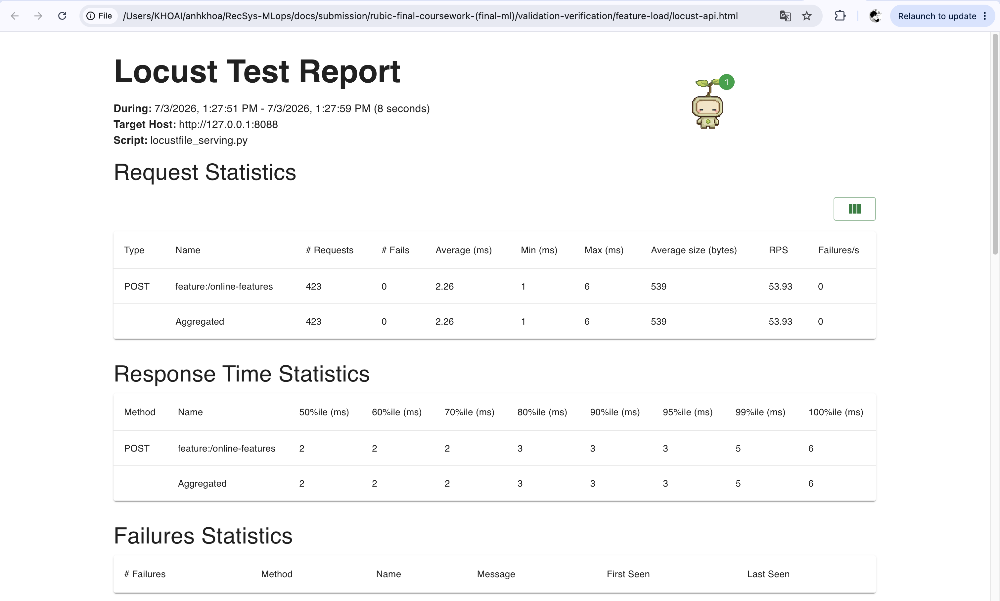

# Validation & Verification

## 1. Unit Test Coverage > 90%

### 1.1 Goal

- Requirement: unit tests must pass with line coverage `> 90%`.
- Scope: full `api-serving` unit test suite over `apps/api-serving/src`, including the two API service entrypoints:
  - `apps/api-serving/src/feature_api.py`: `100%`
  - `apps/api-serving/src/inference_api.py`: `100%`
- Current result: `33 passed`, `3 warnings`, total line coverage `91%`.
- Screenshot command prints the full terminal coverage table for capture.

Source references:

- [feature_api.py (line 13)](../../../apps/api-serving/src/feature_api.py#L13), [feature_api.py (line 77)](../../../apps/api-serving/src/feature_api.py#L77): online-feature singleton/warmup and health, readiness, version, metrics, POST, and GET routes.
- [inference_api.py (line 18)](../../../apps/api-serving/src/inference_api.py#L18), [inference_api.py (line 123)](../../../apps/api-serving/src/inference_api.py#L123): feature client/router singletons and recommendation service routes.
- [feature_service_client.py (line 12)](../../../apps/api-serving/src/feature_service_client.py#L12), [feature_service_client.py (line 34)](../../../apps/api-serving/src/feature_service_client.py#L34): async feature-service HTTP boundary.
- [test_validation_verification.py (line 60)](../../../tests/unit/api_serving/test_validation_verification.py#L60), [test_validation_verification.py (line 339)](../../../tests/unit/api_serving/test_validation_verification.py#L339): success, dependency failure, singleton, warmup, and mocked-client tests.

### 1.2 Command used

```bash
UV_CACHE_DIR=.uv-cache PYTHONPATH=apps/api-serving/src \
uv run pytest tests/unit/api_serving \
  --cov=apps/api-serving/src \
  --cov-report=term-missing
```

Terminal summary:

```text
collected 33 items
tests/unit/api_serving/test_serving.py ...............                   [ 45%]
tests/unit/api_serving/test_split_services.py ..                         [ 51%]
tests/unit/api_serving/test_validation_verification.py ................  [100%]

apps/api-serving/src/feature_api.py                 38      0   100%
apps/api-serving/src/feature_service_client.py      21      0   100%
apps/api-serving/src/inference_api.py               53      0   100%
TOTAL                                              669     63    91%
33 passed, 3 warnings in 1.01s
```

### 1.3 Screenshot proof



## 2. Web API Tests With Fixtures And Mocks

### 2.1 Goal

- Requirement: prove Web API unit tests use pytest fixtures and mocks.
- Services under test:
  - Online Feature API: `POST /online-features`, `GET /online-features/{user_id}`, `/healthz`, `/ready`, `/version`, `/metrics`.
  - Inference API: `POST /recommendations`, `/healthz`, `/ready`, `/version`, `/metrics`.
- External dependencies mocked: Redis/Feast online feature store, feature-service HTTP client, Triton/KServe ranker/router, and environment config.

Source references:

- [test_validation_verification.py (line 18)](../../../tests/unit/api_serving/test_validation_verification.py#L18), [test_validation_verification.py (line 73)](../../../tests/unit/api_serving/test_validation_verification.py#L73): deterministic feature/ranker mocks plus `monkeypatch` API fixtures.
- [test_split_services.py (line 15)](../../../tests/unit/api_serving/test_split_services.py#L15), [test_split_services.py (line 139)](../../../tests/unit/api_serving/test_split_services.py#L139): route-level tests for both split services.

### 2.2 Test design

| Test area | Fixture/mock used | Expected behavior | Evidence |
| --- | --- | --- | --- |
| `POST /recommendations` | `deterministic_api` fixture mocks feature-service client and ranker | HTTP 200 with deterministic ranked items | [test_validation_verification.py (line 60)](../../../tests/unit/api_serving/test_validation_verification.py#L60), [test_validation_verification.py (line 102)](../../../tests/unit/api_serving/test_validation_verification.py#L102) |
| `POST /online-features` and `GET /online-features/{user_id}` | `deterministic_feature_api` fixture mocks Feast/Redis feature client | HTTP 200 with deterministic online feature payload | [test_validation_verification.py (line 129)](../../../tests/unit/api_serving/test_validation_verification.py#L129), [test_validation_verification.py (line 168)](../../../tests/unit/api_serving/test_validation_verification.py#L168) |
| Feature API warmup | `WarmupFeatureClient` mock | startup warmup runs when enabled and skips when disabled | [test_validation_verification.py (line 267)](../../../tests/unit/api_serving/test_validation_verification.py#L267), [test_validation_verification.py (line 283)](../../../tests/unit/api_serving/test_validation_verification.py#L283) |
| API error handling | broken feature client, broken feature-service client, broken ranker | both services return HTTP 502 on dependency failure | [test_validation_verification.py (line 186)](../../../tests/unit/api_serving/test_validation_verification.py#L186), [test_validation_verification.py (line 226)](../../../tests/unit/api_serving/test_validation_verification.py#L226) |
| Singleton helpers | fake client/router classes | lazy singletons are created once | [test_validation_verification.py (line 228)](../../../tests/unit/api_serving/test_validation_verification.py#L228), [test_validation_verification.py (line 265)](../../../tests/unit/api_serving/test_validation_verification.py#L265) |

### 2.3 Commands used

```bash
UV_CACHE_DIR=.uv-cache PYTHONPATH=apps/api-serving/src \
uv run pytest tests/unit/api_serving/test_validation_verification.py -q -vv

UV_CACHE_DIR=.uv-cache PYTHONPATH=apps/api-serving/src \
uv run pytest tests/unit/api_serving -q
```

Terminal summaries:

```text
15 passed, 3 warnings in 0.55s
32 passed, 3 warnings in 0.58s
```

### 2.4 Screenshot proof



## 3. Equivalence Partitioning And Boundary Value Analysis

### 3.1 Goal

- Requirement: use equivalence partitioning and boundary value analysis in parametrized test cases.
- Primary endpoint: `POST /recommendations`.
- Validation rules shared by `RecommendationRequest` and `OnlineFeaturesRequest`:
  - `user_id >= 1`
  - `1 <= top_k <= 100`
  - optional `candidate_item_ids` length `1..500`

Source references:

- [api_schemas.py (line 8)](../../../apps/api-serving/src/api_schemas.py#L8), [api_schemas.py (line 37)](../../../apps/api-serving/src/api_schemas.py#L37): validated recommendation and online-feature request models.
- [test_validation_verification.py (line 75)](../../../tests/unit/api_serving/test_validation_verification.py#L75), [test_validation_verification.py (line 127)](../../../tests/unit/api_serving/test_validation_verification.py#L127): parametrized valid partitions and invalid boundary cases.

### 3.2 Cases

| Partition or boundary | Example input | Expected result | Test ID | Status |
| --- | --- | --- | --- | --- |
| Valid explicit candidate list | `user_id=42`, `candidate_item_ids=[101,102,103]`, `top_k=2` | HTTP 200 | `equivalence-valid-explicit-candidates` | PASS |
| Valid fallback candidates | `user_id=42`, no explicit candidates, `top_k=3` | HTTP 200 | `equivalence-valid-fallback-candidates` | PASS |
| Minimum `user_id`, `top_k`, and candidate length | `user_id=1`, `candidate_item_ids=[1]`, `top_k=1` | HTTP 200 | `boundary-min-user-top-k-and-one-candidate` | PASS |
| Maximum `top_k` and candidate length | `candidate_item_ids=500 items`, `top_k=100` | HTTP 200 | `boundary-max-top-k-and-max-candidates` | PASS |
| Invalid `user_id` below min | `user_id=0` | HTTP 422 | `boundary-invalid-user-id-zero` | PASS |
| Invalid `top_k` below/above bound | `top_k=0` or `top_k=101` | HTTP 422 | `boundary-invalid-top-k-*` | PASS |
| Invalid candidate list length | `0` or `501` candidates | HTTP 422 | `boundary-invalid-candidates-*` | PASS |

### 3.3 Command used

```bash
UV_CACHE_DIR=.uv-cache PYTHONPATH=apps/api-serving/src \
uv run pytest tests/unit/api_serving/test_validation_verification.py -q -vv
```

The verbose output shows all `equivalence-*` and `boundary-*` test IDs as `PASSED`.

### 3.4 Screenshot proof



## 4. Mutation Testing

### 4.1 Goal

- Requirement: use mutation testing to evaluate test effectiveness.
- Mutation score gate: `> 80%`.
- Mutation scope: core code called by the two API services:
  - `online_features.get_online_features`, used by `feature_api.py`.
  - `ranking.format_top_k`, used by `inference_api.py` through recommendation ranking.
- Current result: mutation score `86.67%`.

Source references:

- [pyproject.toml (line 27)](../../../pyproject.toml#L27): `mutmut` dependency.
- [validation_mutation.sh (line 1)](../../../jenkins/scripts/validation_mutation.sh#L1), [validation_mutation.sh (line 205)](../../../jenkins/scripts/validation_mutation.sh#L205): safe command construction, covered-line filtering, and selected targets.
- [validation-verification/mutation-summary.md](validation-verification/mutation-summary.md): mutation score.
- [validation-verification/mutation-results.txt](validation-verification/mutation-results.txt): full mutant list.

### 4.2 Command used

```bash
MUTATION_TARGETS='apps/api-serving/src/ranking.py apps/api-serving/src/online_features.py' \
MUTATION_MUTANT_NAMES='ranking.x_format_top_k* online_features.x_get_online_features*' \
MUTATION_TEST_SELECTION='tests/unit/api_serving/test_serving.py tests/unit/api_serving/test_validation_verification.py::test_property_based_recommendation_idempotency_for_deterministic_prediction' \
UV_CACHE_DIR=.uv-cache \
bash jenkins/scripts/validation_mutation.sh
```

### 4.3 Result

| Metric | Result |
| --- | ---: |
| Mutation score | `86.67%` |
| Gate | `> 80%` |
| Killed mutants | `52` |
| Survived mutants | `8` |
| Timeout mutants | `0` |
| Suspicious mutants | `0` |
| No-test mutants | `0` |

### 4.4 Screenshot proof



## 5. Property-Based Idempotency Testing

### 5.1 Goal

- Requirement: use property-based testing to verify idempotency.
- Property: repeated deterministic recommendations for the same request return the same item order, scores, model version, and metadata.
- Generated inputs: `user_id`, `top_k`, and `candidate_item_ids`.
- Deterministic dependencies: mocked feature client and ranker.

Source references:

- [pyproject.toml (line 26)](../../../pyproject.toml#L26): `hypothesis` dependency.
- [test_validation_verification.py (line 341)](../../../tests/unit/api_serving/test_validation_verification.py#L341), [test_validation_verification.py (line 378)](../../../tests/unit/api_serving/test_validation_verification.py#L378): Hypothesis strategies, 60 generated examples, repeated predictions, and idempotency assertion.

### 5.2 Command used

```bash
UV_CACHE_DIR=.uv-cache PYTHONPATH=apps/api-serving/src \
uv run pytest \
  tests/unit/api_serving/test_validation_verification.py::test_property_based_recommendation_idempotency_for_deterministic_prediction \
  -q -vv
```

### 5.3 Result

| Field | Value |
| --- | --- |
| Library | Hypothesis |
| Number of examples | `60` |
| Result | PASS |

### 5.4 Screenshot proof



## 6. Web API Load Testing With Locust

### 6.1 Goal

- Requirement: load test the Web API and produce an HTML report with SLA summary.
- Services tested with the same Locust file:
  - Inference API: `POST /recommendations` with `RECSYS_LOAD_TARGET=api`.
  - Online Feature API: `POST /online-features` with `RECSYS_LOAD_TARGET=feature`.
- Local proof run used deterministic mocked dependencies for Redis/Feast/Triton so the two FastAPI services could be tested without external infrastructure.
- Deployment proof uses the same command after port-forwarding the relevant Kubernetes service to `127.0.0.1:8088`.
- SLA: failure rate `0%`, throughput `>= 5 req/s`, and p95 latency `< 1000 ms`.

Source references:

- [pyproject.toml (line 28)](../../../pyproject.toml#L28), [pyproject.toml (line 30)](../../../pyproject.toml#L30): Locust and Uvicorn dependencies.
- [locustfile_serving.py (line 1)](../../../tests/load/locustfile_serving.py#L1), [locustfile_serving.py (line 128)](../../../tests/load/locustfile_serving.py#L128): target selection, task dispatch, and both API payloads.
- [validation_load_test.sh (line 1)](../../../jenkins/scripts/validation_load_test.sh#L1), [validation_load_test.sh (line 65)](../../../jenkins/scripts/validation_load_test.sh#L65): headless execution, HTML report, and SLA gate.

### 6.2 Commands used

Inference API:

```bash
NO_PROXY=127.0.0.1,localhost \
RECSYS_LOAD_HOST=http://127.0.0.1:8088 \
RECSYS_LOAD_TARGET=api \
RECSYS_LOAD_USERS=2 \
RECSYS_LOAD_SPAWN_RATE=1 \
RECSYS_LOAD_DURATION=8s \
UV_CACHE_DIR=.uv-cache \
bash jenkins/scripts/validation_load_test.sh
```

Online Feature API:

```bash
NO_PROXY=127.0.0.1,localhost \
REPORTS_DIR=reports/validation-feature \
EVIDENCE_DIR='docs/submission/rubic-final-coursework-(final-ml)/validation-verification/feature-load' \
RECSYS_LOAD_HOST=http://127.0.0.1:8088 \
RECSYS_LOAD_TARGET=feature \
RECSYS_LOAD_USERS=2 \
RECSYS_LOAD_SPAWN_RATE=1 \
RECSYS_LOAD_DURATION=8s \
UV_CACHE_DIR=.uv-cache \
bash jenkins/scripts/validation_load_test.sh
```

### 6.3 SLA results

| Service target | Requests | Failure rate | Throughput | p95 latency | Status | Evidence |
| --- | ---: | ---: | ---: | ---: | --- | --- |
| Inference API `/recommendations` | `376` | `0.00%` | `53.71 req/s` | `4.00 ms` | PASS | [locust-sla-summary.md](validation-verification/locust-sla-summary.md) |
| Online Feature API `/online-features` | `376` | `0.00%` | `53.66 req/s` | `3.00 ms` | PASS | [feature-load/locust-sla-summary.md](validation-verification/feature-load/locust-sla-summary.md) |

HTML reports:

- [locust-api.html (line 1)](validation-verification/locust-api.html#L1)
- [locust-api.html (line 1)](validation-verification/feature-load/locust-api.html#L1)

### 6.4 Screenshot proof





## 7. Additional Related Test Runs

These commands were run to prove the related API-serving components still pass beyond the focused coverage gate.

```bash
UV_CACHE_DIR=.uv-cache PYTHONPATH=apps/api-serving/src \
uv run pytest tests/unit/api_serving -q

UV_CACHE_DIR=.uv-cache PYTHONPATH=apps/api-serving/src \
uv run pytest tests/contract/test_serving_contracts.py -q
```

Terminal summaries:

```text
32 passed, 3 warnings in 0.58s
13 passed in 0.44s
```
