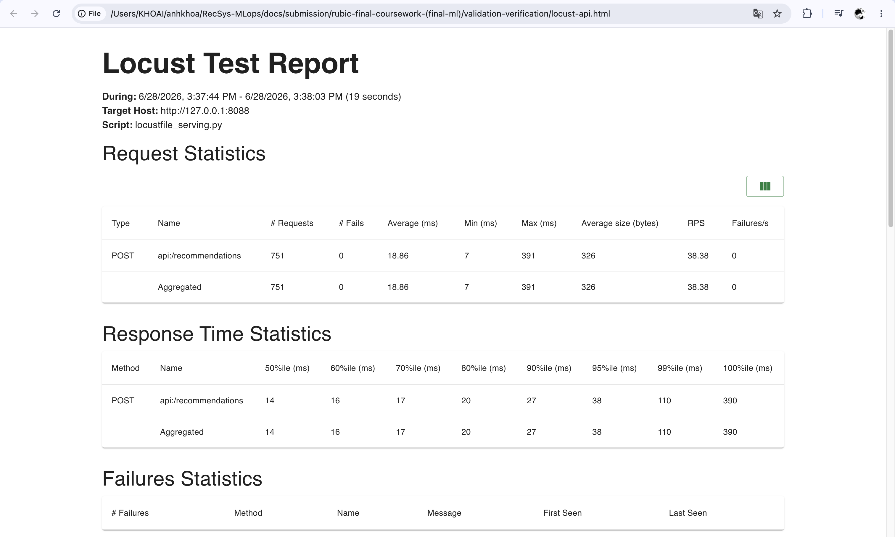

# Validation & Verification

## 1. Unit test coverage > 90% & Web API tests with fixtures and mocks

### 1.1 Unitest coverage > 90%

### 1.1 Goal

- Requirement: unit tests must pass with line coverage `> 90%`.
- Scope: component-level CI coverage gate for project Python components.
- Components covered: API serving, materialize, training, Spark batch, DP1, DP2, DP3, KServe, drift, stream offline, and stream online.
- Coverage gate: `COVERAGE_MIN=90` is passed into the CI script, and pytest uses `--cov-fail-under`.

### 1.2 Command used

```bash
COVERAGE_MIN=90 UV_CACHE_DIR=.uv-cache bash jenkins/scripts/component_ci.sh api
```

### 1.3 Screenshot proof


### 1.2. Web API tests with fixtures and mocks

### 2.1 Goal

- Requirement: prove Web API tests use pytest fixtures and mocks.
- Web API endpoint under test: `POST /recommendations`.
- External dependencies mocked: Redis/online feature store, Triton/KServe ranker, and model metadata.

Source references:

- [apps/api-serving/src/main.py line 121](../../../apps/api-serving/src/main.py#121): `POST /recommendations` FastAPI route.
- [apps/api-serving/src/serving.py line 35](../../../apps/api-serving/src/serving.py#35): `RecommendationRequest` validation model.
- [tests/unit/api_serving/test_validation_verification.py line 4](../../../tests/unit/api_serving/test_validation_verification.py#4): FastAPI `TestClient` import.
- [tests/unit/api_serving/test_validation_verification.py line 42](../../../tests/unit/api_serving/test_validation_verification.py#42): pytest fixture definition.
- [tests/unit/api_serving/test_validation_verification.py line 46](../../../tests/unit/api_serving/test_validation_verification.py#46): feature client mock via `monkeypatch`.
- [tests/unit/api_serving/test_validation_verification.py line 47](../../../tests/unit/api_serving/test_validation_verification.py#47): ranker mock via `monkeypatch`.

### 2.2 Test design

| Test area | Fixture/mock used | Expected behavior | Evidence |
| --- | --- | --- | --- |
| FastAPI `/recommendations` endpoint | `deterministic_api` fixture returns `TestClient` | API returns HTTP 200 for valid recommendation payloads | [test_validation_verification.py line 67](../../../tests/unit/api_serving/test_validation_verification.py#67) |
| Redis/online feature store | `DeterministicFeatureClient` replaces `feature_client()` | Tests do not require live Redis and still return candidates/features | [test_validation_verification.py line 12](../../../tests/unit/api_serving/test_validation_verification.py#12) |
| Triton/KServe ranker | `DeterministicRanker` replaces `ranker()` | Tests do not require live Triton/KServe and return deterministic scores | [test_validation_verification.py line 34](../../../tests/unit/api_serving/test_validation_verification.py#34) |
| AB routing / model metadata | `MODEL_VERSION` is set through `monkeypatch.setenv` | Response exposes deterministic test model version | [test_validation_verification.py line 48](../../../tests/unit/api_serving/test_validation_verification.py#48) |

### 2.3 Command used

```bash
UV_CACHE_DIR=.uv-cache PYTHONPATH=apps/api-serving/src uv run pytest tests/unit/api_serving -q -vv
```

### 2.4 Screenshot proof


## 3. Equivalence partitioning and boundary value analysis

### 3.1 Goal

- Requirement: use equivalence partitioning and boundary value analysis when designing parametrized test cases.
- Input model or endpoint: `POST /recommendations` using `RecommendationRequest`.
- Main validation rules: `user_id >= 1`, `1 <= top_k <= 100`, and optional `candidate_item_ids` length `1..500`.

Source references:

- [apps/api-serving/src/serving.py line 36](../../../apps/api-serving/src/serving.py#36): `user_id` lower bound.
- [apps/api-serving/src/serving.py line 37](../../../apps/api-serving/src/serving.py#37): `candidate_item_ids` length bounds.
- [apps/api-serving/src/serving.py line 38](../../../apps/api-serving/src/serving.py#38): `top_k` lower and upper bounds.
- [tests/unit/api_serving/test_validation_verification.py line 52](../../../tests/unit/api_serving/test_validation_verification.py#52): parametrized valid EP/BVA cases.
- [tests/unit/api_serving/test_validation_verification.py line 80](../../../tests/unit/api_serving/test_validation_verification.py#80): parametrized invalid boundary cases.

### 3.2 Equivalence partitioning cases

| Partition | Example input | Expected result | Test ID | Status |
| --- | --- | --- | --- | --- |
| Valid explicit candidate list | `user_id=42`, `candidate_item_ids=[101,102,103]`, `top_k=2` | HTTP 200 | `equivalence-valid-explicit-candidates` | PASS |
| Valid fallback candidates | `user_id=42`, no explicit candidates, `top_k=3` | HTTP 200 | `equivalence-valid-fallback-candidates` | PASS |
| Invalid user ID | `user_id=0` | HTTP 422 | `boundary-invalid-user-id-zero` | PASS |
| Invalid `top_k` | `top_k=0` or `top_k=101` | HTTP 422 | `boundary-invalid-top-k-*` | PASS |
| Invalid candidate list | empty list or 501 candidates | HTTP 422 | `boundary-invalid-candidates-*` | PASS |

### 3.3 Boundary value analysis cases

| Boundary | Value | Expected result | Test ID | Status |
| --- | ---: | --- | --- | --- |
| Minimum `user_id` | `1` | HTTP 200 | `boundary-min-user-top-k-and-one-candidate` | PASS |
| Invalid `user_id` below min | `0` | HTTP 422 | `boundary-invalid-user-id-zero` | PASS |
| Minimum `top_k` | `1` | HTTP 200 | `boundary-min-user-top-k-and-one-candidate` | PASS |
| Invalid `top_k` below min | `0` | HTTP 422 | `boundary-invalid-top-k-zero` | PASS |
| Maximum `top_k` | `100` | HTTP 200 | `boundary-max-top-k-and-max-candidates` | PASS |
| Invalid `top_k` above max | `101` | HTTP 422 | `boundary-invalid-top-k-above-max` | PASS |
| Minimum candidate list length | `1` | HTTP 200 | `boundary-min-user-top-k-and-one-candidate` | PASS |
| Empty candidate list | `0` | HTTP 422 | `boundary-invalid-empty-candidates` | PASS |
| Maximum candidate list length | `500` | HTTP 200 | `boundary-max-top-k-and-max-candidates` | PASS |
| Candidate list above max | `501` | HTTP 422 | `boundary-invalid-candidates-above-max` | PASS |

### 3.4 Command used

```bash
UV_CACHE_DIR=.uv-cache PYTHONPATH=apps/api-serving/src uv run pytest \
  tests/unit/api_serving/test_validation_verification.py \
  -q -vv
```

### 3.5 Screenshot proof


## 4. Mutation testing

### 4.1 Goal

- Requirement: use mutation testing to evaluate test effectiveness.
- Mutation score gate: `> 80%`.
- Mutate only changed code: mutation targets are either detected from changed files or explicitly provided through `MUTATION_TARGETS`.
- Target file(s): `apps/api-serving/src/serving.py`.
- Target function pattern(s): `serving.x_format_top_k*` and `serving.x_get_online_features*`.

Source references:

- [pyproject.toml line 27](../../../pyproject.toml#27): `mutmut` dependency.
- [jenkins/scripts/validation_mutation.sh line 7](../../../jenkins/scripts/validation_mutation.sh#7): base ref for changed-file detection.
- [jenkins/scripts/validation_mutation.sh line 8](../../../jenkins/scripts/validation_mutation.sh#8): mutation score threshold.
- [jenkins/scripts/validation_mutation.sh line 25](../../../jenkins/scripts/validation_mutation.sh#25): optional `MUTATION_TARGETS` input.
- [jenkins/scripts/validation_mutation.sh line 27](../../../jenkins/scripts/validation_mutation.sh#27): fallback to changed files from git diff.
- [jenkins/scripts/validation_mutation.sh line 116](../../../jenkins/scripts/validation_mutation.sh#116): generated `mutmut` configuration.
- [jenkins/scripts/validation_mutation.sh line 132](../../../jenkins/scripts/validation_mutation.sh#132): mutate only covered lines.
- [jenkins/scripts/validation_mutation.sh line 134](../../../jenkins/scripts/validation_mutation.sh#134): `only_mutate` target restriction.
- [jenkins/scripts/validation_mutation.sh line 167](../../../jenkins/scripts/validation_mutation.sh#167): detected mutant calculation.
- [jenkins/scripts/validation_mutation.sh line 169](../../../jenkins/scripts/validation_mutation.sh#169): mutation score formula.

### 4.2 Command used

```bash
MUTATION_TARGETS=apps/api-serving/src/serving.py \
MUTATION_MUTANT_NAMES='serving.x_format_top_k* serving.x_get_online_features*' \
UV_CACHE_DIR=.uv-cache \
bash jenkins/scripts/validation_mutation.sh
```

### 4.3 Mutation result

| Metric | Result |
| --- | ---: |
| Mutation score | `90.74%` |
| Gate | `> 80%` |
| Killed mutants | `49` |
| Survived mutants | `5` |
| Timeout mutants | `0` |
| Suspicious mutants | `0` |
| No-test mutants | `0` |

Evidence files:

- `validation-verification/mutation-summary.md`
- `validation-verification/mutation-results.txt`

Result references:

- [validation-verification/mutation-summary.md line 3](validation-verification/mutation-summary.md#3): mutation score.
- [validation-verification/mutation-summary.md line 5](validation-verification/mutation-summary.md#5): killed mutants.
- [validation-verification/mutation-summary.md line 6](validation-verification/mutation-summary.md#6): survived mutants.
- [validation-verification/mutation-summary.md line 10](validation-verification/mutation-summary.md#10): mutation target file.

### 4.4 Screenshot proof


## 5. Property-based idempotency testing

### 5.1 Goal

- Requirement: use property-based testing to verify idempotency.
- Property under test: repeated deterministic recommendation predictions for the same request return identical output.
- Generated inputs: `user_id`, `top_k`, and `candidate_item_ids`.
- Deterministic dependencies: deterministic feature client and ranker replace Redis and Triton/KServe.

Source references:

- [pyproject.toml line 26](../../../pyproject.toml#26): `hypothesis` dependency.
- [tests/unit/api_serving/test_validation_verification.py line 5](../../../tests/unit/api_serving/test_validation_verification.py#5): Hypothesis imports.
- [tests/unit/api_serving/test_validation_verification.py line 106](../../../tests/unit/api_serving/test_validation_verification.py#106): `@given` property-based test.
- [tests/unit/api_serving/test_validation_verification.py line 107](../../../tests/unit/api_serving/test_validation_verification.py#107): generated `user_id` strategy.
- [tests/unit/api_serving/test_validation_verification.py line 108](../../../tests/unit/api_serving/test_validation_verification.py#108): generated `top_k` strategy.
- [tests/unit/api_serving/test_validation_verification.py line 109](../../../tests/unit/api_serving/test_validation_verification.py#109): generated candidate list strategy.
- [tests/unit/api_serving/test_validation_verification.py line 129](../../../tests/unit/api_serving/test_validation_verification.py#129): repeated predictions for the same input.
- [tests/unit/api_serving/test_validation_verification.py line 139](../../../tests/unit/api_serving/test_validation_verification.py#139): idempotency assertion.

### 5.2 Property definition

For the same recommendation request and deterministic mocked feature/ranker
dependencies, repeated predictions must return the same:

- item order
- scores
- model version
- response metadata

### 5.3 Command used

```bash
UV_CACHE_DIR=.uv-cache PYTHONPATH=apps/api-serving/src uv run pytest \
  tests/unit/api_serving/test_validation_verification.py::test_property_based_recommendation_idempotency_for_deterministic_prediction \
  -q -vv
```

### 5.4 Result

| Field | Value |
| --- | --- |
| Library | Hypothesis |
| Number of examples | `60` |
| Result | PASS |
| Evidence | [test_validation_verification.py line 115](../../../tests/unit/api_serving/test_validation_verification.py#115) |

### 5.5 Screenshot proof


## 6. Web API load testing with Locust

### 6.1 Goal

- Requirement: load test the Web API and produce an HTML report with SLA summary.
- Endpoint: `POST /recommendations`.
- Deployment target: `svc/recsys-api-serving` through local `kubectl port-forward` to `127.0.0.1:8088`.
- SLA: failure rate `0%`, throughput `>= 5 req/s`, and p95 latency `< 1000 ms`.

Source references:

- [pyproject.toml line 28](../../../pyproject.toml#28): `locust` dependency.
- [tests/load/locustfile_serving.py line 27](../../../tests/load/locustfile_serving.py#27): Locust user class.
- [tests/load/locustfile_serving.py line 36](../../../tests/load/locustfile_serving.py#36): Locust task.
- [tests/load/locustfile_serving.py line 43](../../../tests/load/locustfile_serving.py#43): Web API recommendation request builder.
- [tests/load/locustfile_serving.py line 49](../../../tests/load/locustfile_serving.py#49): `POST /recommendations` load-test call.
- [jenkins/scripts/validation_load_test.sh line 19](../../../jenkins/scripts/validation_load_test.sh#19): headless Locust command.
- [jenkins/scripts/validation_load_test.sh line 26](../../../jenkins/scripts/validation_load_test.sh#26): HTML report output.
- [jenkins/scripts/validation_load_test.sh line 30](../../../jenkins/scripts/validation_load_test.sh#30): CSV-to-SLA summary script.
- [jenkins/scripts/validation_load_test.sh line 44](../../../jenkins/scripts/validation_load_test.sh#44): SLA pass/fail condition.

### 6.2 Command used

```bash
kubectl port-forward -n api-serving svc/recsys-api-serving 8088:80

NO_PROXY=127.0.0.1,localhost \
RECSYS_LOAD_HOST=http://127.0.0.1:8088 \
RECSYS_LOAD_USERS=2 \
RECSYS_LOAD_SPAWN_RATE=1 \
RECSYS_LOAD_DURATION=20s \
UV_CACHE_DIR=.uv-cache \
bash jenkins/scripts/validation_load_test.sh
```

### 6.3 SLA result

| Metric | Result | Pass condition | Status |
| --- | ---: | --- | --- |
| Total requests | `729` | recorded | PASS |
| Failure rate | `0.00%` | `0%` | PASS |
| Throughput | `38.33 req/s` | `>= 5 req/s` | PASS |
| Average latency | see HTML report | recorded | PASS |
| p95 latency | `39.00 ms` | `< 1000 ms` | PASS |
| p99 latency | see HTML report | recorded | PASS |
| Max latency | see HTML report | recorded | PASS |

Evidence files:

- `validation-verification/locust-api.html`
- `validation-verification/locust-sla-summary.md`

### 6.4 Screenshot proof



