# Validation & Verification — ML Serving APIs

Verified on **2026-08-30**. This document covers Inference API and Online
Feature API. RAG evidence is in the
[LLM Validation & Verification](<../rubric-final-coursework-(final-llm)/validation_verification.md>).

| Requirement | Inference API | Online Feature API |
| --- | ---: | ---: |
| Real FastAPI + `TestClient` + fixture/mock | PASS | PASS |
| Coverage `> 90%` | **98.44%** | **92.39%** |
| Full contract EP/BVA | PASS | PASS, POST and GET |
| HTTP Hypothesis idempotency | PASS, 60 × 3 POST | PASS, 60 × 3 POST and 60 × 3 GET |
| Public-path mutation score `> 80%` | **724/819 = 88.40%** | **180/212 = 84.91%** |
| Bad mutation states | 0 | 0 |
| Locust evidence | PASS | PASS |

Tests are service-oriented under
[`tests/unit/api_serving`](../../../tests/unit/api_serving/). Mutation oracles
live only under
[`tests/mutation/api_serving`](../../../tests/mutation/api_serving/), never in
a production package.

## 1. Inference API

### 1.1 Original contract, fixture/mock and coverage

The source of every EP/BVA input is the Pydantic request model in
[`schemas.py`](../../../apps/api-serving/inference-api/src/recsys_inference_api/schemas.py)
(lines 6–11):

```python
class RecommendationRequest(BaseModel):
    user_id: int = Field(ge=1)
    candidate_item_ids: list[int] | None = Field(
        default=None, min_length=1, max_length=500
    )
    top_k: int = Field(default=10, ge=1, le=100)
```

The fixture in
[`inference_api/conftest.py`](../../../tests/unit/api_serving/inference_api/conftest.py)
(lines 49–70) builds the real FastAPI app, uses an `AsyncMock` for the awaited
Feature boundary, wraps the deterministic ranker with `Mock`, and injects both:

```python
feature_service = Mock(spec=DeterministicFeatureService)
feature_service.fetch = AsyncMock(side_effect=feature_implementation.fetch)
ranker = Mock(spec=DeterministicRanker, wraps=ranker_implementation)
app = create_app(settings, feature_service=feature_service, router=ranker)
with TestClient(app) as client:
    client.app.state.feature_service_mock = feature_service
    client.app.state.ranker_mock = ranker
    yield client
```

No real Feature API or Triton server is contacted, but requests still cross
FastAPI validation, routing and response serialization.

```bash
nl -ba tests/unit/api_serving/inference_api/conftest.py | sed -n '45,85p'
COVERAGE_FILE=/tmp/recsys-inference.coverage \
UV_CACHE_DIR=.uv-cache RECSYS_OTEL_ENABLED=0 \
uv run pytest tests/unit/api_serving \
  tests/mutation/api_serving/inference_api -q \
  --cov=recsys_inference_api --cov-report=term-missing \
  --cov-fail-under=90.01
```

> **Proof note — fixture/mock and coverage:** the screenshot shows the test run
> crossing the isolated FastAPI service and reaching 98.44%, above the 90.01%
> gate.

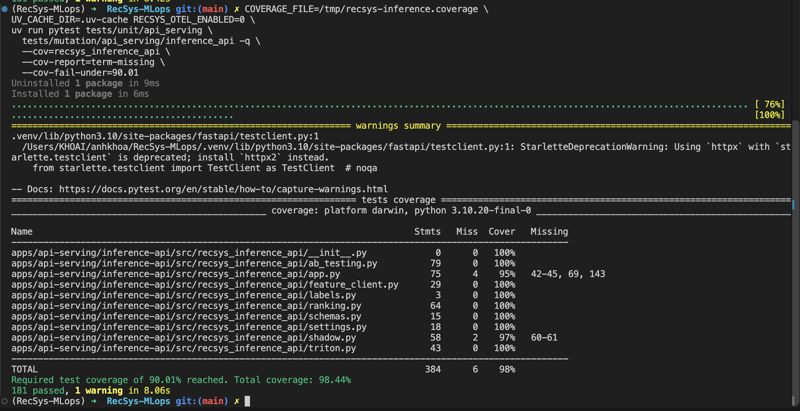

### 1.2 EP and BVA derived from the contract

Equivalence Partitioning groups inputs that should take the same behavioral
path. Boundary Value Analysis then samples immediately below, at and above each
numeric/list boundary declared by the contract.

| Contract rule | Equivalence classes and meaning | Boundary representatives |
| --- | --- | --- |
| `user_id >= 1` | Valid integer users enter business logic; values below 1 and wrong types are invalid before dependencies. | `0` (`min-1`), `1` (`min`) |
| candidates are optional | `None` is the fallback-candidate path; a present list is the explicit-candidate path. These are distinct even though both are valid. | N/A |
| present candidate list has `1..500` items | Non-empty lists are valid; empty and oversized lists are invalid. | counts `0/1/500/501` |
| `top_k=10`, allowed `1..100` | Omitted is the default class; supplied valid values are another class; lower/upper violations are invalid. | `0/1/100/101` |
| request must be an object containing a valid user | Correct object is valid; no body, missing user, wrong type and array body form malformed classes. | HTTP structural validation, not numeric BVA |

The parametrized implementation is in
[`test_validation_design.py`](../../../tests/unit/api_serving/inference_api/test_validation_design.py):
EP at lines 17–50, malformed classes at 53–66, and BVA at 69–125.

```python
@pytest.mark.parametrize(
    ("payload", "expected_count", "partition"),
    [
        ({"user_id": 42, "candidate_item_ids": [101, 102, 103], "top_k": 2}, 2, "explicit"),
        ({"user_id": 42, "top_k": 3}, 3, "fallback"),
        ({"user_id": 42, "candidate_item_ids": list(range(1, 16))}, 10, "default-top-k"),
    ],
)
def test_recommendations_equivalence_partitions(inference_api, payload, expected_count, partition):
    response = inference_api.post("/recommendations", json=payload)
    assert response.status_code == 200, partition
    assert len(response.json()["items"]) == expected_count

@pytest.mark.parametrize(
    ("payload", "expected_status", "expected_count"),
    [
        ({"user_id": 0, "candidate_item_ids": [1], "top_k": 1}, 422, None),
        ({"user_id": 1, "candidate_item_ids": [1], "top_k": 1}, 200, 1),
        ({"user_id": 1, "candidate_item_ids": [1], "top_k": 0}, 422, None),
        ({"user_id": 1, "candidate_item_ids": list(range(1, 501)), "top_k": 100}, 200, 100),
        ({"user_id": 1, "candidate_item_ids": [1], "top_k": 101}, 422, None),
        ({"user_id": 1, "candidate_item_ids": [], "top_k": 1}, 422, None),
        ({"user_id": 1, "candidate_item_ids": list(range(1, 502)), "top_k": 1}, 422, None),
    ],
)
def test_recommendations_boundary_value_analysis(...):
    ...
```

The HTTP oracle has two meanings: a valid representative returns `200` and
calls Feature/Triton once; an invalid representative returns `422` and proves
both dependencies were untouched. Thus the test checks rejection at the API
boundary, not merely the status code.

```bash
UV_CACHE_DIR=.uv-cache RECSYS_OTEL_ENABLED=0 uv run pytest \
  tests/unit/api_serving/inference_api/test_validation_design.py -vv \
  -k 'equivalence or malformed or boundary'
```

> **Proof note — EP/BVA:** all 17 selected explicit, fallback, default,
> malformed and adjacent-boundary representatives pass.

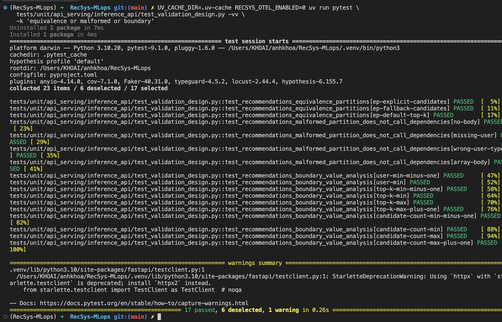

### 1.3 HTTP property-based idempotency

The complete property at
[`test_validation_design.py`](../../../tests/unit/api_serving/inference_api/test_validation_design.py)
(lines 128–164) generates only contract-valid requests, sends the identical
request three times through `TestClient`, and compares the entire HTTP result:

```python
@given(
    user_id=st.integers(min_value=1, max_value=20_000),
    top_k=st.integers(min_value=1, max_value=100),
    candidate_item_ids=st.one_of(
        st.none(),
        st.lists(st.integers(min_value=1, max_value=20_000), min_size=1, max_size=40),
    ),
)
@settings(max_examples=60, deadline=None, ...)
def test_recommendations_http_idempotency(inference_api, ...):
    responses = [inference_api.post("/recommendations", json=payload) for _ in range(3)]
    assert [response.status_code for response in responses] == [200, 200, 200]
    assert responses[0].json() == responses[1].json() == responses[2].json()
    assert feature_service.fetch.await_count == 3
    assert ranker.score.call_count == 3
```

The invariant means repeated reads with the same request and deterministic
dependencies have identical status and full JSON. Exactly three dependency
interactions prove all three HTTP requests executed; the test is not passing
because of response caching. It does not claim that a changing live model or
Feature store must return the same data forever.

```bash
UV_CACHE_DIR=.uv-cache RECSYS_OTEL_ENABLED=0 uv run pytest \
  tests/unit/api_serving/inference_api -vv -k 'http_idempotency'
```

> **Proof note — HTTP idempotency:** Hypothesis runs 60 generated examples,
> each with three FastAPI requests, and the recommendations property passes.

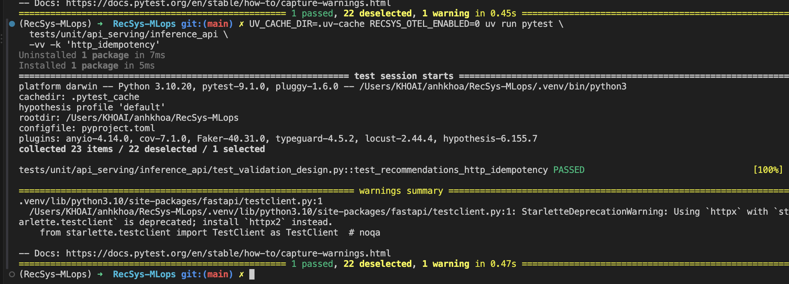

### 1.4 Centralized full-scope mutation testing

Root [`pyproject.toml`](../../../pyproject.toml) selects schemas, Feature client,
ranking, A/B routing, shadow logic and Triton. The runner is
[`tests/mutation/api_serving/run.py`](../../../tests/mutation/api_serving/run.py),
and the actual mutation oracle is
[`inference_api/test_public_request_path.py`](../../../tests/mutation/api_serving/inference_api/test_public_request_path.py).

| Mutated area | What kills the mutant |
| --- | --- |
| Contract bounds/defaults | Exact adjacent valid/invalid assertions. |
| Feature client | Exact method, URL, payload, response and telemetry. |
| Ranking/top-k | Exact normalization, Triton arrays, order and slice length. |
| A/B routing | Exact bucket, 0/100 weights and shadow selection. |
| Shadow runner | Queue accept/drop plus success/error/timeout metrics. |
| Triton adapter | Exact tensors, timeout, parsed scores/IDs and close. |

```bash
UV_CACHE_DIR=.uv-cache RECSYS_OTEL_ENABLED=0 uv run python \
  tests/mutation/api_serving/run.py inference --max-children 8
```

> **Proof note — mutation:** 724 of 819 mutants are killed, 95 survive and no
> selected mutant has an invalid state; mutation score is 88.40%.

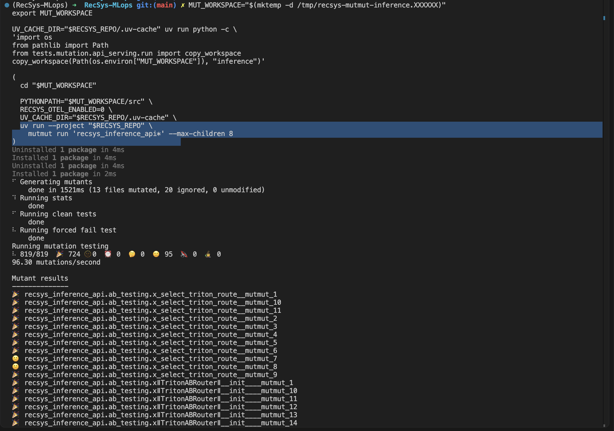

### 1.5 Locust Web API load test

```bash
RECSYS_LOAD_TARGET=api UV_CACHE_DIR=.uv-cache uv run locust \
  -f tests/load/locustfile_serving.py --headless -u 10 -r 10 -t 10s \
  --host="${INFERENCE_URL:-http://127.0.0.1:8000}" \
  --html=docs/submission/rubic-final-coursework-\(final-ml\)/validation-verification/locust-inference-current.html
```

> **Proof note — Locust statistics:** 229 requests, zero failures, 23.15 req/s
> and p95 550 ms.

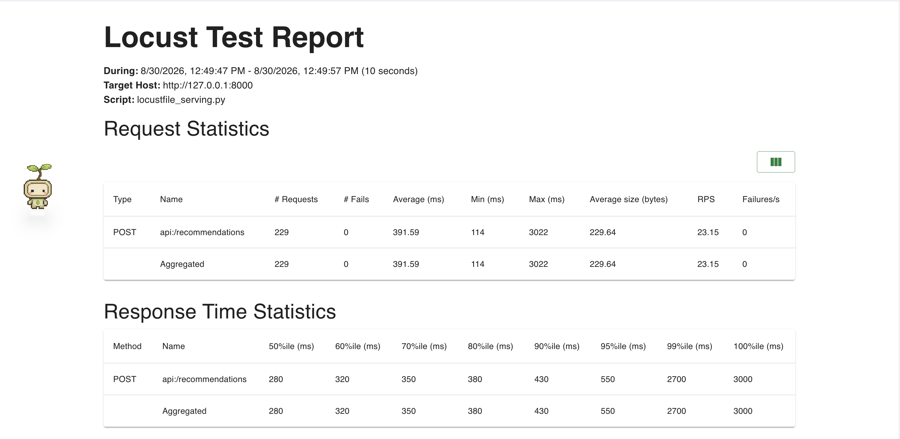

> **Proof note — Locust charts:** the time series confirms zero failures and
> exposes the throughput and latency trend during the same run.

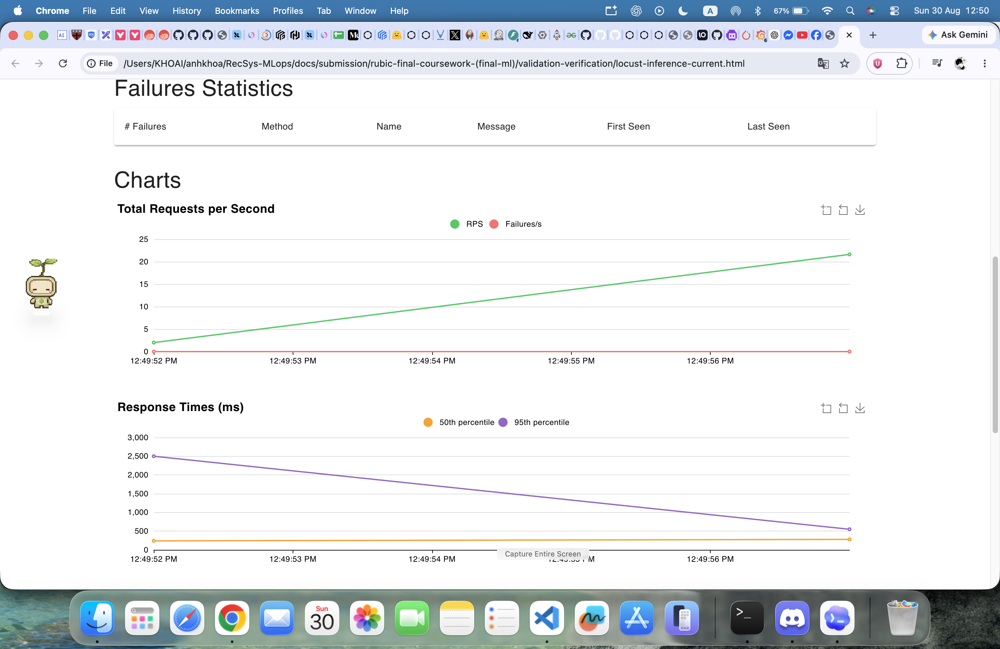

## 2. Online Feature API

### 2.1 Original POST/GET contracts, fixture/mock and coverage

POST uses
[`OnlineFeaturesRequest`](../../../apps/api-serving/shared/src/recsys_serving_common/contracts.py)
(lines 15–20):

```python
class OnlineFeaturesRequest(BaseModel):
    user_id: int = Field(ge=1)
    candidate_item_ids: list[int] | None = Field(
        default=None, min_length=1, max_length=500
    )
    top_k: int = Field(default=10, ge=1, le=100)
```

GET declares the same contract in
[`app.py`](../../../apps/api-serving/online-feature-api/src/recsys_online_feature_api/app.py)
(lines 94–110):

```python
user_id: int = Path(ge=1)
candidate_item_ids: list[int] | None = Query(
    default=None, min_length=1, max_length=500
)
top_k: int = Query(default=10, ge=1, le=100)
```

The GET handler then constructs `OnlineFeaturesRequest` and delegates to the
POST handler, so both transports should have equivalent semantics. The fixture
in
[`online_feature_api/conftest.py`](../../../tests/unit/api_serving/online_feature_api/conftest.py)
(lines 39–49) wraps a deterministic Feature client and injects it into the real
app; Redis and Feast are not opened.

```python
implementation = DeterministicFeatureClient()
feature_client = Mock(spec=DeterministicFeatureClient, wraps=implementation)
app = create_app(
    FeatureApiSettings(warmup_on_startup=False),
    feature_client=feature_client,
)
with TestClient(app) as client:
    client.app.state.feature_client_mock = feature_client
    yield client
```

```bash
nl -ba tests/unit/api_serving/online_feature_api/conftest.py | sed -n '35,70p'
COVERAGE_FILE=/tmp/recsys-online.coverage \
UV_CACHE_DIR=.uv-cache RECSYS_OTEL_ENABLED=0 \
uv run pytest tests/unit/api_serving \
  tests/mutation/api_serving/online_feature_api -q \
  --cov=recsys_online_feature_api --cov=recsys_serving_common.contracts \
  --cov-report=term-missing --cov-fail-under=90.01
```

> **Proof note — fixture/mock and coverage:** the screenshot contains the
> wrapped `Mock` fixture and shows 92.39%, above the 90.01% gate.

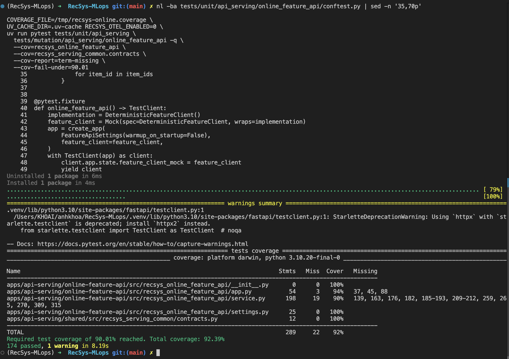

### 2.2 EP and BVA derived from both transport contracts

| Contract rule | Input classes and their meaning | Boundary representatives |
| --- | --- | --- |
| candidates optional in body/query | Explicit body list or repeated GET query values skip generation; omission activates fallback generation. | N/A |
| default `top_k=10` | Omitted top-k proves the declared default; supplied valid top-k proves caller control. | `0/1/100/101` |
| candidates `1..500` when present | Empty/oversized are invalid; list sizes inside the range reach Feature lookup. | counts `0/1/500/501` |
| `user_id >= 1` | Valid body/path users reach the service; below-minimum users are rejected. | `0/1` |
| POST body shape | Object with valid fields is accepted; absent, incomplete, wrong-type and array bodies are malformed. | Structural HTTP classes |
| POST versus GET encoding | Same logical request encoded in either transport must return identical complete JSON. | Omitted and explicit candidate cases |

POST parametrization is implemented in
[`test_validation_design.py`](../../../tests/unit/api_serving/online_feature_api/test_validation_design.py)
(EP lines 35–71, malformed lines 74–88, BVA lines 91–132):

```python
@pytest.mark.parametrize(
    ("payload", "expected_candidates", "uses_fallback"),
    [
        ({"user_id": 42, "candidate_item_ids": [101, 102, 103], "top_k": 2}, [101, 102, 103], False),
        ({"user_id": 42, "top_k": 3}, list(range(100, 115)), True),
        ({"user_id": 42, "candidate_item_ids": list(range(1, 16))}, list(range(1, 16)), False),
    ],
)
def test_post_equivalence_partitions(...):
    ...

@pytest.mark.parametrize(
    ("payload", "expected_status"),
    [
        ({"user_id": 0, "candidate_item_ids": [1], "top_k": 1}, 422),
        ({"user_id": 1, "candidate_item_ids": [1], "top_k": 1}, 200),
        ({"user_id": 1, "candidate_item_ids": [1], "top_k": 0}, 422),
        ({"user_id": 1, "candidate_item_ids": list(range(1, 501)), "top_k": 100}, 200),
        ({"user_id": 1, "candidate_item_ids": [1], "top_k": 101}, 422),
        ({"user_id": 1, "candidate_item_ids": [], "top_k": 1}, 422),
        ({"user_id": 1, "candidate_item_ids": list(range(1, 502)), "top_k": 1}, 422),
    ],
)
def test_post_boundary_value_analysis(...):
    ...
```

GET-specific parametrization appears at lines 135–223. It tests path/query
parsing, candidate counts, omitted query keys and repeated candidate keys.
Transport parity is parametrized at lines 226–238:

```python
@pytest.mark.parametrize("candidate_item_ids", [None, [91, 92]])
def test_post_and_get_are_response_equivalent(online_feature_api, candidate_item_ids):
    post = online_feature_api.post("/online-features", json=payload)
    get = online_feature_api.get(path, params=params)
    assert post.status_code == get.status_code == 200
    assert post.json() == get.json()
```

For valid cases, the oracle checks exact candidate IDs and exact calls to
`candidates`, `user_sequence` and `item_features_batch`. For invalid cases it
requires `422` and zero calls to all three dependencies. This differentiates a
correct API-boundary rejection from an internal error after partial work.

```bash
UV_CACHE_DIR=.uv-cache RECSYS_OTEL_ENABLED=0 uv run pytest \
  tests/unit/api_serving/online_feature_api/test_validation_design.py -vv \
  -k 'equivalence or malformed or boundary or repeated or response_equivalent'
```

> **Proof note — EP/BVA:** all 28 selected POST/GET partitions, adjacent
> boundaries, repeated-query and response-equivalence cases pass.

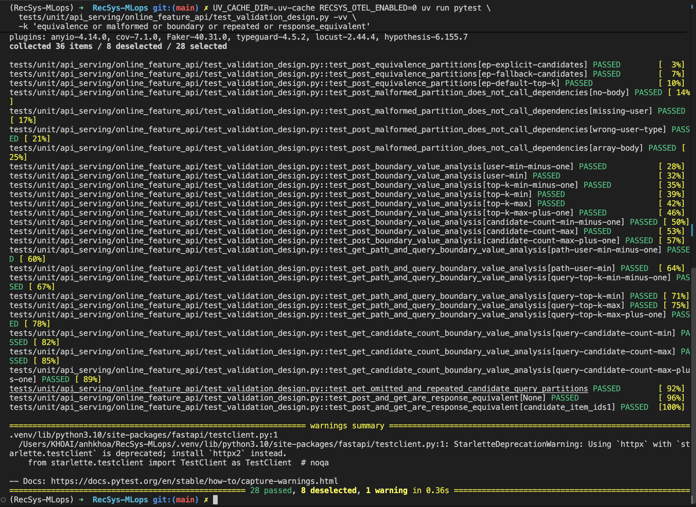

### 2.3 HTTP property-based idempotency

The POST and GET properties in
[`test_validation_design.py`](../../../tests/unit/api_serving/online_feature_api/test_validation_design.py)
(lines 241–304) share the same valid strategies and independently cross both
HTTP encodings:

```python
@given(
    user_id=st.integers(min_value=1, max_value=20_000),
    top_k=st.integers(min_value=1, max_value=100),
    candidate_item_ids=st.one_of(
        st.none(),
        st.lists(st.integers(min_value=1, max_value=20_000), min_size=1, max_size=40),
    ),
)
@settings(max_examples=60, deadline=None, ...)
def test_post_http_idempotency(...):
    responses = [online_feature_api.post("/online-features", json=payload) for _ in range(3)]
    assert responses[0].json() == responses[1].json() == responses[2].json()
    assert feature_client.user_sequence.call_count == 3
    assert feature_client.item_features_batch.call_count == 3

def test_get_http_idempotency(...):
    responses = [online_feature_api.get(path, params=params) for _ in range(3)]
    assert responses[0].json() == responses[1].json() == responses[2].json()
    assert feature_client.user_sequence.call_count == 3
    assert feature_client.item_features_batch.call_count == 3
```

Each property runs 60 generated examples and repeats each exact HTTP request
three times. Equal status and full JSON establish read idempotency under fixed
dependencies; call count `3` proves the handler executed every time rather than
returning a stale cached response.

```bash
UV_CACHE_DIR=.uv-cache RECSYS_OTEL_ENABLED=0 uv run pytest \
  tests/unit/api_serving/online_feature_api -vv -k 'http_idempotency'
```

> **Proof note — HTTP idempotency:** both POST and GET properties pass through
> the real FastAPI `TestClient`, covering 120 generated examples and 360 HTTP
> requests in total.

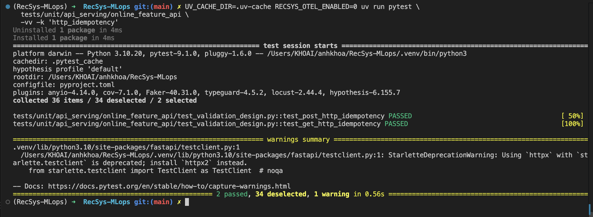

### 2.4 Centralized full-scope mutation testing

The root Mutmut configuration includes Online Feature service logic and shared
contracts. The service-specific oracle is
[`online_feature_api/test_public_request_path.py`](../../../tests/mutation/api_serving/online_feature_api/test_public_request_path.py).

| Mutated area | What kills the mutant |
| --- | --- |
| Shared bounds/defaults | Exact adjacent valid/invalid Pydantic cases. |
| JSON/realtime normalization | Exact bytes, strings, tuples and sparse mappings. |
| Explicit/fallback | Exact generator call or proof it was skipped. |
| Pool arithmetic | Exact `max(top_k * 5, top_k)` argument. |
| Sync/async resolution | Sync return and awaited `AsyncMock` branches. |
| Batch/legacy lookup | Exact ordered item-feature mapping and telemetry. |

```bash
UV_CACHE_DIR=.uv-cache RECSYS_OTEL_ENABLED=0 uv run python \
  tests/mutation/api_serving/run.py online-feature --max-children 8
```

> **Proof note — mutation:** 180 of 212 mutants are killed, 32 survive and no
> selected mutant has an invalid state; mutation score is 84.91%.

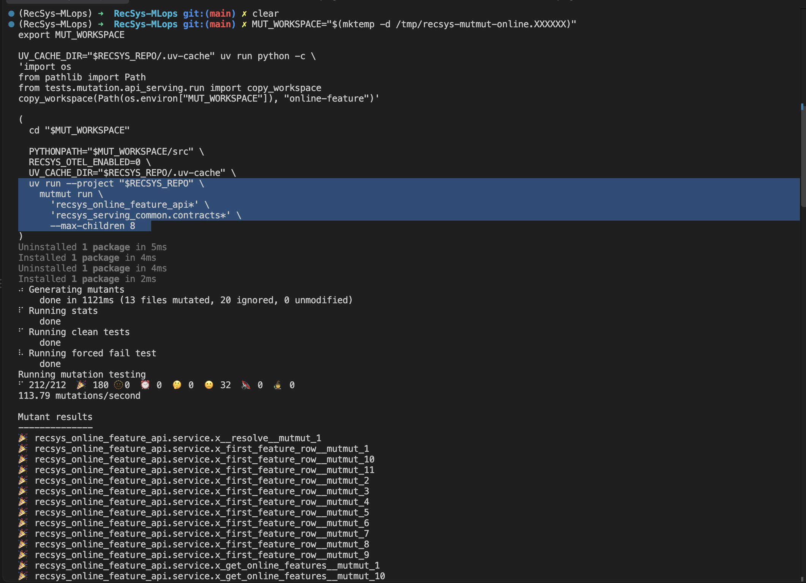

### 2.5 Locust Web API load test

```bash
RECSYS_LOAD_TARGET=feature UV_CACHE_DIR=.uv-cache uv run locust \
  -f tests/load/locustfile_serving.py --headless -u 10 -r 10 -t 10s \
  --host="${ONLINE_FEATURE_URL:-http://127.0.0.1:8001}" \
  --html=docs/submission/rubic-final-coursework-\(final-ml\)/validation-verification/locust-online-feature-current.html
```

> **Proof note — Locust statistics:** 246 requests, zero failures, 24.93 req/s
> and p95 790 ms.

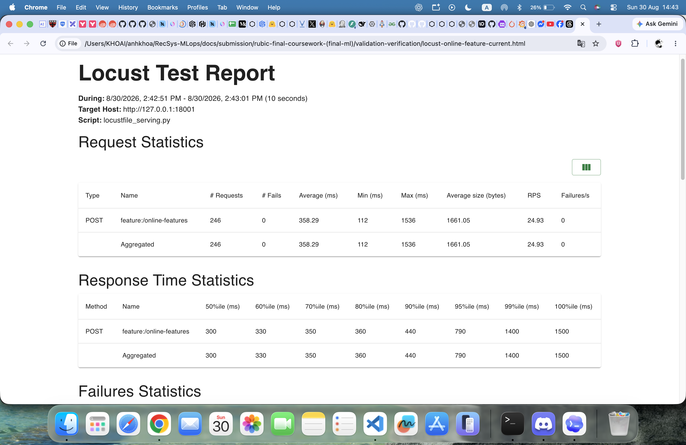

> **Proof note — Locust charts:** the time series confirms sustained
> throughput, zero failures/s and the measured p50/p95 latency.

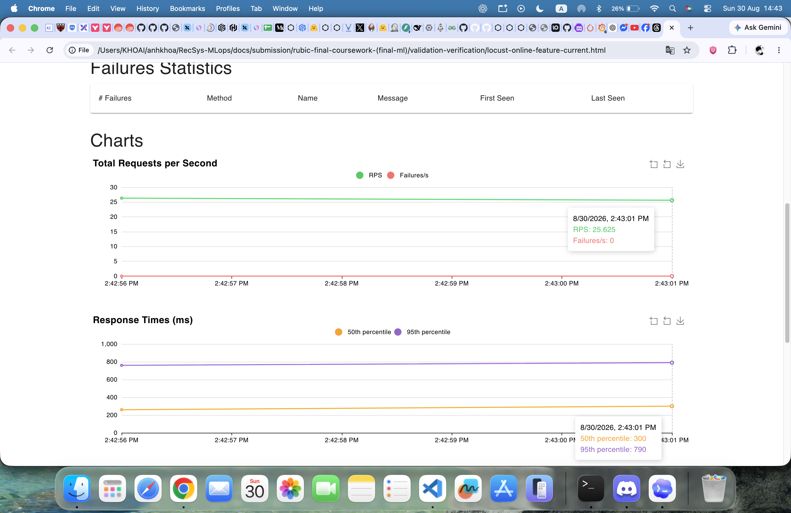

## 3. Archived load artifacts

Historical reports remain at
[Inference HTML](validation-verification/locust-api.html) and
[Online Feature HTML](validation-verification/feature-load/locust-api.html).
Current evidence is colocated with the corresponding design section above.
