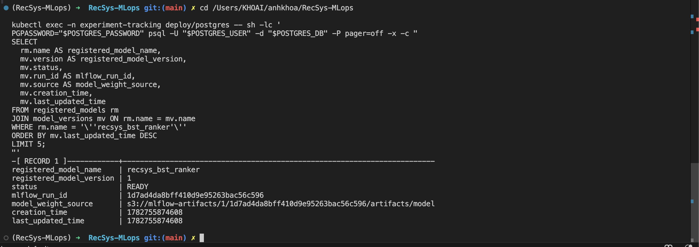

# Versioning

## Model Versioning

### Code reference

- [apps/ml-system/src/training/train.py line 25](../../../apps/ml-system/src/training/train.py#L25): logs BST training params, metrics, checkpoint artifact, config, and dataset lineage to MLflow.
- [apps/ml-system/src/training/train.py line 54](../../../apps/ml-system/src/training/train.py#L54): registers model metadata into the model registry table after training.
- [apps/ml-system/src/training/ray_tune_train_bst.py line 175](../../../apps/ml-system/src/training/ray_tune_train_bst.py#L175): registers the best distributed Ray Tune result with its `mlflow_run_id`, artifact URI, metrics, and selected hyperparameters.
- [apps/ml-system/src/registry/model_registry.py line 8](../../../apps/ml-system/src/registry/model_registry.py#L8): defines the `model_configs` registry table with `model_version`, `artifact_uri`, `mlflow_run_id`, `metrics`, and `config`.
- [apps/ml-system/src/registry/model_promotion.py line 477](../../../apps/ml-system/src/registry/model_promotion.py#L477): builds the promoted model manifest with `model_version`, source checkpoint, MLflow run ID, serving URI, and model tensor schema.
- [apps/ml-system/src/registry/model_promotion.py line 510](../../../apps/ml-system/src/registry/model_promotion.py#L510): creates a real MLflow registered model version through `MlflowClient.create_model_version`.
- [apps/ml-system/src/registry/model_promotion.py line 557](../../../apps/ml-system/src/registry/model_promotion.py#L557): exports the best checkpoint into a versioned Triton model repository and writes the promotion manifest.

### Running command

Expose MLflow UI for screenshots.

```bash
cd /Users/KHOAI/anhkhoa/RecSys-MLops

kubectl port-forward -n experiment-tracking svc/mlflow 5000:5000
```

Print the latest MLflow Model Registry version.

```bash
cd /Users/KHOAI/anhkhoa/RecSys-MLops

kubectl exec -n experiment-tracking deploy/postgres -- sh -lc '
PGPASSWORD="$POSTGRES_PASSWORD" psql -U "$POSTGRES_USER" -d "$POSTGRES_DB" -P pager=off -x -c "
SELECT
  rm.name AS registered_model_name,
  mv.version AS registered_model_version,
  mv.status,
  mv.run_id AS mlflow_run_id,
  mv.source AS model_weight_source,
  mv.creation_time,
  mv.last_updated_time
FROM registered_models rm
JOIN model_versions mv ON rm.name = mv.name
WHERE rm.name = '\''recsys_bst_ranker'\''
ORDER BY mv.last_updated_time DESC
LIMIT 5;
"'
```

Optional terminal proof for the promoted serving manifest and hyperparameters.

```bash
cd /Users/KHOAI/anhkhoa/RecSys-MLops

kubectl exec -n experiment-tracking deploy/postgres -- sh -lc '
PGPASSWORD="$POSTGRES_PASSWORD" psql -U "$POSTGRES_USER" -d "$POSTGRES_DB" -P pager=off -x -c "
SELECT
  model_name,
  model_version,
  mlflow_run_id,
  artifact_uri,
  serving_artifact_uri,
  promotion_manifest_uri,
  metrics,
  config #>> '\''{training_args,learning_rate}'\'' AS learning_rate,
  config #>> '\''{training_args,batch_size}'\'' AS batch_size,
  config #>> '\''{training_args,num_epochs}'\'' AS num_epochs,
  created_at
FROM model_configs
ORDER BY created_at DESC
LIMIT 5;
"'
```

### Description of output when running command

- MLflow UI shows `Models -> recsys_bst_ranker -> Version 1` with status `READY`.
- The model version links back to the MLflow training run ID and uses the checkpoint artifact as `model_weight_source`.
- The MLflow run stores model parameters, training/evaluation metrics, the checkpoint artifact under `model/`, `configs/local/bst.yaml`, `metrics/training_metrics.json`, and dataset lineage artifacts.
- The `model_configs` query prints one row per promoted model version. The important proof columns are `model_version`, `mlflow_run_id`, `artifact_uri`, `serving_artifact_uri`, `promotion_manifest_uri`, `metrics`, `learning_rate`, `batch_size`, and `num_epochs`.
- `artifact_uri` points back to the MLflow checkpoint artifact, while `serving_artifact_uri` and `promotion_manifest_uri` point to the promoted model package/manifest used for serving.

### Image proof




## Data Versioning

### Code reference

- [apps/ml-system/src/cli/prepare_bst_training_data.py line 353](../../../apps/ml-system/src/cli/prepare_bst_training_data.py#L353): builds `dataset_version_meta.json` with `dataset_run_id`, schema hash, feature source, row counts, table names, snapshot IDs, commit times, and tags.
- [apps/ml-system/src/cli/prepare_bst_training_data.py line 475](../../../apps/ml-system/src/cli/prepare_bst_training_data.py#L475): converts split rows into versioned samples and commits them to Hudi when versioning is enabled.
- [apps/ml-system/src/lineage/dataset_versioning.py line 48](../../../apps/ml-system/src/lineage/dataset_versioning.py#L48): defines versioned sample columns, including `sample_id`, `row_hash`, `dataset_run_id`, and timestamps.
- [apps/ml-system/src/lineage/dataset_versioning.py line 146](../../../apps/ml-system/src/lineage/dataset_versioning.py#L146): creates stable `sample_id` values used as the incremental record key.
- [apps/ml-system/src/lineage/dataset_versioning.py line 346](../../../apps/ml-system/src/lineage/dataset_versioning.py#L346): configures Hudi Copy-on-Write `upsert` using `sample_id` as the record key and `updated_at` as the precombine field.
- [apps/ml-system/src/lineage/dataset_versioning.py line 403](../../../apps/ml-system/src/lineage/dataset_versioning.py#L403): writes versioned training/evaluation samples to Hudi and returns snapshot/commit metadata.
- [apps/ml-system/src/lineage/mlflow_dataset_lineage.py line 34](../../../apps/ml-system/src/lineage/mlflow_dataset_lineage.py#L34): logs dataset run ID, schema hash, split row counts, Hudi table names, and commit times back to MLflow.

### Running command

Expose MLflow UI for screenshots.

```bash
cd /Users/KHOAI/anhkhoa/RecSys-MLops

kubectl port-forward -n experiment-tracking svc/mlflow 5000:5000
```

Print the exact data version linked to the latest registered model version.

```bash
cd /Users/KHOAI/anhkhoa/RecSys-MLops

kubectl exec -n experiment-tracking deploy/postgres -- sh -lc '
PGPASSWORD="$POSTGRES_PASSWORD" psql -U "$POSTGRES_USER" -d "$POSTGRES_DB" -P pager=off -x -c "
SELECT
  key,
  value
FROM params
WHERE run_uuid = (
  SELECT run_id
  FROM model_versions
  WHERE name = '\''recsys_bst_ranker'\''
  ORDER BY last_updated_time DESC
  LIMIT 1
)
AND (
  key LIKE '\''dataset.%'\''
  OR key IN ('\''dataset_run_id'\'', '\''schema_hash'\'', '\''split_strategy'\'', '\''feast_feature_service'\'')
)
ORDER BY key;
"'
```

### Description of output when running command

- MLflow UI shows data versioning inside the same run linked from `Models -> recsys_bst_ranker -> Version 1`.
- In the run **Parameters** tab, filter by `dataset` to show `dataset_run_id`, `schema_hash`, `dataset.training.hudi_commit_time`, `dataset.validation.hudi_commit_time`, `dataset.evaluation.hudi_commit_time`, Hudi table names, tags, row counts, and JSONL paths.
- In the run **Artifacts** tab, open `datasets/dataset_version_meta.json` to show the persisted dataset version manifest.
- Incremental data versioning is demonstrated by Hudi `upsert`: each sample has a stable `sample_id` and `row_hash`, so repeated training pulls create a new commit for only new or changed samples while keeping the model run linked to the exact dataset commit.
- The command output prints the same fields shown in MLflow UI, making the screenshot easier to explain.

### Image proof


