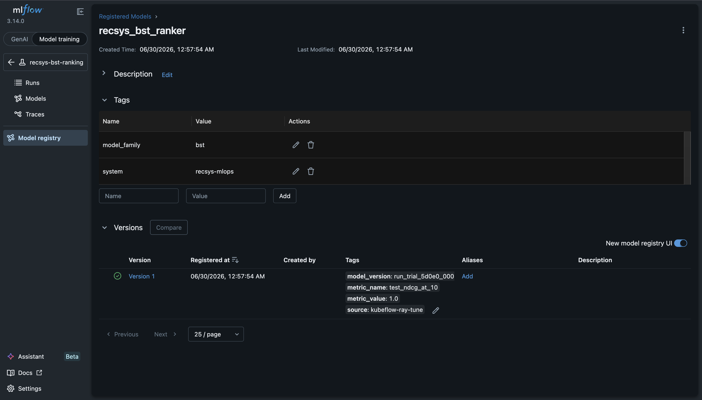
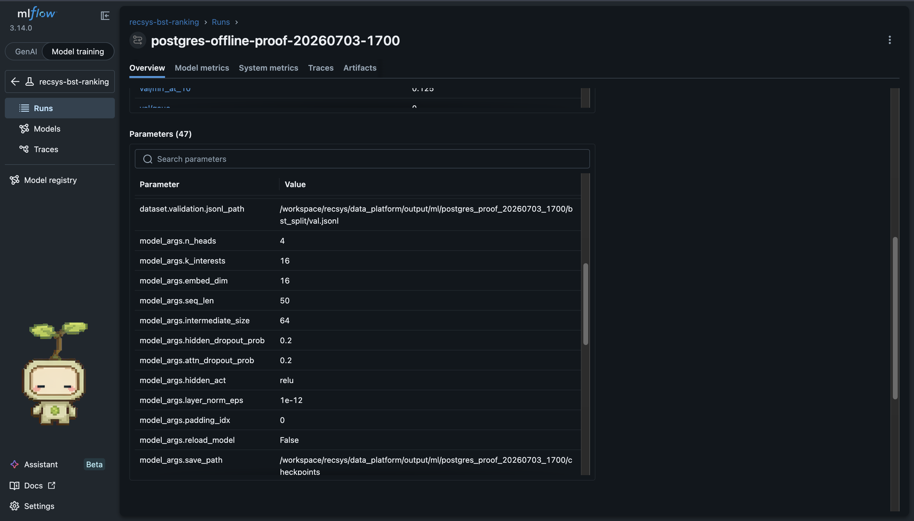
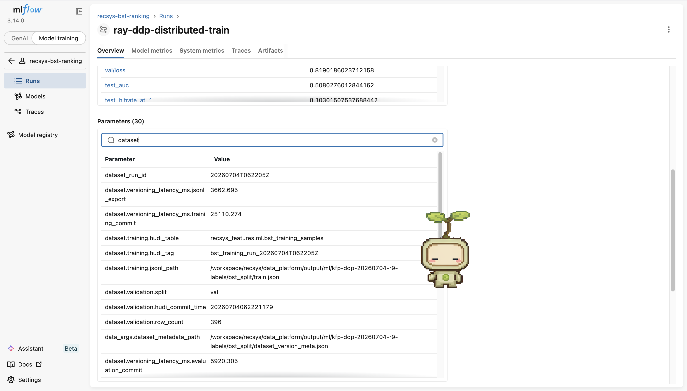
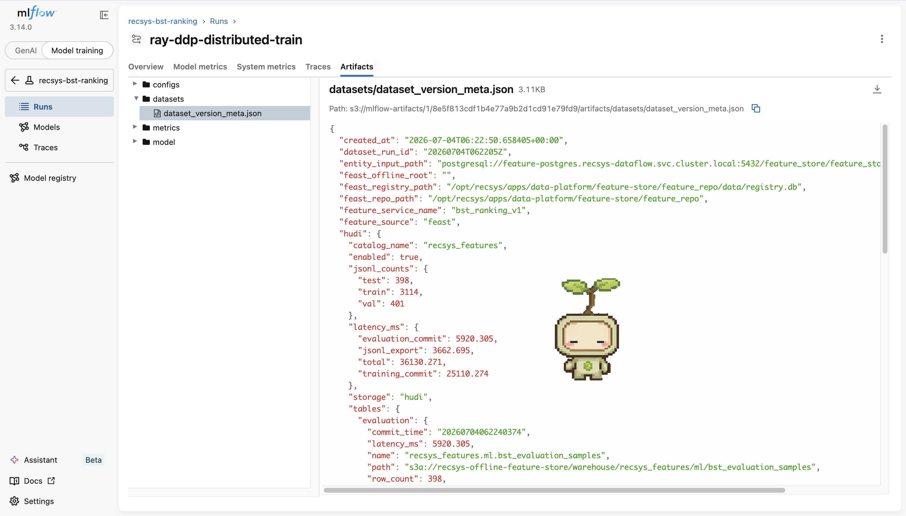
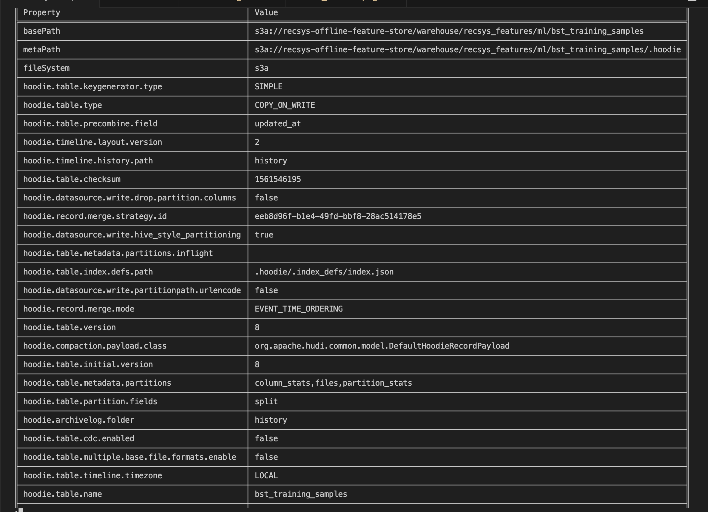
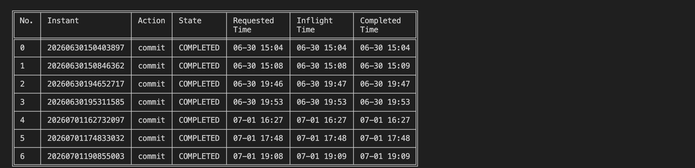
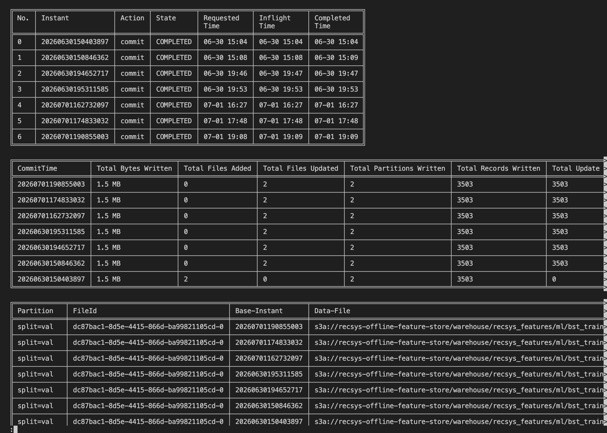

# Versioning

## Model Versioning

### Code reference

- [train.py (line 25)](../../../apps/ml-system/src/training/train.py#L25), [train.py (line 146)](../../../apps/ml-system/src/training/train.py#L146): MLflow parameters, metrics, checkpoint, config, and dataset lineage.
- [ray_tune_train_bst.py (line 136)](../../../apps/ml-system/src/training/ray_tune_train_bst.py#L136), [ray_tune_train_bst.py (line 271)](../../../apps/ml-system/src/training/ray_tune_train_bst.py#L271): best-trial checkpoint, metrics, hyperparameters, and MLflow identifiers.
- [model_registry.py (line 8)](../../../apps/ml-system/src/registry/model_registry.py#L8), [model_registry.py (line 68)](../../../apps/ml-system/src/registry/model_registry.py#L68): PostgreSQL model metadata schema and writes.
- [model_promotion.py (line 405)](../../../apps/ml-system/src/registry/model_promotion.py#L405), [model_promotion.py (line 666)](../../../apps/ml-system/src/registry/model_promotion.py#L666): versioned Triton export, MLflow model version, promotion manifest, and serving metadata.

### Image proof



**Figure 1 - MLflow registered model UI.** Caption: the MLflow Model Registry shows `recsys_bst_ranker` with model-level tags (`model_family=bst`, `system=recsys-mlops`) and a concrete registered version. The version row carries tags such as `model_version`, `metric_name`, `metric_value`, and `source=kubeflow-ray-tune`, proving that the trained checkpoint is tracked as a versioned model artifact.


**Figure 2 - Kubeflow promotion manifest UI.** Caption: the Kubeflow Pipelines graph shows the `promote-bst-model` step completed successfully, and the log panel contains the promotion manifest fields (`model_name`, `model_version`, `mlflow_run_id`, `source_checkpoint_uri`, `triton_storage_uri`, `serving_storage_uri`, and `promotion_manifest_uri`). This proves that the chosen model version is packaged for Triton serving and linked back to the training lineage.



**Figure 3 - MLflow model parameters UI.** Caption: the MLflow training run stores flattened model/training configuration in the Parameters table. The screenshot shows model hyperparameters such as `model_args.n_heads`, `model_args.k_interests`, `model_args.embed_dim`, `model_args.seq_len`, `model_args.hidden_dropout_prob`, `model_args.attn_dropout_prob`, and `model_args.hidden_act`, which proves the hyperparameter side of **MODEL (weight, hyperparam)** versioning.

## Data Versioning

### Code reference

- [prepare_bst_training_data.py (line 654)](../../../apps/ml-system/src/cli/prepare_bst_training_data.py#L654), [prepare_bst_training_data.py (line 733)](../../../apps/ml-system/src/cli/prepare_bst_training_data.py#L733): builds version metadata and commits prepared splits when Hudi versioning is enabled.
- [dataset_versioning.py (line 142)](../../../apps/ml-system/src/lineage/dataset_versioning.py#L142), [dataset_versioning.py (line 216)](../../../apps/ml-system/src/lineage/dataset_versioning.py#L216): stable sample identity and row hashing; [dataset_versioning.py (line 352)](../../../apps/ml-system/src/lineage/dataset_versioning.py#L352), [dataset_versioning.py (line 475)](../../../apps/ml-system/src/lineage/dataset_versioning.py#L475).
- [mlflow_dataset_lineage.py (line 8)](../../../apps/ml-system/src/lineage/mlflow_dataset_lineage.py#L8), [mlflow_dataset_lineage.py (line 48)](../../../apps/ml-system/src/lineage/mlflow_dataset_lineage.py#L48): logs dataset version fields and the full manifest to MLflow.
- [hudi-cli-data-versioning-proof.yaml (line 1)](../../../infra/k8s/hudi-cli-data-versioning-proof.yaml#L1), [hudi-cli-data-versioning-proof.yaml (line 130)](../../../infra/k8s/hudi-cli-data-versioning-proof.yaml#L130): reproducible Hudi CLI inspection pod.

### Apache Hudi incremental versioning flow

This project uses Apache Hudi for incremental dataset versioning. The flow is: Feast/PostgreSQL offline features are converted into BST train/validation/test samples, each sample gets a stable `sample_id` plus a `row_hash`, then Apache Hudi writes the samples with Copy-on-Write `upsert`. The Hudi record key is `sample_id`, the precombine field is `updated_at`, and the split column partitions the data. After each write, the pipeline records the Hudi table path, latest commit time, snapshot ID, split tag, and row count into `dataset_version_meta.json`; MLflow then logs the same metadata as parameters and as a durable artifact.

Hudi proof is captured with Hudi CLI by connecting directly to the Hudi table path and showing the active commit timeline. The CLI proof includes the table connection banner, `desc` output with `COPY_ON_WRITE`, `sample_id` record key, `updated_at` precombine field, and `split` partition field, plus `commits show` / `show fsview all` output showing commit instants and the versioned parquet file slices written by each incremental Hudi upsert.

**Proof pod note:** the Hudi CLI proof is now reproducible from the reusable Kubernetes manifest [hudi-cli-data-versioning-proof.yaml (line 1)](../../../infra/k8s/hudi-cli-data-versioning-proof.yaml#L1), [hudi-cli-data-versioning-proof.yaml (line 130)](../../../infra/k8s/hudi-cli-data-versioning-proof.yaml#L130). The manifest creates the fixed pod name `hudi-cli-data-versioning-proof` in namespace `recsys-dataflow`, mounts `recsys-data-platform-config` and `recsys-data-platform-secret`, connects to `s3a://recsys-offline-feature-store/warehouse/recsys_features/ml/bst_training_samples`, and prints `desc`, `commits show`, and `show fsview all` to pod logs. The pod is intentionally a one-shot `Pod` instead of a `Job`, so the screenshot command stays stable. To refresh and capture the proof again, run:

```bash
kubectl delete pod -n recsys-dataflow hudi-cli-data-versioning-proof --ignore-not-found
kubectl apply -f infra/k8s/hudi-cli-data-versioning-proof.yaml
kubectl logs -n recsys-dataflow hudi-cli-data-versioning-proof | less -S
```

In Hudi, a **file slice** is the concrete data-file version for a Hudi file group at a specific commit instant. For this Copy-on-Write table, each file slice points to a Parquet base file. When the same `FileId` appears across multiple `Base-Instant` values, it proves Hudi preserved incremental versions for the same logical file group instead of replacing the whole table.

### Image proof



**Figure 4 - MLflow dataset version parameters.** Caption: the MLflow run page is filtered by `dataset` parameters and shows `dataset_run_id`, Hudi table names, Hudi commit times, split tags, row counts, JSONL paths, and versioning latency. This proves that the training run is tied to an exact Apache Hudi dataset snapshot.



**Figure 5 - MLflow dataset version manifest artifact.** Caption: the MLflow Artifacts tab opens `datasets/dataset_version_meta.json`, which persists the complete Apache Hudi lineage manifest: `storage=hudi`, catalog, warehouse path, train/validation/test row counts, Hudi table paths, commit times, snapshot IDs, and tags. This is the durable proof object that connects a model run to the exact incremental data version used for training and evaluation.



**Figure 6 - Hudi CLI table metadata and storage layout.** Caption: the Hudi CLI starts inside the proof pod, loads metadata for `bst_training_samples`, and prints the table `desc` output. The important fields are `basePath`, which points to the versioned training sample table in `s3a://recsys-offline-feature-store/warehouse/recsys_features/ml/bst_training_samples`; `metaPath`, which points to the `.hoodie` metadata directory; `fileSystem=s3a`, proving the table is stored in the MinIO/S3-compatible offline feature store; `hoodie.table.type=COPY_ON_WRITE`, proving Hudi stores committed parquet versions; and `hoodie.table.precombine.field=updated_at`, proving Hudi resolves repeated upserts for the same sample by the latest update timestamp.



**Figure 7 - Hudi active timeline.** Caption: the Hudi CLI timeline lists completed `commit` instants from `20260630150403897` through `20260701190855003`. Each `COMPLETED` row is one successful dataset version written to the active Hudi timeline, with requested, inflight, and completed timestamps proving that each version finished cleanly.



**Figure 8 - Hudi commit write stats and file slices.** Caption: the upper table is `commits show`: each `CommitTime` records one dataset version, `Total Bytes Written` is about `1.5 MB`, `Total Partitions Written=2` proves both `split=train` and `split=val` were written, and `Total Records Written=3503` proves the exact training/validation sample count in each version. The first commit adds two files, while later commits update two files and write `3503` update records, showing incremental upsert behavior. The lower `show fsview all` table maps partitions and `FileId`s to `Base-Instant` values and parquet `Data-File` paths.

**Where incremental versioning is shown in Figure 8:** incremental versioning is shown in two places. First, in the `commits show` table, the initial commit `20260630150403897` has `Total Files Added=2` and `Total Files Updated=0`, while later commits have `Total Files Added=0`, `Total Files Updated=2`, and `Total Update Records Written=3503`. This means later dataset versions update existing Hudi file groups instead of creating a full new table copy. Second, in the `show fsview all` table, the same `FileId` appears multiple times with different `Base-Instant` values and different parquet `Data-File` paths. That is the storage-level proof that Hudi keeps incremental versions over time.

**File slice explanation for Figure 8:** a Hudi file slice is one physical data-file version inside a Hudi file group at one commit instant. In this proof, the same `FileId` appears repeatedly for `split=val` and `split=train`, but each row has a different `Base-Instant`. That means Hudi kept multiple incremental versions of the same logical file group instead of replacing the whole table. The `Data-File` path also embeds the commit instant, so each parquet file can be traced back to the exact dataset version that produced it.
