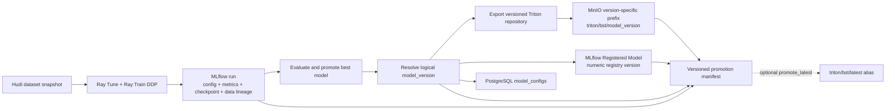

# Versioning

## Model Versioning

### Versioning flow



1. Training logs the exact config, metrics, checkpoint and Hudi dataset lineage into one MLflow run. The resulting `mlflow_run_id` and artifact URI identify the source model. See [MLflow run logging](../../../apps/ml-system/src/training/train.py#L25) and [dataset-lineage logging](../../../apps/ml-system/src/lineage/mlflow_dataset_lineage.py#L34).
2. Promotion resolves the logical version from `--model-version`, `MODEL_VERSION`, the Ray best-trial name, or a UTC timestamp. This is the version exposed to serving. See [logical version resolution](../../../apps/ml-system/src/registry/model_promotion.py#L592).
3. The checkpoint is exported to a Triton repository and uploaded to the version-specific `triton/bst/<model_version>` prefix. `latest` is only updated when `--promote-latest` is explicitly enabled. See [Triton repository export](../../../apps/ml-system/src/registry/model_promotion.py#L595) and [version/latest uploads](../../../apps/ml-system/src/registry/model_promotion.py#L639).
4. MLflow creates its own numeric Registered Model version and stores the logical `model_version`, metric and promotion-manifest URI as tags. PostgreSQL inserts the same logical version with its config, metrics, MLflow run and serving URIs. See [MLflow model registration](../../../apps/ml-system/src/registry/model_promotion.py#L511), [promotion registry write](../../../apps/ml-system/src/registry/model_promotion.py#L646) and [PostgreSQL schema/insert](../../../apps/ml-system/src/registry/model_registry.py#L8).
5. The promotion manifest joins all identifiers, so a serving version can be traced back to its checkpoint, MLflow run, training configuration and dataset commits. See [manifest construction](../../../apps/ml-system/src/registry/model_promotion.py#L471) and [manifest persistence](../../../apps/ml-system/src/registry/model_promotion.py#L636).

### Reference code

Training first persists the reproducibility bundle in MLflow ([source](../../../apps/ml-system/src/training/train.py#L25)):

```python
with mlflow.start_run(run_name=os.getenv("MLFLOW_RUN_NAME", "bst-training")) as run:
    log_dataset_lineage(mlflow, dataset_metadata, {"train": "training", "val": "validation"})
    for name, value in _flatten("", config).items():
        if isinstance(value, (str, int, float, bool)) or value is None:
            mlflow.log_param(name, value)
    for name, value in metrics.items():
        if isinstance(value, (int, float)):
            mlflow.log_metric(_mlflow_metric_name(name), float(value))
    if checkpoint_path and Path(checkpoint_path).exists():
        mlflow.log_artifact(checkpoint_path, artifact_path="model")
    artifact_uri = mlflow.get_artifact_uri("model")
```

Promotion then assigns the logical version and creates version-specific storage and manifest paths ([source](../../../apps/ml-system/src/registry/model_promotion.py#L592)):

```python
version = model_version or os.getenv("MODEL_VERSION") or best_payload.get("best_trial_name")
if not version:
    version = datetime.now(timezone.utc).strftime("%Y%m%d%H%M%S")

storage_prefix = f"triton/bst/{version}"
triton_uri = s3_uri(model_bucket, storage_prefix)
manifest_uri = s3_uri(model_bucket, f"promotions/bst/{version}.json")
```

Finally, the same version is registered in MLflow and PostgreSQL ([MLflow source](../../../apps/ml-system/src/registry/model_promotion.py#L511), [PostgreSQL source](../../../apps/ml-system/src/registry/model_promotion.py#L646)):

```python
version_tags = {
    "model_version": model_version,
    "metric_name": metric_name,
    "metric_value": str(metric_value),
    "source": source_tag,
}
created = client.create_model_version(
    name=registered_model_name,
    source=source_uri,
    run_id=run_id,
    tags=version_tags,
)

register_model_config(
    postgres_uri=postgres_uri,
    model_name=MODEL_NAME,
    model_version=version,
    artifact_uri=triton_uri,
    mlflow_run_id=best_payload.get("mlflow_run_id"),
    metrics={manifest["metric_name"]: manifest["metric_value"]},
    config=config,
    serving_artifact_uri=serving_uri,
    promotion_manifest_uri=manifest_uri,
)
```

### Code reference

- [train.py (line 25)](../../../apps/ml-system/src/training/train.py#L25), [train.py (line 54)](../../../apps/ml-system/src/training/train.py#L54): MLflow reproducibility bundle and initial PostgreSQL registry write.
- [ray_tune_train_bst.py (line 207)](../../../apps/ml-system/src/training/ray_tune_train_bst.py#L207), [ray_tune_train_bst.py (line 330)](../../../apps/ml-system/src/training/ray_tune_train_bst.py#L330): per-trial training and best-result selection.
- [model_registry.py (line 8)](../../../apps/ml-system/src/registry/model_registry.py#L8), [model_registry.py (line 68)](../../../apps/ml-system/src/registry/model_registry.py#L68): PostgreSQL model metadata schema and writes.
- [model_promotion.py (line 405)](../../../apps/ml-system/src/registry/model_promotion.py#L405), [model_promotion.py (line 471)](../../../apps/ml-system/src/registry/model_promotion.py#L471), [model_promotion.py (line 511)](../../../apps/ml-system/src/registry/model_promotion.py#L511), [model_promotion.py (line 563)](../../../apps/ml-system/src/registry/model_promotion.py#L563): Triton export, manifest, MLflow registration and end-to-end promotion.

### Image proof


**Figure 1 - MLflow registered model UI.** Caption: the MLflow Model Registry shows `recsys_bst_ranker` with model-level tags (`model_family=bst`, `system=recsys-mlops`) and a concrete registered version. The version row carries tags such as `model_version`, `metric_name`, `metric_value`, and `source=kubeflow-ray-tune`, proving that the trained checkpoint is tracked as a versioned model artifact.


**Figure 2 - Kubeflow promotion manifest UI.** Caption: the Kubeflow Pipelines graph shows the `promote-bst-model` step completed successfully, and the log panel contains the promotion manifest fields (`model_name`, `model_version`, `mlflow_run_id`, `source_checkpoint_uri`, `triton_storage_uri`, `serving_storage_uri`, and `promotion_manifest_uri`). This proves that the chosen model version is packaged for Triton serving and linked back to the training lineage.


**Figure 3 - MLflow model parameters UI.** Caption: the MLflow training run stores flattened model/training configuration in the Parameters table. The screenshot shows model hyperparameters such as `model_args.n_heads`, `model_args.k_interests`, `model_args.embed_dim`, `model_args.seq_len`, `model_args.hidden_dropout_prob`, `model_args.attn_dropout_prob`, and `model_args.hidden_act`, which proves the hyperparameter side of **MODEL (weight, hyperparam)** versioning.

## Data Versioning

### Apache Hudi versioning flow

```mermaid
flowchart LR
    Feast["Feast/PostgreSQL offline features"] --> Split["Temporal train/val/test split"]
    Split --> Identity["sample_id + row_hash<br/>dataset_run_id + Git SHA"]
    Identity --> ChangeFilter["Left-anti join latest snapshot<br/>skip unchanged rows"]
    ChangeFilter --> TrainTable["Hudi COW training table<br/>split=train,val"]
    ChangeFilter --> EvalTable["Hudi COW evaluation table<br/>split=test"]
    TrainTable --> TrainCommit["Training-table commit instant"]
    EvalTable --> EvalCommit["Evaluation-table commit instant"]
    TrainCommit --> Snapshot["Latest committed snapshots"]
    EvalCommit --> Snapshot
    Snapshot --> JSONL["Deterministic JSONL export"]
    TrainCommit --> Metadata["dataset_version_meta.json"]
    EvalCommit --> Metadata
    JSONL --> Ray["Ray training/evaluation"]
    Metadata --> Ray
    Ray --> MLflow["MLflow dataset lineage"]
```



1. The preparation job reads point-in-time features and creates temporal `train`, `val` and `test` splits. See [offline read and temporal split](../../../apps/ml-system/src/cli/prepare_bst_training_data.py#L687).
2. Every logical sample receives a deterministic `sample_id`; its feature contents receive a `row_hash`. The row also carries `dataset_run_id`, feature-service version and processing Git SHA. See [stable sample identity](../../../apps/ml-system/src/lineage/dataset_versioning.py#L150), [row hashing](../../../apps/ml-system/src/lineage/dataset_versioning.py#L164) and [versioned sample construction](../../../apps/ml-system/src/lineage/dataset_versioning.py#L174).
3. Before writing, Spark left-anti joins incoming rows against the latest Hudi snapshot on `sample_id`, `row_hash` and `split`. Exact matches are skipped; new samples, changed hashes and split moves continue to the writer. A missing table is treated as the initial load. See [unchanged-row filtering](../../../apps/ml-system/src/lineage/dataset_versioning.py#L371).
4. Spark writes only changed `train/val` rows to `bst_training_samples` and changed `test` rows to `bst_evaluation_samples` using Hudi Copy-on-Write `upsert`. `sample_id` is the record key, `updated_at` chooses the newest duplicate and `split` is the partition path. See [Hudi write options](../../../apps/ml-system/src/lineage/dataset_versioning.py#L352) and [filtered table upsert](../../../apps/ml-system/src/lineage/dataset_versioning.py#L431).
5. Each non-empty changed set creates a commit instant in that Hudi table's timeline. A no-op set creates no commit and keeps the previous commit. Metadata records `input_rows`, `changed_rows`, `skipped_unchanged_rows` and `write_performed`, alongside the latest `commit_time`/`snapshot_id`. See [latest commit lookup](../../../apps/ml-system/src/lineage/dataset_versioning.py#L392) and [commit/change metadata](../../../apps/ml-system/src/lineage/dataset_versioning.py#L482).
6. The committed Hudi snapshot is read back and exported deterministically to `train.jsonl`, `val.jsonl` and `test.jsonl`. `dataset_version_meta.json` binds those files to table paths, commit instants, row counts, schema hash and processing version. See [Hudi-to-JSONL export](../../../apps/ml-system/src/lineage/dataset_versioning.py#L411), [split export calls](../../../apps/ml-system/src/lineage/dataset_versioning.py#L500) and [manifest creation](../../../apps/ml-system/src/cli/prepare_bst_training_data.py#L717).
7. Ray consumes the JSONL files and logs the manifest plus the exact Hudi commits to MLflow. This makes a model run reproducible against a specific committed dataset state. See [Ray DDP dataset paths](../../../apps/ml-system/src/training/ray_distributed_train_bst.py#L85), [DDP result lineage](../../../apps/ml-system/src/training/ray_distributed_train_bst.py#L283) and [MLflow dataset parameters/artifact](../../../apps/ml-system/src/lineage/mlflow_dataset_lineage.py#L34).

In this implementation, `snapshot_id` means the Hudi commit instant. The `tag` field such as `bst_training_<run_id>` is a lineage label stored in the manifest; the code does not create a Hudi timeline tag. The current reader loads the latest committed snapshot—historical time-travel or rollback would require an explicit Hudi `as.of.instant` read, which is not part of this flow yet.

### Reference code

Stable identity and content hashing make repeated runs upsert the same logical samples ([source](../../../apps/ml-system/src/lineage/dataset_versioning.py#L174)):

```python
record = {
    "sample_id": sample_id_for(normalized),
    "row_hash": row_hash_for(normalized),
    "dataset_run_id": dataset_run_id,
    "feature_service_version": feature_service_version,
    "processing_code_version": processing_code,
    "updated_at": now,
}
```

The latest snapshot removes unchanged rows before the Hudi writer ([source](../../../apps/ml-system/src/lineage/dataset_versioning.py#L371)):

```python
HUDI_CHANGE_IDENTITY_COLUMNS = ["sample_id", "row_hash", "split"]

existing = (
    _read_hudi_table(spark, table_path)
    .select(*HUDI_CHANGE_IDENTITY_COLUMNS)
    .dropDuplicates(HUDI_CHANGE_IDENTITY_COLUMNS)
)
changes = incoming.join(
    existing,
    on=HUDI_CHANGE_IDENTITY_COLUMNS,
    how="left_anti",
)
```

The Hudi write defines the versioning semantics and receives only `changes` ([options](../../../apps/ml-system/src/lineage/dataset_versioning.py#L352), [write](../../../apps/ml-system/src/lineage/dataset_versioning.py#L431)):

```python
def _hudi_options(table_name):
    return {
        "hoodie.datasource.write.table.type": "COPY_ON_WRITE",
        "hoodie.datasource.write.operation": "upsert",
        "hoodie.datasource.write.recordkey.field": "sample_id",
        "hoodie.datasource.write.precombine.field": "updated_at",
        "hoodie.datasource.write.partitionpath.field": "split",
    }

(
    changes.write.format("hudi")
    .options(**_hudi_options(table_name))
    .mode("append")
    .save(table_path)
)
```

After the commit, the pipeline captures the exact instant and change counters used by training ([source](../../../apps/ml-system/src/lineage/dataset_versioning.py#L482)):

```python
commit_time = _latest_commit_time(spark, table_path)

metadata["tables"][key] = {
    "name": table_ident,
    "path": table_path,
    "snapshot_id": commit_time,
    "commit_time": commit_time,
    "tag": tag_name,
    "row_count": _table_row_count(spark, table_path, split_values),
    "input_rows": input_rows,
    "changed_rows": changed_rows,
    "skipped_unchanged_rows": skipped_unchanged_rows,
    "write_performed": write_performed,
}
```

MLflow then attaches that version to the model run ([source](../../../apps/ml-system/src/lineage/mlflow_dataset_lineage.py#L34)):

```python
params = {
    f"dataset.{context}.hudi_table": payload.get("table", ""),
    f"dataset.{context}.hudi_commit_time": payload.get("commit_time") or payload.get("snapshot_id"),
    f"dataset.{context}.row_count": payload.get("row_count", 0),
}
for key, value in params.items():
    if value not in {None, ""}:
        mlflow.log_param(key, value)
mlflow.log_dict(metadata, "datasets/dataset_version_meta.json")
```

### Code reference

- [prepare_bst_training_data.py (line 654)](../../../apps/ml-system/src/cli/prepare_bst_training_data.py#L654), [prepare_bst_training_data.py (line 733)](../../../apps/ml-system/src/cli/prepare_bst_training_data.py#L733): builds version metadata and commits prepared splits when Hudi versioning is enabled.
- [dataset_versioning.py (line 142)](../../../apps/ml-system/src/lineage/dataset_versioning.py#L142), [dataset_versioning.py (line 216)](../../../apps/ml-system/src/lineage/dataset_versioning.py#L216): stable sample identity and row hashing; [dataset_versioning.py (line 352)](../../../apps/ml-system/src/lineage/dataset_versioning.py#L352), [dataset_versioning.py (line 371)](../../../apps/ml-system/src/lineage/dataset_versioning.py#L371), [dataset_versioning.py (line 431)](../../../apps/ml-system/src/lineage/dataset_versioning.py#L431): Hudi configuration, unchanged-row filtering and commit flow.
- [mlflow_dataset_lineage.py (line 8)](../../../apps/ml-system/src/lineage/mlflow_dataset_lineage.py#L8), [mlflow_dataset_lineage.py (line 48)](../../../apps/ml-system/src/lineage/mlflow_dataset_lineage.py#L48): logs dataset version fields and the full manifest to MLflow.
- [hudi-cli-data-versioning-proof.yaml (line 1)](../../../infra/k8s/hudi-cli-data-versioning-proof.yaml#L1), [hudi-cli-data-versioning-proof.yaml (line 130)](../../../infra/k8s/hudi-cli-data-versioning-proof.yaml#L130): reproducible Hudi CLI inspection pod.

Hudi proof is captured with Hudi CLI by connecting directly to the table path and showing the active commit timeline. `desc` verifies the Copy-on-Write table and key fields; `commits show` and `show fsview all` expose the commit instants and versioned Parquet file slices produced by the upserts.

**Proof pod note:** the Hudi CLI proof is now reproducible from the reusable Kubernetes manifest [hudi-cli-data-versioning-proof.yaml (line 1)](../../../infra/k8s/hudi-cli-data-versioning-proof.yaml#L1), [hudi-cli-data-versioning-proof.yaml (line 130)](../../../infra/k8s/hudi-cli-data-versioning-proof.yaml#L130). The manifest creates the fixed pod name `hudi-cli-data-versioning-proof` in namespace `recsys-dataflow`, mounts `recsys-data-platform-config` and `recsys-data-platform-secret`, connects to `s3a://recsys-offline-feature-store/warehouse/recsys_features/ml/bst_training_samples`, and prints `desc`, `commits show`, and `show fsview all` to pod logs. The pod is intentionally a one-shot `Pod` instead of a `Job`, so the screenshot command stays stable. To refresh and capture the proof again, run:

```bash
kubectl delete pod -n recsys-dataflow hudi-cli-data-versioning-proof --ignore-not-found
kubectl apply -f infra/k8s/hudi-cli-data-versioning-proof.yaml
kubectl logs -n recsys-dataflow hudi-cli-data-versioning-proof | less -S
```

In Hudi, a **file slice** is the concrete data-file version for a Hudi file group at a specific commit instant. For this Copy-on-Write table, each file slice points to a Parquet base file. When the same `FileId` appears across multiple `Base-Instant` values, it proves Hudi preserved incremental versions for the same logical file group instead of replacing the whole table.

### Image proof


**Figure 4 - MLflow dataset version parameters.** Caption: the MLflow run page is filtered by `dataset` parameters and shows `dataset_run_id`, Hudi table names, Hudi commit times, split tags, row counts, JSONL paths, and versioning latency. This proves that the training run is tied to an exact Apache Hudi dataset snapshot.


**Figure 5 - MLflow dataset version manifest artifact.** Caption: the MLflow Artifacts tab opens `datasets/dataset_version_meta.json`, which persists the complete Apache Hudi lineage manifest: `storage=hudi`, catalog, warehouse path, train/validation/test row counts, Hudi table paths, commit times, snapshot IDs, and tags. This is the durable proof object that connects a model run to the exact incremental data version used for training and evaluation.


**Figure 6 - Hudi CLI table metadata and storage layout.** Caption: the Hudi CLI starts inside the proof pod, loads metadata for `bst_training_samples`, and prints the table `desc` output. The important fields are `basePath`, which points to the versioned training sample table in `s3a://recsys-offline-feature-store/warehouse/recsys_features/ml/bst_training_samples`; `metaPath`, which points to the `.hoodie` metadata directory; `fileSystem=s3a`, proving the table is stored in the MinIO/S3-compatible offline feature store; `hoodie.table.type=COPY_ON_WRITE`, proving Hudi stores committed parquet versions; and `hoodie.table.precombine.field=updated_at`, proving Hudi resolves repeated upserts for the same sample by the latest update timestamp.


**Figure 7 - Hudi active timeline.** Caption: the Hudi CLI timeline lists completed `commit` instants from `20260630150403897` through `20260701190855003`. Each `COMPLETED` row is one successful dataset version written to the active Hudi timeline, with requested, inflight, and completed timestamps proving that each version finished cleanly.


**Figure 8 - Hudi commit write stats and file slices.** Caption: the upper table is `commits show`: each `CommitTime` records one dataset version, `Total Bytes Written` is about `1.5 MB`, `Total Partitions Written=2` proves both `split=train` and `split=val` were written, and `Total Records Written=3503` proves the exact training/validation sample count in each version. The first commit adds two files, while later commits update two files and write `3503` update records, showing incremental upsert behavior. The lower `show fsview all` table maps partitions and `FileId`s to `Base-Instant` values and parquet `Data-File` paths.

**Where incremental versioning is shown in Figure 8:** incremental versioning is shown in two places. First, in the `commits show` table, the initial commit `20260630150403897` has `Total Files Added=2` and `Total Files Updated=0`, while later commits have `Total Files Added=0`, `Total Files Updated=2`, and `Total Update Records Written=3503`. This means later dataset versions update existing Hudi file groups instead of creating a full new table copy. Second, in the `show fsview all` table, the same `FileId` appears multiple times with different `Base-Instant` values and different parquet `Data-File` paths. That is the storage-level proof that Hudi keeps incremental versions over time.

**File slice explanation for Figure 8:** a Hudi file slice is one physical data-file version inside a Hudi file group at one commit instant. In this proof, the same `FileId` appears repeatedly for `split=val` and `split=train`, but each row has a different `Base-Instant`. That means Hudi kept multiple incremental versions of the same logical file group instead of replacing the whole table. The `Data-File` path also embeds the commit instant, so each parquet file can be traced back to the exact dataset version that produced it.
