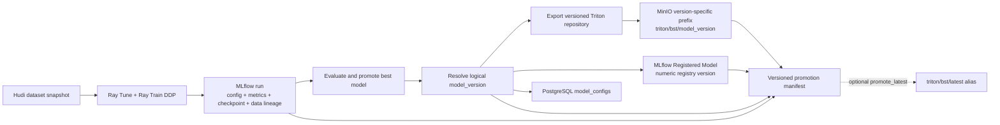
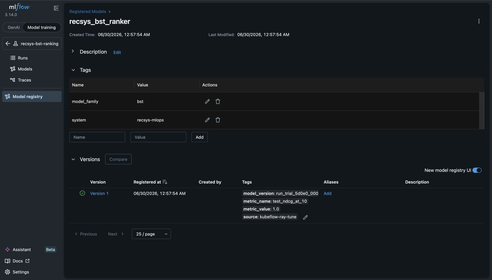
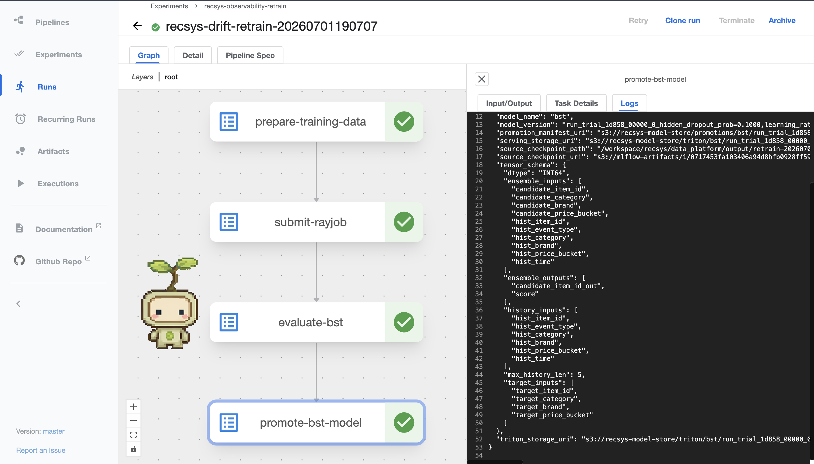
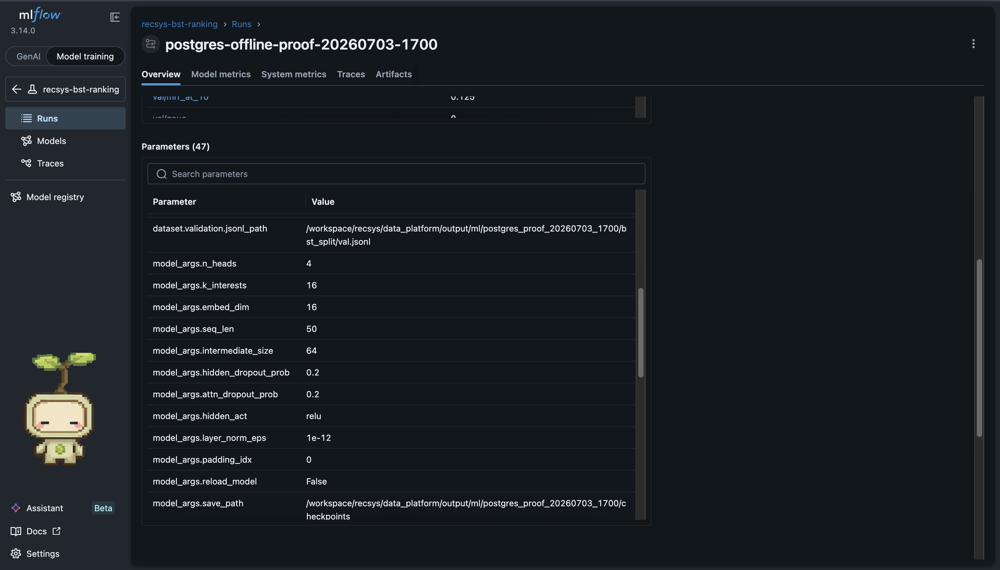
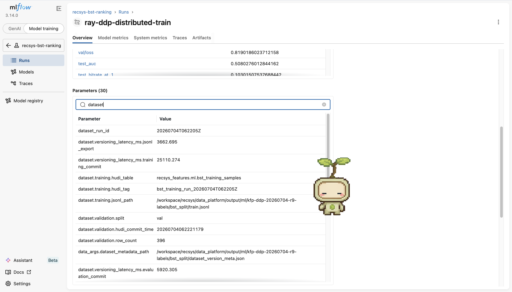
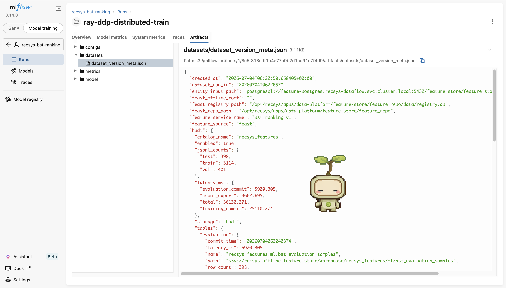
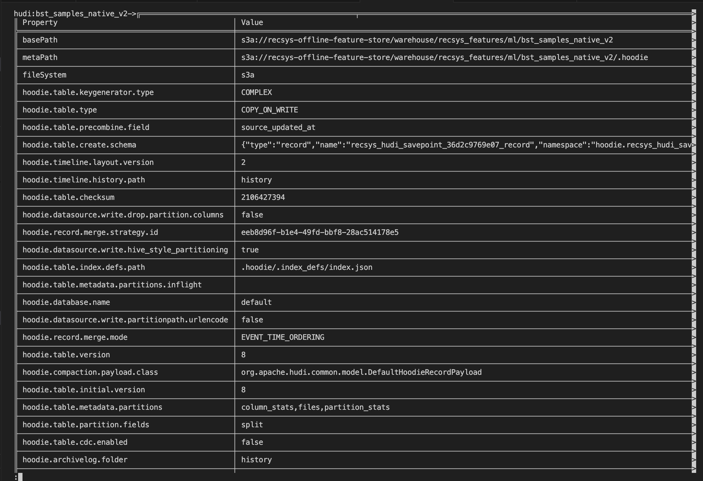
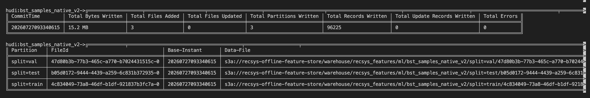

# Versioning

## Model Versioning

### Versioning flow


```mermaid
flowchart LR
    Dataset["Hudi dataset snapshot"] --> Train["Ray Tune + Ray Train DDP"]
    Train --> Run["MLflow run<br/>config + metrics + checkpoint + data lineage"]
    Run --> Promote["Evaluate and promote best model"]
    Promote --> Version["Resolve logical model_version"]
    Version --> Triton["Export versioned Triton repository"]
    Triton --> MinIO["MinIO version-specific prefix<br/>triton/bst/model_version"]
    Version --> MLflowRegistry["MLflow Registered Model<br/>numeric registry version"]
    Version --> Postgres["PostgreSQL model_configs"]
    Version --> Manifest["Versioned promotion manifest"]
    Run --> Manifest
    MinIO --> Manifest
    MLflowRegistry --> Manifest
    Manifest -.->|optional promote_latest| Latest["triton/bst/latest alias"]
```

1. Training logs the exact config, metrics, checkpoint and Hudi dataset lineage into one MLflow run. The resulting `mlflow_run_id` and artifact URI identify the source model. See [MLflow run logging](../../../apps/ml-system/src/training/train.py#L25) and [dataset-lineage logging](../../../apps/ml-system/src/lineage/mlflow_dataset_lineage.py#L34).
2. Promotion resolves the logical version from `--model-version`, `MODEL_VERSION`, the Ray best-trial name, or a UTC timestamp. This is the version exposed to serving. See [logical version resolution](../../../apps/ml-system/src/registry/model_promotion.py#L592).
3. The checkpoint is exported to a Triton repository and uploaded to the version-specific `triton/bst/<model_version>` prefix. `latest` is only updated when `--promote-latest` is explicitly enabled. See [Triton repository export](../../../apps/ml-system/src/registry/model_promotion.py#L595) and [version/latest uploads](../../../apps/ml-system/src/registry/model_promotion.py#L639).
4. MLflow creates its own numeric Registered Model version and stores the logical `model_version`, metric and promotion-manifest URI as tags. PostgreSQL inserts the same logical version with its config, metrics, MLflow run and serving URIs. See [MLflow model registration](../../../apps/ml-system/src/registry/model_promotion.py#L511), [promotion registry write](../../../apps/ml-system/src/registry/model_promotion.py#L646) and [PostgreSQL schema/insert](../../../apps/ml-system/src/registry/model_registry.py#L8).
5. The promotion manifest joins all identifiers, so a serving version can be traced back to its checkpoint, MLflow run, training configuration and dataset commits. See [manifest construction](../../../apps/ml-system/src/registry/model_promotion.py#L471) and [manifest persistence](../../../apps/ml-system/src/registry/model_promotion.py#L636).

### Reference code

Training first persists the reproducibility bundle in MLflow ([source](../../../apps/ml-system/src/training/train.py#L25)):

```python
with mlflow.start_run(run_name=os.getenv("MLFLOW_RUN_NAME", "bst-training")) as run:
    log_dataset_lineage(mlflow, dataset_metadata, {"train": "training", "val": "validation"})
    for name, value in _flatten("", config).items():
        if isinstance(value, (str, int, float, bool)) or value is None:
            mlflow.log_param(name, value)
    for name, value in metrics.items():
        if isinstance(value, (int, float)):
            mlflow.log_metric(_mlflow_metric_name(name), float(value))
    if checkpoint_path and Path(checkpoint_path).exists():
        mlflow.log_artifact(checkpoint_path, artifact_path="model")
    artifact_uri = mlflow.get_artifact_uri("model")
```

Promotion then assigns the logical version and creates version-specific storage and manifest paths ([source](../../../apps/ml-system/src/registry/model_promotion.py#L592)):

```python
version = model_version or os.getenv("MODEL_VERSION") or best_payload.get("best_trial_name")
if not version:
    version = datetime.now(timezone.utc).strftime("%Y%m%d%H%M%S")

storage_prefix = f"triton/bst/{version}"
triton_uri = s3_uri(model_bucket, storage_prefix)
manifest_uri = s3_uri(model_bucket, f"promotions/bst/{version}.json")
```

Finally, the same version is registered in MLflow and PostgreSQL ([MLflow source](../../../apps/ml-system/src/registry/model_promotion.py#L511), [PostgreSQL source](../../../apps/ml-system/src/registry/model_promotion.py#L646)):

```python
version_tags = {
    "model_version": model_version,
    "metric_name": metric_name,
    "metric_value": str(metric_value),
    "source": source_tag,
}
created = client.create_model_version(
    name=registered_model_name,
    source=source_uri,
    run_id=run_id,
    tags=version_tags,
)

register_model_config(
    postgres_uri=postgres_uri,
    model_name=MODEL_NAME,
    model_version=version,
    artifact_uri=triton_uri,
    mlflow_run_id=best_payload.get("mlflow_run_id"),
    metrics={manifest["metric_name"]: manifest["metric_value"]},
    config=config,
    serving_artifact_uri=serving_uri,
    promotion_manifest_uri=manifest_uri,
)
```

### Code reference

- [train.py (line 25)](../../../apps/ml-system/src/training/train.py#L25), [train.py (line 54)](../../../apps/ml-system/src/training/train.py#L54): MLflow reproducibility bundle and initial PostgreSQL registry write.
- [ray_tune_train_bst.py (line 207)](../../../apps/ml-system/src/training/ray_tune_train_bst.py#L207), [ray_tune_train_bst.py (line 330)](../../../apps/ml-system/src/training/ray_tune_train_bst.py#L330): per-trial training and best-result selection.
- [model_registry.py (line 8)](../../../apps/ml-system/src/registry/model_registry.py#L8), [model_registry.py (line 68)](../../../apps/ml-system/src/registry/model_registry.py#L68): PostgreSQL model metadata schema and writes.
- [model_promotion.py (line 405)](../../../apps/ml-system/src/registry/model_promotion.py#L405), [model_promotion.py (line 471)](../../../apps/ml-system/src/registry/model_promotion.py#L471), [model_promotion.py (line 511)](../../../apps/ml-system/src/registry/model_promotion.py#L511), [model_promotion.py (line 563)](../../../apps/ml-system/src/registry/model_promotion.py#L563): Triton export, manifest, MLflow registration and end-to-end promotion.

### Image proof



**Figure 1 - MLflow registered model UI.** Caption: the MLflow Model Registry shows `recsys_bst_ranker` with model-level tags (`model_family=bst`, `system=recsys-mlops`) and a concrete registered version. The version row carries tags such as `model_version`, `metric_name`, `metric_value`, and `source=kubeflow-ray-tune`, proving that the trained checkpoint is tracked as a versioned model artifact.



**Figure 2 - Kubeflow promotion manifest UI.** Caption: the Kubeflow Pipelines graph shows the `promote-bst-model` step completed successfully, and the log panel contains the promotion manifest fields (`model_name`, `model_version`, `mlflow_run_id`, `source_checkpoint_uri`, `triton_storage_uri`, `serving_storage_uri`, and `promotion_manifest_uri`). This proves that the chosen model version is packaged for Triton serving and linked back to the training lineage.



**Figure 3 - MLflow model parameters UI.** Caption: the MLflow training run stores flattened model/training configuration in the Parameters table. The screenshot shows model hyperparameters such as `model_args.n_heads`, `model_args.k_interests`, `model_args.embed_dim`, `model_args.seq_len`, `model_args.hidden_dropout_prob`, `model_args.attn_dropout_prob`, and `model_args.hidden_act`, which proves the hyperparameter side of **MODEL (weight, hyperparam)** versioning.

## Data Versioning

### Apache Hudi versioning flow


```mermaid
flowchart LR
    Feast["Feast/PostgreSQL offline features"] --> Split["Temporal train/val/test split"]
    Split --> Validate["Validate composite key<br/>(impression_id, target_item_id)"]
    Validate --> Diff["Left-anti key diff against latest snapshot<br/>create tombstones for missing keys"]
    Diff --> Upsert["One COW upsert<br/>train, val, test partitioned by split"]
    Upsert --> Commit["One COMPLETED Hudi commit instant"]
    Commit --> Snapshot["Time-travel read with as.of.instant"]
    Snapshot --> JSONL["Export train/val/test JSONL from the same instant"]
    Commit --> Metadata["dataset_version_meta.json<br/>table path + hudi_instant"]
    JSONL --> Ray["Ray training/evaluation"]
    Metadata --> Ray
    Ray --> MLflow["MLflow dataset lineage"]
    Ray --> Evaluate["Successful evaluation"]
    Evaluate --> Savepoint["Create idempotent Hudi savepoint"]
    Savepoint --> Promote["Promote model"]
```

1. The preparation job reads point-in-time features and creates temporal `train`, `val` and `test` splits. See [offline read and temporal split](../../../apps/ml-system/src/cli/prepare_bst_training_data.py#L687).
2. The full snapshot is validated with the native composite record key `(impression_id, target_item_id)`. Null or duplicate keys fail before any write. `dataset_run_id`, feature-service version and Git SHA are commit/manifest metadata instead of repeated row fields.
3. On an existing table, Spark left-anti joins the latest Hudi keys against the incoming keys. Missing keys become tombstones with `_hoodie_is_deleted=true`; all current rows go through the upsert. A key that moves between `train`, `val` and `test` is not deleted by this diff.
4. Spark writes the full current snapshot plus tombstones once to `recsys_features.ml.bst_samples_native_v2`. The table is Copy-on-Write, partitioned by `split`, and uses `GLOBAL_BLOOM` with partition-path updates so a moved key is removed from its old partition.
5. OCC uses the shared ZooKeeper lock and lazy failed-write cleaning. The prepare component retries three times with exponential backoff; each retry re-reads the latest snapshot and recomputes tombstones.
6. After `.save()`, the job scans the completed Hudi Timeline for commit metadata whose `recsys_dataset_run_id` matches the current run. That completed instant—not `max(_hoodie_commit_time)` from rows—is the dataset version.
7. The job reads `as.of.instant=<hudi_instant>` and exports all three JSONL files from that exact snapshot. Metadata and MLflow use one table path and one `hudi_instant`, while readers retain fallback support for legacy `commit_time` and `snapshot_id`.
8. After evaluation succeeds, the pipeline creates an idempotent savepoint for that instant. Promotion depends on this component, so savepoint failure prevents an unreproducible production model.

`hudi_instant` is now the canonical dataset-version field. Hudi Cleaner retains ordinary history for 90 days; savepoints protect the dataset versions attached to promoted models beyond normal cleaning.

### End-to-end execution proof — 27 July 2026

The production-like proof run started from the Airflow drift DAG and completed the complete chain:

```text
Airflow drift detection
  -> Kubeflow data preparation
  -> Apache Hudi native upsert and COMPLETED commit
  -> time-travel JSONL export
  -> Ray Tune
  -> two-worker Ray DDP training
  -> MLflow logging and evaluation
  -> Hudi savepoint
  -> MLflow model registration and KServe candidate handoff
```

| Stage | Captured proof |
|---|---|
| Airflow trigger | DAG `recsys_feature_drift_monitoring`, run `proof-hudi-native-v2-20260727-1630`; all three tasks succeeded. Evidently report `20260727092724` failed the drift gate because 8 of 26 numeric features exceeded the `0.15` threshold, so retraining was triggered. |
| Kubeflow | Workflow `recsys-bst-feature-train-evaluate-nb72z`, KFP run `ac9134bf-98ef-4810-9f7a-9631be648766`; status `Succeeded`, progress `15/15`, from `09:28:21Z` to `09:47:20Z`. |
| Hudi dataset version | Table `recsys_features.ml.bst_samples_native_v2`; operation `upsert`; completed instant `20260727093340615`; 96,225 input/upsert/snapshot records. The snapshot contains 76,980 train, 9,622 validation and 9,623 test records. |
| Hudi physical layout | Hudi CLI `1.0.2` reports `COPY_ON_WRITE`, key type `COMPLEX`, record key `impression_id,target_item_id`, precombine field `source_updated_at`, three files added, three partitions written, zero write errors and one Parquet base-file slice per split. |
| Ray Tune | RayJob `recsys-bst-ray-tune-retrain-2026072709-321a58e9` succeeded. MLflow tuning run `5a19ee644d3c4268a328ac55f01ac242` selected validation NDCG@10 `0.4723676566261042`. |
| Ray DDP | RayJob `recsys-bst-ray-ddp-retrain-20260727092-321a58e9` succeeded with `world_size=2`, two workers, `DistributedDataParallel`, synchronized gradients and distributed sampling. |
| Evaluation and MLflow | Training run `69145abaa79a44268483afeeee96f638` finished with validation NDCG@10 `0.32361081810694475` and test NDCG@10 `0.2669791210693565`. Its training, validation, testing and evaluation dataset parameters all reference Hudi instant `20260727093340615`; the full manifest is stored at `datasets/dataset_version_meta.json`. |
| Savepoint and promotion | Savepoint `20260727093340615` was created before promotion. MLflow registered `recsys_bst_ranker` version `5`, logical version `20260727094618`, from the same training run. KServe CD accepted the candidate handoff for the rollout watcher. |

The exact **data-versioning step** is the transition produced by the Hudi write:

```text
delta.write.format("hudi").operation("upsert").save(table_path)
                                      |
                                      v
20260727093340615.commit.requested
  -> 20260727093340615.inflight
  -> 20260727093340615_20260727093416466.commit  [COMPLETED]
                                      |
                                      v
dataset version = hudi_instant 20260727093340615
```

The dataset does not become a valid version merely when Spark starts writing. It becomes a valid version only when Hudi atomically marks the Timeline commit `COMPLETED`. All downstream stages then read `as.of.instant=20260727093340615`; therefore Ray and MLflow cannot silently move to a newer table snapshot during the same pipeline run.

The Hudi CLI output for this run is:

```text
hoodie.table.type              COPY_ON_WRITE
hoodie.table.keygenerator.type COMPLEX
hoodie.table.recordkey.fields  impression_id,target_item_id
hoodie.table.precombine.field  source_updated_at

CommitTime        Files Added  Files Updated  Partitions  Records  Errors
20260727093340615 3            0              3           96225    0

split=val    Base-Instant=20260727093340615  Base-File=2.0 MB
split=test   Base-Instant=20260727093340615  Base-File=2.1 MB
split=train  Base-Instant=20260727093340615  Base-File=11.1 MB
```

This was the initial commit to the new `native_v2` path, so `Files Added=3` and `Files Updated=0` are expected. Later runs use the same `upsert` operation: existing keys update their file groups, new keys insert, missing keys receive tombstones and keys that change split are moved by the global index.

Use these commands to recapture the live evidence:

```bash
kubectl exec -n recsys-dataflow deploy/airflow-scheduler -- \
  airflow tasks states-for-dag-run \
  recsys_feature_drift_monitoring proof-hudi-native-v2-20260727-1630

kubectl get workflow -n kubeflow \
  recsys-bst-feature-train-evaluate-nb72z

kubectl get rayjob -n kubeflow | grep 'retrain-2026072709'

kubectl logs -n recsys-dataflow \
  hudi-cli-data-versioning-proof | less -S
```

For MLflow screenshots, open run `69145abaa79a44268483afeeee96f638`, filter Parameters by `dataset`, and open artifact `datasets/dataset_version_meta.json`. For the model proof, open registered model `recsys_bst_ranker`, version `5`.

### Reference code

The native composite key and row-level delete marker define the Hudi records:

```python
record = {
    "impression_id": normalized["impression_id"],
    "target_item_id": normalized["target_item_id"],
    "split": split,
    "source_updated_at": prediction_timestamp,
    "_hoodie_is_deleted": False,
}
```

The latest snapshot is compared by key only to create tombstones for records that disappeared:

```python
current_keys = incoming.select("impression_id", "target_item_id").dropDuplicates()
deletes = (
    existing.join(
        current_keys,
        on=["impression_id", "target_item_id"],
        how="left_anti",
    )
    .withColumn("_hoodie_is_deleted", lit(True))
)
delta = incoming.unionByName(deletes)
```

The single native upsert defines the versioning semantics:

```python
(
    delta.write.format("hudi")
    .options(
        **{
            "hoodie.datasource.write.table.type": "COPY_ON_WRITE",
            "hoodie.datasource.write.operation": "upsert",
            "hoodie.datasource.write.recordkey.field": "impression_id,target_item_id",
            "hoodie.datasource.write.keygenerator.class":
                "org.apache.hudi.keygen.ComplexKeyGenerator",
            "hoodie.datasource.write.precombine.field": "source_updated_at",
            "hoodie.datasource.write.partitionpath.field": "split",
            "hoodie.index.type": "GLOBAL_BLOOM",
            "hoodie.bloom.index.update.partition.path": "true",
        }
    )
    .mode("append")
    .save(table_path)
)
```

After the commit, the pipeline resolves the current run from commit metadata and time-travels to that instant:

```python
hudi_instant = _completed_commit_for_run(spark, table_path, dataset_run_id)
snapshot = (
    spark.read.format("hudi")
    .option("as.of.instant", hudi_instant)
    .load(table_path)
)
```

MLflow attaches the same table and instant to training, validation and testing:

```python
params = {
    f"dataset.{context}.hudi_table": payload.get("table", ""),
    f"dataset.{context}.hudi_table_path": payload.get("table_path", ""),
    f"dataset.{context}.hudi_instant": payload.get("hudi_instant"),
    f"dataset.{context}.row_count": payload.get("row_count", 0),
}
for key, value in params.items():
    if value not in {None, ""}:
        mlflow.log_param(key, value)
mlflow.log_dict(metadata, "datasets/dataset_version_meta.json")
```

### Code reference

- [prepare_bst_training_data.py (line 654)](../../../apps/ml-system/src/cli/prepare_bst_training_data.py#L654), [prepare_bst_training_data.py (line 733)](../../../apps/ml-system/src/cli/prepare_bst_training_data.py#L733): builds version metadata and commits prepared splits when Hudi versioning is enabled.
- [dataset_versioning.py](../../../apps/ml-system/src/lineage/dataset_versioning.py): validates composite keys, computes delete tombstones, configures native upsert/OCC, resolves the completed Timeline instant and performs time-travel export.
- [mlflow_dataset_lineage.py (line 8)](../../../apps/ml-system/src/lineage/mlflow_dataset_lineage.py#L8), [mlflow_dataset_lineage.py (line 48)](../../../apps/ml-system/src/lineage/mlflow_dataset_lineage.py#L48): logs dataset version fields and the full manifest to MLflow.
- [create_hudi_savepoint.py](../../../apps/ml-system/src/cli/create_hudi_savepoint.py): creates and verifies the idempotent promotion savepoint.
- [hudi-cli-data-versioning-proof.yaml (line 1)](../../../infra/k8s/hudi-cli-data-versioning-proof.yaml#L1), [hudi-cli-data-versioning-proof.yaml (line 130)](../../../infra/k8s/hudi-cli-data-versioning-proof.yaml#L130): reproducible Hudi CLI inspection pod.

Hudi proof is captured with Hudi CLI by connecting directly to the table path and showing the active commit timeline. `desc` verifies the Copy-on-Write table and key fields; `commits show` and `show fsview all` expose the commit instants and versioned Parquet file slices produced by the upserts.

**Proof pod note:** the Hudi CLI proof is reproducible from the reusable Kubernetes manifest [hudi-cli-data-versioning-proof.yaml (line 1)](../../../infra/k8s/hudi-cli-data-versioning-proof.yaml#L1), [hudi-cli-data-versioning-proof.yaml (line 130)](../../../infra/k8s/hudi-cli-data-versioning-proof.yaml#L130). Point the proof pod at `s3a://recsys-offline-feature-store/warehouse/recsys_features/ml/bst_samples_native_v2`; it prints `desc`, `commits show`, and `show fsview all` to pod logs.

```bash
kubectl delete pod -n recsys-dataflow hudi-cli-data-versioning-proof --ignore-not-found
kubectl apply -f infra/k8s/hudi-cli-data-versioning-proof.yaml
kubectl logs -n recsys-dataflow hudi-cli-data-versioning-proof | less -S
```

In Hudi, a **file slice** is the concrete data-file version for a Hudi file group at a specific commit instant. For this Copy-on-Write table, each file slice points to a Parquet base file. When the same `FileId` appears across multiple `Base-Instant` values, it proves Hudi preserved incremental versions for the same logical file group instead of replacing the whole table.

### Image proof



**Figure 4 - MLflow dataset version parameters.** Caption: the MLflow run page is filtered by `dataset` parameters. For the current proof, training, validation, testing and evaluation must all show table `recsys_features.ml.bst_samples_native_v2` and `hudi_instant=20260727093340615`, with row counts `76980`, `9622`, `9623` and `9623`. This proves that every context is tied to the same completed Apache Hudi snapshot.



**Figure 5 - MLflow dataset version manifest artifact.** Caption: the MLflow Artifacts tab opens `datasets/dataset_version_meta.json`, which persists the complete Apache Hudi lineage manifest: `storage=hudi`, one table and table path, canonical `hudi_instant`, operation, input/upsert/delete/snapshot counts, split counts, dataset run ID, code version, schema hash and latency. Legacy `snapshot_id` is no longer manufactured for the native-v2 format. This durable object connects the model run to the exact dataset version used for training and evaluation.



**Figure 6 - Native-v2 Hudi table configuration.** The Hudi CLI is connected to `s3a://recsys-offline-feature-store/warehouse/recsys_features/ml/bst_samples_native_v2`, while `metaPath` points to the table's `.hoodie` metadata directory. `hoodie.table.type=COPY_ON_WRITE` means every completed write produces new Parquet base-file versions. `hoodie.table.keygenerator.type=COMPLEX` confirms that records use the composite key `(impression_id, target_item_id)`, rather than a custom hashed `sample_id`. `source_updated_at` is the precombine field, so when multiple records for the same key compete in an upsert, event-time ordering keeps the newest one. The `split` partition field stores train, validation and test in one table. `hoodie.table.version=8` is Hudi's internal table-format version; it is not the dataset version. The dataset version is the completed commit instant shown in Figure 7.



**Figure 7 - One completed Hudi dataset version and its file slices.** `CommitTime=20260727093340615` is the canonical dataset version used by the downstream Ray and MLflow runs. Hudi atomically committed `96,225` records across three partitions, wrote `15.2 MB`, added three files and reported zero write errors. `Total Files Updated=0` and `Total Update Records Written=0` are expected because this is the initial commit to the new native-v2 table path; subsequent upserts can update these file groups. The lower `show fsview all` output maps `split=val`, `split=test` and `split=train` to separate `FileId` values, but every row has the same `Base-Instant=20260727093340615`. This is storage-level proof that all three dataset splits belong to one atomic Hudi version rather than three independently versioned tables.

