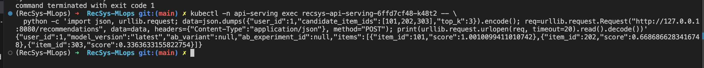

# Web API Model Prediction

This proof covers the recommendation API that combines online features and Triton inference.

The deployed service for this item is `recsys-api-serving`. It no longer reads Redis directly in the split-serving path. Instead, it calls `recsys-online-feature-api`, receives validated online features, builds the Triton payload, and sends the request to the KServe/Triton inference service.

## Runtime Flow

```text
Client
  -> recsys-api-serving POST /recommendations
  -> recsys-online-feature-api POST /online-features
  -> Redis online store
  -> recsys-api-serving builds Triton payload
  -> recsys-bst-triton gRPC inference
  -> ranked RecommendationResponse
```

Apache Iceberg remains the authoritative offline feature store for historical features and training data. Feast reads Iceberg-exported offline views for Kubeflow training preparation, while Redis remains the online store for low-latency serving features.

## Source Evidence

| Requirement | Evidence |
| --- | --- |
| FastAPI service | [apps/api-serving/src/inference_api.py](../../../apps/api-serving/src/inference_api.py) creates `RecSys API Serving`. |
| Pydantic request validation | [apps/api-serving/src/api_schemas.py](../../../apps/api-serving/src/api_schemas.py) defines `RecommendationRequest`. |
| Pydantic response validation | [apps/api-serving/src/api_schemas.py](../../../apps/api-serving/src/api_schemas.py) defines `RecommendationResponse`. |
| Async handler | [apps/api-serving/src/inference_api.py](../../../apps/api-serving/src/inference_api.py) exposes `async def recommendations(...)`. |
| Healthcheck for k8s | [apps/api-serving/src/inference_api.py](../../../apps/api-serving/src/inference_api.py) exposes `/healthz` and `/ready`. |
| Calls online feature service | [apps/api-serving/src/feature_service_client.py](../../../apps/api-serving/src/feature_service_client.py) uses async HTTP to call `recsys-online-feature-api`. |
| Builds Triton payload | [apps/api-serving/src/ranking.py](../../../apps/api-serving/src/ranking.py) converts online features into Triton tensors. |
| Calls Triton inference | [apps/api-serving/src/triton.py](../../../apps/api-serving/src/triton.py) calls Triton gRPC `infer(...)`. |
| A/B route support | [apps/api-serving/src/ab_testing.py](../../../apps/api-serving/src/ab_testing.py) routes requests to control or candidate Triton services. |
| Helm deployment | [infra/helm/recsys-serving/templates/api-deployment.yaml](../../../infra/helm/recsys-serving/templates/api-deployment.yaml) deploys `recsys-api-serving`. |

## Service Split

| Service | Responsibility | Endpoint |
| --- | --- | --- |
| `recsys-online-feature-api` | Pull online features from Feast Redis online store. | `POST /online-features` |
| `recsys-api-serving` | Compose online features, A/B route selection, Triton inference, ranked response. | `POST /recommendations` |
| `recsys-bst-triton` | Model inference engine served by KServe/Triton. | gRPC v2 inference |

## Recommendation E2E Command

```bash
kubectl -n api-serving exec deploy/recsys-api-serving -c api -- \
  python - <<'PY'
import json
import urllib.request

payload = json.dumps({
    "user_id": 1,
    "candidate_item_ids": [101, 202, 303, 404, 505],
    "top_k": 3,
}).encode()
request = urllib.request.Request(
    "http://127.0.0.1:8080/recommendations",
    data=payload,
    headers={"Content-Type": "application/json"},
    method="POST",
)
with urllib.request.urlopen(request, timeout=20) as response:
    print(response.read().decode())
PY
```

Expected output:

```json
{
  "user_id": 1,
  "model_version": "stable-001",
  "ab_variant": "control",
  "ab_experiment_id": "bst-stable-vs-candidate-20260630",
  "items": [
    {"item_id": 101, "score": 1.0010099411010742},
    {"item_id": 202, "score": 0.6686866283416748},
    {"item_id": 303, "score": 0.3363633155822754}
  ]
}
```

### Image proof



## Helm RollingUpdate And Fallback

```bash
kubectl -n api-serving describe deployment recsys-api-serving
```

The deployment uses:

| Capability | Helm field |
| --- | --- |
| Rolling update | `strategy.type: RollingUpdate` |
| No unavailable replicas during rollout | `rollingUpdate.maxUnavailable: 0` |
| Extra surge pod during rollout | `rollingUpdate.maxSurge: 1` |
| Startup probe | `/healthz` |
| Readiness probe | `/ready` |
| Liveness probe | `/healthz` |

Auto fallback is handled by the `recsys-serving` Helm release deploy command with `helm upgrade --install --atomic`. If the new recommendation API rollout fails, Helm rolls back the serving release, including both `recsys-api-serving` and `recsys-online-feature-api`.

### Image proof


