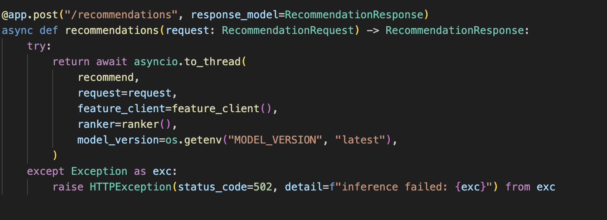
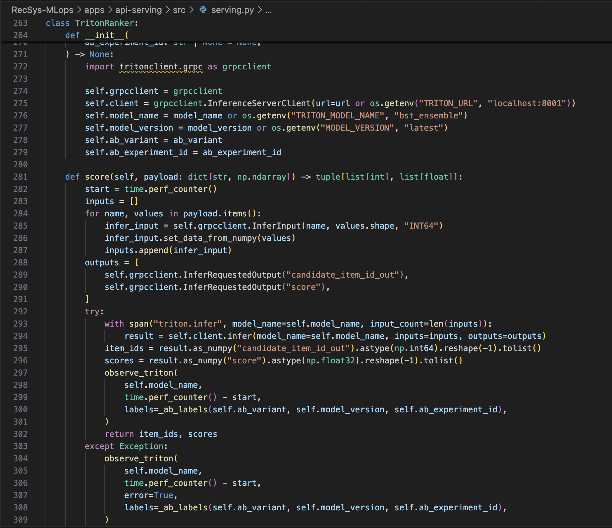

# Web API Model Prediction

This note captures only the source-code evidence for the Web API model prediction requirement:

- FastAPI prediction endpoint.
- Pydantic request/response validation.
- Async API handler.
- Online features sent to the ML inference engine.
- Triton model prediction call.
- Helm deployment with `RollingUpdate`, health checks, and auto fallback through `--atomic`.
- CLI commands to verify the evidence.

## 1. FastAPI Prediction Endpoint

Source: [apps/api-serving/src/main.py line 1](../../../apps/api-serving/src/main.py#1)

Lines to show:

- [apps/api-serving/src/main.py line 8](../../../apps/api-serving/src/main.py#8): imports `FastAPI`.
- [apps/api-serving/src/main.py line 22](../../../apps/api-serving/src/main.py#22): creates the FastAPI app.
- [apps/api-serving/src/main.py line 71-75](../../../apps/api-serving/src/main.py#71): initializes the Triton ranker/router from environment config.
- [apps/api-serving/src/main.py line 121](../../../apps/api-serving/src/main.py#121): exposes the prediction endpoint `POST /recommendations`.
- [apps/api-serving/src/main.py line 122-130](../../../apps/api-serving/src/main.py#122): runs the prediction flow and returns `RecommendationResponse`.

### Key Evidence


## 2. Pydantic Validation

Source: [apps/api-serving/src/serving.py line 1](../../../apps/api-serving/src/serving.py#1)

Lines to show:

- [apps/api-serving/src/serving.py line 11](../../../apps/api-serving/src/serving.py#11): imports `BaseModel` and `Field`.
- [apps/api-serving/src/serving.py line 35-38](../../../apps/api-serving/src/serving.py#35): validates `RecommendationRequest`.
- [apps/api-serving/src/serving.py line 41-51](../../../apps/api-serving/src/serving.py#41): defines prediction item and response schemas.

### Key Evidence


## 3. Async Prediction Function

Source: [apps/api-serving/src/main.py line 1](../../../apps/api-serving/src/main.py#1)

Lines to show:

- [apps/api-serving/src/main.py line 122](../../../apps/api-serving/src/main.py#122): `async def recommendations(...)`.
- [apps/api-serving/src/main.py line 124-130](../../../apps/api-serving/src/main.py#124): uses `await asyncio.to_thread(...)` so the FastAPI handler stays async while the blocking prediction flow runs in a worker thread.

### Key Evidence



## 4. Model Prediction Flow

Source: [apps/api-serving/src/serving.py line 1](../../../apps/api-serving/src/serving.py#1)

Lines to show:

- [apps/api-serving/src/serving.py line 407](../../../apps/api-serving/src/serving.py#407): `recommend(...)` starts the prediction flow.
- [apps/api-serving/src/serving.py line 413](../../../apps/api-serving/src/serving.py#413): selects the Triton route/model.
- [apps/api-serving/src/serving.py line 419](../../../apps/api-serving/src/serving.py#419): calls `_recommend_with_route(...)`.
- [apps/api-serving/src/serving.py line 449-455](../../../apps/api-serving/src/serving.py#449): pulls online features for the request user.
- [apps/api-serving/src/serving.py line 469-471](../../../apps/api-serving/src/serving.py#469): builds the Triton payload and scores it with `route.ranker.score(payload)`.
- [apps/api-serving/src/serving.py line 475-486](../../../apps/api-serving/src/serving.py#475): formats the top-k prediction response.

## 5. Triton Inference Engine

Source: [apps/api-serving/src/serving.py line 1](../../../apps/api-serving/src/serving.py#1)

Lines to show:

- [apps/api-serving/src/serving.py line 263](../../../apps/api-serving/src/serving.py#263): `TritonRanker`.
- [apps/api-serving/src/serving.py line 272-276](../../../apps/api-serving/src/serving.py#272): creates `tritonclient.grpc.InferenceServerClient`.
- [apps/api-serving/src/serving.py line 281-291](../../../apps/api-serving/src/serving.py#281): builds Triton input/output tensors.
- [apps/api-serving/src/serving.py line 293-296](../../../apps/api-serving/src/serving.py#293): calls `client.infer(...)` and reads prediction scores.



## 6. Triton Runtime Config

Source: [infra/helm/recsys-serving/templates/api-configmap.yaml line 1](../../../infra/helm/recsys-serving/templates/api-configmap.yaml#1)

Lines to show:

- [infra/helm/recsys-serving/templates/api-configmap.yaml line 7](../../../infra/helm/recsys-serving/templates/api-configmap.yaml#7): `TRITON_URL`.
- [infra/helm/recsys-serving/templates/api-configmap.yaml line 8](../../../infra/helm/recsys-serving/templates/api-configmap.yaml#8): `TRITON_MODEL_NAME`.
- [infra/helm/recsys-serving/templates/api-configmap.yaml line 12](../../../infra/helm/recsys-serving/templates/api-configmap.yaml#12): `MODEL_VERSION`.

#### Manual k8s curl command

```bash
kubectl run recsys-serving-e2e -n api-serving --rm -i --restart=Never \
  --image=curlimages/curl:8.10.1 -- \
  curl -fsS -X POST http://recsys-api-serving/recommendations \
  -H 'Content-Type: application/json' \
  -d '{"user_id":1,"top_k":5}'
```

## 8. Helm RollingUpdate + Healthcheck for K8s

Source: [infra/helm/recsys-serving/templates/api-deployment.yaml line 1](../../../infra/helm/recsys-serving/templates/api-deployment.yaml#1)

Lines to show:

- [infra/helm/recsys-serving/templates/api-deployment.yaml line 12-18](../../../infra/helm/recsys-serving/templates/api-deployment.yaml#12): `RollingUpdate` strategy.
- [infra/helm/recsys-serving/templates/api-deployment.yaml line 42-47](../../../infra/helm/recsys-serving/templates/api-deployment.yaml#42): startup probe on `/healthz`.
- [infra/helm/recsys-serving/templates/api-deployment.yaml line 49-55](../../../infra/helm/recsys-serving/templates/api-deployment.yaml#49): readiness probe on `/ready`.
- [infra/helm/recsys-serving/templates/api-deployment.yaml line 57-63](../../../infra/helm/recsys-serving/templates/api-deployment.yaml#57): liveness probe on `/healthz`.

### Evidence for Helm RollingUpdate + Healthcheck


## 9. Auto Fallback With Helm `--atomic`

#### Inside [jenkins/scripts/model_cd.py line 207](../../../jenkins/scripts/model_cd.py#207) & [Jenkinsfile line 141](../../../Jenkinsfile#141)

Note: fallback is applied to `api-serving` because `api-serving` is a resource inside the Helm release `recsys-serving`. This release is deployed with `helm upgrade --install --atomic`, so if the upgrade fails, Helm rolls back the entire release, including `recsys-api-serving`.

Source 1: [jenkins/scripts/model_cd.py line 207](../../../jenkins/scripts/model_cd.py#207)

Lines to show:

- [jenkins/scripts/model_cd.py line 207-230](../../../jenkins/scripts/model_cd.py#207): builds the Helm upgrade command.
- [jenkins/scripts/model_cd.py line 228](../../../jenkins/scripts/model_cd.py#228): includes `--atomic`.
- [jenkins/scripts/model_cd.py line 223-226](../../../jenkins/scripts/model_cd.py#223): includes the timeout.
- [Jenkinsfile line 141](../../../Jenkinsfile#141): runs deploy only when changed components should deploy.


