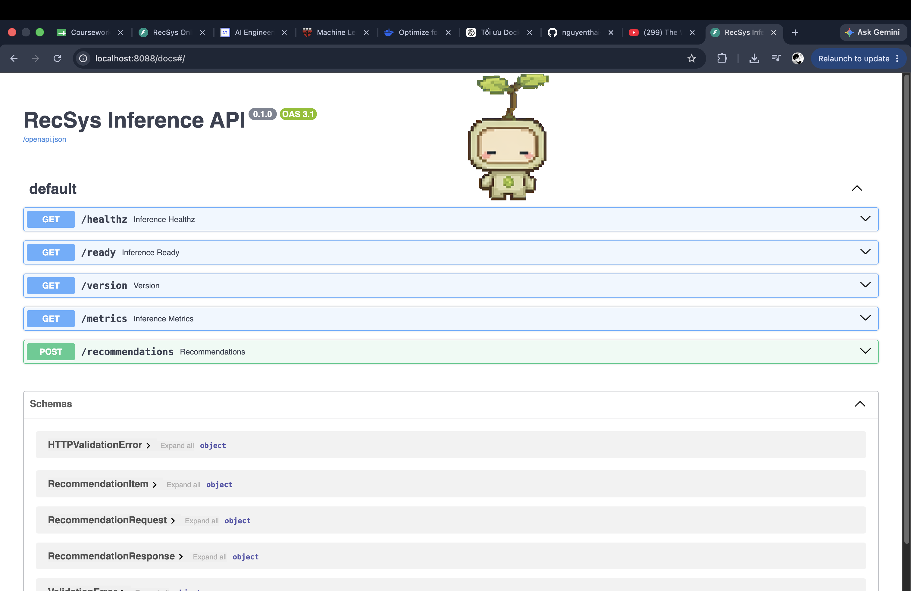
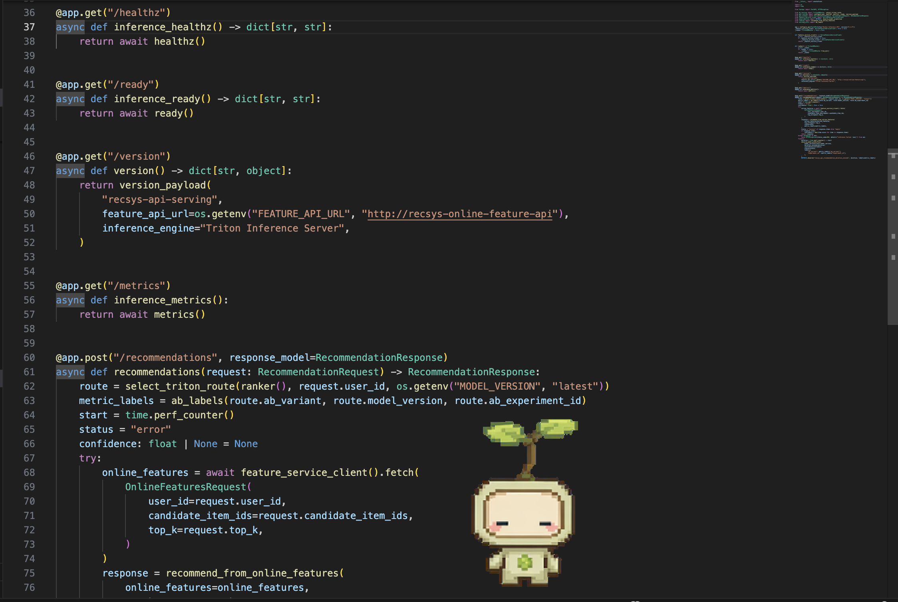
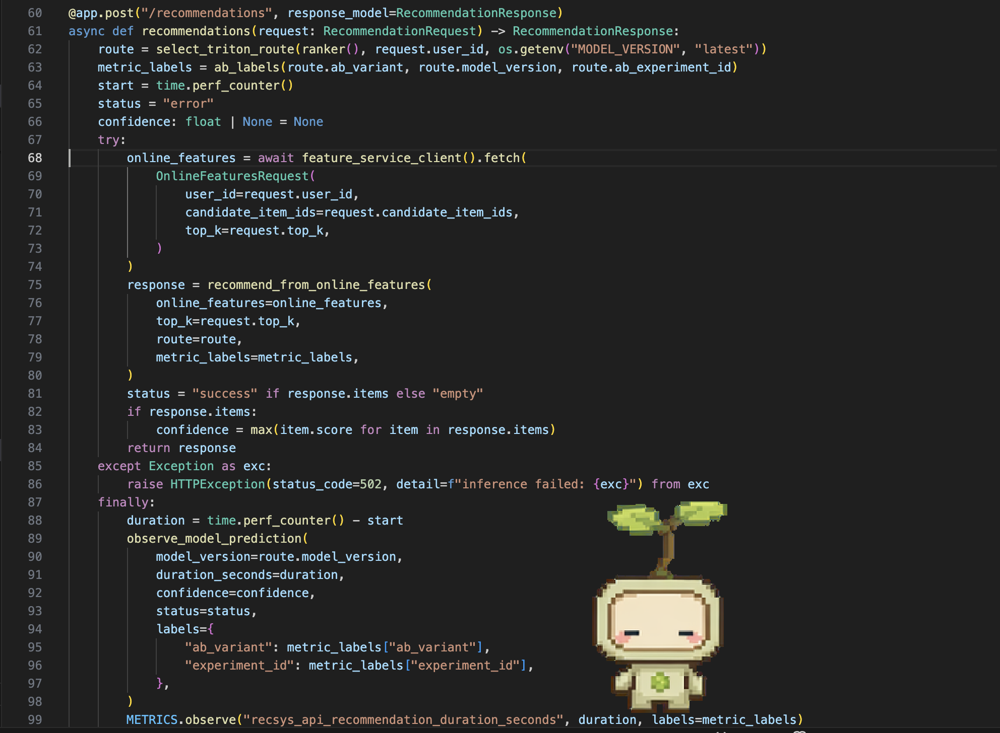
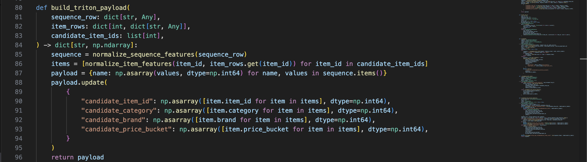
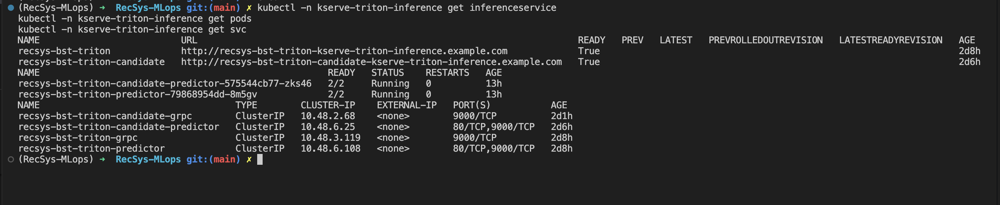
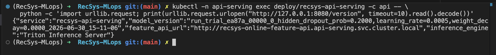
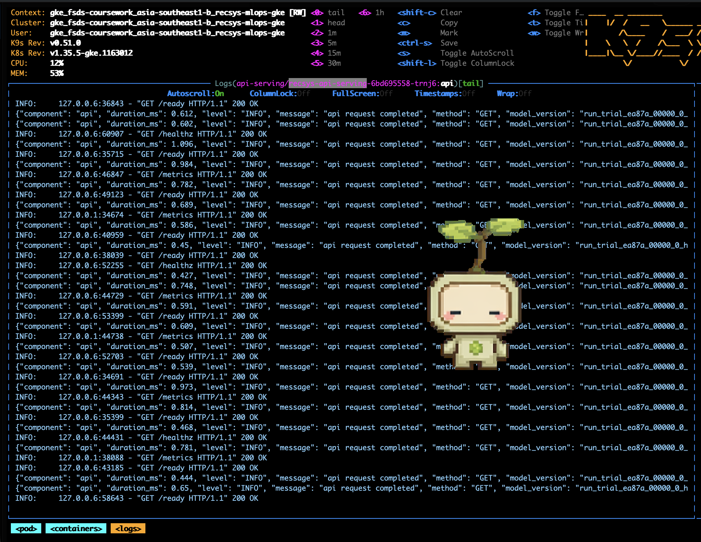

# Web API Model Prediction

This note captures the source-code and runtime evidence for the rubric item:

- Web API receives recommendation requests.
- The API uses FastAPI.
- Request and response schemas use Pydantic validation.
- API handlers are async.
- The API pulls online features from the feature API before prediction.
- The API sends the model payload to Triton Inference Server.
- The service exposes Kubernetes health checks.
- The service is deployed to Kubernetes with Helm `RollingUpdate`.
- Failed rollout fallback is handled by Helm `--atomic` at the `recsys-serving` release level.

## 1. Runtime Design

The deployed service for this rubric item is `recsys-api-serving`.

```text
Client
  -> recsys-api-serving POST /recommendations
  -> recsys-online-feature-api POST /online-features
  -> Feast SDK + Redis online store
  -> recsys-api-serving builds Triton tensors
  -> KServe/Triton gRPC inference
  -> RecommendationResponse
```

The prediction API does not read Redis directly in the split-serving path. It delegates online feature retrieval to `recsys-online-feature-api`, then converts the returned online features into Triton input tensors and formats the ranked response.

## 2. FastAPI Service

Source: [apps/api-serving/src/inference_api.py line 1](../../../apps/api-serving/src/inference_api.py#L1)

Lines to show:

- [apps/api-serving/src/inference_api.py line 6](../../../apps/api-serving/src/inference_api.py#L6): imports `FastAPI`.
- [apps/api-serving/src/inference_api.py line 17](../../../apps/api-serving/src/inference_api.py#L17): creates `RecSys Inference API`.
- [apps/api-serving/src/inference_api.py line 36](../../../apps/api-serving/src/inference_api.py#L36): exposes `/healthz`.
- [apps/api-serving/src/inference_api.py line 41](../../../apps/api-serving/src/inference_api.py#L41): exposes `/ready`.
- [apps/api-serving/src/inference_api.py line 55](../../../apps/api-serving/src/inference_api.py#L55): exposes `/metrics`.
- [apps/api-serving/src/inference_api.py line 60](../../../apps/api-serving/src/inference_api.py#L60): exposes `POST /recommendations`.

### Key Evidence



## 3. Pydantic Validation

Source: [apps/api-serving/src/api_schemas.py line 1](../../../apps/api-serving/src/api_schemas.py#L1)

Lines to show:

- [apps/api-serving/src/api_schemas.py line 5](../../../apps/api-serving/src/api_schemas.py#L5): imports `BaseModel` and `Field`.
- [apps/api-serving/src/api_schemas.py line 8](../../../apps/api-serving/src/api_schemas.py#L8): defines `RecommendationRequest`.
- [apps/api-serving/src/api_schemas.py line 9](../../../apps/api-serving/src/api_schemas.py#L9): validates `user_id >= 1`.
- [apps/api-serving/src/api_schemas.py line 10](../../../apps/api-serving/src/api_schemas.py#L10): validates optional candidate ids with `min_length=1` and `max_length=500`.
- [apps/api-serving/src/api_schemas.py line 11](../../../apps/api-serving/src/api_schemas.py#L11): validates `top_k` with `1 <= top_k <= 100`.
- [apps/api-serving/src/api_schemas.py line 14](../../../apps/api-serving/src/api_schemas.py#L14): defines `RecommendationItem`.
- [apps/api-serving/src/api_schemas.py line 19](../../../apps/api-serving/src/api_schemas.py#L19): defines `RecommendationResponse`.

### Key Evidence


## 4. Async API Functions

Source: [apps/api-serving/src/inference_api.py line 1](../../../apps/api-serving/src/inference_api.py#L1)

Lines to show:

- [apps/api-serving/src/inference_api.py line 37](../../../apps/api-serving/src/inference_api.py#L37): async health endpoint.
- [apps/api-serving/src/inference_api.py line 42](../../../apps/api-serving/src/inference_api.py#L42): async readiness endpoint.
- [apps/api-serving/src/inference_api.py line 56](../../../apps/api-serving/src/inference_api.py#L56): async metrics endpoint.
- [apps/api-serving/src/inference_api.py line 61](../../../apps/api-serving/src/inference_api.py#L61): async recommendation handler.
- [apps/api-serving/src/inference_api.py line 68](../../../apps/api-serving/src/inference_api.py#L68): awaits online feature retrieval before inference.

The service-to-service feature call is also async:

- [apps/api-serving/src/feature_service_client.py line 17](../../../apps/api-serving/src/feature_service_client.py#L17): async `fetch(...)`.
- [apps/api-serving/src/feature_service_client.py line 22](../../../apps/api-serving/src/feature_service_client.py#L22): uses `httpx.AsyncClient`.
- [apps/api-serving/src/feature_service_client.py line 23](../../../apps/api-serving/src/feature_service_client.py#L23): posts to `/online-features`.
- [apps/api-serving/src/feature_service_client.py line 29](../../../apps/api-serving/src/feature_service_client.py#L29): validates response with `OnlineFeaturesResponse.model_validate(...)`.

### Key Evidence



## 5. Pull Online Features Before Prediction

Source: [apps/api-serving/src/inference_api.py line 1](../../../apps/api-serving/src/inference_api.py#L1)

Lines to show:

- [apps/api-serving/src/inference_api.py line 22](../../../apps/api-serving/src/inference_api.py#L22): initializes `OnlineFeatureServiceClient`.
- [apps/api-serving/src/inference_api.py line 68](../../../apps/api-serving/src/inference_api.py#L68): calls the online feature API.
- [apps/api-serving/src/inference_api.py line 69](../../../apps/api-serving/src/inference_api.py#L69): passes `user_id`.
- [apps/api-serving/src/inference_api.py line 71](../../../apps/api-serving/src/inference_api.py#L71): passes optional `candidate_item_ids`.
- [apps/api-serving/src/inference_api.py line 72](../../../apps/api-serving/src/inference_api.py#L72): passes `top_k`.

Source: [apps/api-serving/src/feature_service_client.py line 1](../../../apps/api-serving/src/feature_service_client.py#L1)

Lines to show:

- [apps/api-serving/src/feature_service_client.py line 14](../../../apps/api-serving/src/feature_service_client.py#L14): default feature API URL is `http://recsys-online-feature-api`.
- [apps/api-serving/src/feature_service_client.py line 23](../../../apps/api-serving/src/feature_service_client.py#L23): sends HTTP POST to `/online-features`.
- [apps/api-serving/src/feature_service_client.py line 29](../../../apps/api-serving/src/feature_service_client.py#L29): validates the returned online feature payload.

### Key Evidence



## 6. Build Triton Payload And Predict

Source: [apps/api-serving/src/ranking.py line 1](../../../apps/api-serving/src/ranking.py#L1)

Lines to show:

- [apps/api-serving/src/ranking.py line 53](../../../apps/api-serving/src/ranking.py#L53): normalizes user sequence features.
- [apps/api-serving/src/ranking.py line 70](../../../apps/api-serving/src/ranking.py#L70): normalizes item features.
- [apps/api-serving/src/ranking.py line 80](../../../apps/api-serving/src/ranking.py#L80): builds the Triton payload.
- [apps/api-serving/src/ranking.py line 87](../../../apps/api-serving/src/ranking.py#L87): converts history features to `np.int64` tensors.
- [apps/api-serving/src/ranking.py line 90](../../../apps/api-serving/src/ranking.py#L90): creates candidate item tensors.
- [apps/api-serving/src/ranking.py line 179](../../../apps/api-serving/src/ranking.py#L179): ranks from `OnlineFeaturesResponse`.
- [apps/api-serving/src/ranking.py line 199](../../../apps/api-serving/src/ranking.py#L199): builds the Triton tensor payload.
- [apps/api-serving/src/ranking.py line 201](../../../apps/api-serving/src/ranking.py#L201): calls `route.ranker.score(payload)`.
- [apps/api-serving/src/ranking.py line 206](../../../apps/api-serving/src/ranking.py#L206): formats the top-k recommendation response.

Source: [apps/api-serving/src/triton.py line 1](../../../apps/api-serving/src/triton.py#L1)

Lines to show:

- [apps/api-serving/src/triton.py line 18](../../../apps/api-serving/src/triton.py#L18): defines `TritonRanker`.
- [apps/api-serving/src/triton.py line 30](../../../apps/api-serving/src/triton.py#L30): creates Triton gRPC `InferenceServerClient`.
- [apps/api-serving/src/triton.py line 36](../../../apps/api-serving/src/triton.py#L36): exposes `score(...)`.
- [apps/api-serving/src/triton.py line 40](../../../apps/api-serving/src/triton.py#L40): creates Triton `InferInput`.
- [apps/api-serving/src/triton.py line 49](../../../apps/api-serving/src/triton.py#L49): calls Triton `infer(...)`.
- [apps/api-serving/src/triton.py line 50](../../../apps/api-serving/src/triton.py#L50): reads output item ids.
- [apps/api-serving/src/triton.py line 51](../../../apps/api-serving/src/triton.py#L51): reads output scores.

### Key Evidence



## 7. KServe/Triton Inference Engine

Source: [infra/helm/recsys-serving/templates/inferenceservice.yaml line 1](../../../infra/helm/recsys-serving/templates/inferenceservice.yaml#L1)

Lines to show:

- [infra/helm/recsys-serving/templates/inferenceservice.yaml line 3](../../../infra/helm/recsys-serving/templates/inferenceservice.yaml#L3): defines a KServe `InferenceService`.
- [infra/helm/recsys-serving/templates/inferenceservice.yaml line 5](../../../infra/helm/recsys-serving/templates/inferenceservice.yaml#L5): names the inference service from Helm values.
- [infra/helm/recsys-serving/templates/inferenceservice.yaml line 29](../../../infra/helm/recsys-serving/templates/inferenceservice.yaml#L29): sets model format to Triton.
- [infra/helm/recsys-serving/templates/inferenceservice.yaml line 31](../../../infra/helm/recsys-serving/templates/inferenceservice.yaml#L31): uses protocol version `v2`.
- [infra/helm/recsys-serving/templates/inferenceservice.yaml line 32](../../../infra/helm/recsys-serving/templates/inferenceservice.yaml#L32): loads model artifacts from `storageUri`.
- [infra/helm/recsys-serving/templates/inferenceservice.yaml line 40](../../../infra/helm/recsys-serving/templates/inferenceservice.yaml#L40): optionally defines the candidate A/B inference service.
- [infra/helm/recsys-serving/templates/inferenceservice.yaml line 70](../../../infra/helm/recsys-serving/templates/inferenceservice.yaml#L70): candidate model format is also Triton.

Runtime command:

```bash
kubectl -n kserve-triton-inference get inferenceservice
kubectl -n kserve-triton-inference get pods
kubectl -n kserve-triton-inference get svc
```

### Image Proof



## 8. A/B Route Support

Source: [apps/api-serving/src/ab_testing.py line 1](../../../apps/api-serving/src/ab_testing.py#L1)

Lines to show:

- [apps/api-serving/src/ab_testing.py line 12](../../../apps/api-serving/src/ab_testing.py#L12): defines `TritonRoute`.
- [apps/api-serving/src/ab_testing.py line 20](../../../apps/api-serving/src/ab_testing.py#L20): defines `TritonABRouter`.
- [apps/api-serving/src/ab_testing.py line 40](../../../apps/api-serving/src/ab_testing.py#L40): builds the router from environment variables.
- [apps/api-serving/src/ab_testing.py line 45](../../../apps/api-serving/src/ab_testing.py#L45): creates the control Triton ranker.
- [apps/api-serving/src/ab_testing.py line 53](../../../apps/api-serving/src/ab_testing.py#L53): enables candidate ranker when A/B test config is present.
- [apps/api-serving/src/ab_testing.py line 71](../../../apps/api-serving/src/ab_testing.py#L71): assigns traffic by stable user hash.
- [apps/api-serving/src/ab_testing.py line 80](../../../apps/api-serving/src/ab_testing.py#L80): returns the selected Triton route.

Runtime command:

```bash
kubectl -n api-serving exec deploy/recsys-api-serving -c api -- \
  python -c 'import urllib.request; print(urllib.request.urlopen("http://127.0.0.1:8080/version", timeout=10).read().decode())'
```

### Image Proof



## 9. Runtime Verification Commands

Run these commands after `make gcp-services-up`.

```bash
kubectl -n api-serving get deploy,svc recsys-api-serving
kubectl -n api-serving rollout status deployment/recsys-api-serving --timeout=180s
kubectl -n api-serving rollout status deployment/recsys-online-feature-api --timeout=180s
kubectl -n kserve-triton-inference get inferenceservice,pods,svc
```

Healthcheck:

```bash
kubectl -n api-serving exec deploy/recsys-api-serving -c api -- \
  python -c 'import urllib.request; print(urllib.request.urlopen("http://127.0.0.1:8080/healthz", timeout=10).read().decode()); print(urllib.request.urlopen("http://127.0.0.1:8080/ready", timeout=10).read().decode())'
```

End-to-end model prediction:

```bash
kubectl -n api-serving exec deploy/recsys-api-serving -c api -- \
  python -c 'import json, urllib.request; req=urllib.request.Request("http://127.0.0.1:8080/recommendations", data=json.dumps({"user_id":4,"candidate_item_ids":[1,2,3],"top_k":3}).encode(), headers={"Content-Type":"application/json"}, method="POST"); print(urllib.request.urlopen(req, timeout=30).read().decode())'
```

Expected recommendation output shape:

```json
{
  "user_id": 4,
  "model_version": "run_trial_ea87a_...",
  "ab_variant": "candidate",
  "ab_experiment_id": "bst-gcp-ab-20260701",
  "items": [
    {"item_id": 1, "score": 1.0000100135803223},
    {"item_id": 2, "score": 0.6666866540908813},
    {"item_id": 3, "score": 0.3333633244037628}
  ]
}
```

### Image Proof


## 10. Helm RollingUpdate + Healthcheck For K8s

Source: [infra/helm/recsys-serving/templates/api-deployment.yaml line 1](../../../infra/helm/recsys-serving/templates/api-deployment.yaml#L1)

Lines to show:

- [infra/helm/recsys-serving/templates/api-deployment.yaml line 10](../../../infra/helm/recsys-serving/templates/api-deployment.yaml#L10): configures replicas when HTTP autoscaling is disabled.
- [infra/helm/recsys-serving/templates/api-deployment.yaml line 13](../../../infra/helm/recsys-serving/templates/api-deployment.yaml#L13): uses `RollingUpdate`.
- [infra/helm/recsys-serving/templates/api-deployment.yaml line 15](../../../infra/helm/recsys-serving/templates/api-deployment.yaml#L15): configures `maxUnavailable`.
- [infra/helm/recsys-serving/templates/api-deployment.yaml line 16](../../../infra/helm/recsys-serving/templates/api-deployment.yaml#L16): configures `maxSurge`.
- [infra/helm/recsys-serving/templates/api-deployment.yaml line 58](../../../infra/helm/recsys-serving/templates/api-deployment.yaml#L58): startup probe.
- [infra/helm/recsys-serving/templates/api-deployment.yaml line 65](../../../infra/helm/recsys-serving/templates/api-deployment.yaml#L65): readiness probe.
- [infra/helm/recsys-serving/templates/api-deployment.yaml line 73](../../../infra/helm/recsys-serving/templates/api-deployment.yaml#L73): liveness probe.

Runtime command:

```bash
kubectl -n api-serving describe deployment recsys-api-serving
```

Fields to capture:

| Capability | Expected evidence |
| --- | --- |
| Rolling update | `StrategyType: RollingUpdate` |
| No unavailable replicas during rollout | `Max Unavailable: 0` |
| Extra surge pod during rollout | `Max Surge: 1` |
| Startup probe | `http-get http://:http/healthz` |
| Readiness probe | `http-get http://:http/ready` |
| Liveness probe | `http-get http://:http/healthz` |

### Image Proof




## 11. Helm Auto Fallback With `--atomic`

The prediction API does not have a standalone Helm release. It is deployed as a resource inside the `recsys-serving` Helm release. Therefore, auto fallback for `recsys-api-serving` is inherited from the release-level `helm upgrade --install --atomic` command used by CI/CD. If the recommendation API rollout fails, Helm rolls back the whole `recsys-serving` release, including `recsys-api-serving`, `recsys-online-feature-api`, and the related serving resources.

Source: [jenkins/scripts/model_cd.py line 208](../../../jenkins/scripts/model_cd.py#L208)

Lines to show:

- [jenkins/scripts/model_cd.py line 208](../../../jenkins/scripts/model_cd.py#L208): runs Helm lint before deploy.
- [jenkins/scripts/model_cd.py line 217](../../../jenkins/scripts/model_cd.py#L217): builds the `helm upgrade --install` command.
- [jenkins/scripts/model_cd.py line 219](../../../jenkins/scripts/model_cd.py#L219): deploys the `recsys-serving` release.
- [jenkins/scripts/model_cd.py line 231](../../../jenkins/scripts/model_cd.py#L231): inserts `--atomic` for rollback on failure.

Runtime command:

```bash
helm history recsys-serving -n kserve-triton-inference
helm status recsys-serving -n kserve-triton-inference
```

### Image Proof


