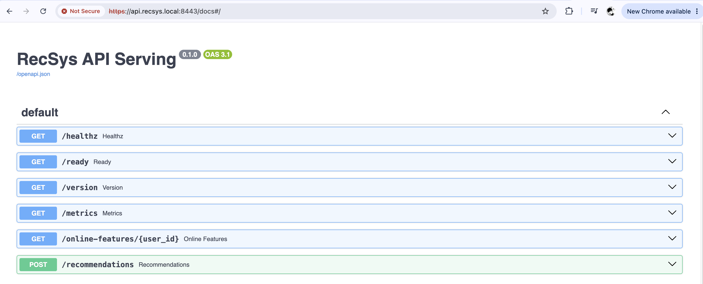
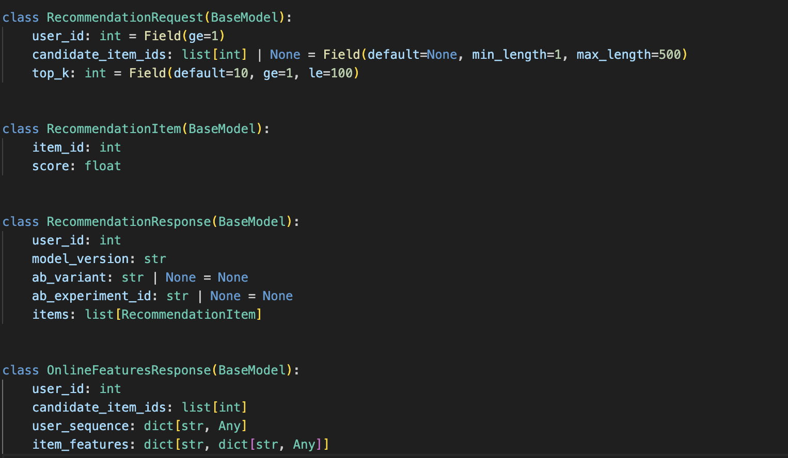
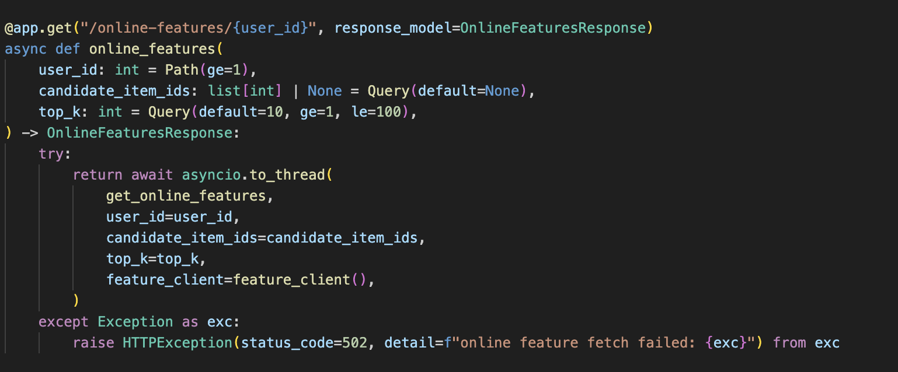
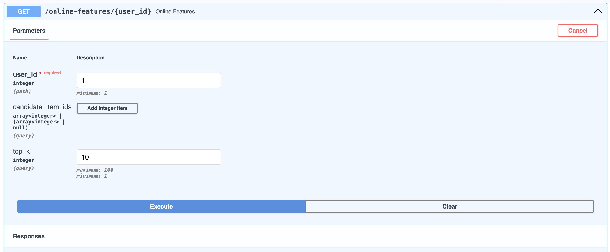
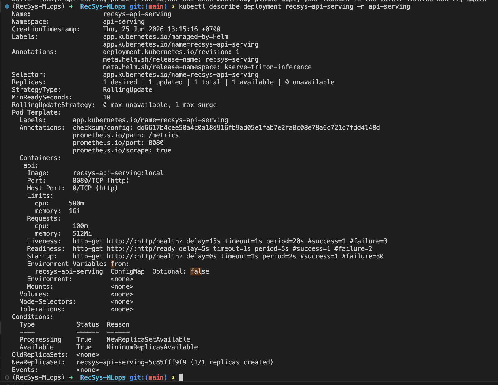
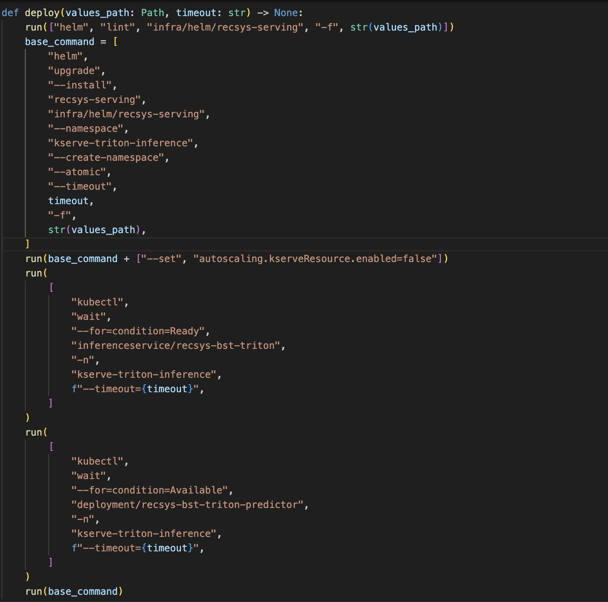

# Web API Pull Data

This note captures only the source-code evidence for the Web API requirement:

- FastAPI service.
- Pydantic request/response validation.
- Async API handlers.
- Helm deployment with `RollingUpdate`.
- Helm auto fallback through `--atomic`.
- CLI commands to verify the evidence.

## 1. FastAPI

Source: [apps/api-serving/src/main.py line 1](../../../apps/api-serving/src/main.py#1)

Lines to show:

- [apps/api-serving/src/main.py line 8](../../../apps/api-serving/src/main.py#8): imports `FastAPI`.
- [apps/api-serving/src/main.py line 22](../../../apps/api-serving/src/main.py#22): creates the app with `app = FastAPI(...)`.
- [apps/api-serving/src/main.py line 103](../../../apps/api-serving/src/main.py#103): exposes the online feature pull endpoint.
- [apps/api-serving/src/main.py line 121](../../../apps/api-serving/src/main.py#121): exposes the recommendation endpoint that sends features to inference.


### Key Evidence



## 2. Pydantic Validation

Source: [apps/api-serving/src/serving.py line 1](../../../apps/api-serving/src/serving.py#1)

Lines to show:

- [apps/api-serving/src/serving.py line 11](../../../apps/api-serving/src/serving.py#11): imports `BaseModel` and `Field`.
- [apps/api-serving/src/serving.py line 35-38](../../../apps/api-serving/src/serving.py#35): validates `RecommendationRequest`.
- [apps/api-serving/src/serving.py line 46-58](../../../apps/api-serving/src/serving.py#46): defines response schemas.

### Key code evidence:



## 3. Async API Functions

Source: [apps/api-serving/src/main.py line 1](../../../apps/api-serving/src/main.py#1)

Lines to show:

- [apps/api-serving/src/main.py line 30](../../../apps/api-serving/src/main.py#30): async middleware.
- [apps/api-serving/src/main.py line 79](../../../apps/api-serving/src/main.py#79): async health endpoint.
- [apps/api-serving/src/main.py line 84](../../../apps/api-serving/src/main.py#84): async readiness endpoint.
- [apps/api-serving/src/main.py line 99](../../../apps/api-serving/src/main.py#99): async metrics endpoint.
- [apps/api-serving/src/main.py line 104](../../../apps/api-serving/src/main.py#104): async online feature pull endpoint.
- [apps/api-serving/src/main.py line 122](../../../apps/api-serving/src/main.py#122): async recommendation endpoint.
- [apps/api-serving/src/main.py line 110-116](../../../apps/api-serving/src/main.py#110): uses `await asyncio.to_thread(...)` for feature retrieval.
- [apps/api-serving/src/main.py line 124-130](../../../apps/api-serving/src/main.py#124): uses `await asyncio.to_thread(...)` for recommendation/inference flow.

### Key code evidence:



## 4. Pull Data From Online Feature Store

Source: [apps/api-serving/src/serving.py line 1](../../../apps/api-serving/src/serving.py#1)

Lines to show:

- [apps/api-serving/src/serving.py line 203](../../../apps/api-serving/src/serving.py#203): `FeatureClient`.
- [apps/api-serving/src/serving.py line 210-214](../../../apps/api-serving/src/serving.py#210): connects to Redis online store.
- [apps/api-serving/src/serving.py line 216-229](../../../apps/api-serving/src/serving.py#216): pulls user sequence by `user_id`.
- [apps/api-serving/src/serving.py line 231-244](../../../apps/api-serving/src/serving.py#231): pulls item features by `item_id`.
- [apps/api-serving/src/serving.py line 246-260](../../../apps/api-serving/src/serving.py#246): pulls candidate item ids.
- [apps/api-serving/src/serving.py line 489-502](../../../apps/api-serving/src/serving.py#489): builds `OnlineFeaturesResponse`.

### Key Evidence



## 6. Helm RollingUpdate + Healthcheck for K8s 

### Evidence for Helm RollingUpdate + Healthcheck


#### Run this command
```
kubectl describe deployment recsys-api-serving -n api-serving
```



#### Inside [jenkins/scripts/model_cd.py line 207](../../../jenkins/scripts/model_cd.py#207) & [Jenkinsfile line 141](../../../Jenkinsfile#141)

Note: fallback is applied to `api-serving` because `api-serving` is a resource inside the Helm release `recsys-serving`. This release is deployed with `helm upgrade --install --atomic`, so if the upgrade fails, Helm rolls back the entire release, including `recsys-api-serving`.

Key lines:

- [jenkins/scripts/model_cd.py line 207](../../../jenkins/scripts/model_cd.py#207): builds the Helm deploy command.
- [jenkins/scripts/model_cd.py line 228](../../../jenkins/scripts/model_cd.py#228): enables `--atomic`.
- [Jenkinsfile line 141](../../../Jenkinsfile#141): runs deploy only when changed components should deploy.




