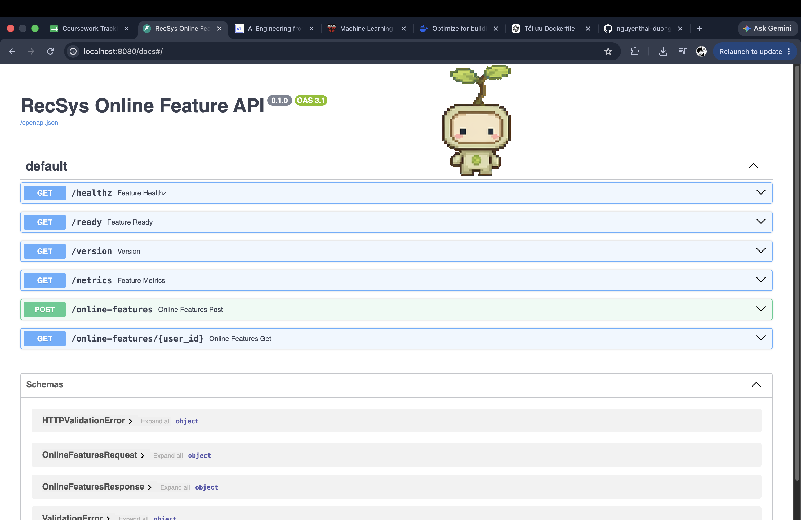
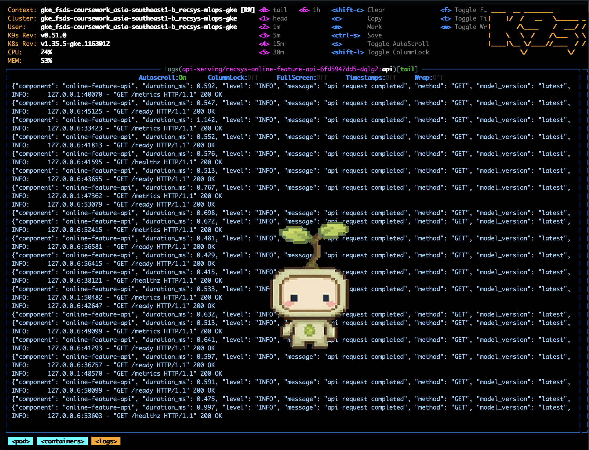

# Web API Pull Data

This note captures the source-code and runtime evidence for the rubric item:

- Web API pulls data from the Online Feature Store by `user_id` and optional `candidate_item_ids`.
- The API uses FastAPI.
- Request and response schemas use Pydantic validation.
- API handlers are async.
- The service exposes Kubernetes health checks.
- The service is deployed to Kubernetes with Helm `RollingUpdate`.
- Failed rollout fallback is handled by Helm `--atomic`.

## 1. Runtime Design

The deployed service for this rubric item is `recsys-online-feature-api`.

```text
Client or recsys-api-serving
  -> recsys-online-feature-api POST /online-features
  -> Feast SDK FeatureStore.get_online_features(...)
  -> Redis online store in recsys-dataflow
  -> OnlineFeaturesResponse
```

The recommendation API is a separate service. It calls `recsys-online-feature-api`, receives the online feature payload, and then sends the model tensor payload to Triton Inference Server.

```text
Client
  -> recsys-api-serving POST /recommendations
  -> recsys-online-feature-api POST /online-features
  -> Feast SDK + Redis online store
  -> Triton inference
  -> ranked recommendations
```

## 2. FastAPI Service

Source: [apps/api-serving/src/feature_api.py line 1](../../../apps/api-serving/src/feature_api.py#L1)

Lines to show:

- [apps/api-serving/src/feature_api.py line 5](../../../apps/api-serving/src/feature_api.py#L5): imports `FastAPI`.
- [apps/api-serving/src/feature_api.py line 12](../../../apps/api-serving/src/feature_api.py#L12): creates `RecSys Online Feature API`.
- [apps/api-serving/src/feature_api.py line 23](../../../apps/api-serving/src/feature_api.py#L23): exposes `/healthz`.
- [apps/api-serving/src/feature_api.py line 28](../../../apps/api-serving/src/feature_api.py#L28): exposes `/ready`.
- [apps/api-serving/src/feature_api.py line 43](../../../apps/api-serving/src/feature_api.py#L43): exposes `/metrics`.
- [apps/api-serving/src/feature_api.py line 48](../../../apps/api-serving/src/feature_api.py#L48): exposes `POST /online-features`.
- [apps/api-serving/src/feature_api.py line 62](../../../apps/api-serving/src/feature_api.py#L62): exposes `GET /online-features/{user_id}`.

### Key Evidence



## 3. Pydantic Validation

Source: [apps/api-serving/src/api_schemas.py line 1](../../../apps/api-serving/src/api_schemas.py#L1)

Lines to show:

- [apps/api-serving/src/api_schemas.py line 5](../../../apps/api-serving/src/api_schemas.py#L5): imports `BaseModel` and `Field`.
- [apps/api-serving/src/api_schemas.py line 27](../../../apps/api-serving/src/api_schemas.py#L27): defines `OnlineFeaturesResponse`.
- [apps/api-serving/src/api_schemas.py line 34](../../../apps/api-serving/src/api_schemas.py#L34): defines `OnlineFeaturesRequest`.
- [apps/api-serving/src/api_schemas.py line 35](../../../apps/api-serving/src/api_schemas.py#L35): validates `user_id >= 1`.
- [apps/api-serving/src/api_schemas.py line 36](../../../apps/api-serving/src/api_schemas.py#L36): validates optional candidate ids with `min_length=1` and `max_length=500`.
- [apps/api-serving/src/api_schemas.py line 37](../../../apps/api-serving/src/api_schemas.py#L37): validates `top_k` with `1 <= top_k <= 100`.

### Key Evidence


## 4. Async API Functions

Source: [apps/api-serving/src/feature_api.py line 1](../../../apps/api-serving/src/feature_api.py#L1)

Lines to show:

- [apps/api-serving/src/feature_api.py line 24](../../../apps/api-serving/src/feature_api.py#L24): async health endpoint.
- [apps/api-serving/src/feature_api.py line 29](../../../apps/api-serving/src/feature_api.py#L29): async readiness endpoint.
- [apps/api-serving/src/feature_api.py line 44](../../../apps/api-serving/src/feature_api.py#L44): async metrics endpoint.
- [apps/api-serving/src/feature_api.py line 49](../../../apps/api-serving/src/feature_api.py#L49): async online feature POST handler.
- [apps/api-serving/src/feature_api.py line 51](../../../apps/api-serving/src/feature_api.py#L51): uses `await asyncio.to_thread(...)` so the synchronous Feast/Redis read does not block the event loop.
- [apps/api-serving/src/feature_api.py line 63](../../../apps/api-serving/src/feature_api.py#L63): async online feature GET handler.

The inference API also uses async service-to-service calls:

- [apps/api-serving/src/feature_service_client.py line 17](../../../apps/api-serving/src/feature_service_client.py#L17): async `fetch(...)`.
- [apps/api-serving/src/feature_service_client.py line 22](../../../apps/api-serving/src/feature_service_client.py#L22): uses `httpx.AsyncClient`.
- [apps/api-serving/src/inference_api.py line 60](../../../apps/api-serving/src/inference_api.py#L60): async `POST /recommendations`.
- [apps/api-serving/src/inference_api.py line 68](../../../apps/api-serving/src/inference_api.py#L68): awaits online feature API response before inference.

### Key Evidence


## 5. Pull Data From Online Feature Store

Source: [apps/api-serving/src/online_features.py line 1](../../../apps/api-serving/src/online_features.py#L1)

Lines to show:

- [apps/api-serving/src/online_features.py line 81](../../../apps/api-serving/src/online_features.py#L81): `FeatureClient` owns the online feature retrieval logic.
- [apps/api-serving/src/online_features.py line 88](../../../apps/api-serving/src/online_features.py#L88): reads the Feast repository path.
- [apps/api-serving/src/online_features.py line 100](../../../apps/api-serving/src/online_features.py#L100): builds the Redis connection string for Feast online store.
- [apps/api-serving/src/online_features.py line 120](../../../apps/api-serving/src/online_features.py#L120): creates the Feast `FeatureStore`.
- [apps/api-serving/src/online_features.py line 127](../../../apps/api-serving/src/online_features.py#L127): applies the Feast repo at startup.
- [apps/api-serving/src/online_features.py line 131](../../../apps/api-serving/src/online_features.py#L131): calls `FeatureStore.get_online_features(...)`.
- [apps/api-serving/src/online_features.py line 134](../../../apps/api-serving/src/online_features.py#L134): pulls user sequence and aggregate features by `user_id`.
- [apps/api-serving/src/online_features.py line 155](../../../apps/api-serving/src/online_features.py#L155): pulls item features in batch by `product_id`.
- [apps/api-serving/src/online_features.py line 181](../../../apps/api-serving/src/online_features.py#L181): reads candidate ids from the Redis candidate pool.
- [apps/api-serving/src/online_features.py line 198](../../../apps/api-serving/src/online_features.py#L198): builds the final `OnlineFeaturesResponse`.

Feast store definition:

| Layer | Implementation | Runtime usage |
| --- | --- | --- |
| Offline store | PostgreSQL is the Feast core offline store. Spark exports lakehouse-derived batch feature tables into the Feast PostgreSQL schema, and Flink writes streaming feature rows into the same offline-store backend. | Used by training, validation, drift checks, and Feast historical retrieval/materialization. |
| Online store | Redis | Used by `recsys-online-feature-api` through Feast SDK `get_online_features(...)` during serving. |

### Key Evidence


## 6. Service Composition With Inference API

The rubric sentence says this Web API pulls data from the Online Feature Store and then sends data to an ML inference engine. In this implementation the responsibility is split into two services:

| Service | Responsibility |
| --- | --- |
| `recsys-online-feature-api` | Pulls user and item online features from Feast/Redis. |
| `recsys-api-serving` | Calls `recsys-online-feature-api`, prepares ranking features, and calls Triton inference. |

Source: [apps/api-serving/src/inference_api.py line 1](../../../apps/api-serving/src/inference_api.py#L1)

Lines to show:

- [apps/api-serving/src/inference_api.py line 17](../../../apps/api-serving/src/inference_api.py#L17): creates the inference FastAPI service.
- [apps/api-serving/src/inference_api.py line 22](../../../apps/api-serving/src/inference_api.py#L22): initializes `OnlineFeatureServiceClient`.
- [apps/api-serving/src/inference_api.py line 60](../../../apps/api-serving/src/inference_api.py#L60): exposes `POST /recommendations`.
- [apps/api-serving/src/inference_api.py line 68](../../../apps/api-serving/src/inference_api.py#L68): pulls online features from the feature API.
- [apps/api-serving/src/inference_api.py line 75](../../../apps/api-serving/src/inference_api.py#L75): ranks using Triton route and online feature payload.

Source: [apps/api-serving/src/feature_service_client.py line 1](../../../apps/api-serving/src/feature_service_client.py#L1)

Lines to show:

- [apps/api-serving/src/feature_service_client.py line 14](../../../apps/api-serving/src/feature_service_client.py#L14): default URL is `http://recsys-online-feature-api`.
- [apps/api-serving/src/feature_service_client.py line 23](../../../apps/api-serving/src/feature_service_client.py#L23): posts to `/online-features`.
- [apps/api-serving/src/feature_service_client.py line 29](../../../apps/api-serving/src/feature_service_client.py#L29): validates response with `OnlineFeaturesResponse.model_validate(...)`.

## 7. Runtime Verification Commands

Run these commands after `make gcp-services-up`.

```bash
kubectl -n api-serving get deploy,svc recsys-online-feature-api
kubectl -n api-serving rollout status deployment/recsys-online-feature-api --timeout=180s
kubectl -n api-serving rollout status deployment/recsys-api-serving --timeout=180s
```

Healthcheck:

```bash
kubectl -n api-serving exec deploy/recsys-online-feature-api -c api -- \
  python -c 'import urllib.request; print(urllib.request.urlopen("http://127.0.0.1:8080/healthz", timeout=10).read().decode()); print(urllib.request.urlopen("http://127.0.0.1:8080/ready", timeout=10).read().decode())'
```

Online feature pull:

```bash
kubectl -n api-serving exec deploy/recsys-online-feature-api -c api -- \
  python -c 'import json, urllib.request; req=urllib.request.Request("http://127.0.0.1:8080/online-features", data=json.dumps({"user_id":4,"candidate_item_ids":[1,2,3],"top_k":3}).encode(), headers={"Content-Type":"application/json"}, method="POST"); print(urllib.request.urlopen(req, timeout=20).read().decode())'
```

End-to-end pull-data plus inference:

```bash
kubectl -n api-serving exec deploy/recsys-api-serving -c api -- \
  python -c 'import json, urllib.request; req=urllib.request.Request("http://127.0.0.1:8080/recommendations", data=json.dumps({"user_id":4,"candidate_item_ids":[1,2,3],"top_k":3}).encode(), headers={"Content-Type":"application/json"}, method="POST"); print(urllib.request.urlopen(req, timeout=30).read().decode())'
```

Expected online feature output shape:

```json
{
  "user_id": 4,
  "candidate_item_ids": [1, 2, 3],
  "user_sequence": {
    "hist_item_ids": [104, 70],
    "hist_length": 14,
    "views_30m": 12
  },
  "item_features": {
    "1": {
      "category_id": 16,
      "brand_id": 31,
      "popularity_score": 4.0
    }
  }
}
```

### Image Proof




## 8. Helm RollingUpdate + Healthcheck For K8s

Source: [infra/helm/recsys-serving/templates/feature-api-deployment.yaml line 1](../../../infra/helm/recsys-serving/templates/feature-api-deployment.yaml#L1)

Lines to show:

- [infra/helm/recsys-serving/templates/feature-api-deployment.yaml line 11](../../../infra/helm/recsys-serving/templates/feature-api-deployment.yaml#L11): configures replicas.
- [infra/helm/recsys-serving/templates/feature-api-deployment.yaml line 13](../../../infra/helm/recsys-serving/templates/feature-api-deployment.yaml#L13): uses `RollingUpdate`.
- [infra/helm/recsys-serving/templates/feature-api-deployment.yaml line 15](../../../infra/helm/recsys-serving/templates/feature-api-deployment.yaml#L15): configures `maxUnavailable`.
- [infra/helm/recsys-serving/templates/feature-api-deployment.yaml line 16](../../../infra/helm/recsys-serving/templates/feature-api-deployment.yaml#L16): configures `maxSurge`.
- [infra/helm/recsys-serving/templates/feature-api-deployment.yaml line 59](../../../infra/helm/recsys-serving/templates/feature-api-deployment.yaml#L59): startup probe.
- [infra/helm/recsys-serving/templates/feature-api-deployment.yaml line 65](../../../infra/helm/recsys-serving/templates/feature-api-deployment.yaml#L65): readiness probe.
- [infra/helm/recsys-serving/templates/feature-api-deployment.yaml line 72](../../../infra/helm/recsys-serving/templates/feature-api-deployment.yaml#L72): liveness probe.

Runtime command:

```bash
kubectl -n api-serving describe deployment recsys-online-feature-api
```

Fields to capture:

| Capability | Expected evidence |
| --- | --- |
| Rolling update | `StrategyType: RollingUpdate` |
| No unavailable replicas during rollout | `Max Unavailable: 0` |
| Extra surge pod during rollout | `Max Surge: 1` |
| Startup probe | `http-get http://:http/healthz` |
| Readiness probe | `http-get http://:http/ready` |
| Liveness probe | `http-get http://:http/healthz` |

### Image Proof


## 9. Helm Auto Fallback With `--atomic`

Auto fallback is handled at the Helm release level. The service is part of the `recsys-serving` release. When CI/CD deploys this release with `helm upgrade --install --atomic`, Helm automatically rolls the release back if the new rollout fails.

Source: [jenkins/scripts/model_cd.py line 208](../../../jenkins/scripts/model_cd.py#L208)

Lines to show:

- [jenkins/scripts/model_cd.py line 208](../../../jenkins/scripts/model_cd.py#L208): runs Helm lint before deploy.
- [jenkins/scripts/model_cd.py line 217](../../../jenkins/scripts/model_cd.py#L217): builds the `helm upgrade --install` command.
- [jenkins/scripts/model_cd.py line 219](../../../jenkins/scripts/model_cd.py#L219): deploys the `recsys-serving` release.
- [jenkins/scripts/model_cd.py line 231](../../../jenkins/scripts/model_cd.py#L231): inserts `--atomic` for rollback on failure.

Runtime command:

```bash
helm history recsys-serving -n kserve-triton-inference
helm status recsys-serving -n kserve-triton-inference
```

### Image Proof


