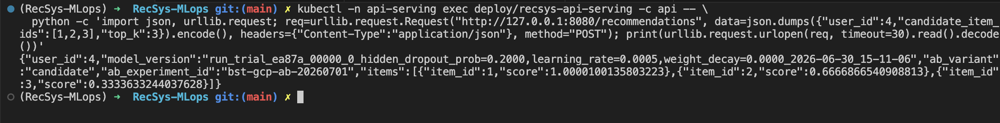
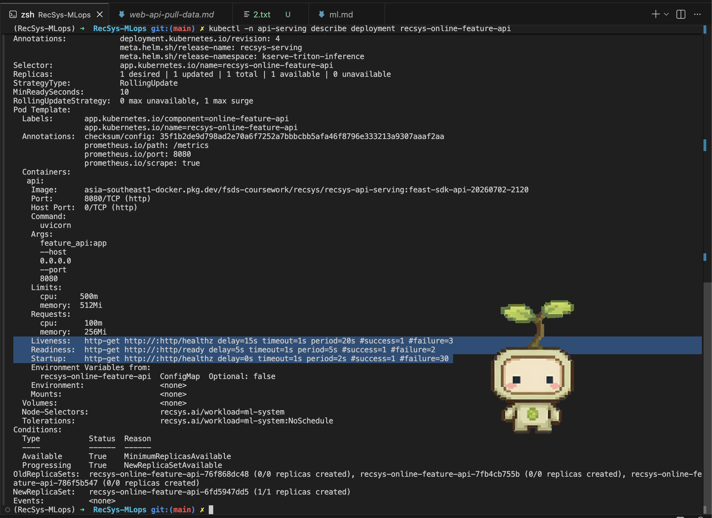

# Web API Pull Data

This proof covers the rubric item **Web API kéo dữ liệu**.

The deployed service for this item is `recsys-online-feature-api`. It is a separate FastAPI service that pulls online features from the Redis online store by `user_id` and optional candidate item ids. Apache Iceberg is the authoritative offline feature store; Redis is the online store used by this API at serving time.

## Runtime Flow

```text
Client
  -> recsys-online-feature-api POST /online-features
  -> Redis online store in recsys-dataflow
  -> OnlineFeaturesResponse
```

The next API, `recsys-api-serving`, calls this service before sending the feature payload to Triton.

## Source Evidence

| Requirement | Evidence |
| --- | --- |
| FastAPI service | [apps/api-serving/src/feature_api.py](../../../apps/api-serving/src/feature_api.py) creates `RecSys Online Feature API`. |
| Pydantic request validation | [apps/api-serving/src/api_schemas.py](../../../apps/api-serving/src/api_schemas.py) defines `OnlineFeaturesRequest` with `user_id`, `candidate_item_ids`, and `top_k` validation. |
| Pydantic response schema | [apps/api-serving/src/api_schemas.py](../../../apps/api-serving/src/api_schemas.py) defines `OnlineFeaturesResponse`. |
| Async handler | [apps/api-serving/src/feature_api.py](../../../apps/api-serving/src/feature_api.py) exposes `async def online_features(...)` and runs the sync Redis client in a worker thread. |
| Healthcheck for k8s | [apps/api-serving/src/feature_api.py](../../../apps/api-serving/src/feature_api.py) exposes `/healthz` and `/ready`. |
| Redis online store adapter | [apps/api-serving/src/online_features.py](../../../apps/api-serving/src/online_features.py) wraps Redis reads for user sequence, item features, and candidates. |
| Helm deployment | [infra/helm/recsys-serving/templates/feature-api-deployment.yaml](../../../infra/helm/recsys-serving/templates/feature-api-deployment.yaml) deploys `recsys-online-feature-api`. |
| Helm service | [infra/helm/recsys-serving/templates/feature-api-service.yaml](../../../infra/helm/recsys-serving/templates/feature-api-service.yaml) creates the in-cluster service used by the recommendation API. |
| Prometheus scrape | [infra/helm/recsys-serving/templates/feature-api-servicemonitor.yaml](../../../infra/helm/recsys-serving/templates/feature-api-servicemonitor.yaml) scrapes `/metrics`. |

## Feast Store Definition

| Feast layer | Implementation | Runtime usage |
| --- | --- | --- |
| Offline store | Apache Iceberg, exported to Feast FileSource views | Batch and streaming feature tables used for training, validation, drift checks, and Feast historical retrieval/materialization. |
| Online store | Redis | Low-latency reads from `recsys-online-feature-api` during serving. Redis keys are written by the streaming online writer and Feast materialization path. |

## Healthcheck And Online Feature Command

```bash
kubectl -n api-serving get deploy,svc recsys-online-feature-api

kubectl -n api-serving exec deploy/recsys-online-feature-api -c api -- \
  python - <<'PY'
import json
import urllib.request

payload = json.dumps({
    "user_id": 1,
    "candidate_item_ids": [101, 202, 303],
    "top_k": 3,
}).encode()
request = urllib.request.Request(
    "http://127.0.0.1:8080/online-features",
    data=payload,
    headers={"Content-Type": "application/json"},
    method="POST",
)
with urllib.request.urlopen(request, timeout=10) as response:
    print(response.read().decode())
PY
```

Expected output:

```json
{
  "user_id": 1,
  "candidate_item_ids": [101, 202, 303],
  "user_sequence": {"hist_item_ids": "..."},
  "item_features": {"101": "...", "202": "...", "303": "..."}
}
```

### Image proof



## Helm RollingUpdate And Fallback

```bash
kubectl -n api-serving describe deployment recsys-online-feature-api
```

The deployment uses:

| Capability | Helm field |
| --- | --- |
| Rolling update | `strategy.type: RollingUpdate` |
| No unavailable replicas during rollout | `rollingUpdate.maxUnavailable: 0` |
| Extra surge pod during rollout | `rollingUpdate.maxSurge: 1` |
| Startup probe | `/healthz` |
| Readiness probe | `/ready` |
| Liveness probe | `/healthz` |

Auto fallback is handled by the `recsys-serving` Helm release deploy command with `helm upgrade --install --atomic`. If the new feature API rollout fails, Helm rolls back the whole serving release.

### Image proof


