# Recommendation LLM A/B Rollout — Production Runbook

This document explains how to run, observe, and audit a production Recommendation-agent LLM A/B experiment. It covers the complete path from a reviewed model alias and a Langfuse `ab-ready` label to controller-managed Istio traffic shifts, deterministic evaluation, promotion or rollback, and terminal cleanup.

The current design deliberately separates responsibilities:

- **Langfuse** is the operator-facing candidate configuration and lifecycle UI.
- **The Recommendation controller CronJob** reads evidence, evaluates gates, and chooses at most one next action per tick.
- **Jenkins** executes one authorized mutation per build under the production release lock.
- **The Traffic Job** only generates signed traffic through the public production A2A edge.
- **Istio** assigns new sessions to immutable control or candidate releases.
- **PostgreSQL and MinIO** hold the durable experiment, request, evaluation, and gate evidence.
- **Grafana** visualizes the controller state, traffic, online results, latency, functional checks, and infrastructure.

No LLM is used as a judge. Functional scores are deterministic checks against the frozen fixture and the tool evidence captured during execution.

## Evidence note

The screenshots in this runbook are from experiment `rec-17e011eaa1b30b9c6b0dc30a48faab8a` on 15 September 2026. That run successfully demonstrated registration, Langfuse claiming, offline `6/6`, Istio 10%, Istio 50%, exactly 20 public A2A cases, `20/20` deterministic evaluation, rollback, and cleanup.

It did **not** reach 100% candidate traffic or promotion. The closed operational window ended with a candidate/control p95 ratio of approximately `1.23`, above the `1.2` limit, so the controller correctly rolled traffic back to 100% baseline. The earlier `1.15` value was an in-progress observation, not the final frozen verdict. The evidence therefore proves fail-closed behavior; it must not be presented as a successful promotion.

## End-to-end flow

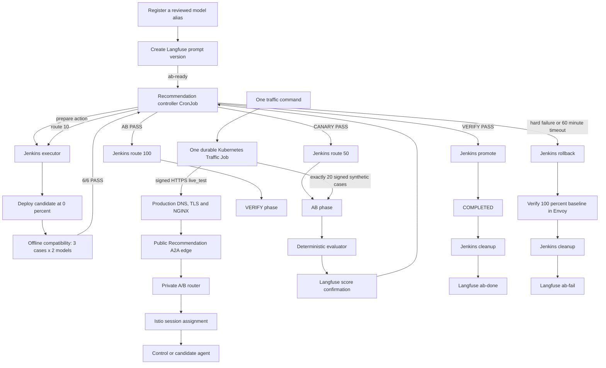
```mermaid
flowchart TD
    A[Register a reviewed model alias] --> B[Create Langfuse prompt version]
    B -->|ab-ready| C[Recommendation controller CronJob]
    C -->|prepare action| D[Jenkins executor]
    D --> E[Deploy candidate at 0 percent]
    E --> F[Offline compatibility: 3 cases x 2 models]
    F -->|6/6 PASS| C
    C -->|route 10| D

    G[One traffic command] --> H[One durable Kubernetes Traffic Job]
    H -->|signed HTTPS live_test| I[Production DNS, TLS and NGINX]
    I --> J[Public Recommendation A2A edge]
    J --> K[Private A/B router]
    K --> L[Istio session assignment]
    L --> M[Control or candidate agent]

    C -->|CANARY PASS| N[Jenkins route 50]
    N --> O[AB phase]
    H -->|exactly 20 signed synthetic cases| O
    O --> P[Deterministic evaluator]
    P --> Q[Langfuse score confirmation]
    Q --> C

    C -->|AB PASS| R[Jenkins route 100]
    R --> S[VERIFY phase]
    C -->|VERIFY PASS| T[Jenkins promote]
    T --> U[COMPLETED]
    U --> V[Jenkins cleanup]
    V --> W[Langfuse ab-done]

    C -->|hard failure or 60 minute timeout| X[Jenkins rollback]
    X --> Y[Verify 100 percent baseline in Envoy]
    Y --> Z[Jenkins cleanup]
    Z --> AA[Langfuse ab-fail]
```

The controller is the only decision maker. Jenkins does not loop, wait for the next gate, produce traffic, or choose the next weight. The Traffic Job cannot call Jenkins or mutate Istio.

## Source map

The main implementation references used throughout this runbook are:

| Concern | Source |
|---|---|
| Reviewed aliases and immutable catalog registration | [`llm_ab_start.py`](../../../jenkins/python/llm_agent_cd/llm_ab_start.py#L77-L146) |
| Langfuse `ab-ready` publication | [`recommendation_langfuse_automation.py`](../../../jenkins/python/llm_agent_cd/recommendation_langfuse_automation.py#L195-L217) |
| Controller CronJob | [`trigger.yaml`](../../../infra/helm/recsys-llm-ab/templates/trigger.yaml#L16-L65) |
| Gate evaluation and controller transitions | [`controller.py`](../../../apps/agentic/llm_ab_router/controller.py#L236-L379) |
| Gate policy and hard checks | [`gates.py`](../../../jenkins/python/llm_agent_cd/gates.py#L25-L88) |
| One-action Jenkins pipeline | [`LLMAgentCD.Jenkinsfile`](../../../jenkins/LLMAgentCD.Jenkinsfile#L1-L88) |
| Jenkins action implementation | [`recommendation_action.py`](../../../jenkins/python/llm_agent_cd/recommendation_action.py#L24-L181) |
| Istio `VirtualService` rendering | [`manifests.py`](../../../jenkins/python/llm_agent_cd/manifests.py#L226-L298) |
| Envoy route verification | [`driver.py`](../../../jenkins/python/llm_agent_cd/driver.py#L642-L698) |
| Durable Traffic Job | [`llm_ab_traffic.py`](../../../jenkins/python/llm_agent_cd/llm_ab_traffic.py#L40-L169) |
| Exactly-20 public suite | [`external_cases.py`](../../../jenkins/python/llm_agent_cd/external_cases.py#L35-L170) |
| Evaluation and Langfuse score confirmation | [`evaluation_job.py`](../../../apps/agentic/llm_ab_router/evaluation_job.py#L50-L101) |
| Terminal release cleanup | [`cleanup.py`](../../../jenkins/python/llm_agent_cd/cleanup.py#L49-L174) |
| Grafana dashboard definition | [`dashboard.py`](../../../jenkins/python/llm_agent_cd/dashboard.py#L278-L440) |

## How Istio traffic weights are configured and applied

The Recommendation A/B `VirtualService` is **not a static Helm YAML with hard-coded release names**. The two immutable release IDs are read from experiment state, [`virtual_service`](../../../jenkins/python/llm_agent_cd/manifests.py#L226-L298) renders the exact Istio object, and the controller-authorized Jenkins action applies it. This prevents a normal Helm deploy from resetting an active experiment and prevents an operator from accidentally routing to a mixed config/model pair.

Helm creates the dedicated two-replica Istio gateway workload, ClusterIP Service, and Istio `Gateway`. The selector that binds the Istio `Gateway` to those Envoy pods is shown below:

```yaml
apiVersion: apps/v1
kind: Deployment
metadata:
  name: recsys-ab-gateway
spec:
  replicas: 2
  template:
    metadata:
      labels:
        istio: recsys-ab-gateway
        sidecar.istio.io/inject: "true"
      annotations:
        inject.istio.io/templates: gateway
---
apiVersion: networking.istio.io/v1beta1
kind: Gateway
metadata:
  name: recsys-ab-gateway
spec:
  selector:
    istio: recsys-ab-gateway
  servers:
    - port: {number: 80, name: http, protocol: HTTP}
      hosts: ["recsys-ab-gateway.kagent.svc.cluster.local"]
```

Source: [`gateway.yaml` lines 5–45](../../../infra/helm/recsys-llm-ab/templates/gateway.yaml#L5-L45). The private router is pointed at this gateway by `AB_GATEWAY_URL` in [`runtime.yaml` lines 31–35](../../../infra/helm/recsys-llm-ab/templates/runtime.yaml#L31-L35).

The core weight calculation is here. `weight` always means **candidate percentage**; control receives `100 - weight`. A zero-weight destination is removed from the rendered route:

```python
weighted = [{"destination": destination(baseline), "weight": 100 - weight}]
if baseline["release_id"] != candidate["release_id"]:
    weighted.append({"destination": destination(candidate), "weight": weight})

spec["http"].append({
    "name": "allocate",
    "match": [{"uri": {"exact": "/allocate"}}],
    "route": [route for route in weighted if route["weight"] > 0],
    "retries": {"attempts": 0},
    "timeout": "10s",
})
```

Source: [`manifests.py` lines 264–275](../../../jenkins/python/llm_agent_cd/manifests.py#L264-L275). The renderer calculates a digest of the full spec, appends it to route names, and stores it as the `recsys.ai/route-revision` annotation in [`manifests.py` lines 285–298](../../../jenkins/python/llm_agent_cd/manifests.py#L285-L298).

For example, the generated `allocate` route changes as follows; the real host suffix contains the immutable release ID:

```yaml
# CANARY: target candidate weight = 10
- name: allocate-<route-revision>
  match:
    - uri: {exact: /allocate}
  route:
    - destination: {host: rec-ab-<control>.kagent.svc.cluster.local, port: {number: 80}}
      weight: 90
    - destination: {host: rec-ab-<candidate>.kagent.svc.cluster.local, port: {number: 80}}
      weight: 10
  retries: {attempts: 0}
  timeout: 10s
```

```yaml
# AB: target candidate weight = 50
route:
  - destination: {host: rec-ab-<control>.kagent.svc.cluster.local, port: {number: 80}}
    weight: 50
  - destination: {host: rec-ab-<candidate>.kagent.svc.cluster.local, port: {number: 80}}
    weight: 50
```

```yaml
# VERIFY: target candidate weight = 100
# The zero-weight control destination is omitted.
route:
  - destination: {host: rec-ab-<candidate>.kagent.svc.cluster.local, port: {number: 80}}
    weight: 100
```

Only the `/allocate` request for a **new session** uses the weighted route. The router calls `/allocate`, validates the returned release, and persists that assignment in PostgreSQL in [`server.py` lines 889–925](../../../apps/agentic/llm_ab_router/server.py#L889-L925). Every later turn carries the trusted `x-recsys-release` header and uses the corresponding `pin-<release>` route, as shown in [`manifests.py` lines 246–263](../../../jenkins/python/llm_agent_cd/manifests.py#L246-L263) and [`server.py` lines 976–988](../../../apps/agentic/llm_ab_router/server.py#L976-L988). Therefore an existing conversation never changes model when the percentage changes.

The controller maps a mature PASS gate to the next target but does not touch Kubernetes:

```python
if phase == "CANARY":
    return "route", 50
if phase == "AB":
    return "route", 100
return "promote", None
```

It also performs the first `OFFLINE_PASS -> route 10` transition. Sources: [`controller.py` lines 40–52](../../../apps/agentic/llm_ab_router/controller.py#L40-L52) and [`controller.py` lines 334–370](../../../apps/agentic/llm_ab_router/controller.py#L334-L370).

Jenkins receives that target as `TARGET_WEIGHT` and invokes exactly one executor action; it contains no rollout loop:

```groovy
choice(name: 'ACTION', choices: ['prepare', 'route', 'promote', 'rollback', 'cleanup'])
choice(name: 'TARGET_WEIGHT', choices: ['', '0', '10', '50', '100'])

set -- "$ACTION" \
  --action-key "$ACTION_KEY" \
  --experiment-id "$EXPERIMENT_ID" \
  --expected-phase "$EXPECTED_PHASE" \
  --expected-state-etag "$EXPECTED_STATE_ETAG"
[ -z "${TARGET_WEIGHT:-}" ] || set -- "$@" --target-weight "$TARGET_WEIGHT"
.llm-ab-venv/bin/python -m jenkins.python.llm_agent_cd.recommendation_action "$@"
```

Sources: [`LLMAgentCD.Jenkinsfile` lines 9–24](../../../jenkins/LLMAgentCD.Jenkinsfile#L9-L24) and [`LLMAgentCD.Jenkinsfile` lines 55–74](../../../jenkins/LLMAgentCD.Jenkinsfile#L55-L74).

The Jenkins executor then writes the route intent, renders and applies the `VirtualService`, waits for Envoy acknowledgement, and only afterwards commits `verified_weight` and the next phase:

```python
engine.event(
    "ROUTING",
    route_intent={"weight": weight, "next_phase": target_phase},
    stage_started=self.clock(),
)
revision = self.driver.route(engine.state, weight)
while not self.driver.verify_route(engine.state, weight, revision):
    if time.monotonic() >= deadline:
        raise TimeoutError("Envoy propagation timeout")
    self.sleep(2)
engine.event(
    target_phase,
    route_revision=revision,
    verified_weight=weight,
    stage_started=self.clock(),
)
```

Source: [`recommendation_action.py` lines 131–150](../../../jenkins/python/llm_agent_cd/recommendation_action.py#L131-L150).

The actual Kubernetes mutation is exactly one `kubectl apply` of the rendered object:

```python
def route(self, state, weight):
    obj = virtual_service(state, weight, self.namespace)
    self.kube("apply", "-f", "-", stdin=json.dumps(obj))
    return obj["metadata"]["annotations"]["recsys.ai/route-revision"]
```

Source: [`driver.py` lines 642–645](../../../jenkins/python/llm_agent_cd/driver.py#L642-L645). Verification does not trust the Kubernetes object alone: it reads `config_dump` from every ready gateway Envoy and calls each pinned release identity before returning true in [`driver.py` lines 647–698](../../../jenkins/python/llm_agent_cd/driver.py#L647-L698).

Use these read-only commands to see the exact production configuration after each transition:

```bash
# Desired VirtualService stored by the Kubernetes API.
kubectl -n kagent get virtualservice recsys-ab -o yaml

# Compact control/candidate allocation and immutable route revision.
show_route

# Route actually loaded by both gateway Envoy replicas.
show_envoy

# Controller state must agree with the data plane.
ab_state | jq '{phase, route_revision, verified_weight, gate}'
```

Do not consider a `10`, `50`, or `100` transition complete until `verified_weight`, the `VirtualService` annotation, and every ready Envoy route all agree.

## 0. Open one operator shell and define inspection helpers

Run every command from the repository root in the same shell. The examples below match the deployed namespaces and resource names.

```bash
cd /Users/KHOAI/anhkhoa/RecSys-MLops

command -v kubectl
command -v jq
command -v uv

kubectl config current-context
```

Define a helper that reads the authoritative MinIO state by using the already configured credentials in the private router pod:

```bash
ab_state() {
  kubectl -n kagent exec deployment/recsys-ab-router -c router -- \
    python -c '
import json, os
from jenkins.python.llm_agent_cd.state import StateStore
s, _ = StateStore(os.environ["AB_STATE_URI"]).read()
print(json.dumps({
  "experiment_id": s.get("experiment_id"),
  "phase": s.get("phase"),
  "gate": s.get("gate"),
  "verified_weight": s.get("verified_weight"),
  "route_revision": s.get("route_revision"),
  "offline": {
    "total": len(s.get("offline_evidence", {}).get("cases", [])),
    "passed": sum(
      1 for r in s.get("offline_evidence", {}).get("cases", [])
      if (r.get("result") or {}).get("verdict") == "PASS"
    )
  },
  "online": {
    "total": len(s.get("cases", {})),
    "passed": sum(1 for r in s.get("cases", {}).values() if r.get("verdict") == "PASS"),
    "control": sum(1 for r in s.get("cases", {}).values() if r.get("release_id") == (s.get("baseline") or {}).get("release_id")),
    "candidate": sum(1 for r in s.get("cases", {}).values() if r.get("release_id") == (s.get("pending") or {}).get("release_id"))
  },
  "champion": (s.get("champion") or {}).get("release_id"),
  "previous": (s.get("previous") or {}).get("release_id"),
  "cleanup": (s.get("cleanup") or {}).get("status")
}, indent=2))'
}
```

Define helpers for the desired Istio route and the route actually loaded by every ready Envoy gateway:

```bash
show_route() {
  kubectl -n kagent get virtualservice recsys-ab -o json | jq '{
    route_revision: .metadata.annotations["recsys.ai/route-revision"],
    allocate: [
      .spec.http[]
      | select((.name // "") | startswith("allocate-"))
      | .route[]
      | {host: .destination.host, weight: (.weight // 100)}
    ]
  }'
}

show_envoy() {
  for pod in $(kubectl -n kagent get pod -l istio=recsys-ab-gateway -o name); do
    echo "===== ${pod#pod/} ====="
    kubectl -n kagent exec "$pod" -c istio-proxy -- \
      pilot-agent request GET config_dump 2>/dev/null \
      | jq -c '.. | objects
          | select(((.name? // "") | startswith("allocate-")))
          | {name, route}'
  done
}
```

Define phase and CronJob-log helpers:

```bash
wait_phase() {
  target="$1"
  while true; do
    phase="$(ab_state | jq -r '.phase')"
    printf '%s phase=%s target=%s\n' "$(date +%H:%M:%S)" "$phase" "$target"
    [ "$phase" = "$target" ] && break
    case "$phase" in
      COMPLETED|ROLLED_BACK|ROLLBACK_FAILED) return 1 ;;
    esac
    sleep 10
  done
}

latest_cronjob_job() {
  cronjob="$1"
  kubectl -n kagent get jobs -o json \
    | jq -r --arg cronjob "$cronjob" '
        .items[]
        | select(any(.metadata.ownerReferences[]?;
            .kind == "CronJob" and .name == $cronjob))
        | [.metadata.creationTimestamp, .metadata.name]
        | @tsv' \
    | sort \
    | tail -n 1 \
    | cut -f 2
}
```

These helpers are read-only. They do not dispatch Jenkins, create traffic, or alter the route.

## 1. Production preflight

Confirm the cluster context, controller, evaluator, public edge, private router, and gateway before creating a candidate:

```bash
kubectl config current-context

kubectl -n kagent get cronjob \
  recsys-recommendation-ab-poller \
  recsys-recommendation-evaluation

kubectl -n kagent get deployment \
  recsys-ab-router \
  recsys-ab-edge \
  recsys-ab-gateway

kubectl -n kagent get ingress recsys-recommendation-ab-edge
helm status recsys-llm-ab -n kagent

ab_state
show_route
show_envoy
```

Expected preflight state:

- Both CronJobs are not suspended.
- Router, edge, and gateway are Ready.
- The current state is `IDLE`, `COMPLETED`, or `ROLLED_BACK`.
- If the state is terminal, `cleanup` is `CLEANED`.
- The allocation route sends 100% of new sessions to the current champion.
- Every ready Envoy shows the same route revision and weights.

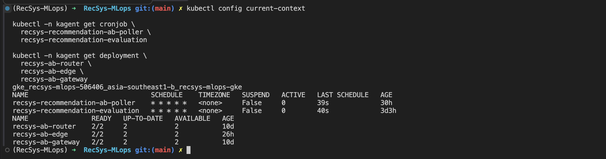

The deployed production values explicitly enable the evaluator, poller, and edge in [`values-prod.yaml`](../../../infra/helm/recsys-llm-ab/values-prod.yaml#L7-L20). The controller itself runs every minute, forbids overlap, has no pod restart retry, and must finish each tick within 55 seconds:

```yaml
apiVersion: batch/v1
kind: CronJob
metadata: {name: recsys-recommendation-ab-poller}
spec:
  schedule: "* * * * *"
  concurrencyPolicy: Forbid
  jobTemplate:
    spec:
      backoffLimit: 0
      activeDeadlineSeconds: 55
      template:
        spec:
          containers:
            - name: poll
              command: [python, -m, apps.agentic.llm_ab_router.trigger, poll]
```

Source: [`trigger.yaml` lines 16–65](../../../infra/helm/recsys-llm-ab/templates/trigger.yaml#L16-L65).

## 2. Register a reviewed candidate alias

Record the previous experiment ID first so the new one can be detected reliably:

```bash
OLD_EXPERIMENT_ID="$(ab_state | jq -r '.experiment_id // ""')"
RUN_DIR="$(mktemp -d /tmp/recsys-ab.XXXXXX)"
MODEL_ALIAS="qwen35-0.8b-q4"

uv run python -m jenkins.python.llm_agent_cd.llm_ab_start \
  --scope recommendation \
  --model-alias "$MODEL_ALIAS" \
  | tee "$RUN_DIR/registration.json"

jq . "$RUN_DIR/registration.json"
jq -e '.status == "REGISTERED" or .status == "READY"' \
  "$RUN_DIR/registration.json"

jq '.langfuse_config' "$RUN_DIR/registration.json" \
  > "$RUN_DIR/langfuse-config.json"
```

If the command returns `NOOP`, the chosen alias is already champion and cannot form an `llm_only` A/B comparison. Choose another reviewed alias. A Recommendation release that failed an earlier experiment may be retried: preparation always redeploys it at 0% and repeats the complete offline gate. That behavior is implemented in [`engine.py` lines 93–105](../../../jenkins/python/llm_agent_cd/engine.py#L93-L105).

Do not hand-edit `baseline_release_id`, generation parameters, or `llm_release_ref`. Registration snapshots the current champion generation config and creates an immutable `llm_only` request. The alias allowlist resolves a short name to a pinned repository, commit, GGUF file, checksum, and serving profile:

```python
MODEL_ALIASES = {
    "qwen35-0.8b-q4": {
        "model": REQUESTED_MODEL,
        "revision": REVISION,
        "filename": FILENAME,
        "profile": PROFILE,
    },
    "qwen25-0.5b-q4-terminal-v4": {
        "model": QWEN25_REQUESTED_MODEL,
        "revision": QWEN25_REVISION,
        "filename": QWEN25_FILENAME,
        "profile": QWEN25_PROFILE,
    },
}
```

Source: [`llm_ab_start.py` lines 94–110](../../../jenkins/python/llm_agent_cd/llm_ab_start.py#L94-L110).

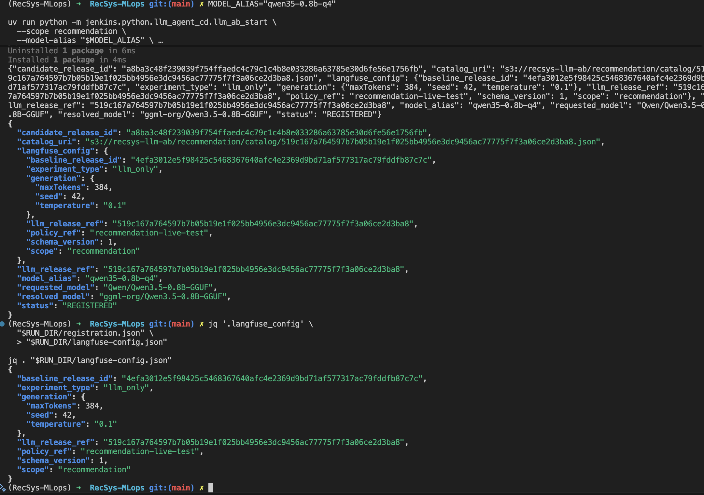

## 3. Create the Langfuse candidate and assign `ab-ready`

The reproducible command path creates a new immutable prompt version and assigns `ab-ready`:

```bash
uv run python -m \
  jenkins.python.llm_agent_cd.recommendation_langfuse_automation \
  publish \
  --config "$RUN_DIR/langfuse-config.json" \
  | tee "$RUN_DIR/langfuse-publish.json"

jq . "$RUN_DIR/langfuse-publish.json"
```

Alternatively, paste the contents of `langfuse-config.json` into a new version of the `recsys-recommendation-ab` text prompt and assign the `ab-ready` label in the Langfuse UI. Use **one path only**; do not both run the publish command and create another manual version.

```bash
jq . "$RUN_DIR/langfuse-config.json"

# Optional on macOS: copy the exact JSON before using the UI.
jq . "$RUN_DIR/langfuse-config.json" | pbcopy
```

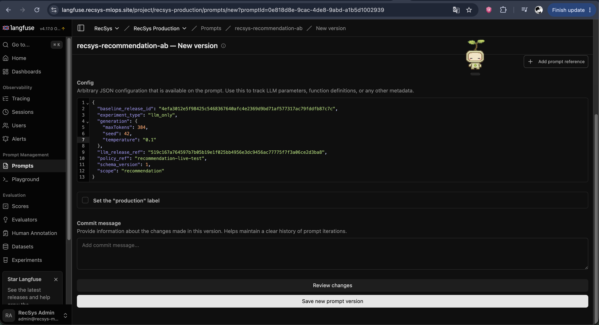

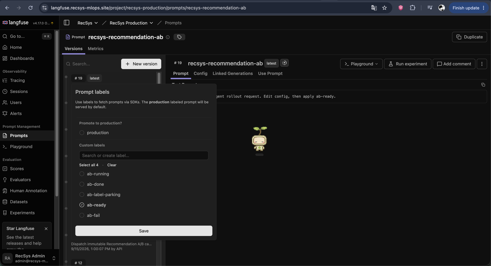

The publisher validates the config before creating the version and reads back the exact prompt, config, and label:

```python
def publish(config):
    config = validate_config(config, allow_live_test=True)
    payload = {
        "name": PROMPT,
        "type": "text",
        "prompt": PROMPT_TEXT,
        "labels": ["ab-ready"],
        "config": config,
    }
    response = session.post(url + "/api/public/v2/prompts", json=payload)
    # The returned prompt, config and ab-ready label must match exactly.
```

Source: [`recommendation_langfuse_automation.py` lines 195–217](../../../jenkins/python/llm_agent_cd/recommendation_langfuse_automation.py#L195-L217).

## 4. Observe the controller claim and `prepare` dispatch

The next poller tick validates and claims the Langfuse version, changes its lifecycle pointer from `ab-ready` to `ab-running`, persists the request, and dispatches one Jenkins `prepare` action.

Find the new experiment ID:

```bash
while true; do
  NEW_EXPERIMENT_ID="$(ab_state | jq -r '.experiment_id // ""')"
  if [ -n "$NEW_EXPERIMENT_ID" ] && [ "$NEW_EXPERIMENT_ID" != "$OLD_EXPERIMENT_ID" ]; then
    break
  fi
  sleep 10
done

EXPERIMENT_ID="$NEW_EXPERIMENT_ID"
printf 'EXPERIMENT_ID=%s\n' "$EXPERIMENT_ID"
ab_state
```

Inspect the latest controller tick:

```bash
POLL_JOB="$(latest_cronjob_job recsys-recommendation-ab-poller)"
printf 'POLL_JOB=%s\n' "$POLL_JOB"
kubectl -n kagent logs "job/$POLL_JOB" --all-containers
```

Follow new controller ticks continuously:

```bash
kubectl -n kagent get jobs --watch \
  | grep --line-buffered recsys-recommendation-ab-poller
```

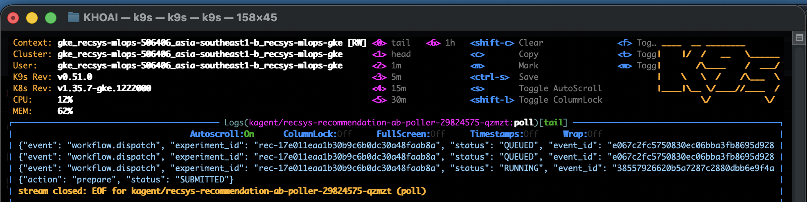

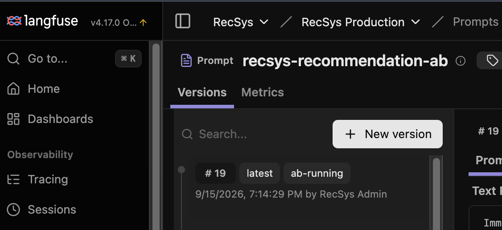

Core transition logic:

```python
if state.get("experiment_id") != experiment_id:
    if state["phase"] not in {"IDLE", "COMPLETED", "ROLLED_BACK"}:
        return {"status": "HOLD", "reason": "another experiment owns state"}
    if state.get("cleanup") and state["cleanup"].get("status") != "CLEANED":
        return {"status": "HOLD", "reason": "previous cleanup pending"}
    action = self.dispatch(experiment_id, "prepare")
    return {"status": action["status"], "action": "prepare"}
```

Source: [`controller.py` lines 301–325](../../../apps/agentic/llm_ab_router/controller.py#L301-L325).

## 5. Jenkins `prepare`: deploy at 0% and run offline `6/6`

Open the Jenkins executor UI through a local port-forward:

```bash
kubectl -n ci port-forward service/recsys-jenkins 18080:8080
```

In a second terminal:

```bash
open 'http://127.0.0.1:18080/job/RecSys-LLM-Agent-CD/'
```

Authenticate with the existing Jenkins account. Each row is a short build for one action; there is no long-running Jenkins orchestration loop.

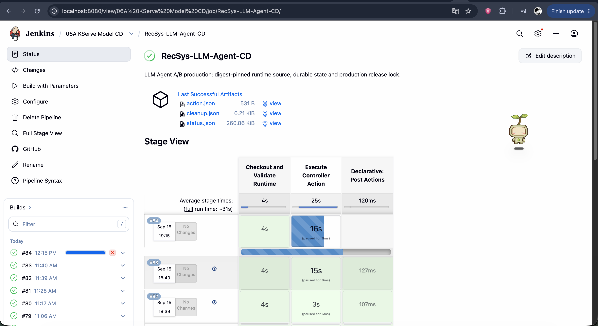

Every build validates the action identity and stale-state guards, then executes under the shared production lock:

```groovy
parameters {
  choice(name: 'ACTION', choices: ['prepare', 'route', 'promote', 'rollback', 'cleanup'])
  string(name: 'ACTION_KEY', defaultValue: '')
  string(name: 'EXPERIMENT_ID', defaultValue: '')
  string(name: 'EXPECTED_PHASE', defaultValue: '')
  string(name: 'EXPECTED_STATE_ETAG', defaultValue: '')
  choice(name: 'TARGET_WEIGHT', choices: ['', '0', '10', '50', '100'])
}

lock(resource: 'recsys-production-release') {
  sh '.llm-ab-venv/bin/python -m jenkins.python.llm_agent_cd.recommendation_action "$@"'
}
```

Source: [`LLMAgentCD.Jenkinsfile` lines 9–24 and 55–76](../../../jenkins/LLMAgentCD.Jenkinsfile#L9-L76).

The `prepare` action validates and deploys immutable control/candidate releases, leaves candidate allocation at 0%, and waits for exactly three offline cases on each model:

```python
self.driver.deploy(engine.state["baseline"])
self.driver.deploy(engine.state["pending"])
self.driver.verify_release(engine.state["baseline"])
self.driver.verify_release(engine.state["pending"])
engine.event("OFFLINE", stage_started=self.clock())

evidence = self.driver.offline(engine.state)
if evidence["verdict"] == "PASS":
    engine.event("OFFLINE_PASS", stage_started=self.clock())
```

Source: [`recommendation_action.py` lines 100–129](../../../jenkins/python/llm_agent_cd/recommendation_action.py#L100-L129). The finite offline Job is defined in [`offline.py` lines 113–140](../../../jenkins/python/llm_agent_cd/offline.py#L113-L140).

Inspect its logs:

```bash
kubectl -n kagent get job "ab-offline-$EXPERIMENT_ID" -o wide
kubectl -n kagent logs "job/ab-offline-$EXPERIMENT_ID" -c offline
```

Expected evidence before canary:

```bash
ab_state | jq '{phase, gate, offline, verified_weight}'
```

Expected values are `offline.total=6`, `offline.passed=6`, and then `verified_weight=10` after the next controller/Jenkins action.

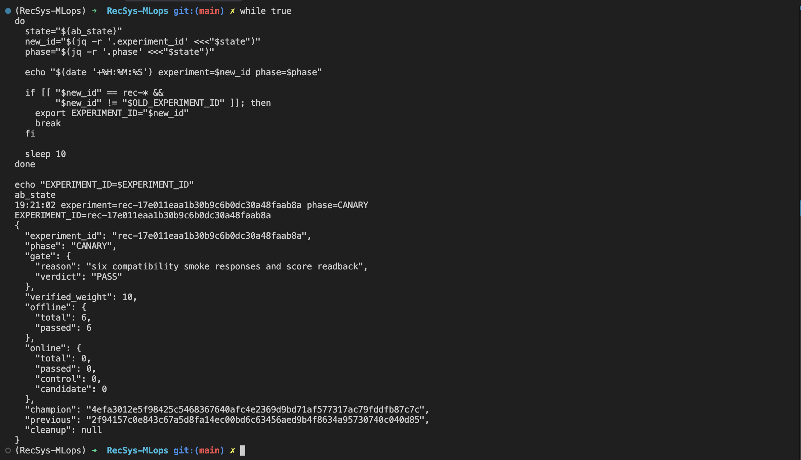

## 6. Start the one durable Traffic Job

The controller can route to CANARY before the traffic runner exists. In that state it correctly records `HOLD: awaiting traffic` and does not advance.

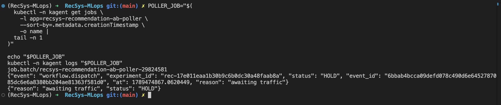

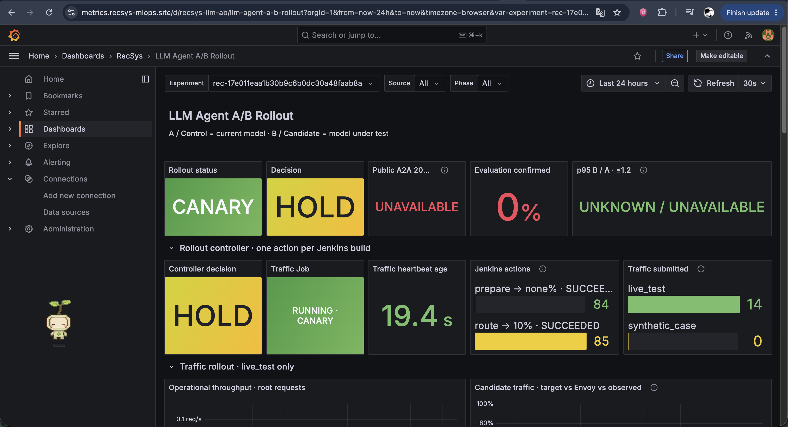

Start traffic once after `EXPERIMENT_ID` is known:

```bash
uv run python -m jenkins.python.llm_agent_cd.llm_ab_traffic start \
  --experiment-id "$EXPERIMENT_ID" \
  --entrypoint public-a2a \
  | tee "$RUN_DIR/traffic-job.json"

jq . "$RUN_DIR/traffic-job.json"
```

To create and immediately follow the log, use `--follow` instead of the command above. Do not run both forms:

```bash
uv run python -m jenkins.python.llm_agent_cd.llm_ab_traffic start \
  --experiment-id "$EXPERIMENT_ID" \
  --entrypoint public-a2a \
  --follow
```

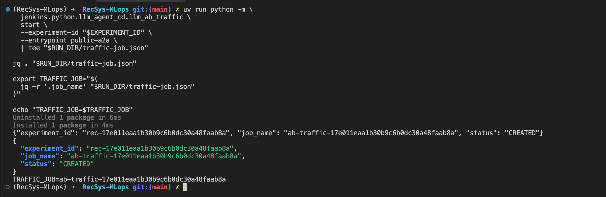

The Traffic Job is create-only, has no retry, runs for at most four hours, and receives no Kubernetes API token:

```python
"spec": {
    "backoffLimit": 0,
    "activeDeadlineSeconds": 4 * 60 * 60,
    "ttlSecondsAfterFinished": 24 * 60 * 60,
    "template": {
        "spec": {
            "restartPolicy": "Never",
            "serviceAccountName": "recsys-ab-traffic",
            "automountServiceAccountToken": False,
        }
    },
}
```

Source: [`llm_ab_traffic.py` lines 46–118](../../../jenkins/python/llm_agent_cd/llm_ab_traffic.py#L46-L118).

The request path is:

```text
Traffic Job
  -> https://agents.recsys-mlops.site/a2a/recommendation-ab/v1
  -> public DNS and TLS
  -> NGINX Basic Auth
  -> signed-ticket A2A edge
  -> private Recommendation router
  -> Istio gateway
  -> immutable control or candidate agent
```

The public Ingress uses an exact path, TLS, Basic Auth, and long A2A timeouts. See [`runtime.yaml` lines 109–138](../../../infra/helm/recsys-llm-ab/templates/runtime.yaml#L109-L138).

Follow the single Traffic Job for the rest of the experiment:

```bash
TRAFFIC_JOB="ab-traffic-${EXPERIMENT_ID#rec-}"
kubectl -n kagent get job "$TRAFFIC_JOB" -o wide
kubectl -n kagent logs -f "job/$TRAFFIC_JOB" -c traffic
```

## 7. CANARY: verify 10% candidate traffic

Wait for CANARY and inspect both the Kubernetes object and the Envoy data plane:

```bash
wait_phase CANARY
ab_state | jq '{phase, gate, verified_weight, route_revision}'
show_route
show_envoy
```

Expected allocation:

```text
control   90
candidate 10
```

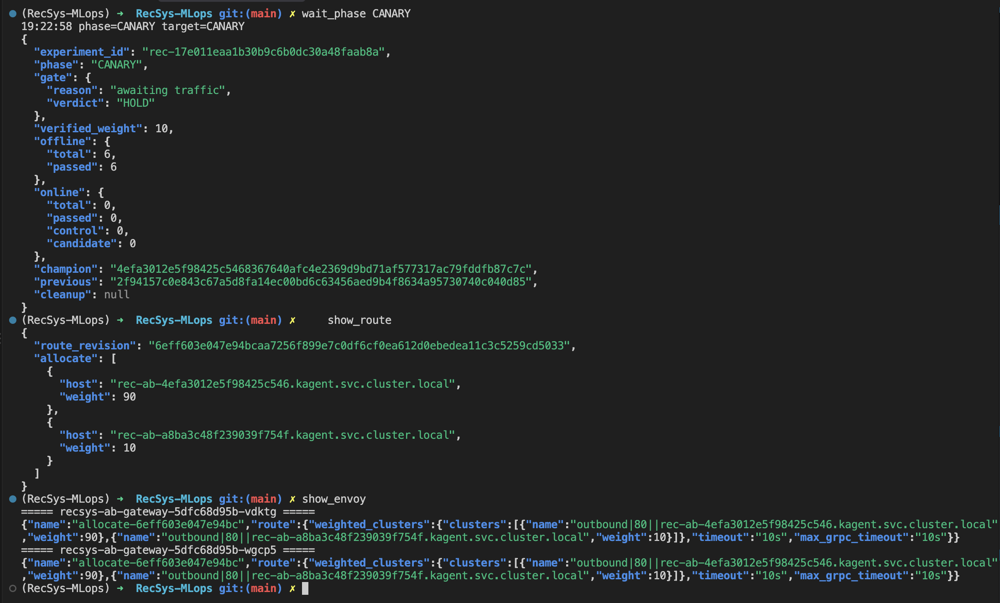

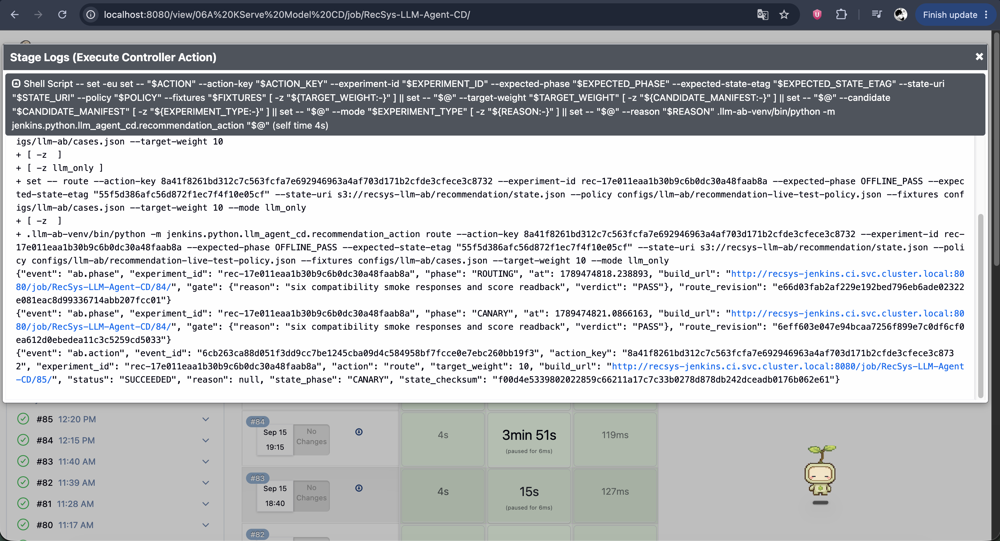

### How the controller passes CANARY

The frozen policy is:

```json
{
  "min_samples": 5,
  "window_seconds": 600,
  "stage_timeout_seconds": 3600,
  "latency_ratio": 1.2,
  "telemetry_max_age_seconds": 120,
  "sample_source": "live_test",
  "synthetic_entrypoint": "public_a2a"
}
```

Source: [`recommendation-live-test-policy.json`](../../../configs/llm-ab/recommendation-live-test-policy.json).

CANARY passes only when:

- The window has run for at least 600 seconds after Envoy verification.
- Both control and candidate have at least five completed `live_test` root requests.
- Telemetry is fresh and all required fields are finite.
- There are no timeout, runtime, A2A, MCP, or tool-contract failures.
- There is no observed organic-production hard failure.
- The Traffic Job exists, has a fresh heartbeat, and has no rejected or ambiguous request.

CANARY does not compare p95 between branches. The comparison is performed in the AB window.

Core gate code:

```python
for arm in arms:
    if stats["errors"] or stats["contract_failures"]:
        return "FAIL", _fault_reason(arm, stats)
    if stats["unknown"]:
        return "HOLD", f"{arm} missing contract evidence"
    if stats["count"] < policy["min_samples"]:
        return "HOLD", f"{arm} insufficient production samples"
return "PASS", "production gates satisfied"
```

Source: [`gates.py` lines 25–65](../../../jenkins/python/llm_agent_cd/gates.py#L25-L65).

When the mature gate is PASS and live requests are drained, the controller registers one `route 50` action:

```python
if phase == "CANARY":
    return "route", 50
```

Source: [`controller.py` lines 40–52](../../../apps/agentic/llm_ab_router/controller.py#L40-L52).

## 8. AB: verify 50%, exactly 20 public cases, and deterministic evaluation

Wait for the AB phase and inspect the route:

```bash
wait_phase AB
ab_state | jq '{phase, gate, verified_weight, route_revision, online}'
show_route
show_envoy
```

Expected allocation:

```text
control   50
candidate 50
```

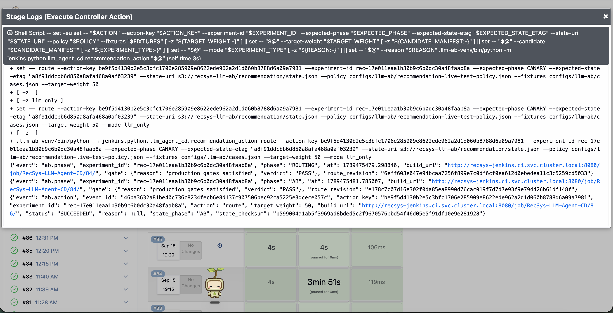

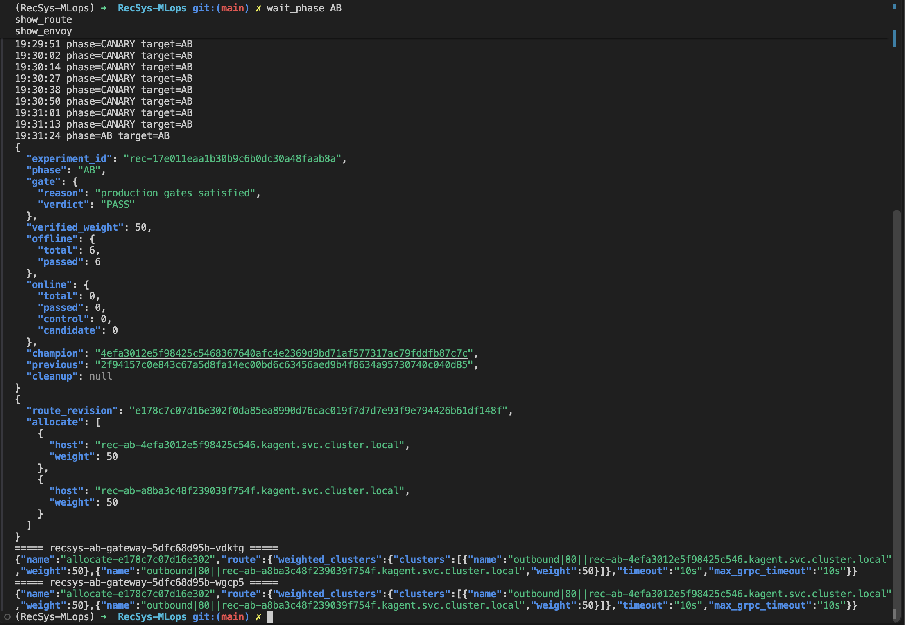

The same Traffic Job first drains CANARY live traffic, then sends the frozen suite exactly once. It spaces cases by at least ten seconds, uses TLS verification, and has HTTP retries disabled:

```python
if state.get("phase") != "AB":
    raise ValueError("public case runner requires Recommendation AB phase")
if len(fixtures) != 20 or len({case["id"] for case in fixtures}) != 20:
    raise ValueError("public case runner requires exactly 20 unique fixtures")

for case, ticket_claims in zip(fixtures, claims):
    db.mark_ticket_intent(state["experiment_id"], case["id"])
    response = http.post(
        url,
        json=_body(ticket_claims["request_id"], case["prompt"]),
        headers={"X-RecSys-AB-Ticket": sign(ticket_claims, key)},
    )
```

Source: [`external_cases.py` lines 35–168](../../../jenkins/python/llm_agent_cd/external_cases.py#L35-L168).

Watch progress without creating new traffic:

```bash
kubectl -n kagent logs -f "job/$TRAFFIC_JOB" -c traffic \
  | jq -Rr 'fromjson?
      | select(.event == "ab.external_case")
      | [.case_id, .status, .latency_seconds]
      | @tsv'
```

Count completed public cases from the same log:

```bash
kubectl -n kagent logs "job/$TRAFFIC_JOB" -c traffic \
  | jq -Rr 'fromjson?
      | select(.event == "ab.external_case" and .status == "COMPLETED")
      | .case_id' \
  | sort -u \
  | wc -l
```

The expected count is exactly `20`. No replacement case is generated for an ambiguous response, and the random Istio assignment is not topped up to force a 10/10 split.

The evaluator CronJob drains the durable outbox and confirms deterministic scores through Langfuse:

```bash
EVAL_JOB="$(latest_cronjob_job recsys-recommendation-evaluation)"
printf 'EVAL_JOB=%s\n' "$EVAL_JOB"
kubectl -n kagent logs "job/$EVAL_JOB" -c evaluator

ab_state | jq '{phase, gate, online}'
```

The score writer uses deterministic IDs and treats an asynchronously invisible score as pending, not success:

```python
for payload in score_payloads(result, row["metadata"]):
    try:
        sync.confirm(payload)
    except ValueError as exc:
        if str(exc) != "score_not_visible":
            raise
        pending = True

if pending:
    raise ValueError("score_not_visible")
```

Source: [`evaluation_job.py` lines 50–101](../../../apps/agentic/llm_ab_router/evaluation_job.py#L50-L101).

### How the controller passes AB

All CANARY operational conditions still apply, plus:

- Exactly 20 ticket records and exactly 20 terminal public root responses exist.
- All 20 fixture assertions have deterministic PASS verdicts.
- Every evaluation uses the frozen evaluator version and is confirmed in Langfuse.
- Each branch received at least five of the 20 cases.
- Candidate p95 is no greater than `1.2 × control p95` in the same closed AB `live_test` window.
- Missing trace, score, metric, or stale telemetry is HOLD, never zero or PASS.

```python
if len(cases) != 20:
    return "HOLD", "exactly 20 cases required"
if any(row.get("verdict") == "FAIL" for row in cases.values()):
    return "FAIL", "synthetic assertion failed"
if min(counts.values()) < 5:
    return "HOLD", "insufficient per-arm synthetic samples; no top-up"

if candidate_p95 > control_p95 * policy["latency_ratio"]:
    return "FAIL", "candidate latency regression"
```

Source: [`gates.py` lines 56–88](../../../jenkins/python/llm_agent_cd/gates.py#L56-L88).

The controller stores the frozen gate snapshot, records the latency limit from the control window, and then dispatches one route-100 action:

```python
if phase == "AB":
    fields["latency_limit"] = (
        observation["champion"]["p95"] * state["policy"]["latency_ratio"]
    )
dispatched = self.dispatch(experiment_id, action, target_weight=weight)
```

Source: [`controller.py` lines 342–370](../../../apps/agentic/llm_ab_router/controller.py#L342-L370).

### Grafana evidence during the 20-case run

The dashboard intentionally shows HOLD while the finite suite or score confirmation is incomplete:

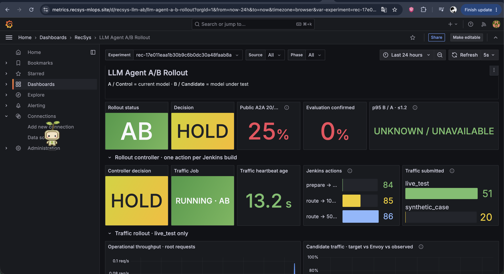

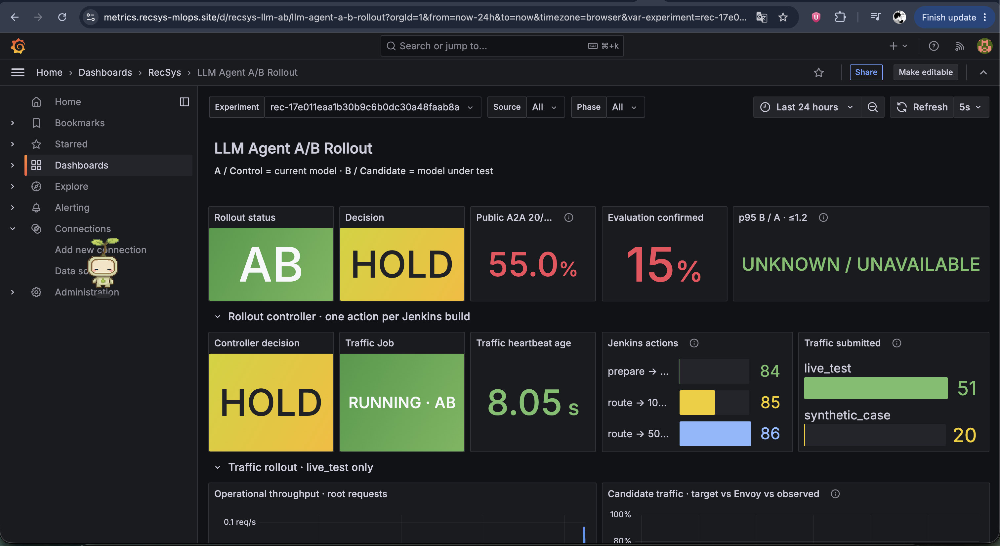


The in-progress dashboard eventually showed all public cases and evaluations complete, with a then-current p95 ratio of `1.15`:

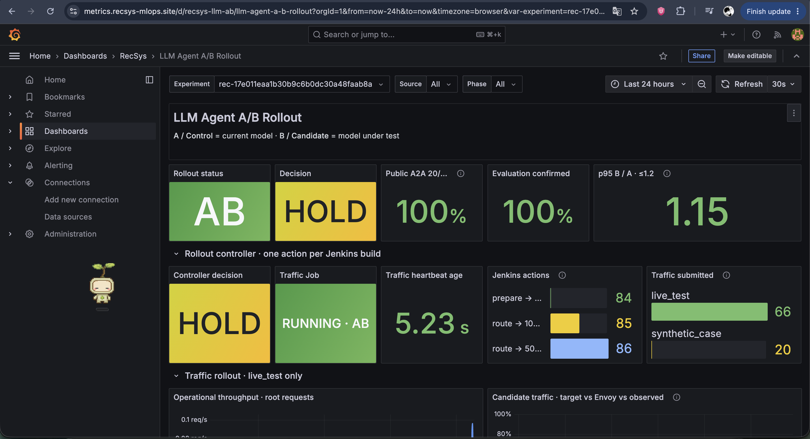

The observed random case split was 11 control and 9 candidate:

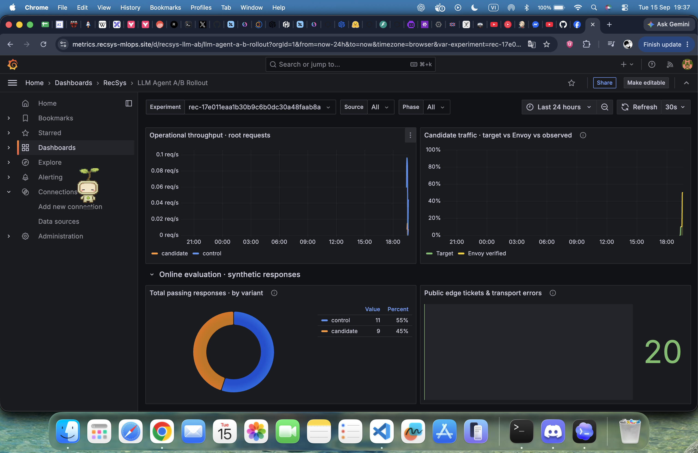

The dashboard also exposes operational latency and error families:

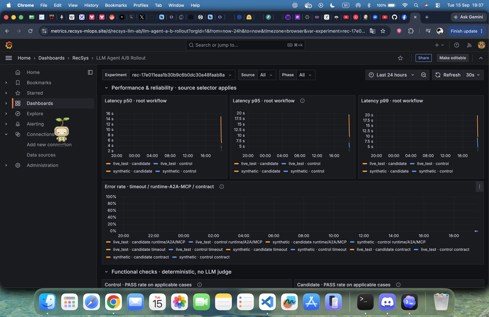

The raw deterministic functional metrics are visible for both branches. A missing applicable case is rendered as `N/A — 0 applicable`, not as PASS:

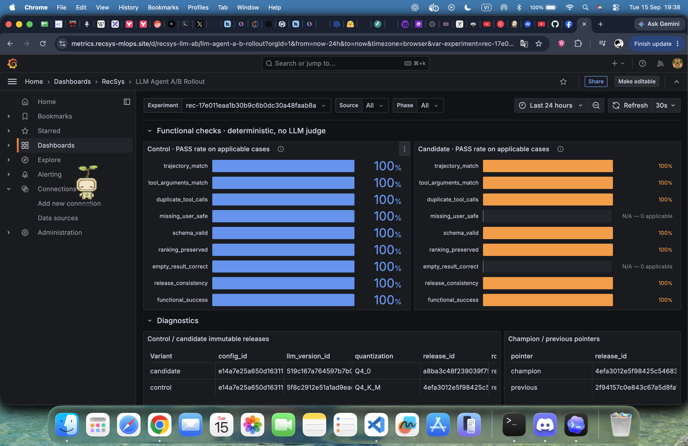

Release identities, quantization, champion/previous pointers, CPU, and memory remain available in the collapsed diagnostics section:

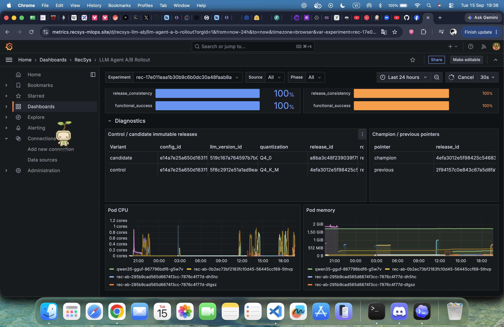

Dashboard source: [`dashboard.py` lines 278–440](../../../jenkins/python/llm_agent_cd/dashboard.py#L278-L440).

## 9. VERIFY: verify 100% candidate and promote

For a passing experiment, wait for VERIFY and prove that both the desired route and every Envoy contain 100% candidate traffic for new sessions:

```bash
wait_phase VERIFY
ab_state | jq '{phase, gate, verified_weight, route_revision, online}'
show_route
show_envoy
```

Expected allocation for a passing run:

```text
candidate 100
```

The Jenkins route action always writes an intent before changing Istio, waits until the route is present in every ready gateway, and only then commits the new phase and verified weight:

```python
engine.event(
    "ROUTING",
    route_intent={"weight": weight, "next_phase": target_phase},
    stage_started=self.clock(),
)
revision = self.driver.route(engine.state, weight)
while not self.driver.verify_route(engine.state, weight, revision):
    if time.monotonic() >= deadline:
        raise TimeoutError("Envoy propagation timeout")
engine.event(
    target_phase,
    route_revision=revision,
    verified_weight=weight,
    stage_started=self.clock(),
)
```

Source: [`recommendation_action.py` lines 131–150](../../../jenkins/python/llm_agent_cd/recommendation_action.py#L131-L150).

The rendered Istio route uses weights and explicitly disables request retry:

```python
weighted = [
    {"destination": destination(baseline), "weight": 100 - weight},
    {"destination": destination(candidate), "weight": weight},
]
spec["http"].append({
    "name": "allocate",
    "match": [{"uri": {"exact": "/allocate"}}],
    "route": [r for r in weighted if r["weight"] > 0],
    "retries": {"attempts": 0},
    "timeout": "10s",
})
```

Source: [`manifests.py` lines 264–275](../../../jenkins/python/llm_agent_cd/manifests.py#L264-L275).

`Driver.verify_route` reads `config_dump` from every ready gateway and sends a pinned identity request to each release before accepting the route. See [`driver.py` lines 647–698](../../../jenkins/python/llm_agent_cd/driver.py#L647-L698).

VERIFY passes after at least ten minutes, at least five completed candidate `live_test` roots, fresh telemetry, and zero runtime or contract failure. Control samples are not required at 100%. When the mature gate passes, the controller dispatches `promote`:

```python
if phase == "CANARY":
    return "route", 50
if phase == "AB":
    return "route", 100
return "promote", None
```

Source: [`controller.py` lines 40–52](../../../apps/agentic/llm_ab_router/controller.py#L40-L52).

Promotion rechecks the 100% candidate route before changing the pointers:

```python
if engine.state.get("verified_weight") != 100:
    raise ValueError("candidate route is not verified at 100%")
self.driver.verify_release(engine.state["pending"])
if not self.driver.verify_route(engine.state, 100, engine.state["route_revision"]):
    raise ValueError("route drift before promotion")
engine.event(
    "COMPLETED",
    champion=engine.state["pending"],
    previous=engine.state["baseline"],
)
```

Source: [`recommendation_action.py` lines 152–162](../../../jenkins/python/llm_agent_cd/recommendation_action.py#L152-L162).

### Capture the missing 100% candidate evidence on a passing run

The included evidence experiment failed before route-100, so it would be incorrect to reuse its rollback screenshot as 100% candidate evidence. On the next passing run, use:

```bash
VERIFY_DASHBOARD="https://metrics.recsys-mlops.site/d/recsys-llm-ab/llm-agent-a-b-rollout?orgId=1&from=now-24h&to=now&var-experiment=${EXPERIMENT_ID}&var-source=%2E%2A&var-phase=VERIFY&refresh=5s"
open "$VERIFY_DASHBOARD"

show_route
show_envoy

screencapture -i "docs/pngs/llm-ab-${EXPERIMENT_ID}-verify-100-candidate.png"
```

Do not capture until `ab_state.verified_weight` is `100` and all Envoys show the candidate route.

## 10. Terminal outcome A: COMPLETED, promote, and cleanup

For a successful run:

```bash
wait_phase COMPLETED
ab_state | jq '{phase, gate, verified_weight, champion, previous, cleanup}'

while [ "$(ab_state | jq -r '.cleanup')" != "CLEANED" ]; do
  sleep 10
done

ab_state
kubectl -n kagent wait --for=condition=complete \
  "job/$TRAFFIC_JOB" --timeout=300s
```

Expected result:

- `phase=COMPLETED`.
- `verified_weight=100`.
- The candidate becomes `champion` and the old control becomes `previous`.
- Terminal cleanup becomes `CLEANED`.
- Langfuse moves the candidate from `ab-running` to `ab-done`.
- There is no post-promotion monitor stage.

Capture the final successful evidence:

```bash
COMPLETED_DASHBOARD="https://metrics.recsys-mlops.site/d/recsys-llm-ab/llm-agent-a-b-rollout?orgId=1&from=now-24h&to=now&var-experiment=${EXPERIMENT_ID}&var-source=%2E%2A&var-phase=%2E%2A&refresh=30s"
open "$COMPLETED_DASHBOARD"
screencapture -i "docs/pngs/llm-ab-${EXPERIMENT_ID}-completed.png"
```

## 11. Terminal outcome B: verified rollback and cleanup

Any hard functional or operational failure, or a 60-minute stage timeout, causes the controller to dispatch `rollback`. Jenkins routes 100% of new sessions to the baseline, verifies Envoy and baseline readiness, and only then records `ROLLED_BACK`.

The evidence run followed this path because the final frozen p95 ratio was about `1.23`, above the `1.2` limit:

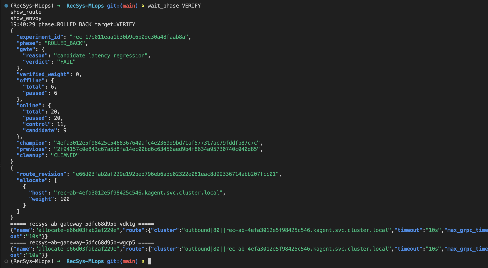

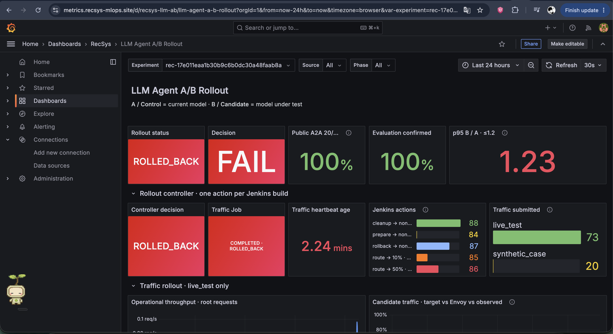

Inspect a rollback safely:

```bash
ab_state | jq '{phase, gate, verified_weight, champion, previous, cleanup}'
show_route
show_envoy

kubectl -n kagent logs "job/$TRAFFIC_JOB" -c traffic --tail=100
```

Expected rollback evidence:

- `phase=ROLLED_BACK`, not `ROLLBACK_FAILED`.
- `verified_weight=0` because candidate weight is zero.
- The baseline/champion receives 100% of new sessions.
- The champion pointer has not changed.
- The failed candidate is disabled until an explicit Recommendation retry prepares it again at 0%.

## 12. Terminal cleanup and capacity reclamation

After either `COMPLETED` or `ROLLED_BACK`, the controller dispatches a separate cleanup build. Cleanup closes test sessions, removes obsolete release pin routes, verifies the new Envoy configuration, and scales unused adapters/backends to zero while preserving manifests and evidence.

```python
sessions = self.driver.retire_terminal_sessions(self.state.get("disabled", []))
revision = self.driver.route(self.state, self.state["verified_weight"])
if not self.driver.verify_route(self.state, self.state["verified_weight"], revision):
    raise RuntimeError("cleanup route was not acknowledged by every ready gateway")
capacity = self.driver.retire_release_capacity(retired, protected_llms)
evidence = {
    "status": "CLEANED",
    "capacity": capacity,
    "manifests_retained": True,
    "evidence_retained": True,
    "inference_requests": 0,
}
```

Source: [`cleanup.py` lines 74–159](../../../jenkins/python/llm_agent_cd/cleanup.py#L74-L159).

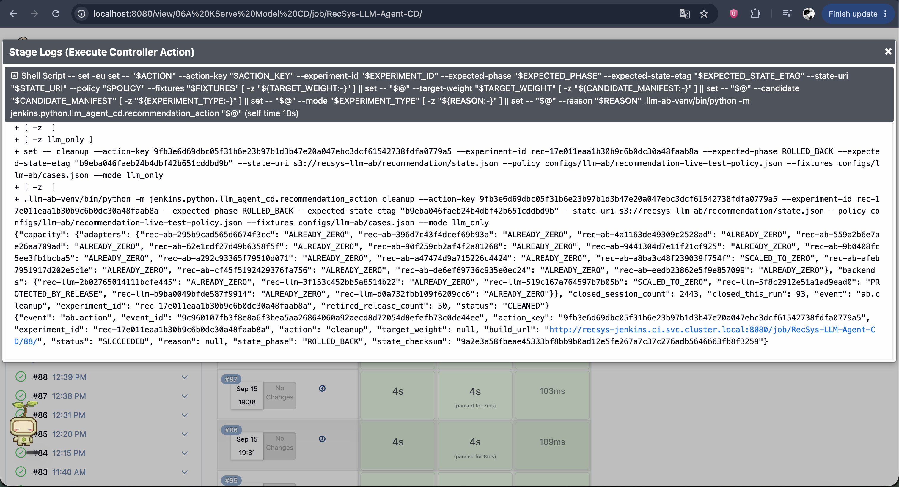

Check that stale release capacity is no longer running:

```bash
kubectl -n kagent get deployment \
  -l recsys.ai/owner=llm-agent-cd \
  -o custom-columns='NAME:.metadata.name,DESIRED:.spec.replicas,READY:.status.readyReplicas'

ab_state | jq '{phase, cleanup}'
```

After verified rollback and cleanup, Langfuse records the terminal pointer as `ab-fail`:

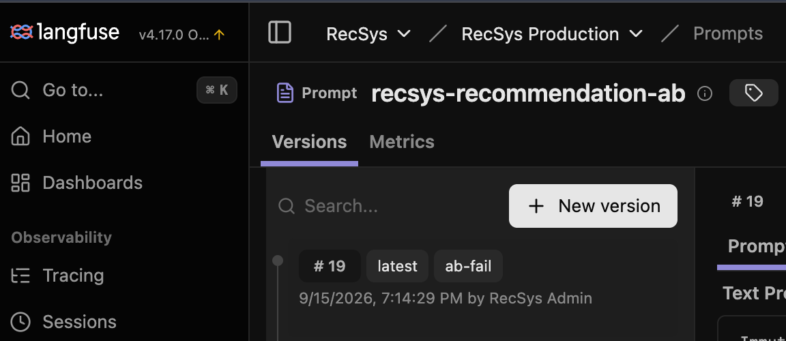

## 13. Grafana inspection and screenshot procedure

Open the production dashboard for the current experiment with all sources and a 24-hour range:

```bash
DASHBOARD="https://metrics.recsys-mlops.site/d/recsys-llm-ab/llm-agent-a-b-rollout?orgId=1&from=now-24h&to=now&var-experiment=${EXPERIMENT_ID}&var-source=%2E%2A&var-phase=%2E%2A&refresh=5s"
open "$DASHBOARD"
```

For each stage, verify and capture in this order:

| Stage | Required state | Route proof | Dashboard proof |
|---|---|---|---|
| PREPARE/OFFLINE | Offline `6/6` | Candidate remains at 0% | Jenkins prepare action and offline evidence |
| CANARY | `phase=CANARY`, `verified_weight=10` | 90/10 in `show_route` and every `show_envoy` block | Controller, Traffic Job, live samples, errors |
| AB | `phase=AB`, `verified_weight=50` | 50/50 in desired and Envoy routes | Public A2A progress, evaluation confirmation, 11/9 or other valid random split, p95 |
| VERIFY | `phase=VERIFY`, `verified_weight=100` | Candidate-only route in desired and Envoy routes | Candidate live samples, fresh telemetry, zero failures |
| COMPLETED | Promoted pointers and `CLEANED` | Candidate remains the 100% champion | PASS, champion/previous, action timeline |
| ROLLED_BACK | `verified_weight=0`, `CLEANED` | Baseline-only route | FAIL reason, rollback and cleanup actions |

Suggested capture commands for a new evidence set:

```bash
screencapture -i "docs/pngs/llm-ab-${EXPERIMENT_ID}-canary-10.png"
screencapture -i "docs/pngs/llm-ab-${EXPERIMENT_ID}-ab-50.png"
screencapture -i "docs/pngs/llm-ab-${EXPERIMENT_ID}-verify-100.png"
screencapture -i "docs/pngs/llm-ab-${EXPERIMENT_ID}-terminal.png"
```

Do not rely on a rolling Grafana value alone. Pair every screenshot with `ab_state`, `show_route`, and `show_envoy`. The controller gate uses an immutable closed-window snapshot; the dashboard time series is exploratory.

## 14. Log commands by stage

### Controller CronJob

```bash
POLL_JOB="$(latest_cronjob_job recsys-recommendation-ab-poller)"
kubectl -n kagent get job "$POLL_JOB" -o wide
kubectl -n kagent logs "job/$POLL_JOB" --all-containers
```

### Offline compatibility Job

```bash
kubectl -n kagent get job "ab-offline-$EXPERIMENT_ID" -o wide
kubectl -n kagent logs "job/ab-offline-$EXPERIMENT_ID" -c offline
```

### Long-lived Traffic Job

```bash
TRAFFIC_JOB="ab-traffic-${EXPERIMENT_ID#rec-}"
kubectl -n kagent get job "$TRAFFIC_JOB" -o wide
kubectl -n kagent logs -f "job/$TRAFFIC_JOB" -c traffic
```

### Evaluation CronJob

```bash
EVAL_JOB="$(latest_cronjob_job recsys-recommendation-evaluation)"
kubectl -n kagent get job "$EVAL_JOB" -o wide
kubectl -n kagent logs "job/$EVAL_JOB" -c evaluator
```

### Public edge, private router, and Istio gateway

```bash
kubectl -n kagent logs \
  -l app=recsys-ab-edge \
  -c edge \
  --prefix \
  --since=30m

kubectl -n kagent logs \
  -l app=recsys-ab-router \
  -c router \
  --prefix \
  --since=30m

kubectl -n kagent logs \
  -l istio=recsys-ab-gateway \
  -c istio-proxy \
  --prefix \
  --since=30m
```

### All A/B Jobs and terminal status

```bash
kubectl -n kagent get jobs --sort-by=.metadata.creationTimestamp \
  | grep -E 'recsys-recommendation-ab-poller|recsys-recommendation-evaluation|ab-offline|ab-traffic'

kubectl -n kagent get pod \
  -l "recsys.ai/experiment-id=$EXPERIMENT_ID" \
  -o wide

ab_state
```

### Jenkins action logs

```bash
kubectl -n ci port-forward service/recsys-jenkins 18080:8080
```

Then open:

```bash
open 'http://127.0.0.1:18080/job/RecSys-LLM-Agent-CD/'
```

For the selected experiment, the expected successful action sequence is:

```text
prepare -> route 10 -> route 50 -> route 100 -> promote -> cleanup
```

The expected fail-closed sequence before route 100 is:

```text
prepare -> route 10 -> route 50 -> rollback -> cleanup
```

The evidence run used the second sequence.

## 15. What each component is allowed to do

| Component | Reads gates | Changes Istio | Sends traffic | Changes champion |
|---|---:|---:|---:|---:|
| Langfuse UI/API | No | No | No | No |
| Controller CronJob | Yes | No | No | No |
| Jenkins executor | No | Yes, for one authorized action | No | Only for authorized `promote` |
| Traffic Job | No | No | Yes | No |
| Evaluation CronJob | No | No | No inference; score sync only | No |

This boundary is enforced in the implementation:

- `gate_decision` maps `CANARY → 50`, `AB → 100`, and `VERIFY → promote` in [`controller.py`](../../../apps/agentic/llm_ab_router/controller.py#L40-L52).
- Jenkins rejects an unregistered action, stale ETag, wrong phase, or wrong next weight in [`recommendation_action.py`](../../../jenkins/python/llm_agent_cd/recommendation_action.py#L70-L98).
- The Traffic Job only observes phase and emits traffic in [`llm_ab_traffic.py`](../../../jenkins/python/llm_agent_cd/llm_ab_traffic.py#L235-L305).
- Istio route rendering sets `retries.attempts=0` in [`manifests.py`](../../../jenkins/python/llm_agent_cd/manifests.py#L246-L275).

## 16. Final acceptance checklist

A successful production proof is complete only when all of the following are true:

- Candidate registration returned `REGISTERED` or `READY` and generated an unmodified Langfuse config.
- Exactly one Langfuse version was assigned `ab-ready`, then claimed as `ab-running`.
- The controller created one Jenkins build per action and no duplicate action key.
- Offline compatibility is `6/6`.
- Exactly one durable Traffic Job exists for the experiment.
- CANARY was observed for at least ten minutes with verified 10% candidate traffic.
- AB was observed for at least ten minutes with verified 50% candidate traffic.
- Exactly 20 signed public A2A cases completed, with no retry or top-up.
- Both branches received at least five cases.
- All 20 deterministic functional evaluations passed and all 20 Langfuse score records were confirmed.
- The frozen AB p95 candidate/control ratio is at most `1.2`.
- VERIFY was observed for at least ten minutes with verified 100% candidate traffic and at least five candidate live-test roots.
- Promotion changed champion/previous only after the 100% route was reverified.
- Cleanup is `CLEANED` and unused candidate capacity is scaled to zero when appropriate.
- Langfuse ends at `ab-done` for promotion or `ab-fail` for verified rollback.
- Grafana screenshots are paired with state, desired route, Envoy route, and Jenkins evidence for the same experiment ID and time window.

Twenty deterministic responses prove functional acceptance, not statistical superiority over real users.
