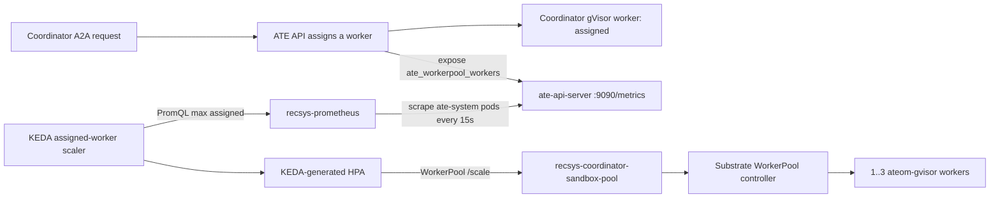
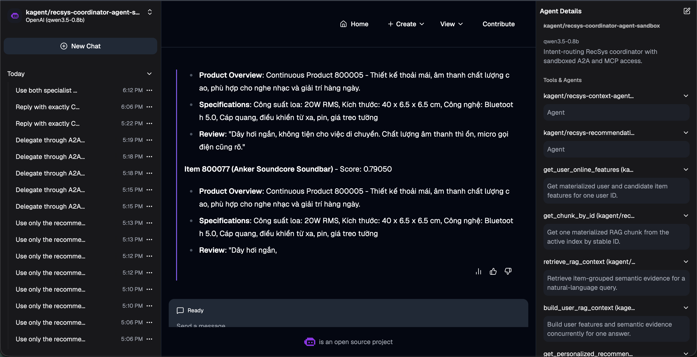

# Coordinator Agent with A2A, MCP, Multi-Replica Runtime, and Governance

`recsys-coordinator-agent-sandbox` is a declarative Go `SandboxAgent` running
on Agent Substrate in the `kagent` namespace. It classifies each request and
routes it to the smallest set of specialist agents or MCP tools required to
produce a grounded answer.

```text
kagent Chat UI / sandbox A2A client
              |
              v
SandboxAgent/recsys-coordinator-agent-sandbox
  |-- WorkerPool --> recsys-coordinator-sandbox-pool (1..3)
  |-- A2A --------> recsys-context-agent-sandbox
  |-- A2A --------> recsys-recommendation-agent-sandbox
  |-- MCP --------> recsys-feature-rag-mcp
  `-- MCP --------> recsys-recommendation-mcp
```

The current production runtime uses Substrate `0.0.11`, the native WorkerPool
`/scale` subresource, and the custom kagent compatibility image
`0.10.0-e6df917-substrate0011-v8`. The model configuration revision is
`substrate-0.0.11-kagent-e6df917-assigned-workers-v22`.

## 1. Agent Uses MCP with a Multi-Replica Autoscaled Runtime

### 1.1 Declarative A2A and MCP providers

The Coordinator is a declarative `SandboxAgent`; it does not require a custom
agent container image. Its two `Agent` providers expose the Context and
Recommendation SandboxAgents as isolated A2A tools. Its two `McpServer`
providers reuse the canonical `RemoteMCPServer` resources. The chart does not
duplicate either MCP server or its authentication Secret.

```yaml
apiVersion: kagent.dev/v1alpha3
kind: SandboxAgent
metadata:
  name: recsys-coordinator-agent-sandbox
  namespace: kagent
spec:
  type: Declarative
  substrate:
    workerPoolRef:
      apiGroup: ate.dev
      kind: WorkerPool
      name: recsys-coordinator-sandbox-pool
  declarative:
    runtime: go
    modelConfig: default-model-config
    stream: false
    a2aConfig:
      skills:
        - id: coordinated-personalized-recommendation
          name: Coordinated personalized recommendation
          description: >-
            Route recommendation and grounded context work to the appropriate
            RecSys specialists.
          tags: [recsys, coordinator, recommendation, rag, sandbox]
          examples:
            - >-
              Recommend three items for user 1001 and explain them with
              grounded evidence.
    tools:
      - type: Agent
        isolateSessions: true
        agent:
          apiGroup: kagent.dev
          kind: SandboxAgent
          name: recsys-context-agent-sandbox
      - type: Agent
        isolateSessions: true
        agent:
          apiGroup: kagent.dev
          kind: SandboxAgent
          name: recsys-recommendation-agent-sandbox
      - type: McpServer
        mcpServer:
          apiGroup: kagent.dev
          kind: RemoteMCPServer
          name: recsys-feature-rag-mcp
          toolNames: [get_chunk_by_id]
      - type: McpServer
        mcpServer:
          apiGroup: kagent.dev
          kind: RemoteMCPServer
          name: recsys-recommendation-mcp
          toolNames: [get_personalized_recommendations]
```

`a2aConfig.skills` publishes the Coordinator's inbound A2A capability in its
Agent Card. The two `tools` entries with `type: Agent` configure outbound A2A
delegation to the specialist SandboxAgents. `isolateSessions: true` gives every
delegation a fresh child A2A context instead of reusing parent or earlier child
state.

The Coordinator's model context combines its routing prompt with the A2A and
MCP providers bound by the `SandboxAgent`:

```text
systemMessage
  + allowed toolNames
  + MCP tools/list description
  + generated inputSchema
  -> model tool context
```

The `Agent` entries above are A2A delegation tools generated from the two
specialist SandboxAgents. They are distinct from the two direct `McpServer`
tools: `get_chunk_by_id` and `get_personalized_recommendations`. The following
core excerpt is copied verbatim from the current Coordinator `systemMessage`;
the linked values file contains the full routing and partial-result policy.

```text
You are the RecSys coordinator agent. Route each request to the smallest
set of specialist agents or MCP tools that can answer it correctly.

For user preference, feature, product evidence, exact chunk, or semantic
RAG requests, delegate to the context agent. For ranked recommendation
requests, delegate to the recommendation agent. For a composite request
that needs both ranking and grounded explanation, call both agents and
combine their results without changing the recommendation order. For every
composite request, call the Recommendation Agent first. After it returns,
your next function call MUST be the Context Agent; never emit a final answer
after only one specialist. Give Context the user_id, the returned item IDs,
query="recommended items", top_k=2, top_k_items=2, and filters=null, and
instruct it to call build_user_rag_context exactly once.
A composite request has exactly two specialist calls total: Recommendation
exactly once, then Context exactly once. After the Context Agent returns,
you MUST NOT call any agent or MCP tool again. Immediately produce the final
answer from those two responses. If the Context response is incomplete or
unusable, keep the Recommendation result and label Context unavailable;
never retry Context and never replace it with a direct MCP call.
```

The direct-call boundary is also explicit in the runtime prompt:

```text
Call MCP tools directly only when the user explicitly names a tool, asks
for raw data, or requests independent verification. Do not call an MCP
tool for the same purpose after a specialist has already returned enough
information. When direct MCP tools are required, copy explicit arguments
exactly and call every named tool. Do not start a second independent
invocation of a dependency after its first invocation has completed with
usable data. A2A protocol continuation of the same child task is allowed.
```

For its two direct MCP bindings, FastMCP supplies these descriptions and
generates the corresponding input schemas from the annotated argument types.
Executable bodies are omitted from the documentation excerpt.

```python
@mcp.tool()
async def get_chunk_by_id(chunk_id: ChunkId) -> dict[str, Any]:
    """Get one materialized RAG chunk from the active index by stable ID."""
    ...

@mcp.tool()
async def get_personalized_recommendations(
    user_id: UserId,
    candidate_item_ids: CandidateItemIds = None,
    top_k: TopK = 10,
) -> dict[str, object]:
    """Get model-ranked Top-K items without changing order or scores.

    Args:
        user_id: Required positive integer copied from the user's request.
        candidate_item_ids: Optional list of 1-500 candidate item IDs, or null.
        top_k: Requested result count from 1-100; defaults to 10.

    Always provide ``user_id`` in the tool arguments. For example, a request
    for three items for user 1001 uses ``{"user_id": 1001, "top_k": 3}``.
    """
    ...
```

The Context specialist's complete four-tool catalog is documented in
[Agent Pull Data](agent_pull_data.md#system-prompt-and-mcp-tool-context); the
Coordinator intentionally binds only `get_chunk_by_id` from that server.

The Coordinator preserves recommendation order, score, model version, and
experiment metadata. It does not perform LLM reranking. Grounded evidence
cites returned `chunk_id` values. The compatibility runtime and v22 prompt
enforce exact tool-call counts, preserve valid tool results across model
retries, and retain the Recommendation result when Context is unavailable.

Sandbox egress is limited to the A2A proxy and the two MCP service FQDNs:

```yaml
sandbox:
  network:
    allowedDomains:
      - kagent-controller.kagent
      - recsys-feature-rag-mcp.kagent.svc.cluster.local
      - recsys-recommendation-mcp.kagent.svc.cluster.local
```

References:

- [Coordinator SandboxAgent template (line 10)](../../../infra/helm/recsys-coordinator-agent/templates/sandboxagent.yaml#L10)
- [Complete Coordinator system prompt, network allow-list, and providers (line 8)](../../../infra/helm/recsys-coordinator-agent/values.yaml#L8)
- [Context MCP direct-tool description and schema types](../../../apps/agentic/recsys-feature-rag-mcp/src/recsys_feature_rag_mcp/server.py#L93)
- [Recommendation MCP direct-tool description and schema types](../../../apps/agentic/recsys-recommendation-mcp/src/recsys_recommendation_mcp/server.py#L40)
- [Machine-readable tool contract (line 3)](../../../configs/agentic/recsys-coordinator-agent/tools-contract.json#L3)

### 1.2 Dedicated gVisor WorkerPool

The Coordinator has a dedicated WorkerPool, so orchestration load does not
consume workers assigned to the Context or Recommendation agents. Terraform
owns immutable runtime fields and leaves `.spec.replicas` to KEDA through the
native Substrate `0.0.11` WorkerPool `/scale` subresource.

```hcl
resource "kubernetes_manifest" "recsys_coordinator_sandbox_pool" {
  manifest = {
    apiVersion = "ate.dev/v1alpha1"
    kind       = "WorkerPool"
    metadata = {
      name      = "recsys-coordinator-sandbox-pool"
      namespace = "kagent"
    }
    spec = {
      replicas     = 1
      ateomImage   = "ghcr.io/kagent-dev/substrate/ateom-gvisor:v0.0.11"
      sandboxClass = "gvisor"
    }
  }

  computed_fields = ["spec.replicas"]
}
```

The scalable unit is the WorkerPool and its generated gVisor Deployment. The
declarative `SandboxAgent` remains one Kubernetes custom resource.

Reference: [Terraform coordinator WorkerPool (line 386)](../../../infra/terraform/gcp/modules/kubernetes-platform/kagent.tf#L386).

### 1.3 Coordinator SandboxAgent autoscaling stages

Production selects `metricMode: assignedWorkers`. The `cpu` value in the base
values file is retained only as a values-based rollback path; the rendered GCP
ScaledObject uses `ate_workerpool_workers`.



#### Stage 1: Coordinator A2A sessions assign gVisor workers

The declarative Coordinator `SandboxAgent` remains a single agent profile. Its
`workerPoolRef` selects the dedicated runtime pool; each incoming session makes
ATE transition one registered worker from `idle` to `assigned`.

```yaml
apiVersion: kagent.dev/v1alpha3
kind: SandboxAgent
spec:
  substrate:
    workerPoolRef:
      apiGroup: ate.dev
      kind: WorkerPool
      name: recsys-coordinator-sandbox-pool
```

References:

- [Coordinator SandboxAgent binding](../../../infra/helm/recsys-coordinator-agent/templates/sandboxagent.yaml#L17)
- [Dedicated Coordinator WorkerPool](../../../infra/terraform/gcp/modules/kubernetes-platform/kagent.tf#L371)

#### Stage 2: `ate-api-server` exposes and Prometheus scrapes worker state

Worker pods do not expose the aggregate assigned-worker gauge themselves.
`ate-api-server` owns the centralized worker registry. The upstream Substrate
chart annotates its pod template for Prometheus on port `9090`; with no path
override, Prometheus uses `/metrics`.

```yaml
# live ate-api-server pod template rendered by the Substrate chart
annotations:
  prometheus.io/scrape: "true"
  prometheus.io/port: "9090"
containers:
  - name: ate-api-server
    ports:
      - name: prometheus
        containerPort: 9090

# recsys-prometheus target and shared annotation-based scrape job
targets:
  substrateNamespace: ate-system
scrape_configs:
  - job_name: recsys-kubernetes-pods
    kubernetes_sd_configs:
      - role: pod
        namespaces:
          names: [ate-system]
    relabel_configs:
      - source_labels: [__meta_kubernetes_pod_annotation_prometheus_io_scrape]
        action: keep
        regex: "true"
```

Both `ate-api-server` replicas expose the same control-plane state. Therefore
the query uses `max`, not `sum`, to avoid counting the same workers twice:

```promql
max(
  ate_workerpool_workers{
    ate_workerpool_namespace="kagent",
    ate_workerpool_name="recsys-coordinator-sandbox-pool",
    ate_worker_state="assigned"
  }
)
```

References:

- [Substrate chart installation](../../../infra/terraform/gcp/modules/kubernetes-platform/kagent.tf#L125)
- [Prometheus `ate-system` target namespace](../../../infra/helm/recsys-observability/values.yaml#L75)
- [standalone Prometheus pod-discovery job](../../../infra/helm/recsys-observability/templates/prometheus.yaml#L192)

#### Stage 3: KEDA and HPA target the WorkerPool `/scale` subresource

KEDA queries Prometheus every 15 seconds and publishes an external metric. The
generated HPA targets an average of `0.7` assigned workers per replica, bounded
to one through three workers.

```yaml
apiVersion: keda.sh/v1alpha1
kind: ScaledObject
metadata:
  name: recsys-coordinator-sandbox-pool
spec:
  scaleTargetRef:
    apiVersion: ate.dev/v1alpha1
    kind: WorkerPool
    name: recsys-coordinator-sandbox-pool
  minReplicaCount: 1
  maxReplicaCount: 3
  pollingInterval: 15
  cooldownPeriod: 300
  fallback:
    failureThreshold: 3
    replicas: 1
  advanced:
    horizontalPodAutoscalerConfig:
      behavior:
        scaleDown:
          stabilizationWindowSeconds: 300
        scaleUp:
          stabilizationWindowSeconds: 0
          selectPolicy: Max
  triggers:
    - type: prometheus
      metricType: AverageValue
      metadata:
        metricName: recsys_coordinator_sandbox_assigned_workers
        threshold: "0.7"
        ignoreNullValues: "false"
        query: >-
          max(ate_workerpool_workers{
            ate_workerpool_namespace="kagent",
            ate_workerpool_name="recsys-coordinator-sandbox-pool",
            ate_worker_state="assigned"
          })
```

The matching key is explicit: `scaleTargetRef.name` and
`ate_workerpool_name` are both `recsys-coordinator-sandbox-pool`. With one
assigned worker, the target recommends approximately `ceil(1 / 0.7) = 2`
replicas; two assigned workers recommend three, capped by `maxReplicaCount`.

References:

- [WorkerPool ScaledObject](../../../infra/helm/recsys-coordinator-agent/templates/scaledobject.yaml#L5)
- [Production assigned-worker override](../../../infra/helm/recsys-coordinator-agent/values-gcp.yaml#L1)
- [Autoscaling bounds and fallback](../../../infra/helm/recsys-coordinator-agent/values.yaml#L131)

#### Stage 4: Substrate reconciles workers, then cooldown returns to baseline

```text
KEDA-generated HPA
  -> WorkerPool/recsys-coordinator-sandbox-pool /scale
  -> Substrate WorkerPool controller
  -> Deployment/recsys-coordinator-sandbox-pool
  -> 1..3 ateom-gvisor worker pods
```

New workers register with `ate-api-server` as `idle` and become available for
later Coordinator sessions. When work completes, `assigned` returns to zero;
the 300-second cooldown and scale-down stabilization prevent worker churn
before the pool returns to its warm baseline of one. The query intentionally
has no `or vector(0)`, so missing telemetry is treated as a scaler failure.
After three consecutive failures KEDA holds one fallback worker. A
PodDisruptionBudget keeps at least one worker available during voluntary
disruption.

References:

- [WorkerPool PodDisruptionBudget](../../../infra/helm/recsys-coordinator-agent/templates/pdb.yaml#L1)
- [KEDA WorkerPool `/scale` RBAC](../../../infra/terraform/gcp/modules/kubernetes-platform/kagent.tf#L416)
- [Production autoscale validation](../../../ops/validation/coordinator_agentic_autoscale.sh#L90)

### 1.4 Runtime autoscaling evidence


**Figure 1 — Coordinator WorkerPool baseline.** K9s shows one
`recsys-coordinator-sandbox-pool-deployment-*` pod in the `kagent` namespace.
The worker is `1/1 Ready` and Running, establishing the warm baseline before
concurrent A2A load.


**Figure 2 — KEDA scale-out.** The same filtered K9s view shows three distinct
gVisor worker pods, all `1/1 Ready` and Running. Together, Figures 1 and 2
demonstrate WorkerPool scale-out from one to three replicas under Coordinator
load.


**Figure 3 — Scaler recovery.** After isolated Prometheus fault injection, the
Coordinator ScaledObject again points to the canonical in-cluster Prometheus
service and reports `Fallback=False`. The validation first observed fallback
at one desired replica and then restored the endpoint through its exit trap.

Figures 1–3 are the original visual captures for the governed Coordinator
SandboxAgent. The newer 27 August 2026 Substrate `0.0.11` assigned-worker rerun
is recorded in `reports/agentic/coordinator-autoscale-load.json`: the pool
proved `1 -> 2 -> 3 -> 2 -> 1`, and the injected Prometheus failure kept
desired/available replicas at `1/1` before automatic restoration.

## 2. Publish to Agent Registry and Enforce Governance

The Coordinator is published under the canonical identity
`recsys/recsys-coordinator-agent-sandbox`. Agent Registry records the two MCP
dependencies through `spec.mcpServers`. Because Agent Registry v0.4.0 does not
have a first-class A2A dependency field, the two child agents are recorded in
the `recsys.dev/a2a-dependencies` annotation.

```yaml
apiVersion: ar.dev/v1alpha1
kind: Agent
metadata:
  namespace: recsys
  name: recsys-coordinator-agent-sandbox
  labels:
    app.kubernetes.io/part-of: recsys-coordinator-agentic
    recsys.dev/variant: sandbox
  annotations:
    recsys.dev/a2a-dependencies: >-
      recsys/recsys-context-agent-sandbox@<git-tag>,
      recsys/recsys-recommendation-agent-sandbox@<git-tag>
spec:
  title: RecSys Coordinator Agent (sandbox)
  mcpServers:
    - kind: MCPServer
      namespace: recsys
      name: recsys-feature-rag-mcp
      tag: <git-tag>
    - kind: MCPServer
      namespace: recsys
      name: recsys-recommendation-mcp
      tag: <git-tag>
```

Both MCP artifacts and both child-agent artifacts must exist at the same
immutable Git SHA. Jenkins publishes the Coordinator only after verifying all
four dependencies and the runtime routing smoke:

```text
coordinator-agent ----------------------\
context-agent-registry ------------------+
recommendation-agent-registry -----------+--> coordinator-agent-registry
feature-rag-mcp-registry ----------------+
recommendation-mcp-registry ------------/
```

References:

- [Registry manifest generation (line 1026)](../../../jenkins/scripts/deploy/agentic.sh#L1026) and [Coordinator governance checks (line 1394)](../../../jenkins/scripts/deploy/agentic.sh#L1394)
- [Coordinator registry verification (line 1)](../../../ops/validation/coordinator_agentic_registry_smoke.sh#L1)
- [Agent deploy dependency graph (line 304)](../../../jenkins/config/deploy-units.json#L304)
- [Coordinator CI component (line 595)](../../../jenkins/config/components.json#L595)

### 2.1 Registry governance evidence


**Figure 4 — Governed Coordinator catalog entry.** Agent Registry lists
`recsys-coordinator-agent-sandbox` beside the two specialist agents. The Raw
view exposes both canonical MCP dependencies at the same Git-derived tag. The
A2A dependency annotation and full Git commit are retained in registry
metadata and verified by the Coordinator registry smoke test.

The screenshot captures catalog version `0.1.0-8e82cfdbb42d`; later immutable
versions are published by the same Jenkins governance gate. Agent Registry
provides catalog discovery, version history, and dependency governance; live
A2A and MCP traffic does not pass through the registry.

## 3. Agent Chat UI

The kagent Chat UI uses the global `default-model-config` and sends requests to
the Coordinator sandbox A2A endpoint:

```text
/api/a2a-sandboxes/kagent/recsys-coordinator-agent-sandbox/
```

For a composite request, the Coordinator delegates ranking to the
Recommendation SandboxAgent and grounded context to the Context SandboxAgent.
It combines both responses without changing recommendation order.

```text
User asks for ranked recommendations with grounded explanations
  -> recsys-recommendation-agent-sandbox through A2A
  -> recsys-context-agent-sandbox through A2A
  -> preserve recommendation order
  -> cite grounded evidence
  -> return one coordinated response
```

References:

- [Coordinator routing and output policy (line 8)](../../../infra/helm/recsys-coordinator-agent/values.yaml#L8)
- [A2A runtime assertions (line 436)](../../../jenkins/scripts/deploy/agentic.sh#L436)
- [Coordinator runtime smoke (line 1)](../../../ops/validation/coordinator_agentic_smoke.sh#L1)
- [Coordinator A2A end-to-end tests](../../../tests/e2e/coordinator_agentic)

### 3.1 A2A delegation proof


**Figure 5 — A2A specialist delegation in kagent Chat UI.** The selected agent
is `kagent/recsys-coordinator-agent-sandbox`; its details panel exposes both
specialist agents and the MCP tools. For the composite prompt, the visible tool
card is an A2A invocation of
`kagent/recsys-recommendation-agent-sandbox`, not a direct recommendation MCP
call. The child request carries `user_id=1001`,
`candidate_item_ids=null`, and `top_k=3`, and the delegation is marked
`Completed`.

### 3.2 Grounded coordinated-response proof



**Figure 6 — Grounded composite result in kagent Chat UI.** The same selected
Coordinator shows both specialist agents and its MCP tools in the details
panel, while the completed answer preserves ranked item IDs and scores and
adds grounded product overview, specification, and review evidence. Together,
Figures 5 and 6 demonstrate both the A2A delegation step and the user-visible
coordinated result.

## 4. Runtime Verification

Repository contracts and live routing checks:

```bash
make helm-coordinator-agentic test-coordinator-agentic
make coordinator-agentic-preflight coordinator-agentic-smoke
make coordinator-agentic-registry
```

WorkerPool assigned-worker scaling, scale-down, and Prometheus fallback:

```bash
COORDINATOR_AUTOSCALE_REQUESTS=20 \
COORDINATOR_AUTOSCALE_CONCURRENCY=8 \
COORDINATOR_SCALE_OUT_TIMEOUT_SECONDS=240 \
COORDINATOR_SCALE_DOWN_TIMEOUT_SECONDS=420 \
COORDINATOR_FALLBACK_TIMEOUT_SECONDS=240 \
  make coordinator-agentic-autoscale
```

The 27 August 2026 production run is green on Substrate `0.0.11` mTLS and the
v8 compatibility image. The v19 full routing suite passed six cases,
including context-only, recommendation-only, composite, direct MCP, and
partial specialist failure. Its composite trace shows exactly
`Recommendation Agent -> Context Agent`, once each.

Current machine-readable evidence:

- `reports/agentic/recsys-coordinator-agent-sandbox-a2a-v19.json` — complete
  routing suite;
- `reports/agentic/recsys-coordinator-agent-sandbox-recommendation-v24.json` —
  fresh child session and exact `top_k=1` propagation;
- `reports/agentic/recsys-coordinator-agent-sandbox-partial-v22-v7.json` —
  deterministic partial-result preservation;
- `reports/agentic/coordinator-autoscale-load.json` — assigned-worker scale
  load.

Historical `0.0.6`, regular-Coordinator, and superseded CPU evidence remains in
[Agent/WorkerPool Benchmark & HA](benchmark_ha.md) for audit history.
