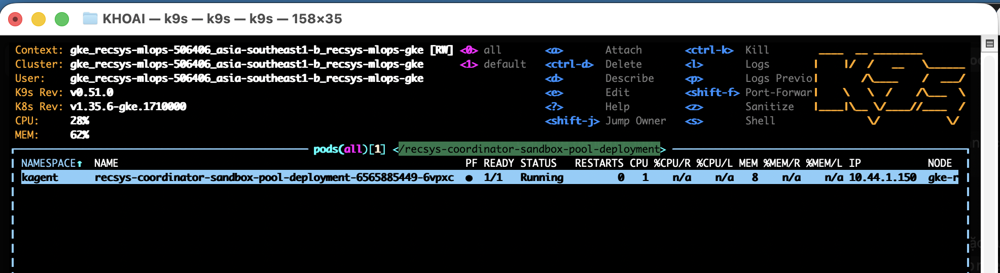
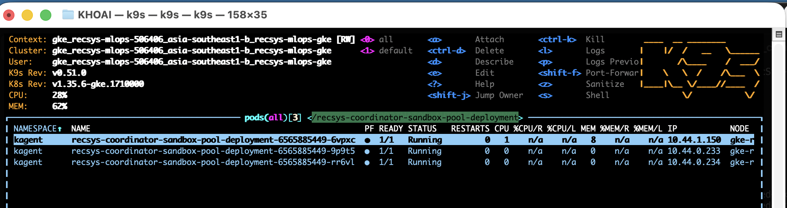
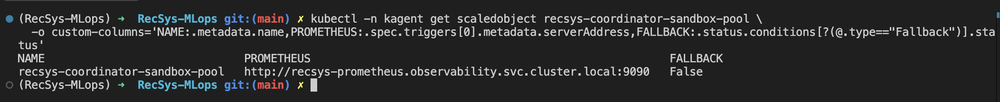
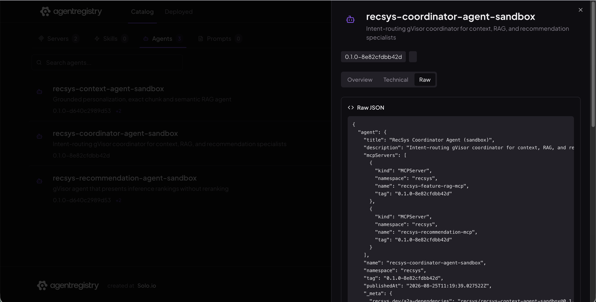
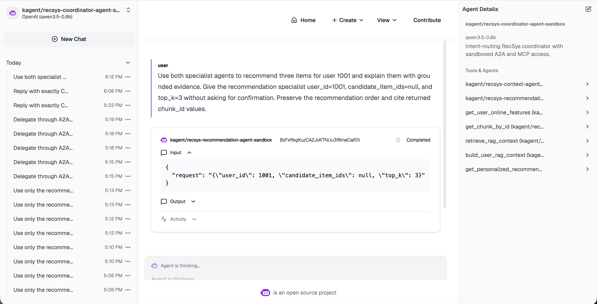

# Coordinator Agent with A2A, MCP, Multi-Replica Runtime, and Governance

`recsys-coordinator-agent-sandbox` is a declarative Go agent running on Agent
Substrate in the `kagent` namespace. It classifies each request and routes it
to the smallest set of specialist agents or MCP tools required to produce a
grounded answer.

```text
kagent Chat UI / A2A client
              |
              v
Coordinator SandboxAgent
  |-- A2A --> recsys-context-agent-sandbox
  |-- A2A --> recsys-recommendation-agent-sandbox
  |-- MCP --> recsys-feature-rag-mcp
  `-- MCP --> recsys-recommendation-mcp
              |
              v
Dedicated gVisor WorkerPool: 1..3 replicas
```

## 1. Agent Uses MCP with a Multi-Replica Autoscaled Runtime

### 1.1 Declarative A2A and MCP providers

The coordinator is a declarative `SandboxAgent`; it does not require a custom
container image. Its two `Agent` providers expose the context and
recommendation SandboxAgents as A2A tools. Its two `McpServer` providers reuse
the canonical `RemoteMCPServer` resources and expose four Context/RAG tools and
one recommendation tool. The chart does not duplicate either
`RemoteMCPServer` or its authentication Secret.

```yaml
apiVersion: kagent.dev/v1alpha2
kind: SandboxAgent
metadata:
  name: recsys-coordinator-agent-sandbox
  namespace: kagent
spec:
  type: Declarative
  platform: substrate
  substrate:
    workerPoolRef:
      apiGroup: ate.dev
      kind: WorkerPool
      name: recsys-coordinator-sandbox-pool
  declarative:
    runtime: go
    modelConfig: default-model-config
    a2aConfig:
      skills:
        - id: coordinated-personalized-recommendation
          name: Coordinated personalized recommendation
    tools:
      - type: Agent
        agent:
          apiGroup: kagent.dev
          kind: SandboxAgent
          name: recsys-context-agent-sandbox
      - type: Agent
        agent:
          apiGroup: kagent.dev
          kind: SandboxAgent
          name: recsys-recommendation-agent-sandbox
      - type: McpServer
        mcpServer:
          apiGroup: kagent.dev
          kind: RemoteMCPServer
          name: recsys-feature-rag-mcp
          toolNames:
            - get_user_online_features
            - get_chunk_by_id
            - retrieve_rag_context
            - build_user_rag_context
      - type: McpServer
        mcpServer:
          apiGroup: kagent.dev
          kind: RemoteMCPServer
          name: recsys-recommendation-mcp
          toolNames:
            - get_personalized_recommendations
```

The system prompt implements the following routing policy:

```text
Context, feature, exact-chunk, or RAG evidence request
  -> delegate to recsys-context-agent-sandbox through A2A

Ranked recommendation request
  -> delegate to recsys-recommendation-agent-sandbox through A2A

Recommendation with grounded explanation
  -> delegate to both specialist agents and combine their results

Explicit tool, raw-data, or independent-verification request
  -> call the requested MCP tool directly

Failed, timed-out, or empty dependency
  -> preserve valid partial results, name the unavailable source, and never guess
```

The coordinator preserves the order, score, model version, and experiment
metadata returned by the recommendation service. It does not perform LLM
reranking. Grounded evidence cites the returned `chunk_id` values, and a direct
MCP tool is not called again when a specialist has already returned sufficient
data for the same purpose.

Sandbox egress is limited to the A2A proxy and the two MCP service FQDNs:

```yaml
sandbox:
  network:
    allowedDomains:
      - kagent-controller.kagent
      - recsys-feature-rag-mcp.kagent.svc.cluster.local
      - recsys-recommendation-mcp.kagent.svc.cluster.local
```

References:

- [Coordinator SandboxAgent template](../../../infra/helm/recsys-coordinator-agent/templates/sandboxagent.yaml)
- [Routing policy, network allow-list, and tool providers](../../../infra/helm/recsys-coordinator-agent/values.yaml)
- [Machine-readable coordinator tool contract](../../../configs/agentic/recsys-coordinator-agent/tools-contract.json)

### 1.2 Dedicated gVisor WorkerPool

The coordinator has a dedicated WorkerPool, so orchestration load does not
consume the warm workers assigned to the context or recommendation agents.
Terraform owns the immutable runtime fields. The `computed_fields` declaration
leaves replica ownership to KEDA and prevents Terraform from reverting live
autoscaling changes.

```hcl
resource "kubernetes_manifest" "recsys_coordinator_sandbox_pool" {
  manifest = {
    apiVersion = "ate.dev/v1alpha1"
    kind       = "WorkerPool"
    metadata = {
      name      = "recsys-coordinator-sandbox-pool"
      namespace = "kagent"
    }
    spec = {
      replicas      = 1
      ateomImage    = "ghcr.io/kagent-dev/substrate/ateom-gvisor:v0.0.6"
      scaleSelector = "ate.dev/worker-pool=recsys-coordinator-sandbox-pool"
    }
  }

  computed_fields = ["spec.replicas"]
}
```

The scalable unit is the WorkerPool and its generated gVisor Deployment. The
declarative `SandboxAgent` remains one Kubernetes custom resource.

Reference: [Terraform coordinator WorkerPool and KEDA `/scale` RBAC](../../../infra/terraform/gcp/kagent.tf).

### 1.3 KEDA autoscaling and scaler fallback

KEDA targets the WorkerPool `/scale` subresource and evaluates total CPU usage
for the generated workers' `ateom` containers. The baseline is one replica and
the upper bound is three. After three consecutive Prometheus scaler failures,
KEDA falls back to one worker. The PodDisruptionBudget keeps at least one
worker available during voluntary disruption.

```yaml
apiVersion: keda.sh/v1alpha1
kind: ScaledObject
metadata:
  name: recsys-coordinator-sandbox-pool
spec:
  scaleTargetRef:
    apiVersion: ate.dev/v1alpha1
    kind: WorkerPool
    name: recsys-coordinator-sandbox-pool
  minReplicaCount: 1
  maxReplicaCount: 3
  pollingInterval: 15
  cooldownPeriod: 120
  fallback:
    failureThreshold: 3
    replicas: 1
  advanced:
    horizontalPodAutoscalerConfig:
      behavior:
        scaleDown:
          stabilizationWindowSeconds: 60
  triggers:
    - type: prometheus
      metadata:
        serverAddress: http://recsys-prometheus.observability.svc.cluster.local:9090
        metricName: recsys_coordinator_sandbox_worker_cpu_microcores
        threshold: "400"
        query: >-
          1000000 * sum(rate(container_cpu_usage_seconds_total{
          namespace="kagent",
          pod=~"recsys-coordinator-sandbox-pool-deployment-.*",
          container="ateom"}[2m]))
```

```yaml
apiVersion: policy/v1
kind: PodDisruptionBudget
metadata:
  name: recsys-coordinator-sandbox-pool
spec:
  minAvailable: 1
  selector:
    matchLabels:
      ate.dev/worker-pool: recsys-coordinator-sandbox-pool
```

References:

- [WorkerPool ScaledObject](../../../infra/helm/recsys-coordinator-agent/templates/scaledobject.yaml)
- [Autoscaling values for `1..3` replicas and fallback `1`](../../../infra/helm/recsys-coordinator-agent/values.yaml)
- [WorkerPool PodDisruptionBudget](../../../infra/helm/recsys-coordinator-agent/templates/pdb.yaml)
- [Runtime autoscaling and Prometheus fault-injection validation](../../../ops/validation/coordinator_agentic_autoscale.sh)

### 1.4 Runtime autoscaling evidence



**Figure 1 — Coordinator WorkerPool baseline.** K9s shows one
`recsys-coordinator-sandbox-pool-deployment-*` pod in the `kagent` namespace.
The worker is `1/1 Ready` and Running, establishing the warm baseline before
concurrent A2A load.



**Figure 2 — KEDA scale-out.** The same filtered K9s view shows three distinct
gVisor worker pods, all `1/1 Ready` and Running. Together, Figures 1 and 2
demonstrate WorkerPool scale-out from one to three replicas under coordinator
load.



**Figure 3 — Scaler recovery.** After the isolated Prometheus fault injection,
the coordinator ScaledObject again points to the canonical in-cluster
Prometheus service and reports `Fallback=False`. The validation script first
observed fallback at one desired replica and then restored the scaler address
through its exit trap.

## 2. Publish to Agent Registry and Enforce Governance

The coordinator is published under the canonical identity
`recsys/recsys-coordinator-agent-sandbox`. The live catalog version represented
in this submission is:

```text
version:    0.1.0+8e82cfdbb42d
tag:        0.1.0-8e82cfdbb42d
git commit: 8e82cfdbb42d5c94fc6bd58ef19fd75af0d9478b
```

Agent Registry represents the two MCP dependencies through the first-class
`spec.mcpServers` field. Agent Registry v0.4.0 does not provide an equivalent
first-class A2A dependency field, so the two child agents are recorded in the
`recsys.dev/a2a-dependencies` annotation.

```yaml
apiVersion: ar.dev/v1alpha1
kind: Agent
metadata:
  namespace: recsys
  name: recsys-coordinator-agent-sandbox
  tag: 0.1.0-8e82cfdbb42d
  labels:
    app.kubernetes.io/part-of: recsys-coordinator-agentic
    recsys.dev/git-sha: 8e82cfdbb42d
    recsys.dev/variant: sandbox
  annotations:
    recsys.dev/version: 0.1.0+8e82cfdbb42d
    recsys.dev/git-commit: 8e82cfdbb42d5c94fc6bd58ef19fd75af0d9478b
    recsys.dev/a2a-dependencies: >-
      recsys/recsys-context-agent-sandbox@0.1.0-8e82cfdbb42d,
      recsys/recsys-recommendation-agent-sandbox@0.1.0-8e82cfdbb42d
spec:
  title: RecSys Coordinator Agent (sandbox)
  description: >-
    Intent-routing gVisor coordinator for context, RAG, and recommendation
    specialists
  mcpServers:
    - kind: MCPServer
      namespace: recsys
      name: recsys-feature-rag-mcp
      tag: 0.1.0-8e82cfdbb42d
    - kind: MCPServer
      namespace: recsys
      name: recsys-recommendation-mcp
      tag: 0.1.0-8e82cfdbb42d
```

Both MCP artifacts and both child-agent artifacts exist at the same tag. The
`coordinator-agent-registry` deploy unit depends on the coordinator workload
and all four registry dependencies. Publication checks matching versions and
full Git commits before `arctl apply`, then writes release evidence to
`.ci-deploy/coordinator-agent-registry.json`.

```text
coordinator-agent ----------------------\
context-agent-registry ------------------+
recommendation-agent-registry -----------+--> coordinator-agent-registry
feature-rag-mcp-registry ----------------+
recommendation-mcp-registry ------------/
```

References:

- [Registry manifest generation and governance checks](../../../jenkins/scripts/deploy/agentic.sh)
- [Coordinator registry verification](../../../ops/validation/coordinator_agentic_registry_smoke.sh)
- [Agent deploy dependency graph](../../../jenkins/config/deploy-units.json)
- [Coordinator CI component](../../../jenkins/config/components.json)

### 2.1 Registry governance evidence



**Figure 4 — Governed coordinator catalog entry.** Agent Registry lists
`recsys-coordinator-agent-sandbox` beside the two specialist agents and shows
the Git-derived `0.1.0-8e82cfdbb42d` tag. The Raw view exposes both canonical
MCP dependencies with the same tag. The A2A dependency annotation and full Git
commit are also retained in the registry metadata and verified by the
coordinator registry smoke test.

Agent Registry supplies catalog discovery, version history, and dependency
governance. Runtime A2A and MCP traffic does not pass through the registry.

## 3. Agent Chat UI

The existing kagent Chat UI uses the global `default-model-config` and sends
requests to the coordinator's A2A endpoint:

```text
/api/a2a-sandboxes/kagent/recsys-coordinator-agent-sandbox/
```

For a composite request, the coordinator delegates ranking work to the
recommendation SandboxAgent and context work to the Context/RAG SandboxAgent.
It then combines the specialist responses without changing recommendation
order and cites returned `chunk_id` values for grounded evidence.

```text
User asks for ranked recommendations with grounded explanations
  -> recsys-recommendation-agent-sandbox through A2A
  -> recsys-context-agent-sandbox through A2A
  -> preserve recommendation order
  -> cite grounded chunk_id evidence
  -> return one coordinated response
```

References:

- [Coordinator routing and output policy](../../../infra/helm/recsys-coordinator-agent/values.yaml)
- [A2A runtime assertions](../../../jenkins/scripts/deploy/agentic.sh)
- [Coordinator runtime smoke entrypoint](../../../ops/validation/coordinator_agentic_smoke.sh)
- [Coordinator A2A end-to-end tests](../../../tests/e2e/coordinator_agentic)

### 3.1 A2A Delegation Proof



**Figure 5 — A2A specialist delegation in kagent Chat UI.** The selected agent
is `kagent/recsys-coordinator-agent-sandbox`, whose details panel exposes both
specialist agents and the five MCP tools. For the composite prompt, the visible
tool card is an A2A invocation of
`kagent/recsys-recommendation-agent-sandbox`, not a direct recommendation MCP
call. The child request carries `user_id=1001`, `candidate_item_ids=null`, and
`top_k=3`, and the delegation is marked `Completed`. This provides direct UI
evidence that the coordinator can hand work to a specialist SandboxAgent over
A2A.

## 4. Runtime Verification

Repository contracts and live routing checks:

```bash
make helm-coordinator-agentic test-coordinator-agentic
make coordinator-agentic-preflight coordinator-agentic-smoke
make coordinator-agentic-registry
```

WorkerPool autoscaling, scale-down, and Prometheus fallback:

```bash
set -o pipefail

COORDINATOR_AUTOSCALE_REQUESTS=20 \
COORDINATOR_AUTOSCALE_CONCURRENCY=8 \
COORDINATOR_SCALE_OUT_TIMEOUT_SECONDS=240 \
COORDINATOR_SCALE_DOWN_TIMEOUT_SECONDS=420 \
COORDINATOR_FALLBACK_TIMEOUT_SECONDS=240 \
  make coordinator-agentic-autoscale \
  | tee /tmp/coordinator-workerpool-autoscale-proof.log
```

Successful validation finishes with:

```text
Coordinator WorkerPool autoscale 1 -> 3 -> 1 and fallback=1 checks passed.
```
