# Sandbox Agent Pulls Online Features and RAG Context

> **Runtime status (updated 2026-08-28):** production runs the custom kagent v7
> compatibility image with Substrate `0.0.11`; values select assigned-worker
> KEDA. Context proved `1 -> 2 -> 3 -> 2 -> 1` and fallback to one. The chart
> runs model revision v8; revision changes rebuild a single current
> ActorTemplate after removing stale generations. The chart retains
> `metricMode: cpu | assignedWorkers` only for values-based rollback.
> See [Agent/WorkerPool Benchmark & HA](benchmark_ha.md) for validation and
> rollback evidence.

This document provides source-code, configuration, deployment, and runtime
evidence for the following coursework requirements:

- expose Web APIs that retrieve materialized user features by `user_id` and RAG
  chunks by `chunk_id`;
- use FastAPI, Pydantic validation, asynchronous handlers, and Kubernetes health
  checks;
- expose the APIs to an agent through a Streamable HTTP MCP server;
- deploy the MCP server with Helm, zero-unavailable `RollingUpdate`, KEDA
  autoscaling, and scaler fallback;
- run the agent only as a `SandboxAgent`, backed by a multi-replica gVisor
  `WorkerPool` scaled by KEDA;
- publish the MCP server and SandboxAgent to Agent Registry; and
- demonstrate grounded tool use through the kagent Chat UI.

The previous online-feature-only implementation is documented in
[Web API Pull Data](<../rubic-final-coursework-(final-ml)/web-api-pull-data.md>).
This document extends that serving boundary with the RAG API, MCP transport,
SandboxAgent, WorkerPool scaling, registry governance, and chat UI.

## 1. Implemented Architecture

```text
kagent Chat UI
  -> kagent-controller sandbox A2A endpoint
  -> SandboxAgent/recsys-context-agent-sandbox
  -> WorkerPool/recsys-context-sandbox-pool
       -> 1..3 Substrate ateom-gvisor worker pods
       -> KEDA targets ate.dev/v1alpha1 WorkerPool /scale
  -> RemoteMCPServer/recsys-feature-rag-mcp
  -> recsys-feature-rag-mcp FastAPI + FastMCP Deployment
       -> POST /online-features
          -> recsys-online-feature-api -> Redis + Feast online store
       -> GET /v1/rag/chunks/{chunk_id}
          -> recsys-rag-api -> active Feast RAG FeatureView
       -> POST /v1/rag/retrieve
          -> recsys-rag-api -> active RAG vector index

Agent Registry
  <- Jenkins publishes versioned MCPServer and SandboxAgent metadata
```

Agent Registry is a governance and discovery control plane. It is not placed in
the request path of every chat. The kagent UI discovers the live
`SandboxAgent`; the SandboxAgent invokes the live `RemoteMCPServer`; Jenkins
publishes the corresponding immutable Git version to Agent Registry after
runtime smoke tests pass.

There is no regular `Agent/recsys-context-agent` or regular Agent Deployment in
the current architecture. One `SandboxAgent` profile shares a KEDA-managed pool
of one to three sandbox workers. The pool keeps one idle worker and proves
multi-replica execution by scaling to three under load.

### 1.1 Shared autoscaling control loop

All three workloads use the same control-plane sequence, but they emit
different signals and target different Kubernetes resources.

```text
Traffic or worker assignment
  -> application metric or Substrate assigned-worker metric
  -> Prometheus scrape and time-series storage
  -> KEDA Prometheus scaler exposes an external metric
  -> Kubernetes HPA calculates desired replicas
  -> HPA writes the target's /scale subresource
  -> workload controller creates or removes pods
  -> Ready pods join the Service or sandbox WorkerPool
```

KEDA owns the `ScaledObject` integration and generates the HPA. The Kubernetes
HPA controller makes the replica decision. The final proof must therefore show
both the HPA recommendation and the target workload's available replicas.

### 1.2 RAG FastAPI autoscaling stages

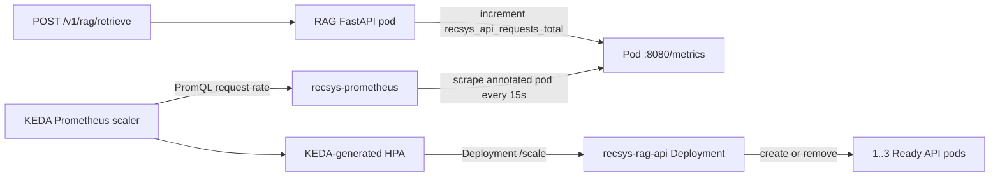

#### Stage 1: completed FastAPI requests produce the signal

The shared FastAPI middleware records the route, method, status, and duration
after each request completes. The counter therefore measures completed request
throughput, not merely accepted connections.

```python
@app.middleware("http")
async def metrics_middleware(request: Request, call_next):
    start = time.perf_counter()
    route = request.scope.get("path", request.url.path)
    method = request.method
    status_code = 500
    try:
        response = await call_next(request)
        status_code = response.status_code
        return response
    finally:
        observe_request(
            route,
            method,
            status_code,
            time.perf_counter() - start,
        )


def observe_request(route, method, status, duration_seconds):
    request_labels = {
        "service": SERVICE_NAME,
        "route": route,
        "method": method,
    }
    METRICS.inc(
        "recsys_api_requests_total",
        labels={**request_labels, "status": str(status)},
    )
```

References:

- [shared FastAPI metrics middleware](../../../apps/api-serving/shared/src/recsys_serving_common/runtime.py#L22)
- [`recsys_api_requests_total` counter](../../../apps/api-serving/shared/src/recsys_serving_common/observability.py#L235)
- [RAG `OTEL_SERVICE_NAME`](../../../infra/helm/recsys-rag-api/templates/configmap.yaml#L27)

#### Stage 2: Prometheus scrapes and converts the counter to request rate

```yaml
# recsys-rag-api Deployment pod template
annotations:
  prometheus.io/scrape: "true"
  prometheus.io/path: /metrics
  prometheus.io/port: "8080"

# recsys-prometheus scrape configuration
global:
  scrape_interval: 15s
scrape_configs:
  - job_name: recsys-kubernetes-pods
    kubernetes_sd_configs:
      - role: pod
        namespaces:
          names: [api-serving]
    relabel_configs:
      - source_labels: [__meta_kubernetes_pod_annotation_prometheus_io_scrape]
        action: keep
        regex: "true"
      - source_labels: [__address__, __meta_kubernetes_pod_annotation_prometheus_io_port]
        action: replace
        target_label: __address__
        regex: ([^:]+)(?::\d+)?;(\d+)
        replacement: $1:$2
```

The production Prometheus is the standalone `recsys-prometheus` Deployment.
It discovers annotated pods directly; Operator-managed monitoring resources
are not part of this active scrape path.

```promql
sum(rate(recsys_api_requests_total{
  service="recsys-rag-api",
  route="/v1/rag/retrieve",
  method="POST"
}[1m]))
```

References:

- [RAG pod scrape annotations](../../../infra/helm/recsys-rag-api/templates/deployment.yaml#L20)
- [standalone Prometheus pod-discovery job](../../../infra/helm/recsys-observability/templates/prometheus.yaml#L192)
- [RAG Prometheus query](../../../infra/helm/recsys-rag-api/templates/scaledobject.yaml#L12)

#### Stage 3: KEDA supplies the metric and HPA selects `1..3`

```yaml
apiVersion: keda.sh/v1alpha1
kind: ScaledObject
spec:
  scaleTargetRef:
    apiVersion: apps/v1
    kind: Deployment
    name: recsys-rag-api
  minReplicaCount: 1
  maxReplicaCount: 3
  triggers:
    - type: prometheus
      metadata:
        metricName: recsys_rag_api_requests_per_second
        threshold: "5"
```

The HPA reads the external metric through the KEDA metrics adapter, bounds its
recommendation to one through three replicas, and writes
`Deployment/recsys-rag-api` through the standard `/scale` subresource. A K9s
target such as `0/5` means the observed completed rate is below the configured
target; `<unknown>/5` indicates that the scaler cannot supply the metric.

References:

- [RAG ScaledObject and Deployment target](../../../infra/helm/recsys-rag-api/templates/scaledobject.yaml#L1)
- [RAG threshold and timing values](../../../infra/helm/recsys-rag-api/values.yaml#L38)
- [production RAG bounds `1/3`](../../../infra/helm/recsys-rag-api/values-gcp.yaml#L21)

#### Stage 4: Deployment reconciles pods and readiness completes scale-out

```yaml
spec:
  strategy:
    type: RollingUpdate
  template:
    spec:
      nodeSelector: {}
      tolerations:
        - key: recsys.ai/workload
          operator: Equal
          value: ml-system
          effect: NoSchedule
      containers:
        - name: api
          readinessProbe:
            httpGet: {path: /healthz, port: http}
```

The Deployment controller creates the additional pods, the scheduler may place
them on either eligible production node, and only Ready pods become Service
endpoints. Autoscale proof is complete at HPA `REPLICAS=3`, Deployment `3/3`,
and three Running pods; `desired=3` with a Pending pod is incomplete.

References:

- [RAG Deployment and readiness](../../../infra/helm/recsys-rag-api/templates/deployment.yaml#L1)
- [quota-aware production placement](../../../infra/helm/recsys-rag-api/values-gcp.yaml#L1)
- [RAG `1 -> 3` capture load](../../../ops/validation/agentic_autoscale_capture.sh#L183)

### 1.3 MCP server autoscaling stages

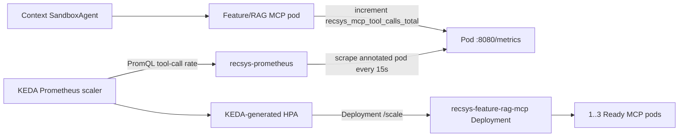

#### Stage 1: completed MCP tools produce the signal

Every tool executes through one observation wrapper. Both successful and failed
terminal calls increment `recsys_mcp_tool_calls_total`; in-progress calls do not
increment it until they finish.

```python
TOOL_CALLS = Counter(
    "recsys_mcp_tool_calls_total",
    "MCP tool calls classified by completion status.",
    ("tool", "status"),
)

async def observed(name: str, operation: Awaitable[Any]) -> Any:
    with TOOL_DURATION.labels(name).time():
        try:
            result = await operation
        except Exception:
            TOOL_CALLS.labels(name, "error").inc()
            raise
    TOOL_CALLS.labels(name, "success").inc()
    return result
```

References:

- [MCP counters and histograms](../../../apps/agentic/recsys-feature-rag-mcp/src/recsys_feature_rag_mcp/observability.py#L1)
- [tool observation wrapper](../../../apps/agentic/recsys-feature-rag-mcp/src/recsys_feature_rag_mcp/server.py#L53)

#### Stage 2: Prometheus scrapes and KEDA queries tool-call rate

```yaml
# recsys-feature-rag-mcp Deployment pod template
annotations:
  prometheus.io/scrape: "true"
  prometheus.io/path: /metrics
  prometheus.io/port: "8080"

# The shared recsys-kubernetes-pods job includes namespace kagent and rewrites
# the target from pod IP plus prometheus.io/port.
```

```promql
sum(rate(recsys_mcp_tool_calls_total[1m]))
```

References:

- [MCP pod scrape annotations](../../../infra/helm/recsys-feature-rag-mcp/templates/deployment.yaml#L29)
- [standalone Prometheus pod-discovery job](../../../infra/helm/recsys-observability/templates/prometheus.yaml#L192)
- [MCP Prometheus trigger](../../../infra/helm/recsys-feature-rag-mcp/templates/scaledobject.yaml#L20)

#### Stage 3: KEDA/HPA scales the stateless MCP Deployment

```yaml
spec:
  scaleTargetRef:
    apiVersion: apps/v1
    kind: Deployment
    name: recsys-feature-rag-mcp
  minReplicaCount: 1
  maxReplicaCount: 3
  fallback:
    failureThreshold: 3
    replicas: 1
  triggers:
    - type: prometheus
      metadata:
        threshold: "5"
        query: sum(rate(recsys_mcp_tool_calls_total[1m]))
```

The production overlay changes the chart defaults to `1/3/1`. Because FastMCP
uses `stateless_http=True`, any Ready MCP replica can handle a later Streamable
HTTP request without depending on in-memory session state from another pod.
After three consecutive Prometheus scaler failures, KEDA sets
`Fallback=True` and maintains one MCP replica.

References:

- [MCP ScaledObject](../../../infra/helm/recsys-feature-rag-mcp/templates/scaledobject.yaml#L1)
- [production MCP bounds and fallback](../../../infra/helm/recsys-feature-rag-mcp/values-gcp.yaml#L10)
- [stateless FastMCP server](../../../apps/agentic/recsys-feature-rag-mcp/src/recsys_feature_rag_mcp/server.py#L41)

#### Stage 4: Deployment, probes, and RollingUpdate make replicas usable

```yaml
strategy:
  type: RollingUpdate
  rollingUpdate:
    maxUnavailable: 0
    maxSurge: 1

containers:
  - name: mcp
    startupProbe: {httpGet: {path: /healthz, port: http}}
    readinessProbe: {httpGet: {path: /ready, port: http}}
    livenessProbe: {httpGet: {path: /healthz, port: http}}
```

HPA writes `Deployment/recsys-feature-rag-mcp` through `/scale`; the Deployment
controller creates pods and the Service only routes to replicas that pass
readiness. `RollingUpdate` controls application-version replacement, while
KEDA/HPA independently controls replica count.

References:

- [MCP Deployment strategy and probes](../../../infra/helm/recsys-feature-rag-mcp/templates/deployment.yaml#L1)
- [MCP `1 -> 3` and fallback capture](../../../ops/validation/agentic_autoscale_capture.sh#L240)

### 1.4 Context SandboxAgent autoscaling stages

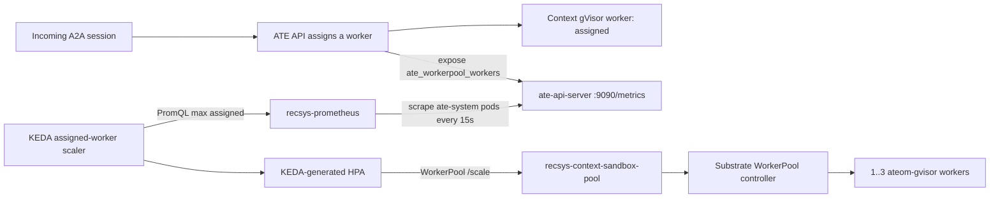

#### Stage 1: A2A sessions assign gVisor workers

The `SandboxAgent` is a declarative profile, not a Deployment. Incoming A2A
requests are executed by `ateom-gvisor` workers in the referenced WorkerPool.

```yaml
apiVersion: kagent.dev/v1alpha3
kind: SandboxAgent
spec:
  type: Declarative
  substrate:
    workerPoolRef:
      apiGroup: ate.dev
      kind: WorkerPool
      name: recsys-context-sandbox-pool
```

References:

- [SandboxAgent and WorkerPool binding](../../../infra/helm/recsys-kagent-agent/templates/sandboxagent.yaml#L1)
- [kagent-owned gVisor WorkerPool baseline](../../../configs/kagent/values.yaml#L57)

#### Stage 2: Prometheus measures assigned workers

Substrate `0.0.11` keeps the worker registry in `ate-api-server`. The upstream
Substrate chart annotates each `ate-api-server` pod with
`prometheus.io/scrape: "true"` and `prometheus.io/port: "9090"`; the metrics
path defaults to `/metrics`. The standalone Prometheus job includes
`ate-system`, scrapes both API replicas, and stores the WorkerPool state gauge.
KEDA uses `max`, rather than `sum`, so the two identical control-plane replicas
do not double-count the same worker state.

```yaml
# live ate-api-server pod template rendered by the Substrate chart
annotations:
  prometheus.io/scrape: "true"
  prometheus.io/port: "9090"
containers:
  - name: ate-api-server
    ports:
      - name: prometheus
        containerPort: 9090

# recsys-prometheus discovers this namespace through the shared pod job
targets:
  substrateNamespace: ate-system
```

```promql
max(ate_workerpool_workers{
  ate_workerpool_namespace="kagent",
  ate_workerpool_name="recsys-context-sandbox-pool",
  ate_worker_state="assigned"
})
```

References:

- [Substrate chart installation](../../../infra/terraform/gcp/modules/kubernetes-platform/kagent.tf#L125)
- [Prometheus `ate-system` target namespace](../../../infra/helm/recsys-observability/values.yaml#L75)
- [standalone Prometheus pod-discovery job](../../../infra/helm/recsys-observability/templates/prometheus.yaml#L192)
- [WorkerPool assigned-worker query](../../../infra/helm/recsys-kagent-agent/templates/scaledobject.yaml#L43)

#### Stage 3: HPA targets the WorkerPool `/scale` subresource

```yaml
spec:
  scaleTargetRef:
    apiVersion: ate.dev/v1alpha1
    kind: WorkerPool
    name: recsys-context-sandbox-pool
  minReplicaCount: 1
  maxReplicaCount: 3
  fallback:
    failureThreshold: 3
    replicas: 1
  triggers:
    - type: prometheus
      metricType: AverageValue
      metadata:
        metricName: recsys_context_sandbox_assigned_workers
        threshold: "0.7"
        query: max(ate_workerpool_workers{ate_workerpool_namespace="kagent",ate_workerpool_name="recsys-context-sandbox-pool",ate_worker_state="assigned"})
```

The HPA never modifies `SandboxAgent/recsys-context-agent-sandbox`. It writes
the WorkerPool scale subresource. The `SandboxAgent` identity remains singular
while the execution capacity varies from one to three workers.

References:

- [WorkerPool-targeting ScaledObject](../../../infra/helm/recsys-kagent-agent/templates/scaledobject.yaml#L1)
- [WorkerPool bounds, threshold, and fallback](../../../infra/helm/recsys-kagent-agent/values.yaml#L34)
- [production WorkerPool override](../../../infra/helm/recsys-kagent-agent/values-gcp.yaml#L3)
- Substrate `0.0.11` native WorkerPool `/scale` uses `.status.selector`; no
  compatibility post-renderer is required.

#### Stage 4: Substrate reconciles the generated gVisor Deployment

```text
KEDA-generated HPA
  -> WorkerPool/recsys-context-sandbox-pool /scale
  -> Substrate WorkerPool controller
  -> Deployment/recsys-context-sandbox-pool
  -> 1..3 ateom-gvisor worker pods
```

On three scaler failures, fallback returns the WorkerPool to one worker; the
validation script restores the original Prometheus address through an EXIT
trap.

References:

- [WorkerPool baseline and gVisor image](../../../configs/kagent/values.yaml#L34)
- [WorkerPool PDB](../../../infra/helm/recsys-kagent-agent/templates/pdb.yaml#L1)
- [Sandbox WorkerPool `1 -> 3` and fallback capture](../../../ops/validation/agentic_autoscale_capture.sh#L314)
- [runtime WorkerPool scale assertions](../../../jenkins/scripts/test/agentic.sh#L25)

## 2. Online Features and RAG Services

### 2.1 Online features by `user_id`

The online-feature API accepts a validated user identifier, optional candidate
IDs, and a bounded `top_k`.

```python
class OnlineFeaturesRequest(BaseModel):
    user_id: int = Field(ge=1)
    candidate_item_ids: list[int] | None = Field(
        default=None, min_length=1, max_length=500
    )
    top_k: int = Field(default=10, ge=1, le=100)


@app.post("/online-features", response_model=OnlineFeaturesResponse)
async def online_features_post(
    payload: OnlineFeaturesRequest, request: Request
) -> OnlineFeaturesResponse:
    return await get_online_features(
        payload.user_id,
        payload.candidate_item_ids,
        payload.top_k,
        request.app.state.feature_client,
    )
```

Code references:

- [OnlineFeaturesRequest and OnlineFeaturesResponse](../../../apps/api-serving/shared/src/recsys_serving_common/contracts.py#L8)
- [FastAPI online-feature endpoints](../../../apps/api-serving/online-feature-api/src/recsys_online_feature_api/app.py#L76)
- [online-feature response composition](../../../apps/api-serving/online-feature-api/src/recsys_online_feature_api/service.py#L371)

The service first reads the realtime sequence and aggregates from Redis. If the
realtime sequence is absent, it falls back to the Feast online store using the
same `user_id` entity.

```python
values = await self.client.mget(
    [
        f"fs:user_sequence:{user_id}",
        f"fs:user_aggregate:{user_id}",
    ]
)

if realtime_sequence:
    payload = normalize_realtime_user_features(
        realtime_sequence, realtime_aggregate
    )
else:
    payload = await self._feast_executor.run(
        self._feast_user_sequence, user_id
    )
```

Code reference: [FeatureClient.user_sequence](../../../apps/api-serving/online-feature-api/src/recsys_online_feature_api/service.py#L232).

### 2.2 Exact RAG chunk by `chunk_id`

The RAG API exposes exact single and batch chunk lookup independently from
semantic retrieval.

```python
@app.get("/v1/rag/chunks/{chunk_id}", response_model=ChunkResponse)
async def get_chunk(
    request: Request,
    chunk_id: str = Path(min_length=1, max_length=512),
) -> ChunkResponse:
    result = await request.app.state.request_executor.run(
        request.app.state.chunk_lookup_service.get_many,
        [chunk_id],
    )
    if not result.chunks:
        raise HTTPException(status_code=404, detail="chunk not found")
    return ChunkResponse(
        **result.chunks[0].model_dump(),
        pipeline_run_id=result.pipeline_run_id,
    )
```

Code references:

- [exact and batch chunk routes](../../../apps/api-serving/rag-api/src/recsys_rag_api/app.py#L248)
- [bounded duplicate-free batch contract](../../../apps/api-serving/rag-api/src/recsys_rag_api/contracts.py#L140)
- [response contract without embeddings](../../../apps/api-serving/rag-api/src/recsys_rag_api/contracts.py#L116)

`ChunkLookupService` reads the active blue/green pointer, derives the selected
FeatureView, and performs an entity lookup through Feast. Returned records
preserve request order and missing IDs are reported separately.

```python
pointer = self.pointers.get()
feature_view = str(getattr(pointer, "feature_view"))
pipeline_run_id = str(getattr(pointer, "pipeline_run_id"))
result = self.feature_store.get_online_features(
    features=[f"{feature_view}:{name}" for name in CHUNK_FEATURES],
    entity_rows=[{"chunk_id": chunk_id} for chunk_id in chunk_ids],
    full_feature_names=False,
)
```

Code reference: [ChunkLookupService.get_many](../../../apps/api-serving/rag-api/src/recsys_rag_api/chunk_lookup.py#L72).

### 2.3 Semantic RAG retrieval

The semantic endpoint validates a natural-language query and returns
item-grouped evidence from the active RAG index.

```python
class RetrievalRequest(StrictModel):
    query: str = Field(min_length=1, max_length=1000)
    top_k_items: int = Field(default=10, ge=1, le=20)
    filters: RetrievalFilters = Field(default_factory=RetrievalFilters)


@app.post("/v1/rag/retrieve", response_model=RetrievalResponse)
async def retrieve(
    payload: RetrievalRequest, request: Request
) -> RetrievalResponse:
    return await request.app.state.request_executor.run(
        request.app.state.retrieval_service.retrieve,
        payload,
    )
```

Code references:

- [RAG request and response contracts](../../../apps/api-serving/rag-api/src/recsys_rag_api/contracts.py#L26)
- [semantic retrieval endpoint](../../../apps/api-serving/rag-api/src/recsys_rag_api/app.py#L233)
- [Feast document retrieval adapter](../../../apps/api-serving/rag-api/src/recsys_rag_api/retrieval.py#L135)

### 2.4 MCP downstream boundaries

The MCP package calls both public APIs with pooled HTTP clients. It does not
import or access Redis, Feast, or Milvus runtime objects directly.
At the MCP boundary, an empty `candidate_item_ids` array emitted by a model is
normalized to `null`. Both forms mean that no candidate filter was supplied,
while the online-feature API intentionally rejects an empty candidate filter.
This keeps delegated Coordinator requests equivalent to direct Context-agent
requests without weakening the downstream API contract.

```python
return await self.request(
    "POST",
    "/online-features",
    json={
        "user_id": user_id,
        "candidate_item_ids": candidate_item_ids,
        "top_k": top_k,
    },
)

return await self.request("GET", f"/v1/rag/chunks/{chunk_id}")

return await self.request(
    "POST",
    "/v1/rag/retrieve",
    json={"query": query, "top_k_items": top_k_items, "filters": filters or {}},
)
```

Code references:

- [OnlineFeatureClient](../../../apps/agentic/recsys-feature-rag-mcp/src/recsys_feature_rag_mcp/clients/online_features.py#L31)
- [RagClient](../../../apps/agentic/recsys-feature-rag-mcp/src/recsys_feature_rag_mcp/clients/rag.py#L31)
- [ClusterIP downstream URLs and timeouts](../../../infra/helm/recsys-feature-rag-mcp/values.yaml#L9)
- [MCP ConfigMap environment mapping](../../../infra/helm/recsys-feature-rag-mcp/templates/configmap.yaml#L1)

## 3. FastAPI Proof

### 3.1 FastAPI application composition

The MCP process composes operational HTTP endpoints and FastMCP in one FastAPI
application. FastMCP is mounted at `/mcp` through its Streamable HTTP ASGI app.

```python
app = FastAPI(
    title="RecSys Feature and RAG MCP",
    version=__version__,
    lifespan=lifespan,
)

@app.get("/healthz")
async def healthz() -> dict[str, str]:
    return {"status": "ok"}

@app.get("/ready")
async def ready() -> JSONResponse:
    if not settings.auth_token:
        return JSONResponse({"status": "not_ready"}, status_code=503)
    return JSONResponse({"status": "ready"})

app.mount("/", mcp.streamable_http_app())
```

Code references:

- [FastAPI composition root](../../../apps/agentic/recsys-feature-rag-mcp/src/recsys_feature_rag_mcp/app.py#L21)
- [FastAPI dependency pins](../../../apps/agentic/recsys-feature-rag-mcp/pyproject.toml#L5)
- [Python 3.11 non-root runtime image](../../../images/agentic/recsys-feature-rag-mcp/Dockerfile#L1)

### 3.2 Data validation with Pydantic

Annotated Pydantic types become the generated MCP tool input schemas. Strict
response models reject undeclared fields and make partial-result errors
explicit.

```python
UserId = Annotated[int, Field(ge=0)]
CandidateItemIds = Annotated[list[int] | None, Field(max_length=100)]
FeatureTopK = Annotated[int, Field(ge=1, le=100)]
ChunkId = Annotated[str, Field(min_length=1, max_length=512)]
RagQuery = Annotated[str, Field(min_length=1, max_length=1000)]
RagTopK = Annotated[int, Field(ge=1, le=20)]

class StrictModel(BaseModel):
    model_config = ConfigDict(extra="forbid")

class ToolError(StrictModel):
    code: str
    service: str
    retryable: bool
    message: str
```

Code references:

- [MCP Pydantic contracts](../../../apps/agentic/recsys-feature-rag-mcp/src/recsys_feature_rag_mcp/contracts.py#L7)
- [canonical tool JSON schemas](../../../configs/agentic/recsys-context-agent/tools-contract.json#L1)
- [contract comparison against generated FastMCP schemas](../../../tests/contract/test_agentic_context_contracts.py#L68)
- [invalid input protocol test](../../../tests/unit/agentic/feature_rag_mcp/test_app.py#L132)

### 3.3 Kubernetes health checks

The application exposes liveness, readiness, version, and Prometheus endpoints.
Kubernetes probes call the same public process endpoints.

```python
@app.get("/healthz")
async def healthz() -> dict[str, str]:
    return {"status": "ok"}

@app.get("/ready")
async def ready() -> JSONResponse:
    if not settings.auth_token:
        return JSONResponse({"status": "not_ready"}, status_code=503)
    return JSONResponse({"status": "ready"})

@app.get("/metrics")
async def metrics() -> Response:
    return Response(generate_latest(), media_type=CONTENT_TYPE_LATEST)
```

```yaml
startupProbe:
  httpGet: {path: /healthz, port: http}
  failureThreshold: 30
  periodSeconds: 2
readinessProbe:
  httpGet: {path: /ready, port: http}
  periodSeconds: 5
livenessProbe:
  httpGet: {path: /healthz, port: http}
  periodSeconds: 20
```

Code and configuration references:

- [MCP health, readiness, version, and metrics handlers](../../../apps/agentic/recsys-feature-rag-mcp/src/recsys_feature_rag_mcp/app.py#L87)
- [MCP Kubernetes probes](../../../infra/helm/recsys-feature-rag-mcp/templates/deployment.yaml#L53)
- [online-feature health endpoints](../../../apps/api-serving/online-feature-api/src/recsys_online_feature_api/app.py#L55)
- [RAG health and active-index readiness](../../../apps/api-serving/rag-api/src/recsys_rag_api/app.py#L193)

### Image proof

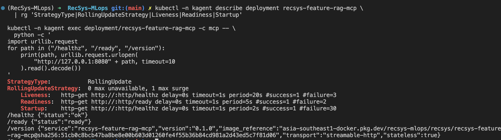

**Figure 1 — FastAPI and Kubernetes healthcheck proof.** The production MCP
Deployment uses `RollingUpdate` with zero unavailable and one surge pod. The
same capture shows startup, readiness, and liveness probes together with
successful `/healthz`, `/ready`, and `/version` responses. The version response
also records the stateless Streamable HTTP transport and immutable image digest;
no bearer-token value is exposed.

### 3.4 Async proof

The MCP server and both downstream adapters are asynchronous. HTTP connections
are pooled, trace headers are propagated, and transient connect/timeout/502/503
failures receive one bounded retry with jitter.

```python
self.client = httpx.AsyncClient(
    base_url=base_url,
    timeout=httpx.Timeout(timeout_seconds),
    limits=httpx.Limits(
        max_connections=max_connections,
        max_keepalive_connections=max_keepalive_connections,
    ),
)

async def request(self, method: str, path: str, **kwargs: Any) -> dict[str, Any]:
    for attempt in range(2):
        try:
            response = await self.client.request(method, path, **kwargs)
            if response.status_code in {502, 503} and attempt == 0:
                await asyncio.sleep(random.uniform(0.04, 0.08))
                continue
            return response.json()
        except (httpx.TimeoutException, httpx.NetworkError):
            if attempt == 0:
                await asyncio.sleep(random.uniform(0.04, 0.08))
                continue
            raise
```

The composite tool executes user-feature and RAG retrieval concurrently and
returns a typed partial result when only one downstream succeeds.

```python
results = await asyncio.gather(
    feature_client.get_features(
        user_id=user_id,
        candidate_item_ids=candidate_item_ids,
        top_k=top_k,
    ),
    rag_client.retrieve(
        query=query,
        top_k_items=top_k_items,
        filters=filters,
    ),
    return_exceptions=True,
)
```

Code references:

- [pooled async HTTP client and retry](../../../apps/agentic/recsys-feature-rag-mcp/src/recsys_feature_rag_mcp/clients/base.py#L19)
- [async MCP tool definitions](../../../apps/agentic/recsys-feature-rag-mcp/src/recsys_feature_rag_mcp/server.py#L70)
- [concurrent composite context tool](../../../apps/agentic/recsys-feature-rag-mcp/src/recsys_feature_rag_mcp/server.py#L110)
- [async online-feature user/item composition](../../../apps/api-serving/online-feature-api/src/recsys_online_feature_api/service.py#L371)
- [HTTPX MockTransport integration proof](../../../tests/integration/feature_rag_mcp/test_downstream_http_contracts.py#L10)

### 3.5 Get online features through Feast SDK

The service constructs a Feast `FeatureStore` from the repository-managed Feast
configuration, then calls `get_online_features` for user and product entity
rows. Blocking Feast operations run through a bounded executor so the async API
event loop is not blocked.

```python
from feast import FeatureStore

self._store = FeatureStore(repo_path=str(repo_path))

def _get_feast_online_features(
    self,
    features: list[str],
    entity_rows: list[dict[str, Any]],
) -> dict[str, list[Any]]:
    return (
        self._feature_store()
        .get_online_features(features=features, entity_rows=entity_rows)
        .to_dict()
    )
```

Code references:

- [FeatureStore construction](../../../apps/api-serving/online-feature-api/src/recsys_online_feature_api/service.py#L195)
- [Feast SDK online lookup](../../../apps/api-serving/online-feature-api/src/recsys_online_feature_api/service.py#L214)
- [user entity lookup](../../../apps/api-serving/online-feature-api/src/recsys_online_feature_api/service.py#L224)
- [batch product entity lookup](../../../apps/api-serving/online-feature-api/src/recsys_online_feature_api/service.py#L277)
- [exact RAG chunk Feast lookup](../../../apps/api-serving/rag-api/src/recsys_rag_api/chunk_lookup.py#L72)

### Runtime image proof

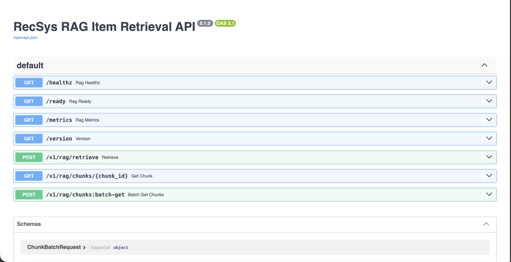

**Figure 2 — RAG API surface.** FastAPI Swagger UI exposes Kubernetes health,
readiness, metrics, and version endpoints plus semantic retrieval, exact
`chunk_id` lookup, and batch chunk lookup. This is the runtime API surface
consumed by the MCP RAG client.

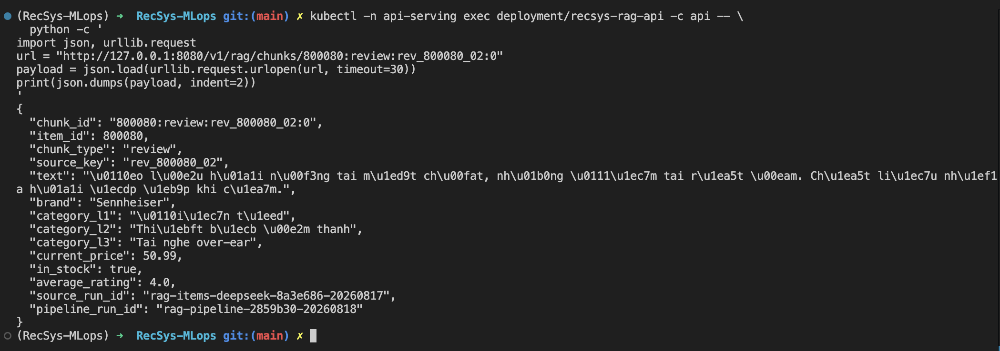

**Figure 3 — Exact chunk lookup.** A live request retrieves the promoted chunk
`800080:review:rev_800080_02:0` and returns its text, item metadata,
`source_run_id`, and `pipeline_run_id`. No embedding is returned. The identifier
is the active test chunk at capture time and is retained as immutable evidence,
not as a guarantee that the current active blue/green pointer still selects it.

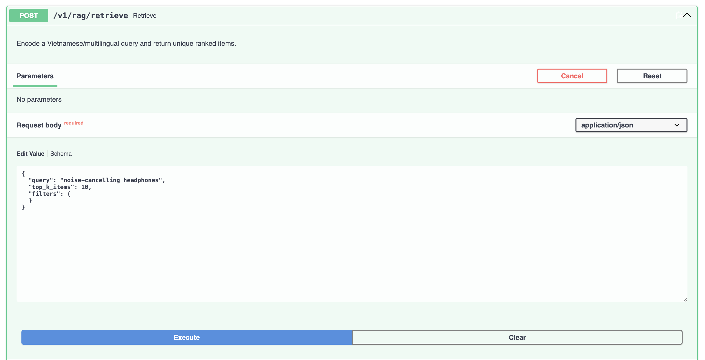

**Figure 4 — Validated semantic request.** Swagger renders the Pydantic request
contract for `/v1/rag/retrieve`, including `query`, bounded `top_k_items`, and
typed `filters`, using the query `noise-cancelling headphones`.

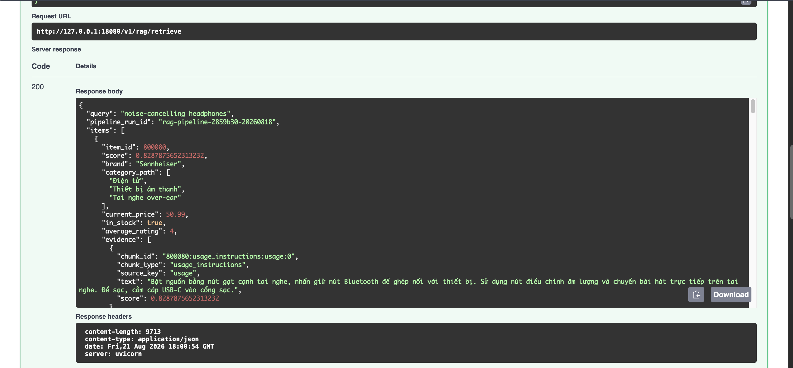

**Figure 5 — Grounded semantic response.** The successful response contains the
query, `pipeline_run_id`, ranked item metadata, score, and evidence with a
concrete `chunk_id` and source text. Together, Figures 4 and 5 prove validated
request-to-grounded-response behavior.

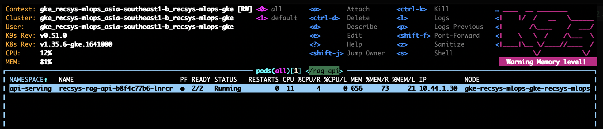

**Figure 6 — RAG baseline.** K9s shows one Ready `recsys-rag-api` pod in the
`api-serving` namespace before the autoscale workload.

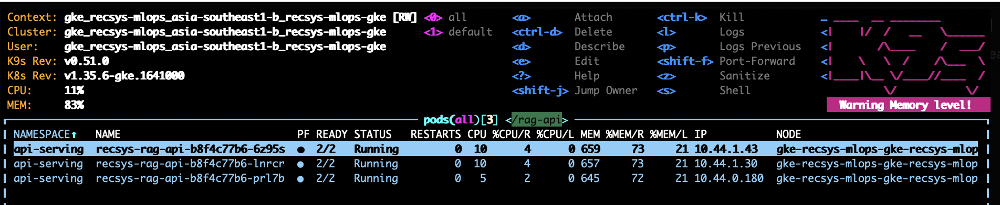

**Figure 7 — RAG scale-out.** Under load, K9s shows three Ready RAG API pods,
distributed across pod IPs/nodes. Paired with Figure 6, this is the production
scale proof from one to the configured maximum of three replicas.

## 4. MCP Server

### 4.1 MCP tools and transport

The server exposes four versioned tools over stateless Streamable HTTP.

```python
TOOL_NAMES = (
    "get_user_online_features",
    "get_chunk_by_id",
    "retrieve_rag_context",
    "build_user_rag_context",
)

mcp = FastMCP(
    "RecSys Feature and RAG MCP",
    stateless_http=True,
    json_response=True,
    transport_security=TransportSecuritySettings(
        enable_dns_rebinding_protection=True,
        allowed_hosts=list(allowed_hosts),
    ),
)
```

The MCP endpoint requires a bearer token and restricts browser origins.

```python
if request.url.path.startswith("/mcp"):
    supplied = request.headers.get("authorization", "")
    expected = f"Bearer {settings.auth_token}"
    if not hmac.compare_digest(supplied, expected):
        return JSONResponse({"detail": "unauthorized"}, 401)
```

Code references:

- [FastMCP server and tool registration](../../../apps/agentic/recsys-feature-rag-mcp/src/recsys_feature_rag_mcp/server.py#L33)
- [MCP ASGI mount and authentication](../../../apps/agentic/recsys-feature-rag-mcp/src/recsys_feature_rag_mcp/app.py#L68)
- [tool contract source of truth](../../../configs/agentic/recsys-context-agent/tools-contract.json#L1)
- [initialize, tools/list, tools/call, and validation tests](../../../tests/unit/agentic/feature_rag_mcp/test_app.py#L74)

### 4.2 Kubernetes Deployment and zero-unavailable RollingUpdate

```yaml
spec:
  strategy:
    type: RollingUpdate
    rollingUpdate:
      maxUnavailable: 0
      maxSurge: 1
  minReadySeconds: 10

  template:
    spec:
      securityContext:
        runAsNonRoot: true
        runAsUser: 10001
      containers:
        - name: mcp
          securityContext:
            allowPrivilegeEscalation: false
            readOnlyRootFilesystem: true
            capabilities: {drop: ["ALL"]}
```

Helm references:

- [MCP Deployment](../../../infra/helm/recsys-feature-rag-mcp/templates/deployment.yaml#L1)
- [MCP ClusterIP Service](../../../infra/helm/recsys-feature-rag-mcp/templates/service.yaml#L1)
- [MCP ServiceAccount](../../../infra/helm/recsys-feature-rag-mcp/templates/serviceaccount.yaml#L1)
- [MCP PDB](../../../infra/helm/recsys-feature-rag-mcp/templates/pdb.yaml#L1)
- [MCP NetworkPolicy](../../../infra/helm/recsys-feature-rag-mcp/templates/networkpolicy.yaml#L1)
- [MCP pod scrape annotations](../../../infra/helm/recsys-feature-rag-mcp/templates/deployment.yaml#L29)
- [standalone Prometheus pod-discovery job](../../../infra/helm/recsys-observability/templates/prometheus.yaml#L192)
- [default and production values](../../../infra/helm/recsys-feature-rag-mcp/values.yaml#L1)

### 4.3 KEDA autoscale and scaler fallback

```yaml
apiVersion: keda.sh/v1alpha1
kind: ScaledObject
spec:
  scaleTargetRef:
    apiVersion: apps/v1
    kind: Deployment
    name: recsys-feature-rag-mcp
  minReplicaCount: 1
  maxReplicaCount: 3
  pollingInterval: 15
  cooldownPeriod: 120
  fallback:
    failureThreshold: 3
    replicas: 1
  triggers:
    - type: prometheus
      metadata:
        query: sum(rate(recsys_mcp_tool_calls_total[1m]))
```

Configuration references:

- [MCP ScaledObject template](../../../infra/helm/recsys-feature-rag-mcp/templates/scaledobject.yaml#L1)
- [MCP default values](../../../infra/helm/recsys-feature-rag-mcp/values.yaml#L23)
- [MCP production scale values `1/3/1`](../../../infra/helm/recsys-feature-rag-mcp/values-gcp.yaml#L1)
- [MCP Prometheus metrics](../../../apps/agentic/recsys-feature-rag-mcp/src/recsys_feature_rag_mcp/observability.py#L1)
- [MCP autoscale and fallback runtime proof](../../../ops/validation/agentic_context_autoscale.sh#L1)

`fallback.replicas: 1` means KEDA keeps one MCP replica when the Prometheus
scaler fails repeatedly. It does not mean the application returns fabricated
fallback data.

### Image proof

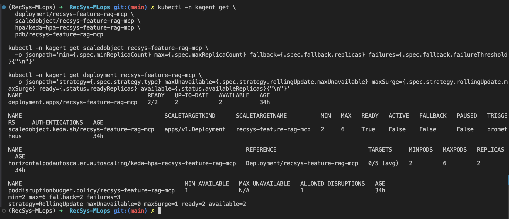

**Figure 8 — Historical deployment-policy proof (superseded bounds).** This
earlier capture proves that the MCP release had `RollingUpdate`, KEDA/HPA,
fallback, and a PDB wired into production. Its displayed `2–6–2` replica bounds
were the pre-capacity-calibration baseline and have been superseded by the
current `1–3–1` values in the referenced Helm production values. It must not be
used as evidence of the current replica limits.

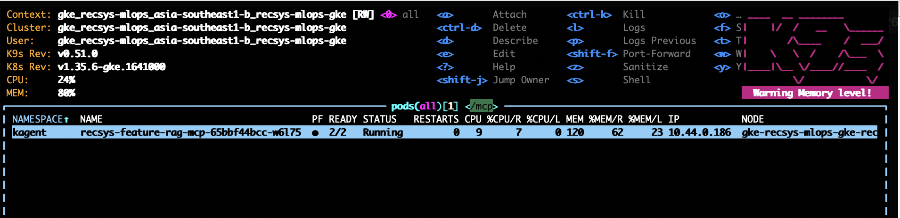

**Figure 9 — MCP baseline.** K9s shows one Ready MCP pod before load. `2/2`
means the FastAPI/MCP container and its Istio sidecar are both Ready; it does not
mean two application replicas.

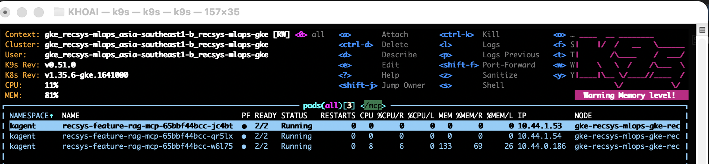

**Figure 10 — Current MCP scale-out proof.** K9s shows three Ready
`recsys-feature-rag-mcp` pods after load. Paired with Figure 9 and the current
`1–3–1` Helm/KEDA values above, this proves MCP scale-out to the production cap.
Fallback-to-one is verified by the referenced validation script and should be
captured separately when the scaler address is deliberately made unreachable.

## 5. SandboxAgent Uses MCP With Multi-Replica Autoscaling

### 5.1 RemoteMCPServer

```yaml
apiVersion: kagent.dev/v1alpha2
kind: RemoteMCPServer
metadata:
  name: recsys-feature-rag-mcp
spec:
  protocol: STREAMABLE_HTTP
  url: http://recsys-feature-rag-mcp.kagent.svc.cluster.local:8080/mcp
  timeout: 10s
  headersFrom:
    - name: Authorization
      valueFrom:
        type: Secret
        name: recsys-feature-rag-mcp-auth
        key: Authorization
```

Helm references:

- [RemoteMCPServer template](../../../infra/helm/recsys-kagent-agent/templates/remotemcpserver.yaml#L1)
- [MCP URL, token Secret, timeout, and tool values](../../../infra/helm/recsys-kagent-agent/values.yaml#L1)

### 5.2 SandboxAgent profile

```yaml
apiVersion: kagent.dev/v1alpha2
kind: SandboxAgent
metadata:
  name: recsys-context-agent-sandbox
spec:
  type: Declarative
  platform: substrate
  substrate:
    workerPoolRef:
      apiGroup: ate.dev
      kind: WorkerPool
      name: recsys-context-sandbox-pool
  declarative:
    runtime: go
    modelConfig: default-model-config
    tools:
      - type: McpServer
        mcpServer:
          kind: RemoteMCPServer
          name: recsys-feature-rag-mcp
          toolNames:
            - get_user_online_features
            - get_chunk_by_id
            - retrieve_rag_context
            - build_user_rag_context
```

Helm references:

- [SandboxAgent template, A2A skills, and MCP tool binding](../../../infra/helm/recsys-kagent-agent/templates/sandboxagent.yaml#L1)
- [Sandbox name, model, system message, and tools](../../../infra/helm/recsys-kagent-agent/values.yaml#L2)
- [GCP-only image registry override](../../../infra/helm/recsys-kagent-agent/values-gcp.yaml#L1)

#### System prompt and MCP tool context

The Context Agent does not infer tool behavior from the tool name alone. kagent
combines the declarative system prompt, the chart-owned tool allow-list, and the
description and input schema returned by MCP `tools/list` before the model
chooses a function call:

```text
systemMessage
  + allowed toolNames
  + MCP tools/list description
  + generated inputSchema
  -> model tool context
```

The following core excerpt is copied verbatim from the Context Agent's current
`systemMessage`. It establishes grounding, preferred-tool, failure, evidence,
and context-size behavior; the source reference below contains the complete
runtime prompt.

```text
You are the grounded RecSys context agent. Use MCP tools for every factual
claim about a user, item, or RAG chunk. Prefer build_user_rag_context when
both personalization and semantic evidence are needed. Never invent data
when a tool fails; state which source is unavailable. Keep answers concise
and cite the returned chunk_id values used as evidence. Preserve every
identifier exactly as returned by tools. Keep tool responses
within the 4,096-token model context: when IDs are supplied, pass only those
candidate_item_ids and use top_k at most 2 and top_k_items at most 2. When a
request explicitly names tools, call every named tool before answering.
```

FastMCP derives the four `tools/list` descriptions from the function docstrings
and derives each `inputSchema` from the annotated Python types. The executable
function bodies are omitted here; the signatures and descriptions are copied
from the registered tools.

```python
@mcp.tool()
async def get_user_online_features(
    user_id: UserId,
    candidate_item_ids: CandidateItemIds = None,
    top_k: FeatureTopK = 10,
) -> dict[str, Any]:
    """Get materialized user and candidate item features for one user ID."""
    ...

@mcp.tool()
async def get_chunk_by_id(chunk_id: ChunkId) -> dict[str, Any]:
    """Get one materialized RAG chunk from the active index by stable ID."""
    ...

@mcp.tool()
async def retrieve_rag_context(
    query: RagQuery,
    top_k_items: RagTopK = 10,
    filters: RagFilters = None,
) -> dict[str, Any]:
    """Retrieve item-grouped semantic evidence for a natural-language query."""
    ...

@mcp.tool()
async def build_user_rag_context(
    user_id: UserId,
    query: RagQuery,
    candidate_item_ids: CandidateItemIds = None,
    top_k: FeatureTopK = 10,
    top_k_items: RagTopK = 10,
    filters: RagFilters = None,
) -> dict[str, Any]:
    """Build user features and semantic evidence concurrently for one answer."""
    ...
```

Prompt and tool-context references:

- [Complete Context Agent system prompt](../../../infra/helm/recsys-kagent-agent/values.yaml#L20)
- [Context Agent MCP tool allow-list](../../../infra/helm/recsys-kagent-agent/values.yaml#L8)
- [Four FastMCP tool implementations and descriptions](../../../apps/agentic/recsys-feature-rag-mcp/src/recsys_feature_rag_mcp/server.py#L76)
- [Annotated types used to generate MCP input schemas](../../../apps/agentic/recsys-feature-rag-mcp/src/recsys_feature_rag_mcp/contracts.py#L9)
- [Canonical four-tool JSON Schema contract](../../../configs/agentic/recsys-context-agent/tools-contract.json#L1)

### 5.3 Terraform-owned gVisor WorkerPool baseline

```yaml
substrateWorkerPool:
  create: true
  name: recsys-context-sandbox-pool
  replicas: 1
  ateomImage: ghcr.io/kagent-dev/substrate/ateom-gvisor:v0.0.11
  sandboxClass: gvisor
```

Platform references:

- [kagent and WorkerPool values](../../../configs/kagent/values.yaml#L26)
- [pinned custom kagent build and Substrate `0.0.11`](../../../infra/terraform/gcp/modules/kubernetes-platform/kagent.tf#L1)
- [Terraform kagent release and WorkerPool](../../../infra/terraform/gcp/modules/kubernetes-platform/kagent.tf#L194)
- Native `/scale` contract: `.spec.replicas`, `.status.replicas`, and
  `.status.selector`.

Terraform owns the required WorkerPool baseline. The application Helm release
owns the SandboxAgent, RemoteMCPServer, WorkerPool PDB, and KEDA ScaledObject.

### 5.4 KEDA scales WorkerPool from one to three workers

```yaml
apiVersion: keda.sh/v1alpha1
kind: ScaledObject
metadata:
  name: recsys-context-sandbox-pool
spec:
  scaleTargetRef:
    apiVersion: ate.dev/v1alpha1
    kind: WorkerPool
    name: recsys-context-sandbox-pool
  minReplicaCount: 1
  maxReplicaCount: 3
  fallback:
    failureThreshold: 3
    replicas: 1
  triggers:
    - type: prometheus
      metadata:
        metricName: recsys_context_sandbox_assigned_workers
        threshold: "0.7"
        query: max(ate_workerpool_workers{ate_workerpool_namespace="kagent",ate_workerpool_name="recsys-context-sandbox-pool",ate_worker_state="assigned"})
```

Helm and test references:

- [WorkerPool-targeting ScaledObject](../../../infra/helm/recsys-kagent-agent/templates/scaledobject.yaml#L1)
- [WorkerPool autoscale values `1/3/1`](../../../infra/helm/recsys-kagent-agent/values.yaml#L34)
- [production WorkerPool threshold and bounds](../../../infra/helm/recsys-kagent-agent/values-gcp.yaml#L1)
- [WorkerPool PDB](../../../infra/helm/recsys-kagent-agent/templates/pdb.yaml#L1)
- [runtime readiness, gVisor image, and scale assertions](../../../jenkins/scripts/test/agentic.sh#L25)
- [20-concurrent-request scale and fallback proof](../../../ops/validation/agentic_context_autoscale.sh#L163)
- [rendered chart contract assertions](../../../tests/contract/test_agentic_context_contracts.py#L115)

The phrase “multi-replica Agent” means one declarative SandboxAgent profile is
executed by a multi-replica WorkerPool. The `SandboxAgent` CR itself does not
own a Deployment and is not scaled directly.

### Autoscale image proof

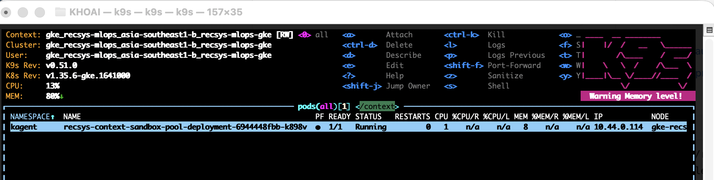

**Figure 11 — Sandbox WorkerPool baseline.** K9s shows the single Ready
WorkerPool-generated pod before the sandbox A2A load. The scalable runtime is
the `WorkerPool`; the declarative `SandboxAgent` CR is an agent profile and does
not own a Deployment.

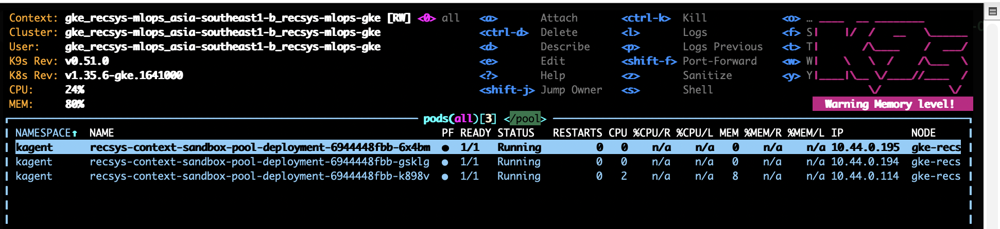

**Figure 12 — Sandbox WorkerPool scale-out.** K9s shows three Ready
`recsys-context-sandbox-pool` worker pods. Paired with Figure 11,
this proves KEDA scaling the gVisor WorkerPool from one to three workers rather
than scaling a removed regular Agent Deployment.

## 6. Sandbox Security

### 6.1 Domain-restricted sandbox network

The SandboxAgent allow-list contains only the internal MCP service DNS name.

```yaml
spec:
  sandbox:
    network:
      allowedDomains:
        - recsys-feature-rag-mcp.kagent.svc.cluster.local
```

Code and configuration references:

- [Sandbox network allow-list template](../../../infra/helm/recsys-kagent-agent/templates/sandboxagent.yaml#L14)
- [single allowed MCP domain](../../../infra/helm/recsys-kagent-agent/values.yaml#L32)
- [contract test for the exact allow-list](../../../tests/contract/test_agentic_context_contracts.py#L80)

### 6.2 gVisor isolation and least privilege

```yaml
substrateWorkerPool:
  ateomImage: ghcr.io/kagent-dev/substrate/ateom-gvisor:v0.0.6
  sandboxClass: gvisor
```

```yaml
securityContext:
  runAsNonRoot: true
  runAsUser: 10001

containers:
  - name: mcp
    securityContext:
      allowPrivilegeEscalation: false
      readOnlyRootFilesystem: true
      capabilities:
        drop: ["ALL"]
```

References:

- [gVisor WorkerPool configuration](../../../configs/kagent/values.yaml#L34)
- [MCP non-root and read-only container security](../../../infra/helm/recsys-feature-rag-mcp/templates/deployment.yaml#L34)
- [MCP NetworkPolicy](../../../infra/helm/recsys-feature-rag-mcp/templates/networkpolicy.yaml#L1)
- [Vault-backed MCP ExternalSecret enablement](../../../infra/terraform/gcp/modules/kubernetes-platform/locals.tf#L104)
- [bearer token injection into RemoteMCPServer](../../../infra/helm/recsys-kagent-agent/templates/remotemcpserver.yaml#L13)

The gVisor proof is the Substrate WorkerPool `ateom-gvisor` image and
`sandboxClass: gvisor`; this implementation does not claim a pod-level
`runtimeClassName` that is not present. The sandbox network allow-list controls
agent execution egress, while the Kubernetes NetworkPolicy separately controls
the MCP pod's ingress and downstream egress.

### Runtime image-proof status

None of the supplied screenshots directly shows the live `allowedDomains`,
WorkerPool `ateomImage`, and `sandboxClass` fields together, so this document
does not reuse an unrelated screenshot as security proof. The code, Helm,
Terraform, and contract-test references above are the current auditable
evidence.

## 7. Agent Registry and Governance

Agent Registry `0.4.0` is installed by Terraform with an external persistent
PostgreSQL database. The service remains private behind a ClusterIP.

```hcl
resource "helm_release" "agentregistry" {
  name       = "agentregistry"
  repository = "oci://ghcr.io/agentregistry-dev/agentregistry/charts"
  chart      = "agentregistry"
  version    = var.agentregistry_version
  namespace  = kubernetes_namespace.agentregistry[0].metadata[0].name
  atomic     = true
  wait       = true
}
```

Platform references:

- [Agent Registry Terraform release](../../../infra/terraform/gcp/modules/kubernetes-platform/agent_registry.tf#L49)
- [private service, restricted namespaces, and external database values](../../../configs/agentregistry/values.yaml#L1)
- [Vault and ExternalSecret configuration](../../../infra/helm/recsys-security/values.yaml#L38)

Jenkins publishes only after live MCP and sandbox A2A smoke tests pass. Registry
metadata contains the full Git commit, a version derived from the first twelve
SHA characters, and an explicit MCP dependency.

```bash
version="0.1.0+${GIT_COMMIT:0:12}"

arctl apply -f "${manifest}"
arctl get agent recsys/recsys-context-agent-sandbox \
  --tag "${version/+/-}" -o json

# Performed only after sandbox publish and runtime smoke succeed.
arctl delete agent recsys/recsys-context-agent --all-tags
```

Governance references:

- [registry version and idempotency logic](../../../jenkins/scripts/deploy/agentic.sh#L340)
- [registry manifest metadata and MCP dependency](../../../jenkins/scripts/deploy/agentic.sh#L411)
- [SandboxAgent publish and legacy regular-Agent cleanup](../../../jenkins/scripts/deploy/agentic.sh#L590)
- [registry runtime smoke](../../../ops/validation/agentic_context_registry_smoke.sh#L1)
- [application and registry deploy DAG](../../../jenkins/config/deploy-units.json#L214)

```text
feature-rag-mcp
  -> context-agent
  -> feature-rag-mcp-registry
  -> context-agent-registry
```

### Image proof

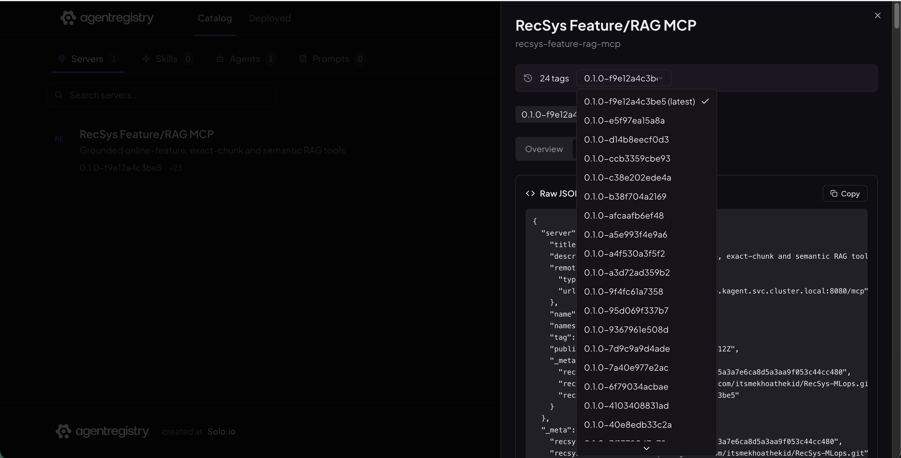

**Figure 13 — Governed MCP artifact.** Agent Registry lists
`recsys-feature-rag-mcp`, its Git-derived current tag
`0.1.0-f9e12a4c3be5`, historical tags, remote URL, source metadata, and commit.
The retained version history makes the published server auditable and supports
rollback without overwriting earlier metadata.

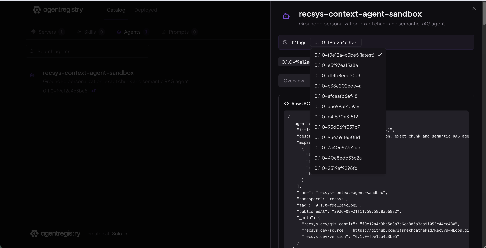

**Figure 14 — Governed SandboxAgent artifact.** Agent Registry lists only the
sandbox identity `recsys-context-agent-sandbox` with the matching current
Git-derived tag and historical versions. The removed regular Agent identity is
not used by this architecture. Together, Figures 13 and 14 prove that both the
MCP dependency and consuming SandboxAgent are published and version-governed.

## 8. Agent Chat UI

The repository does not implement a separate custom chat frontend. The UI is
the upstream `kagent-ui` installed by the Terraform-owned kagent Helm release.
The repository supplies the model, SandboxAgent, WorkerPool, MCP binding, and
security configuration that the UI discovers.

```yaml
ui:
  resources:
    requests:
      cpu: 25m
      memory: 128Mi

providers:
  default: openAI
  openAI:
    provider: OpenAI
    model: qwen3.5-0.8b
    config:
      baseUrl: http://llm-d-inference-gateway.llm-inference.svc.cluster.local/v1
      maxTokens: 384
      temperature: "0"
      seed: 42
```

References:

- [kagent UI, global model, and WorkerPool values](../../../configs/kagent/values.yaml#L43)
- [Terraform-owned kagent installation](../../../infra/terraform/gcp/modules/kubernetes-platform/kagent.tf#L194)
- [SandboxAgent system message and A2A skills](../../../infra/helm/recsys-kagent-agent/values.yaml#L13)
- [sandbox A2A smoke entry point](../../../jenkins/scripts/deploy/agentic.sh#L154)
- [four grounded UI-equivalent A2A test cases](../../../jenkins/scripts/deploy/agentic.sh#L194)
- [retained grounded A2A evidence](../../../reports/agentic/recsys-context-agent-sandbox-a2a.json)

The sandbox A2A endpoint is:

```text
/api/a2a-sandboxes/kagent/recsys-context-agent-sandbox/
```

The runtime smoke verifies all four MCP tools, checks both function-call and
function-response history, requires A2A state `completed`, and rejects RAG
answers that do not contain grounded `chunk_id` evidence.

### Image proof

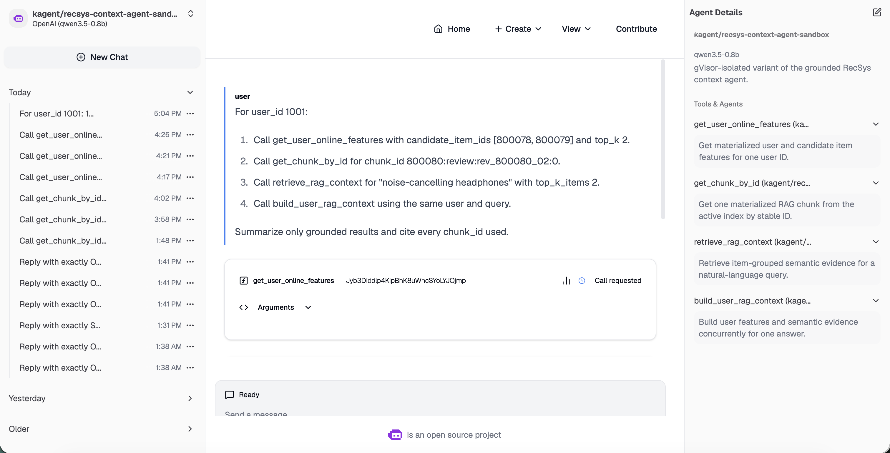

**Figure 15 — kagent SandboxAgent UI binding.** The selected agent is
`kagent/recsys-context-agent-sandbox`, described as the gVisor-isolated variant
and backed by `qwen3.5-0.8b`. The details panel exposes exactly the four
contracted MCP tools, while the conversation shows a tool call being requested.
This screenshot proves UI discovery, correct agent selection, and tool binding;
the completed grounded response is asserted separately by the retained A2A
runtime evidence linked above, so this figure is not overclaimed as a complete
four-tool response transcript.

## 9. CI/CD and Contract Evidence

The two application components have separate ownership and release units.

| Component | Build output | Deployment responsibility |
| --- | --- | --- |
| `feature_rag_mcp` | immutable `recsys-feature-rag-mcp` image | MCP Helm release and MCP registry metadata |
| `context_agent` | no custom image | SandboxAgent, RemoteMCPServer, WorkerPool KEDA/PDB, and agent registry metadata |

References:

- [Jenkins component detection and dependencies](../../../jenkins/config/components.json#L478)
- [Helm and registry deploy units](../../../jenkins/config/deploy-units.json#L214)
- [MCP and agent runtime tests](../../../jenkins/scripts/test/agentic.sh#L1)
- [cross-chart contract tests](../../../tests/contract/test_agentic_context_contracts.py#L68)
- [local developer targets](../../../Makefile#L126)

The contract test proves the rendered application release contains exactly:

- zero regular `Agent` resources;
- one `SandboxAgent`;
- one `RemoteMCPServer`;
- one WorkerPool-targeting `ScaledObject`;
- the exact four tools in `tools-contract.json`;
- MCP `RollingUpdate` with `maxUnavailable: 0` and `maxSurge: 1`; and
- production MCP and WorkerPool KEDA bounds/fallback of `1/3/1`;
- production RAG API KEDA bounds of `1/3`.

## 10. Runtime Verification Commands

### 10.1 Run repository gates

```bash
make test-agentic
make helm-agentic
make agentic-preflight
```

### 10.2 Verify deployed resources

```bash
kubectl -n kagent get \
  sandboxagent,remotemcpserver,workerpool,scaledobject,hpa,pdb

kubectl -n kagent get deployment \
  recsys-feature-rag-mcp \
  recsys-context-sandbox-pool-deployment

kubectl -n kagent get agent recsys-context-agent
kubectl -n kagent get deployment recsys-context-agent
# Both commands above must return NotFound.
```

### 10.3 Health and grounded end-to-end smoke

```bash
AGENTIC_SMOKE_CHUNK_ID='800096:review:rev_800096_01:0' \
  AGENTIC_SMOKE_USER_ID='1001' \
  make agentic-smoke
```

Evidence is written to `reports/agentic/`, including the SandboxAgent A2A
history for all four MCP tools.

### 10.4 Autoscale and fallback

The production WorkerPool validation sends one grounded
`get_user_online_features(user_id=1001)` request and observes the native
assigned-worker gauge. `backpressure_rejections` records immediate JSON-RPC
admission rejection rather than transport failure. After WorkerPool fallback
reaches one replica, the validation restores the original Prometheus address.

The longer regression proof remains available as `make agentic-autoscale-test`.
The production WorkerPool uses a 300-second scale-down stabilization/cooldown;
the proof waits through that window before accepting the final one-replica
state.

The final production stress run recorded `6195` offers, `7` grounded
completions, and `6188` expected admission backpressure responses while proving
`1 -> 2 -> 3 -> 2 -> 1`. With the Prometheus endpoint intentionally broken,
the ScaledObject reached `Fallback=True` and held desired/available replicas at
`1/1`; cleanup restored Prometheus, both Qwen replicas, and the UI.

### 10.5 Registry governance

```bash
make agentic-registry-smoke
```

The expected terminal message is:

```text
Agent Registry contains MCP and SandboxAgent only at <version> (<tag>).
```

## 11. Submission Accuracy Notes

- Say **one SandboxAgent profile backed by 1–3 WorkerPool replicas**, not
  “SandboxAgent has a Deployment with replicas.”
- Say **KEDA targets the WorkerPool `/scale` subresource**, not a removed regular
  Agent Deployment.
- Say **MCP calls downstream HTTP APIs**, not “MCP directly reads Redis or
  Milvus.”
- Say **gVisor is provided by Substrate `ateom-gvisor` and `sandboxClass`**, not
  by a pod `runtimeClassName` that is absent from this implementation.
- Say **Agent Registry provides governance and versioned discovery**, not that
  every chat request is routed through Agent Registry.
