# Sandboxed Recommendation Agent Uses the Recommendation Service

> **Runtime status (updated 2026-08-27):** production runs the custom kagent v6
> compatibility image with Substrate `0.0.11`; values select assigned-worker
> KEDA. Recommendation proved `1 -> 2 -> 3 -> 2 -> 1`, completed `2187/2187`
> load requests, and proved fallback to one. CPU mode remains only for rollback.

This submission section proves that the recommendation flow:

- exposes the existing `POST /recommendations` serving boundary through a
  dedicated FastAPI and FastMCP service;
- validates tool inputs and downstream outputs with Pydantic;
- uses asynchronous, pooled HTTP transport without importing Feast, Redis,
  Triton, or the context/RAG agent runtime;
- deploys the MCP server with Helm, zero-unavailable `RollingUpdate`, KEDA
  autoscaling, PDB protection, and scaler fallback;
- runs one declarative `SandboxAgent` profile on a dedicated gVisor
  `WorkerPool` scaled by KEDA from one to three workers;
- publishes both the MCP server and SandboxAgent to Agent Registry; and
- demonstrates a grounded recommendation call in the kagent Chat UI.

The online-feature implementation used internally by the inference service is
documented separately in
[Web API Pull Data](<../rubic-final-coursework-(final-ml)/web-api-pull-data.md>).
The context/RAG agent is documented in
[Agent Pull Data](agent_pull_data.md). The recommendation agent does **not**
call that agent: it makes one recommendation MCP call, and the existing
inference API owns feature retrieval, Triton routing, scoring, and Top-K.

## 1. Implemented Architecture

```text
kagent Chat UI
  -> SandboxAgent/recsys-recommendation-agent-sandbox
  -> WorkerPool/recsys-recommendation-sandbox-pool
       -> Substrate ateom-gvisor workers
       -> KEDA targets ate.dev/v1alpha1 WorkerPool /scale
  -> RemoteMCPServer/recsys-recommendation-mcp
  -> recsys-recommendation-mcp FastAPI + FastMCP Deployment
       -> POST recsys-inference-api.api-serving.svc/recommendations
            -> recsys-online-feature-api
            -> KServe/Triton BST
            -> model-ranked Top-K + A/B metadata

Prometheus
  <- ServiceMonitor scrapes MCP and inference API metrics
  -> KEDA Prometheus scalers
  -> HPA controls MCP Deployment and recommendation WorkerPool

Agent Registry
  <- Jenkins publishes versioned MCPServer and SandboxAgent metadata
     only after protocol, runtime, and A2A smoke tests pass
```

There is no `type: Agent`, A2A reference, context-agent tool, feature/RAG MCP
tool, or LLM reranking step in this flow. `SandboxAgent` is the single agent
profile. Multi-replica execution is supplied by its dedicated WorkerPool.

### 1.1 Shared autoscaling control loop

All three scalable runtime layers follow the same native Kubernetes loop:

```text
Application completes work or Substrate assigns a sandbox worker
  -> Prometheus application rate or assigned-worker gauge increases
  -> ServiceMonitor exposes the metric to Prometheus
  -> KEDA queries Prometheus every polling interval
  -> KEDA external metric is consumed by an HPA
  -> HPA writes the target /scale subresource
  -> Deployment or WorkerPool controller reconciles replicas
  -> readiness gates make new replicas Available
```

The recommendation inference API, recommendation MCP, and sandbox WorkerPool
scale independently. Their production bounds are all `min=1`, `max=3`. The MCP
and WorkerPool additionally configure KEDA fallback to one replica.

### 1.2 Recommendation FastAPI autoscaling stages

#### Stage 1: completed recommendation requests produce the signal

The inference service owns the public request and emits the shared API request
counter after request completion:

```python
@app.post("/recommendations", response_model=RecommendationResponse)
async def recommendations(
    payload: RecommendationRequest,
    request: Request,
) -> RecommendationResponse:
    online_features = await request.app.state.feature_service.fetch(...)
    response = await recommend_from_online_features(
        online_features=online_features,
        top_k=payload.top_k,
        route=route,
    )
    return response
```

References:

- [Inference FastAPI endpoint](../../../apps/api-serving/inference-api/src/recsys_inference_api/app.py)
- [Shared serving observability](../../../apps/api-serving/shared/src/recsys_serving_common/observability.py)

#### Stage 2: Prometheus scrapes request rate and latency

```yaml
spec:
  endpoints:
    - port: http
      path: /metrics
      interval: 15s
```

The inference ScaledObject queries both completed `POST /recommendations`
request rate and average latency:

```yaml
query: >-
  sum(rate(recsys_api_requests_total{
    service="recsys-inference-api",
    route="/recommendations",
    method="POST"
  }[1m]))
```

References:

- [Inference ServiceMonitor](../../../infra/helm/recsys-inference-api/templates/servicemonitor.yaml)
- [Inference KEDA queries](../../../infra/helm/recsys-inference-api/templates/scaledobject.yaml)

#### Stage 3: KEDA and HPA select `1..3`

```yaml
autoscaling:
  enabled: true
  minReplicas: 1
  maxReplicas: 3
  pollingInterval: 10
  cooldownPeriod: 120
  requestRate:
    targetValue: "5"
  latency:
    targetValue: "0.20"
```

Reference: [Inference API Helm values](../../../infra/helm/recsys-inference-api/values.yaml).

#### Stage 4: RollingUpdate and probes complete scale-out

```yaml
strategy:
  type: RollingUpdate
  rollingUpdate:
    maxUnavailable: 0
    maxSurge: 1
containers:
  - name: api
    startupProbe: {httpGet: {path: /healthz, port: http}}
    readinessProbe: {httpGet: {path: /ready, port: http}}
    livenessProbe: {httpGet: {path: /healthz, port: http}}
```

Reference: [Inference Deployment](../../../infra/helm/recsys-inference-api/templates/deployment.yaml).

### 1.3 Recommendation MCP autoscaling stages

#### Stage 1: completed MCP tool calls produce the signal

```python
TOOL_CALLS = Counter(
    "recsys_recommendation_mcp_tool_calls_total",
    "Recommendation MCP calls by terminal status.",
    ("status",),
)

@mcp.tool()
async def get_personalized_recommendations(...):
    response = await inference_client.recommend(...)
    TOOL_CALLS.labels(tool_result_status(response)).inc()
    return response.model_dump()
```

References:

- [Recommendation MCP metrics](../../../apps/agentic/recsys-recommendation-mcp/src/recsys_recommendation_mcp/observability.py)
- [Recommendation MCP tool](../../../apps/agentic/recsys-recommendation-mcp/src/recsys_recommendation_mcp/server.py)

#### Stage 2: Prometheus scrapes and KEDA queries tool-call rate

```yaml
query: 'sum(rate(recsys_recommendation_mcp_tool_calls_total[1m]))'
metricName: recsys_recommendation_mcp_requests_per_second
threshold: "1"
```

References:

- [MCP ServiceMonitor](../../../infra/helm/recsys-recommendation-mcp/templates/servicemonitor.yaml)
- [MCP Prometheus trigger](../../../infra/helm/recsys-recommendation-mcp/templates/scaledobject.yaml)

#### Stage 3: KEDA/HPA scales the stateless MCP Deployment

```yaml
scaleTargetRef:
  apiVersion: apps/v1
  kind: Deployment
  name: recsys-recommendation-mcp
minReplicaCount: 1
maxReplicaCount: 3
fallback:
  failureThreshold: 3
  replicas: 1
triggers:
  - type: prometheus
    metricType: AverageValue
    metadata:
      threshold: "0.7"
      query: max(ate_workerpool_workers{ate_workerpool_namespace="kagent",ate_workerpool_name="recsys-recommendation-sandbox-pool",ate_worker_state="assigned"})
```

FastMCP is configured with `stateless_http=True` and `json_response=True`, so
any Ready replica can serve a request. When Prometheus fails three consecutive
times, KEDA reports `Fallback=True` and maintains one MCP replica.

References:

- [MCP ScaledObject](../../../infra/helm/recsys-recommendation-mcp/templates/scaledobject.yaml)
- [Production MCP `1/3/1`](../../../infra/helm/recsys-recommendation-mcp/values-gcp.yaml)
- [Stateless FastMCP server](../../../apps/agentic/recsys-recommendation-mcp/src/recsys_recommendation_mcp/server.py)

#### Stage 4: Deployment, probes, and RollingUpdate make replicas usable

The MCP chart uses zero-unavailable rolling updates, a PDB with
`minAvailable: 1`, topology spread, soft anti-affinity, startup/readiness/
liveness probes, and an immutable non-root container.

References:

- [MCP Deployment](../../../infra/helm/recsys-recommendation-mcp/templates/deployment.yaml)
- [MCP PDB](../../../infra/helm/recsys-recommendation-mcp/templates/pdb.yaml)

### 1.4 Recommendation SandboxAgent autoscaling stages

#### Stage 1: A2A sessions assign gVisor workers

The declarative agent profile binds to the dedicated WorkerPool:

```yaml
spec:
  platform: substrate
  substrate:
    workerPoolRef:
      apiGroup: ate.dev
      kind: WorkerPool
      name: recsys-recommendation-sandbox-pool
```

Reference: [Recommendation SandboxAgent](../../../infra/helm/recsys-recommendation-agent/templates/sandboxagent.yaml).

#### Stage 2: Prometheus measures assigned workers

```promql
max(ate_workerpool_workers{
  ate_workerpool_namespace="kagent",
  ate_workerpool_name="recsys-recommendation-sandbox-pool",
  ate_worker_state="assigned"
})
```

KEDA compares the maximum assigned-worker gauge with `AverageValue=0.7`.

#### Stage 3: HPA targets the WorkerPool `/scale` subresource

```yaml
scaleTargetRef:
  apiVersion: ate.dev/v1alpha1
  kind: WorkerPool
  name: recsys-recommendation-sandbox-pool
minReplicaCount: 1
maxReplicaCount: 3
fallback:
  failureThreshold: 3
  replicas: 1
```

References:

- [WorkerPool ScaledObject](../../../infra/helm/recsys-recommendation-agent/templates/scaledobject.yaml)
- [WorkerPool production values](../../../infra/helm/recsys-recommendation-agent/values-gcp.yaml)
- Substrate `0.0.11` supplies the native WorkerPool `/scale` selector through
  `.status.selector`; the `0.0.6` compatibility post-renderer was removed.

#### Stage 4: Substrate reconciles the generated gVisor Deployment

```text
KEDA-generated HPA
  -> WorkerPool/recsys-recommendation-sandbox-pool /scale
  -> Substrate WorkerPool controller
  -> recsys-recommendation-sandbox-pool
  -> 1..3 ateom-gvisor worker pods
```

Terraform owns the WorkerPool runtime and deliberately treats live replicas as
computed. The application Helm chart owns its ScaledObject and PDB. This avoids
Terraform overwriting KEDA's replica decisions.

References:

- [Terraform recommendation WorkerPool](../../../infra/terraform/gcp/kagent.tf)
- [WorkerPool PDB](../../../infra/helm/recsys-recommendation-agent/templates/pdb.yaml)
- [Runtime autoscale proof](../../../ops/validation/recommendation_agentic_autoscale.sh)

## 2. Recommendation Service

### 2.1 Recommendation input contract

```python
class RecommendationRequest(BaseModel):
    user_id: int = Field(ge=1)
    candidate_item_ids: list[int] | None = Field(
        default=None,
        min_length=1,
        max_length=500,
    )
    top_k: int = Field(default=10, ge=1, le=100)
```

Example request:

```json
{
  "user_id": 1001,
  "candidate_item_ids": null,
  "top_k": 3
}
```

When candidates are omitted, the inference API asks the online-feature service
for the candidate set. The MCP does not reproduce that logic.

References:

- [Inference request schema](../../../apps/api-serving/inference-api/src/recsys_inference_api/schemas.py)
- [MCP request policy](../../../apps/agentic/recsys-recommendation-mcp/src/recsys_recommendation_mcp/policy.py)

### 2.2 Online features and Triton ownership

```python
online_features = await request.app.state.feature_service.fetch(
    OnlineFeaturesRequest(
        user_id=payload.user_id,
        candidate_item_ids=payload.candidate_item_ids,
        top_k=payload.top_k,
    )
)
response = await recommend_from_online_features(
    online_features=online_features,
    top_k=payload.top_k,
    route=route,
)
```

The inference service selects the A/B route, pulls online features, constructs
the Triton tensor payload, calls the BST ranker, and formats the response.

References:

- [Inference orchestration](../../../apps/api-serving/inference-api/src/recsys_inference_api/app.py)
- [Online-feature client](../../../apps/api-serving/inference-api/src/recsys_inference_api/feature_client.py)
- [Triton ranking path](../../../apps/api-serving/inference-api/src/recsys_inference_api/ranking.py)
- [A/B route selection](../../../apps/api-serving/inference-api/src/recsys_inference_api/ab_testing.py)

### 2.3 Model-ranked Top-K integrity

```python
pairs = sorted(
    zip(candidate_item_ids, [float(score) for score in scores]),
    key=lambda item: item[1],
    reverse=True,
)[:top_k]
```

The response preserves `user_id`, `model_version`, `ab_variant`,
`ab_experiment_id`, `item_id`, score, and order. The MCP validates and returns
that response without reranking. The agent only presents it.

References:

- [Top-K formatter](../../../apps/api-serving/inference-api/src/recsys_inference_api/ranking.py)
- [MCP pass-through response model](../../../apps/agentic/recsys-recommendation-mcp/src/recsys_recommendation_mcp/contracts.py)
- [Ranking-integrity tests](../../../tests/integration/recommendation_agentic/test_inference_http_contract.py)

### 2.4 MCP downstream boundary

```text
Recommendation SandboxAgent
  -> one recommendation MCP tool
  -> pooled HTTP POST /recommendations
  -> recsys-inference-api owns all serving logic
```

The MCP package contains no Feast, Redis, Triton, RAG, or context-agent runtime
dependency. It calls only the public inference API ClusterIP.

References:

- [Async inference client](../../../apps/agentic/recsys-recommendation-mcp/src/recsys_recommendation_mcp/client.py)
- [MCP ConfigMap](../../../infra/helm/recsys-recommendation-mcp/templates/configmap.yaml)
- [No-context-agent contract test](../../../tests/e2e/recommendation_agentic/test_no_context_agent_dependency.py)

## 3. FastAPI Proof

### 3.1 FastAPI application composition

```python
app = FastAPI(
    title="RecSys Recommendation MCP",
    version=__version__,
    lifespan=lifespan,
)
FastAPIInstrumentor.instrument_app(
    app,
    excluded_urls="healthz,ready,metrics",
)
app.mount("/", mcp.streamable_http_app())
```

FastAPI owns operational HTTP endpoints and middleware. FastMCP is mounted into
the same ASGI application and serves Streamable HTTP at `/mcp`.

References:

- [FastAPI composition root](../../../apps/agentic/recsys-recommendation-mcp/src/recsys_recommendation_mcp/app.py)
- [Package definition](../../../apps/agentic/recsys-recommendation-mcp/pyproject.toml)

### 3.2 Data validation with Pydantic

```python
UserId = Annotated[int, Field(ge=1)]
CandidateList = Annotated[list[int], Field(min_length=1, max_length=500)]
CandidateItemIds = CandidateList | None
TopK = Annotated[int, Field(ge=1, le=100)]

class StrictModel(BaseModel):
    model_config = ConfigDict(extra="forbid")
```

The same constraints appear in the checked-in tool contract. Schema drift is a
CI failure because the contract test compares Pydantic/FastMCP `tools/list` and
the SandboxAgent Helm render.

References:

- [MCP Pydantic contracts](../../../apps/agentic/recsys-recommendation-mcp/src/recsys_recommendation_mcp/contracts.py)
- [Tool contract](../../../configs/agentic/recsys-recommendation-agent/tools-contract.json)
- [Cross-chart contract tests](../../../tests/contract/test_recommendation_agentic_contracts.py)

### 3.3 Kubernetes health checks

```python
@app.get("/healthz")
async def healthz() -> dict[str, str]:
    return {"status": "ok"}

@app.get("/ready")
async def ready() -> JSONResponse:
    if not settings.auth_token:
        return JSONResponse({"status": "not_ready"}, status_code=503)
    return JSONResponse({"status": "ready"})
```

```yaml
startupProbe: {httpGet: {path: /healthz, port: http}}
readinessProbe: {httpGet: {path: /ready, port: http}}
livenessProbe: {httpGet: {path: /healthz, port: http}}
```

References:

- [Health/readiness/version handlers](../../../apps/agentic/recsys-recommendation-mcp/src/recsys_recommendation_mcp/app.py)
- [Kubernetes probes](../../../infra/helm/recsys-recommendation-mcp/templates/deployment.yaml)

### Image proof

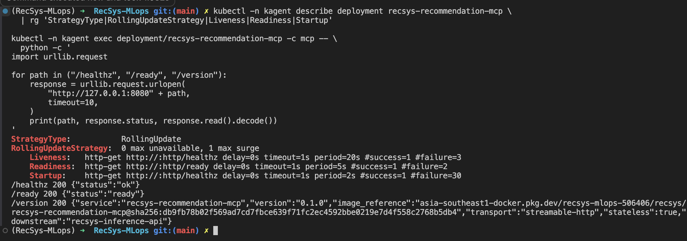

**Figure 1 — Recommendation MCP FastAPI and Kubernetes healthcheck proof.**
The live capture shows `RollingUpdate` with zero unavailable and one surge pod,
the startup/readiness/liveness probes, and successful `/healthz`, `/ready`, and
`/version` responses. The version response identifies the stateless
Streamable HTTP service and immutable Artifact Registry image digest; no bearer
token or Secret value is exposed.

### 3.4 Async proof

```python
@asynccontextmanager
async def lifespan(_: FastAPI) -> AsyncIterator[None]:
    try:
        async with mcp.session_manager.run():
            yield
    finally:
        await inference_client.aclose()

async def get_personalized_recommendations(...):
    response = await inference_client.recommend(...)
```

```python
self.client = httpx.AsyncClient(
    base_url=base_url,
    timeout=httpx.Timeout(request_timeout_seconds),
    limits=httpx.Limits(
        max_connections=max_connections,
        max_keepalive_connections=max_keepalive_connections,
    ),
)
```

The client has one shared connection pool, a 15-second total deadline, and at
most one jittered retry for network errors or HTTP `502/503`.

References:

- [Async application lifecycle](../../../apps/agentic/recsys-recommendation-mcp/src/recsys_recommendation_mcp/app.py)
- [Pooled async client and retry](../../../apps/agentic/recsys-recommendation-mcp/src/recsys_recommendation_mcp/client.py)
- [Async integration tests](../../../tests/integration/recommendation_agentic/test_inference_http_contract.py)

### 3.5 Get recommendations through the inference API

```python
response = await self.client.post(
    "/recommendations",
    json=payload,
    headers=headers,
)
return RecommendationResponse.model_validate(response.json())
```

Unlike the context-data MCP, this service intentionally does **not** use Feast
SDK directly. `recsys-inference-api` owns the online-feature call and Triton
ranking. This boundary removes an extra agent/LLM turn and keeps ranking logic
in the serving service.

Reference: [Inference API client](../../../apps/agentic/recsys-recommendation-mcp/src/recsys_recommendation_mcp/client.py).

### Runtime image proof

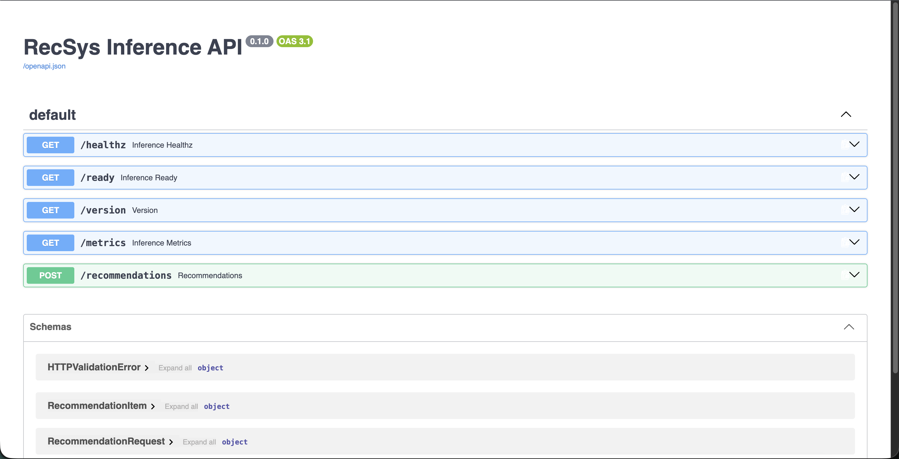

**Figure 2 — Recommendation API OpenAPI surface.** The live Swagger UI exposes
`POST /recommendations` together with `/healthz`, `/ready`, `/version`, and
`/metrics`, plus the typed recommendation request/response schemas.

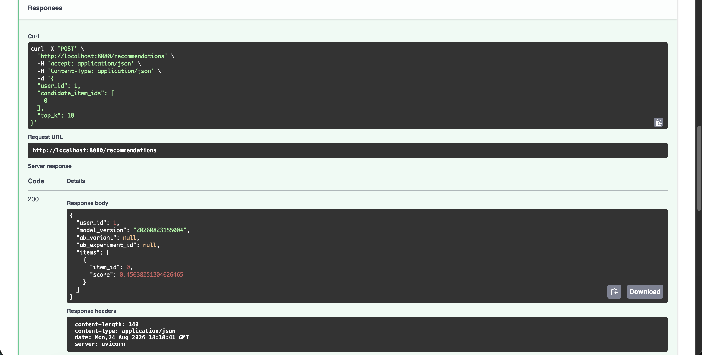

**Figure 3 — Direct serving request.** Swagger records a successful HTTP `200`
request for `user_id=1` constrained to candidate item `0`. The response returns
the same item with its model score and the deployed model version. The null
A/B fields accurately show that this particular request was not assigned to an
experiment.

> **Figures 4 and 5 — capture pending.** The submitted image set does not yet
> contain the invalid-request `422` proof or a multi-item candidate-constrained
> response. Capture Figure 4 with the invalid input and failed Pydantic
> constraint in one frame. Capture Figure 5 with descending scores and
> model/A-B metadata. Figure 3 is not used as a substitute for either proof.

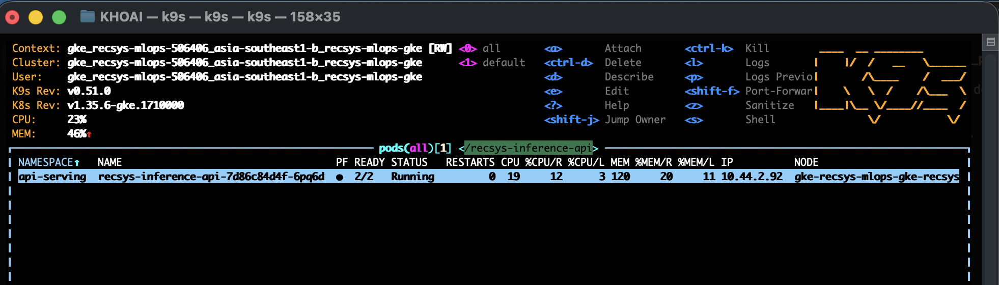

**Figure 6 — Inference API baseline.** K9s shows one Ready and Running
`recsys-inference-api` pod in namespace `api-serving` before load, with the
namespace, resource usage, pod IP, and node columns visible.

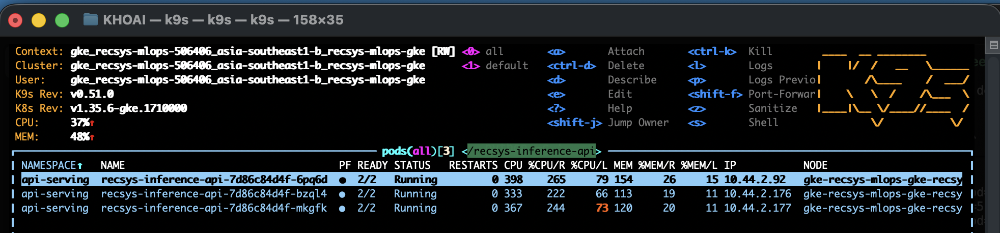

**Figure 7 — Inference API scale-out.** Under recommendation load, K9s shows
three separate `2/2 Ready` and Running inference API pods with distinct pod IPs.
Paired with Figure 6, this proves scale-out from the configured minimum of one
to the maximum of three replicas.

## 4. MCP Server

### 4.1 MCP tool and transport

```python
mcp = FastMCP(
    "RecSys Recommendation MCP",
    stateless_http=True,
    json_response=True,
    transport_security=TransportSecuritySettings(
        enable_dns_rebinding_protection=True,
        allowed_hosts=list(allowed_hosts),
    ),
)
```

Exactly one tool is exposed:

```text
get_personalized_recommendations(
  user_id: int,
  candidate_item_ids: list[int] | null = null,
  top_k: int = 10
)
```

The `/mcp` route requires a bearer token and restricts browser origins. Invalid
Pydantic input fails before the downstream API call. Downstream failures are
serialized as typed, non-fabricated service errors.

References:

- [FastMCP server](../../../apps/agentic/recsys-recommendation-mcp/src/recsys_recommendation_mcp/server.py)
- [MCP authentication middleware](../../../apps/agentic/recsys-recommendation-mcp/src/recsys_recommendation_mcp/app.py)
- [Typed downstream errors](../../../apps/agentic/recsys-recommendation-mcp/src/recsys_recommendation_mcp/errors.py)

### 4.2 Kubernetes Deployment and zero-unavailable RollingUpdate

```yaml
strategy:
  type: RollingUpdate
  rollingUpdate:
    maxUnavailable: 0
    maxSurge: 1
securityContext:
  runAsNonRoot: true
  runAsUser: 10001
containers:
  - name: mcp
    securityContext:
      allowPrivilegeEscalation: false
      readOnlyRootFilesystem: true
      capabilities: {drop: ["ALL"]}
```

The release also creates a ClusterIP Service, ServiceAccount, PDB,
ServiceMonitor, NetworkPolicy, topology spreading, and soft pod anti-affinity.

References:

- [MCP Deployment](../../../infra/helm/recsys-recommendation-mcp/templates/deployment.yaml)
- [MCP Service](../../../infra/helm/recsys-recommendation-mcp/templates/service.yaml)
- [MCP ServiceAccount](../../../infra/helm/recsys-recommendation-mcp/templates/serviceaccount.yaml)
- [MCP PDB](../../../infra/helm/recsys-recommendation-mcp/templates/pdb.yaml)
- [MCP NetworkPolicy](../../../infra/helm/recsys-recommendation-mcp/templates/networkpolicy.yaml)
- [MCP ServiceMonitor](../../../infra/helm/recsys-recommendation-mcp/templates/servicemonitor.yaml)
- [Immutable image](../../../images/agentic/recsys-recommendation-mcp/Dockerfile)

### 4.3 KEDA autoscale and scaler fallback

```yaml
autoscaling:
  minReplicas: 1
  maxReplicas: 3
  pollingInterval: 15
  cooldownPeriod: 120
  requestRateTarget: "1"
  fallback:
    failureThreshold: 3
    replicas: 1
```

References:

- [MCP ScaledObject template](../../../infra/helm/recsys-recommendation-mcp/templates/scaledobject.yaml)
- [MCP defaults](../../../infra/helm/recsys-recommendation-mcp/values.yaml)
- [MCP production placement and `1/3/1`](../../../infra/helm/recsys-recommendation-mcp/values-gcp.yaml)
- [MCP autoscale/fallback proof](../../../ops/validation/recommendation_agentic_autoscale.sh)

### Image proof

> **Figure 8 — capture pending.** Figure 1 proves the Deployment rollout and
> probe configuration, but the submitted image set does not contain one frame
> with the ScaledObject `1/3/1`, generated HPA, PDB `minAvailable=1`, and Ready
> conditions. Keep this as a separate terminal proof rather than overclaiming
> Figure 1.

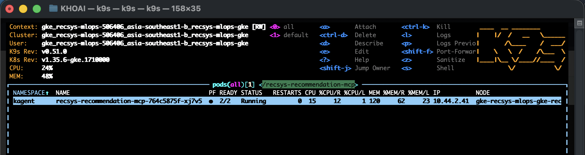

**Figure 9 — MCP baseline.** K9s shows one Running
`recsys-recommendation-mcp` pod before load. Its `2/2 Ready` value represents
the MCP container plus Istio sidecar in one pod, not two replicas.

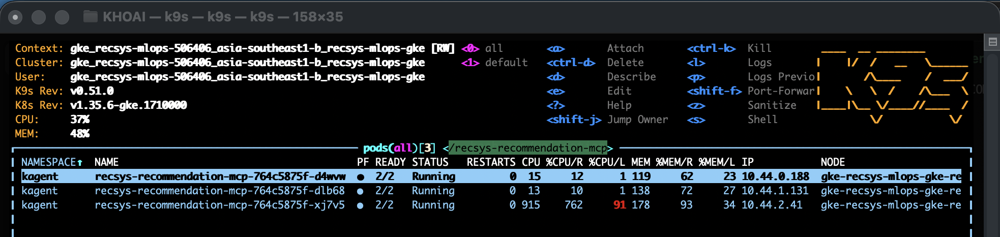

**Figure 10 — MCP scale-out.** During MCP request-rate load, the same K9s Pods
view shows three separate `2/2 Ready` and Running MCP pods. Paired with Figure
9, this proves KEDA-driven scale-out from one to three replicas.

## 5. SandboxAgent Uses MCP With Multi-Replica Autoscaling

### 5.1 RemoteMCPServer

```yaml
apiVersion: kagent.dev/v1alpha2
kind: RemoteMCPServer
metadata:
  name: recsys-recommendation-mcp
spec:
  protocol: STREAMABLE_HTTP
  url: http://recsys-recommendation-mcp.kagent.svc.cluster.local:8080/mcp
  timeout: 15s
  headersFrom:
    - name: Authorization
      valueFrom:
        type: Secret
        name: recsys-recommendation-mcp-auth
        key: Authorization
```

References:

- [RemoteMCPServer template](../../../infra/helm/recsys-recommendation-agent/templates/remotemcpserver.yaml)
- [MCP URL, timeout, Secret reference, and tool values](../../../infra/helm/recsys-recommendation-agent/values.yaml)

### 5.2 SandboxAgent profile

```yaml
apiVersion: kagent.dev/v1alpha2
kind: SandboxAgent
metadata:
  name: recsys-recommendation-agent-sandbox
spec:
  type: Declarative
  platform: substrate
  declarative:
    runtime: go
    modelConfig: default-model-config
    tools:
      - type: McpServer
        mcpServer:
          name: recsys-recommendation-mcp
          toolNames:
            - get_personalized_recommendations
```

The prompt requires one tool call, preserves service order and scores, forbids
LLM reranking, and forbids context-agent/RAG/feature tool calls.

Reference: [SandboxAgent, prompt, A2A skill, and one-tool binding](../../../infra/helm/recsys-recommendation-agent/templates/sandboxagent.yaml).

### 5.3 Terraform-owned dedicated gVisor WorkerPool

```hcl
resource "kubernetes_manifest" "recsys_recommendation_sandbox_pool" {
  manifest = {
    apiVersion = "ate.dev/v1alpha1"
    kind       = "WorkerPool"
    metadata = {
      name      = "recsys-recommendation-sandbox-pool"
      namespace = "kagent"
    }
    spec = {
      replicas      = 1
      ateomImage = "ghcr.io/kagent-dev/substrate/ateom-gvisor:v0.0.11"
    }
  }
  computed_fields = ["spec.replicas"]
}
```

References:

- [Dedicated recommendation WorkerPool](../../../infra/terraform/gcp/kagent.tf)
- [Pinned kagent/Substrate versions](../../../infra/terraform/gcp/kagent.tf)
- [KEDA WorkerPool `/scale` RBAC](../../../infra/terraform/gcp/kagent.tf)

### 5.4 KEDA scales WorkerPool from one to three workers

```yaml
autoscaling:
  metricMode: assignedWorkers
  minReplicas: 1
  maxReplicas: 3
  assignedWorkersPerReplica: "0.7"
  fallback:
    failureThreshold: 3
    replicas: 1
```

The scalable runtime is the WorkerPool and its generated Deployment—not the
declarative SandboxAgent CR.

References:

- [WorkerPool ScaledObject](../../../infra/helm/recsys-recommendation-agent/templates/scaledobject.yaml)
- [WorkerPool values `1/3/1`](../../../infra/helm/recsys-recommendation-agent/values.yaml)
- [Production WorkerPool override](../../../infra/helm/recsys-recommendation-agent/values-gcp.yaml)
- [WorkerPool PDB](../../../infra/helm/recsys-recommendation-agent/templates/pdb.yaml)
- [Autoscale validation](../../../ops/validation/recommendation_agentic_autoscale.sh)

### Autoscale image proof

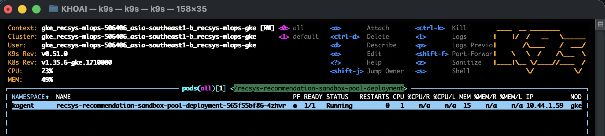

**Figure 11 — Sandbox WorkerPool baseline.** K9s shows the single `1/1 Ready`
and Running `recsys-recommendation-sandbox-pool-deployment` pod after the
scale-down window. The `SandboxAgent` remains one declarative profile.

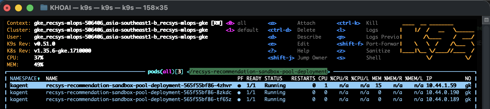

**Figure 12 — Sandbox WorkerPool scale-out.** During concurrent A2A work, K9s
shows three separate `1/1 Ready` and Running gVisor worker pods. Paired with
Figure 11, this proves the WorkerPool—not the declarative SandboxAgent CR—scales
from one to three workers.

## 6. Sandbox Security

### 6.1 Domain-restricted sandbox network

```yaml
sandbox:
  network:
    allowedDomains:
      - recsys-recommendation-mcp.kagent.svc.cluster.local
```

The allow-list excludes the context agent, Feature/RAG MCP, inference API,
online-feature API, Triton, and public domains. The agent can reach only its
dedicated recommendation MCP.

References:

- [Single allowed domain](../../../infra/helm/recsys-recommendation-agent/values.yaml)
- [Sandbox network render](../../../infra/helm/recsys-recommendation-agent/templates/sandboxagent.yaml)

### 6.2 gVisor isolation and least privilege

```text
SandboxAgent platform=substrate
  -> WorkerPool ateomImage=ateom-gvisor:v0.0.11
  -> MCP container UID/GID 10001
  -> read-only root filesystem
  -> all Linux capabilities dropped
  -> NetworkPolicy permits only DNS, inference API, and observability egress
```

References:

- [gVisor WorkerPool](../../../infra/terraform/gcp/kagent.tf)
- [MCP container security](../../../infra/helm/recsys-recommendation-mcp/templates/deployment.yaml)
- [MCP NetworkPolicy](../../../infra/helm/recsys-recommendation-mcp/templates/networkpolicy.yaml)
- [RemoteMCPServer Secret reference](../../../infra/helm/recsys-recommendation-agent/templates/remotemcpserver.yaml)

### Runtime image-proof status

Capture the live SandboxAgent `allowedDomains`, WorkerPool `ateomImage` and
native `status.selector`, and MCP pod security context together. The RemoteMCPServer may
show the Secret **reference**, but Secret values must be redacted. Pair this
with one successful recommendation call and, if demonstrated separately, one
denied external-domain request.

The final production autoscale run completed `2187/2187` concurrent A2A load
requests without error and proved `1 -> 2 -> 3 -> 2 -> 1`. Breaking the
Prometheus endpoint made KEDA report `Fallback=True` with desired replicas at
one; the validation trap restored the original endpoint and the scaler returned
to `Ready=True`, `Active=False`, `Fallback=False`.

## 7. Agent Registry and Governance

Jenkins publishes only after live MCP protocol smoke and SandboxAgent A2A smoke
succeed. Registry versions are derived from the same Git commit:

```text
recsys/recsys-recommendation-mcp
recsys/recsys-recommendation-agent-sandbox
version: 0.1.0+<12-character-git-sha>
tag:     0.1.0-<12-character-git-sha>
```

The SandboxAgent manifest declares the MCP artifact dependency. Publishing is
idempotent: a matching version/commit is a no-op, while mismatched metadata at
the same version fails the pipeline.

References:

- [Registry manifest generation and publish actions](../../../jenkins/scripts/deploy/agentic.sh)
- [Registry runtime smoke](../../../ops/validation/recommendation_agentic_registry_smoke.sh)
- [Recommendation deploy units](../../../jenkins/config/deploy-units.json)

### Image proof

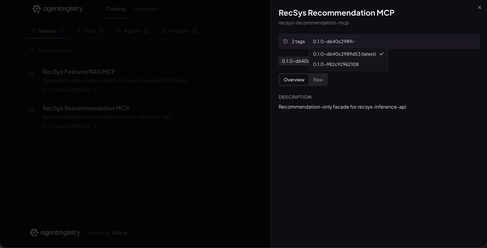

**Figure 13 — Governed MCP artifact.** Agent Registry Catalog shows the RecSys
Recommendation MCP artifact, its recommendation-only service description, and
two version tags with the 12-character Git-derived suffix. The immutable image
reference remains a Raw-metadata/terminal verification item because it is not
visible in this Overview capture.

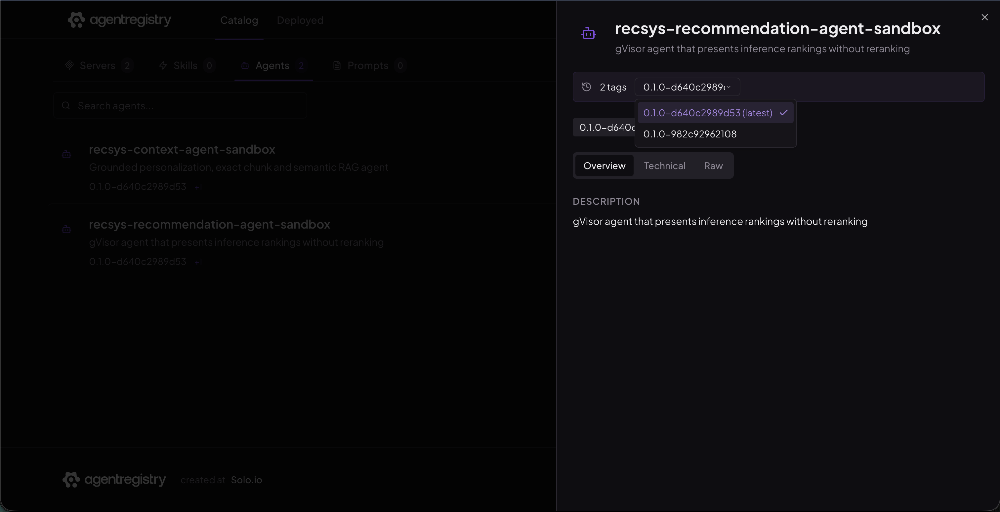

**Figure 14 — Governed SandboxAgent artifact.** Agent Registry Catalog shows
`recsys-recommendation-agent-sandbox`, its gVisor/no-reranking description, and
the same two version tags as the MCP publication. The MCP dependency should be
verified in Technical or Raw metadata; it is not claimed as visible here.

## 8. Agent Chat UI

The Terraform-owned kagent installation supplies the UI and global
`default-model-config` backed by `qwen3.5-0.8b`. The application chart supplies
the recommendation SandboxAgent profile and its one-tool MCP binding. The
current shared model settings are deterministic (`temperature=0`, `seed=42`,
`maxTokens=384`); older screenshots that show a 256-token completion cap are
retained as historical evidence rather than the live configuration.

The acceptance conversation is:

```text
Recommend exactly 3 items for user_id=1001. Call
get_personalized_recommendations exactly once with candidate_item_ids=null and
top_k=3. Preserve service order and show item_id, score, model_version and A/B
metadata.
```

The tool history must contain exactly one
`get_personalized_recommendations` function call and one function response. The
final message must not invent product names, attributes, user preferences, or
RAG evidence.

References:

- [Recommendation SandboxAgent prompt](../../../infra/helm/recsys-recommendation-agent/values.yaml)
- [Single-tool contract](../../../configs/agentic/recsys-recommendation-agent/tools-contract.json)
- [A2A production smoke](../../../jenkins/scripts/deploy/agentic.sh)
- [No-context dependency test](../../../tests/e2e/recommendation_agentic/test_no_context_agent_dependency.py)

### Image proof

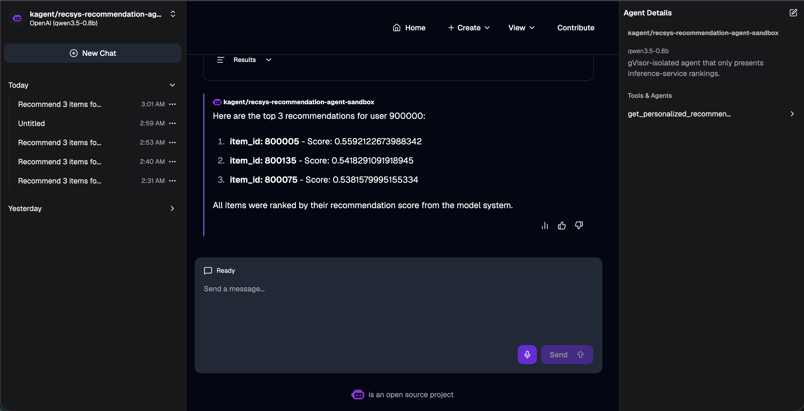

**Figure 15 — kagent Chat UI.** The selected
`recsys-recommendation-agent-sandbox` exposes one recommendation tool and
presents three model-ranked item IDs and scores for `user_id=900000` in the UI.
The collapsed capture does not expose the function-call arguments or
model/A-B metadata, so those remain terminal/tool-trace verification items.

## 9. CI/CD and Contract Evidence

| Component | Image | Deploy and governance units |
|---|---|---|
| `inference_api` | existing immutable inference image | inference API Helm release |
| `recommendation_mcp` | immutable `recsys-recommendation-mcp` image | MCP Helm release and MCP registry metadata |
| `recommendation_agent` | no custom image | SandboxAgent, RemoteMCPServer, WorkerPool KEDA/PDB, and agent registry metadata |

The recommendation components do not depend on `context_agent` or
`feature_rag_mcp`. The deployment order is:

```text
inference-api
  -> recommendation-mcp
  -> recommendation-agent
  -> recommendation-mcp-registry
  -> recommendation-agent-registry
```

PR gates include Ruff, compile/type checks, unit/integration/contract/e2e
tests, coverage, mutation tests for the new package, Helm lint/render,
kubeconform, and image build proof. Main builds by full Git SHA, resolves the
immutable digest, deploys with atomic Helm semantics, runs smoke tests, and only
then publishes registry metadata.

References:

- [Component routing](../../../jenkins/config/components.json)
- [Deploy DAG](../../../jenkins/config/deploy-units.json)
- [Image catalog](../../../images/catalog.json)
- [Recommendation CI gates](../../../jenkins/scripts/ci/agentic.sh)
- [Recommendation runtime verification](../../../jenkins/scripts/test/agentic.sh)
- [Contract tests](../../../tests/contract/test_recommendation_agentic_contracts.py)

## 10. Runtime Verification Commands

Run all commands from the repository root:

```bash
cd /Users/KHOAI/anhkhoa/RecSys-MLops
```

### 10.1 Run repository gates

```bash
make test-recommendation-agentic helm-recommendation-agentic
```

### 10.2 Verify deployed resources

```bash
make recommendation-agentic-preflight recommendation-agentic-smoke

kubectl -n kagent get \
  remotemcpserver/recsys-recommendation-mcp \
  sandboxagent/recsys-recommendation-agent-sandbox \
  workerpool/recsys-recommendation-sandbox-pool

# The recommendation agent must not depend on either resource.
kubectl -n kagent get sandboxagent recsys-recommendation-agent-sandbox -o yaml \
  | grep -E 'recsys-context-agent|recsys-feature-rag-mcp' && exit 1 || true
```

### 10.3 Health and grounded end-to-end smoke

Terminal A:

```bash
kubectl -n kagent port-forward service/recsys-recommendation-mcp 18087:8080
```

Terminal B:

```bash
curl -sS http://127.0.0.1:18087/healthz | jq
curl -sS http://127.0.0.1:18087/ready | jq
curl -sS http://127.0.0.1:18087/version | jq
```

Direct inference API proof:

```bash
kubectl -n api-serving port-forward service/recsys-inference-api 18086:80
```

```bash
curl -sS -X POST http://127.0.0.1:18086/recommendations \
  -H 'Content-Type: application/json' \
  -d '{"user_id":1001,"candidate_item_ids":null,"top_k":3}' | jq

curl -sS -X POST http://127.0.0.1:18086/recommendations \
  -H 'Content-Type: application/json' \
  -d '{"user_id":0,"candidate_item_ids":null,"top_k":101}' | jq
```

### 10.4 Autoscale and fallback

Open K9s in a separate terminal:

```bash
k9s -n kagent
```

Use `:pods` for the actual before/after screenshots, filtering with
`/recsys-recommendation`. Use `:hpa` and `:so` for supplementary controller
evidence, `:workerpools` for WorkerPool identity, and `:sandboxagents` for agent
readiness.

Inference API `1 -> 3`:

```bash
SERVICE=recsys-inference-api \
RECSYS_LOAD_TARGET=api \
LOCUST_USERS=180 \
LOCUST_SPAWN_RATE=60 \
LOCUST_DURATION=4m \
  bash ops/validation/serving_autoscale_load_test.sh
```

In K9s switch to namespace `api-serving`; capture `:pods` filtered by
`/recsys-inference-api` when one row exists before load and again when three
Ready rows exist. Capture `:hpa` separately when desired/current reaches three.

Recommendation MCP `1 -> 3`:

```bash
RECOMMENDATION_MCP_LOAD_SECONDS=120 \
RECOMMENDATION_MCP_LOAD_CONCURRENCY=8 \
RECOMMENDATION_SCALE_TIMEOUT_SECONDS=300 \
  bash ops/validation/recommendation_agentic_autoscale.sh mcp \
  | tee /tmp/recommendation-mcp-autoscale-proof.log
```

Recommendation WorkerPool `1 -> 3`:

```bash
RECOMMENDATION_SCALE_TIMEOUT_SECONDS=300 \
  bash ops/validation/recommendation_agentic_autoscale.sh worker \
  | tee /tmp/recommendation-worker-autoscale-proof.log
```

Prometheus-scaler fallback to one replica, with automatic restore through the
script trap:

```bash
RECOMMENDATION_PROVE_FALLBACK=true \
RECOMMENDATION_SCALE_TIMEOUT_SECONDS=300 \
  bash ops/validation/recommendation_agentic_autoscale.sh fallback \
  | tee /tmp/recommendation-fallback-proof.log
```

Expected fallback lines:

```text
recsys-recommendation-mcp fallback=True desired=1
recsys-recommendation-sandbox-pool fallback=True desired=1
```

Verify restoration:

```bash
kubectl -n kagent get scaledobject \
  recsys-recommendation-mcp \
  recsys-recommendation-sandbox-pool \
  -o custom-columns='NAME:.metadata.name,MIN:.spec.minReplicaCount,MAX:.spec.maxReplicaCount,READY:.status.conditions[?(@.type=="Ready")].status,FALLBACK:.status.conditions[?(@.type=="Fallback")].status'
```

### 10.5 Exact figure-by-figure capture matrix

The following table intentionally mirrors the figure sequence in
`agent_pull_data.md`.

There are **15 figure slots**. The current submission contains **12 semantic
screenshot files**: Figures 1–3, 6–7, and 9–15. Figures 4, 5, and 8 remain
explicitly marked capture-pending so the document neither links missing files
nor overstates what another image proves. The three autoscaling topics each use
separate baseline and scale-out images (`6/7`, `9/10`, and `11/12`), matching
the proof style in `agent_pull_data.md`.

| Figure | Recommendation capture must contain | K9s/command view |
|---|---|---|
| 1 | `/healthz`, `/ready`, `/version` plus live startup/readiness/liveness probes | `curl` plus `kubectl get deployment ... -o yaml` |
| 2 | FastAPI `/docs`, `POST /recommendations`, request/response schema | Browser at `http://localhost:18086/docs` |
| 3 | Valid direct request and exact ranked response | `curl POST /recommendations` |
| 4 | Invalid input and FastAPI `422` details | invalid `curl POST` |
| 5 | Candidate-constrained output with descending scores and metadata | valid candidate request |
| 6 | One Running inference API pod row before load | namespace `api-serving`, `:pods`, filter `/recsys-inference-api` |
| 7 | Three separate Ready inference API pod rows | same `:pods` view and filter; HPA is supplementary |
| 8 | MCP RollingUpdate `0/1`, KEDA `1/3/1`, PDB `minAvailable=1` | `kubectl get ... -o yaml` |
| 9 | One Running MCP pod row with `READY=2/2` | namespace `kagent`, `:pods`, filter `/recsys-recommendation-mcp` |
| 10 | Three separate Ready MCP pod rows | same `:pods` view and filter; HPA is supplementary |
| 11 | One Running WorkerPool pod row with `READY=1/1` | namespace `kagent`, `:pods`, filter `/recsys-recommendation-sandbox-pool` |
| 12 | Three separate `1/1 Running` WorkerPool pod rows | same `:pods` view and filter; HPA/WorkerPool are supplementary |
| 13 | MCP registry identity, version history, Git SHA, immutable image | Agent Registry Catalog MCP details |
| 14 | SandboxAgent registry identity, same SHA, MCP dependency | Agent Registry Catalog Agent details |
| 15 | Selected SandboxAgent, one tool call, typed arguments, unchanged result | kagent Chat UI |

Do not substitute a Deployment table, HPA table, or terminal-only replica count
for Figures 6/7, 9/10, and 11/12. They intentionally use the same K9s Pods
view, filter, columns, and one-row-to-three-row visual transition as the
corresponding figures in `agent_pull_data.md`.

Use these exact outputs for the two terminal-style infrastructure figures.
For Figure 1, keep the port-forward running and place the endpoint responses
beside the probe output in the same screenshot:

```bash
for endpoint in healthz ready version; do
  curl -sS "http://127.0.0.1:18087/${endpoint}" | jq
done

kubectl -n kagent get deployment recsys-recommendation-mcp \
  -o jsonpath='startup={.spec.template.spec.containers[?(@.name=="mcp")].startupProbe.httpGet.path}{"\n"}readiness={.spec.template.spec.containers[?(@.name=="mcp")].readinessProbe.httpGet.path}{"\n"}liveness={.spec.template.spec.containers[?(@.name=="mcp")].livenessProbe.httpGet.path}{"\n"}'
```

For Figure 5, use a fixed candidate list so the captured request and model
order are reproducible:

```bash
curl -sS -X POST http://127.0.0.1:18086/recommendations \
  -H 'Content-Type: application/json' \
  -d '{"user_id":1001,"candidate_item_ids":[800080,800081],"top_k":2}' \
  | jq
```

For Figure 8, use a wide terminal and keep all four output blocks visible:

```bash
kubectl -n kagent get deployment recsys-recommendation-mcp \
  -o custom-columns='NAME:.metadata.name,TYPE:.spec.strategy.type,MAX_UNAVAILABLE:.spec.strategy.rollingUpdate.maxUnavailable,MAX_SURGE:.spec.strategy.rollingUpdate.maxSurge,AVAILABLE:.status.availableReplicas'

kubectl -n kagent get scaledobject recsys-recommendation-mcp \
  -o custom-columns='NAME:.metadata.name,TARGET_KIND:.spec.scaleTargetRef.kind,TARGET:.spec.scaleTargetRef.name,MIN:.spec.minReplicaCount,MAX:.spec.maxReplicaCount,FALLBACK:.spec.fallback.replicas,READY:.status.conditions[?(@.type=="Ready")].status'

kubectl -n kagent get hpa keda-hpa-recsys-recommendation-mcp \
  -o custom-columns='NAME:.metadata.name,TARGET_KIND:.spec.scaleTargetRef.kind,TARGET:.spec.scaleTargetRef.name,MIN:.spec.minReplicas,MAX:.spec.maxReplicas,CURRENT:.status.currentReplicas,DESIRED:.status.desiredReplicas'

kubectl -n kagent get pdb recsys-recommendation-mcp \
  -o custom-columns='NAME:.metadata.name,MIN_AVAILABLE:.spec.minAvailable,CURRENT_HEALTHY:.status.currentHealthy,DESIRED_HEALTHY:.status.desiredHealthy,ALLOWED_DISRUPTIONS:.status.disruptionsAllowed'

kubectl -n kagent get pods \
  -l app.kubernetes.io/name=recsys-recommendation-mcp \
  -o wide
```

The 12 captured proofs use descriptive, kebab-case filenames under
`docs/pngs/`, matching the convention in `agent_pull_data.md`. Verify them with:

```bash
for image in \
  agent-recommendation-service-fastapi-kubernetes-healthchecks.png \
  agent-recommendation-service-api-openapi-surface.png \
  agent-recommendation-service-direct-request-response.png \
  agent-recommendation-service-inference-baseline-1-replica.png \
  agent-recommendation-service-inference-scaleout-3-replicas.png \
  agent-recommendation-service-mcp-baseline-1-replica.png \
  agent-recommendation-service-mcp-scaleout-3-replicas.png \
  agent-recommendation-service-workerpool-baseline-1-replica.png \
  agent-recommendation-service-workerpool-scaleout-3-replicas.png \
  agent-recommendation-service-registry-mcp-version-history.png \
  agent-recommendation-service-registry-sandbox-agent-version-history.png \
  agent-recommendation-service-kagent-ui-ranked-recommendations.png; do
  test -f "docs/pngs/${image}" || echo "MISSING docs/pngs/${image}"
done
```

Capture Figures 4, 5, and 8 with the commands above before adding their image
references. Do not duplicate or relabel one of the 12 existing proofs.

### 10.6 Registry governance

```bash
make recommendation-agentic-registry
```

Expected terminal output confirms that both artifacts match the current full
Git commit. To capture the Catalog:

```bash
kubectl -n agentregistry port-forward service/agentregistry 12121:12121
```

Open `http://localhost:12121`, select Catalog, and open each recommendation
artifact's details page.

### 10.7 Agent Chat UI and latency proof

```bash
kubectl -n kagent port-forward service/kagent-ui 8080:8080
```

Open `http://localhost:8080`, select
`recsys-recommendation-agent-sandbox`, and send the acceptance prompt from
Section 8.

Latency and no-context-agent proof:

```bash
RECOMMENDATION_LATENCY_REQUESTS=20 \
RECOMMENDATION_AGENT_LATENCY_REQUESTS=3 \
  make recommendation-agentic-latency

jq . reports/agentic/recommendation-latency.json
```

The JSON must report `no_context_agent_call: true`, direct API p95, MCP p95,
MCP overhead, and agent p95.

## 11. Submission Accuracy Notes

- Say **one recommendation SandboxAgent profile backed by 1–3 dedicated
  WorkerPool replicas**, not “the SandboxAgent CR has three replicas.”
- Say **KEDA targets the WorkerPool `/scale` subresource**, not the declarative
  SandboxAgent.
- Say **the recommendation MCP calls `recsys-inference-api`**, not Feast,
  Redis, Triton, Feature/RAG MCP, or context-agent directly.
- Say **the inference service owns online-feature retrieval, A/B routing,
  Triton scoring, and Top-K**.
- Say **the LLM presents the model-ranked response without reranking**.
- Say **Agent Registry supplies governance, version history, and discovery**;
  runtime chat traffic is not routed through Agent Registry.
- For autoscale proof, show both HPA desired replicas and Deployment Available
  replicas. A Pending third pod is not successful proof.
- `2/2` in an Istio-injected MCP pod means two containers in one pod; it does
  not mean two replicas.
- Never capture bearer tokens, Vault values, Kubernetes Secret data, Registry
  credentials, or the model gateway API key.
- Do not label the context/RAG agent as a recommendation dependency. The
  contract and latency proof explicitly require no context-agent call.
