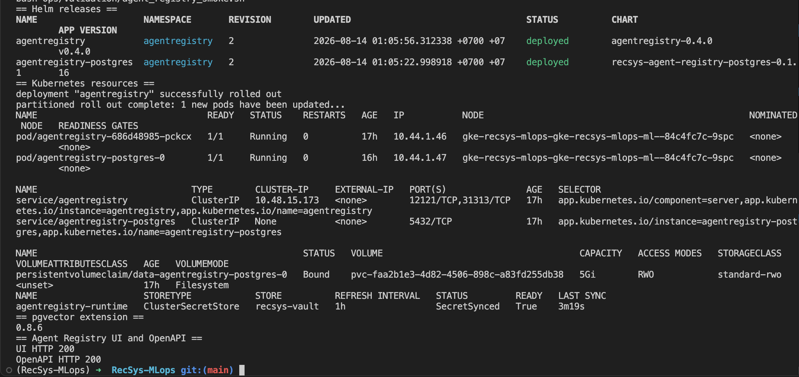
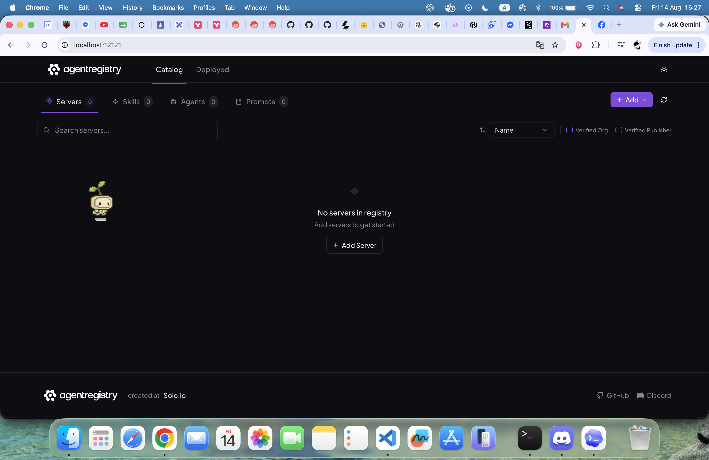

# Agent Registry

> Rubric: **Deploy registry for agent following the Agent Registry tutorial and
> capture proof that the registry is deployed.**

## Result

Agent Registry is deployed in the `agentregistry` namespace on GKE. The live
installation uses:

- official Agent Registry OCI Helm chart `0.4.0`;
- external PostgreSQL 16 with pgvector `0.8.6` and a persistent 5 Gi PVC;
- HashiCorp Vault KV v2 as the source of truth for database credentials;
- External Secrets Operator to materialize `Secret/agentregistry-runtime`;
- namespace-scoped write RBAC for only `agentregistry` and `kagent`;
- a private `ClusterIP` service accessed locally through `kubectl port-forward`;
- the existing kagent installation as the Kubernetes agent runtime.

The deployment was verified on 14 August 2026: both Helm releases were
`deployed`, both pods were `1/1 Running`, the ExternalSecret was
`SecretSynced/True`, pgvector reported version `0.8.6`, and both the UI and
OpenAPI endpoints returned HTTP `200`.

The repository target was changed back to
`SandboxAgent/recsys-coordinator-agent-sandbox` on 27 August 2026. Its catalog
identity is `recsys/recsys-coordinator-agent-sandbox`. Healthy Substrate/Valkey,
three-pool autoscale evidence, the complete v19 Coordinator routing baseline,
and the v21 isolated-session Recommendation gate pass in production. Jenkins
still treats publication as a separate gate:
it publishes the sandbox identity after its dependencies and smoke checks, then
retires `recsys/recsys-coordinator-agent`; it never retires the old identity
before the new artifact is verified.

## What Agent Registry Is

[Agent Registry](https://aregistry.ai/docs/about/) is a centralized catalog for
AI artifacts such as agents, MCP servers, skills, and prompts. It stores their
metadata, versions, dependencies, approval state, deployment records, and the
location of the underlying image or source.

It is not a replacement for an OCI registry:

| Component | Responsibility in this project |
| --- | --- |
| Artifact Registry/GHCR | Stores container image layers. |
| Agent Registry | Catalogs approved agent artifacts and initiates deployments. |
| kagent | Creates and reconciles the Kubernetes `Agent` workloads. |
| Global `ModelConfig` | Supplies the shared OpenAI-compatible model configuration. |
| Agent Gateway | Authenticates and routes model traffic to llm-d. |

The runtime flow is:

```text
Developer / arctl / UI
        |
        v
Agent Registry API ----> PostgreSQL + pgvector
        |
        | creates kagent resources
        v
kagent Agent ----> global ModelConfig ----> Agent Gateway ----> llm-d
```

**Code block provenance:** architecture derived from the deployed Terraform
dependencies in [agent_registry.tf (line 33)](../../../infra/terraform/gcp/agent_registry.tf#L33)
and the shared model configuration documented in
[global_model_config.md](./global_model_config.md).

## Step 1 — Enable and pin Agent Registry

Enable the feature only when Vault and the existing LLM/kagent stack are also
enabled:

```hcl
deploy_llm_inference  = true
deploy_vault          = true
deploy_agent_registry = true
```

The committed example keeps the feature disabled by default, while documenting
its prerequisites. The real environment sets it to `true` in the ignored
`terraform.tfvars` file.

**Code reference:** [terraform.tfvars.example (line 45)](../../../infra/terraform/gcp/terraform.tfvars.example#L45).

Terraform pins the official chart and refuses the deployment if Vault or
kagent is unavailable:

```hcl
variable "agentregistry_version" {
  description = "Pinned official Agent Registry OCI Helm chart version."
  type        = string
  default     = "0.4.0"
}

resource "kubernetes_namespace" "agentregistry" {
  count = var.deploy_agent_registry ? 1 : 0

  metadata {
    name = "agentregistry"
    labels = {
      istio-injection = "disabled"
    }
  }
}
```

**Code reference:** [agent_registry.tf (line 1)](../../../infra/terraform/gcp/agent_registry.tf#L1).

The upstream Kubernetes page currently shows the older `v0.3.3` value schema.
This repository instead pins the currently rendered OCI chart `0.4.0`. Its
database configuration uses `database.postgres.external.secretRef`, not the
older `database.host` and `database.password` fields. See the
[official Kubernetes installation guide](https://aregistry.ai/docs/install/kubernetes/).

## Step 2 — Register Agent Registry secrets in Vault

The database needs four keys:

```text
POSTGRES_DB
POSTGRES_USER
POSTGRES_PASSWORD
AGENT_REGISTRY_DATABASE_URL
```

The password is generated without being printed. The complete payload is sent
over stdin to Vault KV v2 at `recsys/agentregistry`. If the group already
exists, bootstrap keeps the current Vault version instead of overwriting it.

```bash
cd /Users/KHOAI/anhkhoa/RecSys-MLops
bash ops/gcp/bootstrap_vault.sh
```

**Code references:** [bootstrap_vault.sh (line 15)](../../../ops/gcp/bootstrap_vault.sh#L15)
registers the group and [bootstrap_vault.sh (line 192)](../../../ops/gcp/bootstrap_vault.sh#L192)
generates/writes its four values. The Terraform migration payload and random
password are defined in [secret_management.tf (line 65)](../../../infra/terraform/gcp/secret_management.tf#L65)
and [secrets.tf (line 26)](../../../infra/terraform/gcp/secrets.tf#L26).

## Step 3 — Sync the Vault group into Kubernetes

The security chart maps Vault path `agentregistry` to a namespace-local Secret:

```yaml
agentRegistry:
  enabled: false
  namespace: agentregistry
  secretName: agentregistry-runtime
  vaultPath: agentregistry
```

Terraform changes `enabled` to `true` when `deploy_agent_registry=true`.

**Helm values reference:** [recsys-security/values.yaml (line 38)](../../../infra/helm/recsys-security/values.yaml#L38)
defines the Agent Registry value block. **Terraform values override reference:**
[locals.tf (line 104)](../../../infra/terraform/gcp/locals.tf#L104) enables that
block for the GCP release.

The shared template creates an `ExternalSecret` using
`ClusterSecretStore/recsys-vault`, with `creationPolicy: Owner` and `dataFrom`
pointing to the Vault group:

```yaml
spec:
  secretStoreRef:
    kind: ClusterSecretStore
    name: recsys-vault
  target:
    name: agentregistry-runtime
    creationPolicy: Owner
  dataFrom:
    - extract:
        key: agentregistry
```

**Helm template reference:** [recsys-security/templates/externalsecrets.yaml (line 8)](../../../infra/helm/recsys-security/templates/externalsecrets.yaml#L8)
renders the Kubernetes `ExternalSecret`; this file is a chart template, not a
values file.

Terraform does not start PostgreSQL until the ExternalSecret is `Ready` and
the target Kubernetes Secret exists.

**Code reference:** [secret_management.tf (line 92)](../../../infra/terraform/gcp/secret_management.tf#L92).

## Step 4 — Deploy persistent PostgreSQL with pgvector

The official guide requires external PostgreSQL with pgvector for Kubernetes
and warns that the bundled database is only for development/testing. This
deployment therefore uses a repository-owned supporting chart around the
official `pgvector/pgvector:0.8.6-pg16` image.

```yaml
image:
  repository: pgvector/pgvector
  tag: 0.8.6-pg16

secret:
  name: agentregistry-runtime
  databaseKey: POSTGRES_DB
  usernameKey: POSTGRES_USER
  passwordKey: POSTGRES_PASSWORD

persistence:
  storageClassName: standard-rwo
  size: 5Gi
```

**Helm values reference:** [recsys-agent-registry-postgres/values.yaml (line 1)](../../../infra/helm/recsys-agent-registry-postgres/values.yaml#L1).
This supplies defaults to the local pgvector Helm chart; it does not render a
Kubernetes resource by itself.

The StatefulSet reads all credentials from the synchronized Secret, mounts a
PVC, and includes readiness/liveness checks:

```yaml
- name: POSTGRES_PASSWORD
  valueFrom:
    secretKeyRef:
      name: agentregistry-runtime
      key: POSTGRES_PASSWORD
```

**Helm template reference:** [recsys-agent-registry-postgres/templates/statefulset.yaml (line 28)](../../../infra/helm/recsys-agent-registry-postgres/templates/statefulset.yaml#L28)
renders the PostgreSQL `StatefulSet`.

The init SQL guarantees the extension is available:

```sql
CREATE EXTENSION IF NOT EXISTS vector;
```

**Helm template reference:** [recsys-agent-registry-postgres/templates/configmap.yaml (line 7)](../../../infra/helm/recsys-agent-registry-postgres/templates/configmap.yaml#L7)
renders the pgvector initialization `ConfigMap`.

Both database and registry are placed on the `ml-system` node pool. This is
required by the live cluster because the general CPU service node is already
quota-constrained.

**Helm values references:** [local PostgreSQL chart values (line 39)](../../../infra/helm/recsys-agent-registry-postgres/values.yaml#L39)
and [upstream Agent Registry chart override values (line 34)](../../../configs/agentregistry/values.yaml#L34).

## Step 5 — Configure the official Agent Registry chart

The values keep the service private, connect to the external database through
the Secret reference, and restrict write RBAC to two namespaces:

```yaml
service:
  type: ClusterIP

rbac:
  enabled: true
  watchedNamespaces:
    - agentregistry
    - kagent

database:
  postgres:
    type: external
    external:
      secretRef:
        name: agentregistry-runtime
        key: AGENT_REGISTRY_DATABASE_URL
```

**Upstream Helm chart values reference:** [configs/agentregistry/values.yaml (line 1)](../../../configs/agentregistry/values.yaml#L1).
This is the values override passed to the external official chart; it is not a
standalone chart because it has no `Chart.yaml` or `templates/` directory.

An empty `watchedNamespaces` list would give the chart write access across the
cluster. The explicit list still lets Agent Registry deploy kagent resources
into `kagent` while preventing writes to unrelated application namespaces.

## Step 6 — Install both Helm releases with Terraform

Terraform installs the database first, then pulls Agent Registry directly from
the official GHCR OCI repository:

```hcl
resource "helm_release" "agentregistry" {
  name       = "agentregistry"
  repository = "oci://ghcr.io/agentregistry-dev/agentregistry/charts"
  chart      = "agentregistry"
  version    = var.agentregistry_version
  namespace  = kubernetes_namespace.agentregistry[0].metadata[0].name
  atomic     = true
  wait       = true

  values = [
    file("${path.module}/../../../configs/agentregistry/values.yaml"),
  ]

  depends_on = [
    helm_release.agentregistry_postgres,
    helm_release.kagent,
  ]
}
```

**Terraform Helm release references:** local database chart installation at
[agent_registry.tf (line 33)](../../../infra/terraform/gcp/agent_registry.tf#L33)
and official OCI chart installation at
[agent_registry.tf (line 49)](../../../infra/terraform/gcp/agent_registry.tf#L49).
These are Terraform `helm_release` resources—the installers of the charts—not
Helm chart or values files themselves.

Apply it:

```bash
cd /Users/KHOAI/anhkhoa/RecSys-MLops/infra/terraform/gcp
terraform fmt -check
terraform validate
terraform plan -out=agentregistry.tfplan
terraform apply agentregistry.tfplan
```

The chart package is downloaded through Helm's OCI client during plan/apply.
It is not copied into this repository. Terraform stores release configuration
in state and Helm stores the deployed release metadata in the cluster.

### Helm chart source map

The deployment consists of three Helm chart responsibilities. Each source file
below maps to a concrete resource or configuration applied on the cluster:

The source types used in the table mean:

- **External Helm chart**: packaged upstream chart pulled from an OCI registry;
- **Helm chart definition**: a local `Chart.yaml` declaring a chart;
- **Helm values**: input configuration consumed by a chart;
- **Helm template**: a file under `templates/` that renders Kubernetes objects;
- **Terraform Helm release**: Terraform code that installs a chart and supplies
  values—it is not itself a Helm chart.

| Deployment unit | Code reference | Source type | Applied responsibility |
| --- | --- | --- | --- |
| Official Agent Registry application | OCI artifact `oci://ghcr.io/agentregistry-dev/agentregistry/charts/agentregistry:0.4.0`, pinned by [agent_registry.tf](../../../infra/terraform/gcp/agent_registry.tf#L49) | **External Helm chart**, installed by a **Terraform Helm release** | Installs the Registry server, ServiceAccount, namespace-scoped RBAC, ConfigMap, Service, and Deployment. The upstream chart source is not copied into this repository. |
| Official Agent Registry configuration | [configs/agentregistry/values.yaml](../../../configs/agentregistry/values.yaml#L1) | **Helm values** for the external official chart | Selects the external database Secret, private `ClusterIP`, watched namespaces, resource limits, and `ml-system` placement. |
| Local pgvector chart identity | [recsys-agent-registry-postgres/Chart.yaml](../../../infra/helm/recsys-agent-registry-postgres/Chart.yaml#L1) | **Helm chart definition** | Declares local chart `recsys-agent-registry-postgres` and its pinned chart/app versions. |
| Local pgvector configuration | [recsys-agent-registry-postgres/values.yaml](../../../infra/helm/recsys-agent-registry-postgres/values.yaml#L1) | **Helm values** for the local pgvector chart | Pins `pgvector/pgvector:0.8.6-pg16`, Secret keys, PVC size, security context, resources, and node placement. |
| PostgreSQL naming and labels | [templates/_helpers.tpl](../../../infra/helm/recsys-agent-registry-postgres/templates/_helpers.tpl#L1) | **Helm helper template** in the local pgvector chart | Produces stable names and Kubernetes recommended labels shared by the database manifests. |
| pgvector initialization | [templates/configmap.yaml](../../../infra/helm/recsys-agent-registry-postgres/templates/configmap.yaml#L1) | **Helm template** in the local pgvector chart | Renders `ConfigMap/agentregistry-postgres-init` containing `CREATE EXTENSION IF NOT EXISTS vector`. |
| PostgreSQL internal endpoint | [templates/service.yaml](../../../infra/helm/recsys-agent-registry-postgres/templates/service.yaml#L1) | **Helm template** in the local pgvector chart | Renders the headless `Service/agentregistry-postgres` on TCP `5432`. |
| Persistent PostgreSQL workload | [templates/statefulset.yaml](../../../infra/helm/recsys-agent-registry-postgres/templates/statefulset.yaml#L1) | **Helm template** in the local pgvector chart | Renders the StatefulSet, Secret-backed environment, probes, init SQL mount, and PVC. |
| Local security chart identity | [recsys-security/Chart.yaml](../../../infra/helm/recsys-security/Chart.yaml#L1) | **Helm chart definition** | Declares the repository-owned security chart that manages Vault integration resources. |
| Agent Registry secret mapping | [recsys-security/values.yaml](../../../infra/helm/recsys-security/values.yaml#L38) | **Helm values** for the local security chart | Maps Vault group `agentregistry` to `Secret/agentregistry-runtime`. |
| Vault secret synchronization | [recsys-security/templates/externalsecrets.yaml](../../../infra/helm/recsys-security/templates/externalsecrets.yaml#L1) | **Helm template** in the local security chart | Renders the Vault-backed `ExternalSecret` before the database and Registry releases start. |

The local database chart is installed by
[agentregistry_postgres](../../../infra/terraform/gcp/agent_registry.tf#L33),
while the upstream registry chart is installed by
[agentregistry](../../../infra/terraform/gcp/agent_registry.tf#L49). This split
keeps the official application chart unmodified while making its required
external pgvector dependency reproducible in this repository.

## Step 7 — Verify the complete installation

The repository smoke test verifies Helm releases, rollouts, service/PVC,
ExternalSecret, pgvector, and both HTTP endpoints without reading or printing
any credential.

**Code reference:** [agent_registry_smoke.sh (line 18)](../../../ops/validation/agent_registry_smoke.sh#L18).



**Figure: Live Agent Registry deployment proof.** The captured smoke-test
result shows both Helm releases in `deployed` state; the Agent Registry and
PostgreSQL pods at `1/1 Running`; a bound `5Gi` PostgreSQL PVC; the
`agentregistry-runtime` ExternalSecret at `SecretSynced=True`; pgvector version
`0.8.6`; and successful `HTTP 200` responses from both the UI and OpenAPI
endpoints. This is evidence from the coursework GKE cluster on 14 August 2026.

Contract coverage is stored in
[test_agent_registry_contracts.py (line 10)](../../../tests/contract/test_agent_registry_contracts.py#L10).

## Step 8 — Open the UI

Start a local port-forward:

```bash
kubectl port-forward \
  -n agentregistry \
  service/agentregistry \
  12121:12121
```

Open [http://localhost:12121](http://localhost:12121). The service stays
private; port-forwarding does not create an internet-facing load balancer.



**Figure: Deployed Agent Registry UI.** The browser successfully loads the
Agent Registry Catalog from `localhost:12121` through the private Kubernetes
port-forward. The visible Servers, Skills, Agents, Prompts, and Deployed views
prove that the Registry web application is reachable. All counters are zero
because no artifact had been published at capture time; an empty catalog does
not mean the Registry deployment failed. The Step 7 terminal image proves
runtime readiness, while this browser image proves that the UI is reachable.

## Step 9 — Publish and deploy an agent through the registry

This step is optional for the registry-deployment rubric, but demonstrates the
relationship with kagent. Agent Registry stores an image reference, so the
image must be reachable by GKE before deployment. See the official
[publish guide](https://aregistry.ai/docs/agents/publish/) and
[Kubernetes deployment guide](https://aregistry.ai/docs/agents/deploy/kubernetes/).

```bash
arctl configure --url http://localhost:12121
arctl agent build myagent --push
arctl agent publish myagent
arctl agent list

arctl deployments create myagent \
  --type agent \
  --provider-id kubernetes-default \
  --namespace kagent

arctl deployments list
kubectl get agents.kagent.dev -n kagent
kubectl get pods -n kagent
```

**Code block provenance:** commands adapted from the official Agent Registry
publish and Kubernetes deployment guides linked above.

The existing `global-model-config-smoke` Agent was created directly by the
repository-owned kagent Helm release, so it does not automatically become a
catalog entry. An Agent must be published through `arctl` before Agent Registry
can display and deploy that artifact.

For the RecSys coordinator, use the repository's governed command only after
all routing gates pass and all dependencies share the same immutable commit:

```bash
make coordinator-agentic-registry
```

The command verifies the regular artifact before retiring the legacy sandbox
identity. Do not run a manual `arctl delete` as a shortcut around that gate.
