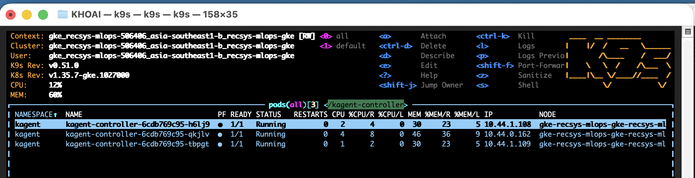

# Agent Substrate optimization benchmark and kagent HA configuration

This document records the controlled before/after native DurDir benchmark run
on production GKE on 28 August 2026. The optimized Agent Substrate WorkerPool
configuration is deployed. The kagent HA configuration is also deployed on
production GKE and verified with live Lease, PodDisruptionBudget, placement,
health, and leader-failover evidence.

## Outcome

| Phase | Requests | Failures | Aggregate p50 | p95 | p99 | Mean | Throughput |
|---|---:|---:|---:|---:|---:|---:|---:|
| Before | 141 | 0 | 100 ms | 460 ms | 530 ms | 200.18 ms | 2.3898 req/s |
| Optimized | 150 | 0 | 87 ms | 410 ms | 460 ms | 173.59 ms | 2.5862 req/s |
| Observed change | — | unchanged | **-13.00%** | **-10.87%** | **-13.21%** | **-13.28%** | **+8.22%** |

This is a one-run-per-treatment observation. It proves that the optimized run
completed successfully and was faster in most reported metrics under the
recorded conditions; it is not a statistical causal claim. Repeated paired runs
are required for a confidence interval.

## Retained proof

Before artifacts:

- [Before resolved configuration](benchmark_proof/substrate-durdir-before-20260828/run-config.yaml).
- [Before applied WorkerPool and ActorTemplate](benchmark_proof/substrate-durdir-before-20260828/workloads-applied.yaml).
- [Before normalized Locust result](benchmark_proof/substrate-durdir-before-20260828/data-stats.csv).

Optimized artifacts:

- [Optimized applied WorkerPool and ActorTemplate](benchmark_proof/substrate-durdir-after-20260828/workloads-applied.yaml).
- [Optimized benchmark Job](benchmark_proof/substrate-durdir-after-20260828/job-applied.yaml).
- [Optimized original Locust CSV](benchmark_proof/substrate-durdir-after-20260828/data-stats.csv).
- [Optimized failure CSV](benchmark_proof/substrate-durdir-after-20260828/failures.csv).
- [Optimized Job and worker placement metadata](benchmark_proof/substrate-durdir-after-20260828/run-metadata.yaml).

The before Job had already been cleaned up when repository retention was added,
so its CSV is a normalized copy of the captured Locust summary. The optimized
CSV is the original CSV emitted by the successful Job and captured from pod
logs before cleanup.

## Controlled benchmark method

The benchmark used the production Substrate `0.0.11` control plane, mTLS,
network, GKE nodes, RustFS backend, and pinned benchmark images. The following
controls were identical:

```yaml
load:
  users: 1
  spawnRatePerSecond: 1
  duration: 1m
  stopTimeoutSeconds: 60
  minWaitSeconds: 1
  maxWaitSeconds: 1
  durDirFileSizeBytes: 8388608
  readMode: data
  resumeMode: explicit
  atespace: benchmark
snapshotPolicy:
  onPause: Full
  onCommit: Data
  onResume:
    fromData: ColdBoot
worker:
  replicas: 1
  readyBeforeMeasurement: true
  autoscalingDuringBenchmark: false
```

The benchmark-specific pool stays fixed at one worker so the comparison tests
compute placement/resource isolation rather than KEDA scale timing. Production
application pools continue to use assigned-worker KEDA autoscaling from one to
three replicas.

## Before configuration

### Production Substrate control plane

```yaml
substrate:
  chartVersion: 0.0.11
  apiServer:
    image: ghcr.io/kagent-dev/substrate/ateapi:v0.0.11
    replicas: 2
  controller:
    replicas: 1
  router:
    replicas: 1
  atelet:
    daemonSetReady: 2
  snapshotBackend:
    service: RustFS
    replicas: 1
    pvc: rustfs-data
    capacity: 1Gi
    bucket: ate-snapshots
```

### Before WorkerPool

The before pool omitted `spec.template`, so it had no node-pool constraint or
explicit compute reservation.

```yaml
apiVersion: ate.dev/v1alpha1
kind: WorkerPool
metadata:
  name: benchmark-ateom
  namespace: benchmark-workloads
spec:
  replicas: 1
  sandboxClass: gvisor
  ateomImage: ghcr.io/kagent-dev/substrate/ateom-gvisor:v0.0.11
```

What was missing before optimization:

- There was no `spec.template.nodeSelector`, so Kubernetes selected any
  eligible node; placement was not fixed to the production CPU node pool.
- There were no CPU or memory requests, so the scheduler did not reserve
  compute capacity for the warm worker.
- There was no memory limit, so the worker had no explicit memory boundary.
- Snapshot compression, suspend, and resume could contend with other workloads
  for CPU and memory. This made measurements more sensitive to placement and
  noisy-neighbor effects.

### Before ActorTemplate

```yaml
apiVersion: ate.dev/v1alpha1
kind: ActorTemplate
metadata:
  name: glutton-durdir-data
  namespace: benchmark-workloads
spec:
  sandboxClass: gvisor
  volumes:
    - name: data
      durableDir: {}
  workerSelector:
    matchLabels:
      workload: benchmark-ateom
  snapshotsConfig:
    onPause: Full
    onCommit: Data
    onResume:
      fromData: ColdBoot
    location: gs://ate-snapshots/benchmark-workloads/glutton-durdir-data/
```

### Before runner argument

```text
--config-json={"durdir_file_size_bytes":8388608,"resume_mode":"explicit","durdir_read_mode":"data","durdir_template":"glutton-durdir-data","min_wait_time":1.0,"max_wait_time":1.0}
```

## Optimized Agent Substrate configuration

The optimization reserves CPU shares for the warm `ateom` worker, pins it to
the production CPU node pool, retains memory headroom, and leaves CPU burst
unlimited. The official WorkerPool API maps `spec.template.nodeSelector` and
`spec.template.resources` directly to the worker Pod.

### Optimized WorkerPool treatment

```yaml
apiVersion: ate.dev/v1alpha1
kind: WorkerPool
metadata:
  name: benchmark-ateom-optimized
  namespace: benchmark-workloads
spec:
  replicas: 1
  sandboxClass: gvisor
  ateomImage: ghcr.io/kagent-dev/substrate/ateom-gvisor:v0.0.11
  template:
    nodeSelector:
      cloud.google.com/gke-nodepool: recsys-mlops-cpu
    resources:
      requests:
        cpu: "1"
        memory: 1Gi
      limits:
        memory: 2Gi
```

What the optimized configuration adds:

- `nodeSelector` pins the worker to the stable `recsys-mlops-cpu` node pool.
- `requests.cpu: "1"` makes the scheduler place the worker only where one CPU
  is available and reserves that CPU share for the Pod.
- `requests.memory: 1Gi` reserves memory for snapshot, suspend, and resume work.
- `limits.memory: 2Gi` provides additional headroom while bounding memory use.
- No CPU limit is set, so the worker can burst beyond one core when spare CPU
  is available, which benefits compression, suspend, and resume operations.

Result and proof for this exact optimized configuration:

- Production Job `durdir-data-after-20260828` completed successfully with
  **150 requests and zero failures**.
- Aggregate latency was **87 ms p50, 410 ms p95, 460 ms p99, and 173.59 ms
  mean**; throughput was **2.5862 requests/second**.
- Relative to before, aggregate p50 improved by **13.00%**, p95 by **10.87%**,
  p99 by **13.21%**, mean by **13.28%**, and throughput increased by **8.22%**.
- [Applied optimized WorkerPool and ActorTemplate](benchmark_proof/substrate-durdir-after-20260828/workloads-applied.yaml)
  proves the treatment above.
- [Original optimized Locust result](benchmark_proof/substrate-durdir-after-20260828/data-stats.csv)
  and [empty failure result](benchmark_proof/substrate-durdir-after-20260828/failures.csv)
  are the captured benchmark outputs.
- [Run metadata and placement proof](benchmark_proof/substrate-durdir-after-20260828/run-metadata.yaml)
  records the Job timing, successful status, selected CPU-pool node, resource
  requests, memory limit, and unbounded CPU limit.

The measured worker ran on node
`gke-recsys-mlops-gke-recsys-mlops-cpu-2224da7a-j33x`; the live Pod reported
the exact node selector and resources above. The complete per-operation result
is repeated in **Native DurDir results → Optimized** below.

The same template is now the repository desired state for all three production
agent WorkerPools:

- the chart-owned context pool in
  [`configs/kagent/values.yaml` context WorkerPool (line 57)](../../../configs/kagent/values.yaml#L57);
- the Terraform-owned recommendation and coordinator pools in
  [`infra/terraform/gcp/modules/kubernetes-platform/kagent.tf` specialist WorkerPools (line 335)](../../../infra/terraform/gcp/modules/kubernetes-platform/kagent.tf#L335).

### Production assigned-worker autoscaling retained

The optimization did not replace the existing agent scaler. Production pools
still use the Substrate assigned-worker metric:

```yaml
autoscaling:
  minReplicas: 1
  maxReplicas: 3
  metricMode: assignedWorkers
  assignedWorkersPerReplica: "0.7"
trigger:
  type: prometheus
  metricType: AverageValue
  query: >-
    max(ate_workerpool_workers{
      ate_workerpool_namespace="kagent",
      ate_worker_state="assigned"
    })
```

This keeps one physical worker warm for startup latency while allowing KEDA to
add capacity for assigned actors. It was not attached to the isolated native
benchmark pool, preventing scale events from confounding the latency result.

### Optimized runner argument

Only the template name changed; all load values remained equal:

```text
--config-json={"durdir_file_size_bytes":8388608,"resume_mode":"explicit","durdir_read_mode":"data","durdir_template":"glutton-durdir-data-optimized","min_wait_time":1.0,"max_wait_time":1.0}
```

## Native DurDir results

### How to read the key metrics

The DurDir scenario measures actor suspend/resume performance, durable-directory
persistence overhead, and state-restoration latency. All values below are
request latencies in milliseconds, so lower is better. Definitions follow the
[official Agent Substrate DurDir benchmark](https://github.com/agent-substrate/substrate/blob/main/benchmarking/README.md#durdir-reported-metrics).

| Metric | What it measures | Why it matters when presenting the result |
|---|---|---|
| `DurDirWrite` | Initial truncate-write that creates the 8 MiB data file. | Baseline durable-volume write cost. There is only one sample per run, so it is supporting evidence rather than the main optimization claim. |
| `DurDirServeInitial` | First read immediately after the data file is created. | Baseline read before any suspend/resume cycle. It helps distinguish ordinary serving time from restoration overhead; again, only one sample was collected per run. |
| `SuspendActor` | Time to suspend the actor, including snapshot creation and upload to persistent snapshot storage. | Lower latency means an idle actor can be persisted and release its worker sooner. This is one of the primary lifecycle metrics. |
| `ResumeActor` | Time for the explicit resume RPC to reactivate the suspended actor. In this run, a Data snapshot is restored and the workload cold-boots on an already-warm worker. | Lower latency means the agent becomes active sooner when the next request arrives. This is the clearest user-facing activation metric. |
| `DurDirServeAfterResume` | First read after resume, including page-fault or lazy-load overhead on the restored durable volume. | Measures the first useful data response immediately after reactivation, when restoration penalties are most visible. |
| `DurDirServeWarm` | A subsequent read in the same active cycle after the restored state has been touched. | Represents the cached, steady-state serving baseline. Comparing it with `DurDirServeAfterResume` shows the extra first-read penalty after resume. |
| `DurDirOverwrite` | In-place overwrite of the durable file followed by checksum verification. | Tests post-resume filesystem mutation and data integrity. It is useful supporting evidence, but less central than suspend/resume latency for the warm-worker pitch. |

How to read the statistical columns:

- `p50` is the median: half of requests are faster and half are slower. Use it
  to describe the typical experience.
- `p95` and `p99` describe tail latency: approximately 95% or 99% of requests
  complete at or below that value. They reveal slow outliers hidden by averages.
- `Mean` is the arithmetic average and is more sensitive to outliers than p50.
- `Throughput` is completed benchmark requests per second. With one user and a
  fixed one-minute duration, higher throughput means the lifecycle loop
  completed more operations in the same time.
- `Failures` counts requests that Locust marked unsuccessful; both runs recorded
  zero failures.

For this pitch, prioritize `SuspendActor`, `ResumeActor`, and
`DurDirServeAfterResume`. They most directly describe how quickly an idle agent
is persisted, reactivated, and able to serve its first data request. The run has
only about 27--30 samples per repeated metric, so the reported p95/p99 values
are observed tail values, not statistically stable population estimates.

### Before

Job `durdir-data-before-20260828` completed from 07:04:20 to 07:05:28 UTC.
All 141 requests succeeded.

**Proof:** [before result CSV](benchmark_proof/substrate-durdir-before-20260828/data-stats.csv).

| Metric | Count | Failures | Mean | Min | p50 | p95 | p99 | Max |
|---|---:|---:|---:|---:|---:|---:|---:|---:|
| `DurDirWrite` | 1 | 0 | 177.00 | 177 | 180 | 180 | 180 | 177 |
| `DurDirServeInitial` | 1 | 0 | 99.00 | 99 | 99 | 99 | 99 | 99 |
| `SuspendActor` | 28 | 0 | 348.50 | 298 | 330 | 430 | 750 | 746 |
| `ResumeActor` | 28 | 0 | 430.61 | 387 | 420 | 500 | 530 | 528 |
| `DurDirServeAfterResume` | 27 | 0 | 101.52 | 78 | 99 | 130 | 150 | 149 |
| `DurDirServeWarm` | 27 | 0 | 71.85 | 45 | 72 | 95 | 130 | 129 |
| `DurDirOverwrite` | 27 | 0 | 53.70 | 48 | 52 | 63 | 71 | 71 |
| **All requests** | **141** | **0** | **200.18** | **1** | **100** | **460** | **530** | **746** |

### Optimized

Job `durdir-data-after-20260828` completed from 12:10:05 to 12:11:12 UTC.
All 150 requests succeeded.

**Proof:** [optimized original Locust CSV](benchmark_proof/substrate-durdir-after-20260828/data-stats.csv),
[empty failure CSV](benchmark_proof/substrate-durdir-after-20260828/failures.csv),
and [run metadata](benchmark_proof/substrate-durdir-after-20260828/run-metadata.yaml).

| Metric | Count | Failures | Mean | Min | p50 | p95 | p99 | Max |
|---|---:|---:|---:|---:|---:|---:|---:|---:|
| `DurDirWrite` | 1 | 0 | 110.00 | 110 | 110 | 110 | 110 | 110 |
| `DurDirServeInitial` | 1 | 0 | 96.00 | 96 | 96 | 96 | 96 | 96 |
| `SuspendActor` | 29 | 0 | 287.24 | 244 | 280 | 340 | 360 | 364 |
| `ResumeActor` | 30 | 0 | 392.83 | 352 | 390 | 460 | 480 | 478 |
| `DurDirServeAfterResume` | 29 | 0 | 87.83 | 73 | 87 | 97 | 130 | 133 |
| `DurDirServeWarm` | 29 | 0 | 58.72 | 35 | 61 | 76 | 78 | 78 |
| `DurDirOverwrite` | 29 | 0 | 50.55 | 45 | 49 | 54 | 79 | 79 |
| **All requests** | **150** | **0** | **173.59** | **2** | **87** | **410** | **460** | **478** |

All latency values are milliseconds. The optimized run completed more lifecycle
cycles within the same minute because individual cycles were faster.

### Metric comparison

| Metric | Before p50 / p95 / p99 | Optimized p50 / p95 / p99 | Observed change |
|---|---:|---:|---|
| `SuspendActor` | 330 / 430 / 750 | 280 / 340 / 360 | -15.15% / -20.93% / -52.00% |
| `ResumeActor` | 420 / 500 / 530 | 390 / 460 / 480 | -7.14% / -8.00% / -9.43% |
| `DurDirServeAfterResume` | 99 / 130 / 150 | 87 / 97 / 130 | -12.12% / -25.38% / -13.33% |
| `DurDirServeWarm` | 72 / 95 / 130 | 61 / 76 / 78 | -15.28% / -20.00% / -40.00% |
| `DurDirOverwrite` | 52 / 63 / 71 | 49 / 54 / 79 | -5.77% / -14.29% / **+11.27%** |

The only reported regression was `DurDirOverwrite` p99, which rose from 71 to
79 ms due to one 79 ms sample. Its median, p95, and mean all improved. Because
there is only one run per treatment, the large tail changes must be interpreted
as observed values rather than stable estimates.

## kagent operational and HA configuration

The three behaviors below do not each map to a single `enabled` flag. Secret
restart is driven by resource references and controller watches; leader
election is derived from the replica count; database selection follows a
connection-precedence rule. The deployed configuration is shown explicitly
below. Repository source: [`configs/kagent/values.yaml` controller HA (line 22)](../../../configs/kagent/values.yaml#L22).

### 1. Automatic agent restart on Secret updates

User-facing reference chain:

```yaml
# configs/kagent/values.yaml -> chart renders ModelConfig/default-model-config
providers:
  default: openAI
  openAI:
    apiKeySecretRef: kagent-agent-gateway
    apiKeySecretKey: AGENT_GATEWAY_API_KEY

# infra/helm/recsys-kagent-agent/templates/sandboxagent.yaml
spec:
  declarative:
    modelConfig: default-model-config
```

Substrate rollout bridge in compatibility image `v8`:

```go
configHash := shortConfigHash(
    podTemplate.Annotations[consts.ConfigHashAnnotation],
)
containerEnv = append(containerEnv, corev1.EnvVar{
    Name:  "KAGENT_CONFIG_REVISION",
    Value: configHash,
})
```

Field-by-field behavior:

- `apiKeySecretRef` identifies the Kubernetes Secret watched through the
  ModelConfig controller; `apiKeySecretKey` identifies the key whose value is
  hashed. The Secret value is not copied into Git.
- `modelConfig: default-model-config` connects every production SandboxAgent to
  that ModelConfig. A Secret update changes `ModelConfig.status.secretHash` and
  enqueues the referencing SandboxAgents.
- `KAGENT_CONFIG_REVISION` is required only by this pinned custom Substrate
  backend. A literal env value belongs to `ActorTemplateSpec`, so its change
  produces a different shape hash, ActorTemplate name, and golden runtime.
- There is deliberately no `automaticRestart.enabled` setting. The upstream
  behavior is automatic whenever a supported Secret reference exists. kagent
  documents API-key, TLS, and `secretKeyRef` changes as restart triggers in its
  [operational considerations](https://kagent.dev/docs/kagent/operations/operational-considerations/#automatic-agent-restart-on-secret-updates).

The exact bridge and regression test are in
[`KAGENT_CONFIG_REVISION` bridge and shape-hash test (line 831)](../../../ops/gcp/patches/kagent-e6df917-substrate0011.patch#L831).

### 2. Leader election when the controller is scaled

```yaml
controller:
  replicas: 3
  nodeSelector:
    cloud.google.com/gke-nodepool: recsys-mlops-cpu
  pdb:
    enabled: true
    maxUnavailable: 1
  topologySpreadConstraints:
    - maxSkew: 1
      topologyKey: kubernetes.io/hostname
      whenUnsatisfiable: DoNotSchedule
      labelSelector:
        matchLabels:
          app.kubernetes.io/name: kagent
          app.kubernetes.io/instance: kagent
          app.kubernetes.io/component: controller
```



*Figure — Production k9s view showing all three `kagent-controller` Pods at
`1/1 Running` with zero restarts.*

> **Note:** Three running Pods do not mean three active reconcilers. With
> `controller.replicas: 3`, kagent elects one active controller through a
> Kubernetes Lease; the other two remain Ready standbys. This screenshot proves
> replica availability. The Lease-holder and failover evidence below prove
> which replica is active and that a standby can take over.

Field-by-field behavior:

- `replicas: 3` is the switch: the chart automatically enables Kubernetes
  Lease leader election when the value is greater than one. One Pod reconciles;
  the other two stay Ready as standbys. There is no separate leader-election
  boolean in this deployment.
- `nodeSelector` keeps all controllers on the eligible CPU pool and excludes
  the tainted ML-system node from scheduling/topology calculations.
- `pdb.maxUnavailable: 1` permits at most one voluntary controller disruption,
  retaining at least two healthy replicas during drains or managed upgrades.
- `topologySpreadConstraints` limits hostname skew to one. The CPU pool has two
  nodes, so the observed placement is 2/1 rather than one Pod per node.
- If the leader dies, its 15-second Kubernetes Lease expires and a standby
  acquires it. The destructive production test observed a new holder and
  recovery to 3/3; the measured 48.4 seconds included graceful termination,
  Lease expiry, election, and Pod replacement.

This matches kagent's documented rule that
[`controller.replicas > 1` enables leader election](https://kagent.dev/docs/kagent/operations/operational-considerations/#leader-election-when-controller-is-scaled).

### 3. Database configuration

Current deployed configuration:

```yaml
database:
  postgres:
    bundled:
      enabled: true
      resources:
        requests:
          cpu: 25m
          memory: 128Mi
        limits:
          cpu: 250m
          memory: 256Mi
```

Field-by-field behavior:

- `bundled.enabled: true` deploys the chart-managed PostgreSQL Pod and its
  storage. It is now explicit in the repository instead of relying on the chart
  default.
- Neither `database.postgres.urlFile` nor `database.postgres.url` is set, so the
  controller selects the bundled connection. kagent's precedence is
  `urlFile > url > bundled connection string`.
- The resource requests keep the coursework cluster quota-safe; the limits
  bound PostgreSQL CPU and memory bursts.
- A shared PostgreSQL backend lets all three controller replicas use consistent
  state, satisfying the database requirement for controller replication.
- The bundled database is one PostgreSQL Pod, so it remains a database single
  point of failure. It does **not** claim end-to-end database HA. kagent
  recommends an external PostgreSQL for production; that deployment would use
  `bundled.enabled: false` plus preferably a Secret-mounted `urlFile`.

The connection selection and production recommendation are documented under
[kagent database configuration](https://kagent.dev/docs/kagent/operations/operational-considerations/#database-configuration).

### HA acceptance status

| Required property | Evidence | Status |
|---|---|---:|
| PostgreSQL backend | Bundled PostgreSQL 18.3-alpine was healthy at 1/1 and was used by the controller. | **Met for controller replication** |
| Three controller replicas | Current Helm revision 27 runs compatibility build `v8` with desired, updated, Ready, and available replicas all equal to 3. | **Met** |
| Kubernetes Lease leader election | Lease `0e9f6799.kagent.dev` had a live holder, 15-second lease duration, and renewed continuously. | **Met** |
| Automatic failover | The leader Pod was deleted; a different replica acquired the Lease and the Deployment recovered to 3/3. | **Met** |
| Controller service health | `/health` returned `status: OK` before and after leader failover. | **Met** |
| Voluntary disruption protection | Live PDB `kagent-controller` had `maxUnavailable: 1`, `currentHealthy: 3`, and `desiredHealthy: 2`. | **Met** |
| Failure-domain placement | Three controller Pods were spread 2/1 over both CPU nodes under a hostname `DoNotSchedule` constraint. | **Met within the two-node CPU pool** |
| Automatic restart after a referenced Secret update | Compatibility build `v8` made the config hash rollout-relevant; a controlled rotation created a new ActorTemplate and golden runtime with Create/Resume/Suspend RPC proof. | **Met for SandboxAgent/Substrate** |

### Production HA and failover proof

The first Helm attempt, revision 22, exposed a real scheduling edge case: the
topology constraint counted the tainted single ML-system node as an eligible
hostname and blocked the surge Pod. Helm's rollback-on-failure restored
revision 21 as revision 23. The controller was then pinned to
`recsys-mlops-cpu`, limiting topology domains to the two eligible CPU nodes,
and revision 24 completed successfully at 19:38:18 ICT.

The stable deployment reported:

```yaml
helm:
  release: kagent
  revision: 24
  status: deployed
controller:
  desiredReplicas: 3
  updatedReplicas: 3
  readyReplicas: 3
  availableReplicas: 3
  nodePool: recsys-mlops-cpu
  placement:
    cpuNodeJ33x: 2
    cpuNode961g: 1
pdb:
  maxUnavailable: 1
  currentHealthy: 3
  desiredHealthy: 2
  disruptionsAllowed: 1
```

For the destructive failover check, the current Lease holder
`kagent-controller-69c748cc6f-gnh6z` was deleted. Kubernetes emitted the
container `Killing` event at `12:41:11Z`; replica
`kagent-controller-69c748cc6f-jjtjg` acquired the Lease at
`12:41:59.443922Z`. The observed leader takeover interval from those two
timestamps was approximately 48.4 seconds, which includes graceful Pod
termination plus Lease expiry/election. The Deployment recreated the missing
replica and returned to 3/3 Ready. This test checked health before and after the
takeover; it did not continuously sample the endpoint and therefore does not
claim zero request interruption.

**Proof:** [HA verification record](benchmark_proof/kagent-ha-20260828/README.md)
and [machine-readable live state](benchmark_proof/kagent-ha-20260828/live-state.yaml).

## References

- [Agent Substrate native benchmarking README](https://github.com/agent-substrate/substrate/blob/main/benchmarking/README.md) -- workload controls and DurDir metrics.
- [Agent Substrate WorkerPool and ActorTemplate API guide](https://github.com/agent-substrate/substrate/blob/main/docs/api-guide.md) -- warm capacity and `spec.template` scheduling/resource fields.
- [kagent operational considerations](https://www.kagent.dev/docs/kagent/operations/operational-considerations/) -- controller replicas, automatic Lease leader election, failover, and PostgreSQL guidance.
- [Kubernetes Leases](https://kubernetes.io/docs/concepts/architecture/leases/) -- Lease objects used for component leader election.
- [Kubernetes Pod topology spread constraints](https://kubernetes.io/docs/concepts/scheduling-eviction/topology-spread-constraints/) -- spreading replicas across failure domains.
- [Kubernetes disruptions and PodDisruptionBudgets](https://kubernetes.io/docs/concepts/workloads/pods/disruptions/) -- limiting simultaneous voluntary disruption.
