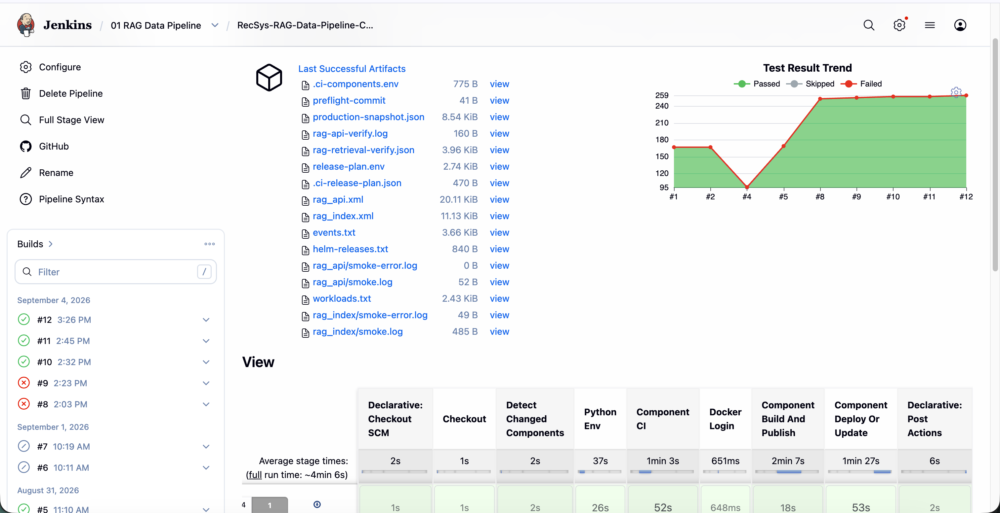
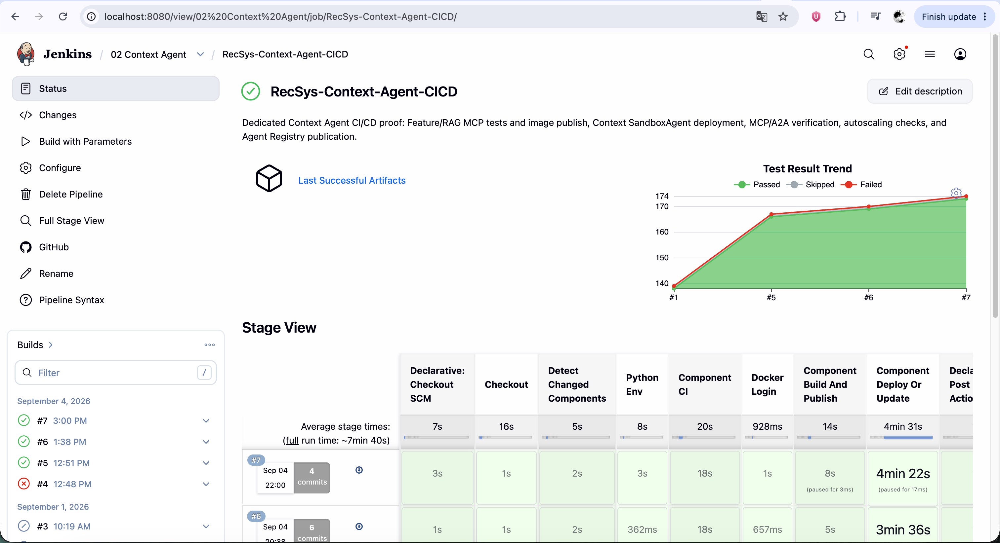
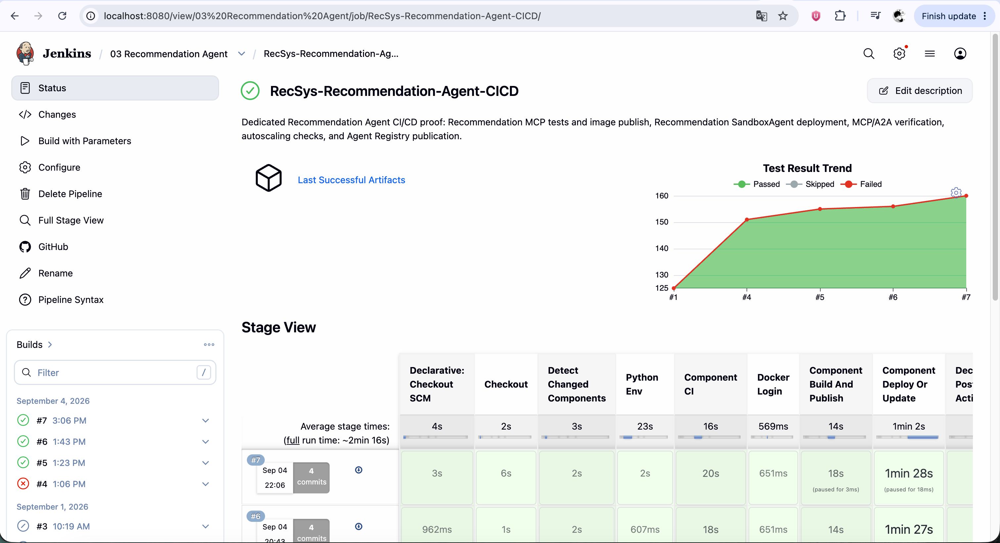
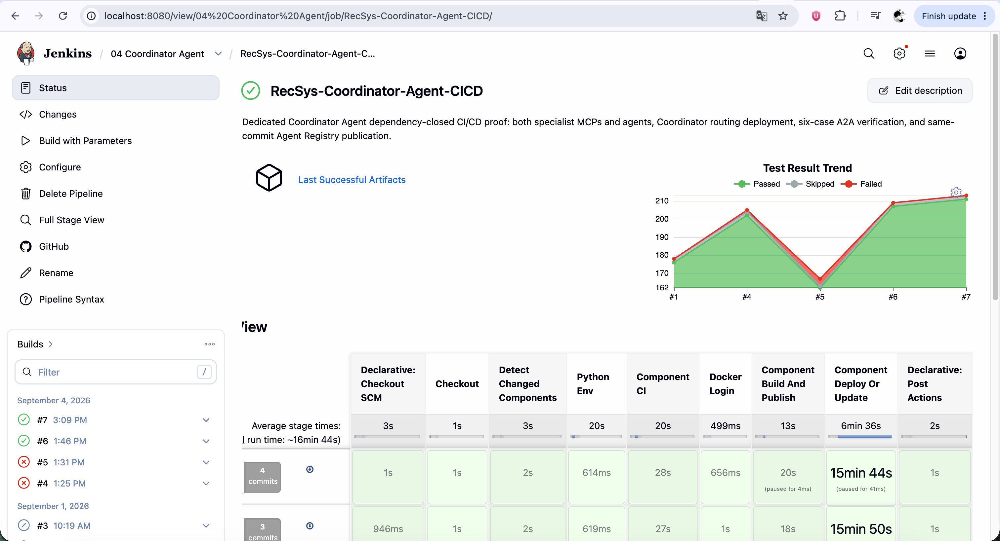

# Registry-gated CI/CD for RAG and Agentic Services

## 1. Outcome

The repository uses one configuration-driven Jenkins pipeline for the RAG data
path and the Context, Recommendation, and Coordinator agent stacks. Agentic
releases use a registry-gated deployment contract:

```text
Git commit
  -> component CI and contract tests
  -> container images -> GCP Artifact Registry by digest
  -> Helm charts      -> GCP Artifact Registry as OCI artifacts by digest
  -> MCP/Agent metadata -> Agent Registry
  -> exact Agent Registry read-back
  -> immutable deployment lock
  -> Helm deployment using only lock-selected artifacts
  -> MCP, SandboxAgent, autoscaling, security, and A2A verification
```

Agent Registry is the release catalog and promotion control plane. GCP Artifact
Registry stores the binary OCI payloads. Runtime requests do not pass through
Agent Registry.

This ordering follows the upstream publication model: build and push an
artifact, publish its catalog entry, and deploy an exact published version. See
the official [Agent publication guide](https://aregistry.ai/docs/agents/publish/)
and [MCP publication guide](https://aregistry.ai/docs/mcp/local/publish/).

## 2. Why Jenkins uses Registry-gated Helm

The production agents are `kagent.dev/v1alpha2` `SandboxAgent` resources backed
by Substrate WorkerPools and gVisor. Agent Registry `v0.4.0`'s Kubernetes
runtime adapter creates a regular `kagent.dev/Agent`, and its OCI validator does
not authenticate to this project's private GCP Artifact Registry. Therefore,
calling `arctl deployments create` would change the runtime type and weaken the
existing isolation contract.

The safe implementation is:

- Agent Registry owns the approved version, dependency graph, Git identity,
  checksums, and OCI pointers.
- Jenkins must read the published records back and seal a lock before mutation.
- Helm remains the deployment driver and preserves the repository's
  `SandboxAgent`, gVisor, KEDA, PDB, NetworkPolicy, Istio, probe, and secret
  rotation settings.
- The Agent Registry `deployments` list may remain empty for this release model.

The limitation is visible in the upstream
[Kubernetes runtime adapter](https://github.com/agentregistry-dev/agentregistry/blob/v0.4.0/internal/registry/runtimes/kubernetes/runtime.go)
and [OCI validation implementation](https://github.com/agentregistry-dev/agentregistry/blob/v0.4.0/pkg/api/v1alpha1/registries/oci.go).

## 3. Sources of truth

| Concern | Authoritative source |
| --- | --- |
| Jenkins stage view and release transaction | [`Jenkinsfile`](../../../Jenkinsfile), [`component_pipeline.groovy`](../../../jenkins/pipeline/component_pipeline.groovy) |
| Component ownership and change routing | [`components.json`](../../../jenkins/config/components.json) |
| Images and internal image dependencies | [`images/catalog.json`](../../../images/catalog.json) |
| Artifact types, release units, phases, and dependencies | [`deploy-units.json`](../../../jenkins/config/deploy-units.json) |
| MCP/Agent catalog metadata and exact dependencies | [`agent-registry-artifacts.json`](../../../jenkins/config/agent-registry-artifacts.json) |
| Release-plan schema and DAG validation | [`release_plan.py`](../../../jenkins/python/release_plan.py) |
| Registry manifest and lock contract | [`agent_registry_release.py`](../../../jenkins/python/agent_registry_release.py) |
| Thin `arctl` transport adapter | [`registry.sh`](../../../jenkins/scripts/deploy/agentic/registry.sh) |
| Helm deployment and lock consumption | [`release_unit_runtime.sh`](../../../jenkins/scripts/deploy/release_unit_runtime.sh) |

The pipeline calculates scope once and writes `.ci-release-plan.json`. Later
stages consume that file; they do not repeat change detection or construct a
different release.

## 4. Jenkins execution contract

The shared Stage View remains compact and stable:

| Stage | Main contract |
| --- | --- |
| `Declarative: Checkout SCM` | Jenkins checks out the configured revision. |
| `Checkout` | The helper records the exact 40-character Git SHA. |
| `Detect Changed Components` | Configuration is validated and release plan v3 is written. |
| `Python Env` | Selected locked CI environments are prepared. |
| `Component CI` | Unit, contract, integration, static, Helm, and schema gates run in bounded parallel batches. |
| `Docker Login` | The production GCP Artifact Registry target and upload permission are verified. |
| `Component Build And Publish` | Images and selected Helm OCI artifacts are published and resolved to digests. |
| `Component Deploy Or Update` | Registry publish/read-back/lock precedes Helm deployment and verification. |
| `Declarative: Post Actions` | JUnit, coverage, manifests, read-backs, lock, smoke, snapshot, and rollback evidence are archived. |

Main-branch deployment is automatic when publication is enabled. Pull requests
cannot mutate production unless both repository policy and the explicit
override allow it. Dedicated evidence jobs still use the same root pipeline:

| Jenkins job | Forced release selection |
| --- | --- |
| `RecSys-RAG-Data-Pipeline-CICD` | RAG index and retrieval API |
| `RecSys-Context-Agent-CICD` | Feature/RAG MCP and Context Agent |
| `RecSys-Recommendation-Agent-CICD` | Recommendation MCP and Recommendation Agent |
| `RecSys-Coordinator-Agent-CICD` | Both specialist stacks plus Coordinator |

The job definitions and views are maintained by
[`recsys-ci/templates/jenkins-init-configmap.yaml`](../../../infra/helm/recsys-ci/templates/jenkins-init-configmap.yaml).

## 5. Immutable hand-off formats

### 5.1 Release plan v3

Every release plan contains a full Git SHA and a deterministic version:

```json
{
  "version": 3,
  "commit": "0123456789abcdef0123456789abcdef01234567",
  "releaseVersion": "0.2.0-g0123456789ab",
  "components": ["feature_rag_mcp", "context_agent"],
  "buildImages": ["recsys-feature-rag-mcp"],
  "buildArtifacts": [
    "feature-rag-mcp-chart",
    "context-agent-chart"
  ],
  "publishUnits": [
    "feature-rag-mcp-registry",
    "context-agent-registry"
  ],
  "deployUnits": [
    "feature-rag-mcp",
    "global-model-config",
    "context-agent"
  ]
}
```

`publishUnits` and `deployUnits` are disjoint. Their phase comes from explicit
configuration; no code infers a finalizer from a unit-name suffix.

### 5.2 OCI artifact manifests

Container digests remain under `.ci-image-manifest/`. Each selected agentic
chart is copied to a build-scoped directory, packaged with the release version,
pushed under `oci://<gcp-registry>/helm/<chart>`, resolved to its manifest
digest, and recorded under `.ci-artifact-manifest/`:

```json
{
  "version": 1,
  "kind": "helm-oci",
  "artifact": "context-agent-chart",
  "commit": "0123456789abcdef0123456789abcdef01234567",
  "releaseVersion": "0.2.0-g0123456789ab",
  "reference": "oci://REGISTRY/helm/recsys-kagent-agent@sha256:DIGEST"
}
```

Packaging never modifies the checked-in chart directory. See
[`helm_oci.sh`](../../../jenkins/scripts/build/helm_oci.sh) and
[`release_package_artifacts.sh`](../../../jenkins/scripts/entrypoints/release_package_artifacts.sh).
The archive is normalized before publication, so rerunning the same commit
produces the same package bytes; an existing same-version OCI tag is reused only
when its downloaded package matches byte-for-byte. Helm supports installing an
OCI chart directly by digest, as documented in its official
[registry guide](https://helm.sh/docs/topics/registries/#installing-charts-with-digest).

### 5.3 Agent Registry records

Every entry is append-only and includes:

- `recsys.dev/git-commit`;
- `recsys.dev/helm-chart` with an OCI digest;
- `recsys.dev/runtime-image` with an image digest for MCP servers;
- `recsys.dev/contract-sha256`;
- `recsys.dev/deployment-driver=helm`; and
- exact same-release MCP and Agent dependency references.

MCP entries retain `spec.remote` because private authenticated OCI source
packages are not supported by the pinned Agent Registry version. The immutable
deployable chart and image pointers are carried in annotations and checked by
Jenkins.

Registry publication never deletes a legacy entry. A matching version is an
idempotent success; a conflicting record at the same tag fails the release.

### 5.4 Deployment lock

After all selected entries are applied, Jenkins validates the raw `arctl get`
responses and writes `.ci-deploy/agent-registry-lock.json`:

```json
{
  "version": 1,
  "releaseVersion": "0.2.0-g0123456789ab",
  "gitCommit": "0123456789abcdef0123456789abcdef01234567",
  "artifacts": {
    "context-agent": {
      "kind": "agent",
      "workloadUnit": "context-agent",
      "registryRef": "recsys/recsys-context-agent-sandbox@0.2.0-g0123456789ab",
      "readbackIdentity": "UID_OR_READBACK_HASH",
      "readbackSha256": "sha256:READBACK_HASH",
      "chart": "oci://REGISTRY/helm/recsys-kagent-agent@sha256:DIGEST",
      "contractSha256": "sha256:CONTRACT_HASH",
      "gitCommit": "0123456789abcdef0123456789abcdef01234567",
      "dependencies": [
        "recsys/recsys-feature-rag-mcp@0.2.0-g0123456789ab"
      ]
    }
  }
}
```

The lock validator rejects an incorrect artifact set, stale commit, wrong
release version, mutable tag, unexpected repository, malformed checksum, or
missing dependency. Agentic Helm units cannot fall back to a local chart,
installed values, a `latest` tag, or the newest registry image.

## 6. Registry and deployment ordering

### 6.1 Context Agent

```text
Build:    Feature/RAG MCP image + MCP chart + Context Agent chart
Publish:  Feature/RAG MCP -> Context Agent
Lock:     both exact read-backs
Deploy:   Feature/RAG MCP -> Context SandboxAgent
Verify:   MCP protocol and endpoints -> WorkerPool/KEDA/gVisor -> Context A2A
```

### 6.2 Recommendation Agent

```text
Build:    Recommendation MCP image + MCP chart + Recommendation Agent chart
Publish:  Recommendation MCP -> Recommendation Agent
Lock:     both exact read-backs
Deploy:   Recommendation MCP -> Recommendation SandboxAgent
Verify:   MCP protocol and endpoints -> WorkerPool/KEDA/gVisor -> Recommendation A2A
```

### 6.3 Coordinator Agent

The Coordinator job expands to a same-commit set:

```text
Publish layer 1: Feature/RAG MCP | Recommendation MCP
Publish layer 2: Context Agent   | Recommendation Agent
Publish layer 3: Coordinator Agent

Deploy layer 1: Feature/RAG MCP | Recommendation MCP | Global Model Config
Deploy layer 2: Context Agent   | Recommendation Agent
Deploy layer 3: Coordinator Agent
```

The Coordinator catalog record names both specialist Agents and their MCP
dependencies at the same release version. The runtime exposes only the two A2A
specialist tools; it does not expose either MCP directly. Jenkins validates all
four prerequisite read-backs before it publishes the Coordinator. Specialists
use the Go ADK for direct MCP work; the Coordinator uses the
[Python ADK runtime](https://kagent.dev/docs/kagent/concepts/agents/) for its
Google ADK-native agent-tool orchestration path.

## 7. MCP credential rotation

The Registry gate preserves the existing dual-slot MCP credential transition:

- During an ordinary release, the Registry entry uses the newly published image
  digest.
- During prepare, bootstrap, cutover, rollback, or retirement phases that must
  preserve an installed MCP image, Jenkins resolves the installed digest before
  publishing the candidate.
- A new cluster with no installed release uses the current release image digest.
- Helm then consumes the same digest from the sealed lock, so Registry identity
  and runtime identity cannot diverge.

The non-secret rotation state remains in
[`mcp-auth-versions.yaml`](../../../configs/agentic/mcp-auth-versions.yaml); live
credentials remain Vault/ExternalSecret-owned.

## 8. RAG data pipeline

RAG deployment does not create MCP/Agent catalog entries, so its
`publishUnits` list is empty and no Agent Registry lock is required. The shared
pipeline still provides:

- immutable image publication for the indexer, admin, Airflow, and RAG API;
- Milvus and credential bootstrap ordering;
- candidate index creation and validation before promotion;
- RAG API rollout by digest;
- retrieval and health verification; and
- snapshot and rollback evidence.

The indexing lifecycle remains owned by
[`recsys_rag_item_index.py`](../../../apps/data-platform/src/orchestration/airflow/dags/recsys_rag_item_index.py).

## 9. Failure and rollback model

One `recsys-production-release` lock covers snapshot, Registry publication,
deployment lock creation, workload deployment, and verification.
Immediately after acquiring it, Jenkins refetches `origin/main` and rejects a
stale checkout before taking the snapshot or publishing a Registry record.

| Failure point | Result |
| --- | --- |
| Image/chart publication fails | No Agent Registry or workload mutation. |
| Registry apply or read-back validation fails | No workload mutation. |
| Lock sealing fails | No workload mutation. |
| Helm deployment fails | Helm atomic recovery runs, followed by transaction rollback where needed. |
| Verification fails | Changed Helm releases roll back in reverse plan order. |
| Rollback has an error | The original failure remains primary and rollback evidence records the secondary error. |

Published Registry candidates remain append-only after a workload failure. They
are audit records, not proof that a workload is running. Runtime state is proven
only by the archived deployment lock plus Kubernetes verification evidence.
The final verifier revalidates the lock against the manifest and raw read-back,
then compares each live resource's Registry reference, release version, contract
checksum, and MCP image with that evidence.

## 10. Production acceptance

A production run is accepted only when all of the following pass:

- Jenkins logs show Registry apply/read-back and lock sealing before the first
  agentic Helm upgrade.
- Both MCP Deployments use the image digests recorded in the lock.
- `/healthz`, `/ready`, `/version`, and `/metrics` succeed for both MCPs.
- `/version.image_reference` equals the locked digest.
- Context, Recommendation, and Coordinator `SandboxAgent` resources are
  `Accepted=True` and `Ready=True`.
- WorkerPools are ready, use gVisor, and retain their expected KEDA bounds and
  fallback behavior.
- PDB, NetworkPolicy, Istio injection, non-root execution, read-only root
  filesystem, and MCP authentication invariants remain present.
- Context and Recommendation A2A suites pass.
- All six A2A-only Coordinator cases pass: user-context routing, exact-chunk
  routing, user-grounded RAG routing, unrestricted recommendation,
  candidate-constrained recommendation, and composite specialist routing. The
  admission retry is limited to immediate `no free workers` responses and never
  replays a completed case. Context cases use bounded candidate lists and a
  maximum of one RAG item so an oversized specialist payload cannot induce a
  second model tool call; each case also has a 600-second fail-closed timeout.
- Each primary MCP Deployment or `SandboxAgent` contains
  `recsys.dev/agent-registry-ref`, `recsys.dev/agent-release-version`, and
  `recsys.dev/contract-sha256` matching the lock.

## 11. Operator runbook

Validate the contracts locally:

```bash
python3 jenkins/python/release_plan.py validate
python3 -m jenkins.python.agent_registry_release validate-catalog
bash -n jenkins/scripts/build/helm_oci.sh \
  jenkins/scripts/deploy/agentic/registry.sh \
  jenkins/scripts/deploy/release_unit_runtime.sh
```

Render a dependency-closed Coordinator release plan:

```bash
python3 jenkins/python/release_plan.py create \
  --components feature_rag_mcp,context_agent,recommendation_mcp,recommendation_agent,coordinator_agent \
  --commit "$(git rev-parse HEAD)" \
  --output /tmp/recsys-agent-release-plan.json

python3 jenkins/python/release_plan.py plan-units \
  --plan /tmp/recsys-agent-release-plan.json --phase publish
python3 jenkins/python/release_plan.py plan-units \
  --plan /tmp/recsys-agent-release-plan.json --phase deploy
```

Production rollout must occur through `RecSys-Coordinator-Agent-CICD` after the
change is merged to `main`, with `PUBLISH_IMAGES=true`. Do not manually call
`arctl delete`, substitute a chart tag for a digest, or run Helm outside the
sealed release transaction.

## 12. Evidence

Every Jenkins run archives:

- `.ci-release-plan.json`;
- `.ci-image-manifest/*`;
- `.ci-artifact-manifest/*`;
- `.ci-deploy/agent-registry-manifests/*`;
- `.ci-deploy/agent-registry-readbacks/*`;
- `.ci-deploy/agent-registry-lock.json`;
- `.ci-deploy/agent-registry-runtime-context.tsv` and
  `.ci-deploy/agent-registry-runtime-verification.tsv`;
- deployment snapshot and rollback records;
- JUnit and coverage reports; and
- MCP, autoscaling, security, and A2A smoke logs.

The following screenshots are retained as historical evidence of the shared
jobs and their component CI/build stages. Their former post-deploy Registry
ordering is superseded by the source contracts above and must not be used as
proof of the new transaction order.









The definitive evidence for a new release is the Jenkins main-branch console
order and its archived manifests, read-backs, lock, and verification results.
