# CI/CD for the RAG Data Pipeline and Agentic Services

## Outcome and architecture

The coursework uses one shared Jenkins implementation for four focused release
views. The views do not maintain four divergent Jenkinsfiles: each job checks
out `*/main`, loads the root `Jenkinsfile`, and supplies a different
`FORCE_COMPONENTS` preset.

```text
Jenkins job preset
  -> exact Git revision
  -> component flags and immutable release plan
  -> locked Python environments
  -> component CI in bounded parallel batches
  -> dependency-ordered image build and immutable digest publication
  -> dependency-layered production deployment
  -> component smoke and A2A verification
  -> Agent Registry finalizers
  -> archived evidence or reverse-order Helm rollback
```

The release is therefore selected once and consumed consistently by all later
stages. Build and deploy do not repeat path detection or construct a different
plan.

Reference code:
[`root pipeline`](../../../Jenkinsfile#L1-L110),
[`shared pipeline orchestration`](../../../jenkins/pipeline/component_pipeline.groovy#L1-L274), and
[`release-plan creation`](../../../jenkins/python/release_plan.py#L195-L281).

## Dedicated Jenkins jobs and views

### Job factory

```groovy
def scmPipelineXml = { jobName, description, forceComponents, forceDeploy, githubTrigger, jobScriptPath, scmBranchSpec ->
  def triggerProperty = githubTrigger ? """<org.jenkinsci.plugins.workflow.job.properties.PipelineTriggersJobProperty>
      <triggers>
        <com.cloudbees.jenkins.GitHubPushTrigger plugin="github">
          <spec></spec>
        </com.cloudbees.jenkins.GitHubPushTrigger>
      </triggers>
    </org.jenkinsci.plugins.workflow.job.properties.PipelineTriggersJobProperty>""" : ""
```

The factory makes the GitHub trigger optional. The four evidence jobs pass
`githubTrigger=false`, so they are stable manual proof jobs rather than four
duplicate webhook consumers.

Reference code:
[`scmPipelineXml` job factory, lines 149-156](../../../infra/helm/recsys-ci/templates/jenkins-init-configmap.yaml#L149-L156).

### Four presets

```groovy
def ragJobName = "RecSys-RAG-Data-Pipeline-CICD"
def contextAgentJobName = "RecSys-Context-Agent-CICD"
def recommendationAgentJobName = "RecSys-Recommendation-Agent-CICD"
def coordinatorAgentJobName = "RecSys-Coordinator-Agent-CICD"

upsertJob(
  ragJobName,
  scmPipelineXml(
    ragJobName,
    "Dedicated RAG data pipeline CI/CD proof: RAG index and retrieval API tests, immutable image publish, Milvus/Feast deployment, blue-green index promotion, retrieval verification, and rollback evidence.",
    "rag_index,rag_api,ci_config",
    true,
    false,
    scriptPath,
    mainBranchSpec
  )
)

upsertJob(
  contextAgentJobName,
  scmPipelineXml(
    contextAgentJobName,
    "Dedicated Context Agent CI/CD proof: Feature/RAG MCP tests and image publish, Context SandboxAgent deployment, MCP/A2A verification, autoscaling checks, and Agent Registry publication.",
    "feature_rag_mcp,context_agent,ci_config",
    true,
    false,
    scriptPath,
    mainBranchSpec
  )
)

upsertJob(
  recommendationAgentJobName,
  scmPipelineXml(
    recommendationAgentJobName,
    "Dedicated Recommendation Agent CI/CD proof: Recommendation MCP tests and image publish, Recommendation SandboxAgent deployment, MCP/A2A verification, autoscaling checks, and Agent Registry publication.",
    "recommendation_mcp,recommendation_agent,ci_config",
    true,
    false,
    scriptPath,
    mainBranchSpec
  )
)

upsertJob(
  coordinatorAgentJobName,
  scmPipelineXml(
    coordinatorAgentJobName,
    "Dedicated Coordinator Agent dependency-closed CI/CD proof: both specialist MCPs and agents, Coordinator routing deployment, six-case A2A verification, and same-commit Agent Registry publication.",
    "feature_rag_mcp,context_agent,recommendation_mcp,recommendation_agent,coordinator_agent,ci_config",
    true,
    false,
    scriptPath,
    mainBranchSpec
  )
)
```

The two Boolean arguments following each preset are `forceDeploy=true` and
`githubTrigger=false`; all four jobs are pinned to `*/main`. Their views are
`01 RAG Data Pipeline`, `02 Context Agent`, `03 Recommendation Agent`, and
`04 Coordinator Agent`.

Reference code:
[`dedicated job definitions, lines 375-433`](../../../infra/helm/recsys-ci/templates/jenkins-init-configmap.yaml#L375-L433) and
[`view definitions, lines 477-503`](../../../infra/helm/recsys-ci/templates/jenkins-init-configmap.yaml#L477-L503).

### Main-merge behavior versus manual proof jobs

```xml
<com.cloudbees.jenkins.GitHubPushTrigger plugin="github">
  <spec></spec>
</com.cloudbees.jenkins.GitHubPushTrigger>
```

The main `RecSys-GitHub-CICD` job owns the GitHub push trigger. A pull request
merge creates a new commit on `main`; that main revision can publish and deploy
automatically. An unmerged pull request does not mutate production unless
`DEPLOY_PULL_REQUESTS=true`. The four dedicated jobs use the same implementation
but are launched manually with fixed component presets for repeatable evidence.

Reference code:
[`main webhook definition, lines 57-88`](../../../infra/helm/recsys-ci/templates/jenkins-init-configmap.yaml#L57-L88) and
[`publish/deploy eligibility, lines 242-272`](../../../jenkins/pipeline/component_pipeline.groovy#L242-L272).

## Pipeline parameters and runtime settings

```groovy
parameters {
  booleanParam(name: 'PUBLISH_IMAGES', defaultValue: true, description: 'Push images after successful component CI.')
  booleanParam(name: 'FORCE_DEPLOY', defaultValue: false, description: 'One-run override for deploy/update from a non-main branch.')
  booleanParam(name: 'DEPLOY_PULL_REQUESTS', defaultValue: false, description: 'Optional override to publish/deploy an unmerged pull-request branch; merged PR commits deploy through main by default.')
  string(name: 'COMPONENT_CI_MAX_PARALLEL', defaultValue: '2', description: 'Maximum component CI branches running in the Jenkins controller pod.')
  string(name: 'GATEWAY_SMOKE_CREDENTIALS_ID', defaultValue: '', description: 'Optional Jenkins username/password credential for authenticated demo web smoke.')
  string(name: 'PROMOTION_MANIFEST_URI', defaultValue: 's3://recsys-model-store/promotions/bst/latest.json', description: 'Production model manifest URI for KServe CD.')
  string(name: 'AGENTIC_SMOKE_CHUNK_ID', defaultValue: '800080:review:rev_800080_02:0', description: 'Known active chunk ID required by the grounded SandboxAgent A2A smoke test.')
  choice(name: 'DATAHUB_CUTOVER_MODE', choices: ['skip', 'plan', 'apply'], description: 'Optional one-time cleanup after static catalog deployment.')
  string(name: 'COVERAGE_MIN', defaultValue: '90', description: 'Minimum per-component unit coverage percentage.')
  string(name: 'FORCE_COMPONENTS', defaultValue: '', description: 'Comma-separated component names for manual proof jobs, including ci_config. Empty keeps path-based detection.')
}

environment {
  UV_LINK_MODE = 'copy'
  UV_CACHE_DIR = '/var/jenkins_home/caches/uv'
  DOCKER_BUILDKIT = '1'
  DOCKER_CLI_PLUGIN_EXTRA_DIRS = '/usr/local/lib/docker/cli-plugins'
  DEPLOY_TARGET = 'gcp-production'
}
```

`PUBLISH_IMAGES` is required for production deployment. `FORCE_DEPLOY` permits
an authorized non-main release, while `DEPLOY_PULL_REQUESTS` is the separate,
default-off opt-in for an unmerged PR. Component CI uses a maximum of two
parallel branches by default and a 90% coverage threshold. The agentic smoke
chunk is a known record in the active RAG index. `PROMOTION_MANIFEST_URI` and
the DataHub cutover mode are shared-pipeline parameters but do not cause RAG
indexing in these four jobs.

Reference code:
[`parameters and environment, lines 10-29`](../../../Jenkinsfile#L10-L29).

## Authoritative configuration and immutable hand-off

```python
release_plan = create_release_plan(
    list(ordered_names),
    changed_images=list(changed_image_names),
    changed_paths=(
        []
        if forced_components.strip()
        else [change.path for change in normalized_changes]
    ),
    commit=commit,
)
if ordered_names:
    flags["RUN_COMPONENT_CI"] = True
    flags["RUN_PYTHON"] = True
flags["RUN_COMPONENT_BUILD"] = bool(
    release_plan["buildImages"] or release_plan["buildArtifacts"]
)
flags["RUN_COMPONENT_DEPLOY"] = bool(release_plan["deployUnits"])
```

`components.json` owns component names, path rules, CI profiles, direct images,
release dependencies, and verification ordering. `images/catalog.json` owns
Dockerfiles and internal image dependencies. `deploy-units.json` owns releases,
namespaces, charts, image-value injection, finalizers, and deploy dependencies.
The detector combines them once into `.ci-release-plan.json`; later stages read
that file rather than recalculating scope.

Reference code:
[`component selection and plan hand-off, lines 264-288`](../../../jenkins/python/change_detection/detector.py#L264-L288),
[`release-plan fields, lines 274-281`](../../../jenkins/python/release_plan.py#L274-L281),
[`component catalog`](../../../jenkins/config/components.json),
[`image catalog`](../../../images/catalog.json), and
[`deploy-unit catalog`](../../../jenkins/config/deploy-units.json).

## Jenkins Stage View execution contract

| # | Stage View column | Run condition | Main output or gate |
| ---: | --- | --- | --- |
| 1 | `Declarative: Checkout SCM` | Every build | Jenkins-managed workspace at the configured SCM revision |
| 2 | `Checkout` | Every build | exact `GIT_COMMIT` and loaded orchestration helper |
| 3 | `Detect Changed Components` | Every build | `.ci-components.env` and `.ci-release-plan.json` |
| 4 | `Python Env` | `RUN_PYTHON=true` | one locked environment per selected profile |
| 5 | `Component CI` | config or component CI selected | JUnit, coverage, static, contract, integration, and Helm gates |
| 6 | `Docker Login` | images/artifacts exist and publication is allowed | authenticated production Artifact Registry session |
| 7 | `Component Build And Publish` | plan contains images or artifacts | immutable image manifest and packaged artifacts |
| 8 | `Component Deploy Or Update` | deploy units exist and release gate is open | production rollout, verification, finalizers, or rollback evidence |
| 9 | `Declarative: Post Actions` | Always | archived evidence and safe build-scoped cleanup |

### 2.1 `Declarative: Checkout SCM`

#### SCM and Jenkinsfile resolution

```xml
<definition class="org.jenkinsci.plugins.workflow.cps.CpsScmFlowDefinition" plugin="workflow-cps">
  <scm class="hudson.plugins.git.GitSCM" plugin="git">
    <branches>
      <hudson.plugins.git.BranchSpec>
        <name>${xmlEscape(scmBranchSpec)}</name>
      </hudson.plugins.git.BranchSpec>
    </branches>
  </scm>
  <scriptPath>${xmlEscape(jobScriptPath)}</scriptPath>
  <lightweight>true</lightweight>
</definition>
```

Jenkins resolves the repository, the `*/main` branch, and the root script path.
Declarative Pipeline then allocates the `agent any` workspace and performs its
managed checkout. This synthetic stage is visible even though it is not
declared as an explicit `stage(...)` block.

Reference code:
[`SCM flow definition, lines 230-249`](../../../infra/helm/recsys-ci/templates/jenkins-init-configmap.yaml#L230-L249).

#### Stage-order contract

```python
EXPECTED_STAGE_VIEW = [
    "Declarative: Checkout SCM",
    "Checkout",
    "Detect Changed Components",
    "Python Env",
    "Component CI",
    "Docker Login",
    "Component Build And Publish",
    "Component Deploy Or Update",
    "Declarative: Post Actions",
]
```

The contract prevents a refactor from renaming, removing, merging, or reordering
the nine columns used as submission evidence.

Reference code:
[`stage-view contract, lines 20-33`](../../../tests/unit/jenkins/test_cicd_configuration.py#L20-L33).

### 2.2 `Checkout`

#### Load orchestration and retain the selected revision

```groovy
stage('Checkout') {
  steps {
    script {
      componentPipeline = load 'jenkins/pipeline/component_pipeline.groovy'
      componentPipeline.checkoutRevision()
    }
  }
}
```

The stage loads the shared Groovy implementation. It does not execute a second
`checkout scm`, so the revision selected by the Jenkins job remains unchanged.

Reference code:
[`Checkout stage, lines 32-39`](../../../Jenkinsfile#L32-L39).

#### Fetch refs and record the exact commit

```groovy
def checkoutRevision() {
  sh 'timeout 30s git fetch --no-tags origin +refs/heads/*:refs/remotes/origin/* || true'
  env.GIT_COMMIT = sh(returnStdout: true, script: 'git rev-parse HEAD').trim()
}
```

The bounded fetch refreshes remote refs for diff-base and main-revision checks
without changing `HEAD`. The full commit becomes the image tag, release-plan
commit, deployment revision, and Agent Registry provenance.

Reference code:
[`checkoutRevision`, lines 85-88](../../../jenkins/pipeline/component_pipeline.groovy#L85-L88).

### 2.3 `Detect Changed Components`

#### Jenkins PVC safety gate

```bash
storage_root="${JENKINS_STORAGE_ROOT:-/var/jenkins_home}"
read -r total_kb used_kb available_kb < <(
  df -Pk "${storage_root}" | awk 'NR == 2 { print $2, $3, $4 }'
)
used_percent=$((used_kb * 100 / total_kb))
minimum_available_kb=$((20 * 1024 * 1024))
if ((used_percent > 80 || available_kb < minimum_available_kb)); then
  printf '[PREFLIGHT] Jenkins PVC is unsafe: used=%s%% available=%sGi (requires <=80%% and >=20Gi).\n' \
    "${used_percent}" "$((available_kb / 1024 / 1024))" >&2
  exit 2
fi
```

Planning fails before expensive environments or Docker builds when the Jenkins
PVC exceeds 80% usage or has less than 20 GiB available. This avoids partial
images, corrupted caches, and evidence loss caused by a full controller volume.

Reference code:
[`storage preflight, lines 4-23`](../../../jenkins/scripts/maintenance/storage_preflight.sh#L4-L23).

#### Validate configuration and select the approved registry

```groovy
sh 'jenkins/scripts/maintenance/storage_preflight.sh'
sh 'python3 jenkins/python/configuration.py validate'
env.IMAGE_PUSH_REGISTRY = sh(
  returnStdout: true,
  script: 'python3 jenkins/python/configuration.py gcp imageRegistry'
).trim()
env.IMAGE_PULL_REGISTRY = env.IMAGE_PUSH_REGISTRY
```

All component, CI-environment, image, deploy-unit, and GCP contracts are
validated before detection. The production registry comes from checked-in GCP
configuration instead of an arbitrary value embedded in application code.

Reference code:
[`detectReleasePlan preflight, lines 90-98`](../../../jenkins/pipeline/component_pipeline.groovy#L90-L98).

#### Resolve the Git comparison base

```groovy
def resolveDiffBase() {
  if (env.CHANGE_TARGET?.trim()) {
    def pullRequestBase = "origin/${env.CHANGE_TARGET}"
    if (gitCommitExists(pullRequestBase)) {
      return pullRequestBase
    }
  }
  for (String candidate : [env.GIT_PREVIOUS_COMMIT, env.GIT_PREVIOUS_SUCCESSFUL_COMMIT]) {
    if (gitCommitExists(candidate)) {
      return candidate
    }
  }
  return gitCommitExists('HEAD~1') ? 'HEAD~1' : ''
}
```

The preference is PR target, previous commit, previous successful commit, then
`HEAD~1`. Dedicated proof jobs still resolve this metadata, but their non-empty
`FORCE_COMPONENTS` presets intentionally bypass path-based selection.

Reference code:
[`resolveDiffBase`, lines 21-34](../../../jenkins/pipeline/component_pipeline.groovy#L21-L34).

#### Execute the changed-path Git diff

```python
def _git_name_status(args: list[str]) -> list[ChangedFile]:
    output = subprocess.check_output(["git", *args], stderr=subprocess.DEVNULL)
    return _parse_name_status(output)


def changed_files(base_ref: str | None) -> list[ChangedFile]:
    if base_ref:
        try:
            return _git_name_status(
                ["diff", "--name-status", "-z", f"{base_ref}...HEAD"]
            )
        except (subprocess.CalledProcessError, FileNotFoundError, ValueError):
            pass
    try:
        return _git_name_status(["diff", "--name-status", "-z", "HEAD~1", "HEAD"])
    except (subprocess.CalledProcessError, FileNotFoundError, ValueError):
        return current_commit_changes()
```

The detector therefore executes the following command, not a content diff:

```bash
git diff --name-status -z <base-ref>...HEAD
```

The three-dot range compares `HEAD` with the merge base shared with the
selected ref, so a pull-request build sees the complete branch change set
without treating newer target-branch commits as changes made by the pull
request. `--name-status` returns the path plus its Git status, while `-z` makes
path parsing safe for whitespace and special characters. If the selected ref
cannot be diffed, the detector compares `HEAD~1` with `HEAD`; for a root commit
it finally enumerates the current commit's paths.

Reference code:
[`_git_name_status`, lines 73-75](../../../jenkins/python/change_detection/detector.py#L73-L75) and
[`changed_files`, lines 99-110](../../../jenkins/python/change_detection/detector.py#L99-L110).

#### Validate a forced preset

```python
requested = [token.strip().lower() for token in value.split(",") if token.strip()]
force_ci_config = "ci_config" in requested
requested = [token for token in requested if token != "ci_config"]
by_token: dict[str, str] = {}
for component in components:
    tokens = {
        component["name"],
        component["flag"].lower().removeprefix("run_"),
        re.sub(r"[^a-z0-9]+", "_", component["label"].lower()).strip("_"),
    }
    for token in tokens:
        by_token[token] = component["name"]
unknown = sorted(set(requested) - by_token.keys())
if unknown:
    raise ValueError(f"unknown FORCE_COMPONENTS token(s): {', '.join(unknown)}")
```

`ci_config` is a special flag and is not a deployable component. Unknown names
fail closed. A forced preset selects exactly the requested components before
release dependency expansion.

Reference code:
[`_forced_selection`, lines 133-159](../../../jenkins/python/change_detection/detector.py#L133-L159).

#### Expand component release dependencies

```python
def visit(name: str) -> None:
    if name in selected:
        return
    for dependency in by_name[name].get("releaseDependsOn", []):
        visit(dependency)
    selected.add(name)

for name in names:
    visit(name)
```

Release dependencies are recursive. Selecting a Coordinator release therefore
adds both specialist agents, and each specialist adds its corresponding MCP
server, before CI, image planning, and deployment begin.

Reference code:
[`_release_dependency_selection`, lines 162-182](../../../jenkins/python/change_detection/detector.py#L162-L182).

#### Build the image and deploy graph

```python
direct_images = list(
    dict.fromkeys(
        image
        for name in component_names
        for image in components[name]["buildImages"]
    )
)
deploy_trigger_images = image_closure(direct_images, image_catalog)
closure = image_closure([*direct_images, *artifact_images], image_catalog)
build_images = topological_order(image_specs, closure)
```

Direct component images are expanded through the internal image dependency
graph, then topologically ordered. For example, the RAG indexer automatically
pulls in its base Python and E5 model images.

Reference code:
[`image closure and ordering, lines 207-245`](../../../jenkins/python/release_plan.py#L207-L245).

#### Select deploy units

```python
for unit in units:
    explicitly_selected = bool(
        set(unit["components"]) & set(component_names)
    )
    dependency_triggered = (
        not unit.get("requiresExplicitComponent", False)
        and (
            (
                not unit["consumesArtifacts"]
                and bool(set(unit["consumesImages"]) & deploy_trigger_images)
            )
            or bool(set(unit["consumesArtifacts"]) & set(build_artifacts))
        )
    )
    if explicitly_selected or dependency_triggered:
        selected_units.add(unit["name"])
ordered_units = topological_order(by_name, selected_units)
```

A unit is selected by explicit component ownership or by consuming an image or
artifact produced by the release. `requiresExplicitComponent` prevents
administrative actions such as RAG bootstrap jobs from running merely because
they consume the same image.

Reference code:
[`deploy-unit selection, lines 247-280`](../../../jenkins/python/release_plan.py#L247-L280).

#### Write and import the immutable plan

```groovy
withEnv(["FORCE_COMPONENTS_VALUE=${params.FORCE_COMPONENTS ?: ''}"]) {
  sh "python3 -m jenkins.python.change_detection.detector ${baseArgument} --force-components \"\${FORCE_COMPONENTS_VALUE}\" --commit '${env.GIT_COMMIT}' --plan-output .ci-release-plan.json > .ci-components.env"
}
readFile('.ci-components.env').split('\\n').each { line ->
  if (line.trim() && line.contains('=')) {
    def pair = line.split('=', 2)
    env.setProperty(pair[0], pair[1])
  }
}
```

The detector writes the release plan and serializes `RUN_*`,
`CHANGED_COMPONENTS`, changed-image, and path diagnostics into
`.ci-components.env`. Jenkins imports those flags for stage `when` conditions;
build and deploy consume the JSON plan itself.

Reference code:
[`detector invocation and environment import, lines 99-115`](../../../jenkins/pipeline/component_pipeline.groovy#L99-L115) and
[`environment rendering, lines 302-319`](../../../jenkins/python/change_detection/detector.py#L302-L319).

#### Publish and deploy eligibility

```groovy
def shouldPublishImages() {
  return params.PUBLISH_IMAGES && (
    params.DEPLOY_PULL_REQUESTS ||
    isMainRevision()
  )
}

def shouldDeployRelease() {
  return params.PUBLISH_IMAGES && env.RUN_COMPONENT_DEPLOY == 'true' && (
    params.DEPLOY_PULL_REQUESTS ||
    params.FORCE_DEPLOY ||
    isMainRevision()
  )
}
```

A merged PR is a main revision and can publish/deploy. An unmerged PR remains
non-mutating by default. `FORCE_DEPLOY` does not bypass `PUBLISH_IMAGES`: a
production release must have immutable registry digests.

Reference code:
[`publish and deploy gates, lines 259-272`](../../../jenkins/pipeline/component_pipeline.groovy#L259-L272).

### 2.4 `Python Env`

#### Stage condition and environment preparation

```groovy
stage('Python Env') {
  when { expression { env.RUN_PYTHON == 'true' } }
  steps {
    script {
      componentPipeline.preparePythonEnvironments()
    }
  }
}
```

The stage is skipped when no Python component is selected. All four dedicated
jobs select Python components and therefore prepare environments.

Reference code:
[`Python Env stage, lines 49-56`](../../../Jenkinsfile#L49-L56).

#### Build-scoped virtual environments and persistent downloads

```groovy
env.CI_TMP_ROOT = "/var/jenkins_home/ci-tmp/recsys-ci-${env.JOB_BASE_NAME}-${env.BUILD_NUMBER}"
env.UV_CACHE_DIR = '/var/jenkins_home/caches/uv'
```

Each build gets isolated virtual environments below `CI_TMP_ROOT`. Package
downloads remain reusable in the persistent UV cache, so cleanup does not force
every subsequent job to download the same locked wheels again.

Reference code:
[`temporary and cache paths, lines 110-115`](../../../jenkins/pipeline/component_pipeline.groovy#L110-L115).

#### Resolve and sync unique CI profiles

```bash
while IFS=$'\t' read -r profile project_path lock_file python_version; do
  [[ -n "${profile}" ]] || continue
  environment_path="${CI_TMP_ROOT}/envs/${profile}"
  uv sync \
    --project "${project_path}" \
    --frozen \
    --group dev \
    --no-install-project \
    --python "${python_version}" \
    --active
done < <(
  python3 jenkins/python/configuration.py ci-profiles \
    --components "${CHANGED_COMPONENTS}"
)
```

The configuration command deduplicates shared profiles. RAG uses `data` and
`rag-api`; Context uses `agentic`; Recommendation uses
`recommendation-agentic`; Coordinator uses both agentic profiles.

Reference code:
[`locked environment preparation, lines 6-32`](../../../jenkins/scripts/entrypoints/prepare_component_ci_envs.sh#L6-L32) and
[`CI environment definitions`](../../../jenkins/config/ci-environments.json).

### 2.5 `Component CI`

#### Stage condition

```groovy
stage('Component CI') {
  when {
    expression {
      env.RUN_CI_CONFIG == 'true' || env.RUN_COMPONENT_CI == 'true'
    }
  }
  steps {
    script {
      componentPipeline.runComponentCi()
    }
  }
}
```

The stage runs configuration contracts, selected component CI, or both. All
four presets explicitly include `ci_config` and at least two components.

Reference code:
[`Component CI stage, lines 58-69`](../../../Jenkinsfile#L58-L69).

#### CI configuration contract

```bash
uv venv "${ci_config_venv}"
uv pip install --python "${ci_config_venv}/bin/python" pytest pyyaml
"${ci_config_venv}/bin/python" -m pytest \
  tests/unit/jenkins \
  tests/unit/observability \
  tests/contract/test_langfuse_infrastructure_contracts.py \
  -q \
  --junitxml=reports/junit/ci-config.xml

python3 -m compileall -q jenkins/python jenkins/scripts
find jenkins/scripts ops -type f -name '*.sh' -print0 | xargs -0 bash -n
```

This checks routing, release plans, stage contracts, rollback helpers,
observability contracts, Python compilation, and every Jenkins/operations shell
script before component branches run.

Reference code:
[`ci_config.sh`, lines 4-15](../../../jenkins/scripts/entrypoints/ci_config.sh#L4-L15).

#### Helm lint and render contract

```bash
for chart_file in infra/helm/*/Chart.yaml; do
  chart_dir="$(dirname "${chart_file}")"
  if [[ -f "${chart_dir}/values-gcp.yaml" ]]; then
    helm lint "${chart_dir}" -f "${chart_dir}/values-gcp.yaml"
    helm template validation "${chart_dir}" \
      -f "${chart_dir}/values-gcp.yaml" >/dev/null
  else
    helm lint "${chart_dir}"
    helm template validation "${chart_dir}" >/dev/null
  fi
done
```

All charts are syntax- and render-checked. This is local validation only and
does not mutate Kubernetes.

Reference code:
[`Helm configuration gate, lines 17-35`](../../../jenkins/scripts/entrypoints/ci_config.sh#L17-L35).

#### Bounded parallel component batches

```groovy
selected.collate(maxParallel).eachWithIndex { batch, batchIndex ->
  def branches = [:]
  batch.each { component ->
    def componentName = component.name
    def componentLabel = component.label
    branches.put(componentLabel, {
      sh "${extraEnv} ${scriptPath} ${componentName}"
    })
  }
  echo "Running component CI batch ${batchIndex + 1} with ${branches.size()} branch(es)."
  parallel branches
}
```

At the default maximum of two, RAG, Context, and Recommendation each run one
two-branch batch. Coordinator runs three batches: Feature/RAG MCP plus Context,
Recommendation MCP plus Recommendation Agent, then Coordinator alone.

Reference code:
[`parallel component CI, lines 36-59`](../../../jenkins/pipeline/component_pipeline.groovy#L36-L59).

#### Component dispatch

```bash
case "$1" in
  rag_index) ci_rag_index ;;
  rag_api) ci_rag_api ;;
  feature_rag_mcp) ci_feature_rag_mcp ;;
  context_agent) ci_context_agent ;;
  recommendation_mcp) ci_recommendation_mcp ;;
  recommendation_agent) ci_recommendation_agent ;;
  coordinator_agent) ci_coordinator_agent ;;
esac
```

The stable `component_ci.sh <name>` entrypoint selects exactly one
component-specific function after activating that component's locked profile.

Reference code:
[`component dispatcher, lines 3-22`](../../../jenkins/scripts/ci/dispatch.sh#L3-L22) and
[`stable component entrypoint, lines 1-35`](../../../jenkins/scripts/entrypoints/component_ci.sh#L1-L35).

#### Shared configured pytest and coverage runner

```bash
component="${1:?component is required}"
coverage_min="${COVERAGE_MIN:-90}"
reports_dir="${REPORTS_DIR:-reports}"
mkdir -p "${reports_dir}/junit" "${reports_dir}/coverage"
ci_profile="$(python3 jenkins/python/configuration.py component-profile "${component}")"
ci_environment="${CI_TMP_ROOT:?CI_TMP_ROOT is required}/envs/${ci_profile}"
ci_python="${ci_environment}/bin/python"
[[ -x "${ci_python}" ]] || {
  echo "Locked CI environment is missing for ${component}: ${ci_environment}" >&2
  exit 2
}
```

The stable entrypoint establishes the component name, the default 90% coverage
threshold, the report directories, and the component's locked Python
interpreter before it sources the shared CI runtime. Consequently, component
functions cannot silently fall back to the Jenkins system Python or write
evidence outside the build's standard report paths.

Reference code:
[`component CI runtime inputs, lines 6-21`](../../../jenkins/scripts/entrypoints/component_ci.sh#L6-L21).

```bash
run_configured_component_tests() {
  local name="$1"
  local pythonpath="$2"
  local args=()

  for cov_path in "${cov_paths[@]}"; do
    args+=(--cov-path "${cov_path}")
  done
  for test_path in "${tests[@]}"; do
    args+=(--test-path "${test_path}")
  done

  run_pytest_with_coverage "${name}" "${pythonpath}" "${args[@]}"
}
```

Each component-specific `ci_*` function declares `tests` and `cov_paths`
arrays. `run_configured_component_tests` is the normalization layer: it turns
those arrays into an explicit argument stream and delegates execution to one
shared coverage runner. Here, “configured” means configured by the current
component function; this helper does not independently re-read
`components.json` or rediscover tests from the filesystem.

Reference code:
[`configured component test wrapper, lines 63-76`](../../../jenkins/scripts/ci/runtime.sh#L63-L76).

```bash
run_pytest_with_coverage() {
  local name="$1"
  local pythonpath="$2"
  shift 2
  local cov_paths=()
  local test_paths=()

  # Parse only --cov-path and --test-path; unknown arguments fail closed.
  # An empty test set also fails instead of producing a false-green branch.

  COVERAGE_FILE="${reports_dir}/coverage/.coverage.${name}" \
  PYTHONPATH="${pythonpath}" "${ci_python}" -m pytest "${test_paths[@]}" -q \
    -o "pythonpath=${pythonpath}" \
    --cov-config="${PWD}/pyproject.toml" \
    "${cov_args[@]}" \
    --cov-report="term-missing" \
    --cov-report="xml:${reports_dir}/coverage/${name}.xml" \
    --cov-fail-under="${coverage_min}" \
    --junitxml="${reports_dir}/junit/${name}.xml"
}
```

`run_pytest_with_coverage` is the actual executor. It accepts only the two
documented argument types, rejects a component with no configured tests, runs
pytest with the locked interpreter and explicit `PYTHONPATH`, applies the root
coverage configuration, and fails the branch when coverage is below
`COVERAGE_MIN`. Every covered component emits a terminal missing-lines report,
an XML coverage report, a build-scoped coverage data file, and JUnit XML for
Jenkins post actions.

Reference code:
[`pytest argument validation, lines 18-50`](../../../jenkins/scripts/ci/runtime.sh#L18-L50) and
[`pytest, coverage, and JUnit execution, lines 52-60`](../../../jenkins/scripts/ci/runtime.sh#L52-L60).

```bash
run_plain_pytest() {
  local name="$1"
  local pythonpath="$2"
  shift 2
  PYTHONPATH="${pythonpath}" "${ci_python}" -m pytest "$@" -q \
    --junitxml="${reports_dir}/junit/${name}.xml"
}

run_plain_pytest_with_pythonpath_override() {
  local name="$1"
  local pythonpath="$2"
  shift 2
  PYTHONPATH="${pythonpath}" "${ci_python}" -m pytest "$@" -q \
    -o "pythonpath=${pythonpath}" \
    --junitxml="${reports_dir}/junit/${name}.xml"
}
```

The plain runners deliberately emit JUnit without enforcing a coverage gate.
They are used for contract/E2E checks whose executable application coverage is
owned by another component branch, such as a declarative SandboxAgent whose MCP
implementation is coverage-gated separately. The `pythonpath_override` variant
also overrides pytest's configured Python path to keep those cross-component
contract imports deterministic.

Reference code:
[`plain pytest runners, lines 100-115`](../../../jenkins/scripts/ci/runtime.sh#L100-L115).

### 2.6 `Docker Login`

```groovy
stage('Docker Login') {
  when {
    expression { pipeline.shouldPublishImages() }
  }
  steps {
    script { pipeline.loginToRegistry() }
  }
}
```

This stage is skipped unless the release is eligible to publish. A normal merge
commit on `main`, or an authorized manual proof run, reaches it; an unmerged PR
does not acquire production registry credentials.

Reference code:
[`Jenkinsfile`, lines 71-78](../../../Jenkinsfile#L71-L78) and
[`publish eligibility, lines 259-264`](../../../jenkins/pipeline/component_pipeline.groovy#L259-L264).

#### Registry target, upload permission, and credential-safe login

```groovy
sh '''#!/usr/bin/env bash
  set +x
  set -euo pipefail
  . jenkins/scripts/lib/common.sh
  . jenkins/scripts/deploy/preflight/gcp.sh
  . jenkins/scripts/lib/registry.sh
  gcp_verify_registry_publish_target
  registry_verify_gcp_upload_permission
  registry_login_gcp "${IMAGE_PUSH_REGISTRY}"
'''
```

`set +x` prevents credentials from being echoed. The helpers first prove that
the configured host is the expected production Artifact Registry, then check
upload authorization, and only then authenticate Docker. Any failed check stops
the stage before a build can be published to the wrong registry.

Reference code:
[`registry login orchestration, lines 142-153`](../../../jenkins/pipeline/component_pipeline.groovy#L142-L153).

### 2.7 `Component Build And Publish`

```groovy
lock(resource: 'recsys-global-docker-build') {
  withEnv([
    "IMAGE_PUSH_REGISTRY=${env.IMAGE_PUSH_REGISTRY}",
    "IMAGE_TAG=${env.GIT_COMMIT ?: ''}",
    "PUBLISH_IMAGES=${env.SHOULD_PUBLISH_IMAGES == 'true' ? '1' : '0'}",
    "REQUIRE_GCP_ARTIFACT_REGISTRY=${env.SHOULD_PUBLISH_IMAGES == 'true' ? '1' : '0'}"
  ]) {
    sh 'jenkins/scripts/entrypoints/release_build_publish.sh .ci-release-plan.json'
    sh 'jenkins/scripts/entrypoints/release_package_artifacts.sh .ci-release-plan.json'
  }
}
```

The global lock prevents concurrent jobs from corrupting the shared DIND build
cache. The immutable Git commit is the image tag. The build and evidence
packaging scripts consume the same release plan produced in stage 3.

Reference code:
[`build/publish orchestration, lines 155-167`](../../../jenkins/pipeline/component_pipeline.groovy#L155-L167).

#### Topological image closure

```bash
while IFS= read -r image_name; do
  [[ -n "${image_name}" ]] || continue
  ((image_index += 1))
  recsys_log "[BUILD] Build image ${image_index}/${image_total}: ${image_name}"
  build_publish_image "${image_name}"
done < <(
  python3 jenkins/python/release_plan.py plan-images --plan "${plan_path}"
)
```

Images are read in dependency order from `.ci-release-plan.json`; the shell
does not rediscover or reorder them. For example, the RAG model layer precedes
the RAG indexer that consumes it.

Reference code:
[`release image loop, lines 17-37`](../../../jenkins/scripts/entrypoints/release_build_publish.sh#L17-L37) and
[`catalog dependency expansion, lines 112-155`](../../../jenkins/python/image_catalog.py#L112-L155).

#### BuildKit build and image smoke

```bash
docker build "${docker_args[@]}" -f "${dockerfile}" -t "${local_image}" "${context}"
if [[ "${name}" == "recsys-online-feature-api" || "${name}" == "recsys-inference-api" || "${name}" == "recsys-rag-api" || "${name}" == "recsys-feature-rag-mcp" || "${name}" == "recsys-recommendation-mcp" ]]; then
  bash jenkins/scripts/test/serving_images.sh "${local_image}" "${name}"
fi
if [[ "${name}" == "recsys-rag-admin" ]]; then
  bash jenkins/scripts/test/rag_admin_image.sh "${local_image}"
fi
```

The catalog supplies each Dockerfile, context, build arguments, and dependency.
BuildKit/buildx are enabled by the Jenkins runtime environment. Service images
must boot and answer their smoke contract before they can be tagged or pushed;
the RAG admin image has a dedicated command smoke test.

Reference code:
[`image build and smoke, lines 40-81`](../../../jenkins/scripts/build/engine.sh#L40-L81) and
[`BuildKit environment, lines 23-29`](../../../Jenkinsfile#L23-L29).

#### Full-SHA tag, push retry, immutable digest, and manifest

```bash
docker tag "${local_image}" "${remote_image}"
if ! recsys_is_true "${BUILD_PUBLISH_IMAGES}"; then
  recsys_log "skip docker push for ${remote_image}; PUBLISH_IMAGES=${BUILD_PUBLISH_IMAGES}"
  return 0
fi
refresh_registry_login_if_needed
push_built_image "${remote_image}" "${push_log}"
digest_hash="$(awk '/digest: sha256:/ {print $2}' "${push_log}" | tail -n 1)"
[[ -n "${digest}" ]] || {
  recsys_error "push completed but immutable digest was not resolved for ${remote_image}"
  return 1
}
record_built_image "${image_key}_DIGEST" "${digest}"
```

Production requires the full 40-character commit tag. Pushes use the shared
retry helper, then resolve the registry's `@sha256` reference. A push without a
resolved digest is a failure. The resulting `.ci-image-manifest/*` files are the
only image inputs accepted by deployment.

Reference code:
[`tag, push, digest, and manifest, lines 82-109`](../../../jenkins/scripts/build/engine.sh#L82-L109),
[`production tag guard, lines 18-31`](../../../jenkins/scripts/build/runtime.sh#L18-L31), and
[`push retry, lines 22-38`](../../../jenkins/scripts/build/engine.sh#L22-L38).

### 2.8 `Component Deploy Or Update`

```groovy
stage('Component Deploy Or Update') {
  when {
    expression { pipeline.shouldDeployRelease() }
  }
  steps {
    script { pipeline.deployProductionRelease() }
  }
}
```

Deployment is gated independently from publishing. A merged `main` revision is
automatic; an unmerged PR cannot mutate production unless the explicitly
configured PR-deploy policy and force parameter both authorize it.

Reference code:
[`Jenkinsfile`, lines 89-96](../../../Jenkinsfile#L89-L96),
[`deployment eligibility, lines 266-272`](../../../jenkins/pipeline/component_pipeline.groovy#L266-L272), and
[`deployment preflight, lines 14-33`](../../../jenkins/scripts/entrypoints/release_deploy_preflight.sh#L14-L33).

#### Production transaction order

```groovy
lock(resource: 'recsys-production-release') {
  sh "${commandEnv} jenkins/scripts/entrypoints/release_snapshot.sh .ci-release-plan.json"
  env.DEPLOY_STARTED = 'true'
  try {
    deployReleasePlan('jenkins/scripts/entrypoints/release_deploy_unit.sh', commandEnv, '.ci-release-plan.json', 'deploy')
    applyOptionalDatahubCutover(commandEnv)
    verifyRelease(commandEnv)
    deployReleasePlan('jenkins/scripts/entrypoints/release_deploy_unit.sh', commandEnv, '.ci-release-plan.json', 'finalize')
  } catch (Throwable originalFailure) {
    try {
      sh "${commandEnv} jenkins/scripts/entrypoints/release_rollback.sh .ci-release-plan.json"
    } catch (Throwable rollbackFailure) {
      echo "[ROLLBACK] failed while preserving original error: ${rollbackFailure}"
    }
    throw originalFailure
  }
}
```

One production release lock covers snapshot, deploy, verification, Registry
finalization, and failure recovery. Agent Registry publication occurs only after
all workload checks pass. The original failure is always rethrown, so a failed
deploy or rollback can never become a false-green build.

Reference code:
[`production transaction, lines 195-215`](../../../jenkins/pipeline/component_pipeline.groovy#L195-L215).

#### Snapshot before mutation

```python
payload = {
    "version": 1,
    "commit": plan["commit"],
    "units": [
        {
            "name": unit["name"],
            "kind": unit["kind"],
            "namespace": unit["namespace"],
            "release": unit["release"],
            "helm": _helm_snapshot(unit) if unit["kind"] == "helm" else None,
        }
        for unit in units
    ],
    "workloads": {
        namespace: _namespace_workloads(namespace) for namespace in namespaces
    },
}
```

The snapshot records previous Helm revisions and summaries of Deployments,
StatefulSets, SandboxAgents, WorkerPools, and RemoteMCPServers before the first
mutation. It is archived as rollback evidence.

Reference code:
[`production snapshot, lines 27-101`](../../../jenkins/python/deployment_transaction.py#L27-L101) and
[`snapshot entrypoint, lines 1-8`](../../../jenkins/scripts/entrypoints/release_snapshot.sh#L1-L8).

#### Dependency layers and per-release locks

```groovy
layers.eachWithIndex { layer, index ->
  def branches = [:]
  layer.each { unit ->
    branches.put(unit.name, {
      if (unit.lockResource?.trim()) {
        lock(resource: unit.lockResource) {
          sh "${commandEnv} ${scriptPath} ${planPath} '${unit.name}'"
        }
      } else {
        sh "${commandEnv} ${scriptPath} ${planPath} '${unit.name}'"
      }
    })
  }
  echo "Running release ${phase} layer ${index + 1} with ${branches.size()} unit(s)."
  parallel branches
}
```

Independent units in one dependency layer run in parallel. A later layer cannot
start until every earlier unit succeeds. Named locks serialize updates to the
same Helm release even when different Jenkins jobs overlap.

Reference code:
[`layered deployment, lines 61-83`](../../../jenkins/pipeline/component_pipeline.groovy#L61-L83) and
[`release layer calculation, lines 409-440`](../../../jenkins/python/release_plan.py#L409-L440).

#### Immutable digest injection and atomic Helm rollout

```bash
reference="$(image_manifest_lookup "${image_name}")"
if [[ "${DEPLOY_TARGET:-gcp-production}" == "gcp-production" && "${reference}" != *@sha256:* ]]; then
  registry_resolve_digest_reference "${reference}" "${image_registry}"
fi

helm_args+=(--set-string "${unit_image_paths[image_index]}=${image_reference}")
helm upgrade --install "${unit_release}" "${unit_chart}" \
  --namespace "${unit_namespace}" \
  --create-namespace --reset-values \
  "${helm_failure_args[@]}" \
  --wait --wait-for-jobs \
  --history-max "${HELM_HISTORY_MAX:-10}" \
  --timeout "${timeout}" "${helm_args[@]}"
```

Each configured image value is taken from the release manifest and converted to
an immutable digest when necessary. Standard upgrades use Helm `--atomic` and
`--cleanup-on-fail`, wait for hooks/jobs, and fail on timeout. The documented
first-adoption exception for the split online-feature release is unrelated to
these four proof jobs.

Reference code:
[`digest resolution, lines 119-150`](../../../jenkins/scripts/deploy/release_unit_runtime.sh#L119-L150) and
[`Helm rollout, lines 252-290`](../../../jenkins/scripts/deploy/release_unit_runtime.sh#L252-L290).

#### Verification before Registry finalization

```bash
while IFS= read -r component; do
  [[ -n "${component}" ]] || continue
  verification_key="$(component_verification_key "${component}")"
  if [[ -n "${completed_verifications[${verification_key}]:-}" ]]; then
    continue
  fi
  verify_deployed_component "${component}"
  completed_verifications["${verification_key}"]="${component}"
done < <(
  python3 jenkins/python/release_plan.py plan-verifications --plan "${plan_path}"
)
```

Every selected component is mapped to a production verifier. Shared checks are
deduplicated by verification key. Only after this loop succeeds does Jenkins
execute finalizer units such as `*-registry`.

Reference code:
[`release verification, lines 39-54`](../../../jenkins/scripts/entrypoints/release_verify.sh#L39-L54) and
[`verification evidence wrapper, lines 27-78`](../../../jenkins/scripts/test/runtime.sh#L27-L78).

#### Reverse-order rollback and current boundary

```python
for unit in reversed(before["units"]):
    if unit["kind"] != "helm":
        continue
    previous = int((unit.get("helm") or {}).get("revision", 0))
    current = _current_revision(unit)
    if current != previous:
        if previous > 0:
            command = ("helm", "rollback", unit["release"], str(previous), ...)
        else:
            command = ("helm", "uninstall", unit["release"], ...)
        result = _run(*command, check=False)
```

Changed Helm releases are restored in reverse plan order, or uninstalled if
they did not exist before the run. The rollback evidence records each action and
the build still fails if recovery fails. Current limitation: `kubernetes-action`
units and Agent Registry records already published by an earlier finalizer do
not yet have a complete compensating rollback. The workload-first finalization
order reduces that exposure but does not eliminate it.

Reference code:
[`reverse Helm rollback, lines 108-167`](../../../jenkins/python/deployment_transaction.py#L108-L167).

### 2.9 `Declarative: Post Actions`

```groovy
post {
  always {
    script { pipeline.safePostActions() }
  }
}
```

The post block runs for success, failure, timeout, or abort and delegates to a
non-fatal wrapper so evidence/cleanup problems cannot hide the real result.

Reference code:
[`Jenkinsfile`, lines 99-109](../../../Jenkinsfile#L99-L109).

#### JUnit, artifacts, and missing-workspace safety

```groovy
try {
  junit allowEmptyResults: true, testResults: 'reports/junit/*.xml'
  archiveArtifacts allowEmptyArchive: true,
    artifacts: 'reports/coverage/*.xml,reports/validation/**/*,reports/gcp/**/*,reports/agentic/**/*,...,.ci-release-plan.json,.ci-image-manifest/*,.ci-deploy/**/*'
  sh 'jenkins/scripts/entrypoints/release_cleanup.sh'
} catch (Throwable failure) {
  if (isMissingWorkspaceContext(failure)) {
    echo "[POST] workspace/launcher unavailable; evidence publication and cleanup skipped: ${failure.message}"
    return
  }
  echo "[POST] non-fatal cleanup/evidence error: ${failure}"
}
```

JUnit, coverage, release plans, image digests, deployment snapshots, rollback
records, smoke logs, and Registry receipts are archived when a workspace exists.
An abort that removes the node/launcher becomes a warning rather than a
`MissingContextVariableException`, and cleanup errors never overwrite the
original stage failure.

Reference code:
[`safe post actions, lines 217-240`](../../../jenkins/pipeline/component_pipeline.groovy#L217-L240).

#### Build-scoped cleanup and bounded caches

```bash
if [[ -n "${CI_TMP_ROOT:-}" && -d "${CI_TMP_ROOT}" ]]; then
  rm -rf -- "${CI_TMP_ROOT}"
fi
if command -v docker >/dev/null 2>&1 && docker info >/dev/null 2>&1; then
  jenkins/scripts/maintenance/docker_gc.sh
else
  printf '[POST] Docker daemon unavailable; skipping Docker GC.\n'
fi
jenkins/scripts/maintenance/uv_cache_gc.sh
```

Only the build-scoped virtual environments are removed. Docker maintenance runs
only while the daemon is reachable and preserves usable layers up to the `40Gi`
budget; UV cache maintenance enforces its `10Gi` budget without deleting the
persistent cache on every build.

Reference code:
[`release cleanup, lines 1-14`](../../../jenkins/scripts/entrypoints/release_cleanup.sh#L1-L14),
[`Docker cache policy, lines 1-30`](../../../jenkins/scripts/maintenance/docker_gc.sh#L1-L30), and
[`UV cache policy, lines 1-18`](../../../jenkins/scripts/maintenance/uv_cache_gc.sh#L1-L18).

## 3. RAG Data Pipeline

### 3.1 Job input and resolved release plan

```groovy
def ragJobName = "RecSys-RAG-Data-Pipeline-CICD"
upsertJob(
  ragJobName,
  scmPipelineXml(
    ragJobName,
    "Dedicated RAG data pipeline CI/CD proof: RAG index and retrieval API tests, immutable image publish, Milvus/Feast deployment, blue-green index promotion, retrieval verification, and rollback evidence.",
    "rag_index,rag_api,ci_config",
    true,
    false,
    scriptPath,
    mainBranchSpec
  )
)
```

The dedicated proof job is `RecSys-RAG-Data-Pipeline-CICD` in view
`01 RAG Data Pipeline`. It loads `Jenkinsfile` from `*/main`, forces
`rag_index,rag_api,ci_config`, defaults image publishing/deployment on, and has
its own GitHub trigger disabled. The current description still says
“blue-green index promotion”; that is stale wording. The Jenkins release path
deploys and verifies the currently active index but does not invoke promotion.

Reference code:
[`RAG job, lines 375-395`](../../../infra/helm/recsys-ci/templates/jenkins-init-configmap.yaml#L375-L395) and
[`RAG view, lines 477-482`](../../../infra/helm/recsys-ci/templates/jenkins-init-configmap.yaml#L477-L482).

```json
{
  "forcedComponents": ["rag_index", "rag_api", "ci_config"],
  "releaseComponents": ["rag_index", "rag_api"],
  "buildImages": [
    "recsys-base-python",
    "recsys-datahub-ops",
    "recsys-rag-model-e5",
    "recsys-rag-indexer",
    "recsys-rag-admin",
    "recsys-airflow",
    "recsys-rag-api"
  ],
  "deployLayers": [
    ["milvus", "airflow"],
    ["milvus-credentials"],
    ["rag-feature-registry"],
    ["rag-api"]
  ]
}
```

This is the dependency-closed result represented by the release-plan
contract: `ci_config` participates in CI only; the two releasable components
expand to seven small images and five deploy units. Base/model/operations
images are included because the catalog declares them as build dependencies,
not because one large ingestion image is shared by unrelated services.

Reference code:
[`RAG component image roots, lines 385-457`](../../../jenkins/config/components.json#L385-L457),
[`image catalog, lines 4-66`](../../../images/catalog.json#L4-L66),
[`Airflow and RAG API images, lines 128-167`](../../../images/catalog.json#L128-L167), and
[`RAG deploy units, lines 157-201`](../../../jenkins/config/deploy-units.json#L157-L201).

### 3.2 Component CI

```bash
ci_rag_index() {
  tests=(
    tests/unit/data_platform/rag_data
    tests/unit/jenkins/test_rag_retrieval_verifier.py
  )
  cov_paths=(
    rag_data.pipeline_contracts
    rag_data.semantic_chunker
    rag_data.index_lifecycle
  )
  run_configured_component_tests "${component}" \
    "apps/data-platform/src:apps/data-platform/feature-store/rag_feature_repo:apps/data-platform/rag-runtime/src"

  PYTHONPATH="apps/data-platform/src" "${ci_python}" -c \
    'from metadata.governance_catalog import catalog_products, validate_catalog; print(validate_catalog(catalog_products()))'
  "${ci_python}" -m py_compile \
    apps/data-platform/src/orchestration/airflow/dags/recsys_rag_item_index.py
}
```

The `rag_index` branch runs lifecycle and retrieval-verifier unit tests with
coverage, validates the governance catalog, and compiles the Airflow DAG. A
failure in test, coverage, catalog, or DAG syntax fails this parallel branch.

Reference code:
[`RAG index CI, lines 90-105`](../../../jenkins/scripts/ci/data.sh#L90-L105).

```bash
FEAST_SQL_REGISTRY_URL="sqlite:///${rag_registry}" \
  MILVUS_HOST="http://127.0.0.1" \
  "${ci_environment}/bin/feast" \
    -c apps/data-platform/feature-store/rag_feature_repo \
    plan --skip-source-validation

PYTHONPATH="apps/data-platform/feature-store/rag_feature_repo:${PYTHONPATH:-}" \
  "${ci_environment}/bin/feast" \
    -c tests/fixtures/rag_feature_repo \
    apply --skip-source-validation --no-progress
```

The production Feast definition must produce a valid plan, and the test fixture
must apply into an isolated SQLite registry. This checks schema construction
without touching the production Feast registry.

Reference code:
[`RAG Feast gates, lines 116-128`](../../../jenkins/scripts/ci/data.sh#L116-L128).

```bash
trap rag_cleanup EXIT
rag_start_services
for _ in {1..60}; do
  if curl --fail --silent "http://${rag_minio_address}/minio/health/live" >/dev/null \
    && "${ci_python}" -c "from pymilvus import MilvusClient; client=MilvusClient('http://${rag_milvus_address}'); client.list_collections(); client.close()"; then
    rag_ready=1
    break
  fi
  sleep 2
done
export RAG_TEST_MINIO_ENDPOINT="http://${rag_minio_address}"
export RAG_TEST_MILVUS_URI="http://${rag_milvus_address}"
run_plain_pytest "rag-index-integration" \
  "apps/data-platform/src:apps/data-platform/feature-store/rag_feature_repo:apps/data-platform/rag-runtime/src" \
  tests/integration/rag_index
```

CI creates build-scoped MinIO, etcd, and Milvus services, waits for both
storage APIs, runs the real integration suite, and always destroys the isolated
resources. It then rebuilds/lints/renders the locked Milvus Helm dependency.

Reference code:
[`RAG integration environment, lines 130-238`](../../../jenkins/scripts/ci/data.sh#L130-L238) and
[`Milvus Helm gate, lines 240-246`](../../../jenkins/scripts/ci/data.sh#L240-L246).

```bash
ci_rag_api() {
  tests=(tests/unit/api_serving/rag_api)
  cov_paths=(recsys_rag_api)
  run_configured_component_tests "${component}" \
    "apps/api-serving/rag-api/src:apps/api-serving/shared/src:apps/data-platform/rag-runtime/src"
  "${ci_environment}/bin/interrogate" --fail-under 90 \
    --ignore-init-method --ignore-private --ignore-semiprivate \
    --ignore-property-decorators apps/api-serving/rag-api/src/recsys_rag_api
  helm lint infra/helm/recsys-rag-api -f infra/helm/recsys-rag-api/values-gcp.yaml
  helm template recsys-rag-api infra/helm/recsys-rag-api \
    -f infra/helm/recsys-rag-api/values-gcp.yaml \
    --set-string image=registry.example.invalid/recsys/recsys-rag-api@sha256:aaaaaaaa... >/dev/null
}
```

The `rag_api` branch gates API tests/coverage, at least 90% documentation, and a
Helm render using the same immutable-digest shape expected in production.

Reference code:
[`RAG API CI, lines 30-46`](../../../jenkins/scripts/ci/serving.sh#L30-L46).

### 3.3 Build, deploy, and production verification

```json
{
  "milvus": {"kind": "helm", "components": ["rag_index"]},
  "milvus-credentials": {"kind": "kubernetes-action", "dependsOn": ["milvus"]},
  "rag-feature-registry": {
    "kind": "kubernetes-action",
    "dependsOn": ["feature-store", "milvus-credentials"]
  },
  "rag-api": {"kind": "helm", "dependsOn": ["rag-feature-registry"]},
  "airflow": {"kind": "helm", "components": ["rag_index"]}
}
```

Milvus and Airflow can start together. Jenkins then bootstraps Milvus
credentials, applies the RAG Feast registry, and finally rolls out the RAG API
with its resolved digest. Kubernetes-action units remain subject to the rollback
limitation documented in stage 8.

Reference code:
[`RAG deploy graph, lines 157-201`](../../../jenkins/config/deploy-units.json#L157-L201) and
[`Airflow deploy unit, lines 342-379`](../../../jenkins/config/deploy-units.json#L342-L379).

```bash
kubectl -n "${namespace_data}" rollout status statefulset \
  -l app.kubernetes.io/name=milvus --timeout="${timeout}"
kubectl -n "${namespace_data}" get pvc -l app.kubernetes.io/name=milvus
kubectl -n "${namespace_data}" wait --for=condition=complete \
  job/recsys-rag-feature-registry --timeout="${timeout}"
kubectl exec -n "${namespace_data}" statefulset/feature-postgres -- \
  pg_isready -U feast -d feature_store
component_test_wait_deployment "${namespace_data}" airflow-webserver
component_test_wait_deployment "${namespace_data}" airflow-scheduler
component_test_airflow_dag_registered recsys_rag_item_index
```

Production verification proves Milvus readiness and PVC visibility, successful
Feast bootstrap, PostgreSQL availability, both Airflow services, and DAG
registration.

Reference code:
[`RAG platform verification, lines 3-14`](../../../jenkins/scripts/test/rag.sh#L3-L14).

```bash
kubectl -n "${namespace_api}" rollout status deployment/recsys-rag-api --timeout="${timeout}"
kubectl -n "${namespace_api}" port-forward service/recsys-rag-api "${port}:80" >.ci-deploy/rag-api-verify.log 2>&1 &
curl --fail --silent "http://127.0.0.1:${port}/healthz" >/dev/null
curl --fail --silent "http://127.0.0.1:${port}/ready" >/dev/null
curl --fail --silent "http://127.0.0.1:${port}/version" \
  | grep -q supported_embedding_contracts
curl --fail --silent -H 'content-type: application/json' \
  -d '{"query":"tai nghe chống ồn văn phòng","top_k_items":3,"filters":{"in_stock":true}}' \
  "http://127.0.0.1:${port}/v1/rag/retrieve" >.ci-deploy/rag-retrieval-verify.json
```

The API must be rolled out, healthy, ready, expose its embedding contracts, and
answer a filtered query against the active index. The port-forward and response
are captured as evidence and cleaned up on exit.

Reference code:
[`RAG API production smoke, lines 16-32`](../../../jenkins/scripts/test/rag.sh#L16-L32).

### 3.4 Indexing ownership boundary

```python
with DAG(
    dag_id="recsys_rag_item_index",
    start_date=datetime(2026, 1, 1, tz="Asia/Ho_Chi_Minh"),
    schedule=env_schedule("RAG_ITEM_DAG_SCHEDULE", "30 2 * * *"),
    catchup=False,
    max_active_runs=1,
    params={"source_run_id": os.getenv("RAG_ITEM_SOURCE_RUN_ID", "auto"), "mode": "incremental"},
) as recsys_rag_item_index:
    resolve_source >> semantic_chunk_items >> embed_item_chunks >> publish_index \
        >> validate_and_publish_index >> verify_active_index >> publish_datahub_validation
```

Indexing belongs to Airflow, not Jenkins. It runs daily at 02:30
`Asia/Ho_Chi_Minh`, allows one active run, resolves the canonical source,
chunks, embeds, publishes a candidate, validates/promotes, verifies retrieval,
and reports to DataHub. A failed active-index verification executes
`rollback-index` and fails the task. Jenkins only deploys this DAG and checks
registration/API retrieval; it never starts a full index run or changes the
active pointer.

Reference code:
[`RAG indexing DAG, lines 32-99`](../../../apps/data-platform/src/orchestration/airflow/dags/recsys_rag_item_index.py#L32-L99).

### 3.5 Jenkins evidence


**Figure: RAG pipeline overview and Stage View proof.** The Jenkins page visibly
shows a successful build, the preserved stage columns, and archived artifacts.

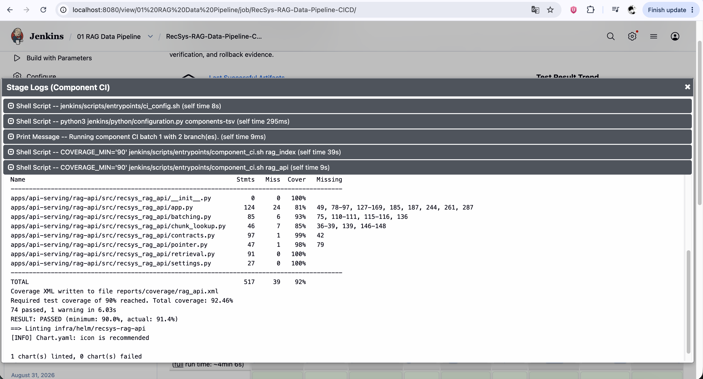

**Figure: RAG Component CI proof.** The console visibly shows the `rag_index`
and `rag_api` branches, passing tests, and the reported 92.46% coverage result.

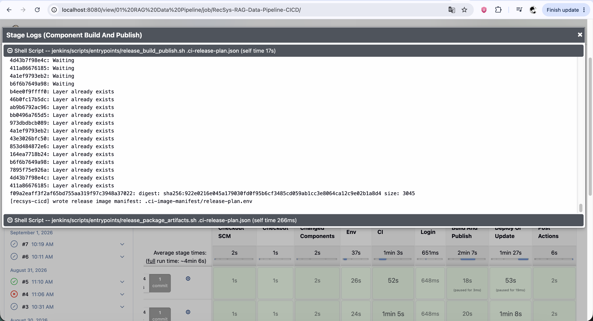

**Figure: RAG build/push/digest proof.** The console visibly shows image build
progress, an immutable digest, and release image-manifest output.

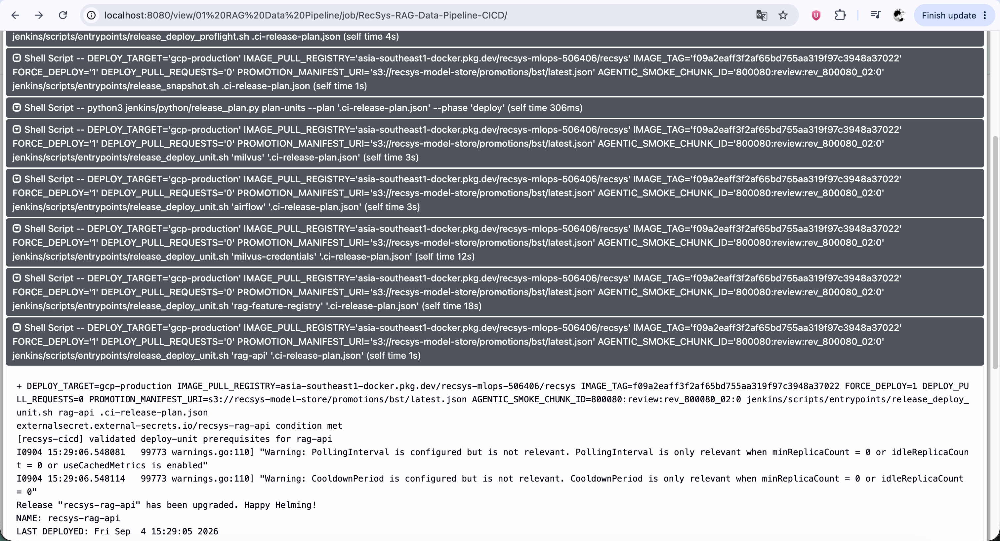

**Figure: RAG deployment proof.** The console visibly shows preflight/snapshot,
the Milvus, Airflow, credential, registry, and RAG API units, and a successful
RAG API Helm upgrade. It is evidence of that run, not the implementation
source-of-truth.

## 4. Context Agent Pipeline

### 4.1 Job input, components, image, and deploy graph

```groovy
upsertJob(
  contextAgentJobName,
  scmPipelineXml(
    contextAgentJobName,
    "Dedicated Context Agent CI/CD proof: Feature/RAG MCP tests and image publish, Context SandboxAgent deployment, MCP/A2A verification, autoscaling checks, and Agent Registry publication.",
    "feature_rag_mcp,context_agent,ci_config",
    true, false, scriptPath, mainBranchSpec
  )
)
```

`RecSys-Context-Agent-CICD` in view `02 Context Agent` forces the MCP, Context
SandboxAgent, and shared configuration CI. Its releasable selection is
`feature_rag_mcp,context_agent`; `ci_config` is test-only.

Reference code:
[`Context job, lines 397-407`](../../../infra/helm/recsys-ci/templates/jenkins-init-configmap.yaml#L397-L407) and
[`Context view, lines 484-489`](../../../infra/helm/recsys-ci/templates/jenkins-init-configmap.yaml#L484-L489).

```json
{
  "feature_rag_mcp": {
    "buildImages": ["recsys-feature-rag-mcp"],
    "verifyDependsOn": ["online_feature_api", "rag_api"]
  },
  "context_agent": {
    "buildImages": [],
    "releaseDependsOn": ["feature_rag_mcp"],
    "verifyDependsOn": ["feature_rag_mcp"]
  }
}
```

Only `recsys-feature-rag-mcp` is built. Context is a declarative
`SandboxAgent`/WorkerPool/KEDA Helm release, so it deliberately has no dedicated
application image. Its release and verification cannot precede its MCP.

Reference code:
[`Context components, lines 496-562`](../../../jenkins/config/components.json#L496-L562) and
[`Feature/RAG MCP image, lines 168-172`](../../../images/catalog.json#L168-L172).

```json
{
  "deployLayers": [
    ["feature-rag-mcp"],
    ["context-agent"]
  ],
  "finalizeLayers": [
    ["feature-rag-mcp-registry"],
    ["context-agent-registry"]
  ]
}
```

The workload graph deploys the MCP first and the SandboxAgent second. After all
verification is green, Registry finalization applies the MCP record and then the
Context Agent record that references it.

Reference code:
[`Context deploy/finalizer units, lines 203-245`](../../../jenkins/config/deploy-units.json#L203-L245).

### 4.2 Component CI and production verification

```bash
ci_feature_rag_mcp() {
  tests=(tests/unit/agentic/feature_rag_mcp tests/contract/test_agentic_context_contracts.py)
  append_integration_dir feature_rag_mcp
  cov_paths=(recsys_feature_rag_mcp)
  run_configured_component_tests "${component}" \
    "apps/agentic/recsys-feature-rag-mcp/src"
  agentic_static_checks
  agentic_helm_gate infra/helm/recsys-feature-rag-mcp
  agentic_helm_gate infra/helm/recsys-kagent-agent
}

ci_context_agent() {
  run_plain_pytest_with_pythonpath_override "${component}" \
    "apps/agentic/recsys-feature-rag-mcp/src" \
    tests/contract/test_agentic_context_contracts.py \
    tests/e2e/agentic_context
  agentic_helm_gate infra/helm/recsys-kagent-agent
}
```

The MCP branch runs unit, integration, and contract tests plus Ruff, mypy,
compile, documentation coverage, Helm lint/render, and strict kubeconform. The
agent branch runs contract/E2E behavior and the SandboxAgent chart gate.

Reference code:
[`agentic shared gates, lines 3-32`](../../../jenkins/scripts/ci/agentic.sh#L3-L32) and
[`Context CI functions, lines 34-56`](../../../jenkins/scripts/ci/agentic.sh#L34-L56).

```bash
component_test_wait_deployment kagent recsys-feature-rag-mcp
# In-container: /healthz, /ready, /version, /metrics must return 200 and
# /version.image_reference must equal the release digest.
agentic_mcp_protocol_smoke
kubectl -n kagent get scaledobject recsys-feature-rag-mcp \
  -o jsonpath='{.spec.minReplicaCount}{" "}{.spec.maxReplicaCount}{" "}{.spec.fallback.replicas}{"\n"}' \
  | grep -Fx '1 3 1'
```

The MCP must expose four healthy endpoints from inside the pod, report exactly
the released digest, pass the MCP protocol handshake/tool calls, and have the
expected 1/3/1 KEDA minimum/maximum/fallback values.

Reference code:
[`Feature/RAG MCP verification, lines 3-23`](../../../jenkins/scripts/test/agentic.sh#L3-L23).

```bash
kubectl -n kagent wait --for=condition=Ready \
  sandboxagent/recsys-context-agent-sandbox --timeout="${COMPONENT_TEST_TIMEOUT:-600s}"
component_test_wait_deployment kagent recsys-context-sandbox-pool
# Assert WorkerPool target, min/max 2/3, fallback threshold 3 and replicas 1.
# Assert at least one worker and ateom-gvisor:v0.0.11.
agentic_wait_for_regular_agent_removal
agentic_a2a_smoke recsys-context-agent-sandbox
```

The Context release must be a ready SandboxAgent backed by a ready gVisor
WorkerPool, with the exact KEDA policy, no legacy regular Agent, and four
grounded A2A tool cases.

Reference code:
[`Context production verification, lines 25-59`](../../../jenkins/scripts/test/agentic.sh#L25-L59) and
[`Context A2A cases, lines 364-438`](../../../jenkins/scripts/deploy/agentic/a2a.sh#L364-L438).

### 4.3 Exact Agent Registry application

```bash
agentic_assert_registry_publish_branch || return 0
agentic_preflight true
agentic_mcp_protocol_smoke
agentic_registry_open_tunnel
commit="${GIT_COMMIT:-$(git rev-parse HEAD)}"
version="$(agentic_registry_version)"       # 0.1.0+<first-12-sha>
tag="$(agentic_registry_tag "${version}")" # 0.1.0-<first-12-sha>
```

The finalizer first authorizes `main` or an explicit override, re-runs runtime
and protocol smoke, and opens a bounded port-forward to the Registry OpenAPI
endpoint. The full commit remains in annotations; version uses 12 SHA
characters and the Registry-safe tag replaces SemVer `+` with `-`.

Reference code:
[`Registry tunnel/version/tag, lines 3-33`](../../../jenkins/scripts/deploy/agentic/registry.sh#L3-L33) and
[`publish authorization, lines 260-278`](../../../jenkins/scripts/deploy/agentic/registry.sh#L260-L278).

```python
metadata = {
    "namespace": namespace,
    "name": name,
    "tag": tag,
    "labels": {"recsys.dev/git-sha": commit[:12]},
    "annotations": {
        "recsys.dev/version": version,
        "recsys.dev/git-commit": commit,
        "recsys.dev/source": git_url,
    },
}
# MCPServer points to ...recsys-feature-rag-mcp...:8080/mcp.
# Context Agent's mcpServers contains that MCPServer with the same tag.
```

Generated manifests bind the source repository and Git commit to the resource.
The MCP record contains the cluster service URL; the Context Agent record
references that MCP at the same release tag.

Reference code:
[`manifest metadata and Context resources, lines 124-184`](../../../jenkins/scripts/deploy/agentic/registry.sh#L124-L184).

```bash
if agentic_registry_publish_required mcp "${registry_name}" "${tag}" \
  "${version}" "${commit}"; then
  arctl apply -f "${manifest}"
fi
arctl get mcp "${registry_name}" --tag "${tag}" -o json >/dev/null
agentic_write_registry_evidence \
  .ci-deploy/feature-rag-mcp-registry.json "${version}" "${commit}" \
  "${registry_name}@${tag}"
```

Before mutation, `arctl get` makes publication idempotent when commit/version
already match and rejects a conflicting record. `arctl apply` creates or updates
the MCP record, a second `arctl get` proves it is retrievable, and the receipt is
archived under `.ci-deploy`.

Reference code:
[`idempotency/conflict check, lines 45-74`](../../../jenkins/scripts/deploy/agentic/registry.sh#L45-L74) and
[`Feature/RAG MCP publication, lines 329-354`](../../../jenkins/scripts/deploy/agentic/registry.sh#L329-L354).

```bash
agentic_wait_for_regular_agent_removal
agentic_a2a_smoke recsys-context-agent-sandbox
agentic_write_registry_manifest "${manifest}" agent "${registry_name}" \
  "${version}" "${tag}" "${commit}" "${git_url}"
arctl apply -f "${manifest}"
arctl get agent "${registry_name}" --tag "${tag}" -o json >/dev/null
if agentic_registry_tagged_resource_exists agent "recsys/recsys-context-agent" \
  "${legacy_backup}"; then
  arctl delete agent recsys/recsys-context-agent --all-tags
fi
agentic_write_context_registry_evidence \
  .ci-deploy/context-agent-registry.json "${version}" "${commit}" \
  "${registry_name}@${tag}" "${legacy_backup}" "${legacy_present}"
```

The Context finalizer repeats readiness/A2A proof, applies and reads back the
sandbox record, backs up and removes every tag of the legacy regular Context
Agent, verifies removal, and writes active/removed artifacts plus backup path to
evidence.

Reference code:
[`Context Registry publication, lines 356-412`](../../../jenkins/scripts/deploy/agentic/registry.sh#L356-L412).

### 4.4 Jenkins evidence


**Figure: Context Agent pipeline overview.** The Jenkins page visibly shows a
successful run and all preserved shared stages.

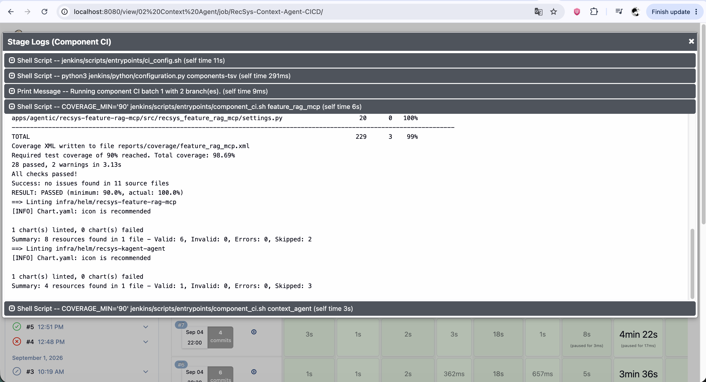

**Figure: Context Agent Component CI proof.** The console visibly shows both
component branches, passing tests, 98.69% coverage, and Helm/kubeconform output.

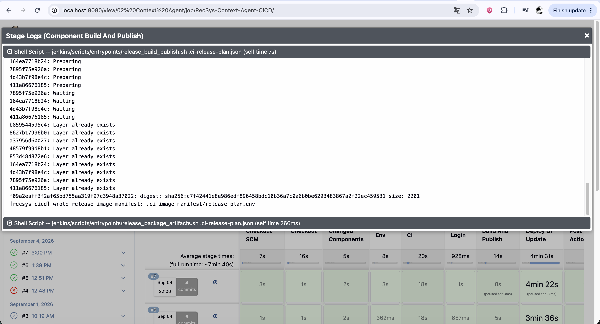

**Figure: Context Agent build/push/digest proof.** The console visibly shows the
single MCP image build, its immutable digest, and manifest packaging.

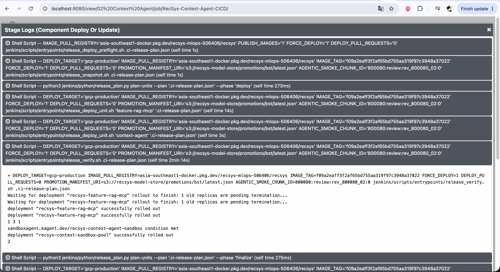

**Figure: Context Agent deploy and Registry transition proof.** The console
visibly shows Feature/RAG MCP and Context workload deployment, readiness checks,
and entry into Registry finalization. The crop does not itself prove the later
`arctl apply`; that behavior is established by the referenced implementation.

## 5. Recommendation Agent Pipeline

### 5.1 Job input, components, image, and deploy graph

```groovy
upsertJob(
  recommendationAgentJobName,
  scmPipelineXml(
    recommendationAgentJobName,
    "Dedicated Recommendation Agent CI/CD proof: Recommendation MCP tests and image publish, Recommendation SandboxAgent deployment, MCP/A2A verification, autoscaling checks, and Agent Registry publication.",
    "recommendation_mcp,recommendation_agent,ci_config",
    true, false, scriptPath, mainBranchSpec
  )
)
```

`RecSys-Recommendation-Agent-CICD` in view `03 Recommendation Agent` forces the
Recommendation MCP, its SandboxAgent, and shared configuration tests from
`*/main`; it is a manual proof job without a per-job webhook.

Reference code:
[`Recommendation job, lines 410-421`](../../../infra/helm/recsys-ci/templates/jenkins-init-configmap.yaml#L410-L421) and
[`Recommendation view, lines 491-496`](../../../infra/helm/recsys-ci/templates/jenkins-init-configmap.yaml#L491-L496).

```json
{
  "recommendation_mcp": {
    "buildImages": ["recsys-recommendation-mcp"],
    "verifyDependsOn": ["inference_api"]
  },
  "recommendation_agent": {
    "buildImages": [],
    "releaseDependsOn": ["recommendation_mcp"],
    "verifyDependsOn": ["recommendation_mcp"]
  },
  "deployLayers": [["recommendation-mcp"], ["recommendation-agent"]],
  "finalizeLayers": [["recommendation-mcp-registry"], ["recommendation-agent-registry"]]
}
```

Only `recsys-recommendation-mcp` is built. The Recommendation Agent is a
declarative SandboxAgent without an application image. The MCP depends on the
existing inference service; the Agent and its Registry record depend on the MCP
workload and same-release Registry record.

Reference code:
[`Recommendation components, lines 565-615`](../../../jenkins/config/components.json#L565-L615),
[`Recommendation image, lines 173-177`](../../../images/catalog.json#L173-L177), and
[`Recommendation deploy/finalizer units, lines 247-289`](../../../jenkins/config/deploy-units.json#L247-L289).

### 5.2 Component CI and production verification

```bash
ci_recommendation_mcp() {
  tests=(
    tests/unit/agentic/recommendation_mcp
    tests/contract/test_recommendation_agentic_contracts.py
  )
  append_integration_dir recommendation_agentic
  cov_paths=(recsys_recommendation_mcp)
  run_configured_component_tests "${component}" \
    "apps/agentic/recsys-recommendation-mcp/src"
  recommendation_agentic_static_checks
  bash jenkins/scripts/ci/recommendation_mutation.sh "${ci_environment}"
  agentic_helm_gate infra/helm/recsys-recommendation-mcp
  agentic_helm_gate infra/helm/recsys-recommendation-agent
}

ci_recommendation_agent() {
  run_plain_pytest_with_pythonpath_override "${component}" \
    "apps/agentic/recsys-recommendation-mcp/src" \
    tests/contract/test_recommendation_agentic_contracts.py \
    tests/e2e/recommendation_agentic
  agentic_helm_gate infra/helm/recsys-recommendation-agent
}
```

The MCP branch runs unit/integration/contracts, coverage, Ruff, mypy, compile,
documentation, mutation, MCP Helm, and Agent Helm gates. The agent branch
separately proves contract/E2E behavior and renders the SandboxAgent chart.

Reference code:
[`Recommendation static checks, lines 58-73`](../../../jenkins/scripts/ci/agentic.sh#L58-L73) and
[`Recommendation CI functions, lines 75-98`](../../../jenkins/scripts/ci/agentic.sh#L75-L98).

```bash
component_test_wait_deployment kagent recsys-recommendation-mcp
# /healthz, /ready, /version and /metrics must return 200.
# /version.image_reference must equal the release digest.
# /version.downstream must equal recsys-inference-api.
recommendation_mcp_protocol_smoke
# Assert KEDA min/max 1/3, fallback 1, and Deployment target.
```

The deployed MCP must use the immutable release digest, identify the exact
downstream inference service, pass recommendation-specific MCP protocol calls,
and expose the declared autoscaling target and limits.

Reference code:
[`Recommendation MCP verification, lines 61-91`](../../../jenkins/scripts/test/agentic.sh#L61-L91).

```bash
kubectl -n kagent wait --for=condition=Ready \
  sandboxagent/recsys-recommendation-agent-sandbox --timeout="${COMPONENT_TEST_TIMEOUT:-600s}"
component_test_wait_deployment kagent recsys-recommendation-sandbox-pool
# Assert WorkerPool target, KEDA min/max 2/3 and fallback 1.
kubectl -n kagent get sandboxagent recsys-recommendation-agent-sandbox -o yaml \
  | grep -Fq recsys-recommendation-mcp
if kubectl -n kagent get sandboxagent recsys-recommendation-agent-sandbox -o yaml \
  | grep -Eq 'recsys-context-agent|recsys-feature-rag-mcp'; then
  return 1
fi
recommendation_a2a_smoke
```

The Recommendation SandboxAgent must be ready, isolated to its Recommendation
MCP, free of Context/RAG dependencies, backed by the expected WorkerPool/KEDA
policy, and pass its A2A response contract.

Reference code:
[`Recommendation Agent verification, lines 93-118`](../../../jenkins/scripts/test/agentic.sh#L93-L118).

### 5.3 Exact Agent Registry application

```bash
agentic_assert_registry_publish_branch || return 0
recommendation_agentic_preflight true
recommendation_mcp_protocol_smoke
agentic_registry_open_tunnel
agentic_write_registry_manifest "${manifest}" recommendation-mcp \
  "${registry_name}" "${version}" "${tag}" "${commit}" "${git_url}"
if agentic_registry_publish_required mcp "${registry_name}" "${tag}" \
  "${version}" "${commit}"; then
  arctl apply -f "${manifest}"
fi
arctl get mcp "${registry_name}" --tag "${tag}" -o json >/dev/null
agentic_write_registry_evidence \
  .ci-deploy/recommendation-mcp-registry.json "${version}" "${commit}" \
  "${registry_name}@${tag}"
```

After workload verification, the MCP finalizer repeats preflight/protocol smoke,
generates a `MCPServer` manifest whose remote URL is the Recommendation MCP
service, rejects tag conflicts, applies with `arctl`, reads the same tag back,
and writes an evidence receipt.

Reference code:
[`Recommendation MCP manifest, lines 185-199`](../../../jenkins/scripts/deploy/agentic/registry.sh#L185-L199) and
[`Recommendation MCP Registry finalizer, lines 414-439`](../../../jenkins/scripts/deploy/agentic/registry.sh#L414-L439).

```bash
arctl get mcp recsys/recsys-recommendation-mcp \
  --tag "${tag}" -o json >/dev/null || {
  recsys_error "matching recommendation MCP registry version is required"
  return 1
}
agentic_write_registry_manifest "${manifest}" recommendation-agent \
  "${registry_name}" "${version}" "${tag}" "${commit}" "${git_url}"
if agentic_registry_publish_required agent "${registry_name}" "${tag}" \
  "${version}" "${commit}"; then
  arctl apply -f "${manifest}"
fi
arctl get agent "${registry_name}" --tag "${tag}" -o json >/dev/null
agentic_write_registry_evidence \
  .ci-deploy/recommendation-agent-registry.json "${version}" "${commit}" \
  "${registry_name}@${tag}"
```

The Agent cannot be published until the Recommendation MCP exists at exactly
the same safe release tag. Its generated manifest references that tag. The same
idempotency/conflict, `arctl apply`, read-back, and evidence rules then apply to
the Agent record.

Reference code:
[`Recommendation Agent manifest, lines 200-217`](../../../jenkins/scripts/deploy/agentic/registry.sh#L200-L217) and
[`Recommendation Agent Registry finalizer, lines 441-475`](../../../jenkins/scripts/deploy/agentic/registry.sh#L441-L475).

### 5.4 Jenkins evidence


**Figure: Recommendation Agent pipeline overview.** The page visibly shows a
successful dedicated run and the unchanged nine-stage view.

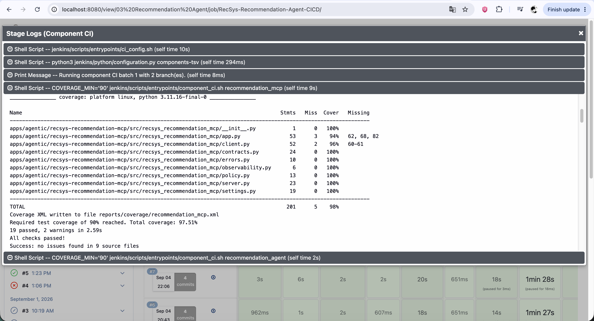

**Figure: Recommendation Agent Component CI proof.** The console visibly shows
the MCP and Agent branches, passing tests, and 97.51% coverage.

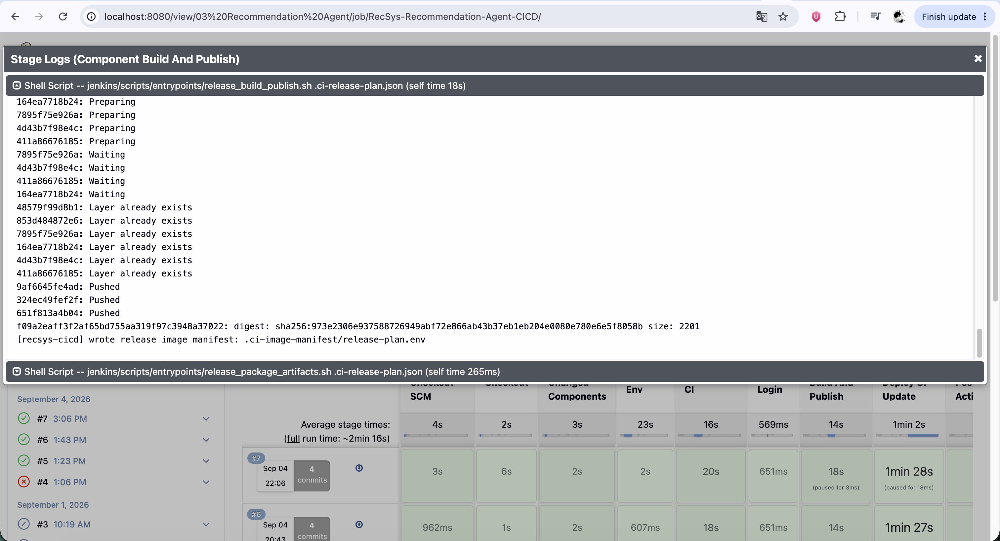

**Figure: Recommendation Agent build/push/digest proof.** The console visibly
shows the single Recommendation MCP image build and immutable digest output.

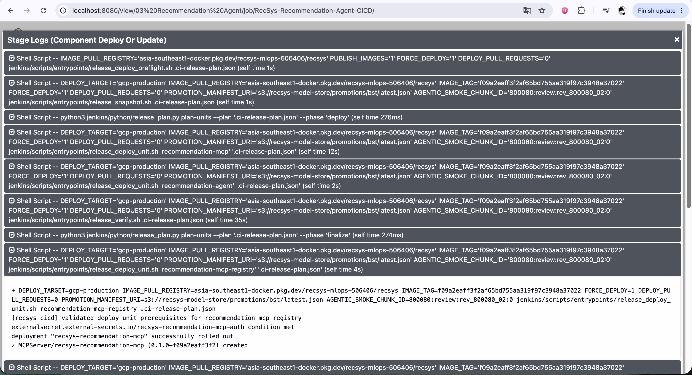

**Figure: Recommendation Agent deploy and Registry proof.** The console visibly
shows workload deployment/finalization and the message
`MCPServer ... recsys-recommendation-mcp ... created`. The screenshot proves the
observed run; exact publication semantics come from the source above.

## 6. Coordinator Agent Pipeline

### 6.1 Dependency-closed input, CI batches, images, and deploy graph

```groovy
upsertJob(
  coordinatorAgentJobName,
  scmPipelineXml(
    coordinatorAgentJobName,
    "Dedicated Coordinator Agent dependency-closed CI/CD proof: both specialist MCPs and agents, Coordinator routing deployment, six-case A2A verification, and same-commit Agent Registry publication.",
    "feature_rag_mcp,context_agent,recommendation_mcp,recommendation_agent,coordinator_agent,ci_config",
    true, false, scriptPath, mainBranchSpec
  )
)
```

`RecSys-Coordinator-Agent-CICD` in view `04 Coordinator Agent` explicitly closes
over both specialist stacks and the Coordinator. This ensures one proof run can
produce a same-commit set instead of silently consuming unrelated Registry
versions.

Reference code:
[`Coordinator job, lines 423-434`](../../../infra/helm/recsys-ci/templates/jenkins-init-configmap.yaml#L423-L434) and
[`Coordinator view, lines 498-503`](../../../infra/helm/recsys-ci/templates/jenkins-init-configmap.yaml#L498-L503).

```text
CI batch 1: feature_rag_mcp | context_agent
CI batch 2: recommendation_mcp | recommendation_agent
CI batch 3: coordinator_agent

Build images: recsys-feature-rag-mcp | recsys-recommendation-mcp

Deploy layer 1: feature-rag-mcp | recommendation-mcp
Deploy layer 2: context-agent | recommendation-agent
Deploy layer 3: coordinator-agent

Finalize layer 1: feature-rag-mcp-registry | recommendation-mcp-registry
Finalize layer 2: context-agent-registry | recommendation-agent-registry
Finalize layer 3: coordinator-agent-registry
```

With maximum CI parallelism two, five releasable components become three test
batches. Only the two MCP images are built; all three Agents are declarative.
Workloads and five Registry finalizers each form three dependency layers.

Reference code:
[`bounded CI batching, lines 36-59`](../../../jenkins/pipeline/component_pipeline.groovy#L36-L59),
[`agent component dependencies, lines 496-644`](../../../jenkins/config/components.json#L496-L644), and
[`agent deploy graph, lines 203-316`](../../../jenkins/config/deploy-units.json#L203-L316).

### 6.2 Coordinator CI and production verification

```bash
ci_coordinator_agent() {
  run_plain_pytest_with_pythonpath_override \
    "${component}" \
    "apps/agentic/recsys-feature-rag-mcp/src" \
    tests/contract/test_coordinator_agentic_contracts.py \
    tests/e2e/coordinator_agentic
  agentic_helm_gate infra/helm/recsys-coordinator-agent
}
```

After the four specialist branches described in sections 4 and 5, the final CI
batch runs Coordinator contract/E2E tests and strict Helm/kubeconform rendering.

Reference code:
[`Coordinator CI, lines 100-107`](../../../jenkins/scripts/ci/agentic.sh#L100-L107).

```bash
kubectl -n kagent get sandboxagent recsys-coordinator-agent-sandbox -o json \
  | python3 -c '
import json, sys
spec = json.load(sys.stdin)["spec"]
assert spec["substrate"]["workerPoolRef"]["name"] == "recsys-coordinator-sandbox-pool"
tools = spec["declarative"]["tools"]
agents = [item["agent"]["name"] for item in tools if item["type"] == "Agent"]
mcps = [item["mcpServer"]["name"] for item in tools if item["type"] == "McpServer"]
assert agents == ["recsys-context-agent-sandbox", "recsys-recommendation-agent-sandbox"]
assert mcps == ["recsys-feature-rag-mcp", "recsys-recommendation-mcp"]
'
```

The deployed Coordinator must use its WorkerPool and expose exactly two
specialist Agents plus the two direct MCPs in deterministic order. Extra or
missing routing dependencies fail verification.

Reference code:
[`Coordinator wiring verification, lines 120-136`](../../../jenkins/scripts/test/agentic.sh#L120-L136).

```bash
# Assert WorkerPool has a selector and at least one replica.
# Assert KEDA target, min/max 2/3, fallback threshold 3 and replicas 1.
# Assert AverageValue threshold 0.7 over assigned WorkerPool workers.
! kubectl -n kagent get agent recsys-coordinator-agent >/dev/null 2>&1
coordinator_a2a_smoke
```

The remaining checks prove WorkerPool readiness, the exact KEDA Prometheus
policy, removal of the legacy regular Coordinator, and six A2A cases:
`context_agent`, `recommendation_agent`, `composite_agents`,
`direct_context_mcp`, `direct_recommendation_mcp`, and `partial_result`.

Reference code:
[`Coordinator runtime verification, lines 137-165`](../../../jenkins/scripts/test/agentic.sh#L137-L165) and
[`six-case A2A suite, lines 102-200`](../../../jenkins/scripts/deploy/agentic/a2a.sh#L102-L200).

### 6.3 Exact same-commit Agent Registry proof

```bash
commit="${GIT_COMMIT:-$(git rev-parse HEAD)}"
version="$(agentic_registry_version)"
tag="$(agentic_registry_tag "${version}")"
agentic_registry_require_dependency mcp \
  recsys/recsys-feature-rag-mcp "${tag}" "${version}" "${commit}"
agentic_registry_require_dependency mcp \
  recsys/recsys-recommendation-mcp "${tag}" "${version}" "${commit}"
agentic_registry_require_dependency agent \
  recsys/recsys-context-agent-sandbox "${tag}" "${version}" "${commit}"
agentic_registry_require_dependency agent \
  recsys/recsys-recommendation-agent-sandbox "${tag}" "${version}" "${commit}"
```

`agentic_registry_require_dependency` uses `arctl get --tag`, parses the returned
JSON, and requires both version and full Git commit to match. Therefore sharing
only a tag name is insufficient: all four prerequisites must be from this exact
release commit.

Reference code:
[`dependency proof implementation, lines 76-104`](../../../jenkins/scripts/deploy/agentic/registry.sh#L76-L104) and
[`Coordinator dependency calls, lines 477-497`](../../../jenkins/scripts/deploy/agentic/registry.sh#L477-L497).

```python
metadata["annotations"]["recsys.dev/a2a-dependencies"] = ",".join([
    f"recsys/recsys-context-agent-sandbox@{tag}",
    f"recsys/recsys-recommendation-agent-sandbox@{tag}",
])
resource = {
    "apiVersion": "ar.dev/v1alpha1",
    "kind": "Agent",
    "metadata": metadata,
    "spec": {
        "mcpServers": [
            {"kind": "MCPServer", "namespace": namespace,
             "name": "recsys-feature-rag-mcp", "tag": tag},
            {"kind": "MCPServer", "namespace": namespace,
             "name": "recsys-recommendation-mcp", "tag": tag},
        ]
    },
}
```

The generated Coordinator manifest records both A2A specialist versions in an
annotation and both direct MCP dependencies in `spec`, all with the same tag.

Reference code:
[`Coordinator Registry manifest, lines 218-252`](../../../jenkins/scripts/deploy/agentic/registry.sh#L218-L252).

```bash
if agentic_registry_publish_required agent "${registry_name}" "${tag}" \
  "${version}" "${commit}"; then
  arctl apply -f "${manifest}"
fi
arctl get agent "${registry_name}" --tag "${tag}" -o json >/dev/null
if agentic_registry_tagged_resource_exists agent \
  recsys/recsys-coordinator-agent "${legacy_backup}"; then
  arctl delete agent recsys/recsys-coordinator-agent --all-tags
fi
agentic_write_registry_evidence \
  .ci-deploy/coordinator-agent-registry.json "${version}" "${commit}" \
  "${registry_name}@${tag}" \
  "recsys/recsys-context-agent-sandbox@${tag}" \
  "recsys/recsys-recommendation-agent-sandbox@${tag}" \
  "recsys/recsys-feature-rag-mcp@${tag}" \
  "recsys/recsys-recommendation-mcp@${tag}"
```

After all prerequisites pass, the finalizer applies and reads back the
Coordinator, backs up/removes its legacy regular-Agent record, and archives one
receipt naming the Coordinator and all four exact dependencies. The earlier
four finalizer units use the Context/Recommendation application flows already
shown, so all five records are applied and verified before this stage succeeds.

Reference code:
[`Coordinator Registry finalizer, lines 477-523`](../../../jenkins/scripts/deploy/agentic/registry.sh#L477-L523) and
[`five Registry dispatch handlers, lines 333-337`](../../../jenkins/scripts/deploy/release_unit_runtime.sh#L333-L337).

### 6.4 Jenkins evidence


**Figure: Coordinator Agent pipeline overview.** The Jenkins page visibly shows
a successful dependency-closed run and the unchanged stage columns.

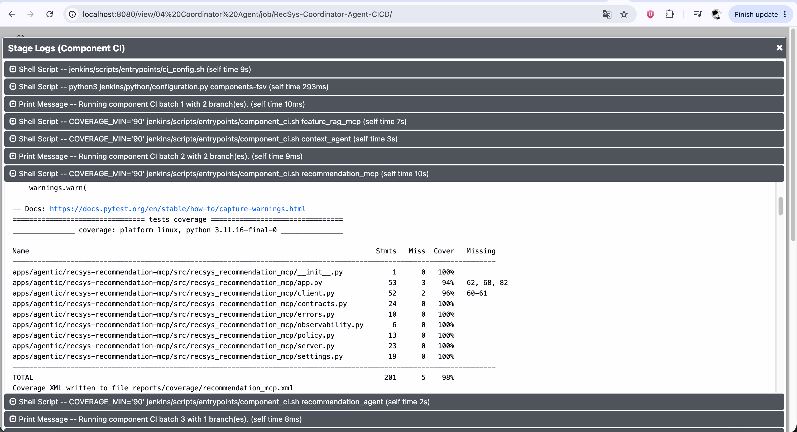

**Figure: Coordinator Agent Component CI proof.** The console visibly shows the
three bounded CI batches covering both specialist stacks and the Coordinator.

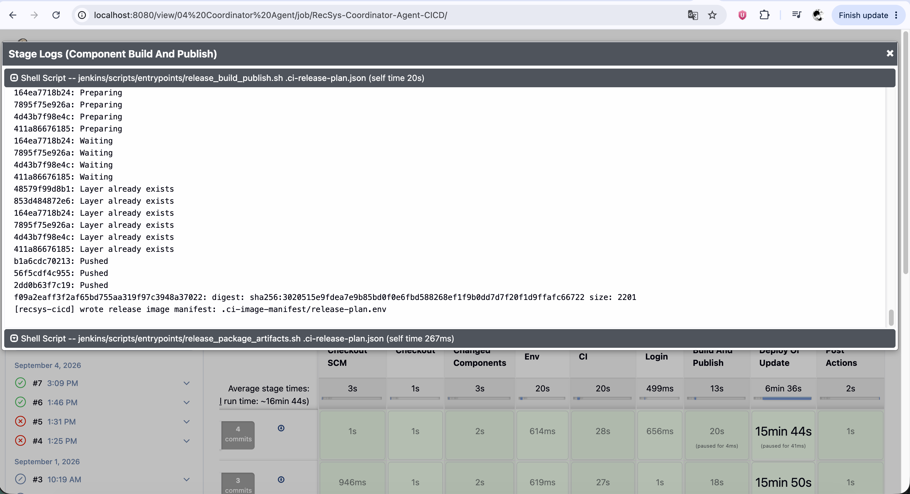

**Figure: Coordinator Agent build/push/digest proof.** The console visibly shows
the two MCP image builds and immutable digest/manifest output.

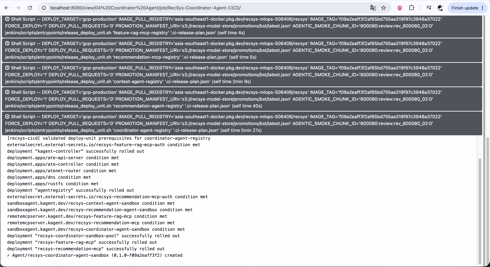

**Figure: Coordinator Agent Registry proof.** The console visibly shows the
dependency finalizers and `Agent ... recsys-coordinator-agent-sandbox ...
created`, after its specialist prerequisites. The source above defines the
stronger same-commit check behind that visible outcome.

## 7. Evidence interpretation and operational conclusion

```text
Implementation source of truth: Jenkinsfile + Groovy/Python/shell/configuration
Execution evidence:          Jenkins Stage View, console output, archived files
Production identity:         full Git SHA + immutable registry digest
Registry identity:           0.1.0+<12-char-sha> / safe tag 0.1.0-<12-char-sha>
```

The screenshots prove what was visible in those particular successful runs.
They are not used to infer hidden behavior. Conditions, dependency ordering,
failure handling, rollback scope, and Registry consistency are documented from
the linked code. Together, the four jobs show one shared, maintainable
nine-stage contract with component-specific CI, minimal images, dependency-safe
production rollout, workload verification, and post-verification Registry
publication.
