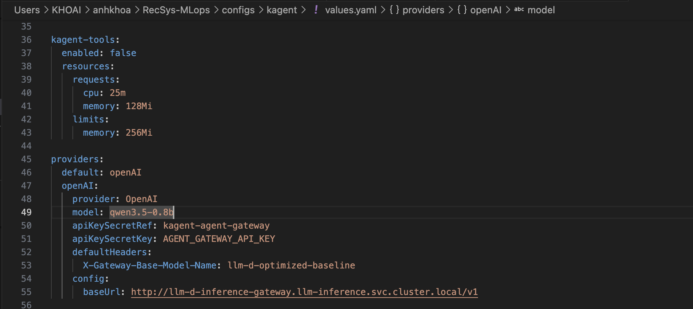
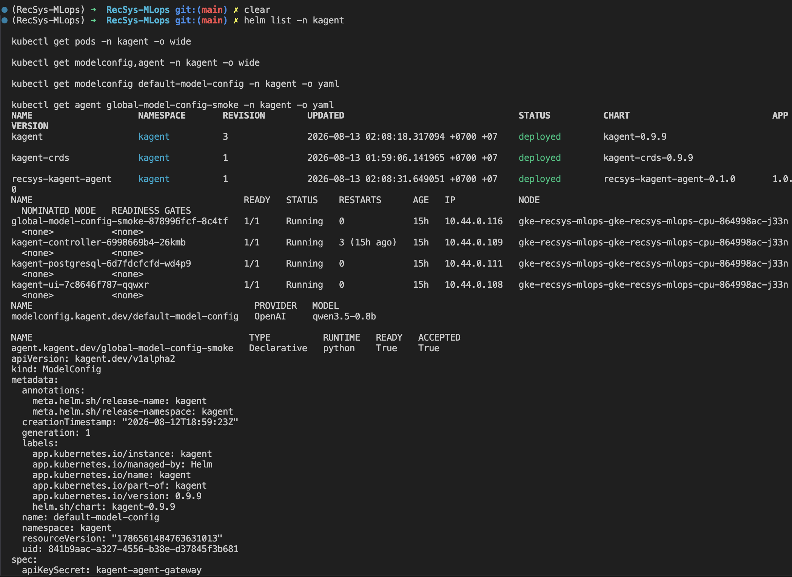
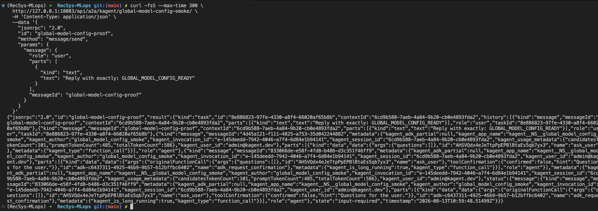

# Global Model Configuration for kagent Agents

This document describes the repository-owned deployment of one shared kagent
`ModelConfig`. The configuration lets declarative Agents use the existing Qwen
inference platform through the llm-d Agent Gateway instead of connecting to the
llama.cpp model Service directly.

The live GKE deployment was completed and functionally verified on 2026-08-13.
The then-current verification Agent returned `GLOBAL_MODEL_CONFIG_READY`
through its A2A endpoint. That standalone smoke Agent was later superseded by
the three specialist/coordinator SandboxAgents; its captured
output below is retained as historical ModelConfig evidence.

The production configuration was revalidated on 2026-08-26 with
`maxTokens=384`, `temperature=0`, and `seed=42`. The 384-token cap leaves output
capacity after the inference server's 256-token Qwen reasoning budget. It is
the current source of truth; older 256-token screenshots are historical.

## Architecture and scope

**Illustrative flow:** derived from the ModelConfig source at
[`configs/kagent/values.yaml`, lines 45–55](../../../configs/kagent/values.yaml#L45-L55),
the Agent reference at
the current [`coordinator sandboxagent.yaml` (line 24)](../../../infra/helm/recsys-coordinator-agent/templates/sandboxagent.yaml#L24),
and the llm-d route at
[`router-llama-cpp-cpu-optimized-values.yaml`, lines 1–41](../../../configs/llm-d/router-llama-cpp-cpu-optimized-values.yaml#L1-L41).

**Code block provenance:** the three repository sources are linked immediately above.

```text
kagent Agent
  -> default-model-config
  -> OpenAI-compatible HTTP request
  -> llm-d-inference-gateway.llm-inference.svc.cluster.local:80
  -> llm-d-optimized-baseline HTTPRoute and InferencePool
  -> qwen35-gguf llama.cpp Pods
  -> qwen3.5-0.8b completion
```

The scope intentionally excludes TLS for this internal connection. The current
Gateway listener uses HTTP on port 80, so the `ModelConfig` uses an `http://`
base URL and does not include a `tls` block.

The principal implementation files are:

**Repository path inventory:** each path below is repository-owned rather than
downloaded from an external chart registry.

**Code block provenance:** repository paths documented and linked in the sections below.

```text
configs/kagent/values.yaml
infra/terraform/gcp/modules/kubernetes-platform/kagent.tf
infra/helm/recsys-kagent-agent/
tests/contract/test_llm_inference_contracts.py
```

## Step 1 — Pin and install kagent with Terraform

[`infra/terraform/gcp/modules/kubernetes-platform/kagent.tf` (line 1)](../../../infra/terraform/gcp/modules/kubernetes-platform/kagent.tf#L1)
pins kagent `0.9.9` and installs the CRDs before the application chart:

**Source:** [`kagent.tf`, lines 1–5](../../../infra/terraform/gcp/modules/kubernetes-platform/kagent.tf#L1-L5)
and [`kagent.tf`, lines 39–57](../../../infra/terraform/gcp/modules/kubernetes-platform/kagent.tf#L39-L57).

```hcl
variable "kagent_version" {
  description = "Pinned kagent CRD and application chart version."
  type        = string
  default     = "0.9.9"
}

resource "helm_release" "kagent_crds" {
  count = var.deploy_llm_inference ? 1 : 0

  name       = "kagent-crds"
  repository = "oci://ghcr.io/kagent-dev/kagent/helm"
  chart      = "kagent-crds"
  version    = var.kagent_version
  namespace  = kubernetes_namespace.kagent[0].metadata[0].name
  atomic     = true
  wait       = true
  timeout    = 600

  set {
    name  = "kmcp.enabled"
    value = "false"
  }

  depends_on = [kubernetes_namespace.kagent]
}
```

### Where the OCI chart is downloaded

The `repository`, `chart`, and `version` fields combine into these version-tagged
OCI references during Terraform plan/apply. They are version-pinned but not
digest-pinned, so the registry tag is still the remote point of trust:

**Derived references:** generated from
[`kagent.tf`, lines 42–45](../../../infra/terraform/gcp/modules/kubernetes-platform/kagent.tf#L42-L45)
and [`kagent.tf`, lines 62–65](../../../infra/terraform/gcp/modules/kubernetes-platform/kagent.tf#L62-L65).

```text
oci://ghcr.io/kagent-dev/kagent/helm/kagent-crds:0.9.9
oci://ghcr.io/kagent-dev/kagent/helm/kagent:0.9.9
```

The Terraform Helm provider pulls and renders the packages on the machine that
runs Terraform. This repository locks provider `2.17.0` at
[`infra/terraform/gcp/.terraform.lock.hcl`, lines 44–45](../../../infra/terraform/gcp/.terraform.lock.hcl#L44-L45).
The embedded Helm SDK may use a temporary download directory while locating and
loading the chart. It does **not** copy the chart source into this Git
repository, and a GKE node does not download the chart. Kubernetes receives the
rendered resources; Helm stores release state in the cluster.

The temporary provider path is not a stable public interface and must not be
used as a deployment input. Separately, the Helm CLI used for validation can
keep persistent cache files. On the workstation used for this rollout, Helm
`v4.2.3` reports:

**Observed command:** environment inspection only; no repository source is
modified.

```bash
helm version --short
helm env | grep -E 'HELM_(CACHE_HOME|REPOSITORY_CACHE|REGISTRY_CONFIG)'
```

**Observed output:** local workstation paths, not portable repository paths.

```text
HELM_CACHE_HOME=/Users/KHOAI/Library/Caches/helm
HELM_REPOSITORY_CACHE=/Users/KHOAI/Library/Caches/helm/repository
HELM_REGISTRY_CONFIG=/Users/KHOAI/Library/Preferences/helm/registry/config.json
```

After the validation commands, Helm CLI cache artifacts were observed under:

**Observed local cache paths:** generated artifacts; not committed and safe to
re-download.

```text
/Users/KHOAI/Library/Caches/helm/repository/kagent-0.9.9.tgz
/Users/KHOAI/Library/Caches/helm/content/<sha256-prefix>/<digest>.chart
```

Deleting this CLI cache does not uninstall the release. A later plan/apply can
pull the chart again from GHCR. Do not vendor, edit, or cite the cache file as
the configuration source; the authoritative inputs are the pinned Terraform
block and [`configs/kagent/values.yaml`, lines 1–94](../../../configs/kagent/values.yaml#L1-L94).

### Other chart source types in this repository

kagent follows an OCI pattern that already existed in the LLM stack:

| Source type | Terraform releases | Repository reference |
|---|---|---|
| OCI | `agentgateway_crds`, `agentgateway` | [`llm_inference.tf`, lines 21–60](../../../infra/terraform/gcp/modules/kubernetes-platform/llm_inference.tf#L21-L60) |
| OCI | `llm_d_router` | [`llm_inference.tf`, lines 92–117](../../../infra/terraform/gcp/modules/kubernetes-platform/llm_inference.tf#L92-L117) |
| OCI | `kagent_crds`, `kagent` | [`kagent.tf`, lines 249–326](../../../infra/terraform/gcp/modules/kubernetes-platform/kagent.tf#L249-L326) |
| Local repository chart | `recsys_llm_serving` | [`llm_inference.tf`, lines 62–90](../../../infra/terraform/gcp/modules/kubernetes-platform/llm_inference.tf#L62-L90) |
| Local repository charts | Context, Recommendation, and Coordinator Agents | [`infra/helm`](../../../infra/helm), validated by [`agentic_preflight()` (line 114)](../../../jenkins/scripts/deploy/agentic.sh#L114) |
| Local repository chart | 17 RecSys service releases | [`recsys_services.tf`, lines 1–590](../../../infra/terraform/gcp/modules/kubernetes-platform/recsys_services.tf#L1-L590) |
| Classic HTTPS repository | DataHub charts | [`datahub.tf`, lines 64–103](../../../infra/terraform/gcp/modules/kubernetes-platform/datahub.tf#L64-L103) |
| Classic HTTPS repository | cert-manager, KEDA, External Secrets, KubeRay, Prometheus, Istio, ingress-nginx | [`dependencies.tf`, lines 19–315](../../../infra/terraform/gcp/modules/kubernetes-platform/dependencies.tf#L19-L315) |

Therefore, five Terraform Helm releases use OCI in the current repository:
the two agentgateway releases, the llm-d Router, and the two kagent releases.
Nineteen application charts use repository-local paths under `infra/helm`.

Internet references:

- [Helm OCI registries](https://helm.sh/docs/topics/registries/).
- [Terraform Helm provider OCI example](https://registry.terraform.io/providers/hashicorp/helm/latest/docs/resources/release).

The `kagent` namespace has Istio sidecar injection disabled because this
coursework path uses direct cluster-internal HTTP:

**Source:** [`kagent.tf`, line 151](../../../infra/terraform/gcp/modules/kubernetes-platform/kagent.tf#L151).

```hcl
resource "kubernetes_namespace" "kagent" {
  count = var.deploy_llm_inference ? 1 : 0

  metadata {
    labels = {
      istio-injection = "disabled"
    }

    name = "kagent"
  }
}
```

The application release depends on both the kagent CRDs and the existing llm-d
router. Consequently, the chart cannot create the `ModelConfig` before its CRD
exists or before the intended Gateway route is deployed:

**Source:** [`kagent.tf`, line 201](../../../infra/terraform/gcp/modules/kubernetes-platform/kagent.tf#L201).

```hcl
resource "helm_release" "kagent" {
  count = var.deploy_llm_inference ? 1 : 0

  name       = "kagent"
  repository = "oci://ghcr.io/kagent-dev/kagent/helm"
  chart      = "kagent"
  version    = var.kagent_version
  namespace  = kubernetes_namespace.kagent[0].metadata[0].name
  atomic     = true
  wait       = true
  timeout    = 900
  values = [
    file("${path.module}/../../../configs/kagent/values.yaml"),
  ]

  depends_on = [
    helm_release.kagent_crds,
    helm_release.llm_d_router,
    kubernetes_secret_v1.kagent_agent_gateway,
  ]
}
```

Internet reference:

- [Installing kagent with Helm](https://kagent.dev/docs/kagent/introduction/installation).

## Step 2 — Supply the Vault-backed Agent Gateway API key

Agent Gateway authentication is enabled in `Strict` mode. The plaintext key is
generated by the Vault bootstrap only when `recsys/agent-gateway` does not yet
exist; it is written directly to Vault KV v2 and is not committed to Git or
stored in Terraform state.

**Source:** [`bootstrap_vault.sh` Agent Gateway branch (line 219)](../../../ops/gcp/bootstrap_vault.sh#L219).

```bash
agent_gateway_api_key="agw-$(openssl rand -hex 32)"
jq -n --arg api_key "${agent_gateway_api_key}" \
  '{data: {AGENT_GATEWAY_API_KEY: $api_key}}' >"${payload_file}"
unset agent_gateway_api_key
vault_exec_with_payload "${active_token}" "${payload_file}" \
  write "recsys/data/agent-gateway" -
```

The security chart renders two `ExternalSecret` objects from that one Vault
record:

```text
Vault KV v2: recsys/agent-gateway
  AGENT_GATEWAY_API_KEY
        |---> kagent/kagent-agent-gateway       (client credential)
        `---> llm-inference/agentgateway-api-keys (server validation set)
```

The `kagent` copy is referenced by `ModelConfig/default-model-config`. The
`llm-inference` copy is referenced by the `AgentgatewayPolicy`. Keeping both
copies sourced from the same Vault record makes rotation atomic at the source;
External Secrets Operator reconciles both namespace-local Secrets.

The Terraform-managed placeholder remains only as an explicit development
fallback when `agent_gateway_auth_enabled=false`.

For an existing deployment that previously tracked the placeholder Secret,
remove only its Terraform state entry before enabling the ExternalSecret. This
keeps the live object available for ESO to adopt and avoids a delete/recreate
race during migration:

```bash
terraform -chdir=infra/terraform/gcp state rm \
  'kubernetes_secret_v1.kagent_agent_gateway[0]'
```

## Step 3 — Generate the global ModelConfig

[`configs/kagent/values.yaml` (line 45)](../../../configs/kagent/values.yaml#L45) configures
the upstream kagent chart to generate `default-model-config`:

**Source:** [`configs/kagent/values.yaml`, lines 45–55](../../../configs/kagent/values.yaml#L45-L55).

```yaml
providers:
  default: openAI
  openAI:
    provider: OpenAI
    model: qwen3.5-0.8b
    apiKeySecretRef: kagent-agent-gateway
    apiKeySecretKey: AGENT_GATEWAY_API_KEY
    defaultHeaders:
      X-Gateway-Base-Model-Name: llm-d-optimized-baseline
    config:
      baseUrl: http://llm-d-inference-gateway.llm-inference.svc.cluster.local/v1
      maxTokens: 384
      temperature: "0"
      seed: 42
```



**Figure: Repository source for the global model configuration.** The captured
`providers.openAI` block selects `qwen3.5-0.8b`, references the API-key Secret
without displaying its value, adds the llm-d routing header, and directs every
Agent using this configuration to the internal Agent Gateway `/v1` endpoint.

The rendered Kubernetes resource is equivalent to:

**Rendered from:** [`configs/kagent/values.yaml`, lines 45–55](../../../configs/kagent/values.yaml#L45-L55)
and the upstream kagent `0.9.9` chart. Reproduce it with the `helm template`
command in Step 5; this YAML is not maintained as a second manifest file.

```yaml
apiVersion: kagent.dev/v1alpha2
kind: ModelConfig
metadata:
  name: default-model-config
  namespace: kagent
spec:
  provider: OpenAI
  model: qwen3.5-0.8b
  apiKeySecret: kagent-agent-gateway
  apiKeySecretKey: AGENT_GATEWAY_API_KEY
  defaultHeaders:
    X-Gateway-Base-Model-Name: llm-d-optimized-baseline
  openAI:
    baseUrl: http://llm-d-inference-gateway.llm-inference.svc.cluster.local/v1
    maxTokens: 384
    temperature: 0
    seed: 42
```

The fields have the following responsibilities:

| Field | Purpose |
|---|---|
| `provider: OpenAI` | Selects kagent's OpenAI-compatible client. |
| `model` | Sends the llama.cpp model alias `qwen3.5-0.8b`. |
| `apiKeySecret` | Names the Secret read by the Agent runtime. |
| `apiKeySecretKey` | Names the key inside that Secret; it is not the key value. |
| `openAI.baseUrl` | Sends inference through Agent Gateway rather than directly to `qwen35-gguf`. |
| `openAI.maxTokens` | Caps each model turn at 384 output tokens: 256 may be consumed by Qwen reasoning, leaving 128 tokens for a tool call or concise answer. |
| `openAI.temperature` | Uses deterministic decoding (`0`) to reduce tool-selection variance. |
| `openAI.seed` | Fixes seed `42` for reproducible agent smoke tests. |
| `defaultHeaders` | Adds the listed static headers to every model-provider request. |

### Why `defaultHeaders` is required

`defaultHeaders` is a map of HTTP headers that kagent attaches to every request
made through this model configuration. For this deployment, the effective
request includes:

**Illustrative request:** derived from
[`configs/kagent/values.yaml`, lines 45–55](../../../configs/kagent/values.yaml#L45-L55).
The repository's executable Gateway request uses the same routing header at
[`llm_inference_smoke.sh`, lines 65–68](../../../ops/validation/llm_inference_smoke.sh#L65-L68).

```http
POST /v1/chat/completions
Content-Type: application/json
Authorization: Bearer <value-from-secret>
X-Gateway-Base-Model-Name: llm-d-optimized-baseline
```

`X-Gateway-Base-Model-Name` carries the logical llm-d route/pool name. It keeps
the Agent request aligned with the deployed `llm-d-optimized-baseline`
`HTTPRoute` and `InferencePool`. The same header is used by the repository's
Gateway smoke test in
[`ops/validation/llm_inference_smoke.sh` (line 65)](../../../ops/validation/llm_inference_smoke.sh#L65).

Credentials must not be placed in `defaultHeaders`, because the header values
are visible in the `ModelConfig` specification. Authentication material belongs
in a Kubernetes Secret referenced by `apiKeySecret` and `apiKeySecretKey`.

Internet references:

- [kagent BYO OpenAI-compatible model](https://kagent.dev/docs/kagent/supported-providers/byo-openai).
- [kagent `ModelConfig` API reference](https://kagent.dev/docs/kagent/resources/api-ref).
- [llm-d multi-model routing](https://llm-d.ai/docs/dev/well-lit-paths/foundations/multi-model-routing).

## Step 4 — Reference the shared configuration from an Agent

At the time of the original evidence, the repository deployed one minimal
Agent solely to prove that the shared model configuration was usable. That
resource is no longer part of the current chart; the source below is pinned to
the last commit before it was superseded.

**Historical source:** [`agent.yaml` at commit `8902ad1`](https://github.com/itsmekhoathekid/RecSys-MLops/blob/8902ad10714ffcd0db6e6e4fa0d489f8945c97a0/infra/helm/recsys-kagent-agent/templates/agent.yaml).

```yaml
apiVersion: kagent.dev/v1alpha2
kind: Agent
metadata:
  name: {{ .Values.agent.name }}
spec:
  type: Declarative
  description: Minimal Agent proving the shared global ModelConfig is usable.
  declarative:
    modelConfig: {{ .Values.agent.modelConfig }}
    stream: false
    systemMessage: |
      {{- .Values.agent.systemMessage | nindent 6 }}
```

[`infra/helm/recsys-kagent-agent/values.yaml` (line 14)](../../../infra/helm/recsys-kagent-agent/values.yaml#L14)
now configures the Context SandboxAgent. The following values block is the
historical smoke-Agent configuration retained to explain the captured proof:

**Historical source:** [`values.yaml` at commit `8902ad1`](https://github.com/itsmekhoathekid/RecSys-MLops/blob/8902ad10714ffcd0db6e6e4fa0d489f8945c97a0/infra/helm/recsys-kagent-agent/values.yaml).

```yaml
agent:
  name: global-model-config-smoke
  modelConfig: default-model-config
```

The Agent and ModelConfig are both in the `kagent` namespace. kagent requires a
declarative Agent's `modelConfig` reference to resolve in the same namespace.
The current coordinator consumer is
[`SandboxAgent/recsys-coordinator-agent-sandbox` (line 24)](../../../infra/helm/recsys-coordinator-agent/templates/sandboxagent.yaml#L24),
while both specialist SandboxAgents also reference `default-model-config`.
Other resources in this namespace can use the same configuration by setting:

**Reusable manifest pattern:** the concrete implementation is
[`coordinator sandboxagent.yaml` (line 24)](../../../infra/helm/recsys-coordinator-agent/templates/sandboxagent.yaml#L24).

```yaml
spec:
  type: Declarative
  declarative:
    modelConfig: default-model-config
```

Terraform installs the shared kagent chart and `ModelConfig`; the agentic deploy
pipeline installs the repository-owned specialist and coordinator charts only
after that platform dependency is Ready. The following Terraform block is
historical ownership evidence for the original smoke Agent, not current IaC:

**Historical source:** [`kagent.tf` at commit `8902ad1`, lines 82–96](https://github.com/itsmekhoathekid/RecSys-MLops/blob/8902ad10714ffcd0db6e6e4fa0d489f8945c97a0/infra/terraform/gcp/modules/kubernetes-platform/kagent.tf#L82-L96).

```hcl
resource "helm_release" "recsys_kagent_agent" {
  count = var.deploy_llm_inference ? 1 : 0

  name      = "recsys-kagent-agent"
  chart     = "${local.helm_dir}/recsys-kagent-agent"
  namespace = kubernetes_namespace.kagent[0].metadata[0].name
  atomic    = true
  wait      = true
  timeout   = 600

  depends_on = [helm_release.kagent]
}
```

Internet reference:

- [kagent Agent model configuration](https://kagent.dev/docs/kagent/concepts/agents).

## Step 5 — Render and validate before deployment

Run the following checks from the repository root:

**Validation commands:** these render
[`recsys-kagent-agent` chart (line 1)](../../../infra/helm/recsys-kagent-agent/Chart.yaml#L1),
render the OCI kagent chart using
[`configs/kagent/values.yaml`, lines 1–94](../../../configs/kagent/values.yaml#L1-L94),
validate the current [`kagent.tf` kagent releases (line 249)](../../../infra/terraform/gcp/modules/kubernetes-platform/kagent.tf#L249),
and execute the contract at
[`test_llm_inference_contracts.py`, lines 81–102](../../../tests/contract/test_llm_inference_contracts.py#L81-L102).

**Code block provenance:** each command's repository input is linked immediately above.

```bash
helm lint infra/helm/recsys-kagent-agent

helm template recsys-kagent-agent \
  infra/helm/recsys-kagent-agent \
  --namespace kagent

helm template kagent \
  oci://ghcr.io/kagent-dev/kagent/helm/kagent \
  --version 0.9.9 \
  --namespace kagent \
  --values configs/kagent/values.yaml

terraform -chdir=infra/terraform/gcp fmt -check
terraform -chdir=infra/terraform/gcp validate
uv run pytest tests/contract/test_llm_inference_contracts.py -q
```

The retained validation result was:

**Observed output:** produced by the immediately preceding commands on
2026-08-13; it is evidence, not a repository source excerpt.

```text
Helm: 1 chart linted, 0 chart failures
Terraform: Success! The configuration is valid.
Pytest: 10 passed
```

The contract test in
[`test_kagent_global_model_config_routes_through_agentgateway` (line 101)](../../../tests/contract/test_llm_inference_contracts.py#L101)
asserts the pinned chart, model alias, internal Gateway URL, route header,
absence of TLS configuration, deterministic output settings, and Agent
references.

## Step 6 — Apply with Terraform

From `infra/terraform/gcp`, preview the changes and apply the reviewed plan:

**Deployment commands:** apply the platform resources declared in the current
[`kagent.tf` platform resources (line 219)](../../../infra/terraform/gcp/modules/kubernetes-platform/kagent.tf#L219). Repository-owned Agent
charts are subsequently deployed by the agentic release pipeline.

```bash
terraform plan -out=kagent.tfplan
terraform apply kagent.tfplan
```

The initial targeted coursework rollout produced:

**Observed Terraform output:** initial live deployment result.

**Code block provenance:** output from the `terraform apply` command immediately above.

```text
Apply complete! Resources: 4 added, 0 changed, 0 destroyed.
```

The follow-up Agent release produced:

**Historical Terraform output:** follow-up deployment result after adding the
now-superseded [`recsys_kagent_agent` release](https://github.com/itsmekhoathekid/RecSys-MLops/blob/8902ad10714ffcd0db6e6e4fa0d489f8945c97a0/infra/terraform/gcp/modules/kubernetes-platform/kagent.tf#L82-L96).

**Code block provenance:** output from applying the linked Terraform resource.

```text
Apply complete! Resources: 1 added, 1 changed, 0 destroyed.
```

The first line represents the `kagent` namespace, Vault-backed client Secret,
CRD Helm release, and kagent application release. The follow-up added the
minimal Agent release and disabled the upstream demo Agent/tool server.

## Step 7 — Verify the applied ModelConfig and Agent

The commands and output in this section record the original 2026-08-13 smoke
Agent. For the current deployment, replace `global-model-config-smoke` with
`recsys-coordinator-agent-sandbox` and inspect all three SandboxAgents.

**Verification commands:** inspect the resources sourced from
the current [`kagent.tf` platform resources (line 219)](../../../infra/terraform/gcp/modules/kubernetes-platform/kagent.tf#L219),
[`configs/kagent/values.yaml`, lines 45–55](../../../configs/kagent/values.yaml#L45-L55),
and the [historical smoke Agent source](https://github.com/itsmekhoathekid/RecSys-MLops/blob/8902ad10714ffcd0db6e6e4fa0d489f8945c97a0/infra/helm/recsys-kagent-agent/templates/agent.yaml).

```bash
helm list -n kagent

kubectl get pods -n kagent -o wide

kubectl get modelconfig,sandboxagent -n kagent -o wide

kubectl get modelconfig default-model-config -n kagent -o yaml

kubectl get agent global-model-config-smoke -n kagent -o yaml

# Repository-target consumers
kubectl get sandboxagent \
  recsys-coordinator-agent-sandbox \
  recsys-context-agent-sandbox \
  recsys-recommendation-agent-sandbox \
  -n kagent -o wide
```

The 2026-08-13 `ModelConfig` reported:

**Observed Kubernetes output:** selected `status` fields from
`kubectl get modelconfig default-model-config -n kagent -o yaml`; the desired
spec is rendered from
[`configs/kagent/values.yaml`, lines 45–55](../../../configs/kagent/values.yaml#L45-L55).

```yaml
status:
  conditions:
    - message: Model configuration accepted
      reason: ModelConfigReconciled
      status: "True"
      type: Accepted
  observedGeneration: 1
```

The historical smoke Agent reported both conditions as true:

**Observed Kubernetes output:** produced by `kubectl get modelconfig,agent -n kagent -o wide`;
the Agent source is the
[pinned historical manifest](https://github.com/itsmekhoathekid/RecSys-MLops/blob/8902ad10714ffcd0db6e6e4fa0d489f8945c97a0/infra/helm/recsys-kagent-agent/templates/agent.yaml).

```text
NAME                        TYPE          RUNTIME   READY   ACCEPTED
global-model-config-smoke   Declarative   python    True    True
```

The Pods captured in that historical verification were:

**Observed Kubernetes output:** produced by `kubectl get pods -n kagent`; the
platform releases are declared in the current
[`kagent.tf` kagent releases (line 249)](../../../infra/terraform/gcp/modules/kubernetes-platform/kagent.tf#L249).

```text
global-model-config-smoke   1/1   Running
kagent-controller           1/1   Running
kagent-postgresql           1/1   Running
kagent-ui                   1/1   Running
```



**Figure: Applied kagent release, ModelConfig, Agent, and runtime proof.** The
capture shows all three Helm releases in `deployed` state, the kagent Pods in
`Running` state, `default-model-config` resolving to the OpenAI-compatible
`qwen3.5-0.8b` model, and `global-model-config-smoke` reporting both
`READY=True` and `ACCEPTED=True`. The beginning of the live `ModelConfig` YAML
also confirms that the resource is Helm-managed in the `kagent` namespace.

## Step 8 — Historical end-to-end inference proof

Port-forward the controller:

**Runtime command:** targets the controller installed by
[`kagent.tf`, line 201](../../../infra/terraform/gcp/modules/kubernetes-platform/kagent.tf#L201).

```bash
kubectl port-forward -n kagent service/kagent-controller 18083:8083
```

In a second terminal, invoke the Agent through its A2A endpoint:

**Historical functional verification command:** invokes the Agent defined in
the [pinned smoke manifest](https://github.com/itsmekhoathekid/RecSys-MLops/blob/8902ad10714ffcd0db6e6e4fa0d489f8945c97a0/infra/helm/recsys-kagent-agent/templates/agent.yaml),
which references the ModelConfig generated from
[`configs/kagent/values.yaml`, lines 45–55](../../../configs/kagent/values.yaml#L45-L55).

```bash
curl -fsS --max-time 300 \
  http://127.0.0.1:18083/api/a2a/kagent/global-model-config-smoke/ \
  -H 'Content-Type: application/json' \
  --data '{
    "jsonrpc": "2.0",
    "id": "global-model-config-proof",
    "method": "message/send",
    "params": {
      "message": {
        "role": "ROLE_USER",
        "parts": [
          {
            "kind": "text",
            "text": "Reply with exactly: GLOBAL_MODEL_CONFIG_READY"
          }
        ],
        "messageId": "global-model-config-proof"
      }
    }
  }'
```

The verified response completed successfully:

**Observed A2A output:** selected fields from the response returned by the
immediately preceding command on 2026-08-13.

```json
{
  "status": {
    "state": "completed"
  },
  "artifacts": [
    {
      "parts": [
        {
          "kind": "text",
          "text": "GLOBAL_MODEL_CONFIG_READY"
        }
      ]
    }
  ],
  "metadata": {
    "kagent_usage_metadata": {
      "promptTokenCount": 485,
      "candidatesTokenCount": 39,
      "totalTokenCount": 524
    }
  }
}
```

This proves more than admission of the YAML resource: the Agent resolved
`default-model-config`, created a model request, sent it through the configured
Agent Gateway base URL with the route header, and received a real Qwen
completion.



**Figure: End-to-end A2A inference through the global ModelConfig.** The
capture records the request sent to `global-model-config-smoke` and the returned
`GLOBAL_MODEL_CONFIG_READY` artifact. The completed task and token-usage
metadata prove that the Agent resolved the shared configuration, reached the
Qwen backend through Agent Gateway, and received an actual model completion.

Internet reference:

- [kagent A2A Agent invocation](https://kagent.dev/docs/kagent/examples/a2a-agents).
