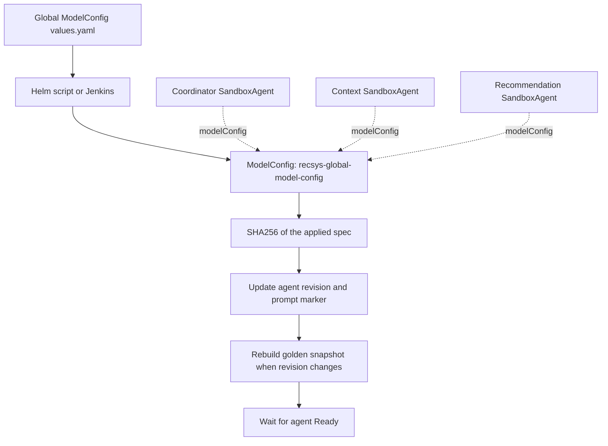
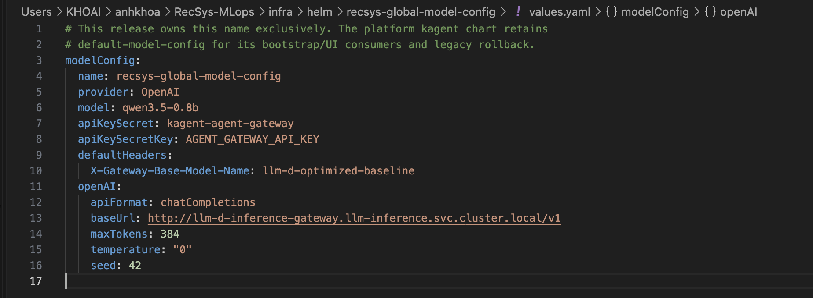
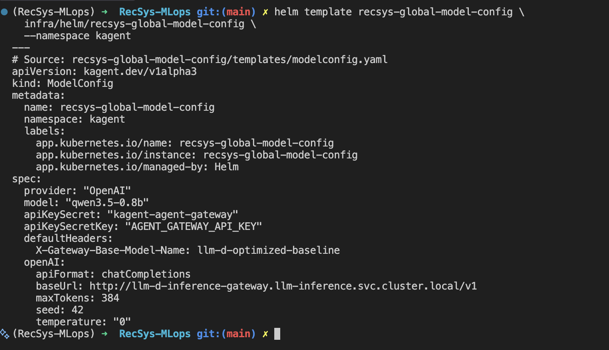
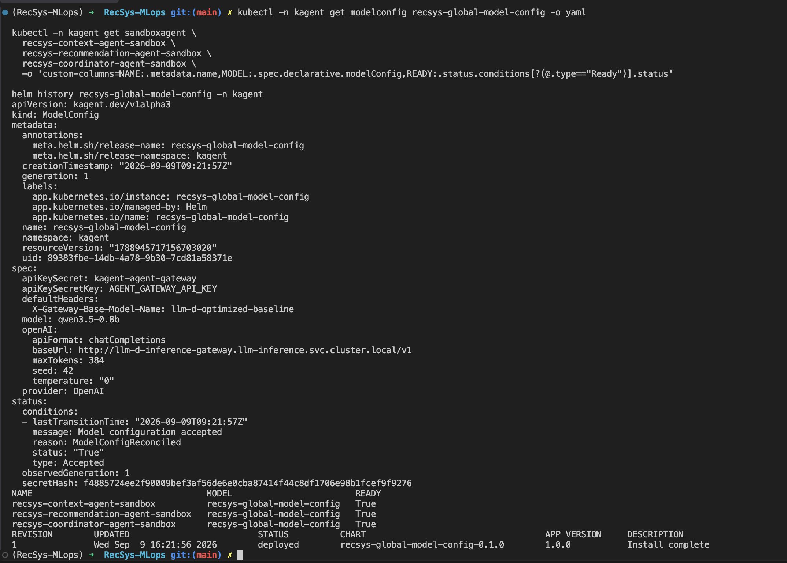
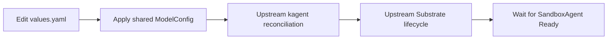

**Global Model Configuration for RecSys Agents — Helm-managed setup**

The shared model configuration for the three default RecSys SandboxAgents is managed by the application Helm release `recsys-global-model-config` in namespace `kagent`. Settings live in a dedicated values file; Helm renders a `ModelConfig`; each agent references that resource by name. The deployment process also refreshes sandbox snapshots when the configuration changes.

This document describes the setup deployed on 9 September 2026. Evidence was collected again for this rewrite. The figures below show the current Helm source, rendered resource, live ModelConfig, agent references and Helm release. Together with the linked raw validation output, they establish configuration ownership, agent references and snapshot readiness; they do not claim a new end-to-end inference benchmark.

**1. Configuration flow and ownership**

The flow follows the [ModelConfig template (line 4)](../../../infra/helm/recsys-global-model-config/templates/modelconfig.yaml#L4), [Helm deployment script (line 21)](../../../ops/helm/deploy_global_model_config.sh#L21) and [agent reference template (line 23)](../../../infra/helm/recsys-kagent-agent/templates/sandboxagent.yaml#L23). Solid arrows describe deployment steps; dashed arrows describe resource references.



| Resource | Owner and purpose |
|---|---|
| `recsys-global-model-config` | Dedicated application Helm release; shared settings for the three default RecSys agents |
| `default-model-config` | Existing platform kagent Helm release; retained for bootstrap/UI consumers |
| Agent prompt, tools and WorkerPool | Each agent's own Helm chart |

Terraform continues to manage the kagent platform. Editing the RecSys shared settings now uses the application chart and does not require a Terraform apply. The new chart explicitly rejects the name `default-model-config`, avoiding ownership collisions.

**Source:** [ModelConfig ownership guard (line 1)](../../../infra/helm/recsys-global-model-config/templates/modelconfig.yaml#L1). The following exact excerpt covers lines 1–3.

```gotemplate
{{- if eq .Values.modelConfig.name "default-model-config" -}}
{{- fail "default-model-config is owned by the platform kagent release; use a distinct name" -}}
{{- end -}}
```

**2. Declare shared settings in Helm values**

**Source:** [Shared ModelConfig values (line 3)](../../../infra/helm/recsys-global-model-config/values.yaml#L3). The following exact excerpt covers lines 3–16.

```yaml
modelConfig:
  name: recsys-global-model-config
  provider: OpenAI
  model: qwen3.5-0.8b
  apiKeySecret: kagent-agent-gateway
  apiKeySecretKey: AGENT_GATEWAY_API_KEY
  defaultHeaders:
    X-Gateway-Base-Model-Name: llm-d-optimized-baseline
  openAI:
    apiFormat: chatCompletions
    baseUrl: http://llm-d-inference-gateway.llm-inference.svc.cluster.local/v1
    maxTokens: 384
    temperature: "0"
    seed: 42
```

| Field | Meaning |
|---|---|
| `modelConfig.name` | Kubernetes resource name referenced by the agents |
| `provider: OpenAI` | Selects an OpenAI-compatible client; it does not mean the model is hosted by OpenAI |
| `model: qwen3.5-0.8b` | Model alias sent in inference requests |
| `apiKeySecret` / `apiKeySecretKey` | References to a Kubernetes Secret and its key; no credential value is stored in this file |
| `defaultHeaders` | Adds the gateway routing header to provider requests |
| `openAI.apiFormat` | Uses Chat Completions |
| `openAI.baseUrl` | Internal inference gateway endpoint |
| `openAI.maxTokens: 384` | Requested output limit for each model call, not a budget for the whole conversation |
| `openAI.temperature: "0"` | Reduces sampling randomness; it is not a guarantee that every runtime execution is identical |
| `openAI.seed: 42` | Fixed seed to support reproducibility under the same execution conditions |

An agent may call the model multiple times around tool execution. Therefore a conversation can consume more than 384 output tokens in total. The file contains Secret references only; the evidence collection does not read Secret values.

The source projection and its SHA256 are retained as [raw text evidence](../../../docs/ops/evidence/global-model-config-2026-09-09/source.txt).



**Figure: Helm source for the shared ModelConfig.** The screenshot shows the repository-owned values, including the model alias, Secret reference, gateway route, base URL and deterministic generation settings.

**3. Render and verify the ModelConfig resource**

**Source:** [ModelConfig resource template (line 4)](../../../infra/helm/recsys-global-model-config/templates/modelconfig.yaml#L4). The following exact excerpt covers lines 4–21.

```yaml
apiVersion: kagent.dev/v1alpha2
kind: ModelConfig
metadata:
  name: {{ required "modelConfig.name is required" .Values.modelConfig.name }}
  namespace: {{ .Release.Namespace }}
  labels:
    app.kubernetes.io/name: {{ .Chart.Name }}
    app.kubernetes.io/instance: {{ .Release.Name }}
    app.kubernetes.io/managed-by: {{ .Release.Service }}
spec:
  provider: {{ .Values.modelConfig.provider | quote }}
  model: {{ required "modelConfig.model is required" .Values.modelConfig.model | quote }}
  apiKeySecret: {{ required "modelConfig.apiKeySecret is required" .Values.modelConfig.apiKeySecret | quote }}
  apiKeySecretKey: {{ required "modelConfig.apiKeySecretKey is required" .Values.modelConfig.apiKeySecretKey | quote }}
  defaultHeaders:
    {{- toYaml .Values.modelConfig.defaultHeaders | nindent 4 }}
  openAI:
    {{- toYaml .Values.modelConfig.openAI | nindent 4 }}
```

Helm maps `.Values.modelConfig` into `ModelConfig.spec`. The namespace comes from the Helm release namespace. Model name and Secret references are required by the template.

**Render command:** used by the [read-only evidence collector](../../../docs/ops/evidence/global-model-config-2026-09-09/capture.py). The saved render is [rendered.yaml](../../../docs/ops/evidence/global-model-config-2026-09-09/rendered.yaml).

```bash
helm template recsys-global-model-config \
  infra/helm/recsys-global-model-config \
  --namespace kagent
```



**Figure: ModelConfig rendered from the Helm chart.** The current chart maps the values into a `kagent.dev/v1alpha2` resource named `recsys-global-model-config` in namespace `kagent` and labels it as Helm-managed; the screenshot is retained as historical evidence if its displayed API version differs.

The live resource is checked independently of the render. The captured [modelconfig.json](../../../docs/ops/evidence/global-model-config-2026-09-09/modelconfig.json) records API version, resource identity, Helm ownership and spec; [helm-history.json](../../../docs/ops/evidence/global-model-config-2026-09-09/helm-history.json) records the Helm release history.

The captured live projection confirms owner `recsys-global-model-config`, namespace `kagent`, model alias, endpoint, `maxTokens=384`, `temperature=0` and `seed=42`. See [raw command evidence](../../../docs/ops/evidence/global-model-config-2026-09-09/modelconfig.txt).

**4. Reference the shared configuration from each agent**

The agent chart stores a reference, not a copy of all generation settings. For example, the Context agent declares its name, WorkerPool and shared ModelConfig as follows.

**Source:** [Context Agent model reference (line 13)](../../../infra/helm/recsys-kagent-agent/values.yaml#L13). The following exact excerpt covers lines 13–18.

```yaml
sandbox:
  name: recsys-context-agent-sandbox
  workerPool: recsys-context-sandbox-pool
  modelConfig: recsys-global-model-config
```

| Agent | ModelConfig declaration |
|---|---|
| Context | [Context values (line 16)](../../../infra/helm/recsys-kagent-agent/values.yaml#L16) |
| Recommendation | [Recommendation values (line 12)](../../../infra/helm/recsys-recommendation-agent/values.yaml#L12) |
| Coordinator | [Coordinator values (line 6)](../../../infra/helm/recsys-coordinator-agent/values.yaml#L6) |

**Source:** [SandboxAgent declarative model binding (line 23)](../../../infra/helm/recsys-kagent-agent/templates/sandboxagent.yaml#L23). The following exact excerpt covers lines 23–29.

```yaml
  declarative:
    runtime: go
    modelConfig: {{ .Values.sandbox.modelConfig }}
    stream: false
    systemMessage: |
      {{- .Values.sandbox.systemMessage | nindent 6 }}
```

The rendered `SandboxAgent.spec.declarative.modelConfig` points to `recsys-global-model-config`. The runtime remains `go`; prompt and tools stay defined in the individual agent chart.

Each specialist uses its own declared ModelConfig reference. A parent agent does not pass its temperature or output limit to the specialist through delegation. The three default agents share settings because they reference the same resource.

The [raw agent projection](../../../docs/ops/evidence/global-model-config-2026-09-09/agents.txt) shows all three named agents using the new ModelConfig with `Ready=True`.



**Figure: Live ModelConfig, agent references and Helm release.** The screenshot confirms that Kubernetes accepted the Helm-owned ModelConfig, all three default SandboxAgents reference `recsys-global-model-config` with `Ready=True`, and revision 1 of the Helm release is deployed.

**5. Let the upstream controller reconcile settings changes**

The application does not hash ModelConfig into the prompt, annotate a custom
revision, delete ActorTemplates, or patch Substrate lifecycle code. The
upstream kagent controller owns ModelConfig/SandboxAgent reconciliation and the
upstream Substrate controller owns ActorTemplate and snapshot lifecycle.



The Jenkins job upgrades the shared ModelConfig and its three Helm-owned
consumers, then waits for each SandboxAgent to be Ready. The historical 9
September evidence contains the retired revision-marker implementation; it is
kept only as an audit record and is not the current deployment contract.

**6. Apply updates with Helm or Jenkins**

**Operator command:** invokes the Jenkins-only dispatcher. Run from the
repository root with the project Python environment and Kubernetes/Jenkins
credentials.

```bash
PATH="$PWD/.venv/bin:$PATH" bash ops/helm/deploy_global_model_config.sh
```

**Source:** [Global ModelConfig dispatcher](../../../ops/helm/deploy_global_model_config.sh).

```bash
exec .venv/bin/python -m jenkins.python.llm_agent_cd.global_config_dispatch "$@"
```

The public script never executes Helm. Jenkins validates the request, acquires
`recsys-production-release`, runs the release guard, then invokes the internal
Helm helper. Jenkins unavailability or an ambiguous dispatch fails closed with
no direct fallback.

Jenkins declares the shared config as a Helm deploy unit in [deploy-units.json (line 215)](../../../jenkins/config/deploy-units.json#L215). The Context consumer explicitly depends on it:

**Source:** [Context Agent deployment dependency (line 230)](../../../jenkins/config/deploy-units.json#L230). The following exact excerpt covers lines 230–241.

```json
    {
      "name": "context-agent",
      "kind": "helm",
      "release": "recsys-kagent-agent",
      "namespace": "kagent",
      "chart": "infra/helm/recsys-kagent-agent",
      "components": ["context_agent"],
      "consumesImages": [],
      "imageValues": {},
      "consumesArtifacts": [],
      "dependsOn": ["global-model-config", "feature-rag-mcp"]
    },
```

This is a source fragment of the deploy-unit list; the trailing comma belongs to the surrounding JSON array. Recommendation and Coordinator have the same global-config dependency. Changes to the global chart select all three agent components, ensuring they are refreshed after the settings are deployed.

Agent deploys use the native `spec.declarative.modelConfig` reference. There is
no digest injection, prompt marker, ActorTemplate deletion, or custom Go/ADK
lifecycle hook in the release-unit runtime.

The component routing and ordering behavior is covered by [deployment order and consumer selection tests (line 39)](../../../tests/unit/jenkins/test_global_model_config.py#L39). The CI gate runs Helm lint and the model-config tests; see [Context CI entry point (line 49)](../../../jenkins/scripts/ci/agentic.sh#L49).

**7. Evidence and verification limits**

**Verification commands:** equivalent to the live reads performed by [capture.py](../../../docs/ops/evidence/global-model-config-2026-09-09/capture.py). These commands only inspect resources.

```bash
kubectl -n kagent get modelconfig recsys-global-model-config -o yaml

kubectl -n kagent get sandboxagent \
  recsys-context-agent-sandbox \
  recsys-recommendation-agent-sandbox \
  recsys-coordinator-agent-sandbox \
  -o 'custom-columns=NAME:.metadata.name,MODEL:.spec.declarative.modelConfig,READY:.status.conditions[?(@.type=="Ready")].status'

helm history recsys-global-model-config -n kagent
```

The [raw validation output](../../../docs/ops/evidence/global-model-config-2026-09-09/validation.txt) records 103 passing tests and a successful Helm lint.
