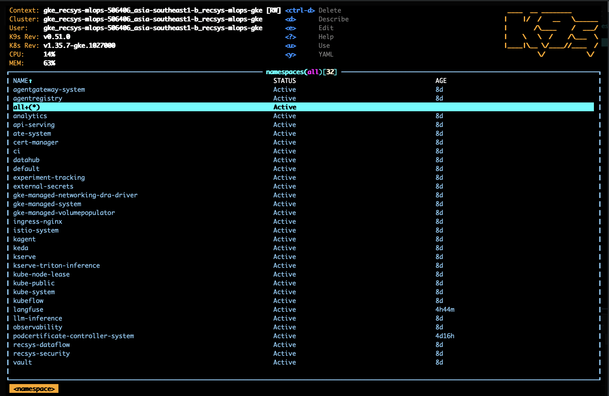
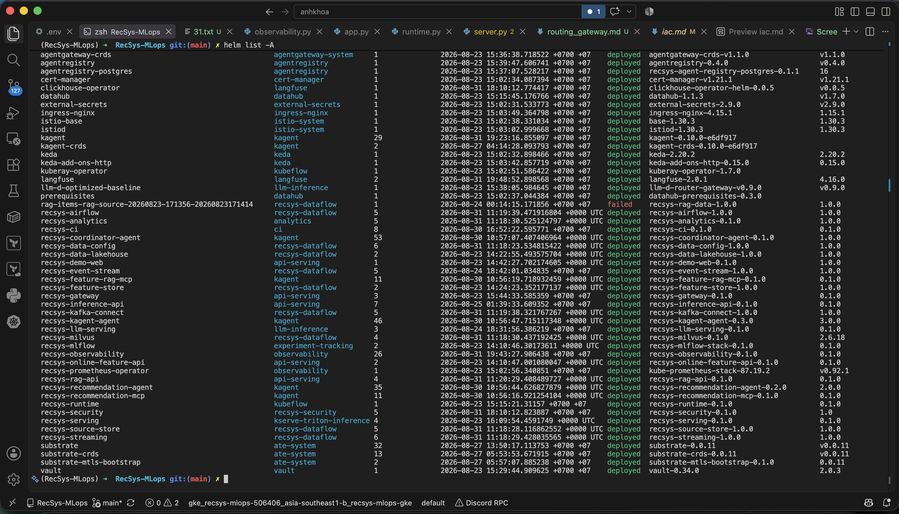

# Infrastructure as Code: Terraform setup GKE và LLM platform

Tài liệu này mô tả cách repository dùng Terraform để dựng hạ tầng GCP, tạo
GKE và bootstrap toàn bộ data/ML/LLM platform bằng Kubernetes và Helm. Phần
này chỉ dùng Terraform; Ansible và phương án deploy service lên VM không nằm
trong scope.

Source chính nằm tại
[`infra/terraform/gcp/`](../../../infra/terraform/gcp/README.md). Terraform
quản lý cả hai lớp:

- **Cloud layer:** Google APIs, VPC/subnet, Artifact Registry, GCS backup,
  service accounts, IAM, GKE cluster và node pools.
- **Cluster layer:** namespaces, platform operators, secrets, Vault, DataHub,
  data/ML services, LLM inference, kagent và Agent Registry.

## 1. Luồng setup tổng thể

```text
terraform.tfvars
        |
        v
root module (backend + providers + public inputs/outputs)
        |
        +--> project-services ------> bật Google APIs, logging policy
        |          |
        |          +--> network ----> VPC, subnet, Pod/Service CIDRs
        |          |
        |          +--> artifact-storage
        |                         ---> Artifact Registry, GCS backup buckets
        |
        +--> gke -------------------> cluster, IAM, Workload Identity,
        |                              CPU/ML/LLM/GPU node pools
        |                                      |
        |                                      v
        +--> Kubernetes + Helm providers ------+
                                               |
                                               v
                                  kubernetes-platform
                                  namespaces, operators, Vault,
                                  data/ML/LLM/agent workloads
```

Root module nối các module theo dependency trong
[`main.tf` (line 85)](../../../infra/terraform/gcp/main.tf#L85). Output
`required_service_ids` của `project-services` được truyền vào các module cloud
để Terraform biết API phải sẵn sàng trước khi tạo network, storage hoặc GKE.
Output endpoint và CA của `gke` được dùng để cấu hình Kubernetes/Helm provider,
sau đó mới chạy `kubernetes-platform`.

Đoạn orchestration rút gọn:

```hcl
module "project_services" {
  source = "./modules/project-services"
  config = local.module_config
}

module "network" {
  source          = "./modules/network"
  config          = local.module_config
  api_service_ids = module.project_services.required_service_ids
}

module "artifact_storage" {
  source          = "./modules/artifact-storage"
  config          = local.module_config
  api_service_ids = module.project_services.required_service_ids
}

module "gke" {
  source          = "./modules/gke"
  config          = local.module_config
  api_service_ids = module.project_services.required_service_ids
  project_number  = data.google_project.current.number
  network_id      = module.network.network_id
  subnetwork_id   = module.network.subnetwork_id
}

module "kubernetes_platform" {
  source    = "./modules/kubernetes-platform"
  config    = local.module_config
  helm_dir  = "${path.module}/../../helm"
  repo_root = "${path.module}/../../.."

  cluster = {
    id                 = module.gke.cluster_id
    name               = module.gke.cluster_name
    endpoint           = module.gke.cluster_endpoint
    cpu_node_pool_name = module.gke.cpu_node_pool_name
  }

  depends_on = [null_resource.cluster_credentials]
}
```

Source đầy đủ: [`main.tf`](../../../infra/terraform/gcp/main.tf).

## 2. Cách chia module

Root module chỉ giữ những thành phần tạo thành public contract của stack:
backend, provider configuration, variables, outputs, module composition,
credential bootstrap, import và state migration.

```text
infra/terraform/gcp/
├── versions.tf                 # Terraform, GCS backend, provider constraints
├── providers.tf                # Google, Google Beta, Kubernetes, Helm
├── variables.tf                # Public input contract
├── outputs.tf                  # Public outputs, re-export từ child modules
├── main.tf                     # Dependency graph và module composition
├── cluster_credentials.tf      # Lấy kubeconfig sau khi GKE sẵn sàng
├── imports.tf                  # Declarative import cho resource đã tồn tại
├── moved.tf                    # Legacy address -> module address
├── terraform.tfvars.example    # Deployment profile mẫu, không chứa secret thật
└── modules/
    ├── project-services/       # Google APIs và logging exclusion
    ├── network/                # VPC, subnet, Pod/Service secondary ranges
    ├── artifact-storage/       # Artifact Registry và GCS backup buckets
    ├── gke/                    # Cluster, node pools, service account và IAM
    └── kubernetes-platform/    # Kubernetes resources và Helm workloads
        ├── namespaces.tf
        ├── dependencies.tf     # cert-manager, KEDA, KubeRay, Istio...
        ├── secret_management.tf
        ├── vault.tf
        ├── recsys_services.tf  # data, ML, serving, gateway, observability
        ├── datahub.tf
        ├── llm_inference.tf
        ├── kagent.tf
        └── agent_registry.tf
```

Ranh giới module được chọn theo **lifecycle và ownership**, không chia một
module cho từng resource nhỏ:

| Module | Resource được quản lý | Lý do tách |
| --- | --- | --- |
| `project-services` | Required Google APIs và project logging exclusion | Là prerequisite chung cho mọi GCP resource khác. |
| `network` | Custom VPC, regional subnet, Pod CIDR, Service CIDR | Network có lifecycle độc lập và được GKE sử dụng qua outputs. |
| `artifact-storage` | Docker Artifact Registry, lake/model backup buckets | Storage có retention/lifecycle policy riêng, không phụ thuộc cluster runtime. |
| `gke` | Node service account, IAM, cluster, CPU/ML/LLM/GPU pools | Gom toàn bộ compute và cluster identity vào một boundary. |
| `kubernetes-platform` | Namespaces, CRDs/operators, Vault/secrets, Helm releases | Các resource này dùng chung Kubernetes/Helm providers và có dependency chặt trong cùng cluster. |

`kubernetes-platform` vẫn là một child module phẳng, nhưng được chia file theo
domain để tránh một `main.tf` lớn. Đây là phân tách nội bộ để code dễ đọc; nó
không tạo thêm module lồng nhau hoặc làm phức tạp resource address.

## 3. Backend, provider và public contract

### 3.1 Remote state trên GCS

Backend và provider version được khóa tại
[`versions.tf` (line 1)](../../../infra/terraform/gcp/versions.tf#L1):

```hcl
terraform {
  required_version = ">= 1.6.0"

  backend "gcs" {
    prefix = "terraform/gcp"
  }

  required_providers {
    google     = { source = "hashicorp/google",      version = "~> 5.45" }
    google-beta = { source = "hashicorp/google-beta", version = "~> 5.45" }
    helm       = { source = "hashicorp/helm",        version = "~> 2.16" }
    kubernetes = { source = "hashicorp/kubernetes",  version = "~> 2.33" }
    null       = { source = "hashicorp/null",        version = "~> 3.2" }
    random     = { source = "hashicorp/random",      version = "~> 3.6" }
  }
}
```

Tên bucket state được truyền lúc `terraform init`, không commit vào code. Prefix
`terraform/gcp` được giữ ổn định để refactor module không tạo state mới.

### 3.2 Kết nối Terraform với GKE

Google provider tạo cloud resources. Kubernetes và Helm providers nhận endpoint,
access token và CA trực tiếp từ GKE module trong
[`providers.tf` (line 19)](../../../infra/terraform/gcp/providers.tf#L19):

```hcl
provider "kubernetes" {
  host                   = "https://${module.gke.cluster_endpoint}"
  token                  = data.google_client_config.default.access_token
  cluster_ca_certificate = base64decode(module.gke.cluster_ca_certificate)
}

provider "helm" {
  kubernetes {
    host                   = "https://${module.gke.cluster_endpoint}"
    token                  = data.google_client_config.default.access_token
    cluster_ca_certificate = base64decode(module.gke.cluster_ca_certificate)
  }
}
```

Nhờ vậy, cùng một `terraform apply` có thể dựng cloud layer rồi deploy cluster
layer; không cần duy trì Kubernetes manifests bằng các lệnh `kubectl apply`
rời rạc.

### 3.3 Inputs và outputs

Toàn bộ input công khai tiếp tục nằm ở
[`variables.tf`](../../../infra/terraform/gcp/variables.tf). Các nhóm input
chính gồm:

- project, region, zone, resource prefix và labels;
- VPC/Pod/Service CIDRs;
- machine type, disk, autoscaling và Spot policy cho từng node pool;
- image repository/tag/overrides;
- version và feature toggle cho KFP, KServe, gateway, DataHub, Vault, LLM,
  kagent và Agent Registry.

Ví dụ profile triển khai tiết kiệm chi phí từ
[`terraform.tfvars.example`](../../../infra/terraform/gcp/terraform.tfvars.example):

```hcl
project_id = "your-gcp-project-id"
region     = "asia-southeast1"
zone       = "asia-southeast1-b"

cpu_machine_type = "e2-standard-8"
cpu_min_nodes    = 2
cpu_max_nodes    = 2
cpu_spot         = false

ml_machine_type = "e2-standard-4"
ml_min_nodes    = 1
ml_max_nodes    = 1
ml_spot         = false

llm_node_pool_mode       = "cpu-services-shared"
llm_optimization_profile = "baseline"
enable_gpu_pool          = false

deploy_llm_inference = false
deploy_agent_registry = false
deploy_service_mesh   = true
deploy_vault          = false
```

Root re-export các output quan trọng để interface sử dụng không đổi:
cluster name/location, Artifact Registry, backup buckets, lệnh lấy credentials,
compute placement, Agent Registry và Vault endpoint. Xem
[`outputs.tf`](../../../infra/terraform/gcp/outputs.tf).

## 4. Chi tiết từng module

### 4.1 `project-services`: chuẩn bị GCP project

Module bật các API cần thiết trước khi resource phụ thuộc được tạo. Danh sách
hiện tại gồm Artifact Registry, KMS, Resource Manager, Compute, Container, IAM,
Logging và Monitoring:

```hcl
resource "google_project_service" "required" {
  for_each = toset([
    "artifactregistry.googleapis.com",
    "cloudkms.googleapis.com",
    "cloudresourcemanager.googleapis.com",
    "compute.googleapis.com",
    "container.googleapis.com",
    "iam.googleapis.com",
    "logging.googleapis.com",
    "monitoring.googleapis.com",
  ])

  project            = var.config.project_id
  service            = each.key
  disable_on_destroy = false
}
```

Source: [`modules/project-services/apis.tf`](../../../infra/terraform/gcp/modules/project-services/apis.tf).
Module còn quản lý logging exclusion tại
[`logging.tf`](../../../infra/terraform/gcp/modules/project-services/logging.tf)
và export API IDs tại
[`outputs.tf`](../../../infra/terraform/gcp/modules/project-services/outputs.tf).

### 4.2 `network`: VPC-native GKE networking

Terraform tạo custom-mode VPC và subnet có hai secondary ranges dành riêng cho
Pod và Service:

```hcl
resource "google_compute_network" "recsys" {
  name                    = "${var.config.name_prefix}-vpc"
  auto_create_subnetworks = false
  routing_mode            = "REGIONAL"
}

resource "google_compute_subnetwork" "gke" {
  name          = "${var.config.name_prefix}-gke"
  ip_cidr_range = var.config.vpc_cidr
  region        = var.config.region
  network       = google_compute_network.recsys.id

  secondary_ip_range {
    range_name    = "${var.config.name_prefix}-pods"
    ip_cidr_range = var.config.pods_cidr
  }

  secondary_ip_range {
    range_name    = "${var.config.name_prefix}-services"
    ip_cidr_range = var.config.services_cidr
  }
}
```

Source: [`modules/network/main.tf`](../../../infra/terraform/gcp/modules/network/main.tf).

### 4.3 `artifact-storage`: image registry và backup

Module tạo một Docker repository và hai GCS buckets. Bucket không bật
`force_destroy`; lake backup hết hạn sau 30 ngày và model backup sau 60 ngày:

```hcl
resource "google_artifact_registry_repository" "docker" {
  location      = var.config.region
  repository_id = var.config.artifact_registry_repository
  format        = "DOCKER"
  labels        = var.config.labels
}

resource "google_storage_bucket" "model_backup" {
  name                        = "${replace(lower("${var.config.project_id}-${var.config.name_prefix}"), "_", "-")}-model-backup"
  location                    = var.config.region
  uniform_bucket_level_access = true
  force_destroy               = false

  lifecycle_rule {
    action {
      type = "Delete"
    }

    condition {
      age = 60
    }
  }
}
```

Source: [`modules/artifact-storage/main.tf`](../../../infra/terraform/gcp/modules/artifact-storage/main.tf).

### 4.4 `gke`: cluster, identity và node pools

Cluster dùng VPC-native IP allocation, Workload Identity, GKE logging/monitoring,
HPA và Persistent Disk CSI. Default node pool bị xóa để các node pool có mục
đích rõ ràng được Terraform quản lý riêng:

```hcl
resource "google_container_cluster" "recsys" {
  provider = google-beta

  name                     = "${var.config.name_prefix}-gke"
  location                 = var.config.zone
  remove_default_node_pool = true
  initial_node_count       = 1
  deletion_protection      = var.config.deletion_protection
  network                  = var.network_id
  subnetwork               = var.subnetwork_id

  workload_identity_config {
    workload_pool = "${var.config.project_id}.svc.id.goog"
  }

  ip_allocation_policy {
    cluster_secondary_range_name  = "${var.config.name_prefix}-pods"
    services_secondary_range_name = "${var.config.name_prefix}-services"
  }

  addons_config {
    http_load_balancing {
      disabled = false
    }

    horizontal_pod_autoscaling {
      disabled = false
    }

    gce_persistent_disk_csi_driver_config {
      enabled = true
    }
  }
}
```

Source cluster: [`modules/gke/main.tf` (line 52)](../../../infra/terraform/gcp/modules/gke/main.tf#L52).

Các node pool dùng autoscaling, auto-repair/auto-upgrade, COS Containerd và
Workload Identity metadata. CPU pool phục vụ data/platform services; ML pool
có label/taint để tách training và serving; LLM/GPU pools được tạo có điều kiện:

```hcl
resource "google_container_node_pool" "llm_cpu" {
  count = (
    var.config.deploy_llm_inference &&
    var.config.llm_node_pool_mode == "dedicated"
  ) ? 1 : 0

  autoscaling {
    min_node_count = var.config.llm_cpu_min_nodes
    max_node_count = var.config.llm_cpu_max_nodes
  }

  node_config {
    machine_type    = var.config.llm_cpu_machine_type
    service_account = google_service_account.gke_nodes.email

    labels = merge(var.config.labels, {
      "recsys.ai/pool"     = "llm-cpu"
      "recsys.ai/workload" = "llm-inference"
    })

    taint {
      key    = "recsys.ai/workload"
      value  = "llm-inference"
      effect = "NO_SCHEDULE"
    }
  }
}
```

Source node pools: [`modules/gke/main.tf` (line 134)](../../../infra/terraform/gcp/modules/gke/main.tf#L134).
Cluster endpoint/CA được đánh dấu sensitive trong
[`modules/gke/outputs.tf`](../../../infra/terraform/gcp/modules/gke/outputs.tf).

### 4.5 `kubernetes-platform`: deploy service bằng Helm

Root truyền `helm_dir` và `repo_root` vào module thay vì để module con tự tính
đường dẫn tương đối. Contract này được định nghĩa tại
[`variables.tf` (line 6)](../../../infra/terraform/gcp/modules/kubernetes-platform/variables.tf#L6).

Các file domain chính:

| File | Trách nhiệm |
| --- | --- |
| [`namespaces.tf`](../../../infra/terraform/gcp/modules/kubernetes-platform/namespaces.tf) | Tạo namespace và Istio injection labels. |
| [`dependencies.tf`](../../../infra/terraform/gcp/modules/kubernetes-platform/dependencies.tf) | cert-manager, KEDA/KEDA HTTP, External Secrets, KubeRay, Prometheus Operator, Istio và ingress. |
| [`secret_management.tf`](../../../infra/terraform/gcp/modules/kubernetes-platform/secret_management.tf) | Central secrets và readiness ordering. |
| [`vault.tf`](../../../infra/terraform/gcp/modules/kubernetes-platform/vault.tf) | KMS auto-unseal, Workload Identity và Helm release Vault. |
| [`recsys_services.tf`](../../../infra/terraform/gcp/modules/kubernetes-platform/recsys_services.tf) | Observability, MLflow, data platform, APIs, model serving, Ray, gateway và security. |
| [`datahub.tf`](../../../infra/terraform/gcp/modules/kubernetes-platform/datahub.tf) | DataHub prerequisites và DataHub. |
| [`llm_inference.tf`](../../../infra/terraform/gcp/modules/kubernetes-platform/llm_inference.tf) | Gateway API/GAIE, agentgateway, llama.cpp serving và llm-d router. |
| [`kagent.tf`](../../../infra/terraform/gcp/modules/kubernetes-platform/kagent.tf) | Substrate, kagent, sandbox pools và RBAC. |
| [`agent_registry.tf`](../../../infra/terraform/gcp/modules/kubernetes-platform/agent_registry.tf) | Registry PostgreSQL và Agent Registry. |

Ví dụ Terraform deploy chart local từ repository:

```hcl
resource "helm_release" "recsys_observability" {
  name      = "recsys-observability"
  chart     = "${local.helm_dir}/recsys-observability"
  namespace = "observability"
  wait      = true
  timeout   = 900

  values = [
    file("${local.helm_dir}/recsys-observability/values-gcp.yaml"),
  ]

  depends_on = [
    null_resource.recsys_external_secrets_ready,
    kubernetes_namespace.observability,
    helm_release.prometheus_operator,
  ]
}
```

Source: [`recsys_services.tf` (line 1)](../../../infra/terraform/gcp/modules/kubernetes-platform/recsys_services.tf#L1).

Ví dụ LLM deployment chọn values theo placement và optimization profile:

```hcl
resource "helm_release" "recsys_llm_serving" {
  count     = var.config.deploy_llm_inference ? 1 : 0
  name      = "recsys-llm-serving"
  chart     = "${local.helm_dir}/recsys-llm-serving"
  namespace = kubernetes_namespace.llm_inference[0].metadata[0].name

  values = [
    file(
      var.config.llm_node_pool_mode == "cpu-services-shared"
      ? "${local.helm_dir}/recsys-llm-serving/values-cpu-shared.yaml"
      : "${local.helm_dir}/recsys-llm-serving/values-gcp.yaml"
    ),
    file(
      var.config.llm_optimization_profile == "optimized"
      ? "${local.helm_dir}/recsys-llm-serving/values-optimized.yaml"
      : "${local.helm_dir}/recsys-llm-serving/values-baseline.yaml"
    ),
  ]
}
```

Source: [`llm_inference.tf` (line 70)](../../../infra/terraform/gcp/modules/kubernetes-platform/llm_inference.tf#L70).

Một số application releases có `lifecycle { ignore_changes = all }`. Terraform
bootstrap release ban đầu, sau đó Jenkins sở hữu runtime image/digest và rollout.
Cách phân quyền này ngăn một lần apply hạ tầng vô tình rollback image đã được
CI/CD deploy. Ví dụ tại
[`recsys_services.tf` (line 56)](../../../infra/terraform/gcp/modules/kubernetes-platform/recsys_services.tf#L56).

## 5. Cách chạy Terraform

### 5.1 Prerequisites

- Terraform `>= 1.6`, `gcloud`, `kubectl` và Helm.
- GCP project đã bật billing và có quota phù hợp với machine/GPU profile.
- Một GCS bucket dùng làm remote state.
- Google Application Default Credentials hoặc service account có quyền quản lý
  các resource trong scope.
- Container images phải tồn tại trong Artifact Registry trước khi application
  Pods rollout thành công.

Không commit `terraform.tfvars`, credentials, generated plan hoặc state file.

### 5.2 Tạo configuration

```bash
cp infra/terraform/gcp/terraform.tfvars.example \
  infra/terraform/gcp/terraform.tfvars

$EDITOR infra/terraform/gcp/terraform.tfvars
```

Các giá trị tối thiểu cần kiểm tra là `project_id`, `region`, `zone`, node
sizing và các `deploy_*` feature toggles. Nếu dùng public GKE endpoint, giới hạn
`master_authorized_cidr_blocks` thay vì mở rộng cho toàn Internet.

### 5.3 Init, validate, plan và apply

```bash
terraform -chdir=infra/terraform/gcp init \
  -backend-config="bucket=<GCS_STATE_BUCKET>"

terraform -chdir=infra/terraform/gcp fmt -check -recursive
terraform -chdir=infra/terraform/gcp validate

terraform -chdir=infra/terraform/gcp plan \
  -out=tfplan

terraform -chdir=infra/terraform/gcp apply tfplan
```

Luôn apply đúng saved plan đã review. Không chạy `apply -auto-approve` cho state
production.

Repository còn có wrapper
[`ops/gcp/terraform_gcp.sh`](../../../ops/gcp/terraform_gcp.sh) để kiểm tra active
GCP account/project và đặt credential/`TF_DATA_DIR` trước khi gọi Terraform:

```bash
GCP_PROJECT_ID=<project-id> \
GCP_ACCOUNT=<gcp-account> \
ops/gcp/terraform_gcp.sh \
  -chdir=infra/terraform/gcp plan -out=tfplan
```

### 5.4 Lấy kubeconfig và verify

```bash
terraform -chdir=infra/terraform/gcp \
  output -raw kubectl_get_credentials_command | bash

gcloud container clusters describe recsys-mlops-gke \
  --zone asia-southeast1-b \
  --project <project-id> \
  --format='value(status)'

gcloud container node-pools list \
  --cluster recsys-mlops-gke \
  --zone asia-southeast1-b \
  --project <project-id>

kubectl get nodes
helm list -A
ops/validation/verify_gcp_stack.sh live
```

Static verification có thể chạy trước khi truy cập cluster:

```bash
ops/validation/verify_gcp_stack.sh static
```

Script verification nằm tại
[`ops/validation/verify_gcp_stack.sh`](../../../ops/validation/verify_gcp_stack.sh).

## 6. Refactor module mà không recreate hạ tầng

Stack trước đây đặt resource trực tiếp ở root module. Refactor giữ nguyên tên,
arguments, lifecycle rules và remote state, chỉ đổi Terraform address sang
child modules. Mỗi resource được map bằng declarative `moved` block trong
[`moved.tf`](../../../infra/terraform/gcp/moved.tf):

```hcl
moved {
  from = google_container_cluster.recsys
  to   = module.gke.google_container_cluster.recsys
}

moved {
  from = google_container_node_pool.cpu
  to   = module.gke.google_container_node_pool.cpu
}

moved {
  from = helm_release.kagent
  to   = module.kubernetes_platform.helm_release.kagent
}
```

Repository hiện giữ **103 `moved` blocks**. Các block này cần được giữ lâu dài
cho tới khi mọi state dùng layout cũ đã migrate; không thay thế bằng thao tác
`terraform state mv` thủ công.

Quy trình migration an toàn:

1. Chạy baseline `validate` và live plan trên code cũ; dừng nếu có drift ngoài
   scope.
2. Backup `terraform state pull` ra vị trí an toàn ngoài repository và lưu danh
   sách address.
3. Review toàn bộ `moved` mappings.
4. Tạo saved migration plan và kiểm tra JSON plan không có `create`, `update`,
   `delete` hoặc `replace` remote resource.
5. Apply đúng saved plan.
6. Chạy lại `plan -detailed-exitcode`; exit code `0` mới là converged, `2` nghĩa
   là vẫn còn diff cần review, `1` là lỗi.

Migration module ngày 2026-08-31 đã ghi nhận:

```text
Apply complete! Resources: 0 added, 0 changed, 0 destroyed.
```

Sau migration, remote objects không bị recreate. Plan thường sau đó còn các
config drift đã tồn tại từ trước nên không được apply lẫn vào migration state;
đây là lý do migration dùng saved refresh-only plan đã review.

## 7. Checklist acceptance

```bash
terraform -chdir=infra/terraform/gcp fmt -check -recursive
terraform -chdir=infra/terraform/gcp validate
terraform -chdir=infra/terraform/gcp plan -detailed-exitcode
ops/validation/verify_gcp_stack.sh static
ops/validation/verify_gcp_stack.sh live
```

Acceptance criteria:

- Terraform format và validation pass.
- Migration infrastructure delta là `0 added, 0 changed, 0 destroyed`.
- Convergence plan có exit code `0` sau khi các diff hợp lệ đã được xử lý riêng.
- GKE cluster ở trạng thái `RUNNING`.
- Tất cả node pools dự kiến tồn tại và Kubernetes nodes ở trạng thái `Ready`.
- Các Helm releases chính có trạng thái `deployed`.
- Static và live stack verification đều pass.

Kết quả live được xác nhận cùng đợt migration:

```text
GKE cluster: recsys-mlops-gke  RUNNING  asia-southeast1-b
Node pools:  recsys-mlops-cpu, recsys-mlops-ml-system  RUNNING
Nodes:       3/3 Ready
Terraform:   configuration valid
Stack:       Live verification passed
```

### All Services' Namespaces up and running on GCP

```bash
kubectl get namespaces
```



**Figure: GKE namespace proof.** K9s đang kết nối tới cluster
`recsys-mlops-gke` của project `recsys-mlops-506406`. Capture thể hiện 32
namespace, bao gồm `api-serving`, `recsys-dataflow`, `experiment-tracking`,
`observability`, `llm-inference`, `kagent`, `agentregistry`, `langfuse`,
`datahub`, `vault` và các namespace của GKE control plane, đều ở trạng thái
`Active`.

### Helm Release Proof

```bash
helm list -A
```



**Figure: Helm deployment proof.** Các release nền tảng dài hạn chính được
Terraform/Helm quản lý đang ở trạng thái `deployed`, gồm agentgateway, Agent
Registry, cert-manager, DataHub, External Secrets, Istio, kagent, KEDA,
KubeRay, Langfuse, llm-d, RecSys data/ML/API/observability releases, Substrate
và Vault. Capture cũng ghi nhận một release one-shot lịch sử
`rag-items-rag-source-20260823-171356-20260823171414` ở trạng thái `failed`;
release batch này không được tính là bằng chứng convergence của các service
dài hạn và cần được xử lý hoặc giải thích riêng nếu dùng trong acceptance tổng
thể.

## 8. Code reference nhanh

| Nội dung | Source code |
| --- | --- |
| Backend và provider constraints | [`versions.tf`](../../../infra/terraform/gcp/versions.tf) |
| Google/Kubernetes/Helm provider wiring | [`providers.tf`](../../../infra/terraform/gcp/providers.tf) |
| Module composition | [`main.tf`](../../../infra/terraform/gcp/main.tf) |
| Input contract và defaults | [`variables.tf`](../../../infra/terraform/gcp/variables.tf) |
| Output contract | [`outputs.tf`](../../../infra/terraform/gcp/outputs.tf) |
| GKE credential bootstrap | [`cluster_credentials.tf`](../../../infra/terraform/gcp/cluster_credentials.tf) |
| Existing-resource import | [`imports.tf`](../../../infra/terraform/gcp/imports.tf) |
| State address migration | [`moved.tf`](../../../infra/terraform/gcp/moved.tf) |
| Google APIs | [`modules/project-services/apis.tf`](../../../infra/terraform/gcp/modules/project-services/apis.tf) |
| VPC và subnet | [`modules/network/main.tf`](../../../infra/terraform/gcp/modules/network/main.tf) |
| Artifact Registry và GCS | [`modules/artifact-storage/main.tf`](../../../infra/terraform/gcp/modules/artifact-storage/main.tf) |
| GKE và node pools | [`modules/gke/main.tf`](../../../infra/terraform/gcp/modules/gke/main.tf) |
| Platform dependencies | [`modules/kubernetes-platform/dependencies.tf`](../../../infra/terraform/gcp/modules/kubernetes-platform/dependencies.tf) |
| Data/ML/serving releases | [`modules/kubernetes-platform/recsys_services.tf`](../../../infra/terraform/gcp/modules/kubernetes-platform/recsys_services.tf) |
| LLM inference | [`modules/kubernetes-platform/llm_inference.tf`](../../../infra/terraform/gcp/modules/kubernetes-platform/llm_inference.tf) |
| kagent/Substrate | [`modules/kubernetes-platform/kagent.tf`](../../../infra/terraform/gcp/modules/kubernetes-platform/kagent.tf) |
| Agent Registry | [`modules/kubernetes-platform/agent_registry.tf`](../../../infra/terraform/gcp/modules/kubernetes-platform/agent_registry.tf) |
| Deployment runbook | [`infra/terraform/gcp/README.md`](../../../infra/terraform/gcp/README.md) |

Thiết kế này giữ root module nhỏ và interface ổn định, trong khi resource được
đặt vào module theo đúng boundary kiến trúc. Kết quả là người đọc có thể tìm
nhanh phần cloud, compute hoặc workload cần thay đổi mà không phải sửa một file
Terraform root hàng nghìn dòng.
