# LLM Inference Platform: Deployment, Custom Model Serving, and Load-Aware Optimization

This document describes the repository-owned deployment of a CPU-only LLM
inference platform on GKE. It shows exactly where each component is configured,
where Helm downloads upstream charts, how the GGUF model is downloaded, and how
the platform is benchmarked before and after routing optimization.

The active deployment is:

- GCP project: `recsys-mlops`.
- Namespace: `llm-inference`.
- Runtime: `llama.cpp` HTTP server.
- Model: `ggml-org/Qwen3.5-0.8B-GGUF:Q4_0`.
- Replicas: `2`.
- Placement: existing `recsys-mlops-cpu` node pool (`n2-standard-8`).
- Gateway: agentgateway with llm-d Router Gateway.
- Historical baseline treatment: unoptimized direct-Service routing and the
  router's `random-picker` profile.
- Active treatment: load-aware scheduling using
  `inflight-load-producer` and `token-load-scorer`.
- Prefix-aware scheduling: intentionally disabled in both treatments because
  this deployment uses llama.cpp rather than the vLLM prefix-cache integration.

## Part I — LLM Platform Deployment and Custom Model Serving

### 1. Select the active deployment profile

The deployment switch is stored in
[`infra/terraform/gcp/terraform.tfvars`](../../../infra/terraform/gcp/terraform.tfvars):

```hcl
llm_node_pool_mode       = "cpu-services-shared"
llm_optimization_profile = "optimized"
deploy_llm_inference     = true
```

`cpu-services-shared` means that Terraform does not create the optional
`recsys-mlops-llm-cpu` node pool. The model Pods instead use the existing
`recsys-mlops-cpu` pool. `optimized` selects the load-aware router configuration.

The accepted values and their validation are defined in
[`infra/terraform/gcp/variables.tf`](../../../infra/terraform/gcp/variables.tf):

```hcl
variable "llm_node_pool_mode" {
  type    = string
  default = "dedicated"

  validation {
    condition = contains(
      ["dedicated", "cpu-services-shared"],
      var.llm_node_pool_mode
    )
  }
}

variable "llm_optimization_profile" {
  type    = string
  default = "baseline"

  validation {
    condition = contains(
      ["baseline", "optimized"],
      var.llm_optimization_profile
    )
  }
}
```

### 2. Understand the repository deployment flow

The complete ownership flow is:

```text
terraform.tfvars
  -> Terraform Kubernetes and Helm providers
  -> llm-inference namespace
  -> Gateway API and GAIE CRDs
  -> agentgateway CRDs and controller
  -> local recsys-llm-serving Helm chart
       -> two llama.cpp model-server Pods
       -> model Service
       -> LLM Gateway instance
  -> upstream llm-d-router-gateway Helm chart
       -> Endpoint Picker
       -> InferencePool
       -> HTTPRoute
```

Terraform connects Helm directly to the GKE endpoint in
[`infra/terraform/gcp/providers.tf`](../../../infra/terraform/gcp/providers.tf).
Therefore, a Terraform apply is the deployment interface; the model Deployment,
Service, Gateway, router, and route are not maintained with ad-hoc
`kubectl apply` commands.

The main orchestration file is
[`infra/terraform/gcp/llm_inference.tf`](../../../infra/terraform/gcp/llm_inference.tf).

### 3. Identify local and downloaded artifacts

Repository-owned files:

```text
infra/terraform/gcp/llm_inference.tf
infra/terraform/gcp/terraform.tfvars
infra/helm/recsys-llm-serving/
  Chart.yaml
  values.yaml
  values-cpu-shared.yaml
  values-baseline.yaml
  values-optimized.yaml
  templates/deployment.yaml
  templates/service.yaml
  templates/gateway.yaml
configs/llm-d/
  agentgateway-values.yaml
  router-llama-cpp-cpu-baseline-values.yaml
  router-llama-cpp-cpu-optimized-values.yaml
ops/gcp/install_llm_gateway_crds.sh
ops/validation/llm_inference_smoke.sh
ops/validation/llm_inference_benchmark.sh
```

Downloaded artifacts and the code that requests them:

| Artifact | Source configuration | Downloaded by | Upstream source |
|---|---|---|---|
| Gateway API CRDs | `install_llm_gateway_crds.sh` | Terraform `local-exec` | GitHub release manifest |
| GAIE CRDs | `install_llm_gateway_crds.sh` | Terraform `local-exec` | GitHub release manifest |
| agentgateway charts | `helm_release.agentgateway*` | Terraform Helm provider | `oci://cr.agentgateway.dev/charts` |
| llm-d router chart | `helm_release.llm_d_router` | Terraform Helm provider | `oci://ghcr.io/llm-d/charts` |
| llama.cpp image | local model chart values | GKE containerd | `ghcr.io/ggml-org/llama.cpp` |
| Qwen GGUF file | `model.repository` and `model.quantization` | `llama-server --hf-repo` | Hugging Face |

### 4. Install Gateway API and GAIE CRDs

Terraform invokes
[`ops/gcp/install_llm_gateway_crds.sh`](../../../ops/gcp/install_llm_gateway_crds.sh)
from `null_resource.llm_gateway_api_crds` in
[`llm_inference.tf`](../../../infra/terraform/gcp/llm_inference.tf):

```hcl
provisioner "local-exec" {
  command = "bash ${path.module}/../../../ops/gcp/install_llm_gateway_crds.sh"
  environment = {
    GATEWAY_API_VERSION = var.gateway_api_version
    GAIE_VERSION        = var.gateway_api_inference_extension_version
  }
}
```

The script resolves the pinned versions into these URLs:

```bash
GATEWAY_API_URL="https://github.com/kubernetes-sigs/gateway-api/releases/download/${GATEWAY_API_VERSION}/standard-install.yaml"
GAIE_URL="https://github.com/kubernetes-sigs/gateway-api-inference-extension/releases/download/${GAIE_VERSION}/v1-manifests.yaml"
```

This is the only bootstrap step that uses `kubectl apply`, because CRDs must
exist before Helm can create agentgateway and inference resources. The platform
workloads themselves remain Terraform/Helm-managed.

#### Image proof

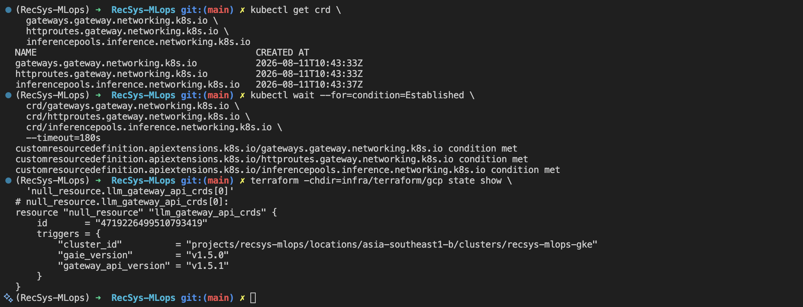

*Image note:* The terminal lists the `Gateway`, `HTTPRoute`, and
`InferencePool` CRDs and shows `condition met` for all three establishment
checks. The Terraform state shown in the same capture records Gateway API
`v1.5.1` and GAIE `v1.5.0`, proving that the pinned CRD bootstrap completed.

Internet references:

- [Kubernetes Gateway API releases](https://github.com/kubernetes-sigs/gateway-api/releases).
- [Gateway API Inference Extension releases](https://github.com/kubernetes-sigs/gateway-api-inference-extension/releases).

### 5. Install the agentgateway controller and GatewayClass

This step installs the controller infrastructure. It does not yet create the
application Gateway instance.

Terraform downloads two OCI charts in
[`llm_inference.tf`](../../../infra/terraform/gcp/llm_inference.tf):

```hcl
resource "helm_release" "agentgateway_crds" {
  repository = "oci://cr.agentgateway.dev/charts"
  chart      = "agentgateway-crds"
  version    = var.agentgateway_version
  namespace  = "agentgateway-system"
}

resource "helm_release" "agentgateway" {
  repository = "oci://cr.agentgateway.dev/charts"
  chart      = "agentgateway"
  version    = var.agentgateway_version
  namespace  = "agentgateway-system"
  values = [
    file("${path.module}/../../../configs/llm-d/agentgateway-values.yaml"),
  ]
}
```

#### Image proof

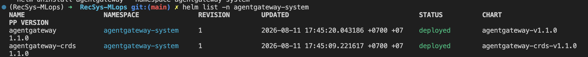

*Image note:* Both `agentgateway` and `agentgateway-crds` appear in the
`agentgateway-system` namespace with status `deployed`. The capture also shows
the pinned chart version `v1.1.0`.

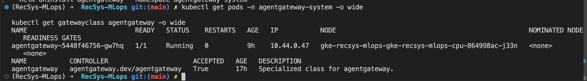

*Image note:* The controller Pod is `1/1 Running` with zero restarts, and the
`agentgateway` `GatewayClass` has `Accepted=True`. This proves that the
controller is operational and can reconcile Gateway resources.

Internet reference:

- [agentgateway installation for llm-d](https://llm-d.ai/docs/infrastructure/gateway/agentgateway#step-2-install-agentgateway).

### 6. Create the LLM Gateway instance

This step creates one application Gateway from the already installed
`agentgateway` GatewayClass. The source is
[`templates/gateway.yaml`](../../../infra/helm/recsys-llm-serving/templates/gateway.yaml):

```yaml
apiVersion: gateway.networking.k8s.io/v1
kind: Gateway
metadata:
  name: llm-d-inference-gateway
spec:
  gatewayClassName: agentgateway
  listeners:
    - name: http
      protocol: HTTP
      port: 80
```

The distinction is:

- Section 5 installs the shared controller and `GatewayClass`.
- Section 6 creates the concrete `llm-d-inference-gateway` used by this model.

The repository also attaches a strict API-key policy to the entire Gateway:

**Source:** [`gateway-auth.yaml`](../../../infra/helm/recsys-llm-serving/templates/gateway-auth.yaml).

```yaml
apiVersion: agentgateway.dev/v1alpha1
kind: AgentgatewayPolicy
metadata:
  name: llm-d-inference-gateway-api-key
spec:
  targetRefs:
    - group: gateway.networking.k8s.io
      kind: Gateway
      name: llm-d-inference-gateway
  traffic:
    phase: PreRouting
    apiKeyAuthentication:
      mode: Strict
      secretRef:
        name: agentgateway-api-keys
```

`PreRouting` applies authentication before route selection. A missing or invalid
`Authorization: Bearer ...` credential returns HTTP `401`; only a key contained
in `llm-inference/agentgateway-api-keys` is forwarded to llm-d. External Secrets
Operator reconciles that Secret from Vault KV v2 path `recsys/agent-gateway`.
The same Vault record is synced to `kagent/kagent-agent-gateway`, which supplies
the client credential referenced by the global `ModelConfig`.

The executable proof is [`llm_inference_smoke.sh`](../../../ops/validation/llm_inference_smoke.sh):
it asserts that both a missing key and an invalid key return `401`, then reads
the namespace-local Secret and verifies that an authenticated completion succeeds.

Internet reference:

- [agentgateway 1.1 API-key authentication](https://agentgateway.dev/docs/kubernetes/1.1.x/security/extauth/apikey/).

#### Image proof

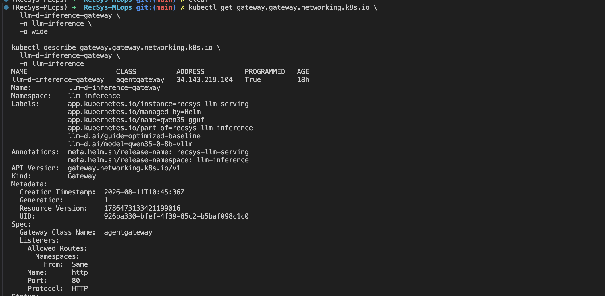

*Image note:* `llm-d-inference-gateway` uses the `agentgateway` class, exposes
HTTP port 80 at `34.143.219.104`, and reports `PROGRAMMED=True`. This capture is
used only as Gateway infrastructure evidence; it predates the runtime migration,
whose current llama.cpp/GGUF evidence is shown in Sections 7 and 8.

### 7. Configure the llama.cpp model-server Helm chart

Terraform installs the repository-local chart in
[`llm_inference.tf`](../../../infra/terraform/gcp/llm_inference.tf):

```hcl
resource "helm_release" "recsys_llm_serving" {
  name      = "recsys-llm-serving"
  chart     = "${local.helm_dir}/recsys-llm-serving"
  namespace = kubernetes_namespace.llm_inference[0].metadata[0].name

  values = [
    file(
      var.llm_node_pool_mode == "cpu-services-shared"
      ? "${local.helm_dir}/recsys-llm-serving/values-cpu-shared.yaml"
      : "${local.helm_dir}/recsys-llm-serving/values-gcp.yaml"
    ),
    file(
      var.llm_optimization_profile == "optimized"
      ? "${local.helm_dir}/recsys-llm-serving/values-optimized.yaml"
      : "${local.helm_dir}/recsys-llm-serving/values-baseline.yaml"
    ),
  ]
}
```

The active runtime values are in
[`values-cpu-shared.yaml`](../../../infra/helm/recsys-llm-serving/values-cpu-shared.yaml):

```yaml
replicaCount: 2

image:
  repository: ghcr.io/ggml-org/llama.cpp
  tag: server
  digest: sha256:9b518883e8faab479650ec802e02c9e37c6bb21d36168509efd8fb3c87fc1648
```

The digest pins the exact multi-platform image manifest used during this
deployment instead of allowing the mutable `server` tag to change silently.

#### Image proof

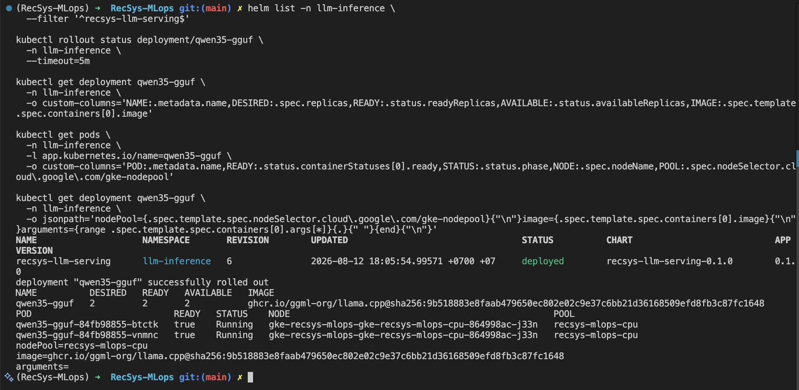

*Image note:* The `recsys-llm-serving` Helm release is `deployed`, and the
`qwen35-gguf` Deployment completed its rollout with two desired, ready, and
available replicas. Both Pods are `Running` on `recsys-mlops-cpu` and use the
same digest-pinned `ghcr.io/ggml-org/llama.cpp` image. This proves that the
repository-local Helm chart deployed the current CPU runtime and replica count.

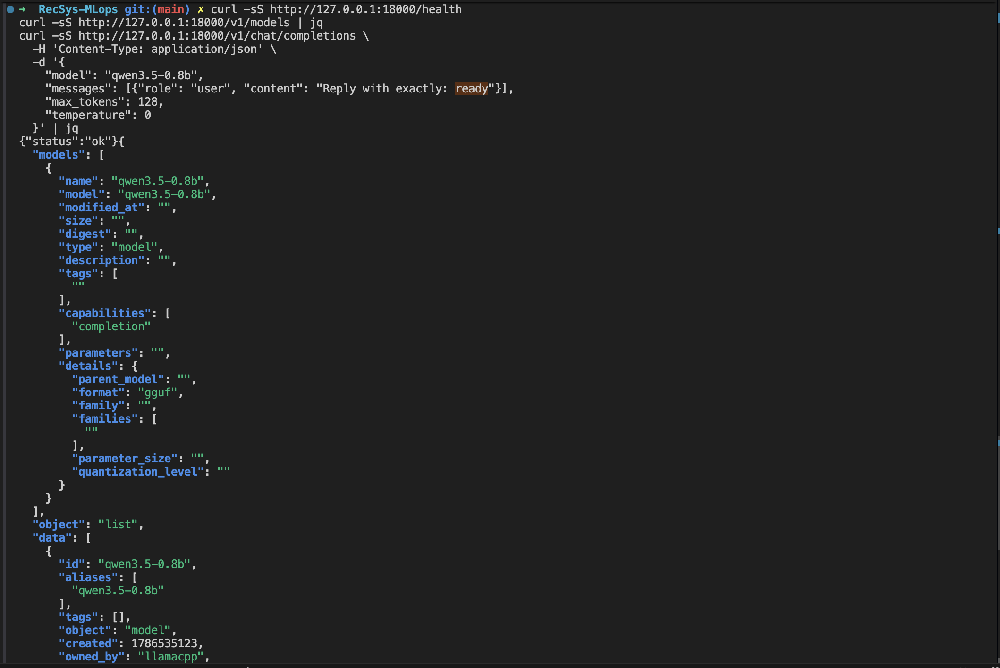

*Image note:* The deployed service returns `{"status":"ok"}` from `/health`.
Its OpenAI-compatible `/v1/models` response exposes model alias
`qwen3.5-0.8b`, format `gguf`, and owner `llamacpp`, proving that the Helm
release started the intended runtime rather than the former vLLM server.

Internet references:

- [llama.cpp Docker images](https://github.com/ggml-org/llama.cpp/blob/master/docs/docker.md).
- [Terraform Helm release resource](https://registry.terraform.io/providers/hashicorp/helm/latest/docs/resources/release).

### 8. Download and serve the Qwen GGUF model

The model choice is explicit in
[`values-cpu-shared.yaml`](../../../infra/helm/recsys-llm-serving/values-cpu-shared.yaml):

```yaml
model:
  repository: ggml-org/Qwen3.5-0.8B-GGUF
  quantization: Q4_0
  alias: qwen3.5-0.8b
  contextSize: 16384
  parallel: 1
  threads: 2
  threadsBatch: 2
  batchSize: 512
  ubatchSize: 128
  disableMultimodal: true
  metrics: true
```

[`templates/deployment.yaml`](../../../infra/helm/recsys-llm-serving/templates/deployment.yaml)
converts these values to the container arguments:

```text
--hf-repo ggml-org/Qwen3.5-0.8B-GGUF:Q4_0
--alias qwen3.5-0.8b
--host 0.0.0.0
--port 8000
--ctx-size 16384
--n-predict 768
--reasoning-budget 256
--reasoning-budget-message "Reasoning budget reached. Call the required tool or answer now."
--parallel 1
--threads 2
--threads-batch 2
--batch-size 512
--ubatch-size 128
--no-mmproj
--metrics
```

On first startup, each Pod downloads the `Q4_0` GGUF artifact from Hugging Face
into `/root/.cache`. Q4_0 is approximately 563 MB, much smaller than the BF16
artifact, and is suitable for two CPU replicas on the shared node. `--no-mmproj`
prevents downloading/loading a multimodal projector because this serving profile
only needs text generation.

#### Image proof

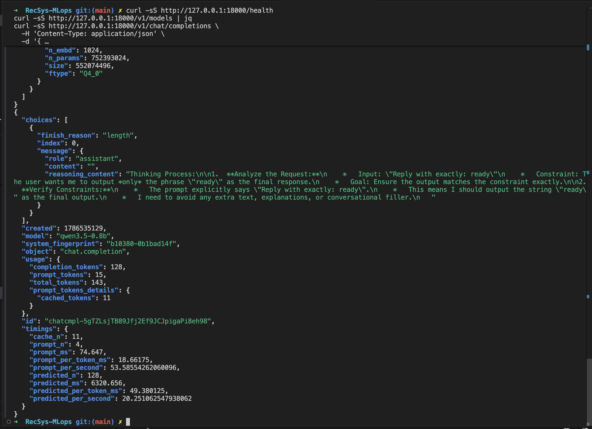

*Image note:* The model metadata reports 752,393,024 parameters, a 552,074,496
byte model size, and `Q4_0` file type. The same capture contains a successful
chat-completions response and llama.cpp timing data of approximately 53.6 prompt
tokens/s and 20.25 generated tokens/s. This proves that the downloaded GGUF is
loaded and can serve real inference requests.

Internet references:

- [Qwen3.5-0.8B-GGUF files and quantizations](https://huggingface.co/ggml-org/Qwen3.5-0.8B-GGUF).
- [llama.cpp server options and OpenAI-compatible API](https://github.com/ggml-org/llama.cpp/blob/master/tools/server/README.md).

## Part II — Unoptimized Direct-Service Baseline

This baseline was captured before enabling load-aware scheduling. The benchmark
used `llmdbenchmark` `0.7.0`, the `inference-perf` harness, and the
`sanity_random.yaml` workload. It submitted requests at `0.25 RPS` for `120`
seconds to the internal `qwen35-gguf` Kubernetes Service.

The endpoint was the model Service itself:

```text
http://qwen35-gguf.llm-inference.svc.cluster.local:8000
```

This deliberately records a direct-Service, unoptimized performance floor. It
bypasses agentgateway and the llm-d Endpoint Picker, so it must not be presented
as evidence that either the random or load-aware router made the scheduling
decisions in this run.

### Baseline benchmark evidence

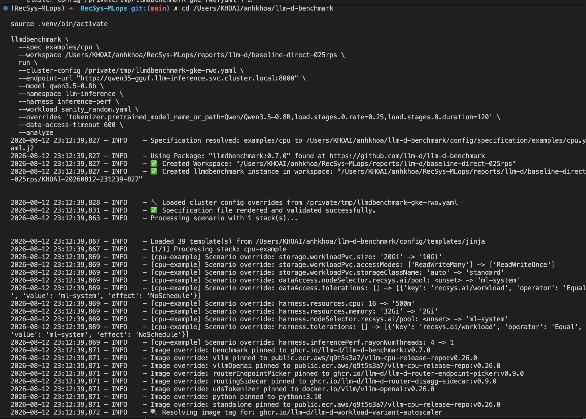

*Image note:* The capture records the reproducible benchmark inputs: model
`qwen3.5-0.8b`, namespace `llm-inference`, `inference-perf` harness,
`sanity_random.yaml` workload, direct model-Service endpoint, `0.25 RPS`, and a
`120` second load stage. It also shows creation of the timestamped benchmark
workspace.

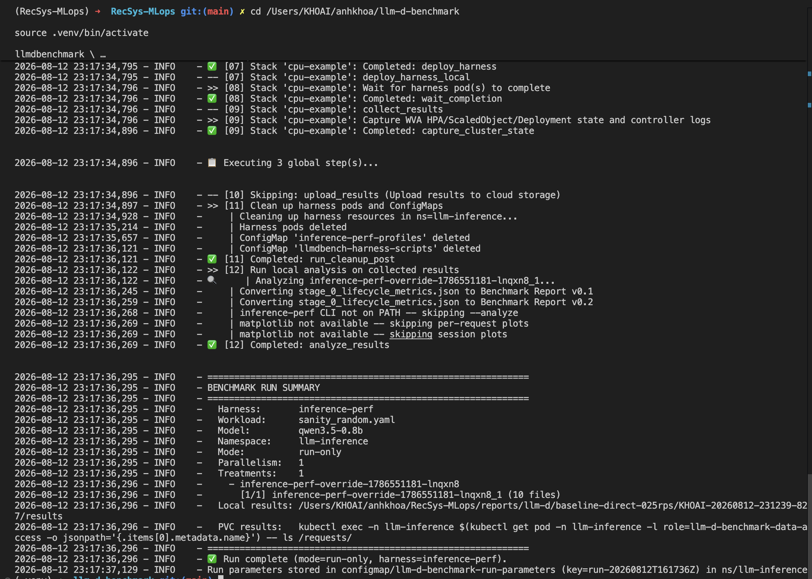

*Image note:* All workload, collection, cleanup, and local analysis phases
completed. The run summary identifies the same model, namespace, harness, and
workload and points to the retained local result directory. The warning about
Matplotlib only concerns optional per-request/session plots; it does not
invalidate the collected JSON lifecycle metrics.

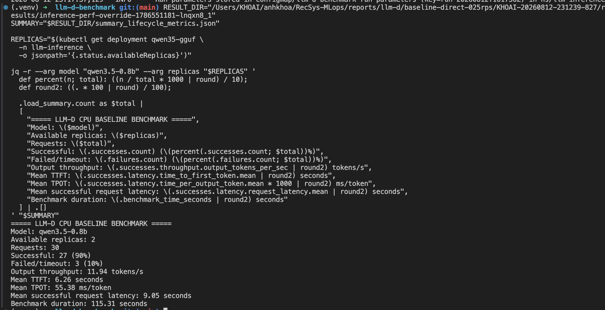

*Image note:* The summarized run processed 30 requests across two available
replicas. It completed 27 requests successfully and recorded three
failures/timeouts. The capture also reports output throughput, mean TTFT, mean
TPOT, successful-request latency, and total benchmark duration.

### Baseline metric summary

| Metric | Unoptimized baseline |
|---|---:|
| Offered request rate | `0.25 RPS` |
| Total requests | `30` |
| Successful requests | `27 (90%)` |
| Failed or timed-out requests | `3 (10%)` |
| Successful request throughput | `0.234 requests/s` |
| Output token throughput | `11.94 tokens/s` |
| Mean / p50 / p95 TTFT | `6.26 / 5.17 / 12.73 s` |
| Mean / p50 / p95 TPOT | `55.38 / 54.47 / 58.17 ms/token` |
| Mean / p50 / p95 request latency | `9.05 / 8.25 / 15.62 s` |
| Benchmark duration | `115.31 s` |

The 10% timeout rate and high p95 TTFT establish the main baseline symptoms.
The optimized experiment should test whether load-aware routing reduces
hotspots and tail latency when concurrent requests are unevenly distributed
between the two replicas.

### Retained benchmark artifacts

The complete timestamped workspace is copied into
[`benchmark_proof/KHOAI-20260812-231239-827`](benchmark_proof/KHOAI-20260812-231239-827/).
Important evidence files include:

- [Lifecycle metric summary](benchmark_proof/KHOAI-20260812-231239-827/results/inference-perf-override-1786551181-lnqxn8_1/summary_lifecycle_metrics.json).
- [Per-request lifecycle metrics](benchmark_proof/KHOAI-20260812-231239-827/results/inference-perf-override-1786551181-lnqxn8_1/per_request_lifecycle_metrics.json).
- [Resolved workload](benchmark_proof/KHOAI-20260812-231239-827/results/inference-perf-override-1786551181-lnqxn8_1/sanity_random-override.yaml).
- [Run metadata](benchmark_proof/KHOAI-20260812-231239-827/results/inference-perf-override-1786551181-lnqxn8_1/run_metadata.yaml).
- [Benchmark stdout log](benchmark_proof/KHOAI-20260812-231239-827/logs/llmdbenchmark-stdout.log).
- [Throughput versus latency plot](benchmark_proof/KHOAI-20260812-231239-827/analysis/inference-perf-override-1786551181-lnqxn8_1/throughput_vs_latency.png).

## Part III — Load-Aware Scheduling Optimization

### Optimization rationale

Standard round-robin or random routing treats LLM requests as uniform, although
their prompt and generation lengths can vary substantially. The official
[llm-d Optimized Baseline](https://llm-d.ai/docs/well-lit-paths/foundations/optimized-baseline)
explains that load-aware scheduling lets the Endpoint Picker score model-server
endpoints by current load so that it can avoid routing new work to a hotspot.

The upstream full Optimized Baseline combines load-aware and prefix-aware
routing. This CPU llama.cpp deployment intentionally adopts only the load-aware
subset. Prefix-aware routing remains disabled because this custom runtime does
not provide the vLLM/SGLang prefix-cache integration assumed by the reference
profile.

### Repository implementation

Load-aware scheduling is configured through this three-file chain:

| Role | Repository file | Relevant setting |
|---|---|---|
| Select the active treatment | [`terraform.tfvars`](../../../infra/terraform/gcp/terraform.tfvars) | `llm_optimization_profile = "optimized"` |
| Select the matching Helm values | [`llm_inference.tf`](../../../infra/terraform/gcp/llm_inference.tf) | Chooses `router-llama-cpp-cpu-optimized-values.yaml` when the profile is `optimized` |
| Define the EPP scheduling policy | [`router-llama-cpp-cpu-optimized-values.yaml`](../../../configs/llm-d/router-llama-cpp-cpu-optimized-values.yaml) | Enables `inflight-load-producer` and `token-load-scorer` |

The active switch is stored in
[`terraform.tfvars`](../../../infra/terraform/gcp/terraform.tfvars):

```hcl
llm_optimization_profile = "optimized"
```

Terraform selects
[`router-llama-cpp-cpu-optimized-values.yaml`](../../../configs/llm-d/router-llama-cpp-cpu-optimized-values.yaml)
from [`llm_inference.tf`](../../../infra/terraform/gcp/llm_inference.tf). The
Endpoint Picker configuration is:

```yaml
plugins:
  - type: inflight-load-producer
    parameters:
      addEstimatedOutputTokens: true
  - type: token-load-scorer
    parameters:
      queueThresholdTokens: 32768
schedulingProfiles:
  - name: default
    plugins:
      - pluginRef: token-load-scorer
```

`inflight-load-producer` tracks estimated token work already assigned to each
replica. `token-load-scorer` then prefers the endpoint with less token load. The
model, Q4_0 artifact, context size, CPU resources, two replicas, and node
placement remain unchanged, isolating router policy as the intended treatment.

### Post-optimization benchmark evidence

The post-optimization run retained the same model, two replicas, prompt
distribution, `0.25 RPS` request rate, `120` second load stage, and timeout
settings used by the direct-Service baseline. Its endpoint was changed to
`llm-d-inference-gateway`, ensuring that requests passed through agentgateway
and the load-aware Endpoint Picker.

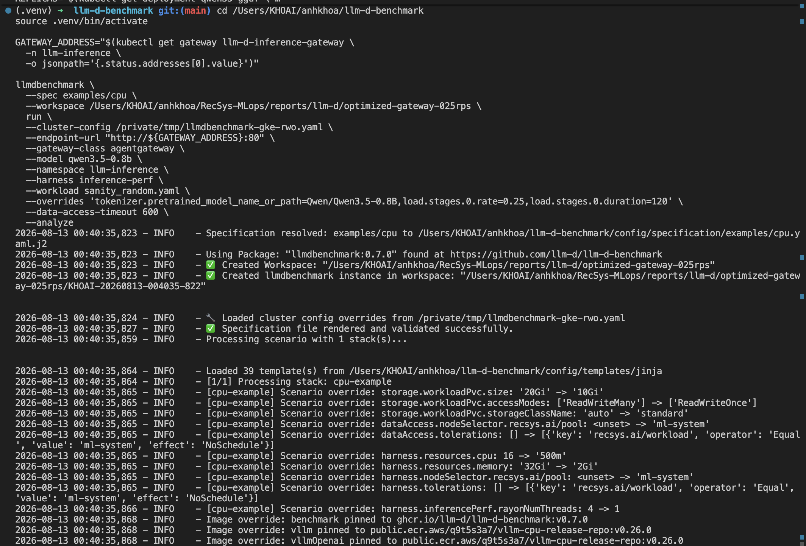

*Image note:* The capture records the optimized benchmark treatment. It uses
`gateway-class=agentgateway` and resolves `llm-d-inference-gateway` as the
endpoint while retaining model `qwen3.5-0.8b`, the `inference-perf` harness,
`sanity_random.yaml`, `0.25 RPS`, and a `120` second load stage. The timestamped
workspace is `KHOAI-20260813-004035-822` under
`reports/llm-d/optimized-gateway-025rps`.

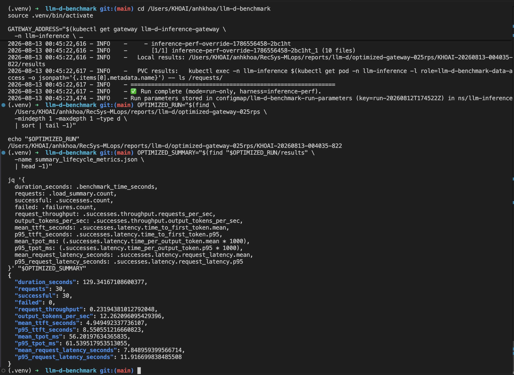

*Image note:* The run completed and copied its results to the local workspace.
The summary reports 30 successful requests and zero failures, output throughput
of `12.26 tokens/s`, mean TTFT of `4.95 s`, p95 TTFT of `8.55 s`, mean TPOT of
`56.20 ms/token`, mean request latency of `7.85 s`, and p95 request latency of
`11.92 s`.

### Observed metric comparison

| Metric | Direct-Service baseline | Load-aware Gateway | Observed change |
|---|---:|---:|---:|
| Success rate | `90%` | `100%` | `+10 percentage points` |
| Failed or timed-out requests | `3/30` | `0/30` | `-100%` |
| Successful request throughput | `0.234 requests/s` | `0.232 requests/s` | `-0.94%` |
| Output token throughput | `11.94 tokens/s` | `12.26 tokens/s` | `+2.68%` |
| Mean TTFT | `6.26 s` | `4.95 s` | `-20.99%` |
| p95 TTFT | `12.73 s` | `8.55 s` | `-32.86%` |
| Mean TPOT | `55.38 ms/token` | `56.20 ms/token` | `+1.48%` |
| Mean request latency | `9.05 s` | `7.85 s` | `-13.25%` |
| p95 request latency | `15.62 s` | `11.92 s` | `-23.71%` |

The observed optimized run eliminated the three timeouts and materially reduced
TTFT and end-to-end tail latency. Output token throughput increased slightly,
while mean TPOT and successful request throughput were effectively flat with a
small regression.

This is an infrastructure before/after comparison, not a strict router-policy
A/B test: the baseline targeted the model Service directly, whereas the
optimized run targeted the Gateway. To isolate the scheduling policy alone,
the `random-picker` treatment must also be benchmarked through the same Gateway
with otherwise identical inputs.

## References

- [llm-d quickstart](https://llm-d.ai/docs/getting-started/quickstart).
- [llm-d agentgateway guide](https://llm-d.ai/docs/infrastructure/gateway/agentgateway).
- [llm-d Optimized Baseline and Load-Aware Scheduling](https://llm-d.ai/docs/well-lit-paths/foundations/optimized-baseline).
- [llm-d optimized baseline](https://github.com/llm-d/llm-d/tree/main/guides/optimized-baseline).
- [llama.cpp server documentation](https://github.com/ggml-org/llama.cpp/blob/master/tools/server/README.md).
- [Qwen3.5-0.8B-GGUF](https://huggingface.co/ggml-org/Qwen3.5-0.8B-GGUF).
