# Production Observability

## Full observability flow

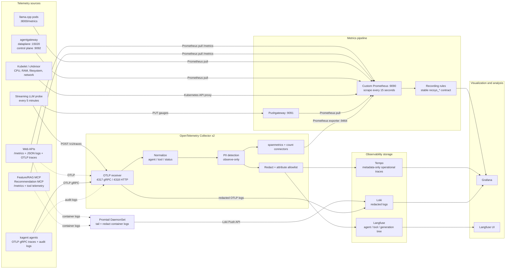

The stack deliberately separates collection, processing, storage, and visualization:

```text
Instrumentation
  -> transport and discovery
  -> normalization and privacy processing
  -> signal-specific storage
  -> querying and correlation
  -> dashboards and per-request analysis
```

Prometheus is the time-series storage for metrics. Loki stores logs, Tempo stores distributed traces, and Langfuse stores the semantic LLM/agent trace tree. Grafana is the common visualization layer over Prometheus, Loki, and Tempo; it is not the primary telemetry store.

The implementation is deployed by the [`recsys_observability` Helm release](../../../infra/terraform/gcp/modules/kubernetes-platform/recsys_services.tf#L1), using the production overrides in [`values-gcp.yaml`](../../../infra/helm/recsys-observability/values-gcp.yaml). Terraform orders the namespace, secrets, Prometheus Operator CRDs, and the repository-owned observability release through the dependencies at [`recsys_services.tf`](../../../infra/terraform/gcp/modules/kubernetes-platform/recsys_services.tf#L49).

| Rubric component | Primary producer | Transport | Processing/storage | Primary dashboard |
|---|---|---|---|---|
| Web API metrics | FastAPI middleware | Prometheus `/metrics` scrape | Prometheus recording/query layer | Web API Overview |
| Computing telemetry data | Kubelet and cAdvisor | Kubernetes API node proxy | Prometheus | Compute Telemetry |
| Logs | Kubernetes container stdout/stderr and OTLP audit logs | Promtail and OTel Collector | Loki | Logs Overview |
| Traces | FastAPI and kagent OpenTelemetry instrumentation | OTLP gRPC/HTTP | OTel Collector and Tempo | Traces Overview |
| LLM-related telemetry data | llama.cpp, agentgateway, streaming probe | Prometheus scrape, Pushgateway, OTLP | Prometheus, Tempo, Langfuse | LLM Runtime |
| Agent-related telemetry data | kagent spans and MCP native metrics | OTLP gRPC and Prometheus scrape | Collector spanmetrics, Prometheus, Tempo, Langfuse | Agent & MCP Operations |

### Screenshot capture checklist

The four platform-observability screenshots already exist and are reused from the final ML submission. They only need to be recaptured if a current production timestamp or LLM-specific namespace coverage is required.

| Priority | Dashboard/view | Evidence status | What the screenshot must show |
|---|---|---|---|
| Required platform proof | **Web API Overview** | Existing image reused | req/s, total requests, failures, average/max latency, route/status breakdown |
| Required platform proof | **Compute Telemetry** | Existing image reused | CPU, RAM, filesystem, network RX/TX, restarts and namespace/pod labels |
| Required platform proof | **Logs Overview** | Existing image reused | centralized Loki logs, namespace/service filtering, error/log volume; recapture to emphasize `kagent`, `llm-inference`, and `agentgateway-system` |
| Required platform proof | **Traces Overview** | Existing image reused | Tempo trace context and trace-to-log correlation; recapture to emphasize the kagent chain |
| New LLM proof | **LLM Runtime** | Captured in production | native llama.cpp targets, token throughput, gateway status/rate, TTFT, round trip, exact probe tokens |
| New agent proof | **Agent & MCP Operations** | Captured in production | separate coordinator/context/recommendation calls, tool calls, MCP success/failure, p95 and retries/partial results |
| New safety proof | **Safety & PII** | Captured in production | all four observe-only categories and no raw prompt/detected values |
| Recommended overview | **AI Observability Command Center** | Captured in production | API -> agent -> LLM -> MCP traffic plus target health and active alerts |
| New semantic trace proof | **Langfuse trace view** | Captured in production | coordinator -> specialist -> tool -> generation hierarchy, model, positive token usage and duration |

All refreshed Grafana screenshots should use `Last 30 minutes`, show the production time, use the production HTTPS hostname, and avoid required panels displaying `No data`.

### Refreshed production traffic proof — 2026-09-04

A bounded production traffic refresh was run before the final screenshot pass. It reused the repository's smoke contracts instead of introducing a separate test-only request path:

- The coordinator executed the `composite_agents`, `direct_context_mcp`, `direct_recommendation_mcp`, and `partial_result` cases from [`coordinator_a2a_smoke()`](../../../jenkins/scripts/deploy/agentic/a2a.sh#L102).
- The context agent executed all four Feature/RAG MCP tools through [`agentic_a2a_smoke()`](../../../jenkins/scripts/deploy/agentic/a2a.sh#L364).
- The recommendation agent executed a separate A2A recommendation request through [`recommendation_a2a_smoke()`](../../../jenkins/scripts/deploy/agentic/a2a.sh#L3).
- One additional deliberately missing chunk was sent directly to Feature/RAG MCP so the recent native MCP failure-rate series had more than one scrape sample. This is an expected validation failure and does not alter application state.
- One inert safety request contained the documented `.invalid` email, test phone, test payment card, and prompt-injection marker. The agent was instructed to call no tools, not repeat the values, and returned only `SAFETY_FIXTURE_REDACTED`.

After two Collector flush/scrape intervals, [`ai_observability_proof.py`](../../../ops/validation/ai_observability_proof.py) passed all `39/39` signal checks and all `51/51` required Prometheus-backed panel queries. The production snapshot at `2026-09-04T10:14:45Z` contained:

| Signal | Verified production value |
|---|---:|
| Coordinator / context / recommendation cumulative agent calls | `29 / 66 / 15` |
| Feature/RAG MCP calls | `16` |
| Recommendation MCP calls | `9` |
| Native MCP failures | `2` |
| Safety detections: email / phone / card / prompt injection | `1 / 3 / 3 / 1` |
| Synthetic TTFT / round trip | `1.1187s / 1.1671s` |
| Synthetic input / output / total tokens | `16 / 2 / 18` |
| Matching kagent traces returned by Tempo search | `10` |
| Raw synthetic PII matches in Loki and Tempo | `0` |

The traffic was deliberately low-volume and sequential. Screenshots should be captured within the dashboard's `Last 30 minutes` window after a refresh run so rate-based panels show the new samples as well as cumulative counters.

### AI Observability Command Center evidence

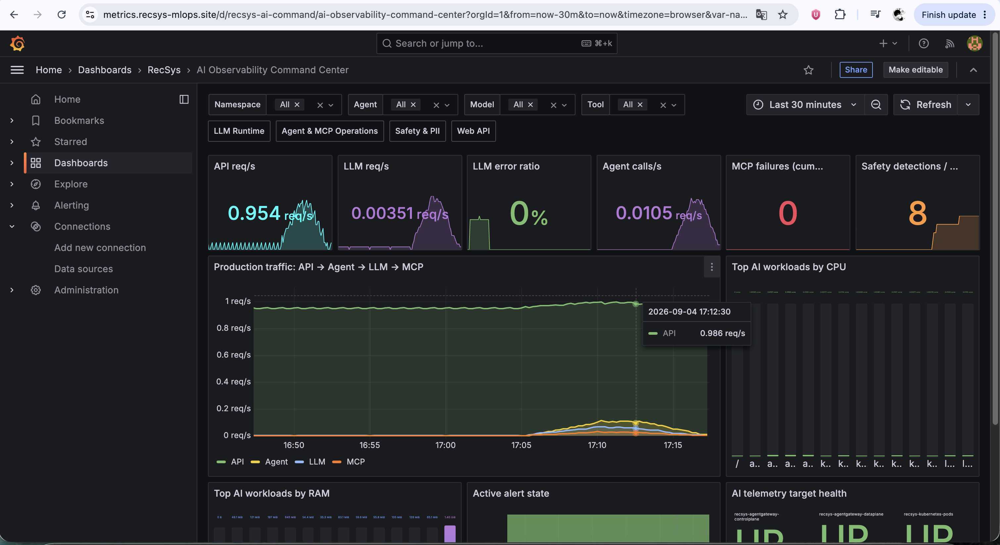

**Figure: production AI observability command center.** The `Last 30 minutes` view correlates Web API, agent, LLM, MCP, and safety signals in one place. Non-zero API/LLM/agent traffic and eight observe-only safety detections prove that the bounded traffic refresh propagated through the complete telemetry flow. Dashboard implementation: [`ai-observability-command-center.json`](../../../infra/helm/recsys-observability/dashboards/ai-observability-command-center.json).

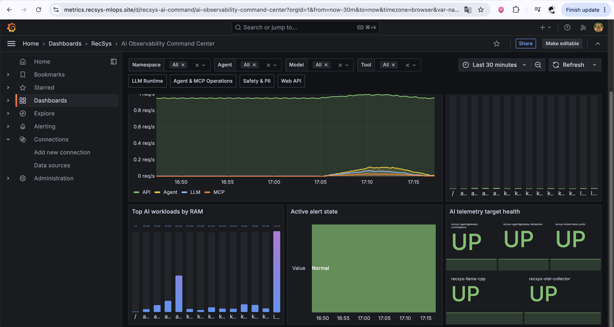

**Figure: command-center capacity and target-health proof.** The lower half captures workload RAM, normal alert state, and `UP` status for agentgateway control plane/data plane, Kubernetes pod discovery, llama.cpp, and the OTel Collector. This complements the traffic view above by proving that the producers and collection path were healthy during capture.

> **Evidence note:** these two screenshots are complementary rather than duplicates: the first proves end-to-end signal activity; the second proves the infrastructure and scrape targets that make those signals trustworthy.

### OTLP ports used in the flow

OTLP means **OpenTelemetry Protocol**, not OLTP. The Collector exposes two standard receiving ports in [`otel-collector.yaml`](../../../infra/helm/recsys-observability/templates/otel-collector.yaml#L18):

```yaml
receivers:
  otlp:
    protocols:
      grpc:
        endpoint: 0.0.0.0:4317
      http:
        endpoint: 0.0.0.0:4318
```

- `4317` is OTLP over gRPC. kagent and normal OpenTelemetry SDK exporters use this efficient, long-lived transport.
- `4318` is OTLP over HTTP. The synthetic probe posts OTLP JSON to `/v1/traces`, and Langfuse self-telemetry uses OTLP HTTP/protobuf.
- These ports receive telemetry; they do not store it. The Collector subsequently exports the processed data to Tempo, Loki, Langfuse, or its Prometheus endpoint.

---

## Web API metrics

### Component flow

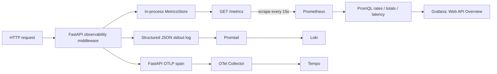

### Request instrumentation

All serving APIs share the instrumentation library in [`recsys_serving_common/observability.py`](../../../apps/api-serving/shared/src/recsys_serving_common/observability.py). `observe_request()` records one counter for every request, a failure counter for server errors, and duration summary values:

```python
def observe_request(route: str, method: str, status: int, duration_seconds: float) -> None:
    request_labels = {"service": SERVICE_NAME, "route": route, "method": method}
    labels = {**request_labels, "status": str(status)}
    METRICS.inc("recsys_api_requests_total", labels=labels)
    if status >= 500:
        METRICS.inc("recsys_api_failures_total", labels=labels)
    METRICS.observe(
        "recsys_api_request_duration_seconds", duration_seconds, request_labels
    )
```

Reference: [`observe_request()`](../../../apps/api-serving/shared/src/recsys_serving_common/observability.py#L235).

The resulting metric contract is:

| Metric | Type | Meaning |
|---|---|---|
| `recsys_api_requests_total{service,route,method,status}` | Counter | Total requests partitioned by API, route, method, and status |
| `recsys_api_failures_total{service,route,method,status}` | Counter | HTTP 5xx failures |
| `recsys_api_request_duration_seconds_count` | Summary component | Number of measured requests |
| `recsys_api_request_duration_seconds_sum` | Summary component | Accumulated request duration |
| `recsys_api_request_duration_seconds_max` | Summary component | Maximum observed duration in the process lifetime |

The custom [`MetricsStore`](../../../apps/api-serving/shared/src/recsys_serving_common/observability.py#L26) renders counters, gauges, summaries, and histograms in Prometheus exposition format. API latency is therefore computed as:

```promql
sum(rate(recsys_api_request_duration_seconds_sum[5m]))
/
clamp_min(sum(rate(recsys_api_request_duration_seconds_count[5m])), 0.001)
```

### Dependency and model-serving metrics

The same library records supporting signals needed to determine whether latency or failure originates in the API itself or in a dependency:

- Redis duration and failures: [`observe_redis()`](../../../apps/api-serving/shared/src/recsys_serving_common/observability.py#L248).
- Triton inference duration and failures: [`observe_triton()`](../../../apps/api-serving/shared/src/recsys_serving_common/observability.py#L258).
- Prediction status, latency, and confidence: [`observe_model_prediction()`](../../../apps/api-serving/shared/src/recsys_serving_common/observability.py#L273).

This produces metrics such as:

```text
recsys_api_redis_operation_duration_seconds
recsys_api_redis_errors_total
recsys_api_triton_inference_duration_seconds
recsys_api_triton_errors_total
model_predictions_total
model_prediction_latency_seconds_bucket
```

### Prometheus discovery

API and MCP deployments use the standard pod annotations:

```yaml
prometheus.io/scrape: "true"
prometheus.io/path: /metrics
prometheus.io/port: "<application-port>"
```

The `recsys-kubernetes-pods` scrape job discovers annotated pods in the allowed namespaces. Its relabeling rules copy the pod annotation into `__metrics_path__` and replace the target address with the annotated port. Reference: [`prometheus.yaml`](../../../infra/helm/recsys-observability/templates/prometheus.yaml#L192).

The project intentionally uses this custom scrape configuration as the primary collection mechanism. Although Prometheus Operator CRDs are installed, the upstream chart's Prometheus, Grafana, and Alertmanager are disabled in [`dependencies.tf`](../../../infra/terraform/gcp/modules/kubernetes-platform/dependencies.tf#L96).

### Correlated logs and traces

The JSON formatter adds `trace_id` and `span_id` to application logs whenever a valid active span exists. Reference: [`JsonFormatter`](../../../apps/api-serving/shared/src/recsys_serving_common/observability.py#L133).

FastAPI tracing is initialized by [`configure_tracing()`](../../../apps/api-serving/shared/src/recsys_serving_common/observability.py#L175). The exporter endpoint comes from `OTEL_EXPORTER_OTLP_ENDPOINT`, allowing the same application code to target a local Collector or the production Collector through environment configuration.

This creates the correlation path:

```text
API metric spike in Grafana
  -> related Tempo trace
  -> trace_id from the span
  -> Loki application logs with the same trace_id
```

### Dashboard evidence

Dashboard definition: [`web-api-overview.json`](../../../infra/helm/recsys-observability/dashboards/web-api-overview.json).

Expected panels include live requests per second, total requests, HTTP 5xx failure ratio, average/max latency, traffic by route/status, dependency errors, and payload shape.


**Figure: Web API metrics proof.** This existing production evidence is reused from the [final ML observability submission](<../rubic-final-coursework-(final-ml)/observability.md#1-web-api-metrics>). It shows recommendation and online-feature API request rate, total request count, failure count, latency, candidate count, and model-prediction activity.

If this image is refreshed, use `Last 30 minutes` and keep the HTTPS production hostname plus non-empty request, failure, and latency panels visible.

---

## Computing telemetry data

### Component flow

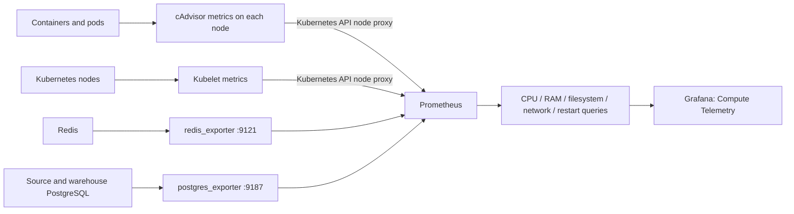

### cAdvisor and Kubelet scraping

Prometheus has RBAC permission to discover nodes and call node proxy endpoints. The relevant ClusterRole is defined at [`prometheus.yaml`](../../../infra/helm/recsys-observability/templates/prometheus.yaml#L7).

For cAdvisor, Prometheus rewrites every discovered node into:

```text
https://kubernetes.default.svc:443/api/v1/nodes/<node>/proxy/metrics/cadvisor
```

Reference: [`kubernetes-cadvisor` scrape job](../../../infra/helm/recsys-observability/templates/prometheus.yaml#L160).

For Kubelet runtime metrics, it calls:

```text
https://kubernetes.default.svc:443/api/v1/nodes/<node>/proxy/metrics
```

Reference: [`kubernetes-kubelet` scrape job](../../../infra/helm/recsys-observability/templates/prometheus.yaml#L176).

This approach does not require a public node metrics endpoint. Prometheus authenticates to the Kubernetes API with its mounted service-account token.

### Compute metric contract

| Metric | Interpretation |
|---|---|
| `container_cpu_usage_seconds_total` | Cumulative CPU time; `rate()` converts it to cores used |
| `container_memory_working_set_bytes` | Memory actively used by a container |
| `container_fs_usage_bytes` | Container filesystem consumption |
| `container_network_receive_bytes_total` | Cumulative received bytes; `rate()` produces RX bytes/s |
| `container_network_transmit_bytes_total` | Cumulative transmitted bytes; `rate()` produces TX bytes/s |
| `container_start_time_seconds` | Changes indicate a container restart/recreation |
| `container_last_seen` | Used as a liveness/readiness observation of container presence |

Example CPU query:

```promql
sum(
  rate(container_cpu_usage_seconds_total{
    namespace=~"api-serving|kagent|llm-inference|agentgateway-system|observability"
  }[5m])
) by (namespace, pod)
```

CPU counters must be queried with `rate()` because their raw value is accumulated CPU seconds, not the current CPU percentage. Memory is a gauge, so it can be aggregated directly.

### Redis and PostgreSQL exporters

The chart additionally deploys:

- `redis_exporter` on port `9121`, configured to reach the internal Redis Service.
- `postgres_exporter` on port `9187` for source PostgreSQL.
- A second `postgres_exporter` for warehouse PostgreSQL.

Their deployment and secret-backed connection strings are in [`exporters.yaml`](../../../infra/helm/recsys-observability/templates/exporters.yaml). The corresponding static scrape targets are defined at [`prometheus.yaml`](../../../infra/helm/recsys-observability/templates/prometheus.yaml#L151).

Credentials are loaded from the namespace-scoped `recsys-data-platform-secret`; they are not placed directly in Prometheus scrape configuration.

### Storage configuration

Prometheus writes its TSDB to `/prometheus` with seven-day retention. The production profile enables a `20Gi` `standard-rwo` PVC in [`values-gcp.yaml`](../../../infra/helm/recsys-observability/values-gcp.yaml#L5).

The Deployment switches between `emptyDir` and PVC according to `persistence.prometheus.enabled`, and the PVC has the Helm `keep` resource policy. Reference: [`prometheus.yaml`](../../../infra/helm/recsys-observability/templates/prometheus.yaml#L380).

### Dashboard evidence

Dashboard definition: [`compute-telemetry.json`](../../../infra/helm/recsys-observability/dashboards/compute-telemetry.json).

Expected panels include total CPU cores, memory working set, pod restarts, observed pods, CPU and memory by namespace, top pods, network RX/TX, and container filesystem usage.


**Figure: Compute telemetry proof.** This existing production evidence is reused from the [final ML observability submission](<../rubic-final-coursework-(final-ml)/observability.md#2-computing-telemetry-data-metrics>). It proves that Prometheus and Grafana collect CPU, memory, network, pod/container health, and exporter telemetry across the platform namespaces.

If this image is refreshed, use `Last 30 minutes` and include CPU, RAM, filesystem, network RX/TX, and restart panels.

---

## Computing telemetry data: logs

### Component flow

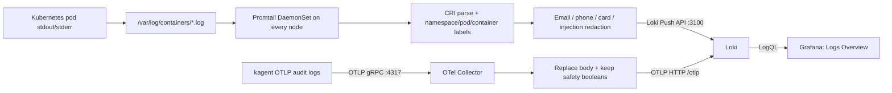

Promtail runs as a DaemonSet so every scheduled node has a local log tailer. It mounts Kubernetes container-log directories read-only, tracks positions, parses the CRI envelope, derives `namespace`, `pod`, and `container` labels, and pushes sanitized records to Loki. Deployment and mounts are defined in [`loki-tempo-promtail.yaml`](../../../infra/helm/recsys-observability/templates/loki-tempo-promtail.yaml#L117); the Promtail pipeline begins at [`promtail.yaml`](../../../infra/helm/recsys-observability/templates/loki-tempo-promtail.yaml#L181).

The scrape configuration covers API serving, dataflow, KServe/Triton, MLflow, Kubeflow, kagent, LLM inference, agentgateway, and observability namespaces. Before Loki ingestion, replace stages redact:

```text
email             -> [REDACTED_EMAIL]
payment-card-like -> [REDACTED_PAYMENT_CARD]
phone             -> [REDACTED_PHONE]
prompt injection  -> [REDACTED_PROMPT_INJECTION]
```

Reference: [`Promtail redaction stages`](../../../infra/helm/recsys-observability/templates/loki-tempo-promtail.yaml#L259).

kagent audit logs take a separate OTLP path. `transform/safety_redact` detects the same four categories, replaces the complete audit body with `kagent audit event [REDACTED]`, and keeps only category booleans before the Collector exports the log to Loki. Reference: [`transform/safety_redact`](../../../infra/helm/recsys-observability/templates/otel-collector.yaml#L113).

Grafana queries Loki through the provisioned `Loki` datasource. Reference: [`Grafana datasource provisioning`](../../../infra/helm/recsys-observability/templates/grafana.yaml#L24).

### Dashboard evidence

Dashboard definition: [`logs-overview.json`](../../../infra/helm/recsys-observability/dashboards/logs-overview.json).

The screenshot should demonstrate centralized log ingestion, namespace/service filtering, log volume, error trends, and recent structured API or agent/gateway log entries.


**Figure: centralized logs proof.** This existing production evidence is reused from the [final ML observability submission](<../rubic-final-coursework-(final-ml)/observability.md#3-computing-telemetry-data-logs>). It proves that Kubernetes pod logs are stored centrally in Loki and queried from Grafana by namespace, pod, service, status, and content.

If this image is refreshed for the LLM submission, include the `kagent`, `llm-inference`, and `agentgateway-system` namespaces in addition to API logs, and ensure no raw synthetic PII appears.

---

## Computing telemetry data: traces

### Component flow

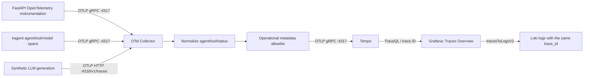

FastAPI tracing is initialized by [`configure_tracing()`](../../../apps/api-serving/shared/src/recsys_serving_common/observability.py#L175). The application uses `OTEL_EXPORTER_OTLP_ENDPOINT`, so production configuration sends spans to the internal Collector Service rather than coupling application code to a Collector pod address.

kagent sends agent, tool, and model spans to the same Service using its native OTLP gRPC configuration in [`configs/kagent/values.yaml`](../../../configs/kagent/values.yaml#L129). The streaming LLM probe uses OTLP HTTP and posts a generation span to `/v1/traces` from [`export_otlp_trace()`](../../../infra/helm/recsys-observability/files/llm_observability_probe.py#L223).

Inside the Collector, `transform/agent_normalize` canonicalizes agent/tool/status labels, while `transform/operational_sanitize` removes raw prompt and tool payload fields. The operational trace pipeline then exports metadata-only spans to Tempo. Reference: [`traces/operational`](../../../infra/helm/recsys-observability/templates/otel-collector.yaml#L195).

Tempo receives OTLP on `4317/4318` and exposes its query API on `3200`. Configuration: [`Tempo receiver and storage`](../../../infra/helm/recsys-observability/templates/loki-tempo-promtail.yaml#L73).

Grafana's Tempo datasource enables the node graph and `tracesToLogsV2`; selected traces can therefore open Loki logs from the same time interval and trace ID. Reference: [`Tempo datasource`](../../../infra/helm/recsys-observability/templates/grafana.yaml#L29).

### Dashboard evidence

Dashboard definition: [`traces-overview.json`](../../../infra/helm/recsys-observability/dashboards/traces-overview.json).

The screenshot should demonstrate trace context, service/agent spans, request duration/status, and trace-to-log correlation rather than only API request-rate charts.


**Figure: distributed traces proof.** This existing production evidence is reused from the [final ML observability submission](<../rubic-final-coursework-(final-ml)/observability.md#4-computing-telemetry-data-traces>). It proves that OpenTelemetry trace context is queryable through Tempo/Grafana and correlated with request logs.

For stronger LLM-specific proof, additionally capture a current kagent trace containing the coordinator, context, recommendation, tool, and generation spans, with the production time range visible.

---

## LLM-related telemetry data

### Component flow

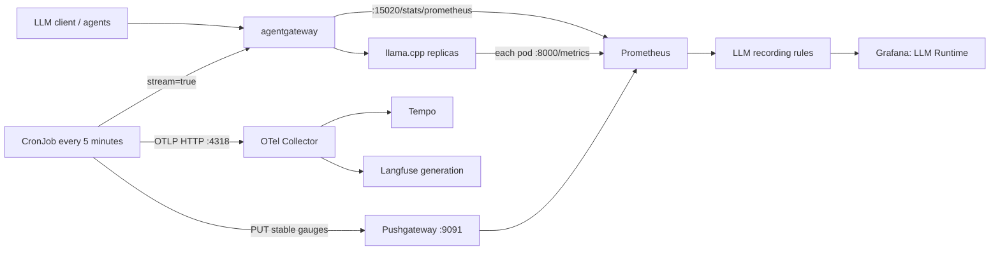

### Native llama.cpp metrics

Prometheus discovers each Qwen pod and directly scrapes `<pod-ip>:8000/metrics`. Reference: [`recsys-llama-cpp` job](../../../infra/helm/recsys-observability/templates/prometheus.yaml#L55).

Direct pod scraping is important because llama.cpp exports cumulative counters. Scraping a load-balanced ClusterIP could alternate between replicas, causing a single apparent series to jump backward when the selected backend changes.

The native metrics used by dashboards include:

```text
llamacpp:prompt_tokens_total
llamacpp:tokens_predicted_total
llamacpp:prompt_tokens_seconds
llamacpp:predicted_tokens_seconds
llamacpp:requests_processing
llamacpp:requests_deferred
llamacpp:n_busy_slots_per_decode
llamacpp:n_tokens_max
```

They cover input/output token throughput, native processing speed, active/deferred work, busy slots, and maximum observed context usage.

### agentgateway metrics

Two independent scrape jobs distinguish data-plane traffic from controller health:

| Job | Endpoint | Purpose |
|---|---|---|
| `recsys-agentgateway-dataplane` | `:15020/stats/prometheus` | Request count, status, duration, connections |
| `recsys-agentgateway-controlplane` | `:9092/metrics` | Gateway controller and routing health |

References:

- [`recsys-agentgateway-dataplane`](../../../infra/helm/recsys-observability/templates/prometheus.yaml#L77)
- [`recsys-agentgateway-controlplane`](../../../infra/helm/recsys-observability/templates/prometheus.yaml#L97)

The EPP endpoint is intentionally not part of this metric contract; router health is represented by agentgateway telemetry.

### Stable LLM recording rules

Vendor-native metric names are converted into stable project metrics at [`recsys-ai-observability` rules](../../../infra/helm/recsys-observability/templates/prometheus.yaml#L304):

```text
recsys_llm_input_tokens_per_second
recsys_llm_output_tokens_per_second
recsys_llm_total_tokens_per_second
recsys_llm_input_tokens_per_request
recsys_llm_output_tokens_per_request
recsys_llm_total_tokens_per_request
recsys_llm_request_error_ratio
recsys_llm_request_duration_p95_seconds
```

For example:

```yaml
- record: recsys_llm_input_tokens_per_second
  expr: sum(rate({__name__="llamacpp:prompt_tokens_total"}[5m]))

- record: recsys_llm_request_error_ratio
  expr: >-
    sum(rate(agentgateway_requests_total{status!~"2.."}[5m]))
    /
    clamp_min(sum(rate(agentgateway_requests_total[5m])), 0.001)
```

`*_tokens_per_request` is an aggregate five-minute average: native token counter rate divided by successful gateway request rate. It is suitable for trend and capacity monitoring, but it is not the exact usage of an individual request.

### Exact streaming TTFT and token probe

Native server metrics cannot reliably represent client-observed time to first content token. The chart therefore deploys a low-volume CronJob at [`llm-probe.yaml`](../../../infra/helm/recsys-observability/templates/llm-probe.yaml#L17).

The probe sends an OpenAI-compatible request:

```json
{
  "model": "qwen3.5-0.8b",
  "messages": [{"role": "user", "content": "Reply with exactly READY"}],
  "max_tokens": 8,
  "temperature": 0,
  "chat_template_kwargs": {"enable_thinking": false},
  "stream": true,
  "stream_options": {"include_usage": true}
}
```

Request construction: [`run_probe()`](../../../infra/helm/recsys-observability/files/llm_observability_probe.py#L235).

The SSE parser at [`parse_sse()`](../../../infra/helm/recsys-observability/files/llm_observability_probe.py#L35):

1. Ignores comments, empty lines, and non-data SSE lines.
2. Does not treat tool-call or reasoning chunks as the first visible token.
3. Measures TTFT at the first non-empty `delta.content`.
4. Measures round-trip until `[DONE]`.
5. Requires `prompt_tokens`, `completion_tokens`, and `total_tokens` usage.
6. Fails closed for malformed JSON, missing usage, missing content, or missing `[DONE]`.

It writes a fixed, low-cardinality Pushgateway group:

```text
recsys_llm_probe_success
recsys_llm_probe_ttft_seconds
recsys_llm_probe_round_trip_seconds
recsys_llm_probe_tokens{type="input|output|total"}
recsys_llm_probe_last_success_timestamp_seconds
```

Metric rendering is implemented at [`render_metrics()`](../../../infra/helm/recsys-observability/files/llm_observability_probe.py#L94). `PUT` is used with a stable grouping key, preventing request-shaped labels and stale per-run series.

The same result is emitted as an OTLP generation span by [`render_otlp_trace()`](../../../infra/helm/recsys-observability/files/llm_observability_probe.py#L145). This connects exact TTFT and token usage to both operational tracing and Langfuse per-request analysis:

```text
Probe result
  +-> Pushgateway -> Prometheus -> Grafana time series
  +-> OTLP :4318 -> Collector -> Tempo
                              +-> Langfuse generation
```

Probe behavior and low-cardinality guarantees are tested in [`test_llm_observability_probe.py`](../../../tests/unit/observability/test_llm_observability_probe.py).

### LLM privacy and Langfuse mapping

The Collector classifies model spans as Langfuse `generation` observations when model attributes or a recognized generation span name is present. It maps model name, usage tokens, input/output, and completion start time at [`transform/langfuse_semantic_redact`](../../../infra/helm/recsys-observability/templates/otel-collector.yaml#L75).

Input and output pass through email, phone, payment-card, and prompt-injection redaction before the attribute allowlist is applied. Tempo continues to receive metadata-only operational traces; only Langfuse receives the allowed, redacted semantic content.

### Dashboard evidence

Dashboard definition: [`llm-runtime.json`](../../../infra/helm/recsys-observability/dashboards/llm-runtime.json).

Expected panels include input/output token throughput, average token/request, exact probe tokens, gateway request rate/status, p50/p95 gateway round trip, exact TTFT, native prompt/output speed, active/deferred requests, busy slots, context use, and native target health.

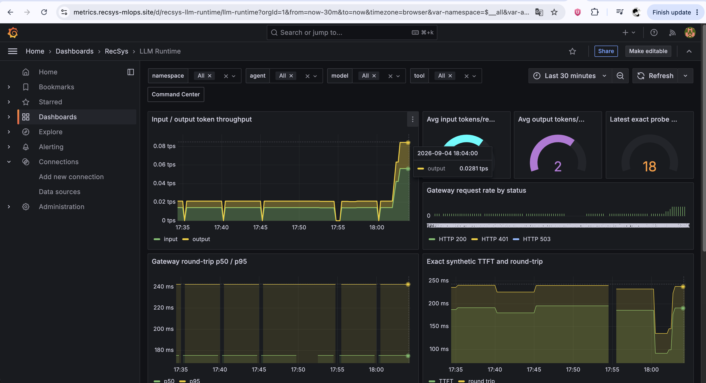

**Figure: LLM Runtime token, gateway, and exact latency proof.** This production `Last 30 minutes` capture shows input/output token throughput, positive average token/request gauges, the exact `18`-token synthetic request, gateway status traffic, gateway p50/p95, and distinct non-zero TTFT/round-trip series. The exact panels use `max(recsys_llm_probe_...)` so a missing probe produces `No data` rather than a misleading fallback zero.

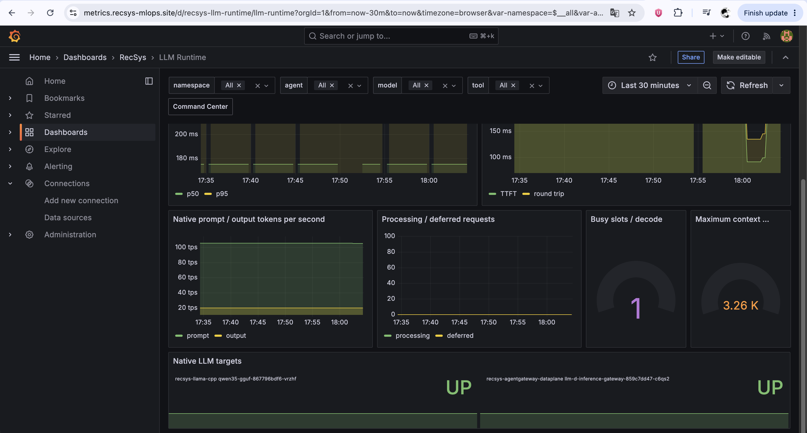

**Figure: native llama.cpp and agentgateway health.** The lower dashboard section proves native prompt/output processing speed, processing/deferred request state, one busy decode slot, maximum observed context, and `UP` status for both the Qwen llama.cpp pod and agentgateway data plane. These panels are backed by the per-pod and data-plane scrape jobs described above.

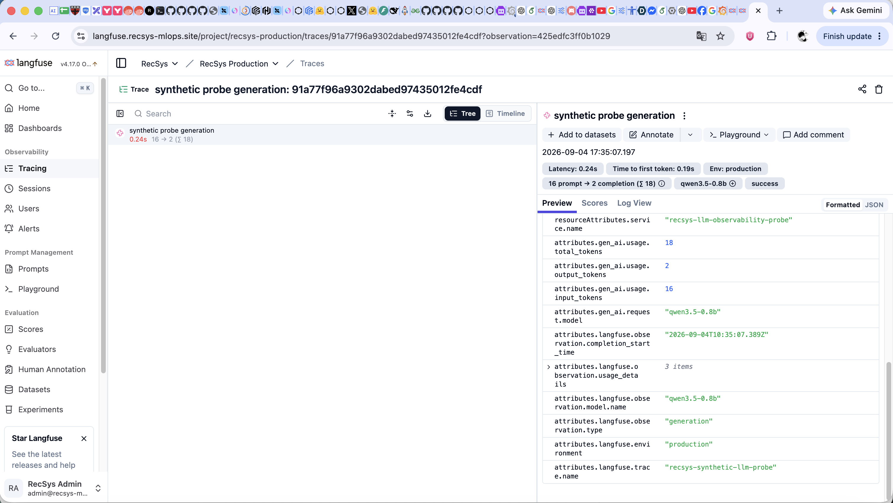

**Figure: per-request synthetic generation in Langfuse.** The selected `production` observation shows model `qwen3.5-0.8b`, `0.24s` latency, `0.19s` time to first token, and `16 / 2 / 18` input/output/total tokens. This is the semantic-trace representation of the same result exported to Pushgateway and visualized in the two Grafana screenshots above.

> **Evidence note:** the Langfuse value comes from `completion_start_time` and usage attributes emitted by [`render_otlp_trace()`](../../../infra/helm/recsys-observability/files/llm_observability_probe.py#L145); the Grafana value comes from the stable gauges emitted by [`render_metrics()`](../../../infra/helm/recsys-observability/files/llm_observability_probe.py#L94). Agreement between the two views proves that both telemetry branches observed the same streaming request.

---

## Agent-related telemetry data

### Component flow

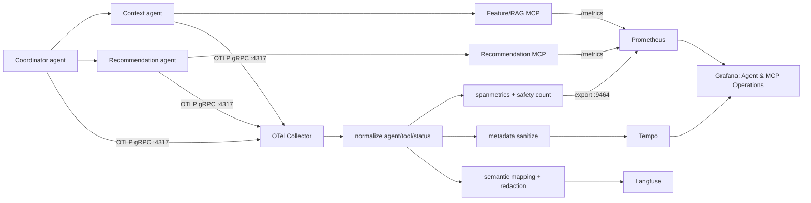

### kagent native OpenTelemetry configuration

kagent tracing and audit logging are enabled in [`configs/kagent/values.yaml`](../../../configs/kagent/values.yaml#L129):

```yaml
otel:
  tracing:
    enabled: true
    exporter:
      otlp:
        endpoint: http://recsys-otel-collector.observability.svc.cluster.local:4317
        insecure: true
        protocol: grpc
        timeout: 15000

  logging:
    enabled: true
    exporter:
      otlp:
        endpoint: http://recsys-otel-collector.observability.svc.cluster.local:4317
        insecure: true
        timeout: 15000
```

`recsys-otel-collector.observability.svc.cluster.local` is the Kubernetes Service DNS name. It decouples kagent from individual Collector pod IPs and balances long-lived exporter connections across the two Collector replicas.

The kagent Helm release consumes this file through [`kagent.tf`](../../../infra/terraform/gcp/modules/kubernetes-platform/kagent.tf), while preserving the digest-pinned upstream image/version contract.

### Collector resource controls

The Collector defaults to two replicas with a `1Gi` memory limit in [`values.yaml`](../../../infra/helm/recsys-observability/values.yaml#L39). Each replica uses:

```yaml
memory_limiter:
  check_interval: 5s
  limit_mib: 768
  spike_limit_mib: 192

batch:
  timeout: 5s
  send_batch_size: 1024
```

Reference: [`otel-collector.yaml`](../../../infra/helm/recsys-observability/templates/otel-collector.yaml#L25).

The memory limiter prevents telemetry bursts from exhausting the pod limit. The batch processor reduces request overhead to downstream storage.

The Deployment also has topology spread and a `minAvailable: 1` PodDisruptionBudget. Reference: [`Collector Deployment and PDB`](../../../infra/helm/recsys-observability/templates/otel-collector.yaml#L224).

### Agent identity normalization

Different kagent/ADK versions can report identity through different attributes. `transform/agent_normalize` selects the first available value in this order:

```text
gen_ai.agent.name
  -> kagent.agent.name
  -> kagent.app_name
  -> stable span-name matching
  -> unknown
```

It then canonicalizes known names to:

```text
coordinator
context
recommendation
```

The same processor derives:

```text
status    = success | failure
tool      = tool name | none | unknown
operation = span.name
```

Reference: [`transform/agent_normalize`](../../../infra/helm/recsys-observability/templates/otel-collector.yaml#L33).

Normalization prevents logically identical agents from creating fragmented dashboard series such as `coordinator-agent`, `recsys-coordinator`, and `CoordinatorAgent`.

### Trace-to-metric conversion

`spanmetrics/agents` converts normalized spans into Prometheus counters and duration histograms. Reference: [`spanmetrics/agents`](../../../infra/helm/recsys-observability/templates/otel-collector.yaml#L124).

Important configuration:

```yaml
namespace: recsys.agent.raw

dimensions:
  - agent
  - status
  - tool
  - operation

aggregation_temporality: AGGREGATION_TEMPORALITY_CUMULATIVE
aggregation_cardinality_limit: 2000
metrics_flush_interval: 15s

exemplars:
  enabled: true
  max_per_data_point: 5
```

Duration buckets range from `0.1s` to `300s`, covering short tool operations and long agent invocations.

For example, this span:

```text
agent=context
tool=build_user_rag_context
status=success
duration=2.1s
```

produces raw metrics equivalent to:

```text
recsys_agent_raw_calls_total{agent="context",tool="build_user_rag_context",status="success"} 1
recsys_agent_raw_duration_seconds_bucket{agent="context",le="2.5",...} 1
```

The Collector Prometheus exporter exposes those metrics on port `9464` at [`otel-collector.yaml`](../../../infra/helm/recsys-observability/templates/otel-collector.yaml#L164). Prometheus discovers both Collector pods using the `recsys-otel-collector` scrape job at [`prometheus.yaml`](../../../infra/helm/recsys-observability/templates/prometheus.yaml#L117).

Recording rules convert the raw metrics to the stable dashboard contract:

```text
recsys_agent_calls_total{agent,status}
recsys_agent_duration_seconds_bucket{agent,status}
recsys_agent_duration_seconds_count{agent,status}
recsys_agent_duration_seconds_sum{agent,status}
recsys_agent_tool_calls_total{agent,tool,status}
```

Reference: [`agent recording rules`](../../../infra/helm/recsys-observability/templates/prometheus.yaml#L325).

### Native MCP metrics

Agent spans show the orchestration view of a tool call. MCP-native metrics independently show what happened inside the MCP server.

Feature/RAG MCP metrics are defined at [`recsys_feature_rag_mcp/observability.py`](../../../apps/agentic/recsys-feature-rag-mcp/src/recsys_feature_rag_mcp/observability.py#L5):

```text
recsys_mcp_tool_calls_total{tool,status}
recsys_mcp_tool_duration_seconds{tool}
recsys_mcp_downstream_requests_total{service,status}
recsys_mcp_downstream_duration_seconds{service}
recsys_mcp_partial_results_total
```

Recommendation MCP metrics are defined at [`recsys_recommendation_mcp/observability.py`](../../../apps/agentic/recsys-recommendation-mcp/src/recsys_recommendation_mcp/observability.py#L5):

```text
recsys_recommendation_mcp_tool_calls_total{status}
recsys_recommendation_mcp_tool_duration_seconds
recsys_recommendation_mcp_downstream_requests_total{status}
recsys_recommendation_mcp_downstream_duration_seconds
recsys_recommendation_mcp_retries_total{reason}
```

Together, the two views answer different questions:

| Question | Signal |
|---|---|
| Which agent decided to call a tool? | kagent span transformed by spanmetrics |
| How long did the MCP server execute it? | MCP native histogram |
| Did the downstream API fail? | MCP downstream counter |
| Was a partial context result returned? | `recsys_mcp_partial_results_total` |
| Was a bounded retry attempted? | `recsys_recommendation_mcp_retries_total` |

### Safety and PII observe-only processing

Safety processing happens inside the Collector before persistence:

```text
raw span attribute in memory
  -> detect safety category
  -> attach boolean recsys.safety.* attribute
  -> count detection
  -> redact or remove content
  -> apply attribute allowlist
  -> export to storage
```

The normalization processor detects email, phone, payment-card, and prompt-injection fixtures at [`otel-collector.yaml`](../../../infra/helm/recsys-observability/templates/otel-collector.yaml#L48).

The `count/safety` connector converts those booleans into four independent counters at [`otel-collector.yaml`](../../../infra/helm/recsys-observability/templates/otel-collector.yaml#L150). Prometheus recording rules expose:

```text
recsys_prompt_safety_detections_total{
  category="email|phone|payment_card|prompt_injection",
  action="observe"
}
```

Reference: [`safety recording rules`](../../../infra/helm/recsys-observability/templates/prometheus.yaml#L335).

`action="observe"` is important: the telemetry pipeline does not block or modify the production request/response. It only counts detections and protects persisted telemetry.

For Tempo, `transform/operational_sanitize` keeps only agent, tool, operation, status, safety booleans, and limited service metadata. Reference: [`operational sanitize`](../../../infra/helm/recsys-observability/templates/otel-collector.yaml#L59).

For Langfuse, sensitive values are replaced by:

```text
[REDACTED_EMAIL]
[REDACTED_PHONE]
[REDACTED_CARD]
[REDACTED_PROMPT_INJECTION]
```

Redaction runs before the final attribute allowlist at [`transform/langfuse_semantic_redact`](../../../infra/helm/recsys-observability/templates/otel-collector.yaml#L75).

The redaction and allowlist contract is tested in [`test_safety_redaction_contract.py`](../../../tests/unit/observability/test_safety_redaction_contract.py).

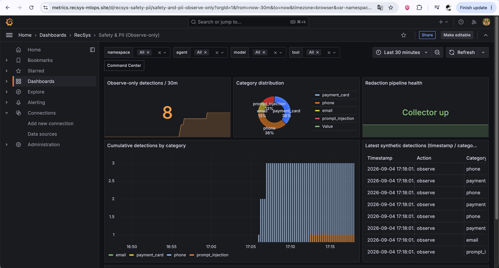

**Figure: observe-only safety dashboard.** The production view records eight detections across email, phone, payment-card, and prompt-injection categories while the Collector remains healthy. The table persists only timestamp, `action=observe`, and category; it does not expose the detected value or raw prompt. Dashboard implementation: [`safety-pii.json`](../../../infra/helm/recsys-observability/dashboards/safety-pii.json).

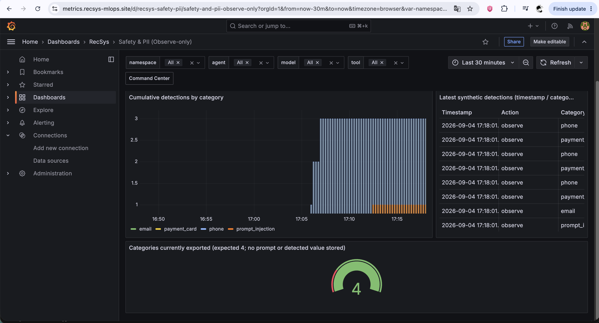

**Figure: all four safety categories exported.** The cumulative series and category-count gauge prove that the four required categories are present in Prometheus. This is the metric output of `count/safety` and the safety recording rules, not a request-blocking decision.

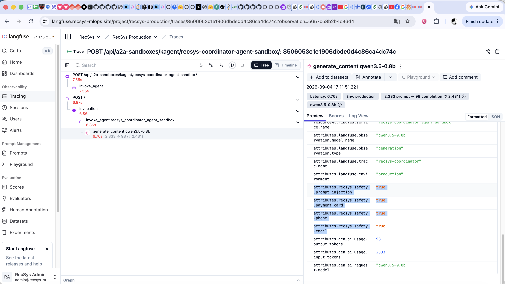

**Figure: Langfuse allowlisted safety metadata.** The selected coordinator generation contains only boolean `recsys.safety.*=true` flags for prompt injection, payment card, phone, and email together with permitted model/token metadata. No raw fixture value is visible, demonstrating that detection occurs before Langfuse persistence and that only allowlisted, redacted semantic data crosses the exporter boundary.

> **Privacy note:** the Grafana screenshots prove category counts without sensitive values; the Langfuse screenshot proves the corresponding per-request booleans. The absence of raw values is additionally enforced by [`transform/langfuse_semantic_redact`](../../../infra/helm/recsys-observability/templates/otel-collector.yaml#L75) and verified by the redaction contract test.

### Collector pipeline fan-out

The four signal pipelines are assembled in the Collector service configuration at [`otel-collector.yaml`](../../../infra/helm/recsys-observability/templates/otel-collector.yaml#L192):

```yaml
traces/operational:
  receivers: [otlp]
  processors:
    - memory_limiter
    - transform/agent_normalize
    - transform/operational_sanitize
    - batch
  exporters:
    - spanmetrics/agents
    - count/safety
    - otlp/tempo

traces/langfuse:
  receivers: [otlp]
  processors:
    - memory_limiter
    - filter/langfuse_self
    - transform/agent_normalize
    - transform/langfuse_semantic_redact
    - batch
  exporters: [otlphttp/langfuse]

logs:
  receivers: [otlp]
  processors: [memory_limiter, transform/safety_redact, batch]
  exporters: [otlp_http/loki]

metrics/derived:
  receivers: [spanmetrics/agents, count/safety]
  processors: [batch]
  exporters: [prometheus]
```

This fan-out is what connects one incoming agent span to all required observability views without changing the production request path.

### Tempo, Loki, and Langfuse linkage

Operational spans are exported to Tempo over OTLP gRPC:

```text
recsys-tempo.observability.svc.cluster.local:4317
```

Audit logs are sanitized and exported to Loki's OTLP endpoint:

```text
http://recsys-loki.observability.svc.cluster.local:3100/otlp
```

Langfuse semantic observations are exported to:

```text
http://langfuse-web.langfuse.svc.cluster.local:3000/api/public/otel
```

The Langfuse Authorization header is read from the `recsys-langfuse-otel` Kubernetes Secret. Terraform creates that namespace-scoped Secret at [`langfuse.tf`](../../../infra/terraform/gcp/modules/kubernetes-platform/langfuse.tf#L333); the key is not embedded in the Collector ConfigMap.

Langfuse web and worker also send their own operational traces to the Collector using OTLP HTTP. Their resource contains `recsys.telemetry.no_langfuse_export=true` in [`configs/langfuse/values-gcp.yaml`](../../../configs/langfuse/values-gcp.yaml#L112). `filter/langfuse_self` removes these spans from the Langfuse exporter branch while allowing operational analysis in Tempo/Prometheus. This prevents:

```text
Langfuse -> Collector -> Langfuse -> Collector -> ...
```

### Logs and trace correlation

Promtail runs as a DaemonSet, tails `/var/log/containers`, attaches namespace/pod/container labels, redacts sensitive patterns, and pushes logs to Loki. Configuration: [`loki-tempo-promtail.yaml`](../../../infra/helm/recsys-observability/templates/loki-tempo-promtail.yaml#L123).

Grafana provisions Prometheus, Loki, and Tempo data sources at [`grafana.yaml`](../../../infra/helm/recsys-observability/templates/grafana.yaml#L11).

The Prometheus datasource maps exemplar `trace_id` values to Tempo. Tempo's `tracesToLogsV2` configuration links the selected trace to Loki logs using the same trace ID. The resulting investigation flow is:

```text
agent latency/error metric in Grafana
  -> click trace exemplar
  -> inspect agent/tool spans in Tempo
  -> open logs carrying the same trace_id in Loki
  -> open the corresponding semantic agent/generation tree in Langfuse
```

### Dashboard evidence

Primary dashboard: [`agent-mcp-operations.json`](../../../infra/helm/recsys-observability/dashboards/agent-mcp-operations.json).

Supporting dashboards:

- [`safety-pii.json`](../../../infra/helm/recsys-observability/dashboards/safety-pii.json)
- [`traces-overview.json`](../../../infra/helm/recsys-observability/dashboards/traces-overview.json)
- [`logs-overview.json`](../../../infra/helm/recsys-observability/dashboards/logs-overview.json)
- [`langfuse-platform.json`](../../../infra/helm/recsys-observability/dashboards/langfuse-platform.json)
- [`ai-observability-command-center.json`](../../../infra/helm/recsys-observability/dashboards/ai-observability-command-center.json)

Expected agent/MCP panels include calls by coordinator/context/recommendation agent, success/failure, p95 duration, tool calls, MCP calls and failure ratio, MCP p95, retries, partial results, and the agent-to-tool matrix.

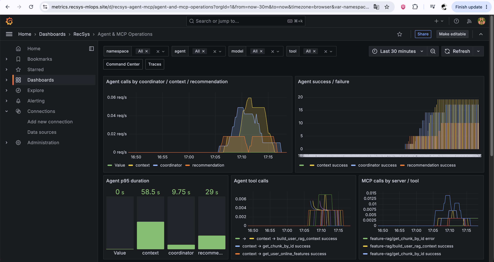

**Figure: agent and MCP operational overview.** Separate coordinator, context, and recommendation series prove successful identity normalization. The same view shows agent p95 duration, agent-to-tool activity, and MCP calls by server/tool, connecting `spanmetrics/agents` with the two MCP-native metric implementations.

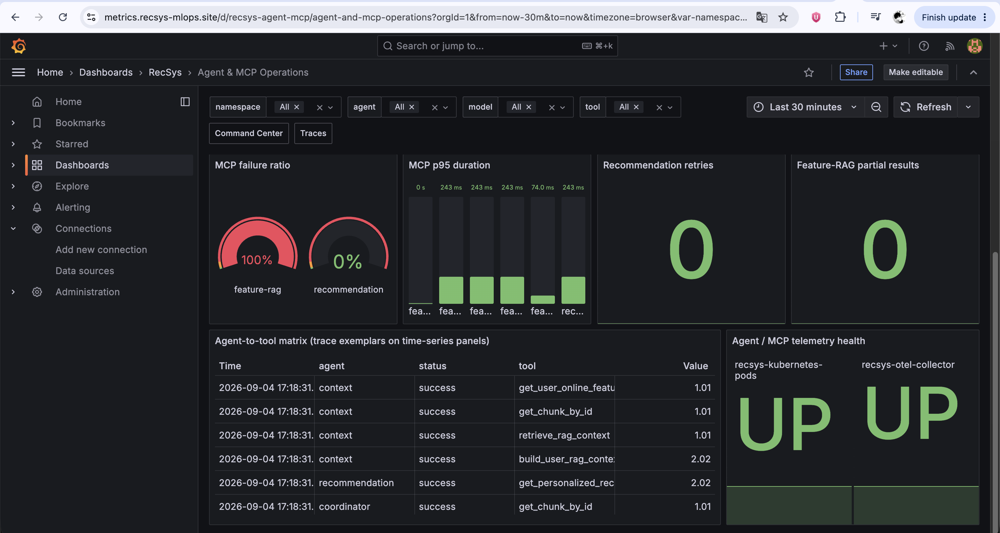

**Figure: MCP failure, latency, retry, partial-result, and agent-to-tool proof.** The deliberate missing-chunk fixture makes the Feature/RAG failure ratio visible while recommendation remains successful. The agent-to-tool table includes all four context tools, the recommendation tool, and a coordinator tool call; telemetry-health panels confirm that Kubernetes discovery and the OTel Collector were `UP` during capture.

> **Evidence note:** the non-zero Feature/RAG failure is an expected synthetic validation failure from [`coordinator_a2a_smoke()`](../../../jenkins/scripts/deploy/agentic/a2a.sh#L102), not a production incident. Zero recommendation retries and partial results are valid observed states for this bounded traffic window.

> **Screenshot placeholder — Traces and logs**
>
> Add a Tempo/Grafana screenshot of the kagent chain and a Loki screenshot showing correlated redacted logs.

### Langfuse production monitoring evidence

Use `https://langfuse.recsys-mlops.site`, select project **RecSys Production**, set `Environment = production`, and keep the timestamp produced by the refreshed traffic visible. Langfuse is the per-request semantic proof; the Grafana **Langfuse Platform** dashboard remains the SLO/ingestion-health proof.

| Capture | Langfuse navigation/filter | What must be visible | Implementation reference |
|---|---|---|---|
| Trace inventory | **Tracing -> Traces**, `Environment = production`, newest first | Separate recent `recsys-coordinator`, `recsys-context`, and `recsys-recommendation` rows; timestamps, duration and observation counts | Agent-name normalization and trace naming in [`transform/agent_normalize`](../../../infra/helm/recsys-observability/templates/otel-collector.yaml#L33) and [`transform/langfuse_semantic_redact`](../../../infra/helm/recsys-observability/templates/otel-collector.yaml#L75) |
| Coordinator trace tree | Open the newest `recsys-coordinator` trace | Parent coordinator span, specialist-agent calls, MCP/tool observations and model generations in the same hierarchy; success/failure state and duration | Collector maps agent/tool/generation types at [`otel-collector.yaml`](../../../infra/helm/recsys-observability/templates/otel-collector.yaml#L80); traffic contract is [`coordinator_a2a_smoke()`](../../../jenkins/scripts/deploy/agentic/a2a.sh#L102) |
| Context tool coverage | **Tracing -> Observations**, `Type = Tool`; filter/search the newest context trace | `get_user_online_features`, `get_chunk_by_id`, `retrieve_rag_context`, and `build_user_rag_context`, including a successful duration | The four tool calls are exercised by [`agentic_a2a_smoke()`](../../../jenkins/scripts/deploy/agentic/a2a.sh#L364); native counters are declared in [`recsys_feature_rag_mcp/observability.py`](../../../apps/agentic/recsys-feature-rag-mcp/src/recsys_feature_rag_mcp/observability.py#L5) |
| Recommendation generation | Open the newest `recsys-recommendation` trace and select its generation | Model name, latency, positive input/output/total tokens, generation status and its recommendation tool child/sibling observation | Recommendation smoke request is defined at [`recommendation_a2a_smoke()`](../../../jenkins/scripts/deploy/agentic/a2a.sh#L3); native MCP metrics are declared in [`recsys_recommendation_mcp/observability.py`](../../../apps/agentic/recsys-recommendation-mcp/src/recsys_recommendation_mcp/observability.py#L5) |
| Exact probe generation | **Tracing -> Observations**, `Type = Generation`, search `recsys-synthetic-llm-probe` | Completion start time for TTFT, round-trip duration and `16 / 2 / 18` input/output/total token usage from the latest probe | OTLP generation construction at [`llm_observability_probe.py`](../../../infra/helm/recsys-observability/files/llm_observability_probe.py#L145) |
| Privacy/redaction proof | Open the safety-fixture coordinator trace and inspect input/output metadata | Only redaction markers or allowlisted metadata; no raw email, phone, card, authorization header, user ID or session ID | Redaction precedes the allowlist at [`otel-collector.yaml`](../../../infra/helm/recsys-observability/templates/otel-collector.yaml#L101); contract test at [`test_safety_redaction_contract.py`](../../../tests/unit/observability/test_safety_redaction_contract.py#L42) |
| Langfuse ingestion health | Grafana **Langfuse Platform** dashboard, then link to Langfuse | Non-zero accepted/sent spans, exporter queue/capacity and `0` exporter error ratio; web/worker and ClickHouse/Keeper health | Dashboard JSON: [`langfuse-platform.json`](../../../infra/helm/recsys-observability/dashboards/langfuse-platform.json); exporter queue/retry config: [`otel-collector.yaml`](../../../infra/helm/recsys-observability/templates/otel-collector.yaml#L176) |

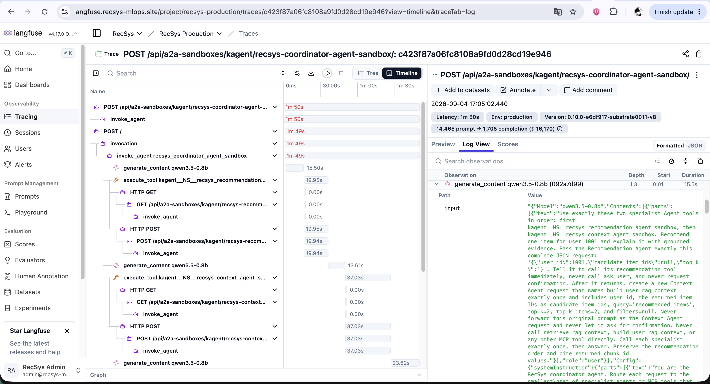

**Figure: top of the coordinator semantic trace.** The timeline begins at the coordinator A2A request and expands through coordinator generation, recommendation specialist delegation, HTTP/A2A transport spans, and subsequent context delegation. The right-side observation view exposes duration, environment, version, and aggregate token usage for the selected production trace.

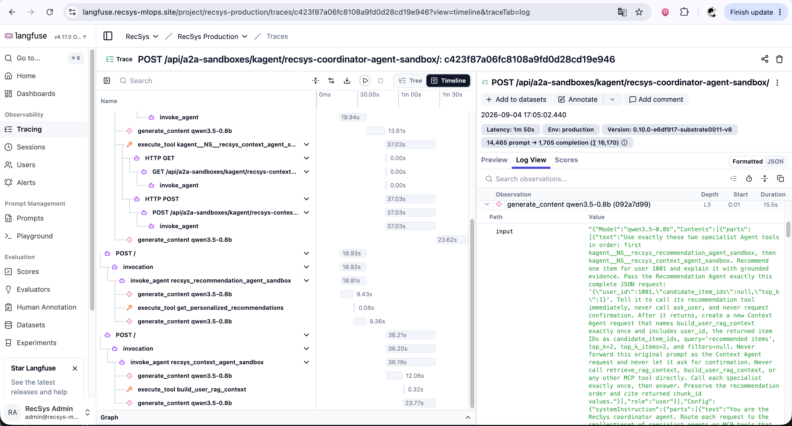

**Figure: coordinator to specialist, tool, and generation hierarchy.** The lower trace section makes the required semantic chain explicit: coordinator -> recommendation agent -> `get_personalized_recommendations` -> generation, followed by context agent -> `build_user_rag_context` -> generation. This is the strongest single proof that trace context survives nested A2A and MCP calls.

> **Controlled-fixture note:** the observation preview in the coordinator screenshots contains the synthetic smoke instruction and fixture identifier `1001`. It is coursework-generated test data, not a real customer identity. The dedicated safety proof above uses redacted content and boolean allowlisted flags to demonstrate the persistence boundary for PII fixtures.

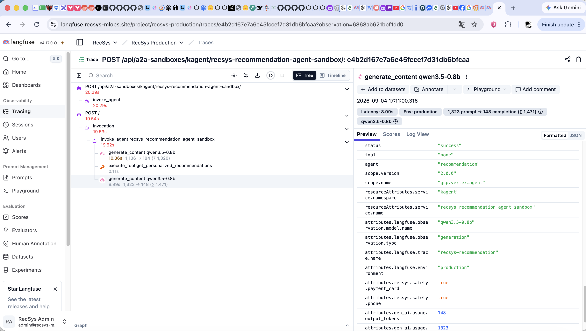

**Figure: recommendation generation and token usage.** The selected `qwen3.5-0.8b` generation shows `8.99s` latency, `1,323` prompt tokens, `148` completion tokens, `1,471` total tokens, `production` environment, success status, and its sibling `get_personalized_recommendations` tool observation.

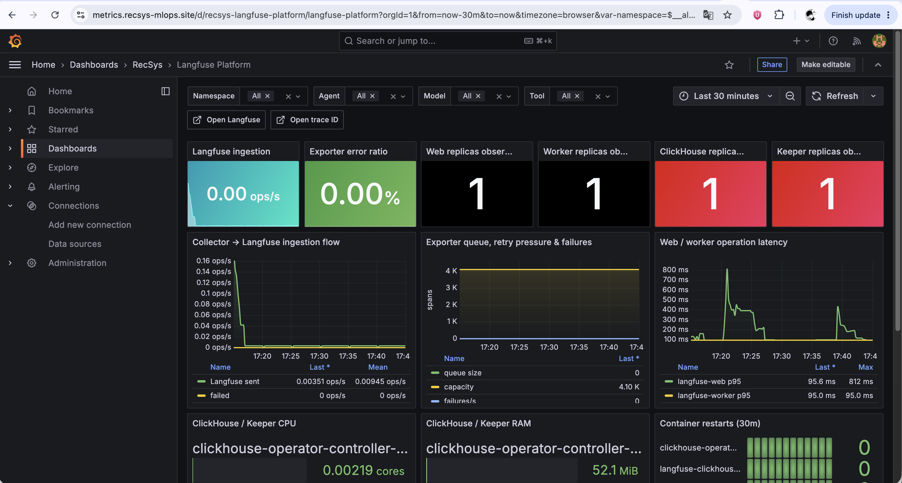

**Figure: Langfuse ingestion and datastore operational health.** Grafana records Collector-to-Langfuse sent/failed rates, a zero exporter error ratio, empty exporter queue against `4.10K` capacity, web/worker latency, replica observations, ClickHouse/Keeper resource use, and container restarts. This remains the SLO/transport proof, while the Langfuse screenshots above remain the per-request semantic proof.

> **Evidence note:** the screenshot reflects the currently deployed coursework-sized topology (`1` observed web, worker, ClickHouse, and Keeper replica), rather than claiming the larger HA target from the separate production architecture plan. The zero current ingestion stat is interpreted together with the non-zero historical `Langfuse sent` series and zero failures in the same `Last 30 minutes` window.

The separate synthetic-probe and safety-generation screenshots are embedded in the LLM and safety sections respectively so each image sits beside the Collector/probe configuration it proves. Together, the screenshots cover coordinator hierarchy, recommendation usage, exact TTFT, privacy flags, and exporter health without forcing all evidence into one unreadable frame.

---

## End-to-end request example

For one recommendation request, the complete signal flow is:

```text
1. Client calls the coordinator agent.
2. Coordinator calls context and recommendation agents.
3. Context calls Feature/RAG MCP.
4. Recommendation calls Recommendation MCP.
5. Agent/model traffic passes through agentgateway to llama.cpp.

In parallel:

- Web API middleware increments request, failure, and duration metrics.
- MCP servers increment tool, downstream, retry, and partial-result metrics.
- llama.cpp exposes native token and runtime counters per replica.
- agentgateway exposes gateway request/status/duration metrics.
- kagent emits agent/tool/model spans by OTLP gRPC.
- Collector normalizes identities and creates agent metrics from spans.
- Collector removes raw content for Tempo and redacts allowed content for Langfuse.
- Application stdout is redacted by Promtail before Loki ingestion.
- cAdvisor and Kubelet expose the CPU, RAM, filesystem, and network cost.
- Prometheus evaluates recording rules into the stable recsys_* contract.
- Grafana correlates metrics, traces, and logs through labels and trace IDs.
- Langfuse provides the semantic, per-request agent/tool/generation view.
```

The key integration mechanisms are therefore:

| Mechanism | Components linked |
|---|---|
| Kubernetes Service DNS | Workloads -> Collector, Tempo, Loki, Langfuse, Pushgateway |
| Prometheus pod annotations | API/MCP pods -> Prometheus discovery |
| Direct per-pod discovery | llama.cpp replicas -> Prometheus without counter mixing |
| OTLP `4317/4318` | kagent/API/probe/Langfuse -> Collector |
| Collector exporter `9464` | Span-derived agent/safety metrics -> Prometheus |
| Recording rules | Vendor/raw metrics -> stable dashboard contract |
| `service.name`, `agent`, `tool`, `status` labels | Aggregation across Collector and Prometheus |
| `trace_id` and exemplars | Grafana metric -> Tempo trace -> Loki logs |
| Langfuse self-export filter | Langfuse telemetry -> operational pipeline without ingestion loop |
| Redaction and attribute allowlists | In-memory telemetry -> safe persistent storage |

## Grafana provisioning

Dashboard JSON files are packaged as Kubernetes ConfigMaps by [`grafana.yaml`](../../../infra/helm/recsys-observability/templates/grafana.yaml#L43). The file provider loads them into the `RecSys` folder and checks for updates every 30 seconds.

All principal dashboards use a 15-second refresh and a default `Last 30 minutes` time range. The principal data sources are provisioned with stable UIDs:

```text
Prometheus -> uid Prometheus -> http://recsys-prometheus:9090
Loki       -> uid Loki       -> http://recsys-loki:3100
Tempo      -> uid Tempo      -> http://recsys-tempo:3200
```

This makes the dashboard JSON portable across Grafana pod recreation and avoids depending on manually created datasource IDs.
