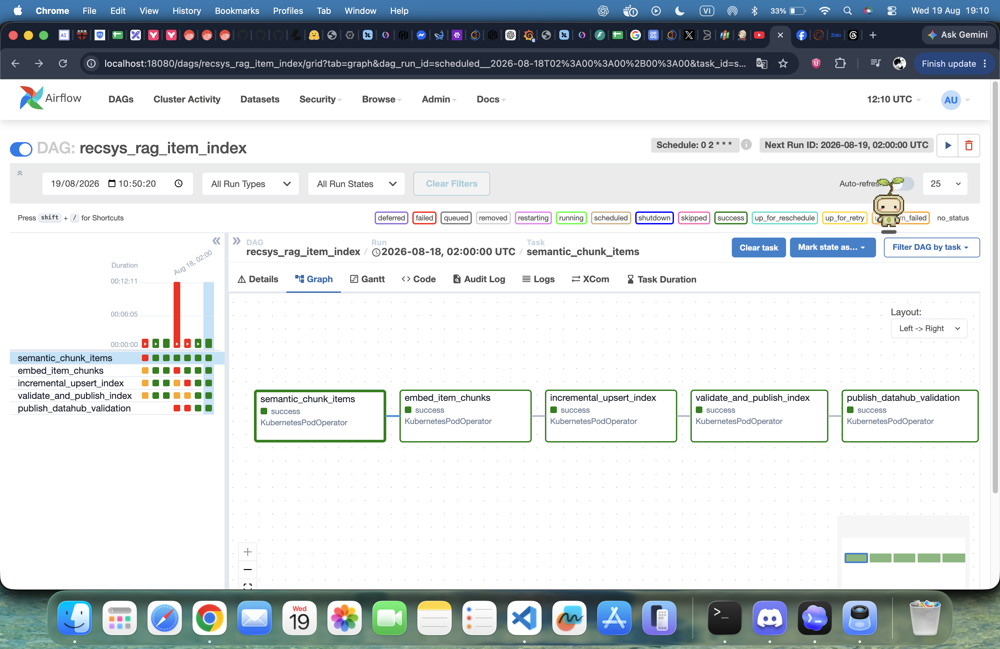
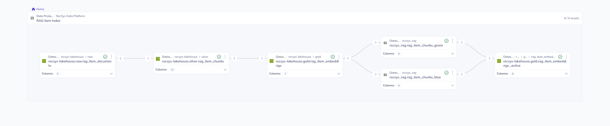
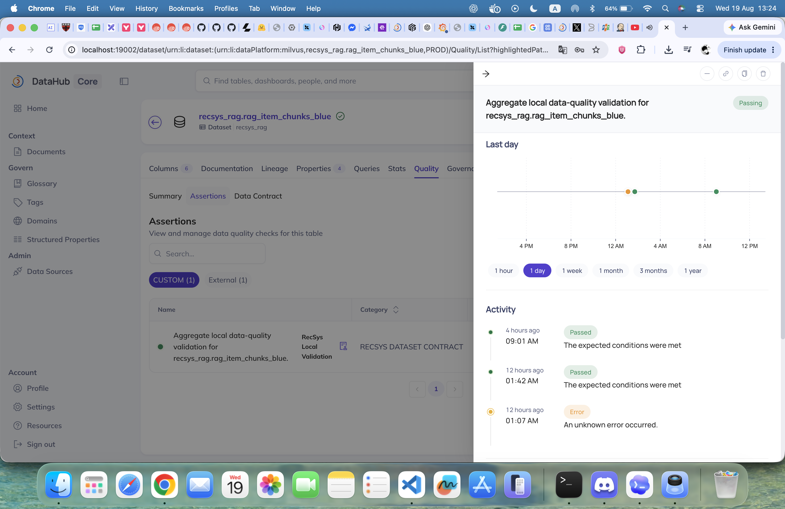

# RAG Data Pipeline: Evidence, Data Generation, Semantic Chunking, Embeddings, and Feast/Milvus Publication

This document presents the implementation evidence and end-to-end data flow for the RecSys RAG item index. It covers the user-visible Airflow and DataHub proofs, the canonical item metadata generator, semantic chunking, offline embedding generation, incremental index publication, and the final Feast online store backed by Milvus.

> **Sample-data note:** JSON and vector samples below are shortened, human-readable examples that conform to the repository contracts. Hashes, timestamps, run IDs, generated prose, and vector values vary between real runs.

## 1. Pipeline identity and scope

The system uses two separate run identifiers:

| Identifier | Purpose | Artifact scope |
|---|---|---|
| `source_run_id` | Identifies one canonical metadata-generation run | `raw/<source_run_id>/rag_item_documents/` |
| `pipeline_run_id` | Identifies the chunk, embedding, index candidate, and publication run | `silver/<pipeline_run_id>/...` and `gold/<pipeline_run_id>/...` |

The canonical data generator is deployed as a Kubernetes Job. The Airflow DAG consumes a **completed** canonical `source_run_id` and performs the downstream sequence:

```text
PostgreSQL products + generated text
    -> canonical item documents (raw)
    -> semantic item chunks (silver)
    -> normalized 384-D embeddings (gold)
    -> Feast native online-store upsert
    -> Milvus blue/green validation
    -> atomic active-pointer promotion
    -> DataHub validation publication
```

Primary orchestration references:

- [Kubernetes metadata-generator Job command](../../../infra/helm/recsys-rag-data/templates/item-metadata-job.yaml#L38-L65)
- [Airflow RAG DAG parameters and task chain](../../../apps/data-platform/src/orchestration/airflow/dags/recsys_rag_item_index.py#L31-L84)
- [Public CLI commands used by the Job and DAG](../../../apps/data-platform/src/rag_data/cli.py#L43-L105)

## 2. Airflow UI image proof



**Image note.** The screenshot shows the Airflow graph view for the `recsys_rag_item_index` DAG. In the selected run, all five KubernetesPodOperator tasks are green and marked `success`, in the same dependency order implemented in the DAG:

1. `semantic_chunk_items`
2. `embed_item_chunks`
3. `incremental_upsert_index`
4. `validate_and_publish_index`
5. `publish_datahub_validation`

The historical grid on the left contains earlier failed/retried states, while the selected run shown in the graph completed all five stages successfully. This is useful operational evidence that a failed stage can be rerun and that the final successful run reaches index validation and DataHub publication.

Code references:

- [Task commands](../../../apps/data-platform/src/orchestration/airflow/dags/recsys_rag_item_index.py#L50-L76)
- [Explicit task dependency chain](../../../apps/data-platform/src/orchestration/airflow/dags/recsys_rag_item_index.py#L78-L84)

## 3. DataHub UI image proof

### 3.1 RAG Item Index lineage



**Image note.** The DataHub Data Product lineage view shows the `RAG Item Index` product with all six registered assets present (`6 / 6 assets`). The visual lineage follows the production data zones and serving targets:

```text
recsys-lakehouse.raw.rag_item_documents
    -> recsys-lakehouse.silver.rag_item_chunks
    -> recsys-lakehouse.gold.rag_item_embeddings
       -> recsys-lakehouse.gold.rag_item_embeddings._active
       -> recsys_rag.rag_item_chunks_blue
       -> recsys_rag.rag_item_chunks_green
```

The first three assets demonstrate raw-to-silver-to-gold transformation. The `_active` asset represents the serving pointer, while the two Milvus datasets represent the blue/green Feast online-store slots used for safe promotion and rollback.

Code references:

- [Raw, silver, gold, blue, green, and active-pointer validation keys](../../../apps/data-platform/src/orchestration/airflow/dags/recsys_rag_item_index.py#L20-L28)
- [Artifact storage prefixes and active-pointer key](../../../apps/data-platform/src/rag_data/artifact_storage.py#L98-L120)
- [Blue/green Feast FeatureViews](../../../apps/data-platform/feature-store/rag_feature_repo/rag_feature_definitions.py#L30-L66)

### 3.2 Milvus blue-slot quality history



**Image note.** The DataHub Quality assertion drawer for `recsys_rag.rag_item_chunks_blue` is currently `Passing`. Its activity timeline also preserves an earlier error and later successful executions. This proves that validation status is recorded historically rather than only displaying the latest result.

The underlying validation checks compare the physical Milvus candidate against the authoritative gold artifact: exact row count, exact `chunk_id` set, vector-search smoke test, and optional expected item count.

Code references:

- [Exact candidate validation](../../../apps/data-platform/src/rag_data/index_lifecycle.py#L174-L208)
- [Validation report generation for raw, silver, gold, blue, green, and active pointer](../../../apps/data-platform/src/rag_data/cli.py#L296-L437)

### 3.3 Milvus blue-slot data contract


**Image note.** The Data Contract tab for `recsys_rag.rag_item_chunks_blue` states that the dataset is meeting its contract and that all contract assertions are passing. The screenshot connects the physical Milvus serving dataset to an explicit, visible governance contract.

The contract is supported by strict producer-side models: unknown fields are rejected, chunks require valid hashes and a `passage: ` prefix, and embeddings must be finite, normalized, and exactly 384 dimensions.

Code references:

- [Strict chunk contract](../../../apps/data-platform/src/rag_data/pipeline_contracts.py#L25-L55)
- [Strict embedded-chunk contract](../../../apps/data-platform/src/rag_data/pipeline_contracts.py#L58-L73)

## 4. RAG data generator

### 4.1 Generator responsibility

The generator creates one canonical RAG document per active product. It deliberately separates:

- **Trusted deterministic metadata:** item ID, SKU, brand, taxonomy, source price, stock, warehouse, warranty, review IDs, ratings, and aggregates.
- **LLM-generated text:** title, description, specifications, usage instructions, two review texts, and one Q&A pair.

The LLM cannot author filterable identifiers or overwrite trusted catalog facts. The generated payload is accepted only after strict schema validation.

### 4.2 Generator metadata contract

The final canonical document has three top-level blocks:

```text
CanonicalItemDocument
├── item_id
├── sku
├── structured_metadata
│   ├── brand
│   ├── category_path
│   ├── current_price
│   ├── in_stock
│   ├── stock_quantity
│   ├── warranty_months
│   └── warehouse_location
├── unstructured_text
│   ├── title
│   ├── description
│   ├── specifications
│   └── usage_instructions
└── reviews_and_qna
    ├── average_rating
    ├── total_reviews
    ├── sample_reviews[2]
    └── qna_pairs[1]
```

Contract references:

- [Generated LLM content schema](../../../apps/data-platform/src/rag_data/contracts.py#L59-L91)
- [Trusted structured metadata schema](../../../apps/data-platform/src/rag_data/contracts.py#L94-L103)
- [Canonical document schema](../../../apps/data-platform/src/rag_data/contracts.py#L106-L142)

### 4.3 Step-by-step metadata generation

#### Generator step 1 — Read active source products

`PostgresProductSource` performs a read-only query against `products`, selects only active rows, optionally filters by item IDs, and returns rows in deterministic `product_id` order.

Reference: [PostgreSQL product reader](../../../apps/data-platform/src/rag_data/generator.py#L77-L134).

Sample input row:

```json
{
  "product_id": 800000,
  "product_name": "Continuous Product 800000",
  "category_id": 9000,
  "category_code": "cat-9000",
  "brand_id": 8000,
  "brand_name": "Brand 8000",
  "current_price": "20.99",
  "is_active": true,
  "updated_ts": "2026-08-19T01:00:00Z"
}
```

Output metadata after this step:

```json
{
  "source_item_id": 800000,
  "source_active": true,
  "source_price": "20.99",
  "source_category_id": 9000,
  "source_brand_id": 8000
}
```

#### Generator step 2 — Resolve deterministic catalog metadata

`CatalogMapping` resolves configured brand and category IDs. Unknown mappings fail the item instead of inventing filter values. Stable rules derive SKU, stock, warehouse, warranty, review ratings, average rating, and review count.

For the sample item:

```text
brand             = brands[8000] = Sony
category_path     = categories[9000]
sku               = SONY-HEADPHONES-800000
stock_quantity    = 10 + (800000 mod 91) = 29
warehouse         = warehouses[800000 mod 3] = DAD-01
warranty_months   = 24
average_rating    = 4.0 + (800000 mod 10) / 10 = 4.0
total_reviews     = 50 + (800000 mod 451) = 427
```

References:

- [Catalog configuration](../../../configs/data-platform/rag/item_metadata.yaml#L17-L44)
- [Stable catalog mapping rules](../../../apps/data-platform/src/rag_data/catalog_mapping.py#L58-L145)

Output metadata after this step:

```json
{
  "item_id": 800000,
  "sku": "SONY-HEADPHONES-800000",
  "brand": "Sony",
  "category_path": [
    "Điện tử",
    "Thiết bị âm thanh",
    "Tai nghe over-ear"
  ],
  "current_price": "20.99",
  "in_stock": true,
  "stock_quantity": 29,
  "warranty_months": 24,
  "warehouse_location": "DAD-01",
  "average_rating": 4.0,
  "total_reviews": 427
}
```

#### Generator step 3 — Build a grounded LLM request

The user prompt includes only the source item ID, source product name, mapped brand, mapped category path, source price, and the synthetic-demo policy. The system prompt requires a strict six-field JSON object and explicitly forbids generated IDs, SKU, price, inventory, brand, and taxonomy at the top level.

Reference: [Versioned generation prompts](../../../apps/data-platform/src/rag_data/prompts.py#L14-L58).

Sample grounded request metadata:

```json
{
  "source_item_id": 800000,
  "source_product_name": "Continuous Product 800000",
  "mapped_brand": "Sony",
  "mapped_category_path": [
    "Điện tử",
    "Thiết bị âm thanh",
    "Tai nghe over-ear"
  ],
  "source_current_price": "20.99",
  "content_policy": "synthetic_demo_not_verified_product_facts"
}
```

#### Generator step 4 — Generate and validate textual content

`OrcaRouterClient` requests a strict JSON-schema response. It classifies terminal HTTP failures, retries rate limits and supported transient errors, and adds a repair turn when the response is invalid JSON or violates the Pydantic schema.

References:

- [Generation model, attempts, and timeout configuration](../../../configs/data-platform/rag/item_metadata.yaml#L4-L10)
- [Strict response-format request and retry/repair flow](../../../apps/data-platform/src/rag_data/orcarouter_client.py#L132-L235)

Sample validated generated output:

```json
{
  "title": "Tai nghe Sony chống ồn synthetic",
  "description": "Mẫu tai nghe over-ear synthetic có đệm tai êm và chế độ chống ồn cho nhu cầu nghe hằng ngày.",
  "specifications": {
    "battery": "30 giờ",
    "weight": "250 g",
    "connectivity": "Bluetooth"
  },
  "usage_instructions": "Giữ nút nguồn để bật và đưa tai nghe vào chế độ ghép đôi.",
  "reviews": [
    {
      "content": "Đeo êm và chống ồn tốt.",
      "sentiment_aspects": {"comfort": "positive", "noise_cancelling": "positive"}
    },
    {
      "content": "Bass vừa phải và dễ nghe.",
      "sentiment_aspects": {"bass": "neutral"}
    }
  ],
  "qna_pairs": [
    {
      "question": "Có hỗ trợ Bluetooth không?",
      "answer": "Có, nội dung synthetic mô tả sản phẩm hỗ trợ kết nối Bluetooth."
    }
  ]
}
```

#### Generator step 5 — Compose the canonical document

`compose_document()` merges validated generated text with deterministic catalog facts. Review IDs and ratings are generated locally, so even the review identity remains stable across retries.

Reference: [Canonical composition](../../../apps/data-platform/src/rag_data/generator.py#L137-L178).

#### Generator step 6 — Isolate failures, checkpoint, and resume

Each product is processed independently. A failed item produces a serializable `FailureRecord`; it does not discard successful items. The run periodically replaces its run-scoped `items.jsonl`, `failures.jsonl`, and `manifest.json` checkpoints in deterministic item-ID order.

When the same compatible run resumes:

- Successfully completed item IDs are skipped.
- Previously failed item IDs remain pending and can succeed on retry.
- A successful retry clears the older failure record.
- A different model, prompt version, or catalog-mapping version requires `--force`.
- A completed run is protected from accidental overwrite.

References:

- [Per-item generation isolation and run loop](../../../apps/data-platform/src/rag_data/generator.py#L181-L321)
- [Resume compatibility and raw checkpoint writes](../../../apps/data-platform/src/rag_data/storage.py#L111-L219)

Sample completed generator manifest:

```json
{
  "dataset_type": "rag_item_documents",
  "schema_version": 1,
  "catalog_mapping_version": "catalog_mapping_v1",
  "synthetic_catalog": true,
  "grounding_level": "llm_generated_from_source_ids_and_mapped_taxonomy",
  "run_id": "rag-source-20260819",
  "status": "complete",
  "source_count": 1,
  "generated_count": 1,
  "failed_count": 0,
  "finish_reason_counts": {"stop": 1},
  "model": "deepseek/deepseek-v4-pro",
  "prompt_version": "rag_item_content_v1"
}
```

### 4.4 Sample final canonical metadata

The final raw-zone item is written as one JSON line beneath:

```text
raw/rag-source-20260819/rag_item_documents/items.jsonl
```

Sample final record:

```json
{
  "item_id": 800000,
  "sku": "SONY-HEADPHONES-800000",
  "structured_metadata": {
    "brand": "Sony",
    "category_path": [
      "Điện tử",
      "Thiết bị âm thanh",
      "Tai nghe over-ear"
    ],
    "current_price": "20.99",
    "in_stock": true,
    "stock_quantity": 29,
    "warranty_months": 24,
    "warehouse_location": "DAD-01"
  },
  "unstructured_text": {
    "title": "Tai nghe Sony chống ồn synthetic",
    "description": "Mẫu tai nghe over-ear synthetic có đệm tai êm và chế độ chống ồn cho nhu cầu nghe hằng ngày.",
    "specifications": {
      "battery": "30 giờ",
      "connectivity": "Bluetooth",
      "weight": "250 g"
    },
    "usage_instructions": "Giữ nút nguồn để bật và đưa tai nghe vào chế độ ghép đôi."
  },
  "reviews_and_qna": {
    "average_rating": 4.0,
    "total_reviews": 427,
    "sample_reviews": [
      {
        "review_id": "rev_800000_01",
        "rating": 5,
        "content": "Đeo êm và chống ồn tốt.",
        "sentiment_aspects": {"comfort": "positive", "noise_cancelling": "positive"}
      },
      {
        "review_id": "rev_800000_02",
        "rating": 4,
        "content": "Bass vừa phải và dễ nghe.",
        "sentiment_aspects": {"bass": "neutral"}
      }
    ],
    "qna_pairs": [
      {
        "question": "Có hỗ trợ Bluetooth không?",
        "answer": "Có, nội dung synthetic mô tả sản phẩm hỗ trợ kết nối Bluetooth."
      }
    ]
  }
}
```

## 5. RAG data pipeline: step-by-step implementation

### 5.1 Pipeline overview

| Pipeline step | Input | Main operation | Output |
|---|---|---|---|
| 1. Raw input gate | Complete canonical source run | Validate manifest, count, and unique item IDs | Validated canonical items |
| 2. Semantic chunking | Canonical items | Hard section boundaries plus semantic sentence breaks | Silver `ItemChunk` records |
| 3. Embedding | Silver chunks | Local E5 ONNX mean pooling and L2 normalization | Gold `EmbeddedItemChunk` records |
| 4. Publish decision | Current gold plus active gold run | Safe incremental upsert or inactive-slot reconciliation | Milvus candidate |
| 5. Candidate validation | Gold records plus physical Milvus slot | Exact IDs/count and retrieval smoke search | Validated `IndexManifest` |
| 6. Promotion | Valid candidate plus current pointer ETag | Compare-and-swap active pointer | New active Feast FeatureView |
| Post-pipeline governance | Validation report | Publish dataset results to DataHub | Visible lineage/assertions/contracts |

### 5.2 Pipeline step 1 — Validate and load the raw source run

The chunk stage refuses to consume an incomplete canonical run. It validates:

- `manifest.status == "complete"`
- JSONL record count equals `generated_count`
- Item IDs are unique

Reference: [Complete raw-run loading contract](../../../apps/data-platform/src/rag_data/artifact_storage.py#L122-L148).

Sample input metadata:

```json
{
  "source_run_id": "rag-source-20260819",
  "status": "complete",
  "generated_count": 160,
  "failed_count": 0
}
```

Sample output metadata after loading:

```json
{
  "validated_source_run_id": "rag-source-20260819",
  "canonical_item_count": 160,
  "unique_item_ids": 160,
  "ready_for_chunking": true
}
```

### 5.3 Pipeline step 2 — Render hard-boundary source units

Each canonical item is rendered into independent semantic source units:

1. `product_overview`: title plus description
2. `specifications`: key-sorted specification lines
3. `usage_instructions`
4. One `review` unit per stable review ID
5. One `qna` unit per Q&A pair

Sections never cross boundaries, so a review is never merged into specifications or product overview text.

Reference: [Source-unit rendering](../../../apps/data-platform/src/rag_data/semantic_chunker.py#L56-L78).

Sample output units for item `800000`:

```json
[
  {
    "chunk_type": "product_overview",
    "source_key": "overview",
    "text": "Tai nghe Sony chống ồn synthetic\nMẫu tai nghe over-ear synthetic có đệm tai êm..."
  },
  {
    "chunk_type": "specifications",
    "source_key": "specifications",
    "text": "battery: 30 giờ\nconnectivity: Bluetooth\nweight: 250 g"
  },
  {
    "chunk_type": "usage_instructions",
    "source_key": "usage",
    "text": "Giữ nút nguồn để bật và đưa tai nghe vào chế độ ghép đôi."
  },
  {
    "chunk_type": "review",
    "source_key": "rev_800000_01",
    "text": "Đeo êm và chống ồn tốt."
  },
  {
    "chunk_type": "review",
    "source_key": "rev_800000_02",
    "text": "Bass vừa phải và dễ nghe."
  },
  {
    "chunk_type": "qna",
    "source_key": "qna_01",
    "text": "Hỏi: Có hỗ trợ Bluetooth không?\nĐáp: Có, nội dung synthetic mô tả sản phẩm hỗ trợ kết nối Bluetooth."
  }
]
```

### 5.4 Pipeline step 3 — Apply structure-aware semantic chunking

Current chunking configuration:

```yaml
strategy: structure_aware_semantic
version: semantic_chunker_v1
target_tokens: 240
min_tokens: 80
max_tokens: 384
overlap_tokens: 32
breakpoint_percentile: 20
```

Reference: [Chunking configuration](../../../configs/data-platform/rag/pipeline.yaml#L3-L10).

For a short source unit, the unit stays atomic. For a long unit, the chunker:

1. Splits text into sentences.
2. Embeds adjacent sentences using the shared encoder.
3. Computes adjacent cosine similarity as the dot product of normalized vectors.
4. Treats similarities in the lowest configured percentile as natural topic transitions.
5. Breaks only when the current chunk is sufficiently large, reaches the target, or would exceed the hard limit.
6. Copies up to 32 tokens of whole-sentence overlap into the next chunk.
7. Never crosses the source-unit boundary.

The final embedding context is prepended before enforcing the 384-token limit:

```text
passage: Tiêu đề: Tai nghe Sony chống ồn synthetic.
Thương hiệu: Sony.
Danh mục: Điện tử > Thiết bị âm thanh > Tai nghe over-ear.
<source-unit text>
```

Volatile hard constraints such as price and stock remain scalar metadata instead of changing semantic meaning.

References:

- [Semantic breakpoint and bounded-split algorithm](../../../apps/data-platform/src/rag_data/semantic_chunker.py#L88-L160)
- [Stable chunk IDs, embedding context, hashes, and scalar metadata](../../../apps/data-platform/src/rag_data/semantic_chunker.py#L162-L220)

Sample silver chunk output:

```json
{
  "chunk_id": "800000:product_overview:overview:0",
  "item_id": 800000,
  "chunk_type": "product_overview",
  "source_key": "overview",
  "chunk_index": 0,
  "text": "Tai nghe Sony chống ồn synthetic Mẫu tai nghe over-ear synthetic có đệm tai êm...",
  "embedding_text": "passage: Tiêu đề: Tai nghe Sony chống ồn synthetic. Thương hiệu: Sony. Danh mục: Điện tử > Thiết bị âm thanh > Tai nghe over-ear.\nTai nghe Sony chống ồn synthetic Mẫu tai nghe over-ear synthetic có đệm tai êm...",
  "token_count": 57,
  "content_hash": "sha256:9d8f...",
  "item_content_hash": "sha256:53ae...",
  "brand": "Sony",
  "category_l1": "Điện tử",
  "category_l2": "Thiết bị âm thanh",
  "category_l3": "Tai nghe over-ear",
  "current_price": 20.99,
  "in_stock": true,
  "average_rating": 4.0,
  "source_run_id": "rag-source-20260819",
  "event_timestamp": "2026-08-19T02:00:00Z"
}
```

Stable key and change-detection behavior:

```text
chunk_id          = item_id:chunk_type:source_key:part_index
content_hash      = SHA-256(normalized chunk text)
item_content_hash = SHA-256(canonical full-item JSON)
```

The stable ID permits an edited chunk to overwrite the same online entity. The hashes allow manifests to detect item changes without using content as the entity key.

Silver artifact metadata:

```json
{
  "dataset_type": "rag_item_chunks",
  "run_id": "rag-pipeline-20260819",
  "source_run_id": "rag-source-20260819",
  "status": "complete",
  "record_count": 960,
  "unique_item_count": 160,
  "failed_count": 0,
  "chunker_version": "semantic_chunker_v1",
  "embedding_model": "intfloat/multilingual-e5-small",
  "embedding_dimension": 384,
  "content_hashes": {
    "800000": "sha256:53ae..."
  }
}
```

The stage checkpoints partial Parquet output and skips already completed item IDs when the same compatible pipeline run resumes.

Reference: [Idempotent canonical-to-silver runner](../../../apps/data-platform/src/rag_data/pipeline.py#L18-L117).

### 5.5 Pipeline step 4 — Generate normalized embeddings

The encoder is a local, image-packaged, quantized ONNX version of `intfloat/multilingual-e5-small`. Runtime downloads are disabled. The CLI verifies the model artifact against the pinned SHA-256 checksum before loading it.

Embedding contract:

```text
input text
    -> exact packaged tokenizer
    -> ONNX hidden states
    -> attention-mask mean pooling
    -> L2 normalization
    -> finite 384-D float vector
```

The indexed text uses the E5 passage prefix `passage: `. Online user queries use the asymmetric `query: ` prefix with the same model and revision.

References:

- [Pinned model, revision, checksum, prefixes, and dimension](../../../configs/data-platform/rag/pipeline.yaml#L12-L22)
- [Local tokenizer, ONNX inference, mean pooling, and normalization](../../../apps/data-platform/rag-runtime/src/recsys_rag_runtime/embedding.py#L41-L112)
- [Batch-size fallback](../../../apps/data-platform/rag-runtime/src/recsys_rag_runtime/embedding.py#L115-L132)

Sample gold embedding output:

```json
{
  "chunk_id": "800000:product_overview:overview:0",
  "item_id": 800000,
  "chunk_type": "product_overview",
  "text": "Tai nghe Sony chống ồn synthetic Mẫu tai nghe over-ear synthetic có đệm tai êm...",
  "embedding": [0.0312, -0.0121, 0.0070, "... 381 more float32 values ..."],
  "content_hash": "sha256:9d8f...",
  "item_content_hash": "sha256:53ae...",
  "brand": "Sony",
  "current_price": 20.99,
  "in_stock": true
}
```

Gold artifact metadata:

```json
{
  "dataset_type": "rag_item_embeddings",
  "run_id": "rag-pipeline-20260819",
  "source_run_id": "rag-source-20260819",
  "status": "complete",
  "record_count": 960,
  "unique_item_count": 160,
  "chunker_version": "semantic_chunker_v1",
  "embedding_model": "intfloat/multilingual-e5-small",
  "embedding_revision": "03415a4be176a1620747c692ed433219fabc3def",
  "embedding_dimension": 384,
  "model_checksum": "sha256:8da4c9ba0ad59f58e8566839425d7fd6339d31414d0ce5cba2d7d0afb75dd8b6"
}
```

The gold stage checkpoints completed `chunk_id` values. A rerun of the same compatible run embeds only missing chunks. A new pipeline run still produces a complete gold artifact; cross-run incrementality is applied at the Milvus publication step.

Reference: [Idempotent silver-to-gold embedding runner](../../../apps/data-platform/src/rag_data/pipeline.py#L120-L198).

### 5.6 Pipeline step 5 — Decide incremental upsert or full reconciliation

The publisher compares the new gold manifest with the gold run referenced by the current active pointer.

| Condition | Publication mode | Target | Reason |
|---|---|---|---|
| First publication or explicit `reconcile` | Full reconciliation | Inactive slot | No safe active baseline or explicit rebuild |
| Chunker/model/revision/dimension changed | Full reconciliation | Inactive slot | Vector/index contract changed |
| Item deleted | Full reconciliation | Inactive slot | Native upsert cannot delete stale rows |
| Changed item lost one or more old `chunk_id` values | Full reconciliation | Inactive slot | Prevent orphaned stale chunks |
| New item, changed content, or chunk growth without old-ID loss | Incremental upsert | Active slot | Stable keys can be inserted/overwritten safely |
| No item changed | Incremental no-op | Active slot | No records require writing |

For safe incremental publication, all records belonging to changed or new items are written. Unchanged items are not rewritten.

For reconciliation, the inactive slot is reset and the complete current gold dataset is written. The active slot is never dropped, preserving immediate rollback capability.

References:

- [Incremental/reconciliation decision](../../../apps/data-platform/src/rag_data/index_lifecycle.py#L68-L128)
- [Candidate write without implicit promotion](../../../apps/data-platform/src/rag_data/index_lifecycle.py#L131-L171)

Sample publication decision:

```json
{
  "requested_mode": "incremental",
  "resolved_mode": "incremental",
  "active_slot": "blue",
  "target_slot": "blue",
  "reason": "safe_native_upsert",
  "changed_item_ids": [800000, 800017],
  "upsert_record_count": 12
}
```

Sample candidate index metadata:

```json
{
  "pipeline_run_id": "rag-pipeline-20260819",
  "slot": "blue",
  "feature_view": "rag_item_chunks_blue",
  "collection_name": "recsys_rag_rag_item_chunks_blue",
  "status": "candidate",
  "vector_count": 960,
  "unique_item_count": 160,
  "embedding_dimension": 384,
  "retrieval_smoke_passed": false
}
```

### 5.7 Pipeline step 6 — Publish through Feast into the Milvus online store

`FeastMilvusPublisher` converts embedded chunk contracts to a DataFrame and writes them through Feast's native online-store API:

```python
self.store.write_to_online_store(
    feature_view_name=self.feature_view(slot),
    df=frame,
)
```

`chunk_id` is the Feast entity join key, so changed content overwrites the same online entity. Blue and green FeatureViews have identical schemas and separate physical collections.

References:

- [Feast-native upsert implementation](../../../apps/data-platform/src/rag_data/feast_publisher.py#L71-L111)
- [Stable chunk entity and vector-enabled FeatureViews](../../../apps/data-platform/feature-store/rag_feature_repo/rag_feature_definitions.py#L14-L66)

### 5.8 Pipeline step 7 — Validate the candidate and atomically promote it

The validation stage obtains the complete expected ID set from the gold Parquet artifact and compares it with the physical Milvus collection. Promotion requires:

```text
actual Milvus count == complete gold record count
actual Milvus IDs   == complete gold chunk_id set
COSINE smoke search returns at least one result
optional expected item count matches
```

On failure, the index manifest becomes `failed` and the active pointer remains unchanged. On success, the candidate becomes `published`, and an ETag compare-and-swap updates the singleton active pointer. If another publisher changed the pointer in the meantime, the stale promotion is rejected.

References:

- [Physical Milvus count, ID decoding, and smoke search](../../../apps/data-platform/src/rag_data/feast_publisher.py#L113-L165)
- [Validation and active-pointer construction](../../../apps/data-platform/src/rag_data/index_lifecycle.py#L174-L244)
- [ETag compare-and-swap commit](../../../apps/data-platform/src/rag_data/artifact_storage.py#L272-L309)

Sample validated index metadata:

```json
{
  "pipeline_run_id": "rag-pipeline-20260819",
  "slot": "blue",
  "feature_view": "rag_item_chunks_blue",
  "collection_name": "recsys_rag_rag_item_chunks_blue",
  "status": "published",
  "vector_count": 960,
  "unique_item_count": 160,
  "embedding_dimension": 384,
  "retrieval_smoke_passed": true,
  "validated_at": "2026-08-19T02:12:11Z"
}
```

Sample active-pointer output:

```json
{
  "active_slot": "blue",
  "feature_view": "rag_item_chunks_blue",
  "pipeline_run_id": "rag-pipeline-20260819",
  "source_run_id": "rag-source-20260819",
  "chunker_version": "semantic_chunker_v1",
  "embedding_model": "intfloat/multilingual-e5-small",
  "embedding_revision": "03415a4be176a1620747c692ed433219fabc3def",
  "embedding_dimension": 384,
  "published_at": "2026-08-19T02:12:11Z",
  "previous_slot": "green",
  "previous_pipeline_run_id": "rag-pipeline-20260818"
}
```

### 5.9 Final online-store configuration — Feast backed by Milvus

The final serving configuration explicitly selects Milvus as Feast's online store:

```yaml
online_store:
  type: milvus
  host: ${MILVUS_HOST}
  port: 19530
  username: ${MILVUS_USERNAME}
  password: ${MILVUS_PASSWORD}
  vector_enabled: true
  embedding_dim: 384
  index_type: FLAT
  metric_type: COSINE
  varchar_max_length: 65535
```

Authoritative config reference: [Feast RAG `feature_store.yaml`](../../../apps/data-platform/feature-store/rag_feature_repo/feature_store.yaml#L1-L23).

The pipeline-level Milvus service configuration independently pins the cluster endpoint, dimension, index type, and metric:

```yaml
milvus:
  host: http://recsys-milvus.recsys-dataflow.svc.cluster.local
  port: 19530
  dimension: 384
  index_type: FLAT
  metric_type: COSINE
```

Reference: [RAG pipeline Milvus configuration](../../../configs/data-platform/rag/pipeline.yaml#L35-L40).

The separation of responsibilities is intentional:

- Feast owns entities, FeatureViews, registry state, and online-store writes.
- Milvus is the physical vector-enabled online store and executes COSINE search.
- Gold Parquet remains the authoritative complete batch artifact.
- The external active pointer chooses which validated blue/green Feast FeatureView is served.

### 5.10 Post-pipeline governance publication to DataHub

After validation and promotion, the DAG writes a validation report for the six RAG assets and publishes it to DataHub. The task uses `trigger_rule="all_done"`, allowing DataHub to receive failure evidence as well as successful results.

References:

- [DataHub validation task](../../../apps/data-platform/src/orchestration/airflow/dags/recsys_rag_item_index.py#L65-L76)
- [Success and error report construction](../../../apps/data-platform/src/rag_data/cli.py#L296-L437)

Sample governance summary:

```json
{
  "data_product": "RAG_ITEMS",
  "run_id": "rag-pipeline-20260819",
  "datasets": {
    "rag.raw_documents": "SUCCESS",
    "rag.silver_chunks": "SUCCESS",
    "rag.gold_embeddings": "SUCCESS",
    "rag.milvus.blue": "SUCCESS",
    "rag.milvus.green": "SUCCESS",
    "rag.active_pointer": "SUCCESS"
  }
}
```

## 6. Artifact layout and resume boundaries

```text
s3://recsys-lakehouse/
├── raw/<source_run_id>/rag_item_documents/
│   ├── items.jsonl
│   ├── failures.jsonl
│   └── manifest.json
├── silver/<pipeline_run_id>/rag_item_chunks/
│   ├── chunks.parquet
│   ├── failures.jsonl
│   └── manifest.json
├── gold/<pipeline_run_id>/rag_item_embeddings/
│   ├── embeddings.parquet
│   ├── failures.jsonl
│   ├── manifest.json
│   └── index_manifest.json
└── gold/rag_item_embeddings/_active/
    └── pointer.json
```

Idempotency is scoped by run ID:

- Raw generation resumes by successfully completed `item_id`.
- Silver generation resumes by completed item IDs within the same pipeline run.
- Gold generation resumes by completed `chunk_id` values within the same pipeline run.
- A completed compatible silver/gold run is a no-op unless `--force` is supplied.
- A new gold run is complete and authoritative; only the final online write is reduced to changed/new items when safe.

Reference: [Run-scoped artifact persistence](../../../apps/data-platform/src/rag_data/artifact_storage.py#L98-L191).

## 7. End-to-end example summary

For item `800000`, the data shape evolves as follows:

```text
ProductRow
  item_id=800000, brand_id=8000, category_id=9000, price=20.99

    + CatalogMapping
      brand=Sony, category=Điện tử > Thiết bị âm thanh > Tai nghe over-ear
      sku=SONY-HEADPHONES-800000, stock=29, warehouse=DAD-01

    + strict generated content
      title + description + specifications + usage + 2 reviews + 1 Q&A

    -> CanonicalItemDocument (raw)
       one complete item document

    -> SourceUnit list
       overview + specifications + usage + 2 reviews + 1 Q&A

    -> ItemChunk records (silver)
       at least 6 stable chunks for this short example
       chunk_id=800000:product_overview:overview:0

    -> EmbeddedItemChunk records (gold)
       each chunk receives a finite normalized 384-D vector

    -> Feast native upsert
       entity key=chunk_id, target FeatureView=active or inactive slot

    -> Milvus candidate
       exact ID/count validation + COSINE smoke search

    -> active pointer
       API consumers read only the validated blue/green FeatureView

    -> DataHub
       lineage, assertions, and contract status become visible governance evidence
```
