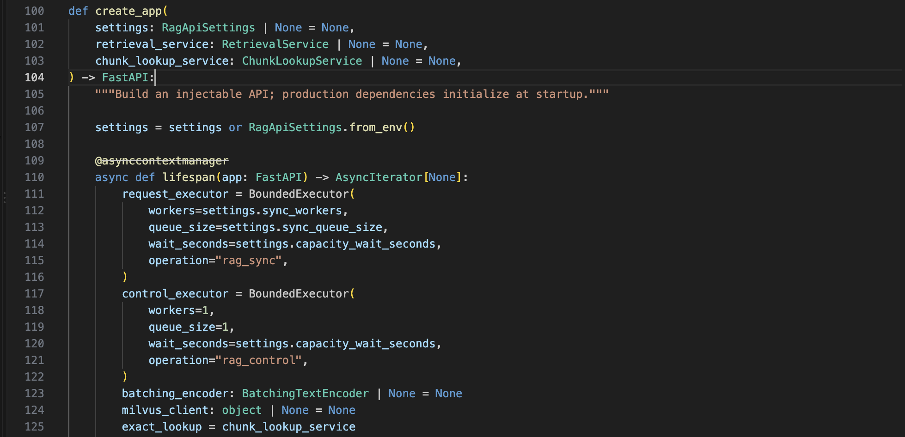
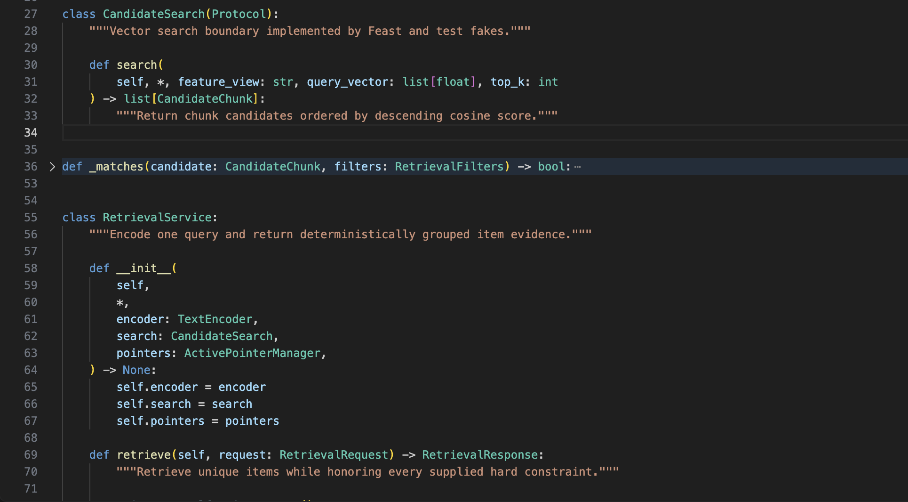
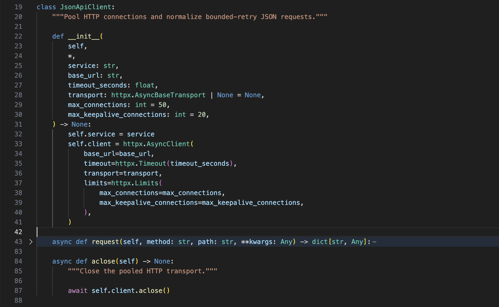
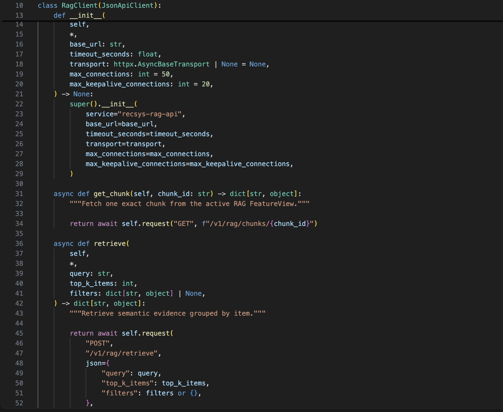
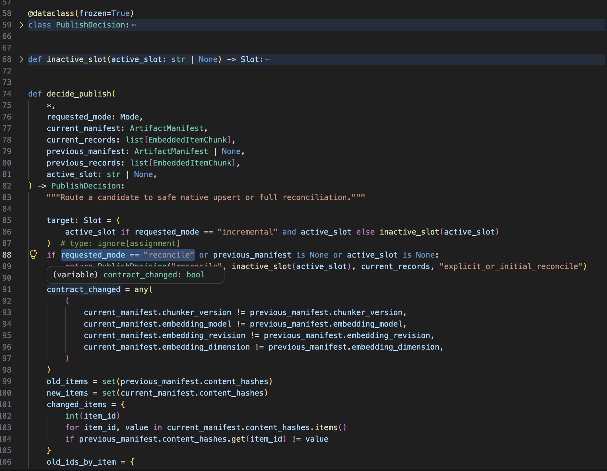
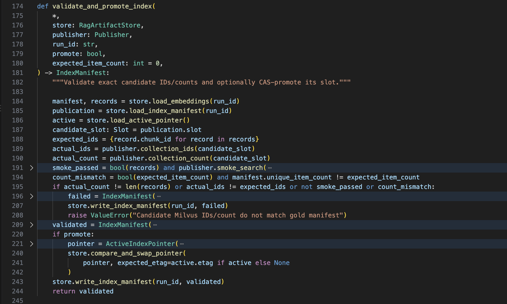
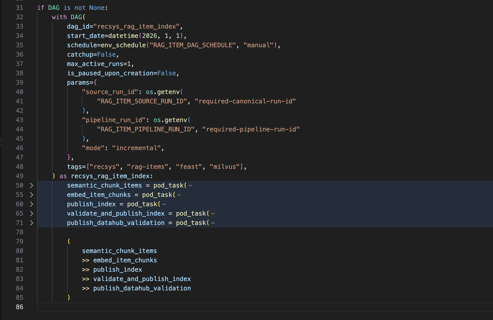
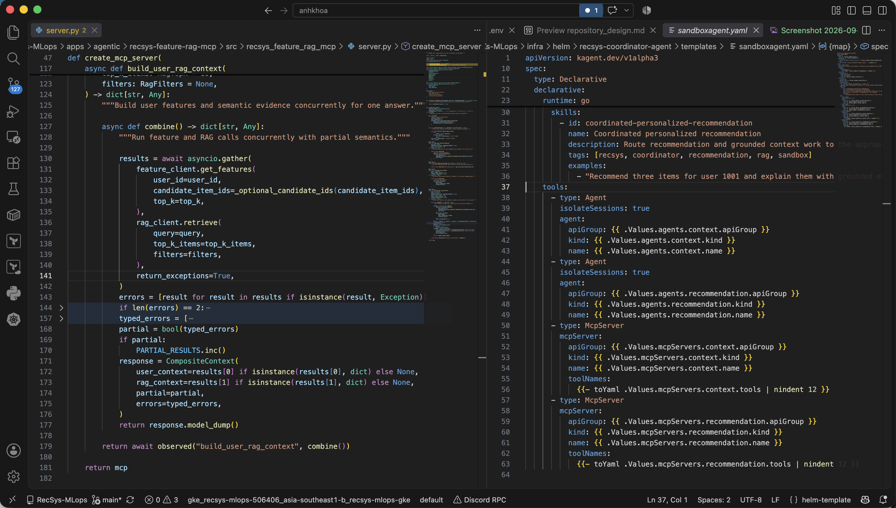

# Repository Design Proof — LLM and Agentic Platform

This proof covers the final-coursework rubric item **Repository Design: clean code, clean repository, and demonstrated design-pattern usage** for the LLM, RAG, MCP, and agentic parts of the project.

## Rubric Mapping

| Rubric requirement | Repository evidence |
|---|---|
| Clean repo | LLM inference, RAG serving, RAG data processing, MCP servers, declarative agents, infrastructure, tests, and submission evidence are split by deployable boundary. |
| Clean code | Contracts, application composition, downstream clients, retrieval policy, index lifecycle, observability, and orchestration are implemented in focused modules. |
| Design pattern usage | The codebase demonstrates Composition Root with protocol-based Dependency Injection, Adapter/Gateway, Strategy/State Machine, Pipeline/Chain, and Composite/Aggregator patterns. |
| Submitted evidence | Eight focused code screenshots cover the five patterns. Unit tests remain linked as supporting evidence. |

Runtime and UI evidence is intentionally kept in [RAG](rag.md), [Agent Pull Data](agent_pull_data.md), and [Agent Coordinator](agent_coordinator.md). This document uses source-code screenshots as the primary design-pattern proof required by the rubric.

## Clean Repository Layout

The LLM platform is organized around independently deployable and testable components rather than a single agent application.

```text
apps/
  agentic/
    recsys-feature-rag-mcp/       Stateless MCP facade for online features and RAG
    recsys-recommendation-mcp/    Stateless MCP facade for model-ranked recommendations
  api-serving/
    rag-api/                      Exact and semantic RAG retrieval API
  data-platform/
    rag-runtime/                  Shared, image-local embedding runtime
    src/rag_data/                 Generation, chunking, embedding, publication, rollback
    src/orchestration/airflow/    RAG index DAG and governed publication order
configs/
  agentic/                        Versioned tool contracts for specialist/coordinator agents
  agentregistry/                  Agent Registry configuration
  kagent/                         Shared model and controller configuration
  llm-d/                          Gateway and load-aware LLM routing profiles
infra/
  helm/
    recsys-rag-api/               RAG API Deployment, Service, metrics, and autoscaling
    recsys-feature-rag-mcp/       Feature/RAG MCP runtime and network policy
    recsys-recommendation-mcp/    Recommendation MCP runtime and network policy
    recsys-kagent-agent/          Context SandboxAgent and RemoteMCPServer
    recsys-recommendation-agent/  Recommendation SandboxAgent and RemoteMCPServer
    recsys-coordinator-agent/     A2A coordinator agent
    recsys-llm-serving/           LLM Gateway and model server
  terraform/gcp/                  GKE, kagent/Substrate, Agent Registry, and LLM platform IaC
tests/
  unit/                           Isolated RAG, MCP, generation, and lifecycle tests
  contract/                       Helm, agent, registry, and LLM platform contracts
  integration/                    Feast/Milvus, MinIO, MCP, and inference boundaries
  e2e/                            Deployed sandbox-agent and coordinator verification
  load/                           RAG and llm-d load/benchmark scenarios
docs/
  submission/rubric-final-coursework-(final-llm)/
  pngs/                           Runtime and UI proof images
```

Infrastructure follows the same ownership boundaries.

| Infrastructure boundary | Responsibility |
|---|---|
| [llm_inference.tf](../../../infra/terraform/gcp/modules/kubernetes-platform/llm_inference.tf) | Installs Gateway API/agentgateway dependencies, the model server, and the load-aware router. |
| [kagent.tf](../../../infra/terraform/gcp/modules/kubernetes-platform/kagent.tf) | Installs Agent Substrate and kagent, then owns dedicated sandbox WorkerPools and scaling RBAC. |
| [recsys-rag-api chart](../../../infra/helm/recsys-rag-api/) | Packages the RAG serving runtime, health checks, metrics, and KEDA policy. |
| [recsys-feature-rag-mcp chart](../../../infra/helm/recsys-feature-rag-mcp/) | Packages the authenticated MCP facade separately from the RAG API. |
| [recsys-kagent-agent chart](../../../infra/helm/recsys-kagent-agent/) | Declares the context `SandboxAgent`, `RemoteMCPServer`, allowed domains, and WorkerPool scaling. |
| [recsys-coordinator-agent chart](../../../infra/helm/recsys-coordinator-agent/) | Declares A2A specialist dependencies without copying their implementation. |
| [agentregistry values](../../../configs/agentregistry/values.yaml) | Keeps Agent Registry deployment configuration outside application code. |
| [llm-d profiles](../../../configs/llm-d/) | Separates baseline and optimized inference-routing treatments. |

### Code Reference

- [README.md](../../../README.md): top-level navigation and platform boundaries.
- [RAG API application factory (line 100)](../../../apps/api-serving/rag-api/src/recsys_rag_api/app.py#L100): injectable RAG serving composition root.
- [Feature/RAG MCP application factory (line 21)](../../../apps/agentic/recsys-feature-rag-mcp/src/recsys_feature_rag_mcp/app.py#L21): independently deployable MCP composition root.
- [RAG index DAG (line 31)](../../../apps/data-platform/src/orchestration/airflow/dags/recsys_rag_item_index.py#L31): data-plane orchestration boundary.
- [Context SandboxAgent (line 1)](../../../infra/helm/recsys-kagent-agent/templates/sandboxagent.yaml#L1): declarative agent boundary.
- [Coordinator SandboxAgent (line 1)](../../../infra/helm/recsys-coordinator-agent/templates/sandboxagent.yaml#L1): A2A orchestration boundary.

## Clean Code Boundaries

Each runtime responsibility has a focused module and a narrow public contract.

| Boundary | Main files | Responsibility |
|---|---|---|
| RAG HTTP contracts | [contracts.py (line 20)](../../../apps/api-serving/rag-api/src/recsys_rag_api/contracts.py#L20), [contracts.py (line 156)](../../../apps/api-serving/rag-api/src/recsys_rag_api/contracts.py#L156) | Strict Pydantic request, filter, candidate, evidence, and response schemas. |
| RAG composition root | [app.py (line 100)](../../../apps/api-serving/rag-api/src/recsys_rag_api/app.py#L100), [app.py (line 189)](../../../apps/api-serving/rag-api/src/recsys_rag_api/app.py#L189) | Creates production dependencies, injects test services, manages lifecycle, and exposes routes. |
| Retrieval policy | [retrieval.py (line 55)](../../../apps/api-serving/rag-api/src/recsys_rag_api/retrieval.py#L55), [retrieval.py (line 132)](../../../apps/api-serving/rag-api/src/recsys_rag_api/retrieval.py#L132) | Query encoding, candidate refill, hard filters, item grouping, evidence caps, and stable ranking. |
| Exact chunk access | [chunk_lookup.py (line 60)](../../../apps/api-serving/rag-api/src/recsys_rag_api/chunk_lookup.py#L60), [chunk_lookup.py (line 125)](../../../apps/api-serving/rag-api/src/recsys_rag_api/chunk_lookup.py#L125) | Pointer-selected Feast lookup and explicit missing-ID classification. |
| Active index pointer | [pointer.py (line 20)](../../../apps/api-serving/rag-api/src/recsys_rag_api/pointer.py#L20), [pointer.py (line 96)](../../../apps/api-serving/rag-api/src/recsys_rag_api/pointer.py#L96) | Embedding-contract validation, TTL refresh, thread safety, and last-known-good fallback. |
| Query micro-batching | [batching.py (line 29)](../../../apps/api-serving/rag-api/src/recsys_rag_api/batching.py#L29), [batching.py (line 136)](../../../apps/api-serving/rag-api/src/recsys_rag_api/batching.py#L136) | Bounded producer–consumer queue around the synchronous ONNX encoder. |
| MCP downstream clients | [base.py (line 19)](../../../apps/agentic/recsys-feature-rag-mcp/src/recsys_feature_rag_mcp/clients/base.py#L19), [rag.py (line 10)](../../../apps/agentic/recsys-feature-rag-mcp/src/recsys_feature_rag_mcp/clients/rag.py#L10) | Pooled HTTP, trace propagation, bounded retry, and typed domain operations. |
| MCP tool orchestration | [server.py (line 47)](../../../apps/agentic/recsys-feature-rag-mcp/src/recsys_feature_rag_mcp/server.py#L47), [server.py (line 181)](../../../apps/agentic/recsys-feature-rag-mcp/src/recsys_feature_rag_mcp/server.py#L181) | Registers four tools and composes feature/RAG results with explicit partial semantics. |
| LLM metadata generation | [generator.py (line 181)](../../../apps/data-platform/src/rag_data/generator.py#L181), [generator.py (line 321)](../../../apps/data-platform/src/rag_data/generator.py#L321) | Resumable, per-item generation with deterministic metadata and failure isolation. |
| Chunk/embed stages | [pipeline.py (line 18)](../../../apps/data-platform/src/rag_data/pipeline.py#L18), [pipeline.py (line 199)](../../../apps/data-platform/src/rag_data/pipeline.py#L199) | Idempotent silver/gold artifact creation with checkpoints and strict manifests. |
| Index publication lifecycle | [index_lifecycle.py (line 74)](../../../apps/data-platform/src/rag_data/index_lifecycle.py#L74), [index_lifecycle.py (line 274)](../../../apps/data-platform/src/rag_data/index_lifecycle.py#L274) | Incremental/reconcile decision, inactive-slot publication, validation, CAS promotion, and rollback. |
| Agent contracts | [context tools contract](../../../configs/agentic/recsys-context-agent/tools-contract.json), [coordinator tools contract](../../../configs/agentic/recsys-coordinator-agent/tools-contract.json) | Versioned agent-to-tool and agent-to-agent dependency declarations. |

## Design Patterns In Code

The five patterns below are the strongest LLM-scope examples. Runtime screenshots are not used as substitutes for code proof.

### Pattern 1: Composition Root With Protocol-Based Dependency Injection

**Intent:** centralize production dependency construction while allowing domain services and tests to depend on small interfaces instead of Feast, Milvus, or model-runtime implementations.

**External references:** [Dependency injection](https://en.wikipedia.org/wiki/Dependency_injection) and [Python `Protocol`](https://docs.python.org/3/library/typing.html#typing.Protocol).

**Implementation:** `create_app()` is the composition root. It accepts `RetrievalService` and `ChunkLookupService` overrides, constructs production dependencies only when no override is supplied, and owns their lifecycle. `CandidateSearch` is the port consumed by `RetrievalService`; production and test implementations can satisfy the same structural interface.

| Code and test reference | Evidence |
|---|---|
| [RAG `create_app()` (line 100)](../../../apps/api-serving/rag-api/src/recsys_rag_api/app.py#L100), [production branch (line 126)](../../../apps/api-serving/rag-api/src/recsys_rag_api/app.py#L126) | Optional service parameters form the injection seam; production construction stays in one root. |
| [CandidateSearch protocol (line 27)](../../../apps/api-serving/rag-api/src/recsys_rag_api/retrieval.py#L27), [RetrievalService constructor (line 58)](../../../apps/api-serving/rag-api/src/recsys_rag_api/retrieval.py#L58) | Retrieval policy depends on a protocol rather than a concrete vector client. |
| [test service fake (line 25)](../../../tests/unit/api_serving/rag_api/test_app.py#L25), [injected application test (line 88)](../../../tests/unit/api_serving/rag_api/test_app.py#L88) | Unit tests start the API with an in-process fake and no Feast/Milvus service. |
| [encoder/search fakes (line 21)](../../../tests/unit/api_serving/rag_api/test_retrieval.py#L21), [service test (line 83)](../../../tests/unit/api_serving/rag_api/test_retrieval.py#L83) | Structural fakes exercise the domain service directly. |

**Captured code proof:** the composition root and protocol injection boundary are captured separately so both snippets remain readable.



**Figure: Composition Root proof.** `create_app()` exposes optional `RetrievalService` and `ChunkLookupService` dependencies while keeping production dependency initialization inside the application lifecycle.



**Figure: Protocol-based Dependency Injection proof.** `CandidateSearch` defines the search port, and `RetrievalService` receives the encoder, search adapter, and pointer manager through constructor injection.

### Pattern 2: Adapter / Gateway For MCP Downstream Services

**Intent:** isolate HTTP transport, tracing, metrics, retry, and error normalization from MCP tool definitions.

**External reference:** [Adapter pattern](https://en.wikipedia.org/wiki/Adapter_pattern).

**Implementation:** `JsonApiClient` is the shared transport gateway. `OnlineFeatureClient` and `RagClient` adapt concrete RecSys HTTP endpoints into domain methods such as `get_features()`, `get_chunk()`, and `retrieve()`. MCP tools call those methods without knowing URLs, connection-pool settings, tracing headers, or retry rules.

| Code and test reference | Evidence |
|---|---|
| [JsonApiClient (line 19)](../../../apps/agentic/recsys-feature-rag-mcp/src/recsys_feature_rag_mcp/clients/base.py#L19), [normalized request flow (line 43)](../../../apps/agentic/recsys-feature-rag-mcp/src/recsys_feature_rag_mcp/clients/base.py#L43) | The base gateway owns pooling, propagation, retry, metrics, and normalized errors. |
| [OnlineFeatureClient (line 10)](../../../apps/agentic/recsys-feature-rag-mcp/src/recsys_feature_rag_mcp/clients/online_features.py#L10), [domain method (line 31)](../../../apps/agentic/recsys-feature-rag-mcp/src/recsys_feature_rag_mcp/clients/online_features.py#L31) | Online-feature HTTP details are hidden behind `get_features()`. |
| [RagClient (line 10)](../../../apps/agentic/recsys-feature-rag-mcp/src/recsys_feature_rag_mcp/clients/rag.py#L10), [exact and semantic methods (line 31)](../../../apps/agentic/recsys-feature-rag-mcp/src/recsys_feature_rag_mcp/clients/rag.py#L31) | Exact and semantic endpoints are exposed as typed domain operations. |
| [adapter contract/retry test (line 11)](../../../tests/unit/agentic/feature_rag_mcp/test_clients.py#L11), [connection-error test (line 67)](../../../tests/unit/agentic/feature_rag_mcp/test_clients.py#L67) | Tests verify endpoint mapping and the bounded retry policy using `MockTransport`. |

**Captured code proof:** the shared JSON gateway and concrete RAG adapter are captured separately so the reusable transport boundary and domain methods are both legible.



**Figure: Shared Gateway proof.** `JsonApiClient` owns the pooled `httpx.AsyncClient` and the normalized request boundary used by downstream adapters.



**Figure: RAG Adapter proof.** `RagClient` extends the shared gateway and translates exact-chunk and semantic-retrieval domain methods into concrete RAG API requests.

### Pattern 3: Strategy and State Machine For Blue/Green RAG Publication

**Intent:** choose the safe publication strategy from the current artifact state and allow only validated transitions to become active.

**External references:** [Strategy pattern](https://en.wikipedia.org/wiki/Strategy_pattern) and [State pattern](https://en.wikipedia.org/wiki/State_pattern).

**Implementation:** `decide_publish()` selects incremental upsert or inactive-slot reconciliation. Contract changes, deleted items, and chunk shrink force reconciliation. `publish_index()` writes a candidate without changing the active pointer. `validate_and_promote_index()` checks exact IDs, counts, and retrieval before an ETag-guarded transition to `published`; rollback uses the inverse compare-and-swap transition.

| Code and test reference | Evidence |
|---|---|
| [PublishDecision (line 58)](../../../apps/data-platform/src/rag_data/index_lifecycle.py#L58), [decide_publish (line 74)](../../../apps/data-platform/src/rag_data/index_lifecycle.py#L74) | A pure decision object records strategy, target slot, records, and reason. |
| [unsafe-change routing (line 91)](../../../apps/data-platform/src/rag_data/index_lifecycle.py#L91), [incremental result (line 123)](../../../apps/data-platform/src/rag_data/index_lifecycle.py#L123) | State determines reconcile versus safe native upsert. |
| [validation and promotion (line 174)](../../../apps/data-platform/src/rag_data/index_lifecycle.py#L174), [CAS pointer write (line 220)](../../../apps/data-platform/src/rag_data/index_lifecycle.py#L220) | Candidate activation occurs only after validation. |
| [rollback transition (line 247)](../../../apps/data-platform/src/rag_data/index_lifecycle.py#L247), [rollback test (line 229)](../../../tests/unit/data_platform/rag_data/test_index_lifecycle.py#L229) | Rollback restores the previous validated pointer using its ETag. |
| [strategy tests (line 63)](../../../tests/unit/data_platform/rag_data/test_index_lifecycle.py#L63), [failed-validation test (line 175)](../../../tests/unit/data_platform/rag_data/test_index_lifecycle.py#L175) | Tests prove both strategies and the fail-closed transition. |

**Captured code proof:** strategy selection and guarded state transition are shown as two images because they are separate responsibilities in `index_lifecycle.py`.



**Figure: Strategy proof.** `PublishDecision` and `decide_publish()` select incremental upsert or inactive-slot reconciliation from the requested mode and current artifact state.



**Figure: State Machine proof.** `validate_and_promote_index()` verifies IDs, counts, and retrieval before creating the published state and changing the active pointer through compare-and-swap.

### Pattern 4: Pipeline / Chain For RAG Data Publication

**Intent:** make RAG processing an auditable sequence in which each stage consumes a validated, versioned artifact from the preceding stage.

**External reference:** [Pipes and filters](https://en.wikipedia.org/wiki/Pipes_and_filters).

**Implementation:** canonical item generation is separate from semantic chunking and embedding. Silver and gold functions checkpoint manifests without mutating the online index. The Airflow DAG explicitly chains semantic chunking, embedding, candidate publication, validation/promotion, and DataHub governance publication.

| Code and test reference | Evidence |
|---|---|
| [chunk_canonical_items (line 18)](../../../apps/data-platform/src/rag_data/pipeline.py#L18), [complete silver manifest (line 102)](../../../apps/data-platform/src/rag_data/pipeline.py#L102) | The chunk stage validates and checkpoints a complete silver artifact. |
| [embed_item_chunks (line 120)](../../../apps/data-platform/src/rag_data/pipeline.py#L120), [complete gold manifest (line 191)](../../../apps/data-platform/src/rag_data/pipeline.py#L191) | Embedding is a separate idempotent gold stage. |
| [Airflow task definitions (line 50)](../../../apps/data-platform/src/orchestration/airflow/dags/recsys_rag_item_index.py#L50), [dependency chain (line 79)](../../../apps/data-platform/src/orchestration/airflow/dags/recsys_rag_item_index.py#L79) | The orchestration code makes stage order and the governance gate explicit. |
| [pipeline tests](../../../tests/unit/data_platform/rag_data/test_pipeline.py) | Unit tests verify resume, checkpoint, idempotency, and failure behavior at the stage boundaries. |

**Captured code proof:** `recsys_rag_item_index.py` shows the DAG definition, five independent tasks, and the complete `>>` dependency chain.



**Figure: Pipeline/Chain proof.** Independent tasks form a visible chunk → embed → candidate publish → validate/promote → governance chain, so each processing and side-effect boundary can be tested and retried independently.

### Pattern 5: Composite / Aggregator For MCP and A2A Coordination

**Intent:** build higher-level agent capabilities by composing independently deployable tools and specialist agents.

**External reference:** [Composite pattern](https://en.wikipedia.org/wiki/Composite_pattern).

**Implementation:** `build_user_rag_context` runs feature and semantic retrieval concurrently and combines them into one `CompositeContext` with explicit partial-result semantics. The coordinator `SandboxAgent` composes context and recommendation specialists as A2A tools while retaining direct MCP tools; it does not import or duplicate specialist implementation.

| Code and test reference | Evidence |
|---|---|
| [composite MCP tool (line 116)](../../../apps/agentic/recsys-feature-rag-mcp/src/recsys_feature_rag_mcp/server.py#L116), [parallel fan-out (line 127)](../../../apps/agentic/recsys-feature-rag-mcp/src/recsys_feature_rag_mcp/server.py#L127) | Feature and RAG calls execute concurrently. |
| [partial-result policy (line 143)](../../../apps/agentic/recsys-feature-rag-mcp/src/recsys_feature_rag_mcp/server.py#L143), [typed aggregation (line 171)](../../../apps/agentic/recsys-feature-rag-mcp/src/recsys_feature_rag_mcp/server.py#L171) | One failure yields a typed partial result; two failures fail the composite. |
| [partial-result test (line 67)](../../../tests/unit/agentic/feature_rag_mcp/test_server.py#L67), [dual-failure test (line 82)](../../../tests/unit/agentic/feature_rag_mcp/test_server.py#L82) | Tests verify both aggregation outcomes. |
| [coordinator A2A tools (line 37)](../../../infra/helm/recsys-coordinator-agent/templates/sandboxagent.yaml#L37), [coordinator MCP tools (line 50)](../../../infra/helm/recsys-coordinator-agent/templates/sandboxagent.yaml#L50) | Specialist agents and MCP servers are composed declaratively. |

**Captured code proof:** one split-editor image shows `asyncio.gather` and partial-result aggregation beside the coordinator's declarative `Agent` and `McpServer` composition.



**Figure: Composite/Aggregator proof.** The MCP layer aggregates downstream context with defined partial semantics, while the coordinator composes specialist agents and remote tools through declarative A2A/MCP contracts.
