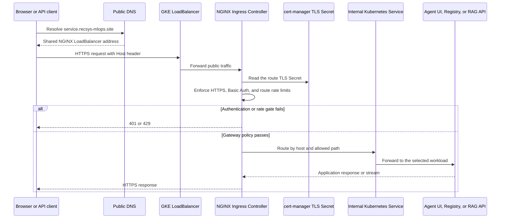
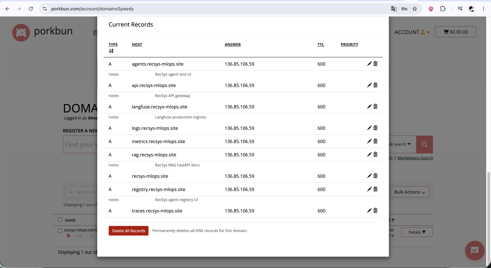
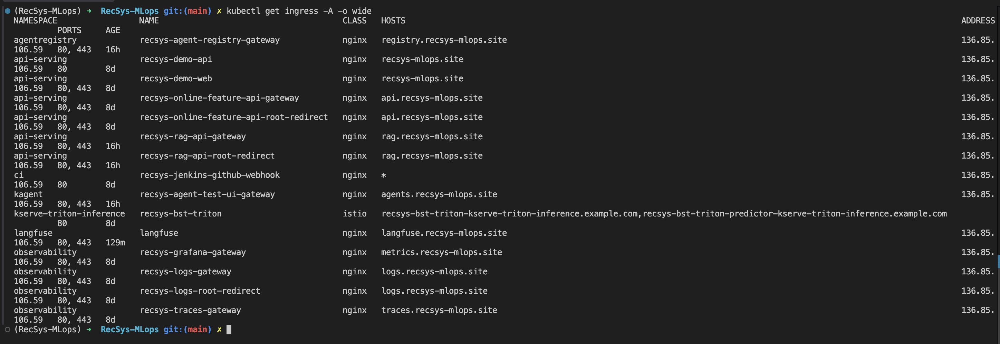
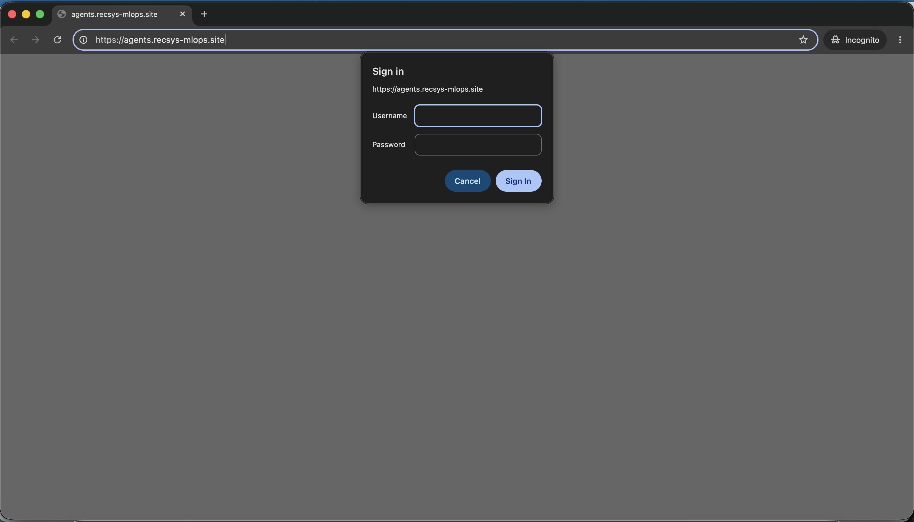
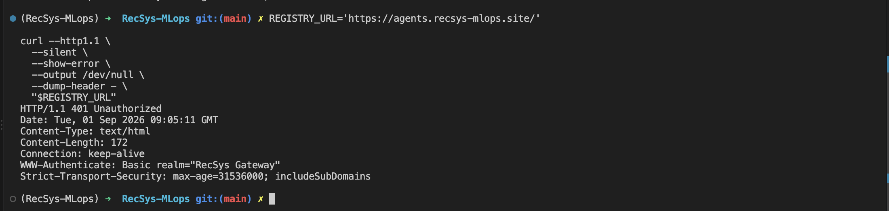
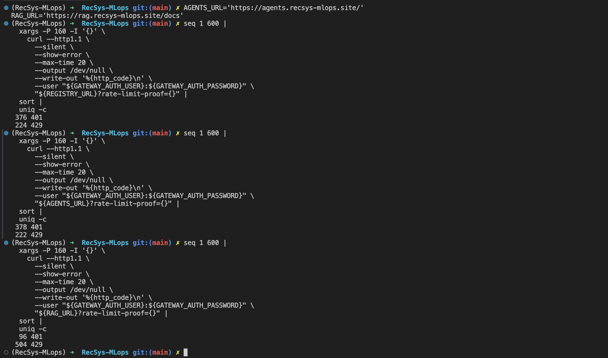
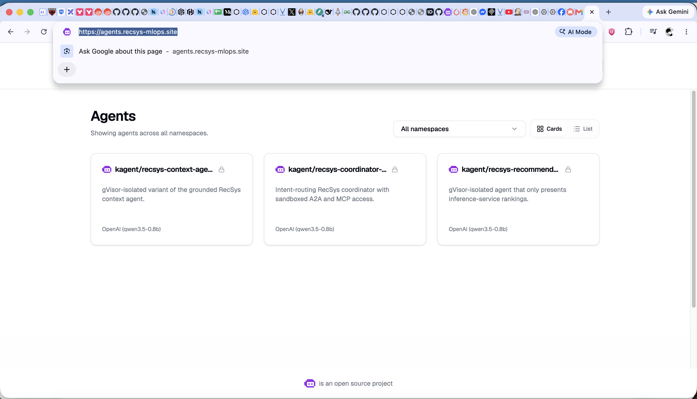
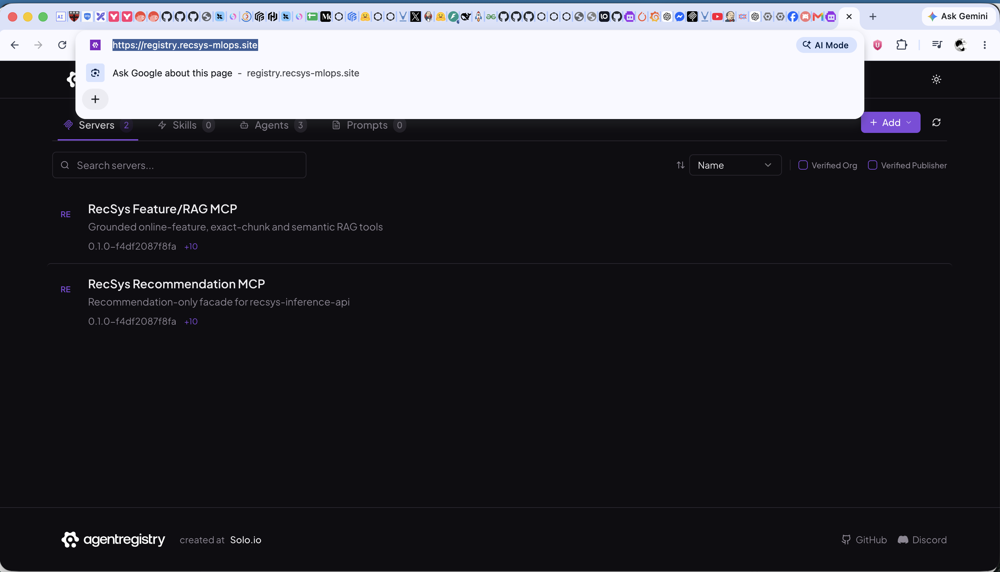
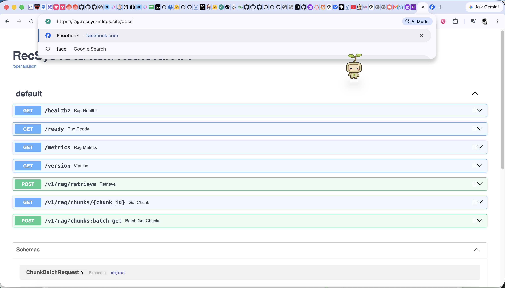

# Routing & Gateway (NGINX Ingress Controller)

**Domain:** `recsys-mlops.site`

NGINX Ingress Controller is the public gateway for the LLM and agent-facing
surfaces. The Kubernetes Services remain internal, while three public DNS names
point to the same GKE LoadBalancer and are routed by host and path.

This public gateway is separate from the internal llm-d Agent Gateway. NGINX
terminates public HTTPS and protects the user-facing routes; the llm-d Agent
Gateway authenticates and routes model inference traffic from kagent to the
Qwen serving pool inside the cluster.

## Domain Setup For All 3 Services

| Service | Public domain | Internal backend |
| --- | --- | --- |
| kagent Agent Test UI | `agents.recsys-mlops.site` | `kagent-ui.kagent.svc.cluster.local:8080` |
| Agent Registry | `registry.recsys-mlops.site` | `agentregistry.agentregistry.svc.cluster.local:12121` |
| RAG API | `rag.recsys-mlops.site` | `recsys-rag-api.api-serving.svc.cluster.local:80` |

## Setup And Configuration Flow

The production gateway is assembled in layers. Terraform installs the NGINX
controller and deploys the repository-owned gateway Helm chart. The chart
renders one Ingress per public surface, External Secrets supplies the shared
Basic Auth data in each route's namespace, cert-manager supplies independent
TLS certificates, and public DNS maps all three hosts to the controller's
LoadBalancer address.

### Configuration Precedence And Ownership

| Layer | Effective responsibility |
| --- | --- |
| Terraform variables | Enable the public gateway, select `recsys-mlops.site`, and configure TLS with the existing `letsencrypt-prod` ClusterIssuer. |
| Terraform `ingress-nginx` release | Installs the controller in `ingress-nginx`, publishes a GKE `LoadBalancer` Service, optionally injects an Istio sidecar, and standardizes rate-limit rejection as HTTP `429`. |
| Gateway chart defaults | Define the ingress class, internal service names and ports, Basic Auth policy, route-specific throttling, TLS Secret names, proxy behavior, and safe disabled defaults for the three LLM surfaces. |
| Terraform `recsys-gateway` release | Enables the agent UI, Agent Registry, and RAG routes; derives their production hostnames from `gateway_domain`; selects the internal upstream FQDNs; and disables chart-owned authentication Secrets. |
| `recsys-security` and External Secrets | Replicate the Vault-backed `recsys-gateway-basic-auth` Secret into `kagent`, `agentregistry`, and `api-serving`, because an Ingress authentication Secret must exist in the Ingress object's namespace. |
| cert-manager | Observes the Ingress issuer annotation and creates the route-specific certificate Secret consumed by NGINX. |
| DNS automation/provider | Owns the public `A` records for `agents`, `registry`, and `rag`; the records converge on the same NGINX LoadBalancer address. |

Relevant configuration sources are
[dependencies.tf](../../../infra/terraform/gcp/modules/kubernetes-platform/dependencies.tf#L269),
[recsys_services.tf](../../../infra/terraform/gcp/modules/kubernetes-platform/recsys_services.tf#L459),
[values.yaml](../../../infra/helm/recsys-gateway/values.yaml),
[values-gcp.yaml](../../../infra/helm/recsys-gateway/values-gcp.yaml), and
[configure_gateway_dns.py](../../../ops/gcp/configure_gateway_dns.py#L17).

### Effective Production Route Table

| Host and public path | Gateway behavior | Kubernetes destination |
| --- | --- | --- |
| `agents.recsys-mlops.site/*` | Prefix route for the kagent UI, its same-origin `/api/*` calls, and `/a2a/*` streaming traffic. Response buffering is disabled and read/send timeouts are extended to 1,800 seconds for long agent runs. | `kagent-ui.kagent.svc.cluster.local:8080` |
| `registry.recsys-mlops.site/*` | Prefix route for the Agent Registry UI and its same-origin HTTP API. | `agentregistry.agentregistry.svc.cluster.local:12121` |
| `rag.recsys-mlops.site/` | Exact root request is redirected to `/docs`. | Redirect to the RAG Swagger UI |
| `rag.recsys-mlops.site/docs*` | FastAPI Swagger UI and assets. | `recsys-rag-api.api-serving.svc.cluster.local:80` |
| `rag.recsys-mlops.site/redoc*` | FastAPI ReDoc UI and assets. | `recsys-rag-api.api-serving.svc.cluster.local:80` |
| `rag.recsys-mlops.site/openapi.json` | Exact OpenAPI schema route. | `recsys-rag-api.api-serving.svc.cluster.local:80` |
| `rag.recsys-mlops.site/v1/rag/*` | Public RAG retrieval and exact chunk lookup API. | `recsys-rag-api.api-serving.svc.cluster.local:80` |

The Agent Registry MCP port `31313`, kagent controller ports `8083/8084`, and
RAG operational endpoints `/metrics`, `/healthz`, `/ready`, and `/version` are
not included in these public Ingress rules. They remain cluster-internal.

### Request Routing Sequence



The Agent UI and Agent Registry routes request Service-level upstream routing
with `nginx.ingress.kubernetes.io/service-upstream: "true"`. The RAG route also
uses a Helm-managed ExternalName alias named
`recsys-rag-api-ingress-upstream`, which resolves to
`recsys-rag-api.api-serving.svc.cluster.local`. NGINX therefore connects through
the stable Kubernetes Service DNS identity instead of selecting a RAG Pod IP
directly. This is required in production because `api-serving` enforces Istio
STRICT mTLS: direct endpoint traffic from the non-mesh NGINX controller is
terminated before HTTP headers, while the Service-DNS path is accepted. The
`upstream-vhost` annotation keeps the original RAG Service FQDN as the upstream
host.

The agent UI route also disables NGINX proxy buffering and uses 1,800-second
read and send timeouts. These settings preserve streaming A2A responses and
allow long-running agent executions without converting the public gateway into
a direct route to the kagent controller.

### Authentication Secret Setup

No usable htpasswd credential is stored in the gateway chart. Production sets
`auth.createSecret=false`; the Vault-backed security release owns the
namespace-local copies instead:

```text
Vault KV v2: recsys/gateway
  -> kagent/recsys-gateway-basic-auth
  -> agentregistry/recsys-gateway-basic-auth
  -> api-serving/recsys-gateway-basic-auth
```

Each protected Ingress references `recsys-gateway-basic-auth` through the NGINX
`auth-type`, `auth-secret`, and `auth-realm` annotations. Terraform waits for
the corresponding ExternalSecrets to report Ready and verifies that the target
Secrets exist before the dependent gateway release proceeds. See
[secret_management.tf](../../../infra/terraform/gcp/modules/kubernetes-platform/secret_management.tf#L103),
[security values](../../../infra/helm/recsys-security/values.yaml#L91), and
[externalsecrets.yaml](../../../infra/helm/recsys-security/templates/externalsecrets.yaml#L1).

The public Basic Auth credential is independent from the internal Agent Gateway
API key. The former protects browser/API entrypoints at NGINX; the latter is
validated by an `AgentgatewayPolicy` before internal model route selection.

### TLS And DNS Setup

All three public Ingresses use `ingressClassName: nginx`, force HTTPS, reference
`letsencrypt-prod`, and declare a route-specific TLS Secret:

| Host | TLS Secret |
| --- | --- |
| `agents.recsys-mlops.site` | `recsys-agents-tls` |
| `registry.recsys-mlops.site` | `recsys-registry-tls` |
| `rag.recsys-mlops.site` | `recsys-rag-tls` |

cert-manager completes the ACME challenge and populates each Secret; NGINX then
terminates public TLS before routing to the internal Service. Production uses
an existing ClusterIssuer (`tls.issuer.create=false`), so
`letsencrypt-prod` is a deployment prerequisite.

The repository's DNS automation manages the three `A` records independently
from Terraform. All three records are configured with the same address, which
is the public NGINX controller LoadBalancer address. If that dynamic address
changes, the DNS records must be reconciled before certificate issuance and
public routing can succeed.

### Public NGINX Gateway Versus Internal Agent Gateway

The two gateway layers have different trust boundaries:

| Gateway | Client | Protocol and policy | Destination |
| --- | --- | --- | --- |
| Public NGINX Ingress | Browser or external API client | HTTPS, Basic Auth, per-route rate and connection limits, host/path allow-list | kagent UI, Agent Registry HTTP service, or RAG API |
| Internal llm-d Agent Gateway | kagent `ModelConfig` | Cluster-internal HTTP, Vault-backed API key, `X-Gateway-Base-Model-Name`, load-aware model routing | llm-d `HTTPRoute`/`InferencePool` and Qwen llama.cpp Pods |

The NGINX gateway does not publish the Qwen model endpoint. A browser interacts
with the kagent UI through NGINX; kagent then uses its internal `ModelConfig` to
reach the llm-d Agent Gateway. This keeps model inference behind a second,
independent authentication and routing boundary.

### Gateway Configuration Reference

| Gateway layer | Clickable configuration reference | Purpose |
| --- | --- | --- |
| NGINX Ingress Controller | [dependencies.tf (line 269)](../../../infra/terraform/gcp/modules/kubernetes-platform/dependencies.tf#L269) | Installs the public controller, GKE LoadBalancer, optional Istio sidecar, and HTTP `429` rate-limit behavior. |
| Gateway Helm release | [recsys_services.tf (line 459)](../../../infra/terraform/gcp/modules/kubernetes-platform/recsys_services.tf#L459), [LLM route overrides (line 531)](../../../infra/terraform/gcp/modules/kubernetes-platform/recsys_services.tf#L531) | Enables all three LLM surfaces and injects their production hosts and internal upstreams. |
| Shared policy defaults | [values.yaml (line 1)](../../../infra/helm/recsys-gateway/values.yaml#L1), [Basic Auth (line 5)](../../../infra/helm/recsys-gateway/values.yaml#L5), [TLS Secrets (line 16)](../../../infra/helm/recsys-gateway/values.yaml#L16) | Centralizes the ingress class, authentication policy, certificates, and route-specific throttling. |
| Production host overlay | [values-gcp.yaml (line 26)](../../../infra/helm/recsys-gateway/values-gcp.yaml#L26) | Enables `agents`, `registry`, and `rag` with production domains and TLS. |
| Agent UI route | [agents-ingress.yaml (line 1)](../../../infra/helm/recsys-gateway/templates/agents-ingress.yaml#L1) | Publishes the kagent UI with Basic Auth, rate limiting, TLS, streaming support, and long request timeouts. |
| Agent Registry route | [registry-ingress.yaml (line 1)](../../../infra/helm/recsys-gateway/templates/registry-ingress.yaml#L1) | Publishes the Agent Registry HTTP UI/API while leaving its MCP port internal. |
| RAG route | [rag-ingress.yaml (line 1)](../../../infra/helm/recsys-gateway/templates/rag-ingress.yaml#L1), [RAG upstream alias](../../../infra/helm/recsys-gateway/templates/rag-ingress-upstream-service.yaml#L1) | Publishes only documentation and `/v1/rag/*`, redirects the exact root to `/docs`, and routes through an ExternalName alias to preserve the Service DNS identity under Istio STRICT mTLS. |
| Gateway credentials | [security values (line 91)](../../../infra/helm/recsys-security/values.yaml#L91), [ExternalSecret template](../../../infra/helm/recsys-security/templates/externalsecrets.yaml#L1) | Replicates the shared Vault-backed htpasswd Secret into each Ingress namespace. |
| DNS records | [configure_gateway_dns.py (line 17)](../../../ops/gcp/configure_gateway_dns.py#L17) | Reconciles the `agents`, `registry`, and `rag` public `A` records to one NGINX LoadBalancer address. |



**Figure: Domain setup for all LLM gateway services.** The Porkbun DNS record
list shows `agents.recsys-mlops.site`, `registry.recsys-mlops.site`, and
`rag.recsys-mlops.site` as public `A` records. All three resolve to
`136.85.106.59` with a TTL of 600 seconds, proving that the LLM public surfaces
converge on the same NGINX LoadBalancer address.



**Figure: NGINX route and HTTPS setup for all three services.** The live
`kubectl get ingress -A -o wide` output shows the Agent Registry route in
`agentregistry`, the RAG API and exact-root redirect routes in `api-serving`,
and the Agent Test UI route in `kagent`. Each uses class `nginx`, exposes ports
`80, 443`, carries its production hostname, and publishes the shared address
`136.85.106.59`.

## Basic Auth & Rate Limit Proof

The public Agent, RAG, metrics, logs, and traces routes use the same NGINX
gateway policy pattern: unauthenticated traffic is rejected with a Basic Auth
challenge or HTTP `401`, while burst traffic beyond the route-specific limit is
rejected with HTTP `429`.

### Agent And RAG Routes



**Figure: Browser Basic Auth challenge for the Agent UI.** An incognito request
to `https://agents.recsys-mlops.site` is stopped by the browser credential
dialog before the kagent UI loads, proving that the public route requires
gateway authentication.



**Figure: HTTP Basic Auth response for the Agent UI.** An unauthenticated
request to `https://agents.recsys-mlops.site/` returns `HTTP/1.1 401
Unauthorized` and `WWW-Authenticate: Basic realm="RecSys Gateway"`. The HSTS
header confirms that the public entrypoint enforces the HTTPS security boundary.



**Figure: Shared Basic Auth and rate-limit proof for the Agent and RAG
routes.** The public-gateway bursts produce HTTP `401` for requests rejected by
Basic Auth and HTTP `429` after the NGINX threshold is reached. The RAG `/docs`
run records 504 rate-limited responses from 600 parallel requests.

## Grafana UI Proof For Metrics, Logs, And Traces

Grafana is the public visualization layer for the three observability signals.
The metrics dashboard reads Prometheus, the logs dashboard reads Loki, and the
traces dashboard correlates Tempo trace context with application logs and
latency metrics. All three dashboards are reached through the secured Grafana
gateway at `metrics.recsys-mlops.site`.

### Metrics UI


**Figure: Grafana metrics UI.** The Compute Telemetry dashboard is loaded
through `https://metrics.recsys-mlops.site` and displays CPU, memory, restart,
readiness, namespace, pod, and network telemetry collected by Prometheus.

### Logs UI


**Figure: Grafana logs UI.** The Logs Overview dashboard displays error counts,
API log volume, log volume by namespace, errors over time, and recent workload
logs queried from Loki through Grafana.

### Traces UI


**Figure: Grafana traces UI.** The Traces Overview dashboard displays request
traffic, latency, recent trace context, failures, and logs carrying trace IDs,
proving that Tempo trace data is available through the Grafana visualization
layer.

## kagent Agent Test UI

The kagent Agent Test UI is available at
`https://agents.recsys-mlops.site`. Its public route includes the UI,
same-origin API calls, and A2A streaming paths while the kagent controller
services remain internal.

### Code Reference

- [Agent route values](../../../infra/helm/recsys-gateway/values.yaml#L113): internal service, streaming timeouts, and rate limits.
- [agents-ingress.yaml](../../../infra/helm/recsys-gateway/templates/agents-ingress.yaml#L1): NGINX Basic Auth, service-upstream routing, disabled buffering, rate limits, and TLS.
- [Terraform production overrides](../../../infra/terraform/gcp/modules/kubernetes-platform/recsys_services.tf#L531): enable the route and derive its host from `gateway_domain`.

### Image Proof Enable HTTPS



**Figure: Agent UI HTTPS proof.** After authentication, the kagent UI loads at
`https://agents.recsys-mlops.site` and lists the deployed context,
coordinator, and recommendation agents. This proves that the public HTTPS route
reaches the internal `kagent-ui` Service.

## Agent Registry

The Agent Registry UI and same-origin HTTP API are available at
`https://registry.recsys-mlops.site`. The NGINX route targets port `12121`; the
registry MCP port is not exposed by this Ingress.

### Code Reference

- [Registry route values](../../../infra/helm/recsys-gateway/values.yaml#L131): internal service and route rate limits.
- [registry-ingress.yaml](../../../infra/helm/recsys-gateway/templates/registry-ingress.yaml#L1): NGINX Basic Auth, internal upstream, rate limits, and TLS.
- [Terraform production overrides](../../../infra/terraform/gcp/modules/kubernetes-platform/recsys_services.tf#L546): enable the route and derive its host from `gateway_domain`.
- [Agent Registry deployment](../../../infra/terraform/gcp/modules/kubernetes-platform/agent_registry.tf#L36): deploys the pinned registry service independently from its public route.

### Image Proof Enable HTTPS



**Figure: Agent Registry HTTPS proof.** The Agent Registry UI loads at
`https://registry.recsys-mlops.site` and displays the registered Feature/RAG
and Recommendation MCP servers. This proves that the NGINX HTTPS route reaches
the internal Agent Registry HTTP service on port `12121`.

## RAG API

The RAG API documentation and retrieval surface are available at
`https://rag.recsys-mlops.site`. The exact root redirects to `/docs`, and the
main Ingress exposes only `/docs`, `/redoc`, `/openapi.json`, and `/v1/rag`.

### Code Reference

- [RAG route values](../../../infra/helm/recsys-gateway/values.yaml#L146): internal service, root redirect, and API rate limits.
- [rag-ingress.yaml](../../../infra/helm/recsys-gateway/templates/rag-ingress.yaml#L1): explicit public path allow-list, Basic Auth, rate limits, TLS, root redirect, and the Helm-managed upstream alias backend.
- [rag-ingress-upstream-service.yaml](../../../infra/helm/recsys-gateway/templates/rag-ingress-upstream-service.yaml#L1): ExternalName alias to `recsys-rag-api.api-serving.svc.cluster.local`, preventing direct Pod-IP routing across the Istio STRICT mTLS boundary.
- [Terraform production overrides](../../../infra/terraform/gcp/modules/kubernetes-platform/recsys_services.tf#L561): enable the route and derive its host from `gateway_domain`.
- [RAG FastAPI application](../../../apps/api-serving/rag-api/src/recsys_rag_api/app.py#L190), [retrieval route](../../../apps/api-serving/rag-api/src/recsys_rag_api/app.py#L233), and [chunk lookup route](../../../apps/api-serving/rag-api/src/recsys_rag_api/app.py#L248): public application behavior behind the route.

### Image Proof Enable HTTPS



**Figure: RAG API HTTPS proof.** FastAPI Swagger UI loads at
`https://rag.recsys-mlops.site/docs` and displays the RAG retrieval and chunk
lookup operations. This proves that documentation and `/v1/rag/*` traffic are
published through the secured public domain.
