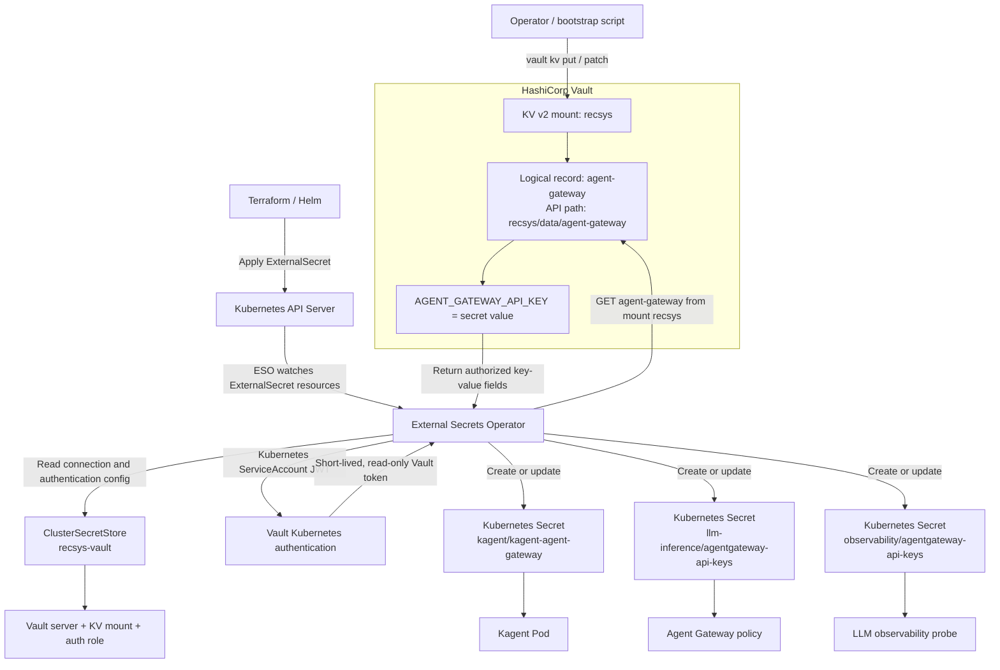

# HashiCorp Vault and Agent Gateway Authentication

This document records the HashiCorp Vault configuration used by the final LLM
platform and the sanitized coursework evidence. The live
GKE deployment was rechecked on 2026-08-14: Vault was initialized and unsealed
with HA Raft storage, `recsys-vault` was `Valid/Ready`, both Agent Gateway
`ExternalSecret` resources were `SecretSynced/Ready`, and the strict
`AgentgatewayPolicy` was accepted and attached.

The commands in this document deliberately display resource status, secret key
**names**, and equality checks only. They do not print the
`AGENT_GATEWAY_API_KEY`, a Vault token, recovery shares, or decoded Kubernetes
Secret values.

## Security Flow

```text
Google Cloud KMS
  -> auto-unseals the Vault HA/Raft cluster through Workload Identity

Vault KV v2: recsys/agent-gateway
  -> AGENT_GATEWAY_API_KEY
       |-> ExternalSecret kagent/kagent-agent-gateway
       |     -> ModelConfig/default-model-config sends Bearer key
       |
       `-> ExternalSecret llm-inference/agentgateway-api-keys
             -> AgentgatewayPolicy validates the same key in Strict mode

Kagent Agent -> Agent Gateway -> llm-d route -> Qwen llama.cpp Pods
```

Vault is the source of truth. Services do not call Vault directly in the normal
request path: External Secrets Operator (ESO) reads Vault and materializes
namespace-local Kubernetes Secrets, then Kagent and Agent Gateway consume those
Secrets using their native configuration.

## Code Reference

| Responsibility | Repository source |
|---|---|
| Dedicated Vault GSA, KMS key, KMS IAM, Workload Identity, official Vault Helm release, and TokenReview RBAC | [`vault.tf`, lines 1–109](../../../infra/terraform/gcp/modules/kubernetes-platform/vault.tf#L1-L109) |
| Pinned chart `0.34.0`, three replicas, and 10 GiB storage defaults | [`variables.tf`, lines 347–380](../../../infra/terraform/gcp/variables.tf#L347-L380) |
| Vault `2.0.3`, HA Raft, PVCs, internal HTTP listener, and GCP KMS seal | [`values.yaml.tftpl`, lines 1–107](../../../configs/vault/values.yaml.tftpl#L1-L107) |
| Initialization, KV v2, policy, Kubernetes auth, API-key generation, encrypted bootstrap artifact, and root-token revocation | [`bootstrap_vault.sh`, lines 29–294](../../../ops/gcp/bootstrap_vault.sh#L29-L294) |
| Vault-backed `ClusterSecretStore` | [`secretstore.yaml`, lines 1–37](../../../infra/helm/recsys-security/templates/secretstore.yaml#L1-L37) |
| Generic namespace-level `ExternalSecret` renderer | [`externalsecrets.yaml`, lines 1–40](../../../infra/helm/recsys-security/templates/externalsecrets.yaml#L1-L40) |
| Agent Gateway client/server/probe, Agent Registry, and MCP secret paths | [`values.yaml`, lines 28–57](../../../infra/helm/recsys-security/values.yaml#L28-L57) |
| Agent Gateway API-key generation/write, Agent Registry PostgreSQL generation/write, and generic migrated-group writer | [`bootstrap_vault.sh`, line 177](../../../ops/gcp/bootstrap_vault.sh#L177), [`bootstrap_vault.sh`, line 192](../../../ops/gcp/bootstrap_vault.sh#L192), [`bootstrap_vault.sh`, line 216](../../../ops/gcp/bootstrap_vault.sh#L216) |
| Terraform conditionally enables LLM mappings and waits for their target Secrets | [`locals.tf`, lines 125–134](../../../infra/terraform/gcp/modules/kubernetes-platform/locals.tf#L125-L134), [`secret_management.tf`, lines 94–169](../../../infra/terraform/gcp/modules/kubernetes-platform/secret_management.tf#L94-L169) |
| Strict API-key enforcement at `PreRouting` | [`gateway-auth.yaml`, lines 1–19](../../../infra/helm/recsys-llm-serving/templates/gateway-auth.yaml#L1-L19), [`values.yaml`, lines 30–39](../../../infra/helm/recsys-llm-serving/values.yaml#L30-L39) |
| Kagent reads the client copy and sends it to the internal Gateway | [`configs/kagent/values.yaml`, lines 108–118](../../../configs/kagent/values.yaml#L108-L118) |
| Executable 401/401/success Gateway smoke test | [`llm_inference_smoke.sh`, lines 60–102](../../../ops/validation/llm_inference_smoke.sh#L60-L102) |

## Applied Configuration

### 1. One-time Vault bootstrap

Run from the repository root after Terraform has created the Vault pods:

```bash
bash ops/gcp/bootstrap_vault.sh
```

The script is idempotent and performs the following operations:

1. Verifies a Cloud KMS encrypt/decrypt round trip.
2. On the first run, initializes Vault with five recovery shares and threshold
   three, then waits for KMS auto-unseal.
3. Enables KV v2 at mount `recsys`.
4. Creates the read-only `recsys-external-secrets` policy.
5. Enables Kubernetes auth and binds role `recsys-external-secrets` to only the
   `external-secrets` ServiceAccount in namespace `external-secrets`, audience
   `vault`, token TTL `1h`, and maximum TTL `4h`.
6. If `recsys/agent-gateway` does not exist, generates an
   `agw-<64-hex-characters>` value and stores only the field
   `AGENT_GATEWAY_API_KEY` in Vault. Existing data is preserved on later runs.
7. If `recsys/agentregistry` does not exist, generates an independent
   PostgreSQL password and stores `POSTGRES_DB`, `POSTGRES_USER`,
   `POSTGRES_PASSWORD`, and `AGENT_REGISTRY_DATABASE_URL`. Existing data is
   preserved on later runs.
8. Creates a scoped `recsys-secrets-admin` token for later administration,
   removes the initial root token from the recovery document, encrypts the
   result into `.vault-bootstrap/vault-init.json.enc`, and revokes the one-time
   root token.

#### Vault ACL policy and Kubernetes auth binding

The bootstrap installs the following least-privilege Vault ACL policy as
`recsys-external-secrets`:

```hcl
path "recsys/data/*" {
  capabilities = ["read"]
}

path "recsys/metadata/*" {
  capabilities = ["read", "list"]
}
```

For Vault KV v2, `recsys/data/*` contains the secret values, so ESO may read
them but cannot create, update, patch, or delete them. The
`recsys/metadata/*` path contains record and version metadata; `read` and
`list` allow discovery and inspection without granting write access.

This is the permission of **External Secrets Operator against Vault**, not a
permission assigned directly to Kagent, Agent Gateway, Agent Registry, or any
other application pod. The access chain is:

```text
ServiceAccount external-secrets/external-secrets
  -> Vault Kubernetes auth role recsys-external-secrets
  -> short-lived Vault token carrying policy recsys-external-secrets
  -> read the selected Vault KV v2 record
  -> reconcile a namespace-local Kubernetes Secret
  -> the application pod consumes that Kubernetes Secret
```

The ACL is generated and installed in
[`bootstrap_vault.sh`, line 149](../../../ops/gcp/bootstrap_vault.sh#L149).
The Kubernetes auth role binds it to the exact ESO ServiceAccount,
namespace, JWT audience, and token TTL in
[`bootstrap_vault.sh`, line 166](../../../ops/gcp/bootstrap_vault.sh#L166).
Secret registration and rotation use the separate scoped admin token; ESO's
read-only token cannot perform those writes.

The encrypted bootstrap artifact is mode `600` and gitignored. Plaintext exists
only inside a mode-`700` temporary directory removed by the script's `EXIT`
trap. The decrypted artifact must never be committed.

#### Vault path and write provenance

The configured KV v2 mount is `recsys`. Helm/ESO uses the logical remote key
shown below, while the bootstrap writer uses the corresponding internal API
path `recsys/data/<group>`:

| Logical Vault record | Config secret path | Where the value is written |
|---|---|---|
| `recsys/agent-gateway` | [client/server `vaultPath` values (line 28)](../../../infra/helm/recsys-security/values.yaml#L28) | [generated API-key branch (line 177)](../../../ops/gcp/bootstrap_vault.sh#L177) |
| `recsys/agentregistry` | [Agent Registry `vaultPath` (line 38)](../../../infra/helm/recsys-security/values.yaml#L38) | [generated PostgreSQL branch (line 192)](../../../ops/gcp/bootstrap_vault.sh#L192) |
| `recsys/data-platform` | [core and observability paths (line 43)](../../../infra/helm/recsys-security/values.yaml#L43) | [generic migration writer (line 216)](../../../ops/gcp/bootstrap_vault.sh#L216) |
| `recsys/mlflow` | [MLflow path (line 51)](../../../infra/helm/recsys-security/values.yaml#L51) | [generic migration writer (line 216)](../../../ops/gcp/bootstrap_vault.sh#L216) |
| `recsys/runtime` | [runtime path (line 55)](../../../infra/helm/recsys-security/values.yaml#L55) | [generic migration writer (line 216)](../../../ops/gcp/bootstrap_vault.sh#L216) |
| `recsys/kserve-minio` | [KServe path (line 60)](../../../infra/helm/recsys-security/values.yaml#L60) | [generic migration writer (line 216)](../../../ops/gcp/bootstrap_vault.sh#L216) |
| `recsys/gateway` | [gateway paths (line 69)](../../../infra/helm/recsys-security/values.yaml#L69) | [generic migration writer (line 216)](../../../ops/gcp/bootstrap_vault.sh#L216) |
| `recsys/analytics` | [analytics remote key (line 6)](../../../infra/helm/recsys-analytics/values.yaml#L6) | [generic migration writer (line 216)](../../../ops/gcp/bootstrap_vault.sh#L216) |
| `recsys/jenkins-runtime` | [runtime additional path (line 109)](../../../infra/terraform/gcp/modules/kubernetes-platform/locals.tf#L109) | [generic migration writer (line 216)](../../../ops/gcp/bootstrap_vault.sh#L216) |

### 2. ESO authentication and secret distribution

The following flow traces the actual `agent-gateway` Vault record from its
initial write through ESO authentication and synchronization into the three LLM
consumer namespaces. The same mechanism handles the `agentregistry`,
`feature-rag-mcp`, and `recommendation-mcp` records mapped after the walkthrough.



#### Step 1: Apply an `ExternalSecret`

The operator applies a Helm release rather than maintaining an ad-hoc live
resource. In this repository, Terraform enables the LLM entries and the generic
security-chart template renders them as `ExternalSecret` objects:

```yaml
externalSecrets:
  agentGatewayClient:
    namespace: kagent
    secretName: kagent-agent-gateway
    vaultPath: agent-gateway
  agentGatewayServer:
    namespace: llm-inference
    secretName: agentgateway-api-keys
    vaultPath: agent-gateway
```

The source values are declared in
[`recsys-security/values.yaml`, line 28](../../../infra/helm/recsys-security/values.yaml#L28),
and Terraform enables the client, server, and observability-probe mappings only
when LLM inference and Agent Gateway authentication are enabled in
[`locals.tf`, line 127](../../../infra/terraform/gcp/modules/kubernetes-platform/locals.tf#L127).

#### Step 2: The API server stores the resource and ESO observes it

The rendered object is submitted to the Kubernetes API server. ESO watches the
`ExternalSecret` custom resource and reconciles it; the application pod is not
involved and never authenticates directly to Vault.

```yaml
apiVersion: external-secrets.io/v1
kind: ExternalSecret
metadata:
  name: kagent-agent-gateway
  namespace: kagent
spec:
  refreshInterval: 1h
  secretStoreRef:
    kind: ClusterSecretStore
    name: recsys-vault
  target:
    name: kagent-agent-gateway
    creationPolicy: Owner
  dataFrom:
    - extract:
        key: agent-gateway
```

This shape comes from the generic renderer in
[`externalsecrets.yaml`, lines 8–46](../../../infra/helm/recsys-security/templates/externalsecrets.yaml#L8-L46).
`refreshInterval: 1h` schedules periodic reconciliation; a new object is also
reconciled after it is observed rather than waiting one hour for its first sync.

#### Step 3: ESO reads the reference to `ClusterSecretStore/recsys-vault`

ESO reads `spec.secretStoreRef` to discover the shared provider configuration:

```yaml
provider:
  vault:
    server: http://vault.vault.svc.cluster.local:8200
    path: recsys
    version: v2
    auth:
      kubernetes:
        mountPath: kubernetes
        role: recsys-external-secrets
        serviceAccountRef:
          name: external-secrets
          namespace: external-secrets
          audiences:
            - vault
```

The chart renders this block in
[`secretstore.yaml`, lines 23–35](../../../infra/helm/recsys-security/templates/secretstore.yaml#L23-L35).
ESO requests a Kubernetes service-account JWT for
`external-secrets/external-secrets` with audience `vault`, presents it to the
Vault Kubernetes auth role, and receives a short-lived Vault token. That token
has read access to `recsys/data/*`; the LLM application service accounts receive
no Vault token and no direct Vault permission.

#### Step 4: ESO reads the selected Vault KV v2 record

The `dataFrom.extract.key` field is relative to the `recsys` KV v2 mount:

```yaml
dataFrom:
  - extract:
      key: agent-gateway
```

Therefore the logical CLI record `recsys/agent-gateway` is fetched through the
KV v2 data API path `recsys/data/agent-gateway`. `dataFrom.extract` copies every
field in the selected record; it does not expose the retrieved plaintext in the
`ExternalSecret` manifest.

For the main LLM Gateway record, the returned field is:

```text
AGENT_GATEWAY_API_KEY
```

#### Step 5: ESO creates or updates the target Kubernetes Secret

ESO writes the fetched fields to the target named by `spec.target.name`:

```yaml
target:
  name: kagent-agent-gateway
  creationPolicy: Owner
```

On the first reconciliation it creates the Secret; after a Vault rotation it
updates the same Secret. `creationPolicy: Owner` makes ESO the lifecycle owner,
so operators must change the Vault source rather than manually editing the
generated Secret. Terraform waits for each required `ExternalSecret` to become
`Ready` and verifies that its target Secret exists in
[`secret_management.tf`, lines 94–169](../../../infra/terraform/gcp/modules/kubernetes-platform/secret_management.tf#L94-L169).

One Vault record can fan out to multiple namespace-local targets. In the current
LLM scope, `recsys/agent-gateway` produces these three copies when authentication
is enabled:

| Target Secret | Consumer |
|---|---|
| `kagent/kagent-agent-gateway` | Kagent client sends the key to Agent Gateway. |
| `llm-inference/agentgateway-api-keys` | `AgentgatewayPolicy` validates the accepted key before routing. |
| `observability/agentgateway-api-keys` | The LLM observability probe authenticates its synthetic requests. |

Other LLM-related records use the same reconciliation mechanism:

| Vault KV v2 record | Target Secret | LLM use |
|---|---|---|
| `recsys/data/agentregistry` | `agentregistry/agentregistry-runtime` | Agent Registry connection URL and pgvector PostgreSQL credentials. |
| `recsys/data/feature-rag-mcp` | `kagent/recsys-feature-rag-mcp-auth` | Bearer token shared by the feature/RAG MCP server and its Kagent client configuration. |
| `recsys/data/recommendation-mcp` | `kagent/recsys-recommendation-mcp-auth` | Bearer token shared by the recommendation MCP server and its Kagent client configuration. |

The mappings are declared in
[`recsys-security/values.yaml`, lines 28–57](../../../infra/helm/recsys-security/values.yaml#L28-L57).

#### Step 6: LLM workloads consume the Kubernetes Secret

Kagent reads the client copy through its provider configuration:

```yaml
providers:
  openAI:
    apiKeySecretRef: kagent-agent-gateway
    apiKeySecretKey: AGENT_GATEWAY_API_KEY
```

This is configured in
[`configs/kagent/values.yaml`, lines 108–118](../../../configs/kagent/values.yaml#L108-L118).
Agent Gateway reads the server copy from the strict pre-routing policy:

```yaml
apiKeyAuthentication:
  mode: Strict
  secretRef:
    name: agentgateway-api-keys
```

That reference is rendered by
[`gateway-auth.yaml`, lines 13–18](../../../infra/helm/recsys-llm-serving/templates/gateway-auth.yaml#L13-L18).
The observability CronJob reads the third copy through `secretKeyRef` in
[`llm-probe.yaml`, lines 61–65](../../../infra/helm/recsys-observability/templates/llm-probe.yaml#L61-L65).

The MCP servers consume their target Secrets through `envFrom`, while the
`RemoteMCPServer` resources read the `Authorization` field from the same
Secrets. See
[`feature-rag-mcp/deployment.yaml`, lines 46–52](../../../infra/helm/recsys-feature-rag-mcp/templates/deployment.yaml#L46-L52),
[`recsys-kagent-agent/remotemcpserver.yaml`, lines 14–18](../../../infra/helm/recsys-kagent-agent/templates/remotemcpserver.yaml#L14-L18),
[`recommendation-mcp/deployment.yaml`, lines 52–58](../../../infra/helm/recsys-recommendation-mcp/templates/deployment.yaml#L52-L58),
and [`recsys-recommendation-agent/remotemcpserver.yaml`, lines 14–18](../../../infra/helm/recsys-recommendation-agent/templates/remotemcpserver.yaml#L14-L18).

ESO updating a Kubernetes Secret does not replace environment variables already
loaded into a running container. Consumers using `envFrom` or `secretKeyRef` as
environment variables must be restarted after rotation and then pass a real
authenticated request before the old credential is revoked.

### 3. Agent Gateway authentication

The local `recsys-llm-serving` chart renders this effective policy:

```yaml
apiVersion: agentgateway.dev/v1alpha1
kind: AgentgatewayPolicy
metadata:
  name: llm-d-inference-gateway-api-key
  namespace: llm-inference
spec:
  targetRefs:
    - group: gateway.networking.k8s.io
      kind: Gateway
      name: llm-d-inference-gateway
  traffic:
    phase: PreRouting
    apiKeyAuthentication:
      mode: Strict
      secretRef:
        name: agentgateway-api-keys
```

`Strict` means a request is rejected before routing when its Bearer API key is
missing or is not present in `agentgateway-api-keys`. The Kagent global model
configuration reads the client copy and automatically sends it as the OpenAI
client API key. See the full Agent-to-model setup in
[`global_model_config.md`](./global_model_config.md).

## Safe Vault Operator Session

The rotation commands below need the scoped admin token. This helper
decrypts the recovery artifact into a private temporary directory, loads only
`recsys_admin_token`, and never prints it:

```bash
cd /Users/KHOAI/anhkhoa/RecSys-MLops

vault_proof_dir="$(mktemp -d)"
chmod 700 "${vault_proof_dir}"
trap 'unset VAULT_TOKEN; rm -rf "${vault_proof_dir}"' EXIT

gcloud kms decrypt \
  --project recsys-mlops \
  --location global \
  --keyring recsys-mlops-vault \
  --key vault-unseal \
  --ciphertext-file .vault-bootstrap/vault-init.json.enc \
  --plaintext-file "${vault_proof_dir}/vault-bootstrap.json" \
  --quiet

VAULT_TOKEN="$(jq -er '.recsys_admin_token' \
  "${vault_proof_dir}/vault-bootstrap.json")"

vault_exec() {
  printf '%s\n' "${VAULT_TOKEN}" | kubectl exec -i -n vault vault-0 -- \
    sh -c 'IFS= read -r VAULT_TOKEN; export VAULT_TOKEN; \
      export VAULT_ADDR=http://127.0.0.1:8200; exec vault "$@"' sh "$@"
}
```

Do not run this session with shell tracing (`set -x`). Leaving the shell triggers
the cleanup trap. To clean up immediately, run `exit` rather than displaying the
temporary JSON.

## Captured Security Proof

The following sanitized captures are the submitted runtime evidence. They show
resource state and secret key names without displaying API-key or database
credential values.

### Vault Helm release, HA Raft storage, and auto-unseal


**Figure: Vault HA runtime proof.** The live cluster runs the official
`vault-0.34.0` chart with application version `2.0.3`. All three Vault pods are
`1/1 Running`, each Raft member has a bound 10 GiB PVC, and every exposed Vault
service is internal-only. The sanitized status confirms `initialized=true`,
`sealed=false`, `storage_type=raft`, and `ha_enabled=true`.

### Cloud KMS and Workload Identity


**Figure: KMS auto-unseal identity proof.** The `vault-unseal` key is enabled
for symmetric encrypt/decrypt, has a 90-day rotation period and a scheduled
next rotation. The `vault/vault` Kubernetes ServiceAccount is mapped to the
dedicated `recsys-mlops-vault` Google service account, so Vault can use KMS
through Workload Identity without a JSON service-account key.

### KV v2, Kubernetes authentication, ACL policy, and role


**Figure: Vault authentication and authorization proof.** The `recsys` secrets
engine is KV v2 and the Kubernetes auth method is enabled. The live
`recsys-external-secrets` policy grants only `read` on `recsys/data/*` and
`read,list` on `recsys/metadata/*`. Its auth role is restricted to the
`external-secrets/external-secrets` ServiceAccount with audience `vault`, a
one-hour token TTL, and a four-hour maximum TTL.

### Agent Gateway Vault record metadata


**Figure: Agent Gateway secret record proof.** The sanitized output confirms
that `recsys/agent-gateway` exists as a versioned Vault record and contains the
expected `AGENT_GATEWAY_API_KEY` field. Only metadata and the key name are
shown; the API-key value is not rendered.

### External Secrets Operator synchronization


**Figure: ESO authentication and Agent Gateway fan-out proof.** All three ESO
controller components are running, `ClusterSecretStore/recsys-vault` is
`Valid` and `Ready=True`, and both `kagent/kagent-agent-gateway` and
`llm-inference/agentgateway-api-keys` report `SecretSynced` and `Ready=True`.
This demonstrates that the same Vault record is reconciled into the client and
validator namespaces without embedding the API key in Git.

## Rotate the Agent Gateway API Key

Rotation changes the one Vault field, forces both ESO reconciliations, restarts
the Kagent consumers that may hold the old key in memory, and reruns the
authentication proof. Start the **Safe Vault Operator Session** first.

### 1. Patch only the API-key field with KV v2 CAS

The value is read silently and sent through stdin so it does not enter shell
history:

```zsh
rotate_agent_gateway_key() {
  before_version="$(vault_exec kv metadata get -format=json \
    -mount=recsys agent-gateway | jq -er '.data.current_version')" || return

  IFS= read -r -s 'new_agent_gateway_key?New Agent Gateway API key: '
  printf '\n'
  if [ -z "${new_agent_gateway_key}" ]; then
    printf 'API key must not be empty; Vault was not changed.\n' >&2
    unset new_agent_gateway_key
    return 1
  fi

  printf '%s' "${new_agent_gateway_key}" \
    >"${vault_proof_dir}/agent-gateway-key"
  unset new_agent_gateway_key

  {
    printf '%s\n' "${VAULT_TOKEN}"
    sed -n '1,$p' "${vault_proof_dir}/agent-gateway-key"
  } | kubectl exec -i -n vault vault-0 -- \
    sh -c 'IFS= read -r VAULT_TOKEN; export VAULT_TOKEN; \
      export VAULT_ADDR=http://127.0.0.1:8200; \
      exec vault kv patch -cas="$1" -mount=recsys agent-gateway \
        AGENT_GATEWAY_API_KEY=-' sh "${before_version}" >/dev/null || return

  after_version="$(vault_exec kv metadata get -format=json \
    -mount=recsys agent-gateway | jq -er '.data.current_version')" || return
  test "${after_version}" -gt "${before_version}" || return
  printf 'Vault KV version: %s -> %s\n' \
    "${before_version}" "${after_version}"
}

rotate_agent_gateway_key
```

`vault kv patch` preserves unspecified fields. `-cas` prevents a silent lost
update if another operator writes a newer version between the metadata read and
the rotation.

### 2. Force both ExternalSecrets to synchronize

```bash
client_sync_before="$(kubectl get externalsecret kagent-agent-gateway \
  -n kagent -o jsonpath='{.status.syncedResourceVersion}')"
server_sync_before="$(kubectl get externalsecret agentgateway-api-keys \
  -n llm-inference -o jsonpath='{.status.syncedResourceVersion}')"

force_sync="$(date +%s)"
kubectl annotate externalsecret kagent-agent-gateway -n kagent \
  force-sync="${force_sync}" --overwrite
kubectl annotate externalsecret agentgateway-api-keys -n llm-inference \
  force-sync="${force_sync}" --overwrite

for attempt in $(seq 1 60); do
  client_sync_after="$(kubectl get externalsecret kagent-agent-gateway \
    -n kagent -o jsonpath='{.status.syncedResourceVersion}')"
  server_sync_after="$(kubectl get externalsecret agentgateway-api-keys \
    -n llm-inference -o jsonpath='{.status.syncedResourceVersion}')"
  if [ -n "${client_sync_after}" ] && \
     [ -n "${server_sync_after}" ] && \
     [ "${client_sync_after}" != "${client_sync_before}" ] && \
     [ "${server_sync_after}" != "${server_sync_before}" ]; then
    break
  fi
  sleep 2
done

test "${client_sync_after}" != "${client_sync_before}"
test "${server_sync_after}" != "${server_sync_before}"
kubectl get externalsecret kagent-agent-gateway -n kagent -o wide
kubectl get externalsecret agentgateway-api-keys -n llm-inference -o wide
```

Waiting for `syncedResourceVersion` to change proves a new reconciliation
occurred. Checking `Ready=True` alone is not sufficient because it can still be
the status from the previous Vault version.

### 3. Verify equality, restart consumers, and retest

Repeat **Proof 7** to confirm the client/server copies match. Then restart the
Kagent Agent deployment so an environment-loaded credential cannot remain stale:

```bash
kubectl rollout restart deployment/global-model-config-smoke -n kagent
kubectl rollout status deployment/global-model-config-smoke \
  -n kagent --timeout=300s

bash ops/validation/llm_inference_smoke.sh
```

Finally repeat **Proof 10**. Rotation is complete only when the Vault version
increased, both ESO sync versions changed, the two target values match in memory,
missing/invalid keys still return `401`, the new valid key succeeds, and the
Kagent Agent produces a model response.

If verification fails, do not expose either key. Roll Vault back to the previous
version, force both ExternalSecrets to sync again, restart the Kagent deployment,
and rerun the proofs:

```bash
vault_exec kv rollback -mount=recsys \
  -version="${before_version}" agent-gateway
```

## Operational Safety

- Keep `set -x` disabled while any token or API key exists in a shell variable.
- If a secret is accidentally rendered, clear the terminal scrollback and
  rotate that secret.
- The current HTTP-only scope provides authentication, not encryption in
  transit. TLS remains a required hardening step for a production/public path.
