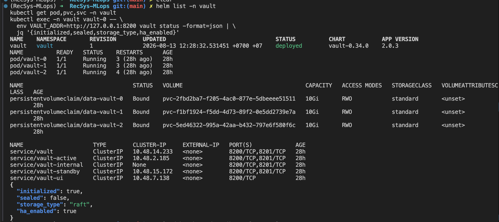
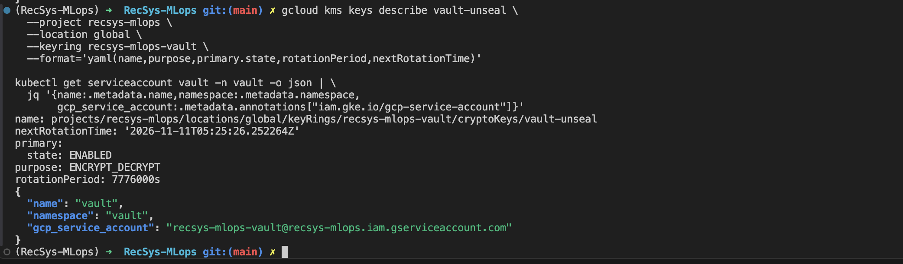
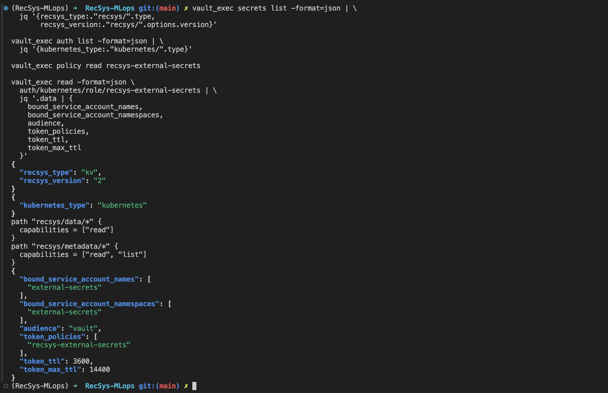
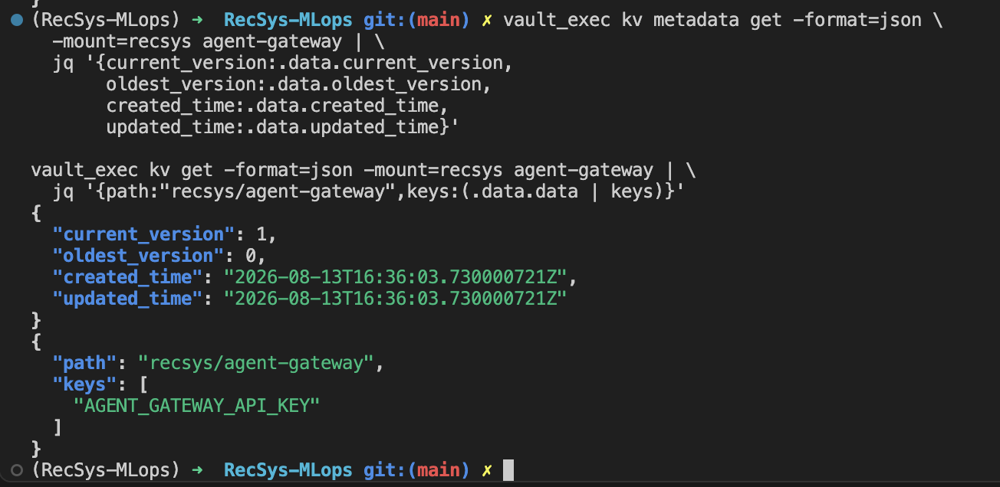
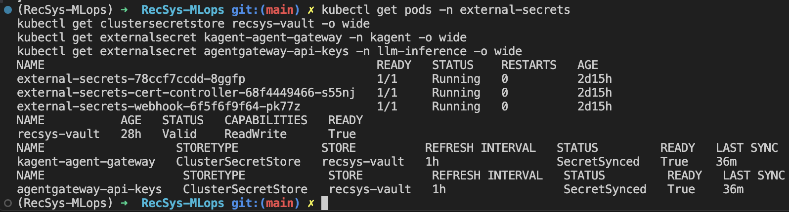

# HashiCorp Vault and Agent Gateway Authentication

This document records the HashiCorp Vault configuration used by the final LLM
platform and the sanitized coursework evidence. The live
GKE deployment was rechecked on 2026-08-14: Vault was initialized and unsealed
with HA Raft storage, `recsys-vault` was `Valid/Ready`, both Agent Gateway
`ExternalSecret` resources were `SecretSynced/Ready`, and the strict
`AgentgatewayPolicy` was accepted and attached.

The commands in this document deliberately display resource status, secret key
**names**, and equality checks only. They do not print the
`AGENT_GATEWAY_API_KEY`, a Vault token, recovery shares, or decoded Kubernetes
Secret values.

## Security Flow

```text
Google Cloud KMS
  -> auto-unseals the Vault HA/Raft cluster through Workload Identity

Vault KV v2: recsys/agent-gateway
  -> AGENT_GATEWAY_API_KEY
       |-> ExternalSecret kagent/kagent-agent-gateway
       |     -> ModelConfig/default-model-config sends Bearer key
       |
       `-> ExternalSecret llm-inference/agentgateway-api-keys
             -> AgentgatewayPolicy validates the same key in Strict mode

Kagent Agent -> Agent Gateway -> llm-d route -> Qwen llama.cpp Pods
```

Vault is the source of truth. Services do not call Vault directly in the normal
request path: External Secrets Operator (ESO) reads Vault and materializes
namespace-local Kubernetes Secrets, then Kagent and Agent Gateway consume those
Secrets using their native configuration.

## Code Reference

| Responsibility | Repository source |
|---|---|
| Dedicated Vault GSA, KMS key, KMS IAM, Workload Identity, official Vault Helm release, and TokenReview RBAC | [`vault.tf`, lines 1–109](../../../infra/terraform/gcp/modules/kubernetes-platform/vault.tf#L1-L109) |
| Pinned chart `0.34.0`, three replicas, and 10 GiB storage defaults | [`variables.tf`, lines 347–380](../../../infra/terraform/gcp/variables.tf#L347-L380) |
| Vault `2.0.3`, HA Raft, PVCs, internal HTTP listener, and GCP KMS seal | [`values.yaml.tftpl`, lines 1–107](../../../configs/vault/values.yaml.tftpl#L1-L107) |
| Initialization, KV v2, policy, Kubernetes auth, API-key generation, encrypted bootstrap artifact, and root-token revocation | [`bootstrap_vault.sh`, lines 29–294](../../../ops/gcp/bootstrap_vault.sh#L29-L294) |
| Vault-backed `ClusterSecretStore` | [`secretstore.yaml`, lines 1–37](../../../infra/helm/recsys-security/templates/secretstore.yaml#L1-L37) |
| Generic namespace-level `ExternalSecret` renderer | [`externalsecrets.yaml`, lines 1–40](../../../infra/helm/recsys-security/templates/externalsecrets.yaml#L1-L40) |
| Agent Gateway client/server and Agent Registry database secret paths | [`values.yaml`, lines 28–42](../../../infra/helm/recsys-security/values.yaml#L28-L42) |
| Agent Gateway API-key generation/write, Agent Registry PostgreSQL generation/write, and generic migrated-group writer | [`bootstrap_vault.sh`, line 177](../../../ops/gcp/bootstrap_vault.sh#L177), [`bootstrap_vault.sh`, line 192](../../../ops/gcp/bootstrap_vault.sh#L192), [`bootstrap_vault.sh`, line 216](../../../ops/gcp/bootstrap_vault.sh#L216) |
| Terraform enables both mappings and waits for both target Secrets | [`locals.tf`, lines 89–108](../../../infra/terraform/gcp/modules/kubernetes-platform/locals.tf#L89-L108), [`secret_management.tf`, lines 92–142](../../../infra/terraform/gcp/modules/kubernetes-platform/secret_management.tf#L92-L142) |
| Strict API-key enforcement at `PreRouting` | [`gateway-auth.yaml`, lines 1–19](../../../infra/helm/recsys-llm-serving/templates/gateway-auth.yaml#L1-L19), [`values.yaml`, lines 30–39](../../../infra/helm/recsys-llm-serving/values.yaml#L30-L39) |
| Kagent reads the client copy and sends it to the internal Gateway | [`configs/kagent/values.yaml`, lines 45–55](../../../configs/kagent/values.yaml#L45-L55) |
| Executable 401/401/success Gateway smoke test | [`llm_inference_smoke.sh`, lines 60–102](../../../ops/validation/llm_inference_smoke.sh#L60-L102) |

## Applied Configuration

### 1. Vault HA, persistent storage, and auto-unseal

Terraform installs the official HashiCorp chart from
`https://helm.releases.hashicorp.com`, pinned to chart `0.34.0`. The rendered
configuration runs three Vault `2.0.3` replicas with integrated Raft storage and
one 10 GiB `standard` PVC per replica.

The KMS trust chain is:

1. Terraform creates the `recsys-mlops-vault` key ring and `vault-unseal`
   cryptographic key. The key rotates every 90 days and has
   `prevent_destroy = true`.
2. A dedicated GSA receives only
   `roles/cloudkms.cryptoKeyEncrypterDecrypter` and `roles/cloudkms.viewer` on
   that exact key.
3. GKE Workload Identity maps Kubernetes ServiceAccount `vault/vault` to the
   GSA, so no downloadable GCP service-account JSON key is used.
4. The Vault `gcpckms` seal stanza uses that identity to auto-unseal the cluster
   after pod restarts.

The Vault API and UI are `ClusterIP` services. The listener currently uses
internal HTTP (`tls_disable = 1`) because TLS was explicitly left out of this
coursework scope. API-key authentication controls who may use Agent Gateway, but
it does not encrypt traffic. Do not describe this setup as transport-secure; add
TLS before exposing Vault or the model Gateway beyond the trusted cluster path.

### 2. One-time Vault bootstrap

Run from the repository root after Terraform has created the Vault pods:

```bash
bash ops/gcp/bootstrap_vault.sh
```

The script is idempotent and performs the following operations:

1. Verifies a Cloud KMS encrypt/decrypt round trip.
2. On the first run, initializes Vault with five recovery shares and threshold
   three, then waits for KMS auto-unseal.
3. Enables KV v2 at mount `recsys`.
4. Creates the read-only `recsys-external-secrets` policy.
5. Enables Kubernetes auth and binds role `recsys-external-secrets` to only the
   `external-secrets` ServiceAccount in namespace `external-secrets`, audience
   `vault`, token TTL `1h`, and maximum TTL `4h`.
6. If `recsys/agent-gateway` does not exist, generates an
   `agw-<64-hex-characters>` value and stores only the field
   `AGENT_GATEWAY_API_KEY` in Vault. Existing data is preserved on later runs.
7. If `recsys/agentregistry` does not exist, generates an independent
   PostgreSQL password and stores `POSTGRES_DB`, `POSTGRES_USER`,
   `POSTGRES_PASSWORD`, and `AGENT_REGISTRY_DATABASE_URL`. Existing data is
   preserved on later runs.
8. Creates a scoped `recsys-secrets-admin` token for later administration,
   removes the initial root token from the recovery document, encrypts the
   result into `.vault-bootstrap/vault-init.json.enc`, and revokes the one-time
   root token.

#### Vault ACL policy and Kubernetes auth binding

The bootstrap installs the following least-privilege Vault ACL policy as
`recsys-external-secrets`:

```hcl
path "recsys/data/*" {
  capabilities = ["read"]
}

path "recsys/metadata/*" {
  capabilities = ["read", "list"]
}
```

For Vault KV v2, `recsys/data/*` contains the secret values, so ESO may read
them but cannot create, update, patch, or delete them. The
`recsys/metadata/*` path contains record and version metadata; `read` and
`list` allow discovery and inspection without granting write access.

This is the permission of **External Secrets Operator against Vault**, not a
permission assigned directly to Kagent, Agent Gateway, Agent Registry, or any
other application pod. The access chain is:

```text
ServiceAccount external-secrets/external-secrets
  -> Vault Kubernetes auth role recsys-external-secrets
  -> short-lived Vault token carrying policy recsys-external-secrets
  -> read the selected Vault KV v2 record
  -> reconcile a namespace-local Kubernetes Secret
  -> the application pod consumes that Kubernetes Secret
```

The ACL is generated and installed in
[`bootstrap_vault.sh`, line 149](../../../ops/gcp/bootstrap_vault.sh#L149).
The Kubernetes auth role binds it to the exact ESO ServiceAccount,
namespace, JWT audience, and token TTL in
[`bootstrap_vault.sh`, line 166](../../../ops/gcp/bootstrap_vault.sh#L166).
Secret registration and rotation use the separate scoped admin token; ESO's
read-only token cannot perform those writes.

The encrypted bootstrap artifact is mode `600` and gitignored. Plaintext exists
only inside a mode-`700` temporary directory removed by the script's `EXIT`
trap. The decrypted artifact must never be committed.

#### Vault path and write provenance

The configured KV v2 mount is `recsys`. Helm/ESO uses the logical remote key
shown below, while the bootstrap writer uses the corresponding internal API
path `recsys/data/<group>`:

| Logical Vault record | Config secret path | Where the value is written |
|---|---|---|
| `recsys/agent-gateway` | [client/server `vaultPath` values (line 28)](../../../infra/helm/recsys-security/values.yaml#L28) | [generated API-key branch (line 177)](../../../ops/gcp/bootstrap_vault.sh#L177) |
| `recsys/agentregistry` | [Agent Registry `vaultPath` (line 38)](../../../infra/helm/recsys-security/values.yaml#L38) | [generated PostgreSQL branch (line 192)](../../../ops/gcp/bootstrap_vault.sh#L192) |
| `recsys/data-platform` | [core and observability paths (line 43)](../../../infra/helm/recsys-security/values.yaml#L43) | [generic migration writer (line 216)](../../../ops/gcp/bootstrap_vault.sh#L216) |
| `recsys/mlflow` | [MLflow path (line 51)](../../../infra/helm/recsys-security/values.yaml#L51) | [generic migration writer (line 216)](../../../ops/gcp/bootstrap_vault.sh#L216) |
| `recsys/runtime` | [runtime path (line 55)](../../../infra/helm/recsys-security/values.yaml#L55) | [generic migration writer (line 216)](../../../ops/gcp/bootstrap_vault.sh#L216) |
| `recsys/kserve-minio` | [KServe path (line 60)](../../../infra/helm/recsys-security/values.yaml#L60) | [generic migration writer (line 216)](../../../ops/gcp/bootstrap_vault.sh#L216) |
| `recsys/gateway` | [gateway paths (line 69)](../../../infra/helm/recsys-security/values.yaml#L69) | [generic migration writer (line 216)](../../../ops/gcp/bootstrap_vault.sh#L216) |
| `recsys/analytics` | [analytics remote key (line 6)](../../../infra/helm/recsys-analytics/values.yaml#L6) | [generic migration writer (line 216)](../../../ops/gcp/bootstrap_vault.sh#L216) |
| `recsys/jenkins-runtime` | [runtime additional path (line 109)](../../../infra/terraform/gcp/modules/kubernetes-platform/locals.tf#L109) | [generic migration writer (line 216)](../../../ops/gcp/bootstrap_vault.sh#L216) |

### 3. ESO authentication and secret distribution

The `recsys-vault` `ClusterSecretStore` connects to:

```text
server:    http://vault.vault.svc.cluster.local:8200
KV mount:  recsys (version v2)
auth:      kubernetes
role:      recsys-external-secrets
identity:  external-secrets/external-secrets
audience:  vault
```

Terraform enables these two mappings when
`deploy_llm_inference=true` and `agent_gateway_auth_enabled=true`:

| Vault record | Target Kubernetes Secret | Use |
|---|---|---|
| `recsys/agent-gateway` | `kagent/kagent-agent-gateway` | Client credential read by Kagent `ModelConfig` |
| `recsys/agent-gateway` | `llm-inference/agentgateway-api-keys` | Server-side accepted key set read by `AgentgatewayPolicy` |
| `recsys/agentregistry` | `agentregistry/agentregistry-runtime` | Agent Registry connection URL and pgvector PostgreSQL credentials |

Both targets are owned by ESO (`creationPolicy: Owner`) and refreshed every
hour. The plaintext key is not present in Git, Helm values, or Terraform state.
The Terraform `kagent_agent_gateway` placeholder has `count = 0` while auth is
enabled and exists only as a no-auth development fallback.

### 4. Agent Gateway authentication

The local `recsys-llm-serving` chart renders this effective policy:

```yaml
apiVersion: agentgateway.dev/v1alpha1
kind: AgentgatewayPolicy
metadata:
  name: llm-d-inference-gateway-api-key
  namespace: llm-inference
spec:
  targetRefs:
    - group: gateway.networking.k8s.io
      kind: Gateway
      name: llm-d-inference-gateway
  traffic:
    phase: PreRouting
    apiKeyAuthentication:
      mode: Strict
      secretRef:
        name: agentgateway-api-keys
```

`Strict` means a request is rejected before routing when its Bearer API key is
missing or is not present in `agentgateway-api-keys`. The Kagent global model
configuration reads the client copy and automatically sends it as the OpenAI
client API key. See the full Agent-to-model setup in
[`global_model_config.md`](./global_model_config.md).

## Safe Vault Operator Session

The rotation commands below need the scoped admin token. This helper
decrypts the recovery artifact into a private temporary directory, loads only
`recsys_admin_token`, and never prints it:

```bash
cd /Users/KHOAI/anhkhoa/RecSys-MLops

vault_proof_dir="$(mktemp -d)"
chmod 700 "${vault_proof_dir}"
trap 'unset VAULT_TOKEN; rm -rf "${vault_proof_dir}"' EXIT

gcloud kms decrypt \
  --project recsys-mlops \
  --location global \
  --keyring recsys-mlops-vault \
  --key vault-unseal \
  --ciphertext-file .vault-bootstrap/vault-init.json.enc \
  --plaintext-file "${vault_proof_dir}/vault-bootstrap.json" \
  --quiet

VAULT_TOKEN="$(jq -er '.recsys_admin_token' \
  "${vault_proof_dir}/vault-bootstrap.json")"

vault_exec() {
  printf '%s\n' "${VAULT_TOKEN}" | kubectl exec -i -n vault vault-0 -- \
    sh -c 'IFS= read -r VAULT_TOKEN; export VAULT_TOKEN; \
      export VAULT_ADDR=http://127.0.0.1:8200; exec vault "$@"' sh "$@"
}
```

Do not run this session with shell tracing (`set -x`). Leaving the shell triggers
the cleanup trap. To clean up immediately, run `exit` rather than displaying the
temporary JSON.

## Captured Security Proof

The following sanitized captures are the submitted runtime evidence. They show
resource state and secret key names without displaying API-key or database
credential values.

### Vault Helm release, HA Raft storage, and auto-unseal



**Figure: Vault HA runtime proof.** The live cluster runs the official
`vault-0.34.0` chart with application version `2.0.3`. All three Vault pods are
`1/1 Running`, each Raft member has a bound 10 GiB PVC, and every exposed Vault
service is internal-only. The sanitized status confirms `initialized=true`,
`sealed=false`, `storage_type=raft`, and `ha_enabled=true`.

### Cloud KMS and Workload Identity



**Figure: KMS auto-unseal identity proof.** The `vault-unseal` key is enabled
for symmetric encrypt/decrypt, has a 90-day rotation period and a scheduled
next rotation. The `vault/vault` Kubernetes ServiceAccount is mapped to the
dedicated `recsys-mlops-vault` Google service account, so Vault can use KMS
through Workload Identity without a JSON service-account key.

### KV v2, Kubernetes authentication, ACL policy, and role



**Figure: Vault authentication and authorization proof.** The `recsys` secrets
engine is KV v2 and the Kubernetes auth method is enabled. The live
`recsys-external-secrets` policy grants only `read` on `recsys/data/*` and
`read,list` on `recsys/metadata/*`. Its auth role is restricted to the
`external-secrets/external-secrets` ServiceAccount with audience `vault`, a
one-hour token TTL, and a four-hour maximum TTL.

### Agent Gateway Vault record metadata



**Figure: Agent Gateway secret record proof.** The sanitized output confirms
that `recsys/agent-gateway` exists as a versioned Vault record and contains the
expected `AGENT_GATEWAY_API_KEY` field. Only metadata and the key name are
shown; the API-key value is not rendered.

### External Secrets Operator synchronization



**Figure: ESO authentication and Agent Gateway fan-out proof.** All three ESO
controller components are running, `ClusterSecretStore/recsys-vault` is
`Valid` and `Ready=True`, and both `kagent/kagent-agent-gateway` and
`llm-inference/agentgateway-api-keys` report `SecretSynced` and `Ready=True`.
This demonstrates that the same Vault record is reconciled into the client and
validator namespaces without embedding the API key in Git.

## Rotate the Agent Gateway API Key

Rotation changes the one Vault field, forces both ESO reconciliations, restarts
the Kagent consumers that may hold the old key in memory, and reruns the
authentication proof. Start the **Safe Vault Operator Session** first.

### 1. Patch only the API-key field with KV v2 CAS

The value is read silently and sent through stdin so it does not enter shell
history:

```zsh
rotate_agent_gateway_key() {
  before_version="$(vault_exec kv metadata get -format=json \
    -mount=recsys agent-gateway | jq -er '.data.current_version')" || return

  IFS= read -r -s 'new_agent_gateway_key?New Agent Gateway API key: '
  printf '\n'
  if [ -z "${new_agent_gateway_key}" ]; then
    printf 'API key must not be empty; Vault was not changed.\n' >&2
    unset new_agent_gateway_key
    return 1
  fi

  printf '%s' "${new_agent_gateway_key}" \
    >"${vault_proof_dir}/agent-gateway-key"
  unset new_agent_gateway_key

  {
    printf '%s\n' "${VAULT_TOKEN}"
    sed -n '1,$p' "${vault_proof_dir}/agent-gateway-key"
  } | kubectl exec -i -n vault vault-0 -- \
    sh -c 'IFS= read -r VAULT_TOKEN; export VAULT_TOKEN; \
      export VAULT_ADDR=http://127.0.0.1:8200; \
      exec vault kv patch -cas="$1" -mount=recsys agent-gateway \
        AGENT_GATEWAY_API_KEY=-' sh "${before_version}" >/dev/null || return

  after_version="$(vault_exec kv metadata get -format=json \
    -mount=recsys agent-gateway | jq -er '.data.current_version')" || return
  test "${after_version}" -gt "${before_version}" || return
  printf 'Vault KV version: %s -> %s\n' \
    "${before_version}" "${after_version}"
}

rotate_agent_gateway_key
```

`vault kv patch` preserves unspecified fields. `-cas` prevents a silent lost
update if another operator writes a newer version between the metadata read and
the rotation.

### 2. Force both ExternalSecrets to synchronize

```bash
client_sync_before="$(kubectl get externalsecret kagent-agent-gateway \
  -n kagent -o jsonpath='{.status.syncedResourceVersion}')"
server_sync_before="$(kubectl get externalsecret agentgateway-api-keys \
  -n llm-inference -o jsonpath='{.status.syncedResourceVersion}')"

force_sync="$(date +%s)"
kubectl annotate externalsecret kagent-agent-gateway -n kagent \
  force-sync="${force_sync}" --overwrite
kubectl annotate externalsecret agentgateway-api-keys -n llm-inference \
  force-sync="${force_sync}" --overwrite

for attempt in $(seq 1 60); do
  client_sync_after="$(kubectl get externalsecret kagent-agent-gateway \
    -n kagent -o jsonpath='{.status.syncedResourceVersion}')"
  server_sync_after="$(kubectl get externalsecret agentgateway-api-keys \
    -n llm-inference -o jsonpath='{.status.syncedResourceVersion}')"
  if [ -n "${client_sync_after}" ] && \
     [ -n "${server_sync_after}" ] && \
     [ "${client_sync_after}" != "${client_sync_before}" ] && \
     [ "${server_sync_after}" != "${server_sync_before}" ]; then
    break
  fi
  sleep 2
done

test "${client_sync_after}" != "${client_sync_before}"
test "${server_sync_after}" != "${server_sync_before}"
kubectl get externalsecret kagent-agent-gateway -n kagent -o wide
kubectl get externalsecret agentgateway-api-keys -n llm-inference -o wide
```

Waiting for `syncedResourceVersion` to change proves a new reconciliation
occurred. Checking `Ready=True` alone is not sufficient because it can still be
the status from the previous Vault version.

### 3. Verify equality, restart consumers, and retest

Repeat **Proof 7** to confirm the client/server copies match. Then restart the
Kagent Agent deployment so an environment-loaded credential cannot remain stale:

```bash
kubectl rollout restart deployment/global-model-config-smoke -n kagent
kubectl rollout status deployment/global-model-config-smoke \
  -n kagent --timeout=300s

bash ops/validation/llm_inference_smoke.sh
```

Finally repeat **Proof 10**. Rotation is complete only when the Vault version
increased, both ESO sync versions changed, the two target values match in memory,
missing/invalid keys still return `401`, the new valid key succeeds, and the
Kagent Agent produces a model response.

If verification fails, do not expose either key. Roll Vault back to the previous
version, force both ExternalSecrets to sync again, restart the Kagent deployment,
and rerun the proofs:

```bash
vault_exec kv rollback -mount=recsys \
  -version="${before_version}" agent-gateway
```

## Operational Safety

- Keep `set -x` disabled while any token or API key exists in a shell variable.
- If a secret is accidentally rendered, clear the terminal scrollback and
  rotate that secret.
- The current HTTP-only scope provides authentication, not encryption in
  transit. TLS remains a required hardening step for a production/public path.
