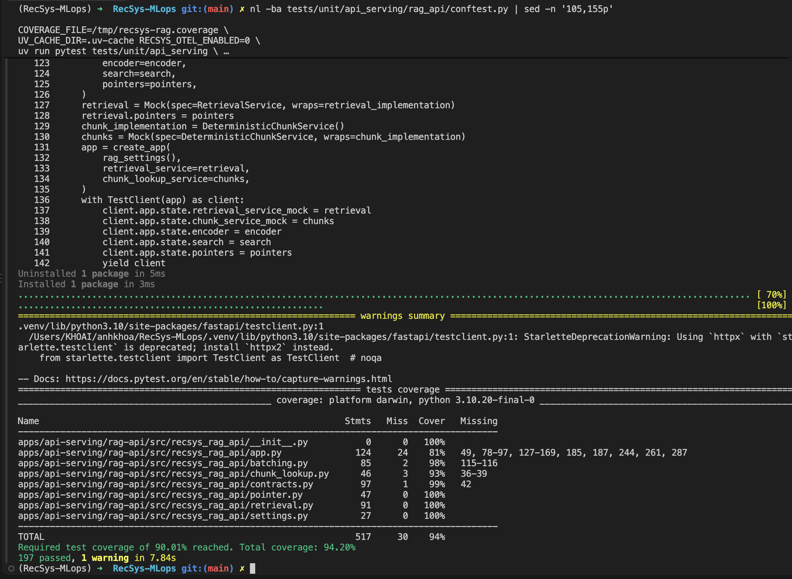
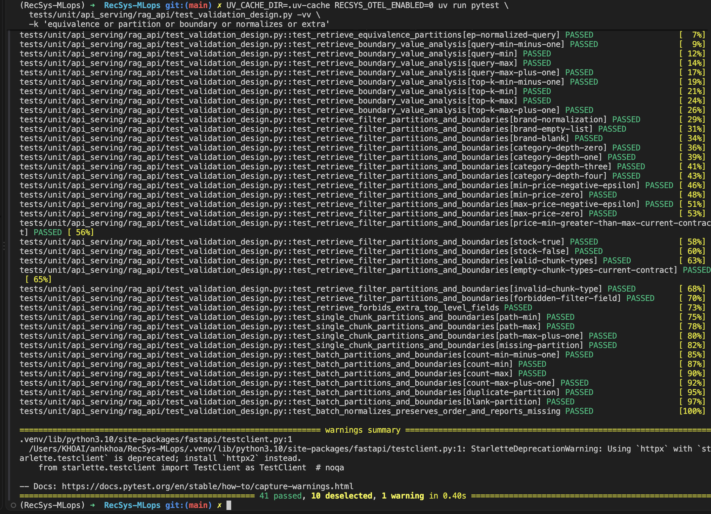
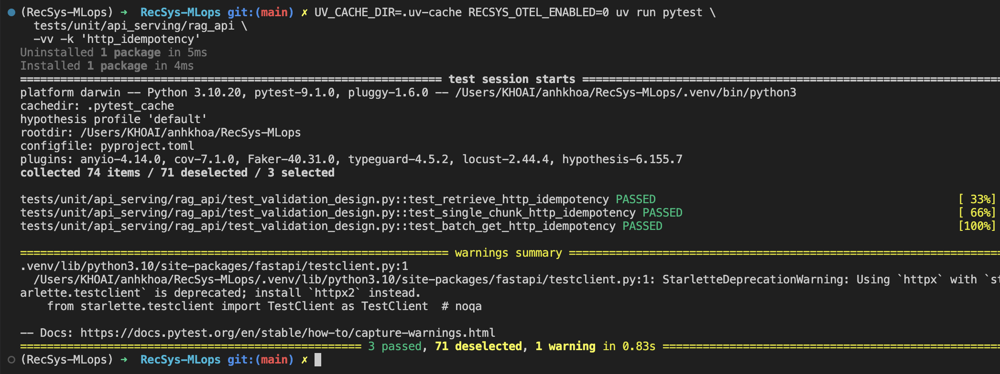
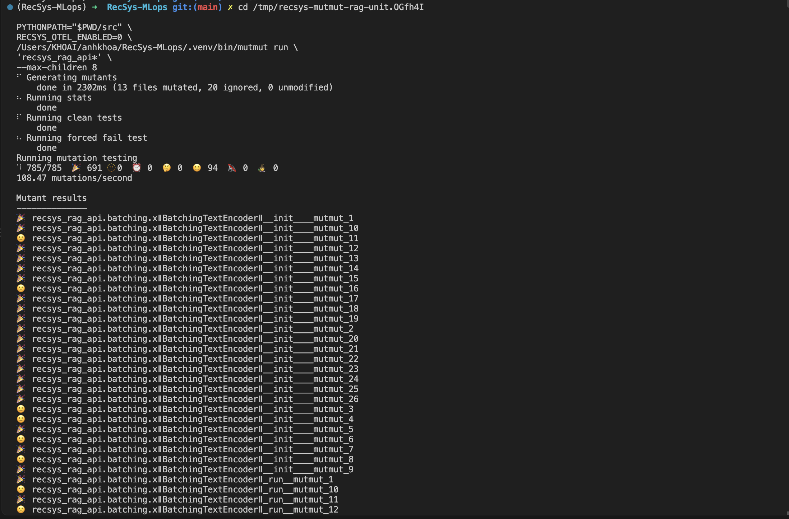
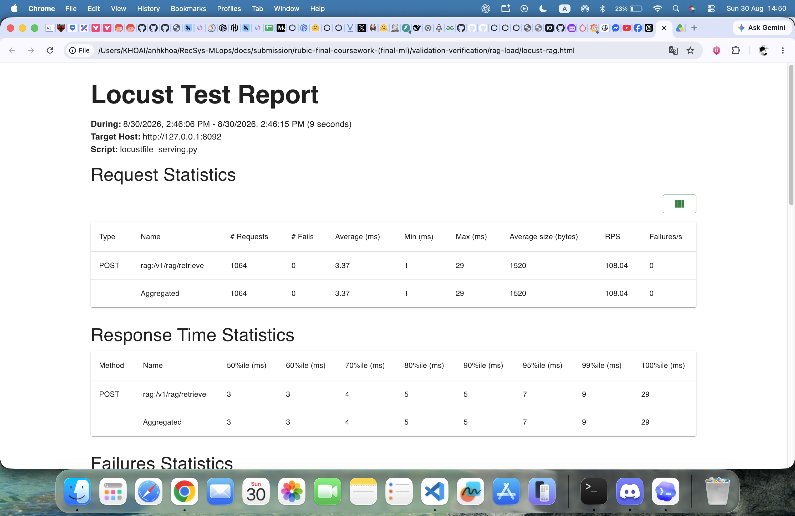
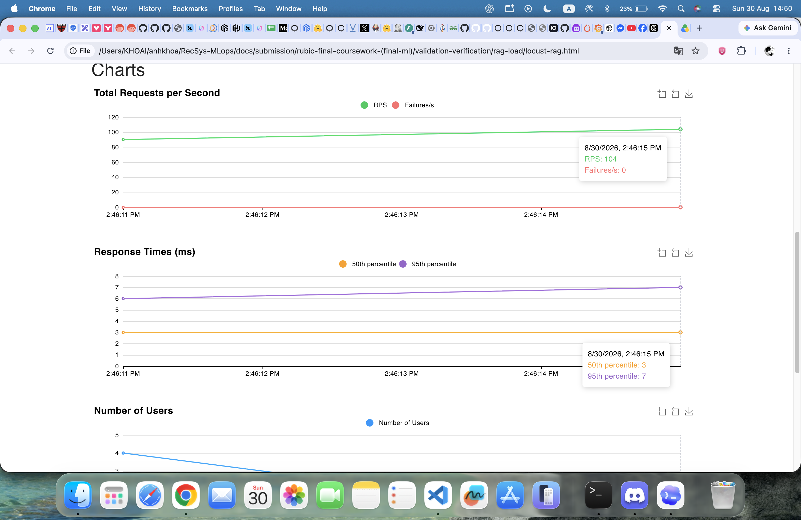
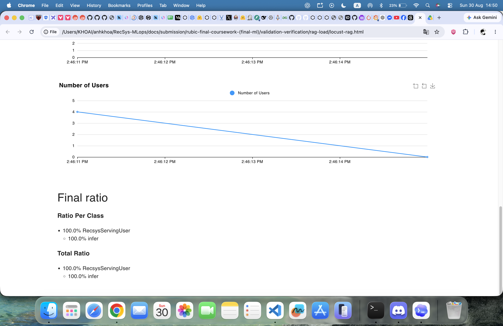

# Validation & Verification — RAG API

Functional evidence was verified on **2026-08-30** and the combined unit plus
mutation-oracle gate was re-verified on **2026-09-13** for the public data
endpoints:

- `POST /v1/rag/retrieve`
- `GET /v1/rag/chunks/{chunk_id}`
- `POST /v1/rag/chunks:batch-get`

Operational Substrate/HA rollout history remains in
[`benchmark_ha.md`](benchmark_ha.md); it is not duplicated here.

| Requirement | Result |
| --- | ---: |
| Real FastAPI + `TestClient` + injected mocks | PASS |
| Coverage `> 90%` | **94.20%** |
| Full data-contract EP/BVA | PASS |
| HTTP Hypothesis idempotency | PASS: 3 endpoints × 60 examples × 3 requests |
| Unit-owned mutation score `> 80%` | **691/785 = 88.03%** |
| Bad selected mutation states | **0** |
| Locust HTML/SLA | PASS |

## 1. Original contracts, fixture/mock and coverage

The request contracts are defined by
[`RetrievalFilters` (line 26)](../../../apps/api-serving/rag-api/src/recsys_rag_api/contracts.py#L26),
[`RetrievalRequest` (line 49)](../../../apps/api-serving/rag-api/src/recsys_rag_api/contracts.py#L49),
and [`ChunkBatchRequest` (line 140)](../../../apps/api-serving/rag-api/src/recsys_rag_api/contracts.py#L140).
The single-chunk path constraint is declared in the
[`GET /v1/rag/chunks/{chunk_id}` endpoint (line 248)](../../../apps/api-serving/rag-api/src/recsys_rag_api/app.py#L248):

```python
class RetrievalRequest(StrictModel):
    query: str = Field(min_length=1, max_length=1000)
    top_k_items: int = Field(default=10, ge=1, le=20)
    filters: RetrievalFilters = Field(default_factory=RetrievalFilters)

class RetrievalFilters(StrictModel):
    brands: list[str] | None = None
    category_prefix: list[str] | None = Field(default=None, max_length=3)
    min_current_price: float | None = Field(default=None, ge=0)
    max_current_price: float | None = Field(default=None, ge=0)
    in_stock: bool | None = None
    chunk_types: list[ChunkType] | None = None

class ChunkBatchRequest(StrictModel):
    chunk_ids: list[str] = Field(min_length=1, max_length=100)

chunk_id: str = Path(min_length=1, max_length=512)
```

`StrictModel(extra="forbid")` rejects unknown fields. Validators trim queries,
brands and batch IDs; brands and chunk IDs cannot be blank, and batch IDs must
be unique. These rules are the source of the EP/BVA matrix below.

The fixture supplies a
[`DeterministicEncoder` (line 39)](../../../tests/unit/api_serving/rag_api/conftest.py#L39),
[`DeterministicSearch` (line 51)](../../../tests/unit/api_serving/rag_api/conftest.py#L51),
[`DeterministicPointers` (line 78)](../../../tests/unit/api_serving/rag_api/conftest.py#L78),
and [`DeterministicChunkService` (line 90)](../../../tests/unit/api_serving/rag_api/conftest.py#L90).
The [`rag_api` fixture (line 117)](../../../tests/unit/api_serving/rag_api/conftest.py#L117)
wraps the production `RetrievalService` and deterministic chunk service with
`Mock`, then injects both into the real FastAPI app:

```python
retrieval_implementation = RetrievalService(
    encoder=encoder,
    search=search,
    pointers=pointers,
)
retrieval = Mock(spec=RetrievalService, wraps=retrieval_implementation)
chunks = Mock(spec=DeterministicChunkService, wraps=chunk_implementation)
app = create_app(
    rag_settings(),
    retrieval_service=retrieval,
    chunk_lookup_service=chunks,
)
with TestClient(app) as client:
    client.app.state.retrieval_service_mock = retrieval
    client.app.state.chunk_service_mock = chunks
    yield client
```

Milvus, Feast, MinIO and ONNX are not contacted, but retrieve still executes
the production filtering, grouping and ranking implementation.

```bash
nl -ba tests/unit/api_serving/rag_api/conftest.py | sed -n '105,155p'
COVERAGE_FILE=/tmp/recsys-rag.coverage \
UV_CACHE_DIR=.uv-cache RECSYS_OTEL_ENABLED=0 \
uv run pytest tests/unit/api_serving \
  -q \
  --cov=recsys_rag_api --cov-report=term-missing \
  --cov-fail-under=90.01
```

> **Proof note — fixture/mock and coverage:** deterministic wrapped
> retrieval/chunk mocks are shown with 94.20% coverage, above the 90.01% gate.



## 2. EP and BVA derived from the contracts

### 2.1 Input classes and their meaning

| Contract/input | Equivalence classes | Why each class matters |
| --- | --- | --- |
| Retrieve query | no filter; filtered; surrounding whitespace; blank; forbidden extra | Separates normal retrieval, filter construction, normalization and API-boundary rejection. |
| Brands | normalized non-empty list; empty list; blank member | Proves trimming and rejection of a filter that cannot match meaningfully. |
| Category prefix | omitted/empty; depth 1; depth 3; depth 4 | Exercises no category restriction, partial hierarchy, deepest valid hierarchy and overflow. |
| Price | omitted; zero/positive; negative epsilon; min greater than max | Proves lower-bound validation. The current contract accepts `min > max`; the test records rather than overclaims this behavior. |
| Stock | omitted; `true`; `false` | All three produce different filter semantics and must remain distinct. |
| Chunk types | omitted/empty; supported literals; unsupported literal | Distinguishes no restriction, explicit restriction and invalid vocabulary. |
| Single chunk | found; missing; unavailable/error; invalid path | Maps respectively to `200`, `404`, `503/502` and `422`; an empty path is routing `404`. |
| Batch chunks | all found; found/missing mixture; normalized IDs; duplicate; blank; forbidden extra | Covers successful ordering/missing reporting and every validator rejection class. |

### 2.2 Boundary representatives

| Original contract | `min-1` | `min` | `max` | `max+1` |
| --- | ---: | ---: | ---: | ---: |
| query length `1..1000` | `0 -> 422` | `1 -> 200` | `1000 -> 200` | `1001 -> 422` |
| `top_k_items 1..20` | `0 -> 422` | `1 -> 200` | `20 -> 200` | `21 -> 422` |
| category depth `<=3` | N/A | `0/1 -> 200` | `3 -> 200` | `4 -> 422` |
| price `>=0` | `-0.01 -> 422` | `0 -> 200` | unbounded | N/A |
| chunk path length `1..512` | empty route `404` | `1 -> 200` | `512 -> 200` | `513 -> 422` |
| batch count `1..100` | `0 -> 422` | `1 -> 200` | `100 -> 200` | `101 -> 422` |

### 2.3 Parametrized code

The retrieve EP matrix starts at
[`@pytest.mark.parametrize` (line 16)](../../../tests/unit/api_serving/rag_api/test_validation_design.py#L16),
and its HTTP assertions are in
[`test_retrieve_equivalence_partitions` (line 28)](../../../tests/unit/api_serving/rag_api/test_validation_design.py#L28).
The query/top-k BVA matrix starts at
[`@pytest.mark.parametrize` (line 42)](../../../tests/unit/api_serving/rag_api/test_validation_design.py#L42),
with the dependency-call oracle in
[`test_retrieve_boundary_value_analysis` (line 65)](../../../tests/unit/api_serving/rag_api/test_validation_design.py#L65):

```python
@pytest.mark.parametrize(
    ("payload", "expected_query"),
    [
        ({"query": "tai nghe", "top_k_items": 10}, "tai nghe"),
        ({"query": "tai nghe", "filters": {"brands": [" Sony "]}}, "tai nghe"),
        ({"query": "  tai nghe  "}, "tai nghe"),
    ],
    ids=["ep-no-filter", "ep-filtered", "ep-normalized-query"],
)
def test_retrieve_equivalence_partitions(...):
    ...

@pytest.mark.parametrize(
    ("payload", "expected_status"),
    [
        ({"query": "", "top_k_items": 1}, 422),
        ({"query": "x", "top_k_items": 1}, 200),
        ({"query": "x" * 1000, "top_k_items": 20}, 200),
        ({"query": "x" * 1001, "top_k_items": 1}, 422),
        ({"query": "x", "top_k_items": 0}, 422),
        ({"query": "x", "top_k_items": 21}, 422),
    ],
)
def test_retrieve_boundary_value_analysis(...):
    ...
```

The [filter parametrization (line 78)](../../../tests/unit/api_serving/rag_api/test_validation_design.py#L78)
and [`test_retrieve_filter_partitions_and_boundaries` oracle (line 129)](../../../tests/unit/api_serving/rag_api/test_validation_design.py#L129)
derive directly from `RetrievalFilters` and its validators. The separate
[forbidden top-level field case (line 152)](../../../tests/unit/api_serving/rag_api/test_validation_design.py#L152)
checks `StrictModel(extra="forbid")`:

```python
@pytest.mark.parametrize(
    ("filters", "expected_status", "expected"),
    [
        ({"brands": [" Sony ", "Acme"]}, 200, {"brands": ["Sony", "Acme"]}),
        ({"brands": []}, 422, None),
        ({"brands": [" "]}, 422, None),
        ({"category_prefix": []}, 200, {"category_prefix": []}),
        ({"category_prefix": ["Audio", "Headphones", "Wireless"]}, 200, ...),
        ({"category_prefix": ["a", "b", "c", "d"]}, 422, None),
        ({"min_current_price": -0.01}, 422, None),
        ({"min_current_price": 0}, 200, {"min_current_price": 0}),
        ({"in_stock": True}, 200, {"in_stock": True}),
        ({"in_stock": False}, 200, {"in_stock": False}),
        ({"chunk_types": ["review", "qna"]}, 200, ...),
        ({"chunk_types": ["invalid"]}, 422, None),
        ({"unknown_filter": "forbidden"}, 422, None),
    ],
)
def test_retrieve_filter_partitions_and_boundaries(...):
    ...
```

The [single-chunk matrix (line 160)](../../../tests/unit/api_serving/rag_api/test_validation_design.py#L160),
[empty-route case (line 183)](../../../tests/unit/api_serving/rag_api/test_validation_design.py#L183),
and [batch matrix (line 189)](../../../tests/unit/api_serving/rag_api/test_validation_design.py#L189)
cover the remaining boundaries. The
[normalization/order/missing-ID oracle (line 221)](../../../tests/unit/api_serving/rag_api/test_validation_design.py#L221)
covers the successful batch partition:

```python
@pytest.mark.parametrize(
    ("chunk_id", "expected_status"),
    [("a", 200), ("x" * 512, 200), ("x" * 513, 422), ("missing", 404)],
)
def test_single_chunk_partitions_and_boundaries(...):
    ...

@pytest.mark.parametrize(
    ("chunk_ids", "expected_status"),
    [
        ([], 422),
        (["only"], 200),
        ([f"chunk-{index}" for index in range(100)], 200),
        ([f"chunk-{index}" for index in range(101)], 422),
        (["same", "same"], 422),
        (["valid", "   "], 422),
    ],
)
def test_batch_partitions_and_boundaries(...):
    ...
```

Every invalid contract case requires the relevant retrieval/chunk dependency
to remain uncalled. Valid cases require an exact call and, where applicable,
the normalized request, preserved order and explicit missing-ID list.

```bash
UV_CACHE_DIR=.uv-cache RECSYS_OTEL_ENABLED=0 uv run pytest \
  tests/unit/api_serving/rag_api/test_validation_design.py -vv \
  -k 'equivalence or partition or boundary or normalizes or extra'
```

> **Proof note — EP/BVA:** all 41 selected retrieve, filter, single-chunk and
> batch partition/boundary cases pass.



## 3. HTTP property-based idempotency

The three complete properties are the
[`retrieve` HTTP idempotency property (line 240)](../../../tests/unit/api_serving/rag_api/test_validation_design.py#L240),
[`single chunk` HTTP idempotency property (line 284)](../../../tests/unit/api_serving/rag_api/test_validation_design.py#L284),
and [`batch-get` HTTP idempotency property (line 302)](../../../tests/unit/api_serving/rag_api/test_validation_design.py#L302):

```python
@given(
    query=st.text(..., min_size=1, max_size=40).filter(lambda value: bool(value.strip())),
    top_k_items=st.integers(min_value=1, max_value=20),
    in_stock=st.one_of(st.none(), st.booleans()),
)
@settings(max_examples=60, deadline=None, ...)
def test_retrieve_http_idempotency(rag_api, ...):
    responses = [rag_api.post("/v1/rag/retrieve", json=payload) for _ in range(3)]
    assert responses[0].json() == responses[1].json() == responses[2].json()
    assert retrieval.retrieve.call_count == 3
    assert len(encoder.calls) == 3
    assert pointers.calls == 3

@given(chunk_id=safe_chunk_ids)
@settings(max_examples=60, deadline=None, ...)
def test_single_chunk_http_idempotency(rag_api, chunk_id):
    responses = [rag_api.get(f"/v1/rag/chunks/{chunk_id}") for _ in range(3)]
    assert responses[0].json() == responses[1].json() == responses[2].json()
    assert chunks.get_many.call_count == 3

@given(chunk_ids=st.lists(safe_chunk_ids, min_size=1, max_size=20, unique=True))
@settings(max_examples=60, deadline=None, ...)
def test_batch_get_http_idempotency(rag_api, chunk_ids):
    responses = [rag_api.post("/v1/rag/chunks:batch-get", json=payload) for _ in range(3)]
    assert responses[0].json() == responses[1].json() == responses[2].json()
    assert chunks.get_many.call_count == 3
```

For each of 60 generated examples per endpoint, the same request is sent three
times through FastAPI. The invariant compares status and complete serialized
JSON. Exact dependency counts prove each request actually executed. Retrieve
also checks deterministic encoder, pointer and search interactions. The claim
is scoped to fixed dependencies; it does not say a newly promoted live index
must equal an older index.

```bash
UV_CACHE_DIR=.uv-cache RECSYS_OTEL_ENABLED=0 uv run pytest \
  tests/unit/api_serving/rag_api -vv -k 'http_idempotency'
```

> **Proof note — HTTP idempotency:** retrieve, single-chunk and batch-get all
> pass; together they cover 180 generated examples and 540 HTTP requests.



## 4. Unit-owned full-scope mutation testing

Root [`[tool.mutmut]` (line 99)](../../../pyproject.toml#L99) selects contracts,
active pointer, batching, chunk lookup and retrieval. The unit-owned runner
defines the [per-service targets and selected unit files (lines 34–69)](../../../tests/unit/api_serving/run_mutation.py#L34),
builds an [isolated workspace (lines 96–119)](../../../tests/unit/api_serving/run_mutation.py#L96)
only from production sources and tests under
[`tests/unit/api_serving/rag_api`](../../../tests/unit/api_serving/rag_api/),
executes that [complete unit directory as a clean preflight (lines 138–151)](../../../tests/unit/api_serving/run_mutation.py#L138),
and applies the [strictly-greater-than-80% score plus bad-state gate (lines 175–185)](../../../tests/unit/api_serving/run_mutation.py#L175).

The Mutmut pass selects `test_mutation_oracles.py`, `test_retrieval.py`, and
`test_chunk_lookup.py` from the same RAG unit-test directory. The complete RAG
unit directory runs in the clean preflight. FastAPI `TestClient` lifecycle tests
are not imported a second time
inside Mutmut 3.6 because its partial module reload can produce Starlette
`No response returned` failures. Direct batching unit tests are also excluded
from the instrumented pass because broken synchronization mutants can block the
caller; the deadline-safe batching mutation oracles below cover that behavior.

| Production code under mutation | Example production line / possible mutation | Oracle(s) used by the gate | Contract asserted |
| --- | --- | --- | --- |
| [Request/response contracts](../../../apps/api-serving/rag-api/src/recsys_rag_api/contracts.py#L20) | [`contracts.py:53`](../../../apps/api-serving/rag-api/src/recsys_rag_api/contracts.py#L53): `le=20` → `le=21`, incorrectly accepting one item above the upper bound. | [`test_strict_contract_boundaries_and_normalization`](../../../tests/unit/api_serving/rag_api/test_mutation_oracles.py#L89) | Normalization, defaults, forbidden extras, adjacent bounds and strict schemas. |
| [`ActivePointerManager`](../../../apps/api-serving/rag-api/src/recsys_rag_api/pointer.py#L52) | [`pointer.py:78`](../../../apps/api-serving/rag-api/src/recsys_rag_api/pointer.py#L78): TTL comparison `<` → `<=`, changing the exact cache-refresh boundary. | [Unit LKG/cold-start tests](../../../tests/unit/api_serving/rag_api/test_retrieval.py#L108), [contract/LKG oracle](../../../tests/unit/api_serving/rag_api/test_mutation_oracles.py#L127), and [TTL oracle](../../../tests/unit/api_serving/rag_api/test_mutation_oracles.py#L145) | Embedding compatibility, TTL refresh, cold failure and preservation of the last-known-good pointer. |
| [`BatchingTextEncoder`](../../../apps/api-serving/rag-api/src/recsys_rag_api/batching.py#L29) | [`batching.py:113`](../../../apps/api-serving/rag-api/src/recsys_rag_api/batching.py#L113): capacity comparison `>` → `>=`, rejecting a candidate that exactly fills the batch. | [Deadline-safe direct-path oracle](../../../tests/unit/api_serving/rag_api/test_mutation_oracles.py#L425) and [worker/error oracle](../../../tests/unit/api_serving/rag_api/test_mutation_oracles.py#L489) | Constructor bounds, direct and queued paths, bounded splitting, shutdown and verbatim error propagation. |
| [`ChunkLookupService`](../../../apps/api-serving/rag-api/src/recsys_rag_api/chunk_lookup.py#L60) | [`chunk_lookup.py:89`](../../../apps/api-serving/rag-api/src/recsys_rag_api/chunk_lookup.py#L89): missing-field check `or` → `and`, allowing a partial row to be treated as complete. | [Strict unit mapping oracle](../../../tests/unit/api_serving/rag_api/test_chunk_lookup.py#L47) and [pointer/order/conversion oracle](../../../tests/unit/api_serving/rag_api/test_mutation_oracles.py#L328) | Pointer-selected view, exact Feast request, request-order preservation, missing IDs and complete typed field conversion. |
| [`_matches` and `RetrievalService`](../../../apps/api-serving/rag-api/src/recsys_rag_api/retrieval.py#L36) | [`retrieval.py:89`](../../../apps/api-serving/rag-api/src/recsys_rag_api/retrieval.py#L89): unique-item stop condition `>=` → `>`, causing an unnecessary refill when the target is met exactly. | [Unit filter/group/refill tests](../../../tests/unit/api_serving/rag_api/test_retrieval.py#L83), [filter-boundary oracle](../../../tests/unit/api_serving/rag_api/test_mutation_oracles.py#L176), [group/rank oracle](../../../tests/unit/api_serving/rag_api/test_mutation_oracles.py#L209), and [refill/final-cap oracle](../../../tests/unit/api_serving/rag_api/test_mutation_oracles.py#L283) | Every hard filter, E5 query prefix, bounded refill, item grouping, tie-break, evidence cap and final top-k. |
| [`FeastCandidateSearch`](../../../apps/api-serving/rag-api/src/recsys_rag_api/retrieval.py#L135) | [`retrieval.py:170`](../../../apps/api-serving/rag-api/src/recsys_rag_api/retrieval.py#L170): empty row-count default `0` → `1`, fabricating a row from an empty response. | [Strict row/request oracle](../../../tests/unit/api_serving/rag_api/test_retrieval.py#L171) and [qualified multi-row oracle](../../../tests/unit/api_serving/rag_api/test_retrieval.py#L223) | Exact feature request, empty results, qualified/unqualified columns, row count and complete typed conversion. |
| [`MilvusCandidateSearch`](../../../apps/api-serving/rag-api/src/recsys_rag_api/retrieval.py#L196) | [`retrieval.py:254`](../../../apps/api-serving/rag-api/src/recsys_rag_api/retrieval.py#L254): `limit=top_k` changed or removed, violating the requested ANN result bound. | [Request/load oracle](../../../tests/unit/api_serving/rag_api/test_retrieval.py#L315), [empty/flat-hit oracle](../../../tests/unit/api_serving/rag_api/test_retrieval.py#L366), [entity-precedence oracle](../../../tests/unit/api_serving/rag_api/test_retrieval.py#L415), and [initialization-state oracle](../../../tests/unit/api_serving/rag_api/test_mutation_oracles.py#L522) | Exact ANN parameters, idempotent collection loading, omitted embeddings, fallback fields, entity precedence and distance precedence. |

```bash
UV_CACHE_DIR=.uv-cache RECSYS_OTEL_ENABLED=0 uv run python \
  tests/unit/api_serving/run_mutation.py rag --max-children 8
```

> **Proof note — mutation (2026-09-13):** the complete RAG unit preflight passes 99/99;
> 691 of 785 selected mutants are killed, 94 survive and no selected mutant has
> an invalid state; mutation score is 88.03%.



## 5. Locust Web API load test

```bash
tests/load/run_rag_load_proof.sh
```

The generated report is
[`locust-rag.html`](<../rubic-final-coursework-(final-ml)/validation-verification/rag-load/locust-rag.html>).
The SLA requires zero failures, at least 5 req/s and p95 below 1,000 ms.

> **Proof note — Locust statistics:** 1,064 requests, zero failures, 108.04
> req/s and p95 7 ms.



> **Proof note — Locust charts:** the final interval shows about 104 req/s,
> zero failures/s and p95 7 ms.



> **Proof note — Locust completion:** user ramp-down reaches zero and 100% of
> generated load executes the RAG inference task.


